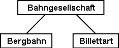
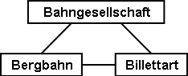
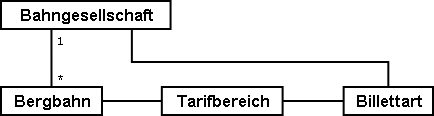
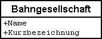
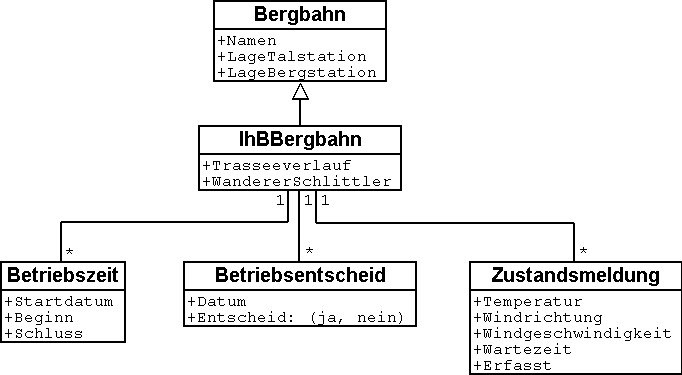
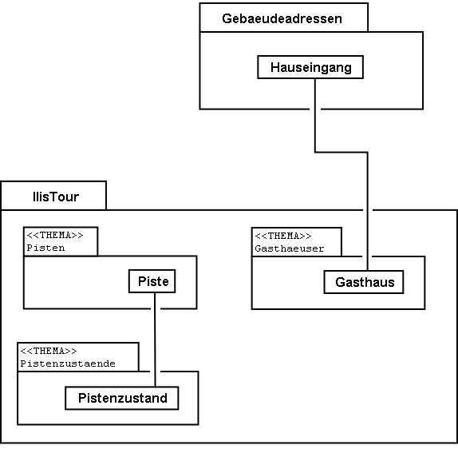
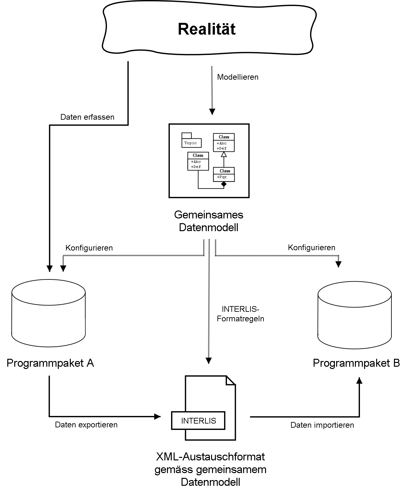
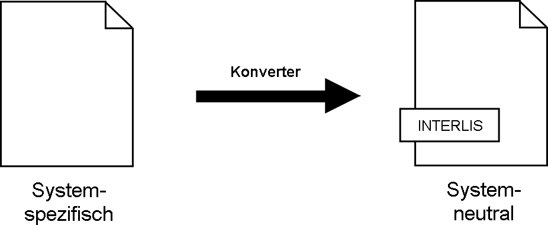
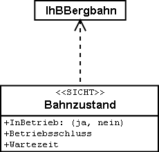

[#_2]
== Überblick am Beispiel Ilistal

[#_2_1]
=== Aufbruchstimmung im Ilistal

[#_2_1_1]
==== Der Startschuss

Die Ferienregion Ilistal hat sich entschlossen, ihre Webpage auf Vordermann zu bringen. Das vielfältige Transportangebot soll interaktiv mittels eines grafischen Dialogs abrufbar sein. Die Präsentation im Gemeindehaus war beeindruckend: Schöne Bilder, trendige Abkürzungen wie HTML, XML, GIS, SVG! Sogleich kamen natürlich weitere Wünsche auf. Im Bauamt entschloss man sich kürzlich, die Adressen nach der neuen Norm zu erfassen. Das könnte man doch nutzen! Der Direktor der Ilishornbahnen erinnert sich, dass der nationale Bergbahnenverband einen Dienst einrichten möchte, über den das landesweite Bergbahn­angebot verfügbar ist. Dabei sollen auch die Fahrpreise und insbesondere die verschiedenen Verbundabonnemente abrufbar sein. Sein Kollege, der für die technischen Belange zustän­dig ist, macht darauf aufmerksam, dass er auf seinem Compi die ganze Infrastruktur ver­walte. Informationen über die Bahntrassees und die Pisten könne er schon liefern. Da sei aber nicht alles klar. Kürzlich habe er nämlich auf dem Bauamt gefragt, ob er nicht die Daten der neuen Überbauung «Im Oberboden» haben könne. Sie hätten es dann schliesslich hin­gekriegt. Einige Informationen seien zwar verloren gegangen. Die seien aber nicht so wichtig gewesen.

Da wird die Gemeindepräsidentin hellhörig. Eine Kollegin, die in einer Gemeinde nahe der Hauptstadt tätig ist, hat ihr doch erzählt, dass sie in einem Teilbereich bereits die dritte Software im Einsatz hätten. Zusatzwünsche, die sie eigentlich normal fand, führten jeweils zur vollständigen Überarbeitung. Sie hätten dann Unterstützung von einem Informatiker erhalten, der weniger von den verschiedenen Techniken sprach. Vielmehr habe man zuerst gemeinsam überlegt, welche Daten mit den Problemen verbunden seien. Seitdem man so vorgehe, sei es auch viel besser möglich, schrittweise Erfolge zu erzielen.

Die Gemeindepräsidentin, eine freundliche aber entschlossene Frau, beauftragt darum den Bausekretär, sich zusammen mit dem technischen Leiter der Ilishornbahnen um die Sache zu kümmern. Als Fachmann zieht sie den Informatiker ihrer Kollegin bei.

[#_2_1_2]
==== Erste Auslegeordnung

Beim ersten Gespräch der Arbeitsgruppe purzelten die verschiedenen Stichworte und Argumente anfänglich noch wild durcheinander: Mit welchem Programmpaket arbeitet der nationale Verband? Meint man nur die Bahnunternehmung oder jede einzelne Bahn, jeden Skilift? Die einzelnen Bahnen, aber auch die Gebäude sind ja bereits in der amtlichen Vermessung enthalten. Wie kann man diese Daten brauchen? Was passiert, wenn Daten ändern, wenn neue Daten hinzukommen? Aber mein Programmpaket versteht nur DXF! Und ich nur Bahnhof!

Das gab das Zeichen, um kurz inne zu halten. Man erinnerte sich an die alte römische Devise «Divide et impera» und begann Ordnung zu machen, um der Sache Herr zu werden. Im Vordergrund standen zuerst folgende Fragen:

* Wer braucht welche Daten?
* Wer erfasst sie und führt sie nach?

.Die verschiedenen Beteiligten und die Datenströme.

Aber wie kommen die Daten nun vom Bearbeiter zum Nutzer? E-Mail, FTP, DXF, ASCII – schon ging's wieder los. Der Informatiker empfahl, diese Frage mal etwas zurückzustellen und sich darum zu kümmern, wie die Daten modelliert seien. Modelliert? Wir wollen doch eine Informatiklösung und kein Holzmodell für unser schönes Ilistal. Die Frage, was ein Datenmodell ist, sprengte den Rahmen der ersten Sitzung. Nur soviel: Es soll beschreiben, wie die Daten aufgebaut sind. Welche Eigenschaften haben die verschiedenen Objekte? Welche Objekte stehen mit welchen anderen Objekten in Beziehung? Und das nicht einfach als Aufsatz, sondern in einer klaren, präzisen bildlichen oder formalen Sprache!

[#_2_2]
=== Erste Gehversuche

[#_2_2_1]
==== Der nationale Tourismusverband hat Vorarbeit geleistet

Der nationale Tourismusverband bietet mit seinem Programmpaket NatTourSys einen Überblick zu den verschiedenen Billetten der Bergbahnen an. Die Billette werden durch die einzelnen Bahngesellschaften herausgegeben. Der Tourist interessiert sich aber vor allem dafür, auf welchen Bergbahnen welche Billette gültig sind. Bevor sie in ihr eigenes Projekt einsteigen, wollen sich die Ilistaler zunächst eine Übersicht verschaffen.

Eines ist klar: Im Zusammenhang mit dem Programmpaket muss man über Bergbahnen, Bahngesellschaften und Billette sprechen.

Was meint man wirklich, wenn man von Billetten spricht? Wirklich das einzelne Billett, das verkauft wird? In dieser Anwendung sicher nicht. Man möchte die einzelnen Arten von Bil­letten beschreiben. Besser sprechen wir darum gleich von Billettarten. Die verschiedenen Gegenstände haben offensichtlich weitergehende Eigenschaften: Bei den Billettarten kann man z.B. von einem Preis und von einer Gültigkeitsdauer sprechen.

* *Bergbahn* – Eine Bergbahn transportiert Passagiere zwischen ihrer Tal- und ihrer Bergstation. Ein Beispiel für eine Bergbahn ist die Standseilbahn Ilisdorf – Ilishorn. Es gibt aber auch Zahnrad-, Luftseil- und Gondelbahnen sowie Ski- und Sessellifte. Auch der neuartige Schneebus kann als Bergbahn angesehen werden. Jede Bergbahn besitzt einen Namen.
* *Billettart* – Eine Billettart ist eine bestimmte Art eines Billetts. Beispiele für Billettarten sind der Sportpass zu 195 Talern, der sieben Tage lang auf allen Bahnen in der ganzen Region Ilistal gültig ist, oder der am Ausstellungstag gültige «Dino-Pass» für den Ponylift zu 10 Talern.
* *Bahngesellschaft* – Eine Bahngesellschaft betreibt Bergbahnen. Sie besitzt einen Namen und manchmal auch eine Kurzbezeichnung. Ein Beispiel sind die Ilishornbahnen mit der Abkürzung IhB. Jede Bahngesellschaft erhält einen bestimmten Anteil an den Verkäufen jener Billette, die auf ihren Bahnen gültig sind. Eine Bahngesellschaft kann die Tochter- oder Muttergesellschaft einer anderen sein.

[NOTE]
Der *Objektkatalog* einer Anwendung listet die Gegenstände auf, die dabei wesentlich sind, und beschreibt sie in Worten möglichst gut.

Beschreibt man nun alle Eigenschaften der Gegenstände in Worten, wird bald einmal die Übersicht relativ schwierig. «Ein Bild sagt mehr als tausend Worte» kommt einem in den Sinn. Ein Objektdiagramm – das wär's! Aber eigentlich wollen wir ja gar nicht die einzelnen Objekte beschreiben. Wir möchten vor allem aufzeigen, welche gleichartigen Gegenstände es gibt und welche Eigenschaften sie haben.

Mit einem solchen Diagramm sieht man das Wichtigste ganz gut:

.Ein erster Ansatz eines Datenmodells.

[NOTE]
====
Bergbahn, Billettart und Bahngesellschaft sind *Objektklassen* (Kästchen). Zwi­schen ihnen bestehen *Beziehungen* (Verbindungslinien). Die Gesamtheit der Definitionen für die Klassen und ihre Beziehungen bildet das *Datenmodell*. Ihre bildliche Darstellung erfolgt mit *Klassendiagrammen*.

_Mit Objektklassen verwandte Begriffe sind: Entitätsmenge, Tabelle, Typ, ..._

_Mit Beziehungen verwandte Begriffe sind: Assoziation, Verweis, Verknüpfung, (gegenseitige) Zeiger, ..._

_Mit Datenmodell verwandte Begriffe sind: (konzeptuelles) Schema, Datenbeschreibung, ..._
====

Objektklassen werden mit Substantiven bezeichnet. Es wird die Einzahl verwendet, weil man ausdrücken möchte, dass jedes einzelne Objekt (z.B. also jede einzelne Bergbahn) die mit der Klasse beschriebenen Eigenschaften hat.

[NOTE]
====
Jede einzelne Bergbahn, jede Bahngesellschaft, jede Billettart wird durch ein konkretes *Objekt* beschrieben. Die Objekte sind die *Daten*, deren Struktur und Zusammenhänge durch das Modell beschrieben werden.

_Mit Objekt verwandte Begriffe sind: Exemplar, Instanz, Ausprägung, Datensatz, Zeile, Tupel, Ein­trag, ..._
====

Jede Bergbahn wird von einer Bahngesellschaft betrieben. Diese bietet bestimmte Billett­arten an. Ohne zusätzliche Informationen müssen sie jeweils für alle ihre Bergbahnen gültig sein. Damit wird man kaum zufrieden sein, da grössere Gesellschaften durchaus Billettarten herausgeben, die nur für einen Teil ihrer Bahnen gelten. Als nahe liegende Idee führt man eine weitere Beziehung zwischen Bergbahn und Billettart ein. Es wird also bei jeder Billettart aufgezählt, für welche Bergbahnen sie gilt:

.Das Datenmodell wurde um eine Beziehung Bergbahn – Billettart erweitert.

Häufig sind aber mehrere Billettarten (z.B. Tageskarte, Wochenkarte, etc.) im gleichen Bereich gültig. Mit dem bis jetzt formulierten Modell müssten die Zuordnungen für jede Billett­art einzeln erstellt werden. Das ist eher mühsam und fehleranfällig. Darum hat wohl auch der nationale Tourismusverband ein etwas verfeinertes Modell gewählt:

.Revidiertes Datenmodell. Der Knick in der Verbindungslinie zwischen Bahngesellschaft und Billettart hat nichts zu bedeuten.
image::img/image7.png[width=265,height=71]

[WARNING]
Es lohnt sich, zunächst zu überlegen, welche Objektklassen für die Problemstellung nötig sind und wie sie zueinander in Beziehung stehen. Dabei sind die Eigenschaften der Objekte noch relativ unbedeutend. Wichtiger ist, dass geeignete Begriffe gesucht werden.

[#_2_2_2]
==== Wie viele Bahnen betreibt eine Bahngesellschaft?

Mehrere Bergbahnen können einer Bahngesellschaft zugeordnet werden. Einer Bahngesellschaft können umgekehrt mehrere Bergbahnen zugeordnet werden. Mehrere? Wie viele genau?

[NOTE]
Die *Kardinalität* hält fest, wie viele Objekte der andern Art einem Objekt der einen Art zugeordnet sind.

In der Grafik wird die minimale und maximale Zahl der zulässigen anderen Objekte am Ende der Beziehungslinie bei der Klasse der anderen Objekte angemerkt. Ist die Zahl nach oben nicht beschränkt ist, schreibt man einen Stern (++*++) oder lässt die Angabe weg.

.Eine Bergbahn wird von genau einer (1) Bahngesellschaft betrieben. Umgekehrt kann aber eine Bahngesellschaft beliebig viele (++*++) Bergbahnen betreiben.

[#_2_2_3]
==== Bergbahnen, Bahngesellschaften und Abonnements haben Eigenschaften

Selbstverständlich ist es für die geplante Anwendung nötig, dass eine Bergbahn, eine Bahn­gesellschaft, usw. detaillierter beschrieben wird. Eine Gesellschaft wird einen Namen und (bei Bahnen typisch) eine Kurzbezeichnung haben (z.B. Ilishornbahnen, IhB).

.Die Objektklasse Bahngesellschaft mit Namen und Kurzbezeichnung.

[NOTE]
====
Name und Kurzbezeichnung bezeichnen *Attribute* der Objektklasse Bahn­gesellschaft.

_Mit Attribut verwandte Begriffe sind: Kolonne, Feld, Eigenschaft, ..._
====

Bei diesen beiden Attributen ist es bereits durch die Bezeichnung recht offensichtlich, von welcher Art sie sind: Texte. Beim Preis einer Billettart werden weitere Angaben schon etwas wichtiger: Franken, Euro, Dollar, Ahländer Taler? Bei der Gültigkeitsdauer würde es vor allem dann anspruchsvoller, wenn sie nicht einfach mit einer Anzahl von Tagen beschrieben werden kann. Will man bei einer Bahn die Länge angeben, ist es natürlich auch von Belang, ob sie in Meter oder Kilometer beschrieben wird. Für die bearbeitenden Programme ist es wichtig zu wissen, wie lang die vorgesehenen Textattribute werden dürfen oder in welchem Bereich die vorgesehenen Zahlen liegen dürfen.

[NOTE]
====
Der *Typ* eines Attributs beschreibt, welche Werte das Attribut annehmen kann und welche Bedeutung sie haben.

_Ein mit Typ verwandter Begriff ist Wertebereich._
====

.Die Objektklasse «Bahngesellschaft» besitzt einen Namen und eine Kurzbezeichnung.
[%autowidth]
|===
2+|Objektklasse Bahngesellschaft

|Name:
|Text +
 _Länge: Höchstens hundert Zeichen_
|Kurzbezeichnung:
|Text +
 _Länge: Höchstens zehn Zeichen_
|===

Der Typ der Eigenschaft «Name» ist ein Text mit maximal hundert Zeichen. Für die Eigenschaft «Kurzbezeichnung» sind dagegen höchstens zehn Zeichen zugelassen.

Man kann sich aber auch gut andere Attributtypen vorstellen:

.Die Objektklasse Billettart mit ihren Eigenschaften und deren Typen.
[%autowidth]
|===
2+|Objektklasse Billettart

|Name:
|Text +
 _Länge: Höchstens hundert Zeichen_
|Preis:
|Zahl +
 _Genauigkeit: Zwei Stellen nach dem Komma_ +
 _Zulässiger Bereich: Zwischen 0 und 5000_ +
 _Einheit: Ahländer Taler_
|===

Anders als eine Billettart oder eine Bergbahngesellschaft ist die Talstation einer Bergbahn ein Gegenstand, der real an einem bestimmten Ort existiert. Orte werden sinnvollerweise mittels Koordinaten innerhalb eines bestimmten Koordinatensystems, z.B. des Landessystems, beschrieben.

.Die Objektklasse Bergbahn mit ihren Eigenschaften und deren Typen.
[%autowidth]
|===
2+|Objektklasse Bergbahn

|Name:
|Text +
 _Länge: Höchstens hundert Zeichen_
|Lage der Talstation:
|Punkt +
 _Koordinatensystem: Ahländer Landeskoordinaten_
|Lage der Bergstation:
|Punkt +
 _Koordinatensystem: Ahländer Landeskoordinaten_
|===

Für jede Eigenschaft wird somit ein passender Attributtyp festgelegt. Im Fall einer Skipiste ist der Schwierigkeitsgrad eine Aufzählung. Der Verlauf der Skipiste ist dagegen eine gerichtete Linie in Ahländer Landeskoordinaten. Details zu verschiedenen Typen werden in <<_6>> besprochen.

.Die Objektklasse Skipiste mit ihren Eigenschaften und deren Typen.
[%autowidth]
|===
2+|Objektklasse Skipiste

|Verlauf:
|Gerichtete Linie +
 _Koordinatensystem: Ahländer Landeskoordinaten_
|Schwierigkeitsgrad:
|Aufzählung +
 _Mögliche Werte: blau, rot, schwarz_
|===

[#_2_2_4]
==== Modelle? Ilistal will Daten!

Nach all diesen doch eher theoretischen Dingen drängen die Ilistaler nun auf Taten. Eine An­frage beim nationalen Tourismusverband ergab, dass dieser ein einfaches Programm zur Datenerfassung gemäss seinen Anforderungen zur Verfügung stellt. Mit diesem können die Daten im INTERLIS-Format exportiert und dann dem nationalen Tourismusverband geschickt werden. Der Informatiker wendete zwar ein, dass damit höchstens ein erster Test gemacht werden könne und man die Daten nachher im Programmpaket der Ilishornbahnen oder in demjenigen des Bauamtes halten sollte. Diesen Test wollte man aber schon machen. Schliesslich sollte damit ja nicht soviel Arbeit verbunden sein. Denn so umfangreich sind die Ilishornbahnen auch wieder nicht, und die Anzahl Billettarten hält sich auch in Grenzen.

[WARNING]
Hopp-Hopp-Aktionen machen nur dann einen Sinn, wenn sie wirklich nicht mit viel Arbeit verbunden sind.

Zu den Ilishornbahnen gehören folgende Bergbahnen:

* Standseilbahn Ilisdorf – Ilishorn;
* Gondelbahn Ilisbad – Ilisegg;
* Skilift Ilisegg – Ilishorn;
* Sessellift Ilistäli – Ilisegg;
* Ponylifte in Ilisdorf und Ilisbad.

.Die Ilishornbahnen betreiben mehrere Bahnen.
image::img/image11.png[width=450,height=185]

Die Ilishornbahnen bieten dafür folgende Billettarten an:

* Einzelbillette für die Standseilbahn (Preis für eine einfache Fahrt: 10 Taler; für eine Retourfahrt: 18 Taler);
* Einzelbillette für die Gondelbahn (Preis für eine einfache Fahrt: 8 Taler; für eine Retourfahrt: 14 Taler);
* den Wanderer-Pass für die Standseilbahn und die Gondelbahn (Preis für einen Tag 15 Taler; für sieben Tage 55 Taler);
* den Sportpass für alle Bahnen (Preis für einen Tag: 40 Taler, für zwei Tage: 70 Taler, für sieben Tage: 195 Taler; für ein ganzes Jahr: 635 Taler);
* die «Dino-Tageskarte» (10 Taler) und den «Wochenpass Ilosaurus Maximus» (45 Taler) für die Ponylifte.

[#_2_2_5]
==== Ilistal sendet

Für den Test konnte mit dem Programm eine Datei erstellt werden, die alle Daten enthält.

[NOTE]
Die einfachste Transferart ist der *Volltransfer*, bei dem alle Daten vollständig übermittelt werden.

Ein kurzer Blick in die Datei zeigte zwar viel Unverständliches, aber immerhin fand man die Texte «Ilishornbahnen», gleich daneben «IhB», und auch der Abonnementspreis war leicht zu finden.

Gleich noch ein Test: Der Jahrespreis für den Sportpass wird von 635 auf 600 Taler gesenkt und mit der Funktion Nachlieferung eine neue Datei erstellt. Der Anfang sieht zwar noch gleich aus. Die Texte «Ilishornbahnen» und «IhB» fehlen. Aber hier, fast am Schluss – das könnte der neue Preis sein!

[NOTE]
Dank der *inkrementellen Nachlieferung* müssen nach einer Änderung nicht alle Daten, sondern nur die geänderten Objekte übermittelt werden.

Beide Dateien wurden dann wie vereinbart dem Tourismusverband geschickt. Dieser konnte sie offenbar problemlos lesen. Einwand des Informatikers: Das ist ja auch nicht verwunder­lich. Solange wir genau die Daten erfassen, die der Verband will, und dies erst noch mit einem Programm, das der Verband zur Verfügung stellt, kann man das ja schon erwarten. Aber wir Ilistaler wollen doch mehr! Und wir möchten doch wenn immer möglich unsere bisherigen Programmpakete einsetzen.

[#_2_3]
=== Ilistal will mehr

[#_2_3_1]
==== Zielsetzung

Ilistal möchte also nicht einfach den gleichen Service anbieten, wie dies der nationale Tourismusverband tut. Folgende Zusatzleistungen stehen im Vordergrund:

* Anzeige der aktuellen Betriebs- und Wartezeiten der verschiedenen Bahnen und ob sie von Wanderern und Schlittlern benützt werden können;
* Anzeige der Pisten inkl. Schwierigkeitsgrad und Befahrbarkeit;
* bildliche Darstellung (inkl. Anzeige der Wälder und Strassen);
* Anzeige der Gasthäuser der Region;
* Anzeige, wo sich die Gebäude mit welcher Postadresse befinden.

[#_2_3_2]
==== Ilistal nutzt Vorhandenes

Die für die bildliche Darstellung nötigen Daten der Wälder und Strassen möchte man natürlich nicht selbst erfassen, denn das Bauamt hat schliesslich die Daten der amtlichen Vermessung, welche auch Wälder und Strassen enthalten. Und das Bauamt hat doch damit begonnen, die Gebäudeadressen gemäss der neuen Norm zu erfassen. Nun macht es wenig Sinn, im Datenmodell von Ilistal all diese Definitionen zu wiederholen. Man möchte einfach die vorhandenen Modelle der amtlichen Vermessung und der Gebäudeadressen nutzen.

[NOTE]
====
Ein Datenmodell ist nicht eine isolierte Beschreibung, sondern kann auf bereits bestehenden Datenmodellen aufbauen.

_Im Sinne des Aufbauens verwandte Begriffe zu Datenmodell sind: Module, Pakete, Packages, ..._
====

.Das Ilistaler Tourismus-Datenmodell (IlisTour) braucht nicht alles selbst zu definieren. Stattdessen baut es auf anderen Modellen auf: Es verwendet Teile des nationalen Tourismus-Modells (NatTour), der nationalen Grundlagen von Ahland, der amtlichen Vermessung, der Gebäudeadressen sowie allgemeine Grundlagen. Die gestrichelte Linie mit gefülltem Pfeil steht für die Abhängigkeit. Häufig wird die allgemeine Grundlage wie hier oben, der Spezialfall unten gezeichnet. Die umgekehrte Schreibweise ist jedoch ebenfalls verbreitet.
image::img/image12.png[width=266,height=267]

[#_2_3_3]
==== Ilistal geht weiter als der nationale Verband

Das Modell des nationalen Tourismusverbandes wollen die Ilistaler aber nicht einfach so nutzen, wie es ist. Damit man eine bildliche Darstellung machen kann, muss doch bei jeder Bergbahn auch der Trasseeverlauf beschrieben sein. Zudem möchte man festhalten, ob die Bahn durch Wanderer und Schlittler benutzbar ist, wann sie in Betrieb ist und wie lange die aktuelle Wartezeit ist. Es wäre nahe liegend, eine eigene Klasse für die Ilistaler Bergbahnen zu definieren. Sollen dabei die Attribute der Klasse Bergbahn des nationalen Verbandes wiederholt werden? Und da gibt es noch die Beziehung zwischen Bergbahnen und Tarifbereichen. Was würde eine eigene Klasse für diese Beziehung heissen?

Zum Glück gibt es für solche Fälle die Vererbung.

.Eine IhBBergbahn ist eine spezielle Bergbahn mit zusätzlichen Attributen: Trasseeverlauf sowie Benutzbarkeit für Wanderer und Schlittler. Die aus- +
image::img/image13.png[width=102,height=99]

gezogene Linie mit weisser Pfeilspitze bezeichnet die Spezialisierung.

[NOTE]
====
Die Klasse der Ilistaler IhB-Bergbahn ist eine *Erweiterung* der Klasse der Berg­bahnen. Sie *erbt* damit alle Eigenschaften der Bergbahnen und fügt weitere hinzu. ++[++Details der Vererbung werden in <<_5>> beschrieben++]++.

_Mit Erweiterung verwandte Begriffe sind: Spezialisierung, Subklasse, ..._
====

Wäre es nun richtig, in der Klasse IhBBergbahn gleich auch die Attribute Betriebszeit und aktuelle Wartezeit aufzunehmen? Wäre die Betriebszeit direkt ein Attribut von IhBBergbahn, könnte für jede Bahn genau eine, typischerweise die aktuelle Betriebszeit festgehalten werden. Der Betriebsleiter legt aber die Betriebszeiten jeweils zu Saisonbeginn fest: In der Vorsaison sind einzelne Lifte noch nicht in Betrieb, andere haben Mittagspause; über die Weihnachtstage ist voller Betrieb von 9 bis 15.30 Uhr; ab Mitte Februar – wenn die Tage länger werden – wird die Betriebszeit schrittweise bis 16.30 ausgedehnt. Je nach Schnee- und Wetterverhältnissen wird dann der Betrieb einzelner Bahnen vorübergehend stillgelegt.

.Betriebszeiten sind neu als eigenständige Objekte definiert.

Legt man zudem noch fest, dass eine bestimmte Betriebszeit für verschiedene Bahnen gelten kann, kann der Erfassungsaufwand noch weiter gesenkt werden. Bei den Wartezeiten macht dies natürlich keinen Sinn. Eine zu einem bestimmten Zeitpunkt beobachtete Warte­zeit muss derjenigen Bahn zugeordnet werden, bei der entsprechend gewartet werden muss. Warum hält man die Wartezeit also nicht direkt auf der IhBBergbahn fest? Folgende Gründe sprechen dagegen:

* Dank der Speicherung der Wartezeiten als eigenständige Objekte können sie zu einem späteren Zeitpunkt (z.B. für Statistiken) ausgewertet werden.
* Der Änderungsrhythmus und die Zuständigkeit für die Werte sind ganz anders als bei den Attributen der IhBBergbahn-Klasse.

[WARNING]
Bei den Eigenschaften, die auf den ersten Blick einer Klasse zugeordnet werden, muss immer genau überlegt werden, ob dies wirklich korrekt ist, oder ob sie besser in selb­ständige, über Beziehungen zugeordnete Klassen verschoben werden.

Bei diesen Überlegungen ist der tatsächliche Sachverhalt und nicht die Nutzung z.B. für Dar­stellungen massgebend. Wichtig sind aber auch die organisatorischen Verhältnisse. Wer ist für die Nachführung der Daten zuständig? In welchen Rhythmus werden sie nachgeführt?

Im Modell des nationalen Verbandes sind die einzelnen Bergbahngesellschaften für die Nachführung ihrer Daten verantwortlich. Das Ilistaler Modell möchte – was die Bergbahnen betrifft – das Modell des nationalen Verbandes zwar nutzen, es aber für die Ilishorn-Berg­bahnen erweitern.

[NOTE]
Datenmodelle werden in *Themen* gegliedert, um den organisatorischen Verhält­nissen (z.B. unterschiedliche Verantwortlichkeiten und Nachführungsrhythmen) gerecht zu werden.

Das Ilistaler Modell erweitert darum das vom nationalen Verband vorgegebene Thema Bergbahnen zu IhBBergbahnen. In dieser lokalen Erweiterung ist definiert, dass die Klasse IhBBergbahn die Klasse Bergbahn spezialisiert und um zusätzliche Attribute erweitert.

Da die Betriebszeiten, die Betriebsentscheide und die Zustandsmeldungen teilweise durch verschiedene Stellen, vor allem aber in völlig anderem Rhythmus erfasst werden, werden sie je in eigenen Themen (IhBPlanung, IhBBetrieb, IhBAktuell) definiert.

.Das Ilistaler Modell (IlisTour) erweitert das Modell des nationalen Tourismus-Verbands (NatTour). IlisTour erbt das Thema Bergbahnen von NatTour, erweitert die Klasse Bergbahn zu IhBBergbahn und fügt weitere Themen für Planung, Betrieb und Aktuelles an.
image::img/image15.png[width=354,height=359]

[NOTE]
Vererbung gibt es nicht nur im Kleinen (Objektklassen), sondern auch im Grossen (ganze Themen).

[#_2_3_4]
==== Ilistaler Spezialitäten

Zusätzlich möchten die Ilistaler auch Pisten und Gasthäuser beschreiben. Sie fügen dem Ilis­taler Modell darum noch weitere Themen zu.

.Das Ilistaler Tourismus-Modell wird um weitere Themen ergänzt.

Besonders bei den Gasthäusern stellen sich wieder Fragen. Wie soll z.B. der Schnellimbiss INTERLUNCH bildlich dargestellt werden? Man weiss zwar, dass er an der Dorfstrasse 27 liegt. Aber damit kann man kein Symbol auf dem Plan platzieren! Die Lösung liegt in der Nutzung der Gebäudeadressen. Dort gibt es eine Klasse Hauseingang, die auch ein Lageattribut (in Landeskoordinaten) aufweist. In der Klasse Gasthaus wird darum gar keine Adresse geführt, sondern eine Beziehung zum Hauseingang definiert. Konkret wird das Objekt, welches dem Hotel Sonne entspricht, mit dem Hauseingang-Objekt verbunden, das die Dorfstrasse 27 beschreibt.

[#_2_3_5]
==== Wie implementieren die Ilistaler ihre Spezialitäten?

Ein Konzept regelt die Anforderungen, nicht aber die Implementation. In der Implementation ist man grundsätzlich frei. Die Ilishornbahnen haben sich für ein standardisiertes Programm­paket (LiftSys) entschieden, das allerdings nur Daten gemäss dem erweiterten Modell be­handeln kann. Es ist aber ohne weiteres zulässig, auf die Klasse Bergbahn zu verzichten und deren Attribute gleich in der Klasse IhBBergbahn einzufügen.

.Das Programmpaket für den Ilistaler Tourismus braucht sich nur grob ans konzeptuelle Modell zu halten. Es kann zum Beispiel intern zwei Objektklassen zu einer einzigen zusammenfassen. Wichtig ist nur, dass das Paket in der Lage ist, die Daten in jenem Format zu liefern, das dem konzeptuellen Modell entspricht.
image::img/image17.png[width=391,height=99]

Analog zur Behandlung der Klassen gemäss Konzept stellen sich verschiedene weitere Fragen, wie ein bestimmtes Computersystem die Vorstellungen umsetzt, die mit dem kon­zeptuellen Modell verbunden sind.

[#_2_3_6]
==== Wie schicken die Ilistaler ihre Daten an den nationalen Tourismusverband?

Nachdem das LiftSys-Programmpaket eingerichtet und die Daten erfasst sind, stellt sich wieder die Frage, wie die Daten dem nationalen Verband übermittelt werden können. Dieser will natürlich nicht alle Daten, sondern nur diejenigen, die ihn interessieren. Der nationale Verband ist z.B. weder an Pisten noch an der Eignung für Wanderer und Schlittler inter­essiert.

[NOTE]
Ein INTERLIS-Datentransfer umfasst immer die Daten von einem oder mehreren Themen.

Die Ilistaler wollen darum dem nationalen Verband die Daten der Themen Bergbahnen und Billette schicken. Aber wie kann ein Programmpaket eine korrekte Transferdatei erstellen – der Hersteller kannte doch die Spezifikationen des Tourismusverbandes gar nicht? Die Lösung liegt im _modellbasierten Transfer_.

[NOTE]
Bei einem *modellbasierten Transfer* gibt es nicht ein ganz bestimmtes *Transferformat*. Vielmehr richtet sich das Format nach dem Datenmodell.

Jede Modellierungsmethode (z.B. INTERLIS, oder die Definitionen, mit denen ein bestimm­tes Programmpaket eingerichtet wird) stellt bestimmte Ausdrucksmittel (Objektklassen, Attri­bute, Typen, Beziehungen, Tabellen, Kolonnen, usw.) zur Verfügung. Für jedes solche Aus­drucksmittel wird unabhängig vom konkreten Datenmodell geregelt, welche Wirkungen es auf den Transfer hat. Von einem konkreten Transferformat, also der genauen Reihenfolge der Zeichen, welche die jeweiligen Daten repräsentieren, kann man somit erst sprechen, wenn das zugehörige Datenmodell bekannt ist. Ja, das Transferformat ergibt sich direkt aus dem Datenmodell.

Wäre LiftSys in der Lage, das interne Datenmodell direkt gemäss dem konzeptuellen Datenmodell aufzubauen, und würde es zusätzlich die Umsetzung der Daten in Transfer­dateien gemäss den Spezifikationen von INTERLIS unterstützen, wäre alles kein Problem. Die Transferdateien könnten genau so einfach erstellt werden wie mit dem Testprogramm des Verbandes.

Das Programmpaket des Bauamtes (BauSys) unterstützt zum Beispiel die Erstellung von INTERLIS 2-konformen Dateien. Es kennt aber nur einzelne Tabellen, die jeweils mehrere Kolonnen aufweisen können. Da die Formatierungsregeln von INTERLIS so aufgebaut sind, dass die Vererbungsstruktur sich in der Transferdatei nicht direkt spiegelt, könnten mit BauSys direkt korrekte Dateien erstellt werden. Die Umsetzung von den internen in die externen Daten kann man sich wie folgt vorstellen:

.Die internen Daten des Programmpakets A werden in eine Transferdatei umgesetzt, deren Aufbau gemäss den Formatregeln von INTERLIS aus dem Datenmodell folgt. +

Die Daten können danach in Programmpaket B importiert werden. Voraussetzung ist, dass die beteiligten Programmpakete entsprechend dem Datenmodell konfiguriert worden sind.

Das LiftSys unterstützt aber INTERLIS nicht. Was nun? Müssen sich die Ilishornbahnen mit dem Kauf eines neuen Programmpakets beschäftigen? Der Ausweg ist offensichtlich: LiftSys exportiert die Daten in einem anderen Format, diese werden dann mit einem Konversions­programm nach INTERLIS umgeformt. Das Konversionsprogramm kann entweder spezifisch für das konkrete Datenmodell oder allgemein als modellbasiertes Werkzeug realisiert sein.

.Ein Konverter erstellt INTERLIS-Dateien aus einem Format, das spezifisch für ein bestimmtes Computersystem ist.

Nachdem alles glücklich funktionierte, wird die Datei an den nationalen Verband geschickt. Das Echo: «Fast gut – beim Namen des Sesselliftes auf die Ilisegg gibt es aber ein Problem!» Uff – das kennen wir doch auch aus verschiedenen E-Mails: «Ilistäli»; immer diese Umlaute.

Zwei Dinge sollten klar unterschieden werden:

[NOTE]
Der *Zeichenvorrat* legt fest, welche Zeichen bei Text-Attributen überhaupt verwendet werden dürfen.

[NOTE]
Die *Zeichencodierung* legt fest, welches Bitmuster das Zeichen im Computer repräsentiert.

Die Umlaute gehören zum erlaubten Zeichenvorrat von INTERLIS. Aber bei der Konversion wurde vergessen, die Zeichencodierung der Daten, die vom LiftSys kamen, korrekt anzugeben. Nach der Korrektur erhält Ilistal ein positives Echo vom Verband.

[#_2_3_7]
==== Was macht der nationale Tourismusverband mit den Ilistaler Daten?

Über etwas sind nun die Ilistaler ein wenig erstaunt: Was hat das Computersystem des nationalen Tourismusverbands (NatTourSys) wohl mit den zusätzlichen Attributen ange­fangen – etwa mit der Eignung für Wanderer und Schlittler oder gar dem Trasseeverlauf? Die Lösung klingt simpel: NatTourSys hat sie einfach ignoriert.

[NOTE]
*Polymorphes Lesen* erlaubt, dass die Daten gemäss einem «reduzierten» Modell, d.h. einem Modell, das zusätzliche Erweiterungen noch nicht kennt, gelesen werden können.

Die Ilistaler haben die Daten zwar so geschickt, dass sie alle Erweiterungen gemäss dem Ilistaler Modell enthalten. Die Transferregeln von INTERLIS sorgen dafür, dass die Daten dennoch gemäss dem Modell des nationalen Tourismusverbandes gelesen werden können, ohne dass das Leseprogramm wegen der zusätzlichen Daten aus dem Takt gerät. Bedin­gung ist nur, dass das Modell, gemäss dem die Daten erstellt wurden, eine Erweiterung jenes Modells ist, das der Empfänger der Daten benutzt. Das Ilistaler Modell muss also das Modell des nationalen Tourismusverbandes erweitern.

<<_5>> erläutert näher, wofür Erweiterungen nützlich sind. <<_8>> befasst sich mit den Details des Datentransfers.

Dabei ist es auf der lesenden Seite möglich, dass die Daten direkt mit dem Programmpaket des Empfängers gelesen werden oder dass auch hier ein Konversionsprogramm zwischengeschaltet wird. Und auch hier gilt wieder, dass die konkreten Zeichen der Text-Attribute korrekt umgesetzt werden. Das «ä» von Ilistäli kann durchaus im LiftSys, auf der Transferdatei und im NatTourSys je unterschiedlich codiert sein. Für die jeweiligen Programme ist es immer klar, dass es ein «ä» ist.

[#_2_4]
=== Ilistal hat es geschafft

[#_2_4_1]
==== Systemübersicht

Beim Internet hat man sich für eine relativ einfache Lösung entschieden: Der Situationsplan wird als statisches Bild durch das Programmpaket LiftSys erstellt und danach einem Web-Präsentationssystem (WebSys) zur Verfügung gestellt. Um den aktuellen Zustand der Bah­nen abfragen zu können, werden bestimmte Bereiche im Bild markiert. Wird mit der Maus auf einen dieser Flecken geklickt, erscheinen die aktuellen Zustandsdaten der betreffenden Bahn. Zudem sollen die Hotels mit freien Zimmern speziell markiert werden.

[#_2_4_2]
==== Für die Web-Seite ist nur der aktuelle Zustand interessant

Die Ilistaler haben sich Mühe gegeben und ihr Modell vor allem auch für die betrieblichen Daten der Bahnen und Pisten sauber strukturiert. Nur ist leider das Programm, welches lau­fend die Internetseite aktualisiert, nicht in der Lage, aus der Vielzahl von Betriebszeiten, Betriebsentscheiden und Zustandsmeldungen den jeweils aktuellen Zustand abzuleiten. Der Betreiber möchte einerseits die Daten gemäss dem Thema IhBBillette immer dann erhalten, wenn etwas geändert hat. Andererseits möchte er aber über den betrieblichen Zustand der Bergbahnen alle 20 Minuten eine neue Mitteilung erhalten.

[NOTE]
====
Eine *Sicht* definiert Daten, die der Auffassung eines Nutzers entsprechen und darum aus den Originaldaten abgeleitet werden müssen.

_Verwandte Begriffe: View, abgeleitete Daten, ..._
====

Die verlangte Sicht verbindet Betriebszeiten, Betriebentscheide und Wartezeiten mit derjeni­gen Bergbahn, der sie gemäss Beziehung zugeordnet sind und filtert so, dass nur der aktuelle Zustand beschrieben wird.

[NOTE]
Von der Anwendung aus gesehen können Sichtobjekte gleich wie Datenobjekte aufgefasst werden. Sichten werden darum auch mittels Sichtklassen beschrie­ben.

.Der Bahnzustand ist keine eigenständige Objektklasse, sondern wird +

über eine Sicht von IhBBergbahn abgeleitet. Die Sicht fasst jene Daten +
zusammen, die für das Darstellen auf einer Internet-Seite benötigt werden.

[#_2_4_3]
==== Hotels mit freien Betten auf der Web-Seite darstellen

Damit WebSys eine zusätzliche Markierung anbringen kann, in welchen Hotels es noch freie Zimmer gibt, braucht es natürlich die nötigen Informationen. Ähnlich wie bei den Zuständen der Bahnen wird darum auch für Hotels eine Sicht definiert. Sie enthält einerseits die nötigen Daten der Gasthausobjekte, andererseits die Lagekoordinaten gemäss dem zugeordneten Hauseingang.

[NOTE]
Mit INTERLIS können auch die benötigten *Symbole systemneutral definiert* und die Umsetzung von Original- oder Sichtdaten in *Grafik* beschrieben werden.

Leider ist WebSys aber nicht in der Lage, solche Umsetzungsbeschreibungen zu ver­arbeiten. Es ist aber fähig, die Symboldefinitionen zu lesen. Zudem kann es Daten entgegen­nehmen, die aussagen, welches Symbol an welcher Stelle dargestellt werden soll und dann die Darstellung vornehmen. Damit kann eine andere Möglichkeit von INTERLIS ausgenützt werden, die auf LiftSys zur Verfügung steht.

[NOTE]
Mit INTERLIS können auch bereits umgesetzte Grafikdaten transferiert werden.

LiftSys liefert WebSys darum nicht die Sichtdaten der Hotels, sondern setzt diese selbst in Grafikdaten um. Der genaue Aufbau der Grafikdaten kann wiederum mit Klassen definiert werden. Typische Attribute solcher Grafikdaten sind die Position, der Symbolname, die Farbe.

