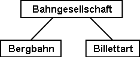
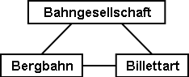
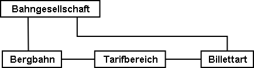
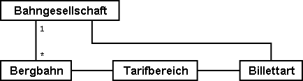
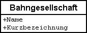
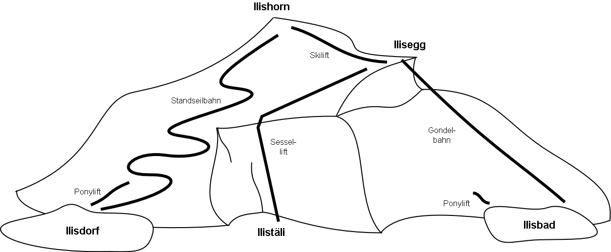

[#_2_2]
=== Erste Gehversuche

[#_2_2_1]
==== Der nationale Tourismusverband hat Vorarbeit geleistet

Der nationale Tourismusverband bietet mit seinem Programmpaket NatTourSys einen Überblick zu den verschiedenen Billetten der Bergbahnen an. Die Billette werden durch die einzelnen Bahngesellschaften herausgegeben. Der Tourist interessiert sich aber vor allem dafür, auf welchen Bergbahnen welche Billette gültig sind. Bevor sie in ihr eigenes Projekt einsteigen, wollen sich die Ilistaler zunächst eine Übersicht verschaffen.

Eines ist klar: Im Zusammenhang mit dem Programmpaket muss man über Bergbahnen, Bahngesellschaften und Billette sprechen.

Was meint man wirklich, wenn man von Billetten spricht? Wirklich das einzelne Billett, das verkauft wird? In dieser Anwendung sicher nicht. Man möchte die einzelnen Arten von Bil­letten beschreiben. Besser sprechen wir darum gleich von Billettarten. Die verschiedenen Gegenstände haben offensichtlich weitergehende Eigenschaften: Bei den Billettarten kann man z.B. von einem Preis und von einer Gültigkeitsdauer sprechen.

* *Bergbahn* – Eine Bergbahn transportiert Passagiere zwischen ihrer Tal- und ihrer Bergstation. Ein Beispiel für eine Bergbahn ist die Standseilbahn Ilisdorf – Ilishorn. Es gibt aber auch Zahnrad-, Luftseil- und Gondelbahnen sowie Ski- und Sessellifte. Auch der neuartige Schneebus kann als Bergbahn angesehen werden. Jede Bergbahn besitzt einen Namen.
* *Billettart* – Eine Billettart ist eine bestimmte Art eines Billetts. Beispiele für Billettarten sind der Sportpass zu 195 Talern, der sieben Tage lang auf allen Bahnen in der ganzen Region Ilistal gültig ist, oder der am Ausstellungstag gültige «Dino-Pass» für den Ponylift zu 10 Talern.
* *Bahngesellschaft* – Eine Bahngesellschaft betreibt Bergbahnen. Sie besitzt einen Namen und manchmal auch eine Kurzbezeichnung. Ein Beispiel sind die Ilishornbahnen mit der Abkürzung IhB. Jede Bahngesellschaft erhält einen bestimmten Anteil an den Verkäufen jener Billette, die auf ihren Bahnen gültig sind. Eine Bahngesellschaft kann die Tochter- oder Muttergesellschaft einer anderen sein.

[NOTE]
Der *Objektkatalog* einer Anwendung listet die Gegenstände auf, die dabei wesentlich sind, und beschreibt sie in Worten möglichst gut.

Beschreibt man nun alle Eigenschaften der Gegenstände in Worten, wird bald einmal die Übersicht relativ schwierig. «Ein Bild sagt mehr als tausend Worte» kommt einem in den Sinn. Ein Objektdiagramm – das wär's! Aber eigentlich wollen wir ja gar nicht die einzelnen Objekte beschreiben. Wir möchten vor allem aufzeigen, welche gleichartigen Gegenstände es gibt und welche Eigenschaften sie haben.

Mit einem solchen Diagramm sieht man das Wichtigste ganz gut:

.Ein erster Ansatz eines Datenmodells.

[NOTE]
====
Bergbahn, Billettart und Bahngesellschaft sind *Objektklassen* (Kästchen). Zwi­schen ihnen bestehen *Beziehungen* (Verbindungslinien). Die Gesamtheit der Definitionen für die Klassen und ihre Beziehungen bildet das *Datenmodell*. Ihre bildliche Darstellung erfolgt mit *Klassendiagrammen*.

_Mit Objektklassen verwandte Begriffe sind: Entitätsmenge, Tabelle, Typ, ..._

_Mit Beziehungen verwandte Begriffe sind: Assoziation, Verweis, Verknüpfung, (gegenseitige) Zeiger, ..._

_Mit Datenmodell verwandte Begriffe sind: (konzeptuelles) Schema, Datenbeschreibung, ..._
====

Objektklassen werden mit Substantiven bezeichnet. Es wird die Einzahl verwendet, weil man ausdrücken möchte, dass jedes einzelne Objekt (z.B. also jede einzelne Bergbahn) die mit der Klasse beschriebenen Eigenschaften hat.

[NOTE]
====
Jede einzelne Bergbahn, jede Bahngesellschaft, jede Billettart wird durch ein konkretes *Objekt* beschrieben. Die Objekte sind die *Daten*, deren Struktur und Zusammenhänge durch das Modell beschrieben werden.

_Mit Objekt verwandte Begriffe sind: Exemplar, Instanz, Ausprägung, Datensatz, Zeile, Tupel, Ein­trag, ..._
====

Jede Bergbahn wird von einer Bahngesellschaft betrieben. Diese bietet bestimmte Billett­arten an. Ohne zusätzliche Informationen müssen sie jeweils für alle ihre Bergbahnen gültig sein. Damit wird man kaum zufrieden sein, da grössere Gesellschaften durchaus Billettarten herausgeben, die nur für einen Teil ihrer Bahnen gelten. Als nahe liegende Idee führt man eine weitere Beziehung zwischen Bergbahn und Billettart ein. Es wird also bei jeder Billettart aufgezählt, für welche Bergbahnen sie gilt:

.Das Datenmodell wurde um eine Beziehung Bergbahn – Billettart erweitert.

Häufig sind aber mehrere Billettarten (z.B. Tageskarte, Wochenkarte, etc.) im gleichen Bereich gültig. Mit dem bis jetzt formulierten Modell müssten die Zuordnungen für jede Billett­art einzeln erstellt werden. Das ist eher mühsam und fehleranfällig. Darum hat wohl auch der nationale Tourismusverband ein etwas verfeinertes Modell gewählt:

.Revidiertes Datenmodell. Der Knick in der Verbindungslinie zwischen Bahngesellschaft und Billettart hat nichts zu bedeuten.

[WARNING]
Es lohnt sich, zunächst zu überlegen, welche Objektklassen für die Problemstellung nötig sind und wie sie zueinander in Beziehung stehen. Dabei sind die Eigenschaften der Objekte noch relativ unbedeutend. Wichtiger ist, dass geeignete Begriffe gesucht werden.

[#_2_2_2]
==== Wie viele Bahnen betreibt eine Bahngesellschaft?

Mehrere Bergbahnen können einer Bahngesellschaft zugeordnet werden. Einer Bahngesellschaft können umgekehrt mehrere Bergbahnen zugeordnet werden. Mehrere? Wie viele genau?

[NOTE]
Die *Kardinalität* hält fest, wie viele Objekte der andern Art einem Objekt der einen Art zugeordnet sind.

In der Grafik wird die minimale und maximale Zahl der zulässigen anderen Objekte am Ende der Beziehungslinie bei der Klasse der anderen Objekte angemerkt. Ist die Zahl nach oben nicht beschränkt ist, schreibt man einen Stern (++*++) oder lässt die Angabe weg.

.Eine Bergbahn wird von genau einer (1) Bahngesellschaft betrieben. Umgekehrt kann aber eine Bahngesellschaft beliebig viele (++*++) Bergbahnen betreiben.

[#_2_2_3]
==== Bergbahnen, Bahngesellschaften und Abonnements haben Eigenschaften

Selbstverständlich ist es für die geplante Anwendung nötig, dass eine Bergbahn, eine Bahn­gesellschaft, usw. detaillierter beschrieben wird. Eine Gesellschaft wird einen Namen und (bei Bahnen typisch) eine Kurzbezeichnung haben (z.B. Ilishornbahnen, IhB).

.Die Objektklasse Bahngesellschaft mit Namen und Kurzbezeichnung.

[NOTE]
====
Name und Kurzbezeichnung bezeichnen *Attribute* der Objektklasse Bahn­gesellschaft.

_Mit Attribut verwandte Begriffe sind: Kolonne, Feld, Eigenschaft, ..._
====

Bei diesen beiden Attributen ist es bereits durch die Bezeichnung recht offensichtlich, von welcher Art sie sind: Texte. Beim Preis einer Billettart werden weitere Angaben schon etwas wichtiger: Franken, Euro, Dollar, Ahländer Taler? Bei der Gültigkeitsdauer würde es vor allem dann anspruchsvoller, wenn sie nicht einfach mit einer Anzahl von Tagen beschrieben werden kann. Will man bei einer Bahn die Länge angeben, ist es natürlich auch von Belang, ob sie in Meter oder Kilometer beschrieben wird. Für die bearbeitenden Programme ist es wichtig zu wissen, wie lang die vorgesehenen Textattribute werden dürfen oder in welchem Bereich die vorgesehenen Zahlen liegen dürfen.

[NOTE]
====
Der *Typ* eines Attributs beschreibt, welche Werte das Attribut annehmen kann und welche Bedeutung sie haben.

_Ein mit Typ verwandter Begriff ist Wertebereich._
====

.Die Objektklasse «Bahngesellschaft» besitzt einen Namen und eine Kurzbezeichnung.
[%autowidth]
|===
2+|Objektklasse Bahngesellschaft

|Name:
|Text +
 _Länge: Höchstens hundert Zeichen_
|Kurzbezeichnung:
|Text +
 _Länge: Höchstens zehn Zeichen_
|===

Der Typ der Eigenschaft «Name» ist ein Text mit maximal hundert Zeichen. Für die Eigenschaft «Kurzbezeichnung» sind dagegen höchstens zehn Zeichen zugelassen.

Man kann sich aber auch gut andere Attributtypen vorstellen:

.Die Objektklasse Billettart mit ihren Eigenschaften und deren Typen.
[%autowidth]
|===
2+|Objektklasse Billettart

|Name:
|Text +
 _Länge: Höchstens hundert Zeichen_
|Preis:
|Zahl +
 _Genauigkeit: Zwei Stellen nach dem Komma_ +
 _Zulässiger Bereich: Zwischen 0 und 5000_ +
 _Einheit: Ahländer Taler_
|===

Anders als eine Billettart oder eine Bergbahngesellschaft ist die Talstation einer Bergbahn ein Gegenstand, der real an einem bestimmten Ort existiert. Orte werden sinnvollerweise mittels Koordinaten innerhalb eines bestimmten Koordinatensystems, z.B. des Landessystems, beschrieben.

.Die Objektklasse Bergbahn mit ihren Eigenschaften und deren Typen.
[%autowidth]
|===
2+|Objektklasse Bergbahn

|Name:
|Text +
 _Länge: Höchstens hundert Zeichen_
|Lage der Talstation:
|Punkt +
 _Koordinatensystem: Ahländer Landeskoordinaten_
|Lage der Bergstation:
|Punkt +
 _Koordinatensystem: Ahländer Landeskoordinaten_
|===

Für jede Eigenschaft wird somit ein passender Attributtyp festgelegt. Im Fall einer Skipiste ist der Schwierigkeitsgrad eine Aufzählung. Der Verlauf der Skipiste ist dagegen eine gerichtete Linie in Ahländer Landeskoordinaten. Details zu verschiedenen Typen werden in <<_6>> besprochen.

.Die Objektklasse Skipiste mit ihren Eigenschaften und deren Typen.
[%autowidth]
|===
2+|Objektklasse Skipiste

|Verlauf:
|Gerichtete Linie +
 _Koordinatensystem: Ahländer Landeskoordinaten_
|Schwierigkeitsgrad:
|Aufzählung +
 _Mögliche Werte: blau, rot, schwarz_
|===

[#_2_2_4]
==== Modelle? Ilistal will Daten!

Nach all diesen doch eher theoretischen Dingen drängen die Ilistaler nun auf Taten. Eine An­frage beim nationalen Tourismusverband ergab, dass dieser ein einfaches Programm zur Datenerfassung gemäss seinen Anforderungen zur Verfügung stellt. Mit diesem können die Daten im INTERLIS-Format exportiert und dann dem nationalen Tourismusverband geschickt werden. Der Informatiker wendete zwar ein, dass damit höchstens ein erster Test gemacht werden könne und man die Daten nachher im Programmpaket der Ilishornbahnen oder in demjenigen des Bauamtes halten sollte. Diesen Test wollte man aber schon machen. Schliesslich sollte damit ja nicht soviel Arbeit verbunden sein. Denn so umfangreich sind die Ilishornbahnen auch wieder nicht, und die Anzahl Billettarten hält sich auch in Grenzen.

[WARNING]
Hopp-Hopp-Aktionen machen nur dann einen Sinn, wenn sie wirklich nicht mit viel Arbeit verbunden sind.

Zu den Ilishornbahnen gehören folgende Bergbahnen:

* Standseilbahn Ilisdorf – Ilishorn;
* Gondelbahn Ilisbad – Ilisegg;
* Skilift Ilisegg – Ilishorn;
* Sessellift Ilistäli – Ilisegg;
* Ponylifte in Ilisdorf und Ilisbad.

.Die Ilishornbahnen betreiben mehrere Bahnen.

Die Ilishornbahnen bieten dafür folgende Billettarten an:

* Einzelbillette für die Standseilbahn (Preis für eine einfache Fahrt: 10 Taler; für eine Retourfahrt: 18 Taler);
* Einzelbillette für die Gondelbahn (Preis für eine einfache Fahrt: 8 Taler; für eine Retourfahrt: 14 Taler);
* den Wanderer-Pass für die Standseilbahn und die Gondelbahn (Preis für einen Tag 15 Taler; für sieben Tage 55 Taler);
* den Sportpass für alle Bahnen (Preis für einen Tag: 40 Taler, für zwei Tage: 70 Taler, für sieben Tage: 195 Taler; für ein ganzes Jahr: 635 Taler);
* die «Dino-Tageskarte» (10 Taler) und den «Wochenpass Ilosaurus Maximus» (45 Taler) für die Ponylifte.

[#_2_2_5]
==== Ilistal sendet

Für den Test konnte mit dem Programm eine Datei erstellt werden, die alle Daten enthält.

[NOTE]
Die einfachste Transferart ist der *Volltransfer*, bei dem alle Daten vollständig übermittelt werden.

Ein kurzer Blick in die Datei zeigte zwar viel Unverständliches, aber immerhin fand man die Texte «Ilishornbahnen», gleich daneben «IhB», und auch der Abonnementspreis war leicht zu finden.

Gleich noch ein Test: Der Jahrespreis für den Sportpass wird von 635 auf 600 Taler gesenkt und mit der Funktion Nachlieferung eine neue Datei erstellt. Der Anfang sieht zwar noch gleich aus. Die Texte «Ilishornbahnen» und «IhB» fehlen. Aber hier, fast am Schluss – das könnte der neue Preis sein!

[NOTE]
Dank der *inkrementellen Nachlieferung* müssen nach einer Änderung nicht alle Daten, sondern nur die geänderten Objekte übermittelt werden.

Beide Dateien wurden dann wie vereinbart dem Tourismusverband geschickt. Dieser konnte sie offenbar problemlos lesen. Einwand des Informatikers: Das ist ja auch nicht verwunder­lich. Solange wir genau die Daten erfassen, die der Verband will, und dies erst noch mit einem Programm, das der Verband zur Verfügung stellt, kann man das ja schon erwarten. Aber wir Ilistaler wollen doch mehr! Und wir möchten doch wenn immer möglich unsere bisherigen Programmpakete einsetzen.

[#_2_3]
