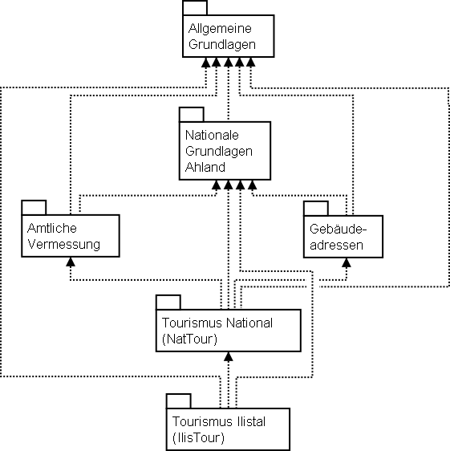
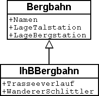
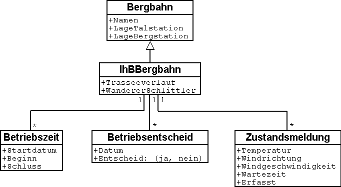
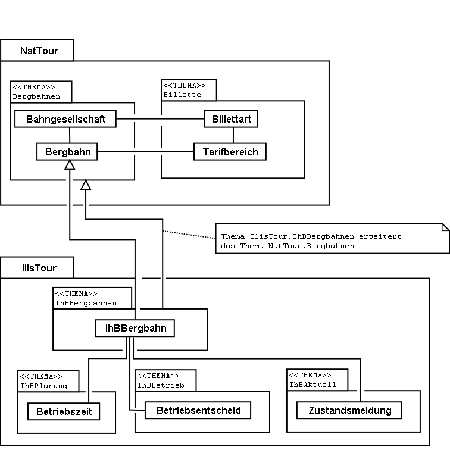
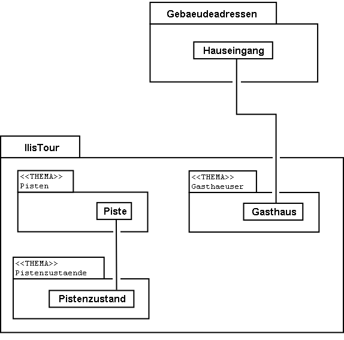
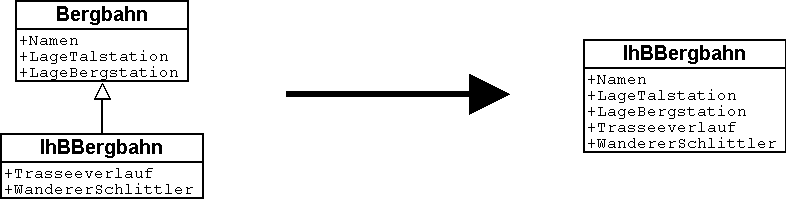
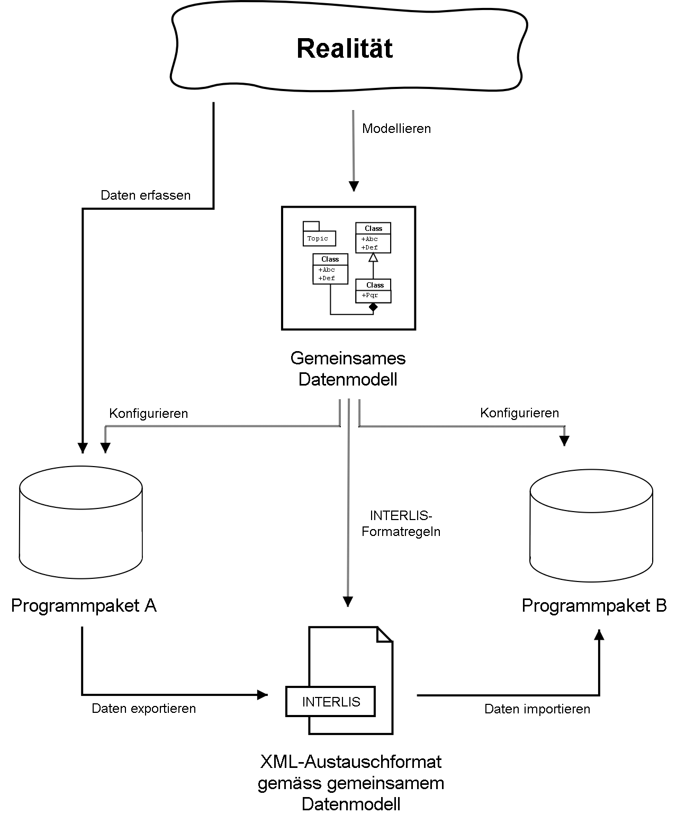
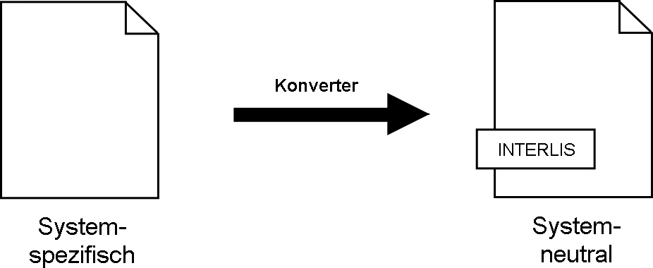

[#_2_3]
=== Ilistal will mehr

[#_2_3_1]
==== Zielsetzung

Ilistal möchte also nicht einfach den gleichen Service anbieten, wie dies der nationale Tourismusverband tut. Folgende Zusatzleistungen stehen im Vordergrund:

* Anzeige der aktuellen Betriebs- und Wartezeiten der verschiedenen Bahnen und ob sie von Wanderern und Schlittlern benützt werden können;
* Anzeige der Pisten inkl. Schwierigkeitsgrad und Befahrbarkeit;
* bildliche Darstellung (inkl. Anzeige der Wälder und Strassen);
* Anzeige der Gasthäuser der Region;
* Anzeige, wo sich die Gebäude mit welcher Postadresse befinden.

[#_2_3_2]
==== Ilistal nutzt Vorhandenes

Die für die bildliche Darstellung nötigen Daten der Wälder und Strassen möchte man natürlich nicht selbst erfassen, denn das Bauamt hat schliesslich die Daten der amtlichen Vermessung, welche auch Wälder und Strassen enthalten. Und das Bauamt hat doch damit begonnen, die Gebäudeadressen gemäss der neuen Norm zu erfassen. Nun macht es wenig Sinn, im Datenmodell von Ilistal all diese Definitionen zu wiederholen. Man möchte einfach die vorhandenen Modelle der amtlichen Vermessung und der Gebäudeadressen nutzen.

[NOTE]
====
Ein Datenmodell ist nicht eine isolierte Beschreibung, sondern kann auf bereits bestehenden Datenmodellen aufbauen.

_Im Sinne des Aufbauens verwandte Begriffe zu Datenmodell sind: Module, Pakete, Packages, ..._
====

.Das Ilistaler Tourismus-Datenmodell (IlisTour) braucht nicht alles selbst zu definieren. Stattdessen baut es auf anderen Modellen auf: Es verwendet Teile des nationalen Tourismus-Modells (NatTour), der nationalen Grundlagen von Ahland, der amtlichen Vermessung, der Gebäudeadressen sowie allgemeine Grundlagen. Die gestrichelte Linie mit gefülltem Pfeil steht für die Abhängigkeit. Häufig wird die allgemeine Grundlage wie hier oben, der Spezialfall unten gezeichnet. Die umgekehrte Schreibweise ist jedoch ebenfalls verbreitet.

[#_2_3_3]
==== Ilistal geht weiter als der nationale Verband

Das Modell des nationalen Tourismusverbandes wollen die Ilistaler aber nicht einfach so nutzen, wie es ist. Damit man eine bildliche Darstellung machen kann, muss doch bei jeder Bergbahn auch der Trasseeverlauf beschrieben sein. Zudem möchte man festhalten, ob die Bahn durch Wanderer und Schlittler benutzbar ist, wann sie in Betrieb ist und wie lange die aktuelle Wartezeit ist. Es wäre nahe liegend, eine eigene Klasse für die Ilistaler Bergbahnen zu definieren. Sollen dabei die Attribute der Klasse Bergbahn des nationalen Verbandes wiederholt werden? Und da gibt es noch die Beziehung zwischen Bergbahnen und Tarifbereichen. Was würde eine eigene Klasse für diese Beziehung heissen?

Zum Glück gibt es für solche Fälle die Vererbung.

.Eine IhBBergbahn ist eine spezielle Bergbahn mit zusätzlichen Attributen: Trasseeverlauf sowie Benutzbarkeit für Wanderer und Schlittler. Die aus- +

gezogene Linie mit weisser Pfeilspitze bezeichnet die Spezialisierung.

[NOTE]
====
Die Klasse der Ilistaler IhB-Bergbahn ist eine *Erweiterung* der Klasse der Berg­bahnen. Sie *erbt* damit alle Eigenschaften der Bergbahnen und fügt weitere hinzu. ++[++Details der Vererbung werden in <<_5>> beschrieben++]++.

_Mit Erweiterung verwandte Begriffe sind: Spezialisierung, Subklasse, ..._
====

Wäre es nun richtig, in der Klasse IhBBergbahn gleich auch die Attribute Betriebszeit und aktuelle Wartezeit aufzunehmen? Wäre die Betriebszeit direkt ein Attribut von IhBBergbahn, könnte für jede Bahn genau eine, typischerweise die aktuelle Betriebszeit festgehalten werden. Der Betriebsleiter legt aber die Betriebszeiten jeweils zu Saisonbeginn fest: In der Vorsaison sind einzelne Lifte noch nicht in Betrieb, andere haben Mittagspause; über die Weihnachtstage ist voller Betrieb von 9 bis 15.30 Uhr; ab Mitte Februar – wenn die Tage länger werden – wird die Betriebszeit schrittweise bis 16.30 ausgedehnt. Je nach Schnee- und Wetterverhältnissen wird dann der Betrieb einzelner Bahnen vorübergehend stillgelegt.

.Betriebszeiten sind neu als eigenständige Objekte definiert.

Legt man zudem noch fest, dass eine bestimmte Betriebszeit für verschiedene Bahnen gelten kann, kann der Erfassungsaufwand noch weiter gesenkt werden. Bei den Wartezeiten macht dies natürlich keinen Sinn. Eine zu einem bestimmten Zeitpunkt beobachtete Warte­zeit muss derjenigen Bahn zugeordnet werden, bei der entsprechend gewartet werden muss. Warum hält man die Wartezeit also nicht direkt auf der IhBBergbahn fest? Folgende Gründe sprechen dagegen:

* Dank der Speicherung der Wartezeiten als eigenständige Objekte können sie zu einem späteren Zeitpunkt (z.B. für Statistiken) ausgewertet werden.
* Der Änderungsrhythmus und die Zuständigkeit für die Werte sind ganz anders als bei den Attributen der IhBBergbahn-Klasse.

[WARNING]
Bei den Eigenschaften, die auf den ersten Blick einer Klasse zugeordnet werden, muss immer genau überlegt werden, ob dies wirklich korrekt ist, oder ob sie besser in selb­ständige, über Beziehungen zugeordnete Klassen verschoben werden.

Bei diesen Überlegungen ist der tatsächliche Sachverhalt und nicht die Nutzung z.B. für Dar­stellungen massgebend. Wichtig sind aber auch die organisatorischen Verhältnisse. Wer ist für die Nachführung der Daten zuständig? In welchen Rhythmus werden sie nachgeführt?

Im Modell des nationalen Verbandes sind die einzelnen Bergbahngesellschaften für die Nachführung ihrer Daten verantwortlich. Das Ilistaler Modell möchte – was die Bergbahnen betrifft – das Modell des nationalen Verbandes zwar nutzen, es aber für die Ilishorn-Berg­bahnen erweitern.

[NOTE]
Datenmodelle werden in *Themen* gegliedert, um den organisatorischen Verhält­nissen (z.B. unterschiedliche Verantwortlichkeiten und Nachführungsrhythmen) gerecht zu werden.

Das Ilistaler Modell erweitert darum das vom nationalen Verband vorgegebene Thema Bergbahnen zu IhBBergbahnen. In dieser lokalen Erweiterung ist definiert, dass die Klasse IhBBergbahn die Klasse Bergbahn spezialisiert und um zusätzliche Attribute erweitert.

Da die Betriebszeiten, die Betriebsentscheide und die Zustandsmeldungen teilweise durch verschiedene Stellen, vor allem aber in völlig anderem Rhythmus erfasst werden, werden sie je in eigenen Themen (IhBPlanung, IhBBetrieb, IhBAktuell) definiert.

.Das Ilistaler Modell (IlisTour) erweitert das Modell des nationalen Tourismus-Verbands (NatTour). IlisTour erbt das Thema Bergbahnen von NatTour, erweitert die Klasse Bergbahn zu IhBBergbahn und fügt weitere Themen für Planung, Betrieb und Aktuelles an.

[NOTE]
Vererbung gibt es nicht nur im Kleinen (Objektklassen), sondern auch im Grossen (ganze Themen).

[#_2_3_4]
==== Ilistaler Spezialitäten

Zusätzlich möchten die Ilistaler auch Pisten und Gasthäuser beschreiben. Sie fügen dem Ilis­taler Modell darum noch weitere Themen zu.

.Das Ilistaler Tourismus-Modell wird um weitere Themen ergänzt.

Besonders bei den Gasthäusern stellen sich wieder Fragen. Wie soll z.B. der Schnellimbiss INTERLUNCH bildlich dargestellt werden? Man weiss zwar, dass er an der Dorfstrasse 27 liegt. Aber damit kann man kein Symbol auf dem Plan platzieren! Die Lösung liegt in der Nutzung der Gebäudeadressen. Dort gibt es eine Klasse Hauseingang, die auch ein Lageattribut (in Landeskoordinaten) aufweist. In der Klasse Gasthaus wird darum gar keine Adresse geführt, sondern eine Beziehung zum Hauseingang definiert. Konkret wird das Objekt, welches dem Hotel Sonne entspricht, mit dem Hauseingang-Objekt verbunden, das die Dorfstrasse 27 beschreibt.

[#_2_3_5]
==== Wie implementieren die Ilistaler ihre Spezialitäten?

Ein Konzept regelt die Anforderungen, nicht aber die Implementation. In der Implementation ist man grundsätzlich frei. Die Ilishornbahnen haben sich für ein standardisiertes Programm­paket (LiftSys) entschieden, das allerdings nur Daten gemäss dem erweiterten Modell be­handeln kann. Es ist aber ohne weiteres zulässig, auf die Klasse Bergbahn zu verzichten und deren Attribute gleich in der Klasse IhBBergbahn einzufügen.

.Das Programmpaket für den Ilistaler Tourismus braucht sich nur grob ans konzeptuelle Modell zu halten. Es kann zum Beispiel intern zwei Objektklassen zu einer einzigen zusammenfassen. Wichtig ist nur, dass das Paket in der Lage ist, die Daten in jenem Format zu liefern, das dem konzeptuellen Modell entspricht.

Analog zur Behandlung der Klassen gemäss Konzept stellen sich verschiedene weitere Fragen, wie ein bestimmtes Computersystem die Vorstellungen umsetzt, die mit dem kon­zeptuellen Modell verbunden sind.

[#_2_3_6]
==== Wie schicken die Ilistaler ihre Daten an den nationalen Tourismusverband?

Nachdem das LiftSys-Programmpaket eingerichtet und die Daten erfasst sind, stellt sich wieder die Frage, wie die Daten dem nationalen Verband übermittelt werden können. Dieser will natürlich nicht alle Daten, sondern nur diejenigen, die ihn interessieren. Der nationale Verband ist z.B. weder an Pisten noch an der Eignung für Wanderer und Schlittler inter­essiert.

[NOTE]
Ein INTERLIS-Datentransfer umfasst immer die Daten von einem oder mehreren Themen.

Die Ilistaler wollen darum dem nationalen Verband die Daten der Themen Bergbahnen und Billette schicken. Aber wie kann ein Programmpaket eine korrekte Transferdatei erstellen – der Hersteller kannte doch die Spezifikationen des Tourismusverbandes gar nicht? Die Lösung liegt im _modellbasierten Transfer_.

[NOTE]
Bei einem *modellbasierten Transfer* gibt es nicht ein ganz bestimmtes *Transferformat*. Vielmehr richtet sich das Format nach dem Datenmodell.

Jede Modellierungsmethode (z.B. INTERLIS, oder die Definitionen, mit denen ein bestimm­tes Programmpaket eingerichtet wird) stellt bestimmte Ausdrucksmittel (Objektklassen, Attri­bute, Typen, Beziehungen, Tabellen, Kolonnen, usw.) zur Verfügung. Für jedes solche Aus­drucksmittel wird unabhängig vom konkreten Datenmodell geregelt, welche Wirkungen es auf den Transfer hat. Von einem konkreten Transferformat, also der genauen Reihenfolge der Zeichen, welche die jeweiligen Daten repräsentieren, kann man somit erst sprechen, wenn das zugehörige Datenmodell bekannt ist. Ja, das Transferformat ergibt sich direkt aus dem Datenmodell.

Wäre LiftSys in der Lage, das interne Datenmodell direkt gemäss dem konzeptuellen Datenmodell aufzubauen, und würde es zusätzlich die Umsetzung der Daten in Transfer­dateien gemäss den Spezifikationen von INTERLIS unterstützen, wäre alles kein Problem. Die Transferdateien könnten genau so einfach erstellt werden wie mit dem Testprogramm des Verbandes.

Das Programmpaket des Bauamtes (BauSys) unterstützt zum Beispiel die Erstellung von INTERLIS 2-konformen Dateien. Es kennt aber nur einzelne Tabellen, die jeweils mehrere Kolonnen aufweisen können. Da die Formatierungsregeln von INTERLIS so aufgebaut sind, dass die Vererbungsstruktur sich in der Transferdatei nicht direkt spiegelt, könnten mit BauSys direkt korrekte Dateien erstellt werden. Die Umsetzung von den internen in die externen Daten kann man sich wie folgt vorstellen:

.Die internen Daten des Programmpakets A werden in eine Transferdatei umgesetzt, deren Aufbau gemäss den Formatregeln von INTERLIS aus dem Datenmodell folgt. +

Die Daten können danach in Programmpaket B importiert werden. Voraussetzung ist, dass die beteiligten Programmpakete entsprechend dem Datenmodell konfiguriert worden sind.

Das LiftSys unterstützt aber INTERLIS nicht. Was nun? Müssen sich die Ilishornbahnen mit dem Kauf eines neuen Programmpakets beschäftigen? Der Ausweg ist offensichtlich: LiftSys exportiert die Daten in einem anderen Format, diese werden dann mit einem Konversions­programm nach INTERLIS umgeformt. Das Konversionsprogramm kann entweder spezifisch für das konkrete Datenmodell oder allgemein als modellbasiertes Werkzeug realisiert sein.

.Ein Konverter erstellt INTERLIS-Dateien aus einem Format, das spezifisch für ein bestimmtes Computersystem ist.

Nachdem alles glücklich funktionierte, wird die Datei an den nationalen Verband geschickt. Das Echo: «Fast gut – beim Namen des Sesselliftes auf die Ilisegg gibt es aber ein Problem!» Uff – das kennen wir doch auch aus verschiedenen E-Mails: «Ilistäli»; immer diese Umlaute.

Zwei Dinge sollten klar unterschieden werden:

[NOTE]
Der *Zeichenvorrat* legt fest, welche Zeichen bei Text-Attributen überhaupt verwendet werden dürfen.

[NOTE]
Die *Zeichencodierung* legt fest, welches Bitmuster das Zeichen im Computer repräsentiert.

Die Umlaute gehören zum erlaubten Zeichenvorrat von INTERLIS. Aber bei der Konversion wurde vergessen, die Zeichencodierung der Daten, die vom LiftSys kamen, korrekt anzugeben. Nach der Korrektur erhält Ilistal ein positives Echo vom Verband.

[#_2_3_7]
==== Was macht der nationale Tourismusverband mit den Ilistaler Daten?

Über etwas sind nun die Ilistaler ein wenig erstaunt: Was hat das Computersystem des nationalen Tourismusverbands (NatTourSys) wohl mit den zusätzlichen Attributen ange­fangen – etwa mit der Eignung für Wanderer und Schlittler oder gar dem Trasseeverlauf? Die Lösung klingt simpel: NatTourSys hat sie einfach ignoriert.

[NOTE]
*Polymorphes Lesen* erlaubt, dass die Daten gemäss einem «reduzierten» Modell, d.h. einem Modell, das zusätzliche Erweiterungen noch nicht kennt, gelesen werden können.

Die Ilistaler haben die Daten zwar so geschickt, dass sie alle Erweiterungen gemäss dem Ilistaler Modell enthalten. Die Transferregeln von INTERLIS sorgen dafür, dass die Daten dennoch gemäss dem Modell des nationalen Tourismusverbandes gelesen werden können, ohne dass das Leseprogramm wegen der zusätzlichen Daten aus dem Takt gerät. Bedin­gung ist nur, dass das Modell, gemäss dem die Daten erstellt wurden, eine Erweiterung jenes Modells ist, das der Empfänger der Daten benutzt. Das Ilistaler Modell muss also das Modell des nationalen Tourismusverbandes erweitern.

<<_5>> erläutert näher, wofür Erweiterungen nützlich sind. <<_8>> befasst sich mit den Details des Datentransfers.

Dabei ist es auf der lesenden Seite möglich, dass die Daten direkt mit dem Programmpaket des Empfängers gelesen werden oder dass auch hier ein Konversionsprogramm zwischengeschaltet wird. Und auch hier gilt wieder, dass die konkreten Zeichen der Text-Attribute korrekt umgesetzt werden. Das «ä» von Ilistäli kann durchaus im LiftSys, auf der Transferdatei und im NatTourSys je unterschiedlich codiert sein. Für die jeweiligen Programme ist es immer klar, dass es ein «ä» ist.

[#_2_4]
