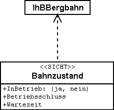

[#_2_4]
=== Ilistal hat es geschafft

[#_2_4_1]
==== Systemübersicht

Beim Internet hat man sich für eine relativ einfache Lösung entschieden: Der Situationsplan wird als statisches Bild durch das Programmpaket LiftSys erstellt und danach einem Web-Präsentationssystem (WebSys) zur Verfügung gestellt. Um den aktuellen Zustand der Bah­nen abfragen zu können, werden bestimmte Bereiche im Bild markiert. Wird mit der Maus auf einen dieser Flecken geklickt, erscheinen die aktuellen Zustandsdaten der betreffenden Bahn. Zudem sollen die Hotels mit freien Zimmern speziell markiert werden.

[#_2_4_2]
==== Für die Web-Seite ist nur der aktuelle Zustand interessant

Die Ilistaler haben sich Mühe gegeben und ihr Modell vor allem auch für die betrieblichen Daten der Bahnen und Pisten sauber strukturiert. Nur ist leider das Programm, welches lau­fend die Internetseite aktualisiert, nicht in der Lage, aus der Vielzahl von Betriebszeiten, Betriebsentscheiden und Zustandsmeldungen den jeweils aktuellen Zustand abzuleiten. Der Betreiber möchte einerseits die Daten gemäss dem Thema IhBBillette immer dann erhalten, wenn etwas geändert hat. Andererseits möchte er aber über den betrieblichen Zustand der Bergbahnen alle 20 Minuten eine neue Mitteilung erhalten.

[NOTE]
====
Eine *Sicht* definiert Daten, die der Auffassung eines Nutzers entsprechen und darum aus den Originaldaten abgeleitet werden müssen.

_Verwandte Begriffe: View, abgeleitete Daten, ..._
====

Die verlangte Sicht verbindet Betriebszeiten, Betriebentscheide und Wartezeiten mit derjeni­gen Bergbahn, der sie gemäss Beziehung zugeordnet sind und filtert so, dass nur der aktuelle Zustand beschrieben wird.

[NOTE]
Von der Anwendung aus gesehen können Sichtobjekte gleich wie Datenobjekte aufgefasst werden. Sichten werden darum auch mittels Sichtklassen beschrie­ben.

.Der Bahnzustand ist keine eigenständige Objektklasse, sondern wird +

über eine Sicht von IhBBergbahn abgeleitet. Die Sicht fasst jene Daten +
zusammen, die für das Darstellen auf einer Internet-Seite benötigt werden.

[#_2_4_3]
==== Hotels mit freien Betten auf der Web-Seite darstellen

Damit WebSys eine zusätzliche Markierung anbringen kann, in welchen Hotels es noch freie Zimmer gibt, braucht es natürlich die nötigen Informationen. Ähnlich wie bei den Zuständen der Bahnen wird darum auch für Hotels eine Sicht definiert. Sie enthält einerseits die nötigen Daten der Gasthausobjekte, andererseits die Lagekoordinaten gemäss dem zugeordneten Hauseingang.

[NOTE]
Mit INTERLIS können auch die benötigten *Symbole systemneutral definiert* und die Umsetzung von Original- oder Sichtdaten in *Grafik* beschrieben werden.

Leider ist WebSys aber nicht in der Lage, solche Umsetzungsbeschreibungen zu ver­arbeiten. Es ist aber fähig, die Symboldefinitionen zu lesen. Zudem kann es Daten entgegen­nehmen, die aussagen, welches Symbol an welcher Stelle dargestellt werden soll und dann die Darstellung vornehmen. Damit kann eine andere Möglichkeit von INTERLIS ausgenützt werden, die auf LiftSys zur Verfügung steht.

[NOTE]
Mit INTERLIS können auch bereits umgesetzte Grafikdaten transferiert werden.

LiftSys liefert WebSys darum nicht die Sichtdaten der Hotels, sondern setzt diese selbst in Grafikdaten um. Der genaue Aufbau der Grafikdaten kann wiederum mit Klassen definiert werden. Typische Attribute solcher Grafikdaten sind die Position, der Symbolname, die Farbe.

