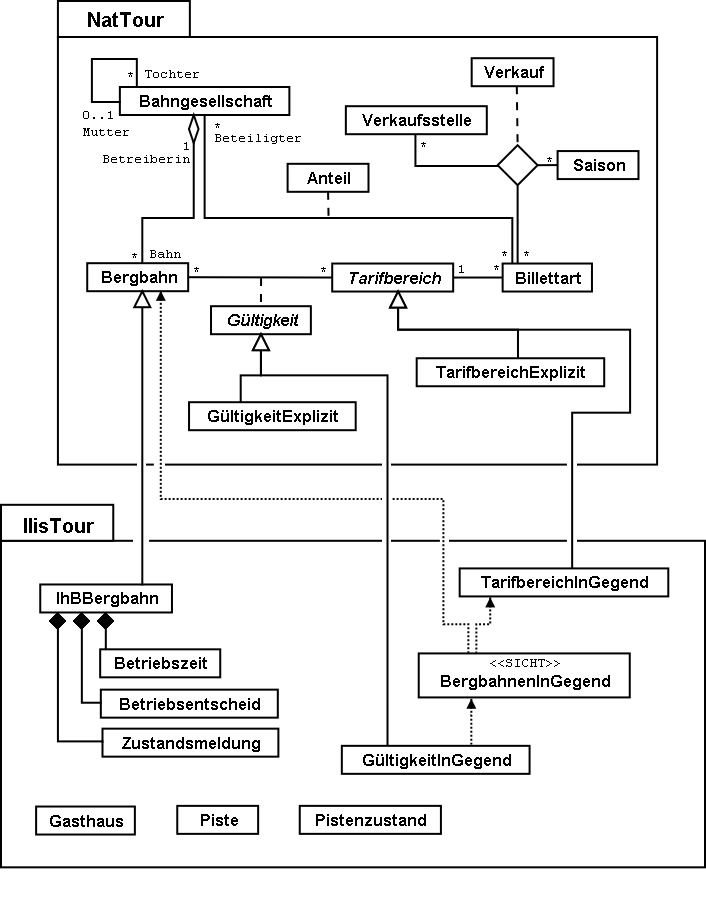

[#_4_1]
=== Das Datenmodell im Überblick

.Das Datenmodell in der UML-Darstellung. Der Übersichtlichkeit halber sind Themen, Strukturen, Wertebereiche und Attribute nicht abgebildet. Hierzu wird auf <<_6>> verwiesen, das auf Einzelheiten näher eingeht.

[#_4_2]
