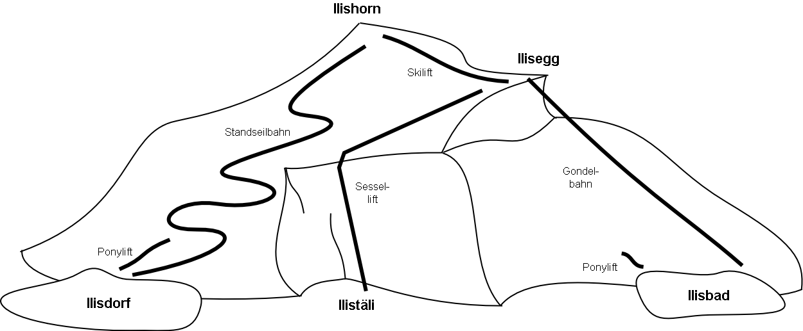

[#_4_3]
=== Transferdaten

Wollen die Ilistaler ihre gesamten Daten an den nationalen Tourismusverband schicken, erstellen sie (mit ihrem Softwarepaket) eine Transferdatei. Diese wird zwar normalerweise von einem anderen Computersystem eingelesen und muss nicht in dieser Form von einem Menschen betrachtet werden. Dennoch ist ein kleiner Teil der Transferdatei nachfolgend abgedruckt, um eine Vorstellung von ihrem Aufbau zu vermitteln.

Drei Punkte (...) zeigen die Auslassungen an; die Kästchen rechts sind lediglich Anmer­kungen und gehören nicht zur Transferdatei.

.Die Bergbahnen auf das Ilishorn sind ein Teil der Daten, die in einer Transferdatei enthalten sind (Wiederholung von Abbildung 11). Die nachfolgende Datei enthält einige Daten für den Ponylift Ilisdorf.

[source,xml]
----
<?xml version="1.0" encoding="utf-8"?>
<TRANSFER xmlns="http://www.interlis.ch/INTERLIS2.3">

<HEADERSECTION VERSION="2.3" SENDER="AHTOUIHB0">
  <ALIAS>...</ALIAS>
</HEADERSECTION>

<DATASECTION>
<BASKET BID="xAHTOUIHB01234567" TOPICS="IliTour.IhBBergbahnen">
  <IlisTour.IhBBergbahnen.IhBBergbahn TID="xAHTOUIHB04231336">
    <Namen>
      <NatTour.Bezeichnung>
        <Name>Ponylift Ilisdorf</Name>
        <Sprache>de</Sprache>
      </NatTour.Bezeichnung>
    </Namen>
    <LageTalstation>
      

        <C1>7931.11</C1>
        <C2>13171.23</C2>
        <C3>1771.34</C3>
      

    </LageTalstation>
    <LageBergstation>
      

        <C1>8020.60</C1>
        <C2>13188.62</C2>
        <C3>1789.04</C3>
      

    </LageBergstation>
    <Fahrzeit>
      <Ahland.ZeitdauerInMinuten>
        <Dauer>3</Dauer>
      </Ahland.ZeitdauerInMinuten>
    </Fahrzeit>
    <Art>Skilift</Art>
    <LageTalstationWGS>
      

        <C1>23.68611</C1>
        <C2>44.20278</C2>
        <C3>1771.34</C3>
      

    </LageTalstationWGS>
    <LageBergstationWGS>
      
...

    </LageBergstationWGS>
    <BildBergstation>
      http://www.ilishornbahnen.com/webcam?bahn=pony4
    </BildBergstation>
    <Trasseeverlauf>...</Trasseeverlauf>
    <WandererSchlittler>ungeeignet</WandererSchlittler>
    <Betriebszeit>...</Betriebszeit>
    <Betriebsentscheid>...</Betriebsentscheid>
    <Zustandsmeldung>
      <Ilistour.IhBAktuell.Zustandsmeldung>
        <Temperatur>13</Temperatur>
        <Wind>
          <Ilistour.IhBAktuell.Windangabe>
            <Windrichtung>NE</Windrichtung>
            <Windgeschwindigkeit>13</Windgeschwindigkeit>
          </Ilistour.IhBAktuell.Windangabe>
        </Wind>
        <Wartezeit>
          <Ahland.ZeitdauerInMinuten>
            <Dauer>8</Dauer>
          </Ahland.ZeitdauerInMinuten>
        </Wartezeit>
        <Erfasst>2002-11-25T15:11:00</Erfasst>
      </Ilistour.IhBAktuell.Zustandsmeldung>
    </Zustandsmeldung>
  </IlisTour.IhBBergbahnen.IhBBergbahn>
</BASKET>
</DATASECTION>
</TRANSFER>
----

