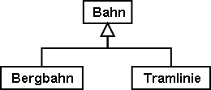
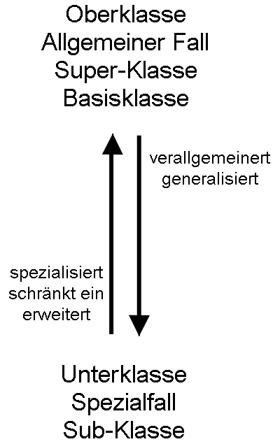
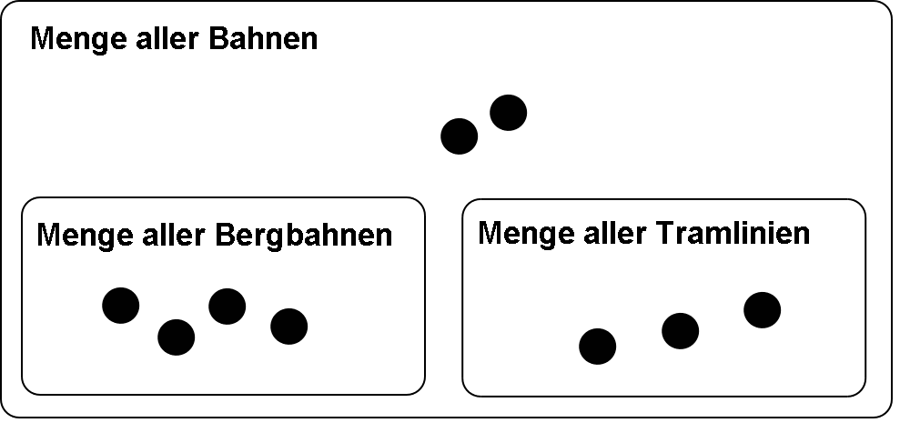
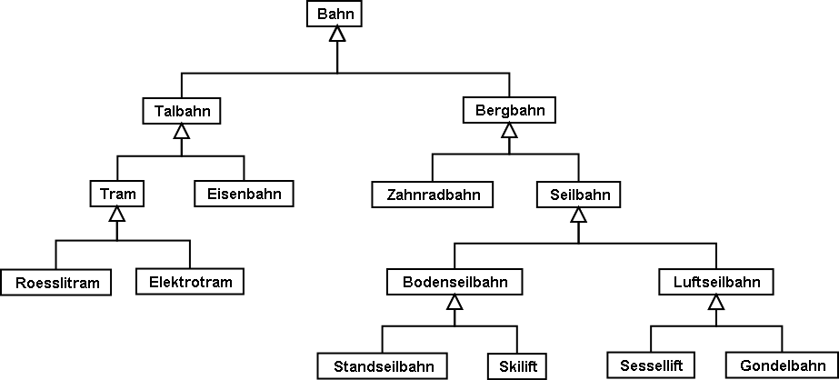
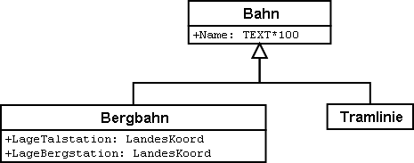
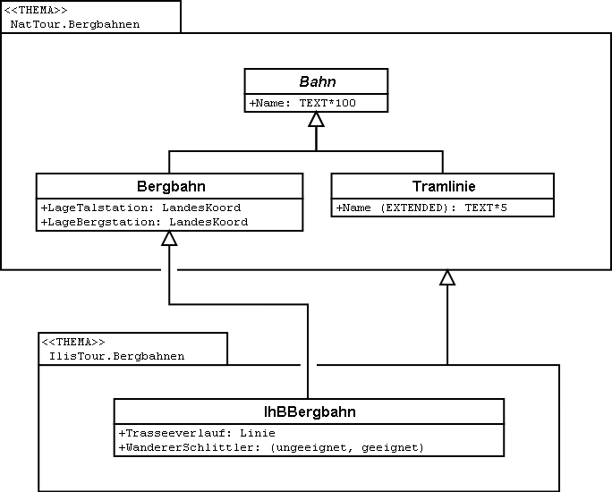

[#_5]
== Erben wird Mode

[#_5_1]
=== Erbstücke und Erbrecht – Prinzipien der Vererbung

Eigentlich ist eine Bergbahn nichts Besonderes, denn sie besitzt viele Eigenschaften, die allen Bahnen gemeinsam sind. Zum Beispiel hat sie wie alle Bahnen einen Namen. Auch dass eine Bergbahn von einer Gesellschaft betrieben wird, ist nicht so speziell – auch bei einer Tramlinie ist das schliesslich nicht anders.

Andererseits ist es offensichtlich, dass Bergbahnen und Tramlinien zwar einiges gemeinsam haben, aber doch nicht ganz dasselbe sind. 

 

Abbildung 23: In vielem ähnlich, aber doch nicht ganz dasselbe: Bergbahn und Tramlinie sind beides spezielle Bahnen – sie sind Unterklassen der allgemeineren Oberklasse Bahn.

[NOTE]
Mit der *Vererbung* lassen sich die Gemeinsamkeiten und Unterschiede von Ob­jektklassen formulieren. *Unterklassen* *spezialisieren* die allgemeineren *Ober­klassen*.

Es ist üblich, die allgemeinere Oberklasse im Diagramm oberhalb der spezielleren Unter­klasse zu zeichnen. Komplizierte Diagramme können jedoch unübersichtlich werden, wenn man sich strikte an dieses Prinzip hält. Entscheidend ist in jedem Fall die Richtung des Pfeils, nicht die Anordnung auf dem Papier.

Jede Bergbahn ist eine Bahn, aber nicht jede Bahn fährt auf einen Berg: Die Menge aller Bergbahnen ist eine Teilmenge der Menge aller Bahnen. Man sagt auch, die Unterklasse Bergbahn sei eine *Einschränkung* der Oberklasse Bahn.

 

Abbildung 24: Dem Spezialisieren von Klassen entspricht eine Teilmengenbeziehung von Objekt­mengen: Die Menge aller Bergbahnen (im rechten Bild mit vier Elementen) muss vollständig in der Menge aller Bahnen (neun Elemente) enthalten sein, denn im Modell (linkes Bild) spezialisiert die Klasse Bergbahn die allgemeinere Klasse Bahn.

Gelegentlich wird für die Spezialisierung auch – gleichbedeutend mit «Einschränkung» – der Ausdruck *Erweiterung* gebraucht.

Es ist verwirrend, dass die Begriffe «Einschränkung» und «Erweiterung» beim Modellieren häufig mit gleicher Bedeutung gebraucht werden. Der Grund ist folgender: Eine Klasse kann auch als eine Anzahl von Bedingungen aufgefasst werden, anhand derer sich entscheiden lässt, ob ein Objekt zur Klasse gehört (zum Beispiel Kriterien dafür, wann genau etwas eine Bahn ist). Eine Unterklasse verschärft nun die Anforderungen: Damit etwas eine Bergbahn ist, muss es nicht nur sämtlichen Bedingungen für das Bahn-Sein genügen, sondern es sind zusätzlich weitere Bedingungen zu erfüllen. Indem also eine Unterklasse die Anforderungen erweitert, schränkt sie die Menge der dazugehörigen Exemplare ein.

Die Vererbung ist ein ausgezeichnetes Mittel, um in einer komplexen Welt Ordnung zu schaf­fen. Allerdings kann es verlockend sein, ein allzu detailliertes Modell zu formulieren – also auch dort Klassen zu unterscheiden, wo es überhaupt nicht nötig wäre.

.Das kraftvolle Mittel der Vererbung kann dazu verleiten, auch dort Spezialfälle zu unter­scheiden, wo es von der Anwendung her gar nicht nötig wäre. Zwar ist ein Rösslitram wirklich nicht ganz dasselbe wie eine elektrische Strassenbahn, aber: Macht es irgend­einen Sinn, all diese Unterscheidungen im Datenmodell zu treffen, oder wird das Ganze so nur unnötig aufgebläht?

Einen Hinweis darauf, ob sich das Unterteilen in spezielle Klassen lohnt, geben die jeweili­gen Eigenschaften. So hat jede Bahn einen Namen, aber nur Bergbahnen besitzen eine Tal- und eine Bergstation.

[source]
----
CLASS Bahn =
  Name: TEXT*100;
END Bahn;

CLASS Bergbahn EXTENDS Bahn =
  LageTalstation: LandesKoord;
  LageBergstation: LandesKoord;
END Bergbahn;

CLASS Tramlinie EXTENDS Bahn =
END Tramlinie;
----

.Bergbahn und Tramlinie übernehmen («erben») die Eigenschaft Name von ihrer Oberklasse Bahn, ohne dass dies nochmals geschrieben werden müsste. Eine Bergbahn besitzt zusätzlich zu den ererbten noch weitere Eigenschaften, nämlich die Lage von Tal- und Bergstation (in Landeskoordinaten). Rechts dasselbe in der Schreibweise von INTERLIS.

[NOTE]
Unterklassen übernehmen oder *erben* immer alle Eigenschaften von ihren allge­meineren Oberklassen. Sie können jedoch zusätzliche Eigenschaften definieren.

[#_5_2]
=== Ererbtes verfeinern

Hundert Zeichen für den Namen einer Bahn mag im allgemeinen Fall ja angemessen sein. Schliesslich war auch schon einmal die Rede davon gewesen, einen «Kinder- und- Familien-Schlittenlift Region Ilishorn» zu betreiben. Allerdings entschied man sich dann doch noch im letzten Moment für den Namen «Ponylift», zur grossen Erleichterung des Verkehrsvereins.

Aber eine Tramlinie mit hundert Buchstaben? Hier reichen fünf Zeichen definitiv aus.

[source]
----
CLASS Bahn =
  Name: TEXT*100;
END Bahn;

CLASS Bergbahn EXTENDS Bahn =
  LageTalstation: LandesKoord;
  LageBergstation: LandesKoord;
END Bergbahn;

CLASS Tramlinie EXTENDS Bahn =
  Name (EXTENDED): TEXT*5;
END Tramlinie;
----

Abbildung 27: Für den Namen einer Tramlinie reichen fünf Zeichen aus: Der Typ der Eigenschaft «Name» wird von der Unterklasse verfeinert (präzisiert). Rechts wiederum dasselbe in der Schreibweise von INTERLIS.

Die präzisierte, verfeinerte Angabe muss mit der übernommenen verträglich sein. Beispiels­weise darf die maximal erlaubte Namenslänge bei der Tramlinie nicht länger als bei der all­gemeinen Bahn sein.

[NOTE]
====
Unterklassen können ererbte Eigenschaften *verfeinern*. Die präzisierten An­gaben dürfen aber nicht im Widerspruch zu den übernommenen stehen: sie müs­sen mit den Definitionen der Oberklasse *verträglich* sein.

_Andernfalls könnte es zu einer Unterklasse Objekte geben, die nicht zur Menge aller Objekte der Oberklasse gehören._
====

[#_5_3]
=== Gibt es das denn überhaupt? – Abstrakte Klassen

Manche Klassen sind rein gedankliche Hilfsmittel: Es gibt von ihnen keine real existierenden Exemplare. Beispielsweise gibt es kein einziges Lebewesen auf der Welt, das nur Lebewesen, nicht aber auch noch etwas Spezielleres wäre. Ebenso könnte ein Datenmodell festlegen, dass es keine Bahn an und für sich geben soll, sondern dass jede Bahn entweder eine Bergbahn, eine Tramlinie etc. sein müsse.

[NOTE]
Soll es von einer Klasse keine konkreten Objekte geben können, wird sie als *abstrakt* erklärt.

Häufig sind in einem Datenmodell sogar alle Oberklassen abstrakt und nur die untersten, speziellsten Klassen konkret.

[source]
----
CLASS Bahn (ABSTRACT) =
  Name: TEXT*100;
END Bahn;

CLASS Bergbahn EXTENDS Bahn =
  LageTalstation: LandesKoord;
  LageBergstation: LandesKoord;
END Bergbahn;

CLASS Tramlinie EXTENDS Bahn =
END Tramlinie;
----

Abbildung 28: Bahn als abstrakte Klasse: Soll es keine Objekte geben können, die nur Bahn sind, ohne auch Bergbahn oder Tramlinie zu sein, wird dies im Diagramm mittels Schrägschrift bezeichnet. Rechts dasselbe Modell in der Schreibweise von INTERLIS.

[#_5_4]
=== So genau wollen wir das nicht vorschreiben – Abstrakte Eigenschaften

Angenommen, ein internationaler Verband möchte sicherstellen, dass Billette mit ihren Preisen erfasst werden. Er will aber keine bestimmte Währung für die Preisangabe vor­schreiben, und entsprechend ist auch nicht klar, was eine sinnvolle Obergrenze für den Preis wäre. Fest steht andererseits, dass «Preis» eine Zahl sein soll, und dass es sich um Geld handelt. Schliesslich werden Preise nicht in Kilometern pro Stunde gemessen!

[source]
----
CLASS BillettartWeltweit (ABSTRACT) =
  Preis (ABSTRACT): NUMERIC [MONEY];
END BillettartWeltweit;

CLASS BillettartAhland EXTENDS BillettartWeltweit =
  Preis (EXTENDED): 0.00 .. 9999.99 [Ahland.Taler];
END BillettartAhland;
----

[NOTE]
Nicht alle Eigenschaften müssen bis ins Detail festgelegt werden: Bei abstrakten Klassen sind *abstrakte Eigenschaften* zulässig. Es liegt dann an den konkreten Unterklassen, diese Eigenschaften zu präzisieren. Dies ist zum Beispiel dann nützlich, wenn etwas auf internationaler oder nationaler Stufe allgemein geregelt werden soll, ohne gleich jedes Detail vorzuschreiben.

[#_5_5]
=== Details interessieren nicht – Das Spezielle allgemeiner betrachten

Wer sich allgemein nach den Bahnen im Land erkundigt, interessiert sich nicht dafür, ob es sich bei einem bestimmtes Exemplar nun um eine Bergbahn, ein Tram oder sonst irgendeine Unterart von Bahn handelt. Er will auch nicht wissen, welches Stangensystem eine Bahn benutzt, falls es denn eine Zahnradbahn sein sollte. Allein schon der Name (der gemäss Datenmodell für jede Bahn erfasst ist) reicht als Antwort.

[NOTE]
====
Exemplare einer Unterklasse können immer auch verallgemeinernd im Sinn einer Oberklasse gesehen werden.

_Der griechische Ausdruck für dieses Prinzip heisst Polymorphismus (Vielgestaltigkeit)._
====

Dies funktioniert aber nur unter einer Bedingung:

[NOTE]
Jede Erweiterung muss mit ihrer Basisdefinition *verträglich* sein. Verträglich heisst, dass jeder Wert, der mit der erweiterten Definition möglich ist, gemäss Regeln des Grundtyps (Text, Aufzählung, Zahl, Koordinate, etc.) auf die Basisdefinition abgebildet werden kann.

[#_5_6]
=== Vererbung im Grossen

Nicht immer ist die Unterscheidung zwischen Ober- und Unterklasse rein sachlich gerechtfertigt. Auch organisatorische Gründe können den Ausschlag geben.

Beispielsweise ist man im Ilistal mit der Vorstellung, die sich der nationale Tourismusverband von einer Bergbahn macht, im Prinzip zwar einverstanden. Ganz zufrieden ist man jedoch nicht:

* Für die Bahnen aufs Ilishorn wäre es interessant, den Trasseeverlauf zu kennen. Würde er erfasst, könnte man den Verlauf in die Kärtchen einzeichnen, die der Ver­kehrsverein gratis an Touristen abgibt.
* Ausserdem möchten die Ilistaler erfassen, welche Bahnen sich für Wanderer und Schlittler eignen.

Beides sind Eigenschaften, die an sich jede Bergbahn tragen kann – nur fehlen sie eben im nationalen Modell. Natürlich haben die Ilistaler den nationalen Verband darum gebeten, sein Modell anzupassen. Aber von dort war nur zu hören, man habe weder die Zeit noch das Geld, wegen der Extrawürste eines Bergtals im ganzen Land die Computersysteme zu ändern. Was nun?

Die einen fanden, man solle doch den nationalen Verband einfach ignorieren. Die da oben seien ja doch nur ein Haufen von Bürokraten, ohne jegliches Verständnis für die Anliegen vor Ort! (Es fielen auch noch andere Worte, die aber nichts zur Sache tun.)

Andere konnten die Sicht des nationalen Verbands durchaus verstehen – wenn da jedes Täli kommen würde! Und ausserdem würde man ja doch auch vom nationalen Verband profitieren: Mit den Daten, die man ihm schickt, wird schliesslich auch Material für und über das Ilistal produziert.

Sollten die Ilistaler also auf ihre Sonderwünsche verzichten? Oder alle Daten doppelt erfas­sen – einmal für sich selber, einmal für den nationalen Verband?

.Der nationale Tourismusverband ist nicht bereit, sein Modell an die Ilistaler Spezial­wünsche anzupassen. Dank der Vererbung können die Ilistaler dennoch ihre Daten erfassen: Ihr Thema Bergbahnen übernimmt alles vom nationalen Thema Bergbahnen, erweitert es aber um eine Objektklasse IhBBergbahn mit zusätzlichen Eigenschaften.

Dank der Vererbung liess sich der Konflikt auflösen. Die Bahnen werden im Ilistal als IhB­Bergbahn erfasst, inklusive aller Zusätze. Nachdem IhBBergbahn eine Unterklasse von Bergbahn (gemäss Nationalverband) ist, kann jede IhBBergbahn auch als normale Bergbahn gelesen werden. Daher können die Ilistaler ihre Daten unverändert dem nationalen Verband schicken.

[NOTE]
====
Vererbung kann auch dazu benutzt werden, föderalistische Eigenheiten zu unter­stützen.

_Genau genommen liegt es am Polymorphismus, der durch die Vererbung ermöglicht wird: Jedes Exemplar einer Unterklasse kann immer auch als zur Oberklasse gehörend betrachtet werden (vgl. Abschnitt <<_5_5>>). Damit kann der nationale Verband die Daten von jeder Bergbahn im Land verarbei­ten, auch wenn es eigentlich sich um ein Exemplar einer örtlichen Unterklasse von «Bergbahn» handelt, die der nationale Verband gar nicht kennt._
====

Die Vererbung geht bei INTERLIS sehr weit: Nicht nur Klassen und Themen, sondern auch Wertebereiche (Typen), Sichten, Grafikdefinitionen, in einem gewissen Sinn sogar Einheiten können übernommen und präzisiert werden.

[#_5_7]
=== Einfach- und Mehrfachvererbung

Einige Modellierungssprachen erlauben es, dass von mehreren Grund-Elementen gleichzeitig geerbt wird. Eine Klasse kann so mehrere Oberklassen gleichzeitig verfeinern.

Es ist in der Informatik umstritten, wie zweckmässig dies ist. Modelle mit Mehrfachvererbung sind häufig weniger übersichtlich. INTERLIS kennt daher nur die Einfachvererbung.

