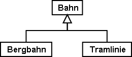
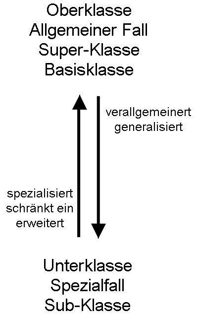
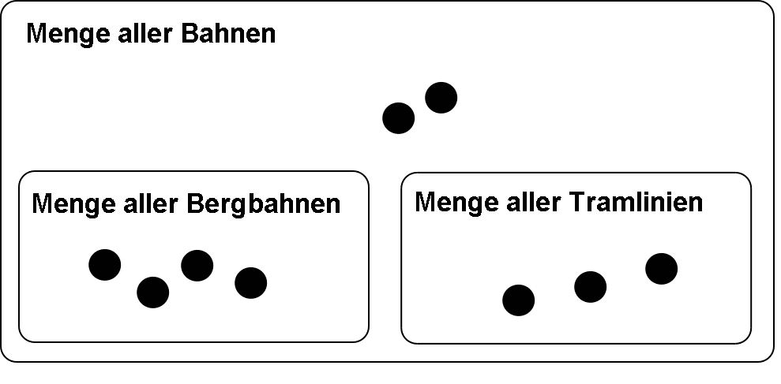

[#_5_1]
=== Erbstücke und Erbrecht – Prinzipien der Vererbung

Eigentlich ist eine Bergbahn nichts Besonderes, denn sie besitzt viele Eigenschaften, die allen Bahnen gemeinsam sind. Zum Beispiel hat sie wie alle Bahnen einen Namen. Auch dass eine Bergbahn von einer Gesellschaft betrieben wird, ist nicht so speziell – auch bei einer Tramlinie ist das schliesslich nicht anders.

Andererseits ist es offensichtlich, dass Bergbahnen und Tramlinien zwar einiges gemeinsam haben, aber doch nicht ganz dasselbe sind. 

 

Abbildung 23: In vielem ähnlich, aber doch nicht ganz dasselbe: Bergbahn und Tramlinie sind beides spezielle Bahnen – sie sind Unterklassen der allgemeineren Oberklasse Bahn.

[NOTE]
Mit der *Vererbung* lassen sich die Gemeinsamkeiten und Unterschiede von Ob­jektklassen formulieren. *Unterklassen* *spezialisieren* die allgemeineren *Ober­klassen*.

Es ist üblich, die allgemeinere Oberklasse im Diagramm oberhalb der spezielleren Unter­klasse zu zeichnen. Komplizierte Diagramme können jedoch unübersichtlich werden, wenn man sich strikte an dieses Prinzip hält. Entscheidend ist in jedem Fall die Richtung des Pfeils, nicht die Anordnung auf dem Papier.

Jede Bergbahn ist eine Bahn, aber nicht jede Bahn fährt auf einen Berg: Die Menge aller Bergbahnen ist eine Teilmenge der Menge aller Bahnen. Man sagt auch, die Unterklasse Bergbahn sei eine *Einschränkung* der Oberklasse Bahn.

 

Abbildung 24: Dem Spezialisieren von Klassen entspricht eine Teilmengenbeziehung von Objekt­mengen: Die Menge aller Bergbahnen (im rechten Bild mit vier Elementen) muss vollständig in der Menge aller Bahnen (neun Elemente) enthalten sein, denn im Modell (linkes Bild) spezialisiert die Klasse Bergbahn die allgemeinere Klasse Bahn.

Gelegentlich wird für die Spezialisierung auch – gleichbedeutend mit «Einschränkung» – der Ausdruck *Erweiterung* gebraucht.

Es ist verwirrend, dass die Begriffe «Einschränkung» und «Erweiterung» beim Modellieren häufig mit gleicher Bedeutung gebraucht werden. Der Grund ist folgender: Eine Klasse kann auch als eine Anzahl von Bedingungen aufgefasst werden, anhand derer sich entscheiden lässt, ob ein Objekt zur Klasse gehört (zum Beispiel Kriterien dafür, wann genau etwas eine Bahn ist). Eine Unterklasse verschärft nun die Anforderungen: Damit etwas eine Bergbahn ist, muss es nicht nur sämtlichen Bedingungen für das Bahn-Sein genügen, sondern es sind zusätzlich weitere Bedingungen zu erfüllen. Indem also eine Unterklasse die Anforderungen erweitert, schränkt sie die Menge der dazugehörigen Exemplare ein.

Die Vererbung ist ein ausgezeichnetes Mittel, um in einer komplexen Welt Ordnung zu schaf­fen. Allerdings kann es verlockend sein, ein allzu detailliertes Modell zu formulieren – also auch dort Klassen zu unterscheiden, wo es überhaupt nicht nötig wäre.

.Das kraftvolle Mittel der Vererbung kann dazu verleiten, auch dort Spezialfälle zu unter­scheiden, wo es von der Anwendung her gar nicht nötig wäre. Zwar ist ein Rösslitram wirklich nicht ganz dasselbe wie eine elektrische Strassenbahn, aber: Macht es irgend­einen Sinn, all diese Unterscheidungen im Datenmodell zu treffen, oder wird das Ganze so nur unnötig aufgebläht?
image::img/image25.png[]

Einen Hinweis darauf, ob sich das Unterteilen in spezielle Klassen lohnt, geben die jeweili­gen Eigenschaften. So hat jede Bahn einen Namen, aber nur Bergbahnen besitzen eine Tal- und eine Bergstation.

[#listing-05_01-01]
.link:#listing-05_01-01[Listing 05.01-01]
[source]
----
CLASS Bahn =
  Name: TEXT*100;
END Bahn;

CLASS Bergbahn EXTENDS Bahn =
  LageTalstation: LandesKoord;
  LageBergstation: LandesKoord;
END Bergbahn;

CLASS Tramlinie EXTENDS Bahn =
END Tramlinie;
----

.Bergbahn und Tramlinie übernehmen («erben») die Eigenschaft Name von ihrer Oberklasse Bahn, ohne dass dies nochmals geschrieben werden müsste. Eine Bergbahn besitzt zusätzlich zu den ererbten noch weitere Eigenschaften, nämlich die Lage von Tal- und Bergstation (in Landeskoordinaten). Rechts dasselbe in der Schreibweise von INTERLIS.
image::img/image26.png[]

[NOTE]
Unterklassen übernehmen oder *erben* immer alle Eigenschaften von ihren allge­meineren Oberklassen. Sie können jedoch zusätzliche Eigenschaften definieren.

[#_5_2]
