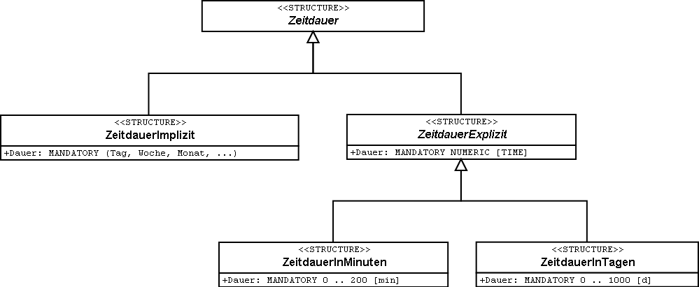
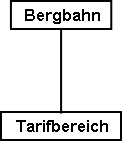
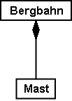
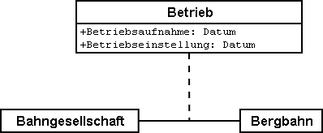
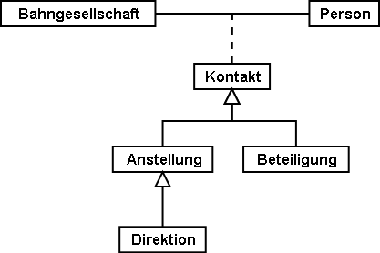

[#_6]
== Das Datenmodell unter der Lupe

[#_6_1]
=== Taler und Groschen – Numerische Datentypen

[#_6_1_1]
==== Wertebereich

Ein Einzelbillett für eine einfache Fahrt mit der Standseilbahn auf das Ilishorn kostet 10 Ah­länder Taler, ein Jahressportpass 635 Taler. Wie soll nun der Preis eines Billettes modelliert werden?

Wer sich an Programmiersprachen gewohnt ist, denkt sicher sofort an ganze Zahlen («Integer») oder Fliesskommazahlen («Real»). Bei vielen Programmiersprachen und Daten­banken lässt sich festlegen, wie viel Speicherplatz eine Zahl benötigt; hieraus folgen Grösse und Genauigkeit der speicherbaren Zahlen («short integer», «long integer», «double precision», etc.). Man überlegt sich dann, in welchem Bereich die Werte etwa liegen können, und wählt die passende Speicherform.

Bei der Modellierung auf konzeptueller Stufe möchte man sich aber eigentlich nicht um die Speicherform kümmern. Es ist aber möglich, den höchsten und den tiefsten zulässigen Wert anzugeben und dabei gleich noch die Stellenzahl sowie den Exponenten festzulegen.

Da sich die Preise zwischen 10 und 635 Talern bewegen, könnte man also schreiben:

[source]
----
Preis: 10 .. 635;
----

Damit würde man aber auch festlegen, dass ein Preis nie kleiner als 10 Taler und nie grösser als 635 Taler sein kann. Das möchte man natürlich nicht. Als untere Schranke ist 0 plausibel. Aber die obere Schranke? Mehr als 10'000 Taler werden es ja kaum sein. Also 10'000? Wo eine Schranke auf Grund der Anwendung nicht genau festgelegt werden kann, macht es jedenfalls keinen Sinn, den Wert so zu wählen, dass eine kürzere Speicherform (z.B__. short integer__ mit Werten zwischen –32768 und 32767) gerade nicht mehr ausreicht.

Dabei ist es natürlich auch wichtig zu überlegen, wie viele Nachkommastellen nötig sind. Wenn die Preise auch Groschen aufweisen können, werden die Schranken eben mit jeweils zwei Nachkommastellen festgelegt. Bei einem Attribut, das z.B. ein Investitionsbudget dar­stellt, möchte man sich nur mit Millionen abgeben; wo es nur um Grössenordnungen geht, reichen zwei Ziffern. Diese können sich aber auf Tausend, eine Million oder gar eine Milliarde beziehen.

[source]
----
Preis: 0.00 .. 9999.99;
Budget: 0.00E6 .. 999.99E6;
Bruttosozialprodukt: 0.0E0 .. 9.9E20;
----

Die Anzahl der Stellen bezeichnet die Genauigkeit: «4.3 Millionen» (4.3E6 = 4.3 · 106) ist eine weniger genaue Angabe als «4300000».

[#_6_1_2]
==== Einheiten

Sind das jetzt Taler, Franken, Euro oder Dollar? Die Einheit ist – nicht nur beim Geld – von entscheidender Bedeutung. Darum ist es empfehlenswert, die Einheit nicht nur als Kommentar oder als Teil des Attributnamens anzugeben, sondern als Bestandteil des Typs:

[source]
----
UNIT
  Taler EXTENDS MONEY;

CLASS Billettart =
  Preis: 0 .. 9999 [Taler];
END Billettart;
----

Taler (oder Schweizerfranken, Euro, Dollar, etc.) werden als Einheit definiert und können dann bei der Definition eines numerischen Typs benutzt werden. Die meisten gängigen Einheiten (darunter auch CHF, EUR, USD) müssen jedoch nicht selbst definiert werden, sondern stehen über das spezielle Einheiten-Modell (units.ili, vgl. Abschnitt <<_3_3>>) zur Verfügung.

[WARNING]
Im Interesse der Klarheit wird empfohlen, immer Einheiten anzugeben. Das INTERLIS-Einheitenmodell umfasst neben zahlreichen physikalischen Einheiten auch solche für verbreitete Währungen und für Anzahl, Prozente und Promille.

[#_6_1_3]
==== Numerische Typen erben

Da die Ilishornbahnen nie Billette abgeben werden, die mehr als tausend Taler kosten, könnte man auf die Idee kommen, dies in einer eigenen Klasse zu definieren:

[source]
----
CLASS Billettart (EXTENDED) =
  Preis (EXTENDED): 0 .. 1000 [Taler];
END Billettart;
----

In dieser Anwendung macht dieses konkrete Beispiel eher wenig Sinn. Es gibt aber durchaus Fälle in der Praxis, wo es sinnvoll ist, den ererbten Wertebereich einzuschränken.

Die Ilistaler dürfen nun allerdings nicht die Wertebereiche des nationalen Modells beliebig verändern: Es gilt das Prinzip, dass jeder Ilistaler Wert auch im Basismodell des Nationalverbands zulässig sein muss. Sonst wäre nicht mehr sichergestellt, dass der nationale Verband problemlos Daten aus dem Ilistal übernehmen kann.

Eine Preisangabe 0 .. 1000 ist also eine zulässige Einschränkung des national vorgesehe­nen Bereichs 0 .. 9999. Würde man den Wertebereich im Ilistal aber ausdehnen – etwa mit der Angabe 0 .. 15000 – dann wären Billettarten, die zwischen 10000 und 15000 Taler kos­ten, aus der Sicht des nationalen Verbandes nicht korrekt. Eine solche Definition ist darum unzulässig.

Die Ilistaler wollen auch die Möglichkeit haben, Billette auszugeben, deren Preis nicht zwin­gend ein voller Talerbetrag ist. Man möchte folgende Definition schreiben:

[source]
----
CLASS Billettart (EXTENDED) =
  Preis (EXTENDED): 0.00 .. 1000.00 [Taler];
END Billettart;
----

Aber ist das mit dem Basismodell verträglich? Ja, denn jeder Wert gemäss Ilistaler Modell (z.B. 7.35) kann mit mathematischer Rundung auf einen korrekten Wert des nationalen Modells abgebildet werden (z.B. 7).

Die Definition wäre dann unzulässig, wenn sie Werte umfassen würde, die gerundet das Basismodell verletzen. Beispielsweise würde ein Maximalwert von 9999.99 nach dem Runden zu 10000 – dies wäre mehr als die vom nationalen Verband vorgegebenen 9999. Dagegen könnten die Ilistaler einen Bereich 0.00 .. 9999.49 definieren, ohne dem Basis­modell zu widersprechen, denn 9999.49 ergibt nach der Rundung wieder 9999.

Ebenfalls unzulässig ist es, im spezialisierten Modell auf Genauigkeit zu verzichten. Würde das nationale Tourismusmodell zum Beispiel einen Bereich von 0.00 .. 1000.00 vorsehen, könnten die Ilistaler in ihrer Spezialisierung nicht die Angabe 0 .. 1000 machen.

Und noch etwas: Die Einheiten der Erweiterung müssen immer mit derjenigen der Basis übereinstimmen!

[#_6_1_4]
==== Schranken noch unbekannt

Kann der nationale Verband festlegen, welcher Preis für ein Billett zulässig ist? Sind die Schranken noch völlig unbekannt, kann – im Rahmen abstrakter Attribute – auf ihre An­gabe verzichtet werden. Es ist aber möglich, dennoch bereits eine Einheit festzulegen.

[source]
----
Preis (ABSTRACT): NUMERIC [Ahland.Taler];
----

Vielleicht ist sogar die Einheit noch unklar. Man weiss erst, dass es sich z.B. um eine Währung handelt.

[source]
----
Preis (ABSTRACT): NUMERIC [MONEY];
----

Damit ist immerhin der Charakter der Einheit festgelegt. In einer Erweiterung können damit nur noch Einheiten definiert werden, die Konkretisierungen der abstrakten Einheit MONEY sind (zu abstrakten Eigenschaften siehe auch Abschnitt <<_5_4>>).

[source]
----
Preis (EXTENDED): 0 .. 10000 [CHF]; !! erlaubt
Preis (EXTENDED): 0 .. 2000 [USD]; !! erlaubt
Preis (EXTENDED): 0 .. 1000 [m]; !! verboten, da Meter eine Konkre-
                                  !! tisierung von LENGTH und nicht
                                  !! von MONEY ist.
----

[#_6_2]
=== Arten von Bergbahnen – Modellierung von Arten von Objekten

Für eine grobe Übersicht genügt es, die Bergbahnen grob einzuteilen: Zahnradbahn, Standseilbahn, Luftseilbahn, Skilift, Sessellift, Gondelbahn. Im einfachsten Fall wird die Art als Textattribut festgehalten.

[source]
----
CLASS Bergbahn =
  Name: TEXT*100;
  Art: TEXT*50;
END Bergbahn;
----

Als Folge ist die Person, welche die Daten erfasst, in der Beschreibung sehr frei. Seilbahn, Schwebebahn, Skilift, Ski-Lift – es ist zu befürchten, dass ein rechter Wildwuchs an Be­zeichnungen entsteht. Vermeiden lässt sich dies mit einer Aufzählung.

[source]
----
CLASS Bergbahn =
  Name: TEXT*100;
  Art: (Zahnradbahn,
        Standseilbahn,
        Luftseilbahn
        Skilift,
        Sessellift,
        Gondelbahn);
END Bergbahn;
----

Da jetzt alle zulässigen Möglichkeiten aufgezählt sind, herrscht Ordnung. Oft möchte man nun noch weitere Attribute anfügen, z.B. die Anzahl der Plätze in der Bahn. Bei Stand- und Luftseilbahn ist dies das Fassungsvermögen der ganzen Kabine, bei den Ski- und Sesselliften die Anzahl Personen pro Einzelfahrt. Bei der Zahnradbahn, wo mehrere Wagen zusammengekuppelt werden können, macht die Angabe jedoch keinen Sinn. Dafür interessiert dort vielleicht das Zahnstangensystem. Soll jetzt die Klasse Bergbahn einfach alle Attribute aufweisen, die zum Beschreiben der verschiedenen Arten nötig sind?

Wenn die verschiedenen Arten jeweils eigene Eigenschaften (Attribute oder Beziehungen) aufweisen, ist es sinnvoll, eigene Klassen zu definieren, welche die Basisklasse beerben (vgl. <<_5>>).

.Zahnradbahnen, Standseilbahnen, etc. sind spezielle Bergbahnen. Es gibt jedoch keine Bergbahnen an und für sich: Alle «konkreten» Bergbahnen gehören immer zu einer der Unterklassen. _Bergbahn_ ist damit eine abstrakte Klasse, was im Diagramm mittels Schrägschrift bezeichnet wird.
image::img/image30.png[]

Es gibt aber keine Bergbahnen, die ausschliesslich Bergbahn sind und nicht gleichzeitig auch einer Unterklasse angehören. Die Klasse Bergbahn wird dann als «abstrakt» deklariert. Eine konkrete Bergbahn muss dann immer eine Zahnradbahn, eine Luftseilbahn, usw. sein.

In der textuellen Schreibweise von INTERLIS 2 werden abstrakte Klassen mit der Angabe (ABSTRACT) in Klammern bezeichnet. Nur nebenbei: Das INTERLIS-Einheitenmodell «Units» kennt eine Einheit «CountedObjects» für abgezählte Objekte wie zum Beispiel die Zahl der Personen in einer Luftseilbahnkabine.

[source]
----
CLASS Bergbahn (ABSTRACT) =
  Name: Text*100;
END Bergbahn;

CLASS Zahnradbahn EXTENDS Bergbahn =
  Stangensystem: (Riggenbach, Abt, vonRoll);
END Zahnradbahn;

CLASS Standseilbahn EXTENDS Bergbahn =
  Fassungsvermoegen: 0 .. 999 [Units.CountedObjects];
END Standseilbahn;

CLASS Luftseilbahn EXTENDS Bergbahn =
  Fassungsvermoegen: 0 .. 999 [Units.CountedObjects];
END Luftseilbahn;

CLASS Skilift EXTENDS Bergbahn =
  PersonenProFahrt: 0 .. 10 [Units.CountedObjects];
END Skilift;

CLASS Sessellift EXTENDS Bergbahn =
  PersonenProFahrt: 0 .. 24 [Units.CountedObjects];
END Sessellift;

CLASS Gondelbahn EXTENDS Bergbahn =
  Fassungsvermoegen: 0 .. 99 [Units.CountedObjects];
END Gondelbahn;
----

Für die Sitzung wurde extra ein Eisenbahner eingeladen, der längere Zeit über Zahnrad­bahnen referierte. Die Anwesenden lernten viel darüber, was für Zahnstangensysteme welt­weit im Einsatz sind und welche Vor- und Nachteile sie jeweils besitzen. Schliesslich fragten sich die Ilistaler aber, was genau die Zahnstangensysteme eigentlich mit ihrem Projekt zu schaffen haben. Es konnte sich auch niemand vorstellen, wie diese und andere Angaben jemals in einem zukünftigen Ausbauschritt von Belang werden könnten. Daher wurde dieses Modell verworfen, weil es zu sehr ins Detail geht und am Ende lediglich Kosten für das Erfassen und Pflegen unnötiger Daten verursacht hätte.

Siehe auch Abschnitt <<_5_1>> zur Verlockung, beim Modellieren allzu sehr ins Detail zu gehen.

[#_6_3]
=== Gibt es auch hellblaue Skipisten? – Strukturierte Aufzählungen

[#_6_3_1]
==== Gewöhnliche Aufzählungen und ihr Erbrecht

Um den Schwierigkeitsgrad von Skipisten grob zu beschreiben, wurden drei Farben gewählt: blau, rot, schwarz. Es soll nur diese und keine anderen Schwierigkeitsgrade geben. Zudem sind sie geordnet. Blau bezeichnet eine einfache Piste, eine rote Piste ist schwieriger als eine blaue, eine schwarze am anspruchsvollsten. Dies wird mit der folgenden Definition be­schrieben:

[source]
----
CLASS Piste =
  Schwierigkeitsgrad: (blau, rot, schwarz: FINAL) ORDERED;
END Piste;
----

Würde die FINAL-Angabe fehlen, könnte die Aufzählung in einer Erweiterung noch ergänzt werden. Zum Beispiel könnte dies bei der Art von Bergbahnen Sinn machen:

[source]
----
!! Modell des Nationalen Tourismusverbandes
CLASS Bergbahn =
  Art: (Zahnradbahn, Standseilbahn, Luftseilbahn,
       Skilift, Sessellift, Gondelbahn);
END Bergbahn;

!! Modell Ilistal
CLASS IhBBergbahn EXTENDS Bergbahn =
  Art (EXTENDED): (Schneebus);
END IhBBergbahn;
----

In der erweiterten Klasse wird der Aufzählung noch das Element Schneebus – das neuste vom Neuen – am Ende der bisherigen Aufzählung beigefügt. Aber was fängt der nationale Tourismusverband damit an? Dort ist «Schneebus» doch ein unbekannter Wert.

[NOTE]
Jede (horizontale) Erweiterung kann durch weitere Werte ergänzt werden, solange dies nicht ausdrücklich mit *FINAL* ausgeschlossen wird. Interessiert sich jemand für die Werte nur allgemein gemäss der Basisklasse, werden diese Werte alle in den Wert *OTHER* übersetzt.

Für die Basisklasse ist der Wert Schneebus (und allfällige weitere Werte) nur noch als OTHER erkennbar. Wird jedoch FINAL angegeben, kann der Wert OTHER nicht mehr auftreten. Ist eine Aufzählung zyklisch (*CIRCULAR*) definiert, sind solche Ergänzungen nie möglich, heisst doch zyklisch, dass nach dem höchsten Wert wieder der niedrigste kommt und man sonst gar nicht wüsste, welches der höchste ist.

[source]
----
Windrichtung: (N, NE, E, SE, S, SW, W, NW) CIRCULAR;
----

[#_6_3_2]
==== Unteraufzählungen

Man hatte also beschlossen, die verschiedenen Arten von Bergbahnen nicht mit einer ganzen Landschaft von Klassen zu modellieren. Aber die Bahnfreunde waren nicht recht einverstanden: Das Stangensystem der Zahnradbahnen könnte ja vielleicht doch noch irgendwann einmal von Interesse sein...

Für jeden Wert einer Aufzählung kann eine Unteraufzählung definiert werden. Dies kann direkt innerhalb der Basisdefinition oder erst in einer Erweiterung erfolgen.

[source]
----
CLASS IhBBergbahn EXTENDS Bergbahn =
  Art (EXTENDED): (Zahnradbahn (Riggenbach, Abt, vonRoll));
END IhBBergbahn;

Wochentag: (Werktag (Montag, Dienstag, Mittwoch,
                     Donnerstag, Freitag, Samstag),
            Sonntag);
----

Wird eine solche Unteraufzählung in einer Erweiterung definiert, ist sie aus der Sicht der Basis einfach nicht von Belang. Aus der Sicht des nationalen Tourismusverbands würde also auch eine Riggenbach-Zahnradbahn eine Zahnradbahn sein.

Auch Unteraufzählungen können wieder um weitere Werte ergänzt werden, sofern ihr letzter Wert nicht als FINAL erklärt wurde. Die einzelnen Werte einer Unteraufzählung können zudem wiederum durch Unteraufzählungen präzisiert werden, so dass ganze Aufzählungs­bäume entstehen.

[#_6_4]
=== Ilistaler halten sich kurz – Zeichenketten und ihre Erbregeln

Bezeichnungen können grundsätzlich beliebig lange Namen enthalten. Der nationale Verband hat jedoch festgelegt, dass der Name einer Bergbahn höchstens 100 Zeichen aufweisen darf. In der Regel sind die Namen natürlich durchaus kürzer, man wollte einfach sicher gehen.

[source]
----
STRUCTURE Bahnbezeichnung EXTENDS Bezeichnung =
  Name (EXTENDED): TEXT*100;
END Bahnbezeichnung;
----

Ist die Länge eines Text-Attributes beliebig oder noch vollkommen unbekannt, kann auf die Angabe der Länge verzichtet werden. Ist es klar, dass die Länge im Rahmen einer Klassenerweiterung noch festgelegt wird, wird das Attribut als abstrakt bezeichnet:

[source]
----
Beschreibung (ABSTRACT): TEXT;
----

Manche Bahnen im Ilistal haben eine Web-Kamera installiert, die laufend die Umgebung der Bergstation aufnimmt. Interessierte Touristen können so sehen, ob sich die Reise lohnt. Die Internet-Adresse des aktuellen Bildes ist ebenfalls eine (etwas besondere) Art von Text.

[source]
----
CLASS IhBBergbahn =
  ...
  BildBergstation: URI;
  ...
END IhBBergbahn;
----

Internet-Adressen haben aber nichts mit einem Schweizer Kanton zu tun – oder wenn schon, dann allenfalls mit Genf, wo am CERN der erste Web-Browser entwickelt wurde. URI ist schlicht die Abkürzung von _Uniform Resource Identifier._ Die meist für Web-Seiten benutzten _Uniform Resource Locators (URLs)_ sind spezielle URIs.

[#_6_5]
=== Windstille – Fakultative und obligatorische Attribute

Als aktuelle Betriebsdaten werden auch aktuelle Wetterdaten wie Temperatur sowie Richtung und Stärke des Windes gemeldet. Bei Windstille macht die Angabe der Windrichtung keinen Sinn. Die anderen Angaben sollen immer gemacht werden.

[NOTE]
Die Tatsache, dass ein Attribut *undefiniert* sein kann, bzw. dass es immer definiert sein muss, ist Teil des Modells.

[WARNING]
Undefiniert ist nicht einfach 0 oder sonst irgendein etwas besonderer Wert. Es ist ein eigenständiger Wert, der genau die Tatsache der Undefiniertheit wiedergibt.

In INTERLIS 2 schreibt man zum Beispiel:

[source]
----
CLASS Wetter =
  Temperatur: MANDATORY –50 .. 50 [oC];
  Windrichtung: (N, NE, E, SE, S, SW, W, NW) CIRCULAR;
  Windgeschwindigkeit: MANDATORY 0 .. 200 [kmh];
END Wetter;
----

Temperatur und Windgeschwindigkeit sind also obligatorisch (MANDATORY). Da die Windrichtung nicht obligatorisch verlangt wird, ist sie fakultativ. Der konkrete Wert darf damit undefiniert sein. In Erweiterungen ist es zulässig, aus fakultativen Attributen obligatorische zu machen. Obligatorische Attribute dürfen aber nicht zu fakultativen werden, da gemäss der Basisklasse der Wert «undefiniert» nicht erlaubt ist.

[#_6_6]
=== Wartezeiten und Fahrzeiten – Wertebereiche

Wartezeiten an den Bergbahnen und die Fahrzeiten der Bergbahnen werden beide in Minu­ten festgehalten.

[source]
----
CLASS Bergbahn =
  Fahrzeit: 0 .. 200 [min];
END Bergbahn;

CLASS Bergbahnstatus =
  Wartezeit: 0 .. 200 [min];
END Bergbahnstatus;
----

Beide Eigenschaften können Werte aus demselben Bereich annehmen. Mit einem ausdrücklich definierten Wertebereich (DOMAIN) lässt sich diese Gemeinsamkeit betonen:

[source]
----
DOMAIN
  ZeitdauerInMinuten = 0 .. 200 [min];

CLASS Bergbahn =
  Fahrzeit: ZeitdauerInMinuten;
END Bergbahn;

CLASS Bergbahnstatus =
  Wartezeit: ZeitdauerInMinuten;
END Bergbahnstatus;
----

[#_6_7]
=== Wo liegt das Ilistal? – Koordinatentypen

[#_6_7_1]
==== Grundsätzliches zu Koordinatentypen

Mit der Frage «Wo?» ist die Vorstellung eines punktförmigen Ortes in der realen Welt verbunden. Ein solcher Ort kann mittels einer Koordinate beschrieben werden. Eine Koordinate ist typischerweise ein Zahlenpaar das die Lage, oder ein Zahlentripel das die Lage und Höhe, eines Ortes beschreibt.

Für jede Dimension eines Koordinatentyps muss darum wie für jeden numerischen Typ fest­gelegt werden, in welchem Zahlenbereich die zulässigen Werte liegen dürfen und welche Einheit mit ihr verbunden ist.

[source]
----
Lage: COORD 500.00 .. 91000.00 [m],
            700.00 .. 23000.00 [m];

XLage: 500.00 .. 91000.00 [m];
YLage: 700.00 .. 23000.00 [m];
----

Der Unterschied zwischen einem Lageattribut mit einem Koordinatentyp und je einem numerischen Attribut für die X- und die Y-Richtung ist auf den ersten Blick klein. Dank der Definition als Koordinatentyp ist es aber offensichtlich, dass die beiden Angaben zusammen­gehören. Diese Eigenschaft kann durch die Programmpakete auch ausgenützt werden. So sind viele Programme dafür eingerichtet, kartesische Koordinatenwerte grafisch darzustellen.

Kartesische Koordinatenwerte? Als kartesische Koordinaten werden Koordinaten bezeichnet, deren Dimensionen senkrecht aufeinander stehen. Mit der Definition der obigen Lagekoordi­naten wird also ein rechteckiges Fenster von etwa 90 mal 22 Kilometer Ausdehnung beschrieben. Ein Rückfall ins Mittelalter? Ist nun die Erde im Ilistal wieder zur Scheibe ge­worden?

[#_6_7_2]
==== Die umwickelte Zwetschge – Was ist ein Koordinatensystem?

Schon für Ptolemäus war die Erde eine Kugel. Die Vermesser (oder die Geodäten, wie sie heissen, wenn es um die gehobeneren Fragen der Vermessungstechnik geht) mussten sich schon lange von dieser Sicht abwenden, weil sie allzu sehr vereinfacht.

Eine brauchbare Annäherung der Erdoberfläche ist das Ellipsoid, also jene Fläche, die entsteht, wenn sich eine Ellipse um ihre zentrale Achse dreht.

.Dreht sich eine Ellipse um ihre eigene Achse, entsteht im Raum eine flachgedrückte Kugel. Mit einem solchen Ellipsoid kann die Form der Erdoberfläche angenähert werden. +
image::img/image31.png[] 

(Alle Abbildungen in diesem Abschnitt und in Abschnitt <<_6_7_5>> aus: K. Christoph Graf, Verwendung geodätischer Abbildungen bei der Geocodierung von Satelliten-Bildern. Zürich, 1988. Teilweise wurden die Illustrationen vereinfacht. Ursprüngliche Bildquellen siehe dort).

Je nach Weltgegend werden anders gelegene Ellipsoide benutzt, sonst würde die An­näherung zu ungenau. Beispielsweise verwendet die Schweiz das gleiche Ellipsoid wie Deutschland, aber ein leicht anderes als Schweden oder Frankreich.

Als räumliche Gebilde sind Ellipsoide jedoch etwas mühselig zu handhaben. Aus diesem Grund bilden Geodäten das Ellipsoid auf eine Fläche ab. Hierzu legen sie einen Zylinder oder Kegel an das Ellipsoid an und beleuchten es von innen, so dass das Landschaftsbild auf den Zylinder oder den Kegel projiziert wird.

.Das Ellipsoid wird in einen Zylinder (links) oder Kegel (rechts) gewickelt. Anschliessend wird es von innen beleuchtet.
image::img/image33.png[] image:img/image34.png[]

Als nächstes wird der Zylinder oder Kegel mit einer Schere aufgeschnitten, abgerollt und flach auf den Tisch gelegt – fertig ist die Karte!

.Nach erfolgter Projektion wird der Zylinder (bzw. Kegel) aufgeschnitten und abgerollt. Ein gewölbter Körper wie etwa ein Ellipsoid oder eine Kugel könnte zwar aufgeschnitten, aber nicht flach abgerollt werden.
image::img/image35.png[]

Zuletzt werden feine, rechtwinklig aufeinander stehende Linien über die Karte gelegt: Das *Koordinatensystem* der Karte. Bei jedem Koordinatentyp muss darum auch festgelegt werden, welches Koordinatensystem ihm zu Grunde liegt.

[source]
----
Lage: COORD 480000 .. 850000.00 [m] {AhlandSys[1]},
            60000 .. 320000.00 [m] {AhlandSys[2]};
----

Die erste Dimension der Koordinate entspricht der ersten Achse des Koordinatensystems mit Namen «AhlandSys», die zweite Dimension der zweiten Achse des gleichen Systems.

[#_6_7_3]
==== Angaben zum Koordinatensystem – Metadaten

Ist «AhlandSys» ein kartesisches, ein ellipsoidisches System? Wie heissen die Achsen? Gibt es Zusammenhänge (z.B. Kartenprojektionen) zu anderen Koordinatensystemen? All diese Angaben können selbst wieder mittels Daten beschrieben werden. Damit klar ist, wie diese Daten strukturiert sind, wird dafür ebenfalls ein Datenmodell formuliert. Ein solches Modell heisst Metamodell, die zugehörigen Daten Metadaten, weil sie dazu dienen, die eigentlichen Daten zu beschreiben.

Die Daten zu einem Metamodell sind in einem anderen, formaleren Sinn «meta» als Angaben zu Herkunft oder Preis (vgl. Abschnitt <<_3_3>>). Für beides ist jedoch unglücklicherweise dieselbe Bezeich­nung verbreitet.

In den einfachen Fällen, wo es auf Grund des Anwendungs- und Einsatzgebietes eines Datenmodells klar ist, zu welchem Koordinatensystem die Koordinaten gehören, kann auf die explizite Angabe des Koordinatensystems verzichtet werden. Es macht aber Sinn, das Koordinatensystem mindestens im Namen des Koordinatentyps anklingen zu lassen.

[source]
----
LandesKoord = COORD 500.00 .. 91000.00 [m],
                    700.00 .. 23000.00 [m];

Lage: LandesKoord;
----

Um Verwechslungen auszuschliessen haben die Ilistaler eine präzise Definition vorgezogen:

[source]
----
REFSYSTEM BASKET CoordSystems ~ CoordSys.CoordsysTopic
  OBJECTS OF GeoCartesian2D: AhlandSys;
----

Sie haben auf der Grundlage des allgemeinen Modells für Koordinatensysteme (CoordSys) ihr Landessystem präzis definiert. Für die Lage wurde dafür in den entsprechenden Daten ein Objekt der Klasse GeoCartesian2D mit dem Namen AhlandSys eingetragen. Die Existenz dieses Dateneintrags wird mittels OBJECTS OF im Modell angemerkt. Das Koordinatensystem „AhlandSys“ ist damit im Modell verfügbar. Bei der Anwendung des Systems muss der Name des Metadatenbestands (CoordSystems) nur erwähnt werden, wenn im aktuellen Modellierungsteil mehrere solche Metadatenbestände definiert sind.

[source]
----
LandesKoord = COORD 500.00 .. 91000.00 [m] {CoordSystems.AhlandSys[1]},
                    700.00 .. 23000.00 [m] {CoordSystems.AhlandSys[2]};
----

[#_6_7_4]
==== Verschiedene Koordinatensysteme

Damit denjenigen Touristen, die über einen einfachen GPS-Empfänger verfügen, ein besonderer Service geboten werden kann, möchten die Ilistaler ihre Koordinaten auch als geografische Koordinaten im globalen WGS84-System anbieten.

[source]
----
WGS84Coord = COORD -90.00000 .. 90.00000 [Angle_Degree] {WGS84[1]},
                   0.00000 .. 359.99999 CIRCULAR [Angle_Degree]
                   {WGS84[2]};

CLASS Bergbahn =
  LageTalstation: LandesKoord;
  LageTalstationWGS: WGS84Koord;
  ....
END Bergbahn;
----

Nun ist es aber offensichtlich, dass die beiden Attribute einen direkten Zusammenhang haben. Landeskoordinaten können doch in WGS84-Koordinaten umgerechnet werden. Die detaillierte Definition einer solchen Umrechnung ist aber nicht Aufgabe einer konzeptuellen Beschreibung der Daten. Es ist aber wünschenswert anzugeben, dass die einen Koordinaten aus den anderen gerechnet werden können.

[source]
----
!! Umrechnung von Koordinaten im Ahländer Landessystem zu WGS84.
!! Funktionen werden in Abschnitt 7.2 diskutiert.
FUNCTION AhlandToWGS84 (Ah: Ahland.LandesKoord): WGS84Koord;

CLASS Bergbahn =
  LageTalstation: Ahland.LandesKoord;
  LageTalstationWGS: WGS84Koord := AhlandToWGS84 (LageTalstation);
  ....
END Bergbahn;
----

[#_6_7_5]
==== Dreidimensionale Koordinaten

Den Skifahrern und Wanderern rund um das Ilishorn genügen natürlich die Lagekoordinaten nicht. Grosse Höhendifferenzen lassen die Skifahrerherzen höher schlagen, während der Wanderer Schweissperlen oder schlotternde Knie befürchten muss. Höhen sind gefragt! Koordinatentypen können darum auch drei Dimensionen aufweisen.

[source]
----
LandesKoord3 = COORD 500.00 .. 91000.00 [m] {AhlandSys[1]},
                     700.00 .. 23000.00 [m] {AhlandSys[2]},
                     0.00 .. 9000.00 [m] {AhlandHoehenSys[1]};

WGS84Koord = COORD -90.00000 .. 90.00000 [Angle_Degree] {WGS84[1]},
                   0.00000 .. 359.99999 CIRCULAR [Angle_Degree]
                   {WGS84[2]},
                   -2000.00 .. 9000.00 [m] {WGS84H[1]};
----

Bei den Höhen stellt sich noch ein besonderes Problem. Wo ist eigentlich die Höhe 0? Wie kann man die Höhe eines Punktes gegenüber dieser Höhe 0 bestimmen? Die Geodäten unterscheiden vor allem zwischen den Höhen gemäss dem Schwerefeld der Erde (Schwere- oder Geoid-Höhe; 0 ist die Höhe der gedachten Fortsetzung des Meeres unter den Kontinenten) und Höhen gemäss der geometrischen Annäherung der Erde (Ellipsoid-Höhe; 0 ist die Oberfläche des Ellipsoids).

.Das Schwerefeld der Erde: Beim Geoid wird die Meeresoberfläche in Gedanken unter den Kontinenten fortgesetzt. Gebirgsmassive, Meeresgräben etc. beeinflussen das Schwerefeld und verformen so die gedachte Wasseroberfläche. Diese Zeichnung ist sehr stark überhöht.
image::img/image36.png[]

.Je nach gewähltem Bezugssystem besitzt Punkt Q eine andere Höhe.
image::img/image37.png[]

Die Landeskoordinatensysteme verwenden typischerweise Geoidhöhen. Darum bezieht sich die dritte Dimension der Landeskoordinaten auch nicht einfach auf die dritte Achse des Landessystems, sondern auf die erste Achse eines speziellen Höhen­systems.

Dagegen werden die Koordinaten bei GPS-Messungen rein geometrisch aus Satelliten­positionen bestimmt, ohne dass das Schwerefeld der Erde eine Rolle spielen würde. WGS84-Höhen sind also Ellipsoidhöhen.

image::img/image38.png[] +
.Die Schwerehöhe kann bis zu einigen Metern von der Ellipsoidhöhe abweichen. Gezeigt sind die Abweichungen zum jeweils üblichen Ellipsoid der Schweiz, von Frankreich und dem ehemaligen West-Deutschland.
image::img/image39.png[] image:img/image40.png[]

Die Umrechnung zwischen Schwerehöhen und Ellipsoidhöhen kann vor allem dort ein Problem sein, wo der Bereich der zulässigen Koordinaten ein Gebiet abdeckt, dessen Schwerefeld nicht mehr homogen ist. Zum Glück sind diese Fragen bei der Modellierung nur von geringer Bedeutung. Einen kleinen Gedanken sind sie aber dennoch wert.

[#_6_8]
=== Ist Null im Norden? – Festlegungen für Winkel und Richtungen

Wie gross ist ein rechter Winkel? 90 Grad oder Pi / 2? Das ist eine Frage der Einheit, die verwendet wird. Aber wann gilt der Winkel als positiv, wann als negativ? Zu einem Winkeltyp gehört darum der Drehsinn: Uhrzeigersinn oder Gegenuhrzeigersinn.

[source]
----
DOMAIN
  WinkelImUhrzeigersinn = -179 .. 180 CIRCULAR CLOCKWISE;
  WinkelImGegenuhrzeigersinn = -179 .. 180 CIRCULAR COUNTERCLOCKWISE;
----

Wenn wir auf dem Ilishorn stehen, möchten wir vielleicht wissen, in welche Richtung wir schauen müssen, um das Krummhorn zu sehen. 50 Grad? 40 Grad? 310 Grad?

.Wer das Ilishorn besteigt, wird für die Mühen mit einer prächtigen Bergsicht belohnt. +

Aber in welchem Winkel ist das Krummhorn zu sehen? Ist nicht klar, auf welches Koordinatensystem sich die Frage bezieht, lässt sich keine Antwort geben.

Es kommt eben drauf an, wo die Nullrichtung ist und wie die Richtungen drehen. Wenn von Richtungen gesprochen wird, muss darum immer auch von einem Bezugssystem ge­sprochen werden. Richtungen stehen darum in engem Zusammenhang mit Koordinaten­typen. Es macht ja auch Sinn, die Distanz und die Richtung zwischen zwei über Koordinaten definierten Punkten zu bestimmen.

.Die Angabe von Achsen und Drehsinn gehört zur Definition eines Koordinatensystems.

[source]
----
LandesKoord3 = COORD 500.00 .. 91000.00 [m] {AhlandSys[1]},
                     700.00 .. 23000.00 [m] {AhlandSys[2]},
                     -200.00 .. 14000.00 [m] {AhlandHoehenSys[1]},
                     ROTATION 2 -> 1;

Richtung = 0.0 .. 359.9 CIRCULAR [Angle_Degree] {AhlandSys};
----

[#_6_9]
=== Ist eine Piste eine Linie oder eine Fläche? – Geometrietypen

[#_6_9_1]
==== Einfache konzeptuelle Sicht einer Linie

Vom Standpunkt der Skifahrer aus gesehen ist der Bedarf klar: Sie wollen wissen, wo die Piste beginnt, wo sie endet und wo sie grob durchführt. Gibt es ein Gasthaus am Pistenrand? Führt die Piste über freie Hänge oder durch den Wald? Für diese Information genügt es, den Pistenverlauf als Linie zu beschreiben.

Unter einem Linientyp darf man sich zunächst genau das vorstellen, was das Wort ver­spricht: Eine mehr oder minder komplizierte Verbindung zwischen zwei Punkten.

In diesem Sinn ist ein Linientyp nichts anderes als z.B. ein numerischer Typ oder besser noch ein Koordinatentyp. Da die an der Linie beteiligten Punkte durch Koordinaten beschrie­ben werden müssen, ist es zwingend, dass ein Linientyp immer mit einem Koordinatentyp verbunden sein muss.

In INTERLIS könnte man schreiben:

[source]
----
AhlandLinie = POLYLINE VERTEX Ahland.LandesKoord;

CLASS Piste =
  Verlauf: AhlandLinie;
END Piste;
----

Der Pistenverlauf wird mittels Linien beschrieben, die auf dem Ahländer Landes-Koordinatensystem basieren. Die Stützpunkte der Linien im Ahländer Landessystem stützen sich deshalb auf den Koordinatentyp des Landessystems ab.

[#_6_9_2]
==== Linienstücke

Es ist offensichtlich: Die Piste vom Ilishorn zur Ilisegg ist eine komplizierte Linie. Die Pisten bei den Ponyliften dagegen relativ einfach. Alles mit demselben Typ beschreibbar? Die Lösung liegt darin, dass die Linie als Ganzes in einzelne Linienstücke aufgeteilt wird. Jedes Linienstück ist selbst eine einfache Geometrie (z.B. eine Gerade, ein Stück eines Kreisbogens) und schliesst jeweils an das Vorgängerstück an.

Diesen Sachverhalt könnte man im konzeptuellen Modell auch darstellen. Das wäre aber eher eine überflüssige Belastung. Wenn man einmal weiss, dass Linien immer so aufgebaut sind, muss dies ja nicht mehr dargestellt werden.

.Der Verlauf einer Piste ist eine Linie. Diese bestehen ihrerseits aus einzelnen Linienstücken, von denen es verschiedene Arten gibt: Geradenstücke, Kreisbogen­stücke, etc.
image::img/image43.png[]

Es macht aber durchaus Sinn anzugeben, welche Arten von Linienstücken bei einem be­stimmten Linientyp vorkommen dürfen.

[source]
----
AhlandLinie = POLYLINE WITH (STRAIGHTS, ARCS) VERTEX Ahland.LandesKoord;
----

Mit dieser INTERLIS 2-Definition wird angegeben, dass Linien dieses Typs Geraden- und Kreisbogenstücke aufweisen dürfen.

In vielen Fällen – so auch bei den Pisten – macht es keinen Sinn, dass eine Linie Schnittpunkte mit sich selbst aufweist. Solche Einschränkungen gehören auch zum konzeptuellen Modell. Aufgrund von Ungenauigkeiten beim Vermessen (und teils auch beim Berechnen) ist es jedoch möglich, dass eine an sich überlappungsfreie Form ganz leichte Überlappungen aufweist. Aus diesem Grund ist die maximal noch zulässige Überlappung Teil des Modells. Sie wird in den Einheiten der zugehörigen Koordinaten angegeben.

Nachdem das Ahländer Landes-Koordinatensystem Meter verwendet, sind mit dieser Defini­tion Überlappungen bis zu 2 cm erlaubt:

[source]
----
AhlandLinie = POLYLINE WITH (STRAIGHTS, ARCS)
              VERTEX Ahland.LandesKoord
              WITHOUT OVERLAPS > 0.02;
----

.Kleine Überschneidungen sind manchmal nicht vermeidbar. Es ist Teil des Modells, +
image::img/image44.png[]

wie gross die Überlappung (im Bild die Pfeilhöhe) höchstens sein darf.

[#_6_9_3]
==== Gerichtete Linien

Als Skifahrer erwartet man natürlich, dass die Linienstücke der Piste vom Ilishorn zur Ilisegg beim Ilishorn beginnen und bei der Ilisegg enden. Man möchte ja hinunterfahren und nicht die Steigfelle montieren! Zur Beschreibung anderer Objekte (z.B. der Wanderwege) ist jedoch die Richtung nicht von Bedeutung. Wo die Richtung der Linien von Bedeutung ist, soll dies im konzeptuellen Modell auch angegeben werden.

[source]
----
AhlandLinieGerichtet = DIRECTED POLYLINE VERTEX Ahland.LandesKoord;

CLASS Piste =
  Verlauf: AhlandLinieGerichtet;
END Piste;
----

[#_6_9_4]
==== Flächen

Für den Pistendienst der Ilishornbahnen stellte sich die Frage, ob die Beschreibung der Pisten für seine Zwecke genügt. Damit immer klar ist, welche Bereiche jeweils präpariert werden müssen, wird eine Darstellung als Fläche vorgezogen.

[source]
----
DOMAIN
  AhlandLinieGerichtet = DIRECTED POLYLINE WITH (STRAIGHTS, ARCS)
                         VERTEX Ahland.LandesKoord;

  AhlandFlaeche = SURFACE WITH (STRAIGHTS, ARCS)
                  VERTEX Ahland.LandesKoord;

CLASS Piste =
  Verlauf: AhlandLinieGerichtet;
  Praepariert: AhlandFlaeche;
END Piste;
----

Kurz vor der Ilisegg steht mitten in der Piste ein grosser Baum – oder anders gesagt, die Piste geht links und rechts am Baum vorbei.

.Mitten in der Piste steht ein grosser Baum. Für Skifahrer mag die Lage brenzlig sein, aber um das Datenmodell braucht man sich nicht zu sorgen: Trotz der Enklave ist die Piste eine einzige Fläche.
image::img/image45.png[]

Ist die zu präparierende Fläche noch eine einzige Fläche? Mit Flächen – mindestens im Sinne von INTERLIS – sind immer zusammenhängende Bereiche gemeint. Auch wenn sie im Innern Aussparungen (Löcher, Enklaven) haben, sind es immer noch zusammen­hängende Bereiche und können damit als eine Fläche beschrieben werden.

[NOTE]
Eine Fläche hat genau eine *äussere Begrenzung*. Sie darf keine, eine oder mehrere *innere Begrenzungen* (Enklaven) haben.

Oben beim Ilishorn liegen verschiedene Pisten anfänglich so nahe beieinander, dass eine gemeinsame präparierte Fläche entsteht. Welcher Flächenteil soll nun welcher Piste zugeordnet werden? Im Ilistäli kreuzen sich zwei Pisten. Damit wird die Fläche ja doppelt erfasst. Für die Abschätzung des Arbeitsaufwandes für die Präparierung stört das natürlich.

Der Pistendienst hat sich darum für eine andere Modellierung entschieden: Die zu präpa­rierenden Flächen werden nicht direkt den Pisten zugeordnet, sondern als eigenständige Pistenabschnitte geführt. Jeder Pistenabschnitt ist eine Fläche. Die Pistenabschnitte sollen sich aber nie überlappen, da ein bestimmter Geländeabschnitt schliesslich nur einmal prä­pariert werden muss.

[source]
----
DOMAIN
  AhlandGebietseinteilung = AREA WITH (STRAIGHTS, ARCS)
                            VERTEX Ahland.LandesKoord;

CLASS Pistenzustand =
  PraeparierteFlaeche: AhlandGebietseinteilung;
END Pistenzustand;
----

Da solche überlappungsfreien Flächen recht häufig vorkommen, wurde dafür in INTERLIS ein eigener Typ (AREA) eingeführt. Statt von Flächen wird von Gebietseinteilungen gesprochen.

.Beim gewöhnlichen Flächentyp (SURFACE, links) dürfen sich die Flächen verschiedener Objekte überlappen. Beispielsweise spricht nichts dagegen, wenn dasselbe Stück Land gleichzeitig zu zwei Skipisten gehört. Dagegen wird bei einer Gebietseinteilung (AREA, rechts) gefordert, dass jeder Punkt im Land eindeutig einem Objekt zugeordnet werden kann, wenn er nicht zur Restfläche (schwarz dargestellt) gehört. Ein Beispiel sind die Abschnitte, welche der Pistendienst präpariert.
image::img/image46.png[] image:img/image47.png[]

[#_6_9_5]
==== Dreidimensionale Linientypen

Ist der zur Liniendefinition gehörige Koordinatentyp ein dreidimensionaler Typ, ist auch der Linientyp dreidimensional. INTERLIS 2 verzichtet dabei darauf, die dritte Dimension gleichberechtigt zu den ersten beiden zu führen, da in geographischen Anwendungen die drei Dimensionen immer in die Lage und eine Höheninformation aufgeteilt werden können.

[NOTE]
INTERLIS 2 unterstützt Linien mit 2.5 Dimensionen.

Dabei wird davon ausgegangen, dass jeder Stützpunkt (Punkt zwischen zwei Linienstücken) mit Lage und Höhe definiert ist und die Höhe auf dem Linienstück entsprechend der Länge des Kurvenstückteils linear interpoliert wird.

.INTERLIS unterstützt 2.5-dimensionale Linien: Die Höhe zwischen zwei Stützpunkten wird immer linear interpoliert. An jener Stelle, wo auf dem Boden ein Viertel des Weges zwischen C und D zurückgelegt wurde, ist auch ein Viertel des Höhenunterschieds überwunden.
image::img/image48.png[]

Sollte man den Pistenverlauf nun nicht mit einem dreidimensionalen Linientyp modellieren? Rein technisch wäre dies offenbar kein Problem, und die Höhe spielt schliesslich beim Ski­fahren eine wichtige Rolle. Dagegen spricht aber, dass die Höhe des Pistenverlaufs keine unabhängige Grösse ist: Kennt man die Lage, ergibt sich die Höhe aus der Geländeform. Die Höhe des Pistenverlaufs kann damit anhand seiner Lage und einem Geländemodell berech­net werden. Aus konzeptueller Sicht ist es darum vorzuziehen, auf die Höheninformation beim Pistenverlauf zu verzichten.

Anders kann es bei Strassen und Eisenbahnen sein, denn bei Brücken und Tunnels stimmt die Höhe nicht mit der Terrainhöhe überein. Allenfalls wird auch für die Höhe eine so grosse Genauigkeit gefordert, dass eine Ableitung aus dem Geländemodell nicht in Frage kommt. In gewissen Fällen kann es auch Sinn machen, die Kunstbauten (mit Höhe) unabhängig vom Trasseeverlauf zu modellieren. In diesem Fall würde die effektive Trasseehöhe im Bereich der Kunstbauten aus dem Modell errechnet; an den übrigen Stellen würde auf das Gelände­modell zurückgegriffen.

Ein wichtiges Entscheidungskriterium in dieser Frage dürfte der Aufwand für Erfassung und Nachführung sein.

[#_6_10]
=== Wie bläst der Wind? – Strukturen

[#_6_10_1]
==== Mehrgliedrige Eigenschaften

Kurz vor der Ilisegg ziehen sich die Leute auf dem Sessellift vom Ilistäli die Kappe fest über die Ohren: Hier pfeift der Wind so richtig. Beim Wind ist eben nicht nur die Windgeschwindigkeit, sondern auch die Richtung aus der er kommt, massgebend. Führt man diese beiden Eigenschaften im Rahmen einer Klassenbeschreibung einfach zusammen mit anderen Attributen auf, kommt dieser Sachverhalt wenig zum Ausdruck.

[source]
----
CLASS Wetter =
  Temperatur: MANDATORY –50 .. 50 [oC];
  Windrichtung: MANDATORY (N, NE, E, SE, S, SW, W, NW) CIRCULAR;
  Windgeschwindigkeit: MANDATORY 0 .. 200 [kmh];
END Wetter;
----

Für Situationen, wo ein Sachverhalt nicht durch einen einzigen, sondern durch mehrere Werte beschrieben wird, ist es sinnvoll, eine Struktur (Windangabe) zu definieren, welche die verschiedenen Eigenschaften (Windrichtung, Windgeschwindigkeit) umfasst.

[source]
----
STRUCTURE Windangabe =
  Windrichtung: MANDATORY (N, NE, E, SE, S, SW, W, NW) CIRCULAR;
  Windgeschwindigkeit: MANDATORY 0 .. 200 [kmh];
END Windangabe;
----

Mit Struktur verwandte Begriffe sind: Datentyp, strukturierter Datentyp, ...

Überall, wo eine Aussage über den Wind gemacht wird, kann diese Struktur verwendet werden.

[source]
----
CLASS Wetter =
  Temperatur: MANDATORY –50 .. 50 [oC];
  Wind: Windangabe;
END Wetter;

CLASS Windmesser =
  Standort: MANDATORY LandesKoord;
  Wind: Windangabe;
END Windmesser;
----

[#_6_10_2]
==== Mehrere Strukturelemente

Der Windmesser auf der Ilisegg ist noch etwas spezieller: Er zeigt nicht einfach den aktuellen Wert, sondern gleich die letzten sechs gemessenen Werte an. Deswegen werden die Ohren zwar nicht wärmer, aber erstaunlich ist es ja schon, wie schnell die Verhältnisse manchmal ändern können.

[source]
----
CLASS Windmesser =
  Standort: MANDATORY LandesKoord;
  Wind: LIST {6} OF Windangabe;
END Windmesser;
----

Das Attribut Wind umfasst also sechs Elemente (Messwerte je mit Windrichtung und Windgeschwindigkeit). Mit LIST OF wird ausgesagt, dass die Reihenfolge relevant ist (z.B. der neuste Wert zuerst). Wäre die Reihenfolge nicht relevant, würde man BAG OF schreiben. Ähnlich wie bei den Beziehungen kann angegeben werden, wie viele Elemente minimal und maximal aufgeführt sein können.

[#_6_10_3]
==== Strukturen und Klassen

Strukturen und (Objekt-)Klassen sind einander formal sehr ähnlich. Sachlich bestehen aber erhebliche Unterschiede. Eine Klasse (Bahngesellschaft, Windmesser) beschreibt, wie Objekte aufgebaut sind. Eine Struktur beschreibt, wie kompliziertere Eigenschaften von Objekten (Windangabe) aufgebaut sind. Eine Struktur dient also dem gleichen Zweck wie ein Wertebereich, nämlich der Beschreibung wie ein Attribut aufgebaut ist. Manchmal bedarf es nur dann einer Struktur, wenn die Eigenschaft detaillierter beschrieben werden soll, während bei einfacher Beschreibung die Angabe eines Wertebereichs genügt (vgl. Abschnitt <<_6_12>>).

Die Instanzen von Klassen sind Objekte mit einer Eigenständigkeit (Ilishornbahnen, Windmesser auf der Ilisegg). Die Instanzen von Strukturen sind Strukturelemente (Wind mit 180 km/h aus NE). Der Wert eines Strukturattributes kann genau ein Strukturelement oder eine Menge von Strukturelementen (BAG OF, LIST OF) umfassen.

[NOTE]
Eine *Struktur* ist formal einer Objektklasse, sachlich einem Wertebereich sehr ähnlich. Die entsprechenden Exemplare, die *Strukturelemente*, haben aber keine eigene Identität, sondern sind Werte von Attributen eines Objektes.

Objekte können miteinander in Beziehung stehen (vgl. Abschnitt <<_6_13>>). Werte (von Wertebereichen oder Strukturen) können dies nicht. Man kann allerdings gleichartige Werte verschiedener Objekte (und verschiedener Klassen) miteinander vergleichen und so in eine Beziehung bringen (vgl. Abschnitt <<_6_17>>). So könnte man den Preis für den Wanderer-Pass mit dem Preis für das Holzfällersteak vergleichen, das man im Falle des Fussmarsches im Bergrestaurant Ilishorn essen würde. Deswegen besteht aber keine Beziehung zwischen dem Wanderer-Pass und dem Holzfällersteak.

Für gewisse Fälle ist es nötig, dass zur Beschreibung einer Eigenschaft auf ein anderes Objekt verwiesen wird (vgl. Abschnitt <<_6_11_3>>). Auf einen Wert oder ein Strukturelement kann nie verwiesen werden, sie haben keine Identität.

[#_6_10_4]
==== Linien sind spezielle Strukturen

Das Attribut Verlauf der Piste (vgl. Abschnitt <<_6_9_1>>) ist als AhlandLinie, diese als POLYLINE definiert. Eine POLYLINE kann man als eine Menge von Linienstücken verstehen (vgl. Abschnitt <<_6_9_2>>). Die Definition als POLYLINE ist also nur eine abgekürzte Schreibweise für eine geordnete Menge von Strukturen, wobei die Strukturelemente einer bestimmten Strukturdefinition entsprechen:

[source]
----
STRUCTURE AhlandSegment (ABSTRACT) =
  SegmentEndPoint: MANDATORY Ahland.LandesKoord;
END AhlandSegment;

STRUCTURE AhlandStartSegment EXTENDS AhlandSegment (FINAL) =
END AhlandStartSegment;

STRUCTURE AhlandStraightSegment EXTENDS AhlandSegment (FINAL) =
END AhlandStraightSegment;

STRUCTURE AhlandArcSegment EXTENDS AhlandSegment (FINAL) =
  ArcPoint: MANDATORY Ahland.LandesKoord;
  Radius: Length;
END AhlandArcSegment;

CLASS Piste =
  Verlauf: LIST {2..*} OF AhlandSegment;
END Piste;
----

[#_6_11]
=== Wie wird im Ilistal gesprochen? – Mehrsprachigkeit

[#_6_11_1]
==== Pro Sprache ein Attribut

Im bisherigen Modell besitzt eine Bahngesellschaft einen Namen sowie eine Kurzbezeichnung. Wie kann damit erfasst werden, dass die Ilishornbahnen (IhB) auf Französisch _Remontées mécaniques de la Dent d'Ili (RDI)_ heissen?

Es liegt nahe, die Objektklasse Bahngesellschaft um den französische Namen und die Kurz­bezeichnung zu ergänzen:

.Die Objektklasse Bahngesellschaft mit Namen und Kurzbezeichnung, +
image::img/image49.png[]

jeweils auf Deutsch und Französisch.

Damit wäre der Fall klar. Was aber, wenn eines Tages der Wunsch aufkommen sollte, den Namen auch noch in einer dritten, vierten oder fünften Sprache zu erfassen? An sich kein Problem – es handelt sich ja nur um eine kleine Änderung des Datenmodells!

[WARNING]
Es ist ja tatsächlich keine grosse Sache, ein Kästchen auf Papier um einige Zeilen zu erweitern. Wenn aber das Computersystem erst einmal realisiert worden ist, kann auch eine derart kleine Änderung aufwändig sein: Eingabeformulare wechseln, Programme müssen angepasst werden, Daten sind neu zu erfassen, usw.

[#_6_11_2]
==== Sprachabhängige Bezeichnungen als Strukturelemente

Besser ist es daher, wenn die konkrete Sprache gar nicht im Datenmodell vorkommt. In der folgenden neuen Version weist eine Bahngesellschaft eine Menge von Bahnbezeichnungen auf. Da der Umgang mit mehreren Sprachen ein häufiges Anliegen ist, erbt die Struktur Bahnbezeichnung die Grundstruktur Bezeichnung, welche die Sprache und einen Text umfasst.

[source]
----
STRUCTURE Bezeichung =
  Name: TEXT;
  Sprache: TEXT*2;
END Bezeichnung;

STRUCTURE Bahnbezeichnung EXTENDS Bezeichnung =
  Name (EXTENDED): TEXT*100;
  Kurzbezeichnung: TEXT*10;
END Bahnbezeichnung;

CLASS Bahngesellschaft =
  Namen: BAG {1..*} OF Bahnbezeichnung;
END Bahngesellschaft;
----

Oder bildlich:

.Einer Bahngesellschaft sind Bahnbezeichnungen zugeordnet. Da eine Gesellschaft mehrere Namen besitzen kann, ist es ohne Aufwand möglich, neue Namen in anderen Sprachen aufzunehmen. Die Details der Zuordnung (Angaben wie 1..++*++ oder das aus­gefüllte Viereck) werden weiter unten im Zusammenhang mit Beziehungen diskutiert.
image::img/image50.png[]

[WARNING]
Zu beachten ist aber, dass nicht jedes Text-Attribut mehrsprachig sein muss. Familien­namen von Personen werden zum Beispiel nicht übersetzt.

Um Bezeichnungen in einer anderen Sprache hinzuzufügen, sind nur neue Daten zu erfassen. Das Datenmodell muss deswegen nicht angepasst werden.

[#_6_11_3]
==== Strukturelemente dürfen auf Objekte verweisen

Wer kennt schon die Sprachabkürzung für das Rätoromanische? rr? rm! Im Rahmen des nationalen Verbandes ist es klar, welche Sprachen für die Bezeichnungen der Bahngesell­schaften in Frage kommen. Bei der Erfassung einer Bahn ist in der Regel nur eine Ab­kürzung zu beachten. Die kann man sich gut merken, weshalb der nationale Tourismus­verband sein Modell wie oben beschrieben aufgebaut hat.

Wäre dies nicht der Fall gewesen, hätte man ein Modell gewählt, bei dem die Sprachen eigentliche Objekte sind. Das Sprachobjekt würde die Abkürzung und z.B. den Namen je als Text in der eigenen Sprache und in englisch enthalten.

.In dieser Variante verweist die (Sprach)Bezeichnung (eine Struktur) auf die Sprache (eine normale Objektklasse).
image::img/image51.png[]

Die Bezeichnung verweist so auf die Sprache. Dieser Verweis ist aber nicht eine vollwertige Beziehung (vgl. Abschnitt <<_6_13>>), da die Bezeichnungen keine Identität haben. Aus Sicht des Sprachobjektes besteht darum auch kein direkter Zugang zu den Bezeichnungselementen. Dieser müsste über eine Sicht etabliert werden (vgl. Abschnitt <<_6_17>>).

[#_6_12]
=== Wie ticken die Ilistaler? – Modellierung von Zeit

[#_6_12_1]
==== Für einfache Ansprüche genügend

Der nationale Verband hat eine simple Lösung und für die Gültigkeitsdauer von Billettarten ein Attribut vorgesehen, das die Anzahl Tage (mit einer Stelle nach dem Komma) vorsieht.

[source]
----
Gueltigkeitsdauer: 0.0 .. 1000.0 [d];
----

Wenn man es – wie die Ilistaler – etwas genauer nimmt, stellen sich verschiedene Fragen:

* Ein Billett, das am Ausgabetag gültig ist, hat doch nicht die gleiche Gültigkeit wie eines, das 24 Stunden gültig ist.
* Ein Monat hat mal 28, mal 30, mal 31 Tage.
* Ein Jahr mal 365, mal 366 Tage.

Auf Anfrage erhielten die Ilistaler vom nationalen Verband die Antwort, dass folgendes gelte:

* 0.9: am Ausgabetag;
* 30.0: einen Monat;
* 365.0: ein Jahr.

[WARNING]
Solche Behelfslösungen sind manchmal verlockend, weil sie auf den ersten Blick einfach sind. Aber was, wenn mit 30.0 Tagen wirklich so viele Tage und nicht ein Monat gemeint ist? Darum ist Vorsicht angesagt!

Wie könnte aber eine bessere Lösung aussehen?

[#_6_12_2]
==== Zeitdauer als Struktur

Objekteigenschaften wie die Gültigkeitsdauer können nicht immer durch einen einzigen Wert genügend präzis beschrieben werden. Manchmal braucht es eine Gruppe von Attributen, manchmal macht es Sinn, verschiedene Erweiterungen vorzusehen. Dafür bietet sich die Struktur an.

[source]
----
STRUCTURE Zeitdauer (ABSTRACT) =
END Zeitdauer;

STRUCTURE ZeitdauerHeute EXTENDS Zeitdauer =
END ZeitdauerHeute;

STRUCTURE ZeitdauerInTagen EXTENDS Zeitdauer =
  Dauer: MANDATORY Tage [d];
END ZeitdauerInTagen;

....

CLASS Billettart =
  Gueltigkeitsdauer: Zeitdauer;
END Billettart;
----

Die Gültigkeitsdauer einer bestimmten Billettart ist mit einer Instanz (einem Strukturelement) der Struktur ZeitdauerHeute, ZeitdauerInTagen, ZeitdauerInMonaten, etc. beschrieben. Man könnte sogar noch etwas präziser modellieren und dafür sorgen, dass die Einheit einer expliziten Dauer (Tag, Monat, etc.) immer eine Zeitdauer sein muss und für implizite Zeitdauern (Woche, Saison, etc.) eine Aufzählung definieren:

[source]
----
STRUCTURE Zeitdauer (ABSTRACT) =
END Zeitdauer;

STRUCTURE ZeitdauerImplizit EXTENDS Zeitdauer =
  Dauer: MANDATORY (Tag, Woche, Monat, Jahr);
END ZeitdauerImplizit;

STRUCTURE ZeitdauerExplizit (ABSTRACT) EXTENDS Zeitdauer =
  Dauer (ABSTRACT): MANDATORY NUMERIC [TIME];
END ZeitdauerExplizit;

STRUCTURE ZeitdauerInMinuten EXTENDS ZeitdauerExplizit =
  Dauer (EXTENDED): MANDATORY 0 .. 200 [Units.min];
END ZeitdauerInMinuten;

STRUCTURE ZeitdauerInTagen EXTENDS ZeitdauerExplizit =
  Dauer (EXTENDED): MANDATORY 0 .. 1000 [d];
END inTagen;
----

.Zeitdauer in einer detaillierten Modellierung mit Strukturen. Damit ist es möglich, dass die Gültigkeitsdauer eines Billetts je nach Bedarf ein Monat (ZeitdauerImplizit; links) oder exakt dreissig Tage (ZeitdauerInTagen; rechts) ist.

[WARNING]
Eine präzise, detaillierte, sachgerechte Modellierung ist grundsätzlich anzustreben. Man muss sich dabei aber immer bewusst sein, dass sie nur einen Sinn macht, wenn sie auch umgesetzt werden kann. Was bedeutet es für die Programmpakete? Und vor allem: Was bedeutet es für die Leute, die Daten erfassen und bearbeiten? Und um­gekehrt: Was bedeutet es, wenn man vom möglichst korrekten Modell abweicht? Es kann also auch besser sein, sich mit der einfachen Lösung zufrieden zu geben.

[#_6_12_3]
==== Genaue Zeitdauer

Zeitdauern gibt es nicht nur für Billette. Die Ilistaler veranstalten jeden Freitag ein Skirennen für ihre Gäste. Dort werden Rennzeiten in Minuten, Sekunden und deren Bruchteilen gemessen. Es ist nahe liegend, dafür eine Struktur zu definieren, welche die Attribute Minuten und Sekunden aufweist:

[source]
----
STRUCTURE ZeitdauerInMinuten EXTENDS Zeitdauer =
  Minuten: 0 .. 9999.99 [min];
  Sekunden: 0.00 .. 59.99 [s];
END ZeitdauerInMinuten;
----

Damit der Zusammenhang zwischen Minuten und Sekunden ausgedrückt werden kann, bietet sich eine zusätzliche Möglichkeit an:

[source]
----
STRUCTURE ZeitdauerInMinuten EXTENDS Zeitdauer =
  Minuten: 0 .. 9999.99 [min];
  CONTINOUS SUBDIVISION Sekunden: 0.00 .. 59.99 [s];
END ZeitdauerInMinuten;
----

Damit ist nichts darüber ausgesagt, in welcher Form solche Zeitdauern in einem Computer gespeichert werden. Es handelt sich nur um ein Mittel, möglichst konzeptnah zu beschrei­ben, was man wirklich will.

[#_6_12_4]
==== Formatierte Darstellung von Strukturen

Das Gästeskirennen wird immer so gestaltet, dass selbst die Skilehrer sicher mehr als dreissig Sekunden für die Abfahrt benötigen. Wer mehr als drei Minuten und dreissig Sekunden braucht, erhält am Ziel einen wärmenden Tee, die Zeit wird jedoch nicht festgehalten.

Wie kann nun der zulässige Wertebereich (30 Sekunden bis 3 Minuten und 30 Sekunden) festgehalten werden? Die Lösung liegt in formatierten Wertebereichen:

[source]
----
DOMAIN ZeitdauerinMinSec = FORMAT BASED ON ZeitdauerInMinuten
  ( Minuten ":" Sekunden );

CLASS Rennzeit =
  Vorname: TEXT*50;
  Name: TEXT*50;
  Laufzeit: FORMAT ZeitdauerinMinSec "0:30" .. "3:30";
END Rennzeit;
----

Ein formatierter Wertebereich nimmt auf eine Struktur Bezug und legt fest, wie aus den einzelnen Attributen der Struktur und aus Textkonstanten eine Zeichenkette entsteht, die den Wert wiedergibt. In dieser Form können Wertebereichseinschränkungen festgelegt werden. Die formatierte Darstellung wird auch für den Datentransfer verwendet. Damit ist es zum Teil möglich, gewisse extern verlangte Darstellungsformen direkt zu unterstützen. Dies kann insbesondere für die XML-konforme Darstellung von Zeitdauern und Zeitpunkten genutzt werden.

[#_6_12_5]
==== Zeitpunkte

Statusmeldungen über das Wetter, die Wartezeiten, die Pistenverhältnisse sollen im Ilistal immer mit dem Zeitpunkt versehen werden, in dem der Zustand festgestellt wurde. Erster Gedanke: Uhrzeit in Stunden und Minuten. Ja, damit man Statistiken erstellen kann, gehört natürlich noch das Datum dazu. Das sollte genügen!

Wirklich? Die Ilishornbahnen führen in schönen Vollmondnächten Sonderkurse zum Ilishorn, damit dort die beliebte Dracula-Party steigen kann. Da werden natürlich auch mitten in der Nacht Statusmeldungen geschickt. Auch um 2.30 Uhr. Auch an jenem Sonntag in der Früh, als von der Sommer- auf die Winterzeit umgestellt wurde. Allerdings gab es da ein grosses Durcheinander: Die neuste Meldung war plötzlich älter als die letzte! Natürlich: Alle Zeiten zwischen 2.00 und 3.00 gab es in jener Nacht doppelt, einmal gemäss Sommerzeit, einmal gemäss Winterzeit.

[NOTE]
Bei Zeitpunkten ist es immer wichtig zu wissen, welches das Bezugssystem ist.

Meinen wir Sommerzeit, Winterzeit, UTC? Je internationaler, desto wichtiger! Da kommt man schnell einmal auf den Gedanken, alles in UTC festzuhalten und es dem Computer zu überlassen, die Daten dem Benützer gemäss seiner aktuellen Zeitzone zu präsentieren.

INTERLIS 2 bietet die Möglichkeit an, nicht nur den Wertebereich und die Einheit, sondern auch das Bezugssystem zu beschreiben. Für die UTC-Zeiten sind bereits formatierte Wertebereiche gemäss den XML-Regeln vordefiniert (XMLTime, XMLDate, XMLDateTime).

Gerade Öffnungs- oder Betriebszeiten werden aber vorzugsweise in der lokalen Zeit be­schrieben. Mitternacht ist eben um 24.00 Uhr, unabhängig davon, ob gerade Sommer- oder Winterzeit ist. Dies sind aber nicht eigentliche Zeitpunkte. Vielmehr beschreiben sie Differen­zen zu Mitternacht gemäss der aktuell gültigen Zeit.

[WARNING]
Überall dort, wo die Zeit, vor allem aber wo Zeitpunkte von Bedeutung sind, ist höchste Aufmerksamkeit geboten.

[#_6_13]
=== Tarifbereiche, Zustandsmeldungen – Beziehungen

[#_6_13_1]
==== Rollen

Was ist nun eine Bahngesellschaft für eine bestimmte Bergbahn? Eigentümerin? Betreiberin!

In der Beziehung zwischen Bahngesellschaft und Bergbahn ist die Bahngesellschaft in der Rolle der Betreiberin.

Der Rollenname wird in der Grafik am Ende der Beziehungslinie auf der Seite des Inhabers der Rolle angeschrieben. Wenn er sich aber nicht vom Klassennamen unterscheidet, wird der Rollenname meistens weggelassen.

[source]
----
ASSOCIATION =
  Betreiberin -- {1} Bahngesellschaft;
  Bahn -- {*} Bergbahn;
END;
----

Abbildung 48: Gemäss diesem Modell ist es möglich, nach der Betreiberin einer Bergbahn zu fragen. «Betreiberin» ist eine _Rolle_, welche die Klasse «Bahngesellschaft» gegenüber der Klasse «Bergbahn» einnimmt. Unten ist die Beziehung zwischen Bahngesellschaft und Bergbahn in der Schreibweise von INTERLIS wiedergegeben.

Es ist durchaus normal, dass Rollennamen gewählt werden, die sich nicht von den Klassen­namen unterscheiden. In der Beziehung Bergbahn – Tarifbereich macht es z.B. wenig Sinn, weitere Namen einzuführen. Allerdings ist der Bedarf nach zusätzlichen Namen ganz offen­sichtlich gegeben, wenn eine Beziehung zwischen Objekten der gleichen Klasse besteht. So möchte man auch darstellen können, dass eine Bahngesellschaft andere Bahngesellschaften als Tochtergesellschaften besitzt.

[source]
----
ASSOCIATION =
  Tochter -- {*} Bahngesellschaft;
  Mutter -- {0..1} Bahngesellschaft;
END;
----

Abbildung 49: Eine Bahngesellschaft kann einerseits Mutter, andererseits auch Tochter einer anderen Bahngesellschaft sein. In solchen Fällen eignet sich der Klassenname nicht als Rollen­name. Das Beispiel ist links in der graphischen Schreibweise von UML, rechts in der textuellen von INTERLIS wiedergegeben.

[#_6_13_2]
==== Stärke einer Beziehung

Assoziation, Aggregation und Komposition sind Ausdrücke für unterschiedliche Stärken von Beziehungen.

* *Assoziation* – Die Beziehung zwischen Tarifbereich und Bergbahn ist recht lose. Zwei Objekte sind einander zugeordnet, ohne dass eines dem anderen untergeordnet wäre. Die Assoziation ist eine Beziehung unter Gleichberechtigten. Meist sind in einem Datenmodell die Mehrzahl der Beziehungen gewöhnliche Assoziationen.
* *Aggregation* – Eine Bergbahn ist ein recht selbständiges Objekt. Es braucht aber immer eine Bahngesellschaft, um sie zu betreiben. Die Bahngesellschaft ist der Bergbahn übergeordnet.
* *Komposition* – Eine sehr enge Beziehung besteht zwischen einer Bergbahn und ihren Masten. Ein Mast macht eigentlich nur im Zusammenhang mit einer bestimmten Bergbahn einen Sinn. Die Komposition ist die Beziehung zwischen einem Ganzen und seinen (meist physischen) Bestandteilen.

Die Einteilung gemäss diesen Stärken ist nicht immer einfach. Aus Sicht der Informatik gibt es aber noch weitere Regeln, die den Entscheid manchmal vereinfachen:

* *Löschen* – Wird eine Bahngesellschaft gelöscht, hat das auf die zugeordneten Bergbahnen nur zur Folge, dass sie keine Betreiberin mehr haben. Wird jedoch eine Bergbahn gelöscht, werden auch alle Masten gelöscht. Das Löschen eines Ganzen entfernt auch alle Bestandteile, die mit ihm über eine Komposition verbunden sind.
* *Kopieren* – Wird eine Bahngesellschaft kopiert (in der Natur natürlich nicht so einfach wie im Computer), werden auch für alle zugeordneten Bergbahnen Kopien erstellt und der neuen Bahngesellschaft zugeordnet. Für jede Bergbahn werden entsprechend wieder Kopien der Masten erstellt. Das Kopieren eines Objekts erzeugt auch Duplikate jener Objekte, die ihm über Aggregationen und Kompositionen zugeordnet sind. Da­gegen entstehen keine Kopien für jene Objekte, die ihm über gewöhnliche Assozia­tionen zugeordnet sind.

.Assoziation (links), Aggregation (mitte) und Komposition (rechts) sind verschiedene Arten von Beziehungen. Sie unterscheiden sich in ihrer Bindungsstärke: Ein Mast ist so eng mit seiner Bergbahn verbunden, dass er als Bestandteil der Bahn aufgefasst werden kann. Im Vergleich zur Komposition sind Aggregation und Assoziation schwächer.
 image:img/image56.png[] 

Die Schreibweise in INTERLIS ist der graphischen Darstellung nachempfunden. Der Rollen­name muss jedoch auch dann geschrieben werden, wenn er sich nicht vom Namen der Klasse unterscheidet.

[source]
----
ASSOCIATION =
  Bergbahn -- Bergbahn;
  Tarifbereich -- Tarifbereich;
END;

ASSOCIATION =
  Betreiberin -<> Bahngesellschaft;
  Bergbahn -- Bergbahn;
END;

ASSOCIATION =
  Bergbahn -<#> Bergbahn;
  Mast -- Mast;
END;
----

[#_6_13_3]
==== Beziehungen mit Attributen

Diverse Billettarten berechtigen zur Fahrt auf Bergbahnen, die von verschiedenen Bahngesellschaften betrieben werden. Damit stellt sich die Frage, wie der mit dem Billettverkauf erzielte Erlös auf die einzelnen Gesellschaften verteilt wird. Zum Beispiel berechtigt das nationale Generalabonnement auch zur Fahrt mit der Ilishornbahn. Gemäss Abmachung erhalten die Ilishornbahnen dafür 0.13% des Umsatzes an Generalabonnements vergütet.

Beziehungen können auch Attribute aufweisen und haben so den Charakter von speziellen Klassen.

[source]
----
ASSOCIATION Anteil =
  Beteiligter -- {*} Bahngesellschaft;
  Billettart -- {*} Billettart;

  ATTRIBUTE
    Anteil: 0.00 .. 100.00 [Units.Percent];

END Anteil;
----

Abbildung 51: Eine Bahngesellschaft ist zu einem festgelegten Prozentsatz am Erlös aus dem Verkauf einer bestimmten Art von Billetten beteiligt. Der vereinbarte Anteil ist weder eine Eigenschaft der Bahngesellschaft noch der Billettart. Stattdessen handelt es sich um eine Eigenschaft ihrer Beziehung. Solche Situationen werden mit Beziehungsklassen modelliert.

[#_6_13_4]
==== Mehrgliedrige Beziehungen

Um einen besseren Überblick über die Billettverkäufe zu erhalten, möchte der nationale Verband in Zukunft noch festhalten, welche Verkaufsstelle von welcher Billettart in welcher Saison wie viele Exemplare verkauft hat.

[source]
----
ASSOCIATION Verkauf =
  Verkaufsstelle -- {*} Verkaufsstelle;
  Saison -- {*} Saison;
  Billettart -- {*} Billettart;

  ATTRIBUTE
    Anzahl: 1 .. 999999 [Units.CountedObjects];
    Betrag: 0.00 .. 9999999.99 [Ahland.Taler];

END Verkauf;
----

Abbildung 52: Der Verkauf wird pro Verkaufsstelle, Billettart und Saison erfasst. Es handelt sich um eine mehrgliedrige Beziehung zwischen drei gleichberechtigten Partnern (den Klassen Verkaufsstelle, Billettart und Saison). Dagegen ist «Verkauf» eine Beziehungsklasse, welche Eigenschaften der Beziehung (zum Beispiel die Anzahl verkaufter Billette sowie den umgesetzten Betrag) festhält.

Verkaufsstelle, Billettart und Saison stehen damit in einer gleichberechtigten Beziehung, auf der zudem noch die Anzahl der verkauften Billette und der umgesetzte Betrag als Attribut festgehalten sind. Diese Beziehung verbindet also nicht mehr zwei, sondern drei Klassen.

Was aber bedeuten bei mehrgliedrigen Beziehungen die Kardinalitätsangaben genau? Die Kardinalitätsangabe z.B. bei der Saison (++*++) sagt aus, dass es für eine bestimmte Kombina­tion von Billettart und Verkaufsstelle beliebig viele Zuordnungen zu Saison-Objekten geben darf. Würde dort die Kardinalität 1 angegeben, würde das bedeuten, dass eine bestimmte Billettart durch eine bestimmte Verkaufsstelle nur während einer Saison verkauft werden kann.

Etwas kompliziert. Braucht es wirklich mehrgliedrige Beziehungen, oder könnte man sie auf die üblichen Zweierbeziehungen reduzieren?

.Beziehungen zwischen mehr als zwei Beteiligten lassen sich auf gewöhnliche Zweier­beziehungen reduzieren. Die frühere Beziehungsklasse (hier: Verkauf) wird zum gleich­berechtigten Partner, und die Beteiligten stehen neu nur noch mit der früheren Bezie­hungsklasse in Beziehung.
image::img/image60.png[]

Dieses Modell drückt aber weniger klar aus, dass die drei Klassen Verkaufsstelle, Billettart und Saison als Dreiergruppe miteinander in Beziehung stehen.

[#_6_13_5]
==== Geordnete Beziehungen

Betrachtet man alle Bergbahnen, die der Bahngesellschaft Ilishorn-Bahnen zugeordnet sind, ist damit keine bestimmte Ordnung verbunden. Die Frage, ob in der Zuordnung die Luftseilbahn vor oder nach der Gondelbahn erscheint, macht eigentlich gar keinen Sinn.

Natürlich kann man die Bahnen einer Gesellschaft in alphabetischer Reihenfolge auflisten. Diese Sortierung ist aber nicht eine Eigenschaft der Beziehung zwischen Bahngesellschaft und Bergbahn, sondern eine reine Frage der Darstellung. Für einen anderen Zweck könnte auch eine Sortierung nach Investitionskosten, Fahrzeit usw. interessant sein.

Aber wäre es nicht sinnvoll, mit der Ordnung festzuhalten, in welcher Reihenfolge die Beziehung etabliert wurde? Zuerst wurde die Luftseilbahn eröffnet, dann der Skilift, dann die Gondelbahn, usw. In diesem Fall wäre es allerdings besser, die Beziehung mit den Attributen Betriebsanfang und Betriebsende zu versehen. Dann könnte sogar festgehalten werden, welche Betreiberin es über die Zeit hinweg gegeben hat. Es macht in diesem Fall auch keinen Sinn mehr, die Beziehung als Aggregation aufzufassen.

.Um festzuhalten, in welcher Reihenfolge die Bergbahnen einer Gesellschaft ihren Betrieb aufgenommen haben, könnte man an sich eine geordnete Beziehung ver­wenden. Das Modell der nächsten Abbildung ist jedoch besser.
image::img/image61.png[]

.Das Modell ist mit einer Beziehungsklasse sauberer, weil damit weitere Auswertungen möglich sind. So können hier die Bahnen einer Gesellschaft auch anhand der Betriebs­einstellung sortiert werden, und ein Computerprogramm kann anzeigen, von wem eine Bergbahn in der Vergangenheit betrieben wurde.

Ähnliche Überlegungen gelten für die Beziehung zwischen Bergbahn und Masten: Mit der Ordnung der Beziehung könnte man die Reihenfolge von Tal- zu Bergstation ausdrücken. Konzeptuell ist es aber besser, beim Mast ein Lageattribut zu führen und die Reihenfolge dann aus dieser Lage und dem Trasseeverlauf abzuleiten.

[WARNING]
Bevor eine Beziehung als geordnet deklariert wird, sollte genau überlegt werden, ob die Ordnung nicht aus Attributen der beteiligten Klassen oder der Beziehung abgeleitet werden kann.

Wo machen geordnete Beziehungen überhaupt einen Sinn? Die Gondelbahn von Ilisbad aufs Ilishorn hat Gondeln, die nicht fix auf dem Transportseil montiert sind. Sie können vielmehr in der Tal- und Bergstation abgestellt und je nach Bedarf ins Seil eingeklinkt werden. Welche Gondeln sind aktuell in welcher Reihenfolge auf das Seil eingeklinkt?

.Zwar besitzt eine Gondel eine Nummer, aber diese sagt nichts über die Reihenfolge auf dem Seil aus. In diesem Fall ist eine geordnete Beziehung sinnvoll.
image::img/image63.png[]

Hier ist die Ordnung gefragt. Die Nummer der Gondel kann nicht für die Ordnung heran­gezogen werden. Diese identifiziert einfach die konkrete Gondel. Über die Reihenfolge, wie sie aktuell auf dem Seil angeordnet sind, sagt sie überhaupt nichts aus.

[#_6_13_6]
==== Beziehungen erweitern

Eine Bahngesellschaft steht zu einer Reihe von Personen in Beziehung. Die einen sind bei ihr angestellt, die anderen an ihr beteiligt. Ähnlich wie zuvor bei den verschiedenen Arten von Bergbahnen gibt es auch hier verschiedene Möglichkeiten der Modellierung.

Eine Möglichkeit besteht darin, zwei unterschiedliche Beziehungen zwischen Bahngesell­schaft und Person zu definieren: eine für die Anstellung, eine für die Beteiligung. Falls diese Unterscheidung einmal nicht wesentlich sein sollte (vielleicht für den weihnachtlichen Versand eines Schoggi-Bähnlis), muss sich eine Anwendung aber um beide Beziehungen kümmern.

.Eine Person kann gegenüber einer Bahngesellschaft Angestellter und/oder Beteiligter sein. Hier wird dies mit zwei verschiedenen Beziehungen modelliert. Will nun die Bahn­gesellschaft sowohl ihre Angestellten als auch ihre Teilhaber mit einem weihnachtlichen Schoggiversand beglücken, sind beide Beziehungen auszuwerten.
image::img/image64.png[]

Eine andere Möglichkeit der Modellierung besteht darin, primär eine Beziehung zu definieren (Kontakt) und diese dann zu Anstellung bzw. Beteiligung zu erweitern. Solange es für eine Anwendung nicht relevant ist, in welcher Art des Kontaktes die Person zur Bahngesellschaft steht, nutzt sie die Kontakt-Beziehung und erhält so alle Personen, die in irgendeiner Art und Weise zur Bahngesellschaft in Kontakt stehen. Eine Anwendung, für die nur die Angestellten relevant sind, nutzt die erweiterte Beziehung Anstellung und erhält so nur die angestellten Personen.

.In dieser Variante ist die Beziehung zwischen Bahngesellschaft und Person allgemein mit der Beziehungsklasse «Kontakt» modelliert. Als Spezialfall eines Kontaktes gibt es auch die Anstellung und die Beteiligung. Wer nach den Kontakten der Gesellschaft fragt, wird automatisch auch die Angestellten und die Beteiligten erhalten. Beziehungsklassen sind also ähnlich wie Objektklassen erweiterbar, was im Diagramm wiederum mit einem weissen Pfeil gezeichnet wird.
image::img/image65.png[]

Man könnte die Anstellungsbeziehung nochmals erweitern und z.B. eine Beziehung «Direk­tion» einführen.

.Die Beziehung zwischen einer Bahngesellschaft und ihrem Direktor («Direktion») ist ein Spezialfall der Beziehung «Anstellung».

Erweiterungen von Beziehungen gehen häufig Hand in Hand mit der Erweiterung von Objektklassen. Statt dass man z.B. von Anfang an sagt, eine Bergbahn weise Masten auf, spricht man zunächst nur von Betriebsmitteln. Diese sind der Bahn locker, also mittels Asso­ziation, zugeordnet. Da Masten eine wichtige Eigenschaft verschiedener Arten von Berg­bahnen sind, wird die Klasse «BahnMitMasten» eingeführt. Diese hat eine Beziehung zu den Masten. Diese wird aber als Erweiterung der Beziehung zwischen Bergbahnen und Be­triebsmitteln geführt. Da die Masten – etwa im Gegensatz zu einem Pistenfahrzeug – un­mittelbar zu Bergbahn gehören, wird diese Beziehung zur Komposition. Die Stärke einer Beziehung darf in einer Erweiterung aber nur verstärkt, nicht aber gelockert werden, da sie sonst im Widerspruch zur Definition in der Basisdefinition stünde.

.Bergbahn und Betriebsmittel führen eine allgemeine Beziehung, die von spezialisierten Klassen zur Komposition verstärkt wird.
image::img/image67.png[]

[#_6_13_7]
==== Ableitbare Beziehungen

Wenn der Magen knurrt, wählt man lieber eine Skipiste, an der ein Gasthaus liegt. Deswegen müssen aber Pisten und Gasthäuser nicht miteinander in einer ständigen, ausdrücklichen Beziehung stehen. Es genügt zu wissen, dass das Gasthaus in der Nähe der Piste steht. Eine Aussage, die auf Grund von Lage des Gasthauses und Verlauf der Piste (je in Landeskoordinaten) herleitbar ist.

[WARNING]
Nicht alles, was im Rahmen von Auswertungen zusammengehört, muss über Bezie­hungen verbunden sein. Gerade bei räumlichen Daten bilden die Koordinaten ein ideales Mittel, um Zusammenhänge bei Bedarf herzustellen.

Es macht auch keinen Sinn, sämtliche ableitbaren Beziehungen ins konzeptuelle Modell auf­zunehmen. Darum fehlt die ableitbare Beziehung zwischen Gasthäusern und Pisten im konzeptuellen Modell.

[WARNING]
Im konzeptuellen Modell sollen nur diejenigen impliziten Beziehungen beschrieben werden, die von konzeptueller Bedeutung sind. Darüber hinaus können die Programme natürlich weitere Beziehungen herstellen, indem sie die Attribute der Objekte geschickt (nicht zuletzt gemäss ihrer Lage) miteinander vergleichen.

Von konzeptueller Bedeutung sind nicht zuletzt Beziehungen, die in einigen Fällen explizit definiert werden müssen und in anderen Fällen ableitbar sind. Die Ableitung kann sich auf die Geographie oder auf andere Eigenschaften abstützen. Beispielsweise führten die Ilistaler einen speziellen Tarifbereich ein, der als Fläche umschrieben ist und alle Bergbahnen umfasst, deren Tal- und Bergstation innerhalb der Fläche liegt.

[source]
----
CLASS TarifbereichInGegend EXTENDS NatTour.Billette.Tarifbereich =
  Gegend: AhlandFlaeche;
END TarifbereichInGegend;
----

Die Beziehung zwischen diesem speziellen Tarifbereich und den Bergbahnen in der zuge­hörigen Gegend kann mit Sichten (vgl. Abschnitt <<_6_17>>) automatisch etabliert werden.

[#_6_14]
=== Einzigartige Ilishornbahnen – Konsistenzbedingungen

[#_6_14_1]
==== Grundsätzliches

Wir erinnern uns, dass die Ilishornbahnen für die einzelnen Bergbahnen jeweils den aktuel­len Zustand erfassen wollen, unter anderem das Wetter bei der Bergstation:

[source]
----
CLASS Zustandsmeldung =
  Temperatur: MANDATORY –50 .. 50 [oC];
  Windrichtung: (N, NE, E, SE, S, SW, W, NW) CIRCULAR;
  Windgeschwindigkeit: MANDATORY 0 .. 200 [kmh];
  Wartezeit: ZeitdauerInMinuten;
  Erfasst: MANDATORY ZeitpunktMEZ;
END Zustandsmeldung;
----

Mit dieser Definition wäre auch eine Meldung mit einer undefinierten Windrichtung und einer Windgeschwindigkeit von 60 km/h erlaubt. Das ist aber nicht die Meinung. Eine undefinierte Windrichtung soll Windstille bedeuten. Dann aber ist die Windgeschwindigkeit natürlich 0. Und umgekehrt soll bei einer Windgeschwindigkeit grösser Null immer auch die Windrichtung definiert sein.

[NOTE]
Situationen, in denen zwischen verschiedenen Attributen eines Objektes oder gar zwischen verschiedenen Objekten ein bestimmter Zusammenhang bestehen muss, werden mit *Konsistenzbedingungen* beschrieben.

Eine Konsistenzbedingung wird in der Regel mit einer Formel beschrieben, deren Aus­wertung ergibt, ob die Bedingung erfüllt ist oder nicht. Mit einem solchen logischen Ausdruck kann die Windstille geregelt werden:

[source]
----
CLASS Zustandsmeldung =
  Temperatur: MANDATORY –50 .. 50 [oC];
  Windrichtung: (N, NE, E, SE, S, SW, W, NW) CIRCULAR;
  Windgeschwindigkeit: MANDATORY 0 .. 200 [kmh];
  Wartezeit: ZeitdauerInMinuten;
  Erfasst: MANDATORY ZeitpunktMEZ;
  MANDATORY CONSTRAINT
    DEFINED (Windrichtung) == (Windgeschwindigkeit > 0);
END Zustandsmeldung;
----

Genau dann wenn die Windrichtung definiert ist, muss die Windgeschwindigkeit grösser Null sein. Ist die Windrichtung nicht definiert, muss die Geschwindigkeit Null sein. Es wird also gefordert, die «Definiertheit» der Windrichtung solle gleich (==) der «Positivheit» der Wind­geschwindigkeit sein.

Häufig sind aber Konsistenzbedingungen vermeidbar, wenn das Modell anders aufgebaut wird. Packt man die Windangaben in eine Struktur und sagt, dass diese Struktur als Ganzes fakultativ ist, braucht es keine Konsistenzbedingung. Bei Windstille fehlt das Strukturelement. Windet es, sind zwingend Windrichtung und Windgeschwindigkeit vorhanden.

[source]
----
STRUCTURE Windangabe =
  Windrichtung: MANDATORY (N, NE, E, SE, S, SW, W, NW) CIRCULAR;
  Windgeschwindigkeit: MANDATORY 0 .. 200 [kmh];
END Wind;

CLASS Zustandsmeldung =
  Temperatur: MANDATORY –50 .. 50 [oC];
  Wind: Windangabe;
  Wartezeit: ZeitdauerInMinuten;
  Erfasst: MANDATORY ZeitpunktMEZ;
END Zustandsmeldung;
----

[WARNING]
Bei Konsistenzbedingungen – insbesondere wenn sie kompliziert sind – besteht immer der Verdacht, dass das optimale Modell noch nicht gefunden wurde. Andererseits macht es auch keinen Sinn, ein an sich einfaches Modell künstlich kompliziert zu machen, nur um eine Konsistenzbedingung zu vermeiden.

[#_6_14_2]
==== Plausibilitätsbedingungen

Die Angestellten der Ilishornbahn verdienen allesamt nicht schlecht, aber der Direktor bezieht ein doch deutlich höheres Gehalt.

Konsistenzbedingungen gelten üblicherweise für alle Objekte der betreffenden Klasse. In INTERLIS 2 werden sie als MANDATORY CONSTRAINT bezeichnet. Man spricht gelegent­lich von «harten» Bedingungen, weil sie immer erfüllt sein müssen. Nun gibt es aber auch Bedingungen, die in aller Regel, aber eben nicht immer erfüllt sind.

Bei Attributen wie Monatssalär oder Körpergrösse muss der grundsätzlich zulässige Bereich relativ gross gewählt werden. Die Werte der meisten Objekte liegen aber unterhalb einer wesentlich tieferen Grenze. Ausnahmen sind dennoch möglich, wie zum Beispiel für den Lohn des Bahndirektors.

[source]
----
ASSOCIATION Anstellung =
  ...
  Monatssalaer: MANDATORY 0 .. 20000 [Taler];
  ...
  CONSTRAINT >= 95%
    Monatssalaer < 10000;
END Anstellung;
----

Es wird geschätzt, dass das Monatssalär in mindestens (++>++=) 95% aller Fälle unter 10000 Talern liegt. Umfasst ein Modell solche «weichen» Bedingungen, wird es möglich, Daten bei der Eingabe auf ihre Plausibilität zu prüfen und statistisch zu kontrollieren.

[#_6_14_3]
==== Eindeutigkeitsbedingungen

Wie werden die Personen identifiziert, die bei Bergbahngesellschaften arbeiten oder an ihnen beteiligt sind? Nahe liegend, aber ungeeignet wäre es, hierzu Name und Vorname zu verwenden:

[source]
----
CLASS Person =
  Name: TEXT*50;
  Vorname: TEXT*20;
  UNIQUE Name, Vorname;
END Person;
----

Es wäre dann unzulässig, zwei verschiedene Personen mit der gleichen Kombination von Name und Vorname aufzuführen. Der neue Lokomotivführer Hans Huber darf seine Arbeit also erst antreten, wenn zuvor sein Namensvetter in der Buchhaltung entlassen wird.

Was wäre eine bessere Eindeutigkeitsbedingung? Warum überhaupt Eindeutigkeitsbedin­gungen?

[NOTE]
Eine *Eindeutigkeitsbedingung* dient nicht der Identifikation eines Objektes innerhalb eines Programmpakets. Stattdessen beschreibt es, welche Kombina­tionen von Attributen sachlich eindeutig sein müssen.

[NOTE]
Programm-intern und beim Datenaustausch ist ein Objekt durch eine technische *Objektidentifikation* gekennzeichnet. Diese hat keinerlei Bedeutung für die Anwendung.

Es braucht also nicht für jede Objektklasse eine Eindeutigkeitsbedingung, nur damit ein Objekt identifizierbar ist. Es reicht, wenn das Datenobjekt, welches der effektiven Person ent­spricht, bei der Eingabe gefunden werden kann. Hierfür können auch Attribute, Beziehungen usw. herangezogen werden, ohne dass eine Kombination eindeutig sein muss.

Will man jedoch eine system-externe Identifikation, die zum Beispiel für Menschen verständlich ist, braucht es ein Attribut oder eine Kombination von Attributen, deren Werte über alle Objekte eindeutig sind. Häufig werden dafür künstliche Attribute geschaffen (Versicherungsnummer, Kundennummer, Artikelnummer, usw.)

[WARNING]
Künstliche Identifikatoren sind wo immer möglich zu vermeiden. Wo sie dennoch nötig sind, ist darauf zu achten, dass sie nicht Inhalte anderer Attribute in redundanter Form enthalten.

Bei den Ilishornbahnen wurde dieses Problem auf simple Weise gelöst: Man hat einfach eine Personalnummer eingeführt. Stösst eine Person neu zu den Ilishornbahnen, wird ihr eine Nummer zugewiesen, die noch nicht vergeben ist.

[source]
----
CLASS Person =
  Name: TEXT*50;
  Vorname: TEXT*20;
  Personalnummer: 1 .. 9999;
  UNIQUE Personalnummer;
END Person;
----

Heikler würde die Sache, wenn die Klasse, durch die Personen beschrieben sind, nicht durch die Ilishornbahnen, sondern durch den nationalen Verband definiert wäre. Die Personal­nummern aller Personen im Rahmen des Verbandes müssten dann eindeutig sein – auch wenn sie dezentral erfasst werden. Gäbe es zwei gleiche Nummern (z.B. eine bei den Ilishornbahnen, eine bei den Blaubergbahnen), wäre die Bedingung verletzt.

[NOTE]
Eindeutigkeitsbedingungen gelten immer für alle Objekte, die der Klasse ent­sprechen, für welche die Bedingung gilt – auch wenn die Entsprechung nur indirekt (in Form einer Erweiterung der Klasse) ist.

Eine Bahngesellschaft kann mehrere Namen tragen. Es soll aber pro Sprache nur eine ein­zige Bahnbezeichnung geben können; die Ilishornbahnen dürfen somit keinen zweiten deutschsprachigen Namen führen. Allerdings gilt diese Einschränkung nur lokal, also pro Gesellschaft: Schliesslich besitzen ja auch die Blaubergbahnen einen deutschsprachigen Namen. Über alle Gesellschaften hinweg gesehen gibt es also durchaus mehr als einen Namen in derselben Sprache. Die Sprache von Bahnbezeichnungen muss nur für eine be­stimmte Bahngesellschaft eindeutig sein.

[NOTE]
Weist ein Objekt Unterstrukturen auf, soll die Eindeutigkeit – anders als bei den eigentlichen Objekten – in der Regel nicht «global» für die Elemente von sämt­lichen Unterstrukturen gelten. Sie bezieht sich meist nur «lokal» auf die Unter­strukturelemente von einem einzigen Objekt.

[source]
----
STRUCTURE Bezeichnung =
  Name: TEXT*100;
  Sprache: TEXT*2;
END Bezeichnung;

STRUCTURE Bahnbezeichung EXTENDS Bezeichnung =
  Kurzbezeichnung: TEXT*10;
END Bahnbezeichnung;

CLASS Bahngesellschaft =
  Namen: BAG {1..*} OF Bahnbezeichnung;
  UNIQUE
    (LOCAL) Namen : Sprache;
END Bahngesellschaft;
----

Wie aber erreicht man, dass die Kurzbezeichnungen der verschiedenen Bahnen nicht kolli­die­ren? Sowohl die Blaubergbahnen wie die Buntbergbahnen möchten doch primär einmal BBB heissen. In INTERLIS 2 können Konsistenzbedingungen nicht nur für Objektklassen bzw. lokale Strukturelemente, sondern auch für Sichten (vgl. Abschnitt <<_6_17>>) formuliert wer­den. Mit einer bestimmten Sicht können aus Strukturelementen quasi eigenständige Objekte gemacht werden. Für diese kann dann wieder eine Eindeutigkeitsbedingung formuliert wer­den.

[#_6_14_4]
==== Existenzerfordernis

Im Gegensatz zu Zahnrad- und Standseilbahnen ist der Trasseeverlauf von Luftseilbahnen, Gondelbahnen, Skiliften usw. nicht einfach beliebig, sondern an die Tal- und Bergstation sowie an die Masten gebunden.

Diesen Zusammenhang möchte man ausdrücken. Die Linien von INTERLIS 2 verbinden je­doch Stützpunkte, die primär Koordinaten sind und keinen Bezug zu Modellobjekten wie etwa Masten aufweisen. Der Zusammenhang zwischen dem Trasseeverlauf und anderen Objekten kann aber als Konsistenzbedingung formuliert werden.

Mit der folgenden Definition muss sich jeder Punkt des Trasseeverlaufs auf die Lage eines Masts (Mast:Lage), die Lage der Talstation einer Bergbahn (Bergbahn:LageTalstation) oder (OR) die Lage der Bergstation einer Bergbahn (Bergbahn:LageBergstation) abstützen.

[source]
----
CLASS BodenunabhaengigeBahn EXTENDS Bergbahn =
  EXISTENCE CONSTRAINT
    Trasseeverlauf REQUIRED IN
      Mast:Lage
      OR
      Bergbahn:LageTalstation
      OR
      Bergbahn:LageBergstation;
END BodenunabhaengigeBahn;
----

Solche Existenzbedingungen sind nicht nur im Zusammenhang mit Linien, sondern auch bei gewöhnlichen Attributen formulierbar. Konzeptuell können sie immer als eine schwache Form einer Beziehung betrachtet werden.

[#_6_14_5]
==== Vererbung von Konsistenzbedingungen

Bereits bei der Bergbahn selbst wurde eine Konsistenzbedingung formuliert: Der Trassee­verlauf muss bei der Talstation beginnen und bei der Bergstation enden. Oder anders gesagt, der erste Punkt des Trasseeverlaufs (Trassee -++>++ Segments++[++FIRST++]++ -++>++ SegmentEndPoint) muss gleich der Lage der Talstation sein, und (AND) der letzte Punkt des Trasseeverlaufs (Trassee -++>++ Segments++[++LAST++]++ -++>++ SegmentEndPoint) muss mit der Lage der Bergstation zusammenfallen.

Abschnitt <<_7_3>> erläutert, wie Linien aufgebaut sind. Dort wird auch das Attribut SegmentEndPoint besprochen, das für den Endpunkt eines Liniensegments steht.

[source]
----
CLASS Bergbahn =
  LageTalstation: Ahland.LandesKoord3;
  LageBergstation: Ahland.LandesKoord3;
  Trasseeverlauf: Ahland.LinieNormal;
  MANDATORY CONSTRAINT
    Trassee -> Segments[FIRST] -> SegmentEndPoint == PARENT == LageTalstation
    AND
    Trassee -> Segments[LAST] -> SegmentEndPoint == PARENT == LageBergstation;
END Bergbahn;
----

Was bedeutet eine solche Definition für allfällige Erweiterungen dieser Klasse?

[NOTE]
Konsistenzbedingungen können durch Klassenerweiterungen nicht ausser Kraft gesetzt werden. Erweiterungen können nur zusätzliche Bedingungen definieren.

[#_6_15]
=== Wie eng gehören Betriebsentscheide zur Bahn? – Unabhängige Themen

[#_6_15_1]
==== Allgemeines

Betriebsentscheide beziehen sich jeweils auf eine bestimmte Bergbahn. Entsprechend sind die beiden Klassen durch eine Assoziation verbunden.

.Die Klassen IhBBergbahn und Betriebsentscheid sind durch eine Assoziation verbunden.

Dennoch sind die Objekte der beiden Klassen recht unterschiedlich. Es braucht einiges, bis eine Bergbahn erstellt ist und bis sich irgendwelche Eigenschaften ändern. Solche Änderun­gen (und auch die der Billette) werden immer durch die Direktion beschlossen. Betriebs­entscheide werden jedoch täglich durch den Betriebsleiter gefällt.

Noch extremer ist es mit den Zustandsmeldungen: Bei den wichtigeren Bergbahnen werden sie sogar automatisch alle zwanzig Minuten erzeugt. Zum Erfassen und Bearbeiten der Daten werden teilweise auch unterschiedliche Programmpakete eingesetzt. Diesen Sach­verhalt möchte man im Konzept irgendwie darstellen.

[NOTE]
*Themen* (Topics) ordnen die Modelldefinition gemäss *Zuständigkeiten und zeitlichem Verhalten*.

Damit eröffnet sich die Möglichkeit, dass auf einem bestimmten Computersystem nicht alle Daten vorhanden sein müssen, oder dass bestimmte Themen nur gelesen, nie aber verändert werden.

[NOTE]
Zu einem Thema können mehrere *Behälter* existieren, die Daten enthalten, die diesem Thema entsprechen.

Das Computersystem der Ilishornbahnen umfasst z.B. je einen Behälter für die Bergbahnen, die Billette und die verschiedenen betrieblichen Aspekte. Der nationale Verband führt auch je einen Behälter für die Bergbahnen und die Billette. Die Ilishornbahnen schicken dem Verband immer die Änderungen, die sich in den Behältern der Bergbahnen und der Billette ergeben haben. Die Blauhornbahnen und alle weiteren Bahngesellschaften schicken dem Verband ebenfalls die Änderungen oder periodisch eine Kopie ihrer Datenbehälter. Der Verband integriert die Daten dieser Behälter dann in die eigenen Behälter.

Dank der Gliederung der Modelle in verschiedene Themen können die Daten gezielt geliefert werden. Es brauchen nur die Behälter jener Themen übermittelt werden, die für den Empfän­ger relevant sind.

[#_6_15_2]
==== Unabhängigkeit von Themen

Wird eine Bergbahn abgebrochen, wird als Folge das Datenobjekt gelöscht. Die Änderung wird nun auch dem nationalen Verband mitgeteilt. Wenn dabei aber nur der Behälter der Bergbahnen übermittelt wird, entsteht beim nationalen Verband ein Widerspruch in den Daten: Es gibt noch Tarifbereiche, die mit der Bergbahn verbunden sind, obwohl diese gelöscht wurde. Offensichtlich sind Beziehungen, die über Themengrenzen hinweg gehen, besonders heikel.

[NOTE]
Themen sollen möglichst wenig voneinander abhängen. Beziehungen, die über Themengrenzen hinwegführen, sind möglichst zu vermeiden. Im Modell sind sie speziell zu kennzeichnen.

In grafischen Darstellungen von Modellen sind solche Beziehungen relativ einfach erkenn­bar, wenn die Darstellung die Themen und die Beziehungen klar zeigt. In der textlichen Darstellung von INTERLIS 2 muss der Sachverhalt mit dem Schlüsselwort EXTERNAL gekennzeichnet werden. Sie sind zudem nur zulässig, wenn die Themen als voneinander abhängig deklariert wurden (DEPENDS ON). Gegenseitige Abhängigkeiten (auch indirekte) sind unzulässig.

Aber wie sollen Beziehungen über Themengrenzen vermieden werden, ohne als Folge einfach alles im selben Thema zu halten?

[#_6_15_3]
==== Die Verantwortung von Sender und Empfänger

Die Beziehung zwischen Betriebsentscheid und Bergbahn, auf den er sich bezieht, lässt sich nun aber mal nicht vermeiden. Dennoch macht es Sinn, die Bergbahnen und die Betriebsentscheide in verschiedenen Themen zu halten. Und bei dieser Beziehung ist es auch kein Problem, dass die Dinge nicht zusammenpassen. Beide Themen und ihre zugehörigen Behälter werden ja durch die Ilishornbahnen nachgeführt. Vor allem bei schnelllebigen Objekten, die über Beziehungen in verschiedenen Themen angesprochen werden, sind Konflikte aber nicht immer auszuschliessen.

INTERLIS 2 legt dabei folgende Regelung fest:

[NOTE]
Die Korrektheit der Beziehungen innerhalb eines Behälters liegt in der Verantwortung des Senders. Der Empfänger muss damit fertig werden, dass Ob­jekte, die an einer themenübergreifenden Beziehung beteiligt sind, zu einem be­stimmten Zeitpunkt nicht bekannt sind. Der Empfänger darf aber davon aus­gehen, dass auch die themenübergreifenden Beziehungen stimmen, wenn die Versionen der beteiligten Behälter zusammenpassen.

Die erste Regel, wonach ein Behälter in sich korrekt sein muss, ist auch dann zu beachten, wenn ein Behälter aus irgendeinem Grund aufgeteilt wird.

[#_6_16]
=== Alles Gute kommt von oben – Vorhandene Modelle nutzen

Die Ilistaler haben es gut gemacht: Sie haben nicht alles neu erfunden, sondern vorhandene Modelle (Units, Ahland, Adressen, NatTour) genutzt. Aber ein bisschen gefrevelt haben sie doch. Beispielsweise ist die AhlandLinie sicher nicht typisch für das Ilistal und seine Berg­bahnen, sondern würde eigentlich in das landesweite Datenmodell von Ahland gehören. Auch WGS84Koord und die Tageszeit sind keine Ilistaler Spezialität.

Die Ilistaler haben sich insofern normal verhalten, als sie Dinge, die sie nicht anderswo gefunden haben, dem eigenen Modell beigefügt haben. Verständlich – aber nicht optimal.

[WARNING]
Fehlende oder falsche Definitionen auf allgemeinerer (höherer) Stufe sollte man nicht einfach hinnehmen, sondern in Zusammenarbeit mit den zuständigen Stellen ver­suchen, diese Modelle zu verbessern.

Es ist darum auch sinnvoll, dass grundlegende Typen auf verschiedenen Stufen vordefiniert werden. INTERLIS selbst stellt einige Basismodelle zur Verfügung. Andere Modelle werden durch Anwendergemeinschaften (z.B. Verbände) bereitgestellt. Nochmals andere sind sehr spezifisch, wie etwa dasjenige der Ilishornbahnen.

Abschnitt <<_3_3>> nennt einige Bezugsquellen für standardisierte Datenmodelle.

[#_6_17]
=== Tarifbereiche interessieren nicht – Sichten

[#_6_17_1]
==== Allgemeines

Wenn im Rahmen der Modellierung von Sichten gesprochen wird, ist natürlich nicht die Aussicht vom Ilishorn mit dem schönen Blick auf das Krummhorn gemeint. Und doch gibt es eine Ähnlichkeit zwischen den beiden Arten von Sichten. Auf der topographischen Karte sind das Ilishorn, das Krummhorn und all die weiteren Berge, Täler und Dörfer eingezeichnet und dabei die Höhe mit Zahlen und Höhenschichtlinien verdeutlicht. Die Karte zeigt die Aussicht vom Ilishorn nicht direkt. Sie enthält aber die nötigen Angaben, aus denen geübte Kartenleser die Aussicht vom Ilishorn ableiten. Auf Grund der Karte ist klar, dass der Spitz, der links hinter dem Krummhorn hervor schaut, der «Schwarze Zahn» ist.

In der Analogie entsprechen die Objektklassen, Strukturen und Beziehungen eines Modells der Karte. Sie sind ein sachgerechtes Abbild der Realität, ohne dass ein bestimmter Verwen­dungszweck vorgegeben ist. Die Sichten eines Modells entsprechen der Aussicht vom Ilis­horn. Sie unterstützen einen bestimmten Verwendungszweck. Sie nehmen dazu auf die Grundlagen oder andere Sichten Bezug und formen sie so um, dass der Verwendungszweck möglichst gut unterstützt werden kann.

Aber warum sollen dann solche Sichten Bestandteil des Modells sein? Im Modell soll doch nicht vorweggenommen werden, ob die Aussicht quasi vom Ilishorn, dem Krummhorn, vom Schwarzen Zahn oder vom Sprudelbecken im Garten des Kurhauses Ilisbad aus genossen wird.

Vor allem für spezielle Konsistenzbedingungen (vgl. Abschnitt <<_6_14_3>>) und für ableitbare Be­ziehungen (vgl. Abschnitt <<_6_13_7>>) machen Sichten auch im Bereich des Modells Sinn. Sichten sind aber auch nützlich, wenn die Daten für einen bestimmten Zweck in einer aufbereiteten Form geliefert werden müssen, wie das bei der Datenabgabe zuhanden des Ilistaler Web­dienstes der Fall ist. INTERLIS 2 bietet zudem noch die Möglichkeit, Grafiken zu definieren. Die Grundlage für die Grafikdefinition bilden in vielen Fällen nicht die Originaldaten, sondern Sichten.

[NOTE]
*Sichten* bauen auf Objektklassen oder anderen Sichten auf und kombinieren die Ausgangsobjekte auf verschiedene Arten zu neuen Sichtobjekten.

Die Sichten von INTERLIS sind mit den Sichten von Datenbank-Systemen vergleichbar.

[#_6_17_2]
==== Das Bildungsgesetz von Sichten

Der detaillierte Trasseeverlauf interessiert vielleicht nicht, wohl aber die Länge. Bei Personen ist man manchmal eher am Alter als am Geburtsjahr interessiert. Diese Eigenschaften können aus anderen abgeleitet werden. Würden derartige «redundante» Eigenschaften als normale Daten erfasst, wäre die Gefahr sehr gross, dass sie nicht immer auf dem aktuellen Stand wären. Das Alter einer Person ändert sich schliesslich jedes Jahr!

[NOTE]
Die wesentlichste Eigenschaft einer Sicht ist ihr *Bildungsgesetz.* Es legt fest, wie aus den Ausgangsobjekten abgeleitete Sichtobjekte entstehen.

Beispielsweise ist die Sicht «PersonMitAltersangabe» von der Objektklasse «Person» abgeleitet, der so genannten Basis. Eine einzelne PersonMitAltersangabe trägt dieselben Eigenschaften (ALL OF) mit genau denselben Werten wie die ursprüngliche Person. Zusätzlich fügt die Sicht aber noch eine weitere Eigenschaft «Alter» hinzu. Das Alter be­stimmt sich (:=) aus der Differenz von Jahrgang und laufendem Jahr.

[source]
----
VIEW PersonMitAltersangabe
  PROJECTION OF Person;
=
  ALL OF Person;
  Alter: 0 .. 150 [y] := Difference (Person -> Jahrgang,
    PARAMETER laufendesJahr);
END PersonMitAltersangabe;
----

In diesem Beispiel gibt es für jedes Objekt der Basisklasse genau ein virtuelles Sicht-Objekt, also zu jeder Person eine entsprechende PersonMitAltersangabe.

[NOTE]
Das einfachste Bildungsgesetz einer Sicht ist die *Projektion (PROJECTION)*. Sie baut auf der Basis auf, übernimmt einzelne (oder auch alle) Attribute in einer beliebigen Reihenfolge und kann weitere, abgeleitete Attribute beifügen. Sie dient damit vor allem dazu, Attribute der bisherigen Objekte in eine nutzungsfreundliche Form zu bringen.

Der nationale Tourismusverband hat eine abstrakte Klasse «Tarifbereich» definiert. Im Ilistal will man jedoch nicht einzeln aufzählen, welche Bahnen an welchem Tarifbereich teilnehmen. Stattdessen gibt es dort räumlich umgrenzte Tarifbereiche, die im Modell mit der Klasse «TarifbereichInGegend» beschrieben sind. Diese Klasse besitzt eine Eigenschaft «Gegend» für das geographisch umgrenzte Gültigkeitsgebiet.

Eine Bahn, deren Tal- und Bergstation innerhalb der Gegend eines solchen räumlichen Tarif­bereichs liegt, akzeptiert automatisch dessen Billette.

.Welche Bergbahn liegt in der Gegend von welchem Tarifbereich? Die Ilistaler interessieren sich für alle Paare aus Bergbahn Bb und TarifbereichInGegend T, bei denen zwei Bedingungen gelten: Die Talstation von Bb muss in der Gegend von T liegen, und ebenso muss auch die Bergstation von Bb in der Gegend von T liegen.
image::img/image69.png[]

Aber welche Bergbahn liegt nun konkret in der Gegend von welchem Tarifbereich? Auch diese Verbindung von Bergbahn und Tarifbereich kann mit einer Sicht abgeleitet werden.

[NOTE]
Das wohl wichtigste Bildungsgesetz einer Sicht ist die *Verbindung (JOIN)*. Sie verbindet mehrere Basisobjekte zu einem Sichtobjekt. Die Verbindung ist insbesondere als Basis für abgeleitete Beziehungen von Bedeutung.

[source]
----
VIEW BergbahnenInGegend
  JOIN OF Bb ~ Bergbahn,
    T ~ TarifbereichInGegend;
  WHERE InSurface(Bb -> LageTalstation, T -> Gegend) AND
    InSurface(Bb -> LageBergstation, T -> Gegend);
=
END BergbahnenInGegend;
----

Mit der Verbindung werden zunächst sämtliche Paare gebildet: Jedes Objekt der Klasse Bergbahn wird mit jedem Objekt der Klasse TarifbereichInGegend zu einem virtuellen Sicht­objekt verbunden.

Mit dem WHERE-Teil wird die Menge aller Sichtobjekte auf jene eingeschränkt, bei denen die Bedingungen erfüllt sind. Damit bleiben nur jene Paare aus Bergbahn _Bb_ und Tarifbereich _T_ übrig, wo Tal- und Bergstation von _Bb_ im Gebiet von _T_ liegt. In der obigen Abbildung erfüllen von den sechs möglichen Paaren (drei Bahnen x zwei Tarifbereiche) vier die Bedingung.

[width="65%",cols="^32%,^21%,^47%",]
|===
|Bergbahn _Bb_ |Tarifbereich _T_ a|
Tal- und Bergstation von _Bb_
in der Gegend von _T_?

| |image:img/image71.png[] |ja
| |image:img/image71.png[] |ja
|image:img/image73.png[] |image:img/image71.png[] |nein
| |image:img/image74.png[] |nein
| |image:img/image74.png[] |ja
|image:img/image73.png[] |image:img/image74.png[] |ja
|===

Abbildung 63: Betrachtet man in der letzten Abbildung sämtliche Kombinationen aus Bergbahn _Bb_ +
und Tarifbereich _T,_ so liegt nur bei vier der sechs Paare die Berg- und Talstation +
von _Bb_ in der Gegend von _T._

In einem letzten Schritt wird wie bei einer Projektion bestimmt, welche Eigenschaften die Sichtobjekte tragen sollen, und wie sich ihre Werte bestimmen. In der obigen INTERLIS-Defi­nition dient hierzu der Teil nach dem Gleichheitszeichen.

Gibt es zu einer Bergbahn keinen Tarifbereich, kommt sie in der Sicht nicht vor. Mit einer be­sonderen Verbindung (so genannte «*Outer Join*») wird verlangt, dass auch dann ein Sicht­objekt entstehen soll, wenn zu einer Bergbahn kein Tarifbereich besteht. Für die konkrete Anwendung der Bergbahnen und Tarifbereiche macht dies allerdings kaum einen Sinn.

Möchte man ein Verzeichnis aller Koordinaten von Tal- und Bergstationen, steht dem die Tatsache entgegen, dass diese Koordinaten als einzelne Attribute der Bergbahnen aufbewahrt sind. Mit der *Vereinigung (UNION)* können sie aber zu einer Menge von gleichberechtigten Sichtobjekten zusammengefasst werden.

[source]
----
VIEW StationsKoordinaten
  UNION OF Talstation ~ Bergbahn, Bergstation ~ Bergbahn;
=
  Koordinaten: Ahland.LandesKoord := Talstation -> LageTalstation,
    Bergstation -> LageBergstation;
END StationsKoordinaten;
----

Die Menge der Sichtobjekte ist hier gleich der doppelten Menge der Bergbahnen. Einmal werden sie unter dem Aspekt Talstation, einmal unter dem Aspekt Bergstation ausgewertet. Das Attribut wird je nachdem gemäss dem Lageattribut von Tal- bzw. Bergstation gesetzt.

*Zusammenfassung (AGGREGATION)* und *Aufschlüsselung (INSPECTION)* haben mit Strukturattributen zu tun. Eine Zusammenfassung fasst Objekte, die bestimmte gleiche Eigenschaften aufweisen, zu einem einzigen Objekt zusammen. Im Rahmen des Sichtobjekts stehen die bisherigen Objekte als Elemente eines Strukturattributes zur Verfügung (vgl. Abschnitt <<_6_17_3>>). Eine Aufschlüsselung sorgt umgekehrt dafür, dass aus Strukturelementen eigenständige Sichtobjekte werden (vgl. Abschnitt <<_6_14_3>>).

[#_6_17_3]
==== Schrittweiser Aufbau von Sichten

Für die Billettkontrolle muss man bei jeder Bergbahn wissen, welche Billettarten gültig sind. Man möchte doch ein Verzeichnis aller Bergbahnen, in dem bei jeder Bergbahn die gültigen Billettarten aufgeführt sind. Losgelöst von den Basisdaten möchte man etwa folgendes Modell definieren:

[source]
----
CLASS Billettart =
  Namen: BAG {1..*} OF Bezeichnung;
  Preis: 0.00 .. 5000.00 [Ahland.Taler];
  Gueltigkeitsdauer: Zeitdauer;
END Billettart;

CLASS Bergbahn =
  Namen: BAG {1..*} OF Bezeichnung;
  GueltigeBillettarten: BAG OF Billettart;
END Bergbahn;
----

Aber wie kann das nun aus den Originaldaten abgeleitet werden? Das ist gar nicht so ein­fach. Einer Bergbahn können mehrere Tarifbereiche zugeordnet sein, welchen ihrerseits wieder mehrere Billettarten zugeordnet sind. Zudem gibt es Tarifbereiche, die alle Berg­bahnen einer Gegend umfassen.

Der letzte Aspekt ist zum Glück schon erledigt, weil es eine abstrakte Beziehung zwischen Bergbahn und Tarifbereich gibt, die «Gültigkeit». Sie wird einerseits durch eine explizite Be­ziehung zwischen den beiden Klassen realisiert («GültigkeitExplizit»). Andererseits kann von der Sicht «BergbahnenInGegend» abgeleitet werden, welche Bahnen aufgrund ihrer Lage die Billette eines Tarifbereichs anerkennen.

Auf dieser Basis kann eine Sicht definiert werden, welche die Bergbahnen mit den Billett­arten verbindet:

[source]
----
VIEW BergbahnUndGueltigeBillettart
  JOIN OF Bb ~ Bergbahn,
    T ~ Tarifbereich,
    Ba ~ Billettart,
    G ~ Gueltigkeit;
  WHERE (G -> Bergbahn == Bb) AND (G -> Tarifbereich == T) AND
    (Ba -> Tarifbereich == T);
=
  BahnNamen: BAG {1..*} OF Bezeichnung := Bb -> Namen;
  BillettNamen: BAG {1..*} OF Bezeichnung := Ba -> Namen;
  Preis: 0.00 .. 5000.00 [Ahland.Taler] := Ba -> Preis;
  Gueltigkeitsdauer: Zeitdauer := Ba -> Gueltigkeitsdauer;
END BergbahnUndGueltigeBillettart;
----

Diese Verbindung kombiniert Bergbahn und Billettart. Sie berücksichtigt dabei die Gültigkeits­beziehung und dass einer Billettart ein Tarifbereich zugeordnet ist, der mit jenem der Gültigkeits-Beziehung übereinstimmen muss. Damit ist das Ziel schon fast erreicht. Die zulässigen Kombinationen von Bergbahn und Billettart sind als Sichtobjekte verfügbar. Nur möchte man sie noch pro Bergbahn zusammenfassen:

[source]
----
VIEW AufBergbahnGueltigeBillettart
  AGGREGATION OF BuGB ~ BergbahnUndGueltigeBillettart
    EQUAL (BuGB -> Bb);
=
  BahnNamen: BAG {1..*} OF Bezeichnung := BuGB -> Bb -> Namen;
  Billettarten: BAG OF BergbahnUndGueltigeBillettart := AGGREGATES;
END AufBergbahnGueltigeBillettart;
----

Eine solche Zusammenfassung erfolgt mit einer Aggregation. Damit werden alle Objekte der Basissicht, die eine bestimmte Bedingung erfüllen (nämlich dass sie zur gleichen Bergbahn gehören), zu einem Sichtobjekt zusammengefasst. Die Menge aller ursprünglichen Sicht­objekte, die zu einem Ganzen zusammengefasst wurde, steht dabei für Strukturattribute zur Verfügung (AGGREGATES).

[#_6_17_4]
==== Sichten erben

Bereits der nationale Verband hat die Sicht definiert, die alle gültigen Billettarten für jede Bergbahn aufführt (Sicht «AufBergbahnGueltigeBillettart», siehe oben). Die Ilistaler wollen diese Sicht auch benutzen. Sie möchten aber auch in dieser Sicht das Attribut Trasseeverlauf einbeziehen, das sie in der eigenen Erweiterung der Klasse Bergbahn definiert haben.

[source]
----
VIEW IhBBergbahnUndGueltigeBillettart
  EXTENDS BergbahnUndGueltigeBillettart
  BASE Bb EXTENDED BY IhBBb ~ IhBBergbahn
=
  Trasseeverlauf := IhBBb -> Trasseeverlauf;
END IhBBergbahnUndGueltigeBillettart;
----

Mit der Definition einer zusätzlichen Basis (muss eine Erweiterung einer bisherigen Basis sein) stehen deren Attribute zur Verfügung. Beruht ein Sichtobjekt nicht auf dieser Erwei­terung (ist es also keine IhBBergbahn), ist das Attribut undefiniert.

[NOTE]
Eine Erweiterung einer Sicht ermöglicht es, Erweiterung der Klassen der Basis­sicht zur Kenntnis zu nehmen und damit deren Attribute auszunützen. Das Bil­dungsgesetz der Sicht kann damit aber nicht grundlegend verändert werden. Es ist nur möglich, zusätzliche Selektionen zu definieren.

[#_6_18]
=== Namen sind Schall und Rauch – Schema in einer Fremdsprache

Eine Bergbahn ist auf Französisch nicht anders als auf Deutsch. Sie besitzt dieselben Eigenschaften, sie steht mit denselben anderen Klassen in Beziehung, usw. Man mag sich zwar darüber streiten, ob wirklich alles in jeder Sprache gleich gut gesagt werden kann, aber für ein Datenmodell gilt: Die eigentlichen Konzepte sind in jeder Sprache dieselben. Was von einer Sprache zur nächsten wechselt, sind nur ihre Namen.

Wer ein Modell in eine Fremdsprache übersetzen möchte, braucht daher nur alle Bezeich­nungen und Anmerkungen auszutauschen. Die eigentliche Struktur – im UML-Diagramm also die Kästchen und Linien – bleibt unverändert. Für INTERLIS-Beschreibungen gibt es ein Werkzeug (den so genannten INTERLIS-Compiler), das prüft, ob eine Übersetzung tatsächlich nur andere Namen verwendet, oder ob beim Übersetzen versehentlich auch die Struktur des Modells gewechselt hat.

