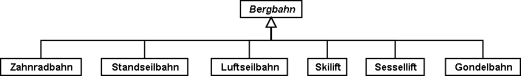

[#_6_2]
=== Arten von Bergbahnen – Modellierung von Arten von Objekten

Für eine grobe Übersicht genügt es, die Bergbahnen grob einzuteilen: Zahnradbahn, Standseilbahn, Luftseilbahn, Skilift, Sessellift, Gondelbahn. Im einfachsten Fall wird die Art als Textattribut festgehalten.

[#listing-06_02-01]
.link:#listing-06_02-01[Listing 06.02-01]
[source]
----
CLASS Bergbahn =
  Name: TEXT*100;
  Art: TEXT*50;
END Bergbahn;
----

Als Folge ist die Person, welche die Daten erfasst, in der Beschreibung sehr frei. Seilbahn, Schwebebahn, Skilift, Ski-Lift – es ist zu befürchten, dass ein rechter Wildwuchs an Be­zeichnungen entsteht. Vermeiden lässt sich dies mit einer Aufzählung.

[#listing-06_02-02]
.link:#listing-06_02-02[Listing 06.02-02]
[source]
----
CLASS Bergbahn =
  Name: TEXT*100;
  Art: (Zahnradbahn,
        Standseilbahn,
        Luftseilbahn
        Skilift,
        Sessellift,
        Gondelbahn);
END Bergbahn;
----

Da jetzt alle zulässigen Möglichkeiten aufgezählt sind, herrscht Ordnung. Oft möchte man nun noch weitere Attribute anfügen, z.B. die Anzahl der Plätze in der Bahn. Bei Stand- und Luftseilbahn ist dies das Fassungsvermögen der ganzen Kabine, bei den Ski- und Sesselliften die Anzahl Personen pro Einzelfahrt. Bei der Zahnradbahn, wo mehrere Wagen zusammengekuppelt werden können, macht die Angabe jedoch keinen Sinn. Dafür interessiert dort vielleicht das Zahnstangensystem. Soll jetzt die Klasse Bergbahn einfach alle Attribute aufweisen, die zum Beschreiben der verschiedenen Arten nötig sind?

Wenn die verschiedenen Arten jeweils eigene Eigenschaften (Attribute oder Beziehungen) aufweisen, ist es sinnvoll, eigene Klassen zu definieren, welche die Basisklasse beerben (vgl. <<_5>>).

.Zahnradbahnen, Standseilbahnen, etc. sind spezielle Bergbahnen. Es gibt jedoch keine Bergbahnen an und für sich: Alle «konkreten» Bergbahnen gehören immer zu einer der Unterklassen. _Bergbahn_ ist damit eine abstrakte Klasse, was im Diagramm mittels Schrägschrift bezeichnet wird.

Es gibt aber keine Bergbahnen, die ausschliesslich Bergbahn sind und nicht gleichzeitig auch einer Unterklasse angehören. Die Klasse Bergbahn wird dann als «abstrakt» deklariert. Eine konkrete Bergbahn muss dann immer eine Zahnradbahn, eine Luftseilbahn, usw. sein.

In der textuellen Schreibweise von INTERLIS 2 werden abstrakte Klassen mit der Angabe (ABSTRACT) in Klammern bezeichnet. Nur nebenbei: Das INTERLIS-Einheitenmodell «Units» kennt eine Einheit «CountedObjects» für abgezählte Objekte wie zum Beispiel die Zahl der Personen in einer Luftseilbahnkabine.

[#listing-06_02-03]
.link:#listing-06_02-03[Listing 06.02-03]
[source]
----
CLASS Bergbahn (ABSTRACT) =
  Name: Text*100;
END Bergbahn;

CLASS Zahnradbahn EXTENDS Bergbahn =
  Stangensystem: (Riggenbach, Abt, vonRoll);
END Zahnradbahn;

CLASS Standseilbahn EXTENDS Bergbahn =
  Fassungsvermoegen: 0 .. 999 [Units.CountedObjects];
END Standseilbahn;

CLASS Luftseilbahn EXTENDS Bergbahn =
  Fassungsvermoegen: 0 .. 999 [Units.CountedObjects];
END Luftseilbahn;

CLASS Skilift EXTENDS Bergbahn =
  PersonenProFahrt: 0 .. 10 [Units.CountedObjects];
END Skilift;

CLASS Sessellift EXTENDS Bergbahn =
  PersonenProFahrt: 0 .. 24 [Units.CountedObjects];
END Sessellift;

CLASS Gondelbahn EXTENDS Bergbahn =
  Fassungsvermoegen: 0 .. 99 [Units.CountedObjects];
END Gondelbahn;
----

Für die Sitzung wurde extra ein Eisenbahner eingeladen, der längere Zeit über Zahnrad­bahnen referierte. Die Anwesenden lernten viel darüber, was für Zahnstangensysteme welt­weit im Einsatz sind und welche Vor- und Nachteile sie jeweils besitzen. Schliesslich fragten sich die Ilistaler aber, was genau die Zahnstangensysteme eigentlich mit ihrem Projekt zu schaffen haben. Es konnte sich auch niemand vorstellen, wie diese und andere Angaben jemals in einem zukünftigen Ausbauschritt von Belang werden könnten. Daher wurde dieses Modell verworfen, weil es zu sehr ins Detail geht und am Ende lediglich Kosten für das Erfassen und Pflegen unnötiger Daten verursacht hätte.

Siehe auch Abschnitt <<_5_1>> zur Verlockung, beim Modellieren allzu sehr ins Detail zu gehen.

[#_6_3]
