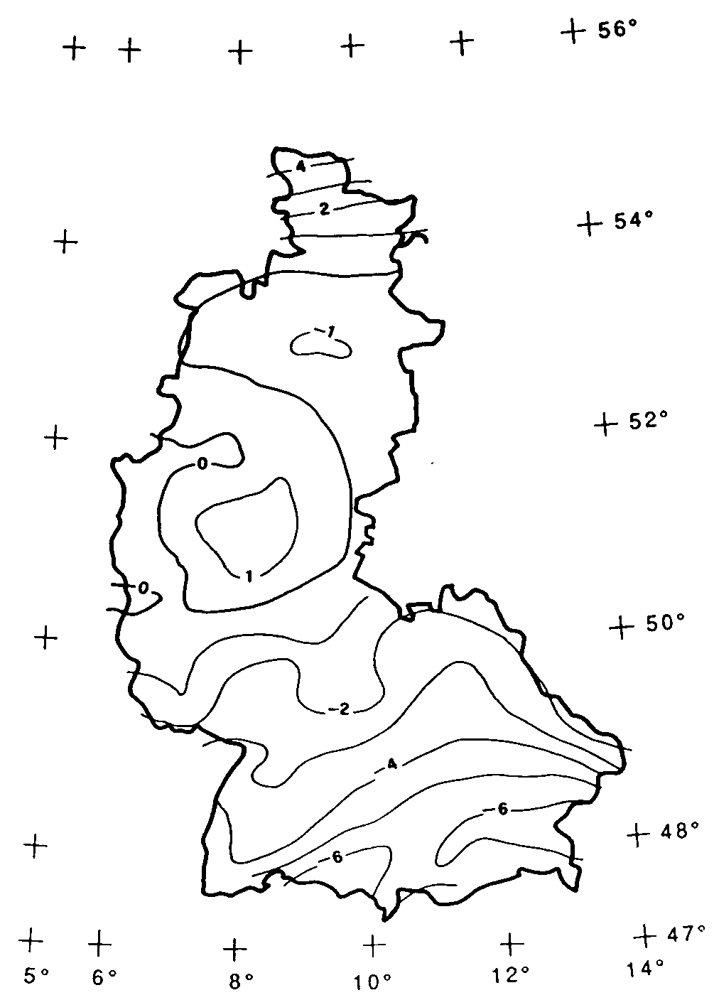

[#_6_7]
=== Wo liegt das Ilistal? – Koordinatentypen

[#_6_7_1]
==== Grundsätzliches zu Koordinatentypen

Mit der Frage «Wo?» ist die Vorstellung eines punktförmigen Ortes in der realen Welt verbunden. Ein solcher Ort kann mittels einer Koordinate beschrieben werden. Eine Koordinate ist typischerweise ein Zahlenpaar das die Lage, oder ein Zahlentripel das die Lage und Höhe, eines Ortes beschreibt.

Für jede Dimension eines Koordinatentyps muss darum wie für jeden numerischen Typ fest­gelegt werden, in welchem Zahlenbereich die zulässigen Werte liegen dürfen und welche Einheit mit ihr verbunden ist.

[source]
----
Lage: COORD 500.00 .. 91000.00 [m],
            700.00 .. 23000.00 [m];

XLage: 500.00 .. 91000.00 [m];
YLage: 700.00 .. 23000.00 [m];
----

Der Unterschied zwischen einem Lageattribut mit einem Koordinatentyp und je einem numerischen Attribut für die X- und die Y-Richtung ist auf den ersten Blick klein. Dank der Definition als Koordinatentyp ist es aber offensichtlich, dass die beiden Angaben zusammen­gehören. Diese Eigenschaft kann durch die Programmpakete auch ausgenützt werden. So sind viele Programme dafür eingerichtet, kartesische Koordinatenwerte grafisch darzustellen.

Kartesische Koordinatenwerte? Als kartesische Koordinaten werden Koordinaten bezeichnet, deren Dimensionen senkrecht aufeinander stehen. Mit der Definition der obigen Lagekoordi­naten wird also ein rechteckiges Fenster von etwa 90 mal 22 Kilometer Ausdehnung beschrieben. Ein Rückfall ins Mittelalter? Ist nun die Erde im Ilistal wieder zur Scheibe ge­worden?

[#_6_7_2]
==== Die umwickelte Zwetschge – Was ist ein Koordinatensystem?

Schon für Ptolemäus war die Erde eine Kugel. Die Vermesser (oder die Geodäten, wie sie heissen, wenn es um die gehobeneren Fragen der Vermessungstechnik geht) mussten sich schon lange von dieser Sicht abwenden, weil sie allzu sehr vereinfacht.

Eine brauchbare Annäherung der Erdoberfläche ist das Ellipsoid, also jene Fläche, die entsteht, wenn sich eine Ellipse um ihre zentrale Achse dreht.

.Dreht sich eine Ellipse um ihre eigene Achse, entsteht im Raum eine flachgedrückte Kugel. Mit einem solchen Ellipsoid kann die Form der Erdoberfläche angenähert werden. +
image::img/image31.png[] image:img/image32.png[]

(Alle Abbildungen in diesem Abschnitt und in Abschnitt <<_6_7_5>> aus: K. Christoph Graf, Verwendung geodätischer Abbildungen bei der Geocodierung von Satelliten-Bildern. Zürich, 1988. Teilweise wurden die Illustrationen vereinfacht. Ursprüngliche Bildquellen siehe dort).

Je nach Weltgegend werden anders gelegene Ellipsoide benutzt, sonst würde die An­näherung zu ungenau. Beispielsweise verwendet die Schweiz das gleiche Ellipsoid wie Deutschland, aber ein leicht anderes als Schweden oder Frankreich.

Als räumliche Gebilde sind Ellipsoide jedoch etwas mühselig zu handhaben. Aus diesem Grund bilden Geodäten das Ellipsoid auf eine Fläche ab. Hierzu legen sie einen Zylinder oder Kegel an das Ellipsoid an und beleuchten es von innen, so dass das Landschaftsbild auf den Zylinder oder den Kegel projiziert wird.

.Das Ellipsoid wird in einen Zylinder (links) oder Kegel (rechts) gewickelt. Anschliessend wird es von innen beleuchtet.
image::img/image33.png[] image:img/image34.png[]

Als nächstes wird der Zylinder oder Kegel mit einer Schere aufgeschnitten, abgerollt und flach auf den Tisch gelegt – fertig ist die Karte!

.Nach erfolgter Projektion wird der Zylinder (bzw. Kegel) aufgeschnitten und abgerollt. Ein gewölbter Körper wie etwa ein Ellipsoid oder eine Kugel könnte zwar aufgeschnitten, aber nicht flach abgerollt werden.
image::img/image35.png[]

Zuletzt werden feine, rechtwinklig aufeinander stehende Linien über die Karte gelegt: Das *Koordinatensystem* der Karte. Bei jedem Koordinatentyp muss darum auch festgelegt werden, welches Koordinatensystem ihm zu Grunde liegt.

[source]
----
Lage: COORD 480000 .. 850000.00 [m] {AhlandSys[1]},
            60000 .. 320000.00 [m] {AhlandSys[2]};
----

Die erste Dimension der Koordinate entspricht der ersten Achse des Koordinatensystems mit Namen «AhlandSys», die zweite Dimension der zweiten Achse des gleichen Systems.

[#_6_7_3]
==== Angaben zum Koordinatensystem – Metadaten

Ist «AhlandSys» ein kartesisches, ein ellipsoidisches System? Wie heissen die Achsen? Gibt es Zusammenhänge (z.B. Kartenprojektionen) zu anderen Koordinatensystemen? All diese Angaben können selbst wieder mittels Daten beschrieben werden. Damit klar ist, wie diese Daten strukturiert sind, wird dafür ebenfalls ein Datenmodell formuliert. Ein solches Modell heisst Metamodell, die zugehörigen Daten Metadaten, weil sie dazu dienen, die eigentlichen Daten zu beschreiben.

Die Daten zu einem Metamodell sind in einem anderen, formaleren Sinn «meta» als Angaben zu Herkunft oder Preis (vgl. Abschnitt <<_3_3>>). Für beides ist jedoch unglücklicherweise dieselbe Bezeich­nung verbreitet.

In den einfachen Fällen, wo es auf Grund des Anwendungs- und Einsatzgebietes eines Datenmodells klar ist, zu welchem Koordinatensystem die Koordinaten gehören, kann auf die explizite Angabe des Koordinatensystems verzichtet werden. Es macht aber Sinn, das Koordinatensystem mindestens im Namen des Koordinatentyps anklingen zu lassen.

[source]
----
LandesKoord = COORD 500.00 .. 91000.00 [m],
                    700.00 .. 23000.00 [m];

Lage: LandesKoord;
----

Um Verwechslungen auszuschliessen haben die Ilistaler eine präzise Definition vorgezogen:

[source]
----
REFSYSTEM BASKET CoordSystems ~ CoordSys.CoordsysTopic
  OBJECTS OF GeoCartesian2D: AhlandSys;
----

Sie haben auf der Grundlage des allgemeinen Modells für Koordinatensysteme (CoordSys) ihr Landessystem präzis definiert. Für die Lage wurde dafür in den entsprechenden Daten ein Objekt der Klasse GeoCartesian2D mit dem Namen AhlandSys eingetragen. Die Existenz dieses Dateneintrags wird mittels OBJECTS OF im Modell angemerkt. Das Koordinatensystem „AhlandSys“ ist damit im Modell verfügbar. Bei der Anwendung des Systems muss der Name des Metadatenbestands (CoordSystems) nur erwähnt werden, wenn im aktuellen Modellierungsteil mehrere solche Metadatenbestände definiert sind.

[source]
----
LandesKoord = COORD 500.00 .. 91000.00 [m] {CoordSystems.AhlandSys[1]},
                    700.00 .. 23000.00 [m] {CoordSystems.AhlandSys[2]};
----

[#_6_7_4]
==== Verschiedene Koordinatensysteme

Damit denjenigen Touristen, die über einen einfachen GPS-Empfänger verfügen, ein besonderer Service geboten werden kann, möchten die Ilistaler ihre Koordinaten auch als geografische Koordinaten im globalen WGS84-System anbieten.

[source]
----
WGS84Coord = COORD -90.00000 .. 90.00000 [Angle_Degree] {WGS84[1]},
                   0.00000 .. 359.99999 CIRCULAR [Angle_Degree]
                   {WGS84[2]};

CLASS Bergbahn =
  LageTalstation: LandesKoord;
  LageTalstationWGS: WGS84Koord;
  ....
END Bergbahn;
----

Nun ist es aber offensichtlich, dass die beiden Attribute einen direkten Zusammenhang haben. Landeskoordinaten können doch in WGS84-Koordinaten umgerechnet werden. Die detaillierte Definition einer solchen Umrechnung ist aber nicht Aufgabe einer konzeptuellen Beschreibung der Daten. Es ist aber wünschenswert anzugeben, dass die einen Koordinaten aus den anderen gerechnet werden können.

[source]
----
!! Umrechnung von Koordinaten im Ahländer Landessystem zu WGS84.
!! Funktionen werden in Abschnitt 7.2 diskutiert.
FUNCTION AhlandToWGS84 (Ah: Ahland.LandesKoord): WGS84Koord;

CLASS Bergbahn =
  LageTalstation: Ahland.LandesKoord;
  LageTalstationWGS: WGS84Koord := AhlandToWGS84 (LageTalstation);
  ....
END Bergbahn;
----

[#_6_7_5]
==== Dreidimensionale Koordinaten

Den Skifahrern und Wanderern rund um das Ilishorn genügen natürlich die Lagekoordinaten nicht. Grosse Höhendifferenzen lassen die Skifahrerherzen höher schlagen, während der Wanderer Schweissperlen oder schlotternde Knie befürchten muss. Höhen sind gefragt! Koordinatentypen können darum auch drei Dimensionen aufweisen.

[source]
----
LandesKoord3 = COORD 500.00 .. 91000.00 [m] {AhlandSys[1]},
                     700.00 .. 23000.00 [m] {AhlandSys[2]},
                     0.00 .. 9000.00 [m] {AhlandHoehenSys[1]};

WGS84Koord = COORD -90.00000 .. 90.00000 [Angle_Degree] {WGS84[1]},
                   0.00000 .. 359.99999 CIRCULAR [Angle_Degree]
                   {WGS84[2]},
                   -2000.00 .. 9000.00 [m] {WGS84H[1]};
----

Bei den Höhen stellt sich noch ein besonderes Problem. Wo ist eigentlich die Höhe 0? Wie kann man die Höhe eines Punktes gegenüber dieser Höhe 0 bestimmen? Die Geodäten unterscheiden vor allem zwischen den Höhen gemäss dem Schwerefeld der Erde (Schwere- oder Geoid-Höhe; 0 ist die Höhe der gedachten Fortsetzung des Meeres unter den Kontinenten) und Höhen gemäss der geometrischen Annäherung der Erde (Ellipsoid-Höhe; 0 ist die Oberfläche des Ellipsoids).

.Das Schwerefeld der Erde: Beim Geoid wird die Meeresoberfläche in Gedanken unter den Kontinenten fortgesetzt. Gebirgsmassive, Meeresgräben etc. beeinflussen das Schwerefeld und verformen so die gedachte Wasseroberfläche. Diese Zeichnung ist sehr stark überhöht.
image::img/image36.png[]

.Je nach gewähltem Bezugssystem besitzt Punkt Q eine andere Höhe.
image::img/image37.png[]

Die Landeskoordinatensysteme verwenden typischerweise Geoidhöhen. Darum bezieht sich die dritte Dimension der Landeskoordinaten auch nicht einfach auf die dritte Achse des Landessystems, sondern auf die erste Achse eines speziellen Höhen­systems.

Dagegen werden die Koordinaten bei GPS-Messungen rein geometrisch aus Satelliten­positionen bestimmt, ohne dass das Schwerefeld der Erde eine Rolle spielen würde. WGS84-Höhen sind also Ellipsoidhöhen.

image::img/image38.png[] +
.Die Schwerehöhe kann bis zu einigen Metern von der Ellipsoidhöhe abweichen. Gezeigt sind die Abweichungen zum jeweils üblichen Ellipsoid der Schweiz, von Frankreich und dem ehemaligen West-Deutschland.
image::img/image39.png[] 

Die Umrechnung zwischen Schwerehöhen und Ellipsoidhöhen kann vor allem dort ein Problem sein, wo der Bereich der zulässigen Koordinaten ein Gebiet abdeckt, dessen Schwerefeld nicht mehr homogen ist. Zum Glück sind diese Fragen bei der Modellierung nur von geringer Bedeutung. Einen kleinen Gedanken sind sie aber dennoch wert.

[#_6_8]
