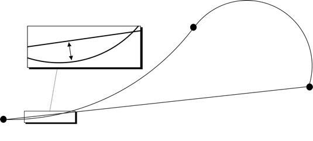
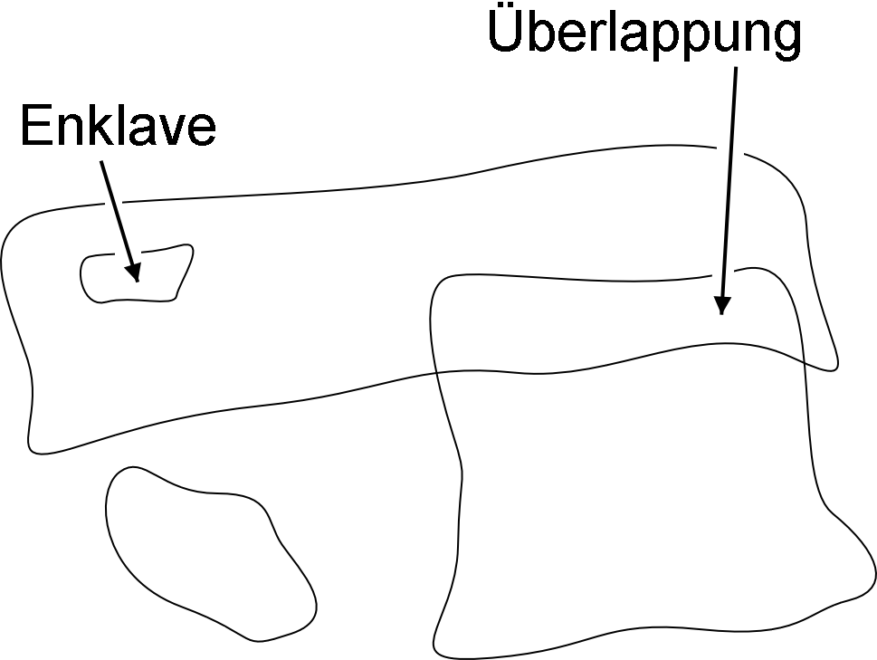
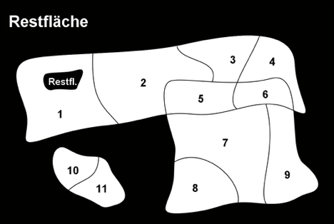
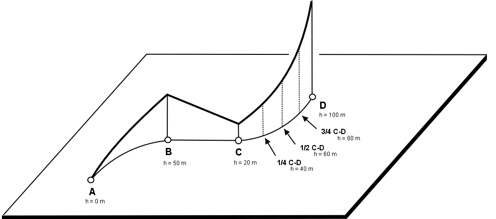

[#_6_9]
=== Ist eine Piste eine Linie oder eine Fläche? – Geometrietypen

[#_6_9_1]
==== Einfache konzeptuelle Sicht einer Linie

Vom Standpunkt der Skifahrer aus gesehen ist der Bedarf klar: Sie wollen wissen, wo die Piste beginnt, wo sie endet und wo sie grob durchführt. Gibt es ein Gasthaus am Pistenrand? Führt die Piste über freie Hänge oder durch den Wald? Für diese Information genügt es, den Pistenverlauf als Linie zu beschreiben.

Unter einem Linientyp darf man sich zunächst genau das vorstellen, was das Wort ver­spricht: Eine mehr oder minder komplizierte Verbindung zwischen zwei Punkten.

In diesem Sinn ist ein Linientyp nichts anderes als z.B. ein numerischer Typ oder besser noch ein Koordinatentyp. Da die an der Linie beteiligten Punkte durch Koordinaten beschrie­ben werden müssen, ist es zwingend, dass ein Linientyp immer mit einem Koordinatentyp verbunden sein muss.

In INTERLIS könnte man schreiben:

[source]
----
AhlandLinie = POLYLINE VERTEX Ahland.LandesKoord;

CLASS Piste =
  Verlauf: AhlandLinie;
END Piste;
----

Der Pistenverlauf wird mittels Linien beschrieben, die auf dem Ahländer Landes-Koordinatensystem basieren. Die Stützpunkte der Linien im Ahländer Landessystem stützen sich deshalb auf den Koordinatentyp des Landessystems ab.

[#_6_9_2]
==== Linienstücke

Es ist offensichtlich: Die Piste vom Ilishorn zur Ilisegg ist eine komplizierte Linie. Die Pisten bei den Ponyliften dagegen relativ einfach. Alles mit demselben Typ beschreibbar? Die Lösung liegt darin, dass die Linie als Ganzes in einzelne Linienstücke aufgeteilt wird. Jedes Linienstück ist selbst eine einfache Geometrie (z.B. eine Gerade, ein Stück eines Kreisbogens) und schliesst jeweils an das Vorgängerstück an.

Diesen Sachverhalt könnte man im konzeptuellen Modell auch darstellen. Das wäre aber eher eine überflüssige Belastung. Wenn man einmal weiss, dass Linien immer so aufgebaut sind, muss dies ja nicht mehr dargestellt werden.

.Der Verlauf einer Piste ist eine Linie. Diese bestehen ihrerseits aus einzelnen Linienstücken, von denen es verschiedene Arten gibt: Geradenstücke, Kreisbogen­stücke, etc.
image::img/image43.png[]

Es macht aber durchaus Sinn anzugeben, welche Arten von Linienstücken bei einem be­stimmten Linientyp vorkommen dürfen.

[source]
----
AhlandLinie = POLYLINE WITH (STRAIGHTS, ARCS) VERTEX Ahland.LandesKoord;
----

Mit dieser INTERLIS 2-Definition wird angegeben, dass Linien dieses Typs Geraden- und Kreisbogenstücke aufweisen dürfen.

In vielen Fällen – so auch bei den Pisten – macht es keinen Sinn, dass eine Linie Schnittpunkte mit sich selbst aufweist. Solche Einschränkungen gehören auch zum konzeptuellen Modell. Aufgrund von Ungenauigkeiten beim Vermessen (und teils auch beim Berechnen) ist es jedoch möglich, dass eine an sich überlappungsfreie Form ganz leichte Überlappungen aufweist. Aus diesem Grund ist die maximal noch zulässige Überlappung Teil des Modells. Sie wird in den Einheiten der zugehörigen Koordinaten angegeben.

Nachdem das Ahländer Landes-Koordinatensystem Meter verwendet, sind mit dieser Defini­tion Überlappungen bis zu 2 cm erlaubt:

[source]
----
AhlandLinie = POLYLINE WITH (STRAIGHTS, ARCS)
              VERTEX Ahland.LandesKoord
              WITHOUT OVERLAPS > 0.02;
----

.Kleine Überschneidungen sind manchmal nicht vermeidbar. Es ist Teil des Modells, +

wie gross die Überlappung (im Bild die Pfeilhöhe) höchstens sein darf.

[#_6_9_3]
==== Gerichtete Linien

Als Skifahrer erwartet man natürlich, dass die Linienstücke der Piste vom Ilishorn zur Ilisegg beim Ilishorn beginnen und bei der Ilisegg enden. Man möchte ja hinunterfahren und nicht die Steigfelle montieren! Zur Beschreibung anderer Objekte (z.B. der Wanderwege) ist jedoch die Richtung nicht von Bedeutung. Wo die Richtung der Linien von Bedeutung ist, soll dies im konzeptuellen Modell auch angegeben werden.

[source]
----
AhlandLinieGerichtet = DIRECTED POLYLINE VERTEX Ahland.LandesKoord;

CLASS Piste =
  Verlauf: AhlandLinieGerichtet;
END Piste;
----

[#_6_9_4]
==== Flächen

Für den Pistendienst der Ilishornbahnen stellte sich die Frage, ob die Beschreibung der Pisten für seine Zwecke genügt. Damit immer klar ist, welche Bereiche jeweils präpariert werden müssen, wird eine Darstellung als Fläche vorgezogen.

[source]
----
DOMAIN
  AhlandLinieGerichtet = DIRECTED POLYLINE WITH (STRAIGHTS, ARCS)
                         VERTEX Ahland.LandesKoord;

  AhlandFlaeche = SURFACE WITH (STRAIGHTS, ARCS)
                  VERTEX Ahland.LandesKoord;

CLASS Piste =
  Verlauf: AhlandLinieGerichtet;
  Praepariert: AhlandFlaeche;
END Piste;
----

Kurz vor der Ilisegg steht mitten in der Piste ein grosser Baum – oder anders gesagt, die Piste geht links und rechts am Baum vorbei.

.Mitten in der Piste steht ein grosser Baum. Für Skifahrer mag die Lage brenzlig sein, aber um das Datenmodell braucht man sich nicht zu sorgen: Trotz der Enklave ist die Piste eine einzige Fläche.
image::img/image45.png[]

Ist die zu präparierende Fläche noch eine einzige Fläche? Mit Flächen – mindestens im Sinne von INTERLIS – sind immer zusammenhängende Bereiche gemeint. Auch wenn sie im Innern Aussparungen (Löcher, Enklaven) haben, sind es immer noch zusammen­hängende Bereiche und können damit als eine Fläche beschrieben werden.

[NOTE]
Eine Fläche hat genau eine *äussere Begrenzung*. Sie darf keine, eine oder mehrere *innere Begrenzungen* (Enklaven) haben.

Oben beim Ilishorn liegen verschiedene Pisten anfänglich so nahe beieinander, dass eine gemeinsame präparierte Fläche entsteht. Welcher Flächenteil soll nun welcher Piste zugeordnet werden? Im Ilistäli kreuzen sich zwei Pisten. Damit wird die Fläche ja doppelt erfasst. Für die Abschätzung des Arbeitsaufwandes für die Präparierung stört das natürlich.

Der Pistendienst hat sich darum für eine andere Modellierung entschieden: Die zu präpa­rierenden Flächen werden nicht direkt den Pisten zugeordnet, sondern als eigenständige Pistenabschnitte geführt. Jeder Pistenabschnitt ist eine Fläche. Die Pistenabschnitte sollen sich aber nie überlappen, da ein bestimmter Geländeabschnitt schliesslich nur einmal prä­pariert werden muss.

[source]
----
DOMAIN
  AhlandGebietseinteilung = AREA WITH (STRAIGHTS, ARCS)
                            VERTEX Ahland.LandesKoord;

CLASS Pistenzustand =
  PraeparierteFlaeche: AhlandGebietseinteilung;
END Pistenzustand;
----

Da solche überlappungsfreien Flächen recht häufig vorkommen, wurde dafür in INTERLIS ein eigener Typ (AREA) eingeführt. Statt von Flächen wird von Gebietseinteilungen gesprochen.

.Beim gewöhnlichen Flächentyp (SURFACE, links) dürfen sich die Flächen verschiedener Objekte überlappen. Beispielsweise spricht nichts dagegen, wenn dasselbe Stück Land gleichzeitig zu zwei Skipisten gehört. Dagegen wird bei einer Gebietseinteilung (AREA, rechts) gefordert, dass jeder Punkt im Land eindeutig einem Objekt zugeordnet werden kann, wenn er nicht zur Restfläche (schwarz dargestellt) gehört. Ein Beispiel sind die Abschnitte, welche der Pistendienst präpariert.
 

[#_6_9_5]
==== Dreidimensionale Linientypen

Ist der zur Liniendefinition gehörige Koordinatentyp ein dreidimensionaler Typ, ist auch der Linientyp dreidimensional. INTERLIS 2 verzichtet dabei darauf, die dritte Dimension gleichberechtigt zu den ersten beiden zu führen, da in geographischen Anwendungen die drei Dimensionen immer in die Lage und eine Höheninformation aufgeteilt werden können.

[NOTE]
INTERLIS 2 unterstützt Linien mit 2.5 Dimensionen.

Dabei wird davon ausgegangen, dass jeder Stützpunkt (Punkt zwischen zwei Linienstücken) mit Lage und Höhe definiert ist und die Höhe auf dem Linienstück entsprechend der Länge des Kurvenstückteils linear interpoliert wird.

.INTERLIS unterstützt 2.5-dimensionale Linien: Die Höhe zwischen zwei Stützpunkten wird immer linear interpoliert. An jener Stelle, wo auf dem Boden ein Viertel des Weges zwischen C und D zurückgelegt wurde, ist auch ein Viertel des Höhenunterschieds überwunden.

Sollte man den Pistenverlauf nun nicht mit einem dreidimensionalen Linientyp modellieren? Rein technisch wäre dies offenbar kein Problem, und die Höhe spielt schliesslich beim Ski­fahren eine wichtige Rolle. Dagegen spricht aber, dass die Höhe des Pistenverlaufs keine unabhängige Grösse ist: Kennt man die Lage, ergibt sich die Höhe aus der Geländeform. Die Höhe des Pistenverlaufs kann damit anhand seiner Lage und einem Geländemodell berech­net werden. Aus konzeptueller Sicht ist es darum vorzuziehen, auf die Höheninformation beim Pistenverlauf zu verzichten.

Anders kann es bei Strassen und Eisenbahnen sein, denn bei Brücken und Tunnels stimmt die Höhe nicht mit der Terrainhöhe überein. Allenfalls wird auch für die Höhe eine so grosse Genauigkeit gefordert, dass eine Ableitung aus dem Geländemodell nicht in Frage kommt. In gewissen Fällen kann es auch Sinn machen, die Kunstbauten (mit Höhe) unabhängig vom Trasseeverlauf zu modellieren. In diesem Fall würde die effektive Trasseehöhe im Bereich der Kunstbauten aus dem Modell errechnet; an den übrigen Stellen würde auf das Gelände­modell zurückgegriffen.

Ein wichtiges Entscheidungskriterium in dieser Frage dürfte der Aufwand für Erfassung und Nachführung sein.

[#_6_10]
