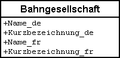

[#_6_11]
=== Wie wird im Ilistal gesprochen? – Mehrsprachigkeit

[#_6_11_1]
==== Pro Sprache ein Attribut

Im bisherigen Modell besitzt eine Bahngesellschaft einen Namen sowie eine Kurzbezeichnung. Wie kann damit erfasst werden, dass die Ilishornbahnen (IhB) auf Französisch _Remontées mécaniques de la Dent d'Ili (RDI)_ heissen?

Es liegt nahe, die Objektklasse Bahngesellschaft um den französische Namen und die Kurz­bezeichnung zu ergänzen:

.Die Objektklasse Bahngesellschaft mit Namen und Kurzbezeichnung, +

jeweils auf Deutsch und Französisch.

Damit wäre der Fall klar. Was aber, wenn eines Tages der Wunsch aufkommen sollte, den Namen auch noch in einer dritten, vierten oder fünften Sprache zu erfassen? An sich kein Problem – es handelt sich ja nur um eine kleine Änderung des Datenmodells!

[WARNING]
Es ist ja tatsächlich keine grosse Sache, ein Kästchen auf Papier um einige Zeilen zu erweitern. Wenn aber das Computersystem erst einmal realisiert worden ist, kann auch eine derart kleine Änderung aufwändig sein: Eingabeformulare wechseln, Programme müssen angepasst werden, Daten sind neu zu erfassen, usw.

[#_6_11_2]
==== Sprachabhängige Bezeichnungen als Strukturelemente

Besser ist es daher, wenn die konkrete Sprache gar nicht im Datenmodell vorkommt. In der folgenden neuen Version weist eine Bahngesellschaft eine Menge von Bahnbezeichnungen auf. Da der Umgang mit mehreren Sprachen ein häufiges Anliegen ist, erbt die Struktur Bahnbezeichnung die Grundstruktur Bezeichnung, welche die Sprache und einen Text umfasst.

[source]
----
STRUCTURE Bezeichung =
  Name: TEXT;
  Sprache: TEXT*2;
END Bezeichnung;

STRUCTURE Bahnbezeichnung EXTENDS Bezeichnung =
  Name (EXTENDED): TEXT*100;
  Kurzbezeichnung: TEXT*10;
END Bahnbezeichnung;

CLASS Bahngesellschaft =
  Namen: BAG {1..*} OF Bahnbezeichnung;
END Bahngesellschaft;
----

Oder bildlich:

.Einer Bahngesellschaft sind Bahnbezeichnungen zugeordnet. Da eine Gesellschaft mehrere Namen besitzen kann, ist es ohne Aufwand möglich, neue Namen in anderen Sprachen aufzunehmen. Die Details der Zuordnung (Angaben wie 1..++*++ oder das aus­gefüllte Viereck) werden weiter unten im Zusammenhang mit Beziehungen diskutiert.
image::img/image50.png[]

[WARNING]
Zu beachten ist aber, dass nicht jedes Text-Attribut mehrsprachig sein muss. Familien­namen von Personen werden zum Beispiel nicht übersetzt.

Um Bezeichnungen in einer anderen Sprache hinzuzufügen, sind nur neue Daten zu erfassen. Das Datenmodell muss deswegen nicht angepasst werden.

[#_6_11_3]
==== Strukturelemente dürfen auf Objekte verweisen

Wer kennt schon die Sprachabkürzung für das Rätoromanische? rr? rm! Im Rahmen des nationalen Verbandes ist es klar, welche Sprachen für die Bezeichnungen der Bahngesell­schaften in Frage kommen. Bei der Erfassung einer Bahn ist in der Regel nur eine Ab­kürzung zu beachten. Die kann man sich gut merken, weshalb der nationale Tourismus­verband sein Modell wie oben beschrieben aufgebaut hat.

Wäre dies nicht der Fall gewesen, hätte man ein Modell gewählt, bei dem die Sprachen eigentliche Objekte sind. Das Sprachobjekt würde die Abkürzung und z.B. den Namen je als Text in der eigenen Sprache und in englisch enthalten.

.In dieser Variante verweist die (Sprach)Bezeichnung (eine Struktur) auf die Sprache (eine normale Objektklasse).
image::img/image51.png[]

Die Bezeichnung verweist so auf die Sprache. Dieser Verweis ist aber nicht eine vollwertige Beziehung (vgl. Abschnitt <<_6_13>>), da die Bezeichnungen keine Identität haben. Aus Sicht des Sprachobjektes besteht darum auch kein direkter Zugang zu den Bezeichnungselementen. Dieser müsste über eine Sicht etabliert werden (vgl. Abschnitt <<_6_17>>).

[#_6_12]
