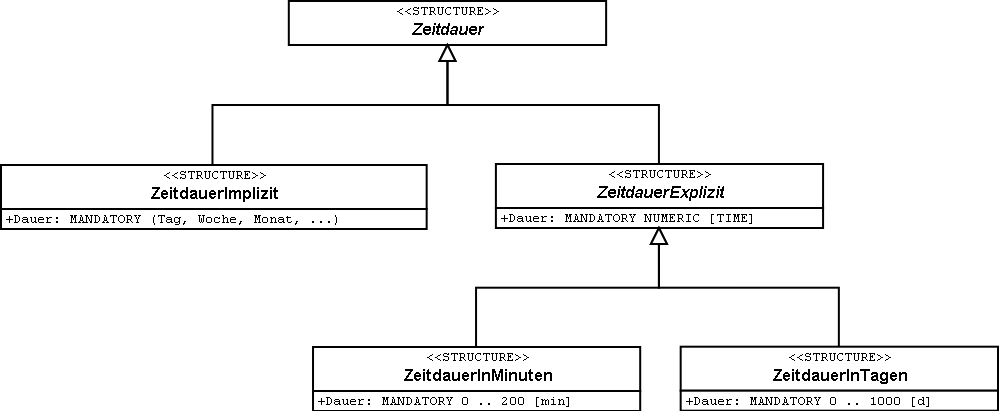

[#_6_12]
=== Wie ticken die Ilistaler? – Modellierung von Zeit

[#_6_12_1]
==== Für einfache Ansprüche genügend

Der nationale Verband hat eine simple Lösung und für die Gültigkeitsdauer von Billettarten ein Attribut vorgesehen, das die Anzahl Tage (mit einer Stelle nach dem Komma) vorsieht.

[source]
----
Gueltigkeitsdauer: 0.0 .. 1000.0 [d];
----

Wenn man es – wie die Ilistaler – etwas genauer nimmt, stellen sich verschiedene Fragen:

* Ein Billett, das am Ausgabetag gültig ist, hat doch nicht die gleiche Gültigkeit wie eines, das 24 Stunden gültig ist.
* Ein Monat hat mal 28, mal 30, mal 31 Tage.
* Ein Jahr mal 365, mal 366 Tage.

Auf Anfrage erhielten die Ilistaler vom nationalen Verband die Antwort, dass folgendes gelte:

* 0.9: am Ausgabetag;
* 30.0: einen Monat;
* 365.0: ein Jahr.

[WARNING]
Solche Behelfslösungen sind manchmal verlockend, weil sie auf den ersten Blick einfach sind. Aber was, wenn mit 30.0 Tagen wirklich so viele Tage und nicht ein Monat gemeint ist? Darum ist Vorsicht angesagt!

Wie könnte aber eine bessere Lösung aussehen?

[#_6_12_2]
==== Zeitdauer als Struktur

Objekteigenschaften wie die Gültigkeitsdauer können nicht immer durch einen einzigen Wert genügend präzis beschrieben werden. Manchmal braucht es eine Gruppe von Attributen, manchmal macht es Sinn, verschiedene Erweiterungen vorzusehen. Dafür bietet sich die Struktur an.

[source]
----
STRUCTURE Zeitdauer (ABSTRACT) =
END Zeitdauer;

STRUCTURE ZeitdauerHeute EXTENDS Zeitdauer =
END ZeitdauerHeute;

STRUCTURE ZeitdauerInTagen EXTENDS Zeitdauer =
  Dauer: MANDATORY Tage [d];
END ZeitdauerInTagen;

....

CLASS Billettart =
  Gueltigkeitsdauer: Zeitdauer;
END Billettart;
----

Die Gültigkeitsdauer einer bestimmten Billettart ist mit einer Instanz (einem Strukturelement) der Struktur ZeitdauerHeute, ZeitdauerInTagen, ZeitdauerInMonaten, etc. beschrieben. Man könnte sogar noch etwas präziser modellieren und dafür sorgen, dass die Einheit einer expliziten Dauer (Tag, Monat, etc.) immer eine Zeitdauer sein muss und für implizite Zeitdauern (Woche, Saison, etc.) eine Aufzählung definieren:

[source]
----
STRUCTURE Zeitdauer (ABSTRACT) =
END Zeitdauer;

STRUCTURE ZeitdauerImplizit EXTENDS Zeitdauer =
  Dauer: MANDATORY (Tag, Woche, Monat, Jahr);
END ZeitdauerImplizit;

STRUCTURE ZeitdauerExplizit (ABSTRACT) EXTENDS Zeitdauer =
  Dauer (ABSTRACT): MANDATORY NUMERIC [TIME];
END ZeitdauerExplizit;

STRUCTURE ZeitdauerInMinuten EXTENDS ZeitdauerExplizit =
  Dauer (EXTENDED): MANDATORY 0 .. 200 [Units.min];
END ZeitdauerInMinuten;

STRUCTURE ZeitdauerInTagen EXTENDS ZeitdauerExplizit =
  Dauer (EXTENDED): MANDATORY 0 .. 1000 [d];
END inTagen;
----

.Zeitdauer in einer detaillierten Modellierung mit Strukturen. Damit ist es möglich, dass die Gültigkeitsdauer eines Billetts je nach Bedarf ein Monat (ZeitdauerImplizit; links) oder exakt dreissig Tage (ZeitdauerInTagen; rechts) ist.

[WARNING]
Eine präzise, detaillierte, sachgerechte Modellierung ist grundsätzlich anzustreben. Man muss sich dabei aber immer bewusst sein, dass sie nur einen Sinn macht, wenn sie auch umgesetzt werden kann. Was bedeutet es für die Programmpakete? Und vor allem: Was bedeutet es für die Leute, die Daten erfassen und bearbeiten? Und um­gekehrt: Was bedeutet es, wenn man vom möglichst korrekten Modell abweicht? Es kann also auch besser sein, sich mit der einfachen Lösung zufrieden zu geben.

[#_6_12_3]
==== Genaue Zeitdauer

Zeitdauern gibt es nicht nur für Billette. Die Ilistaler veranstalten jeden Freitag ein Skirennen für ihre Gäste. Dort werden Rennzeiten in Minuten, Sekunden und deren Bruchteilen gemessen. Es ist nahe liegend, dafür eine Struktur zu definieren, welche die Attribute Minuten und Sekunden aufweist:

[source]
----
STRUCTURE ZeitdauerInMinuten EXTENDS Zeitdauer =
  Minuten: 0 .. 9999.99 [min];
  Sekunden: 0.00 .. 59.99 [s];
END ZeitdauerInMinuten;
----

Damit der Zusammenhang zwischen Minuten und Sekunden ausgedrückt werden kann, bietet sich eine zusätzliche Möglichkeit an:

[source]
----
STRUCTURE ZeitdauerInMinuten EXTENDS Zeitdauer =
  Minuten: 0 .. 9999.99 [min];
  CONTINOUS SUBDIVISION Sekunden: 0.00 .. 59.99 [s];
END ZeitdauerInMinuten;
----

Damit ist nichts darüber ausgesagt, in welcher Form solche Zeitdauern in einem Computer gespeichert werden. Es handelt sich nur um ein Mittel, möglichst konzeptnah zu beschrei­ben, was man wirklich will.

[#_6_12_4]
==== Formatierte Darstellung von Strukturen

Das Gästeskirennen wird immer so gestaltet, dass selbst die Skilehrer sicher mehr als dreissig Sekunden für die Abfahrt benötigen. Wer mehr als drei Minuten und dreissig Sekunden braucht, erhält am Ziel einen wärmenden Tee, die Zeit wird jedoch nicht festgehalten.

Wie kann nun der zulässige Wertebereich (30 Sekunden bis 3 Minuten und 30 Sekunden) festgehalten werden? Die Lösung liegt in formatierten Wertebereichen:

[source]
----
DOMAIN ZeitdauerinMinSec = FORMAT BASED ON ZeitdauerInMinuten
  ( Minuten ":" Sekunden );

CLASS Rennzeit =
  Vorname: TEXT*50;
  Name: TEXT*50;
  Laufzeit: FORMAT ZeitdauerinMinSec "0:30" .. "3:30";
END Rennzeit;
----

Ein formatierter Wertebereich nimmt auf eine Struktur Bezug und legt fest, wie aus den einzelnen Attributen der Struktur und aus Textkonstanten eine Zeichenkette entsteht, die den Wert wiedergibt. In dieser Form können Wertebereichseinschränkungen festgelegt werden. Die formatierte Darstellung wird auch für den Datentransfer verwendet. Damit ist es zum Teil möglich, gewisse extern verlangte Darstellungsformen direkt zu unterstützen. Dies kann insbesondere für die XML-konforme Darstellung von Zeitdauern und Zeitpunkten genutzt werden.

[#_6_12_5]
==== Zeitpunkte

Statusmeldungen über das Wetter, die Wartezeiten, die Pistenverhältnisse sollen im Ilistal immer mit dem Zeitpunkt versehen werden, in dem der Zustand festgestellt wurde. Erster Gedanke: Uhrzeit in Stunden und Minuten. Ja, damit man Statistiken erstellen kann, gehört natürlich noch das Datum dazu. Das sollte genügen!

Wirklich? Die Ilishornbahnen führen in schönen Vollmondnächten Sonderkurse zum Ilishorn, damit dort die beliebte Dracula-Party steigen kann. Da werden natürlich auch mitten in der Nacht Statusmeldungen geschickt. Auch um 2.30 Uhr. Auch an jenem Sonntag in der Früh, als von der Sommer- auf die Winterzeit umgestellt wurde. Allerdings gab es da ein grosses Durcheinander: Die neuste Meldung war plötzlich älter als die letzte! Natürlich: Alle Zeiten zwischen 2.00 und 3.00 gab es in jener Nacht doppelt, einmal gemäss Sommerzeit, einmal gemäss Winterzeit.

[NOTE]
Bei Zeitpunkten ist es immer wichtig zu wissen, welches das Bezugssystem ist.

Meinen wir Sommerzeit, Winterzeit, UTC? Je internationaler, desto wichtiger! Da kommt man schnell einmal auf den Gedanken, alles in UTC festzuhalten und es dem Computer zu überlassen, die Daten dem Benützer gemäss seiner aktuellen Zeitzone zu präsentieren.

INTERLIS 2 bietet die Möglichkeit an, nicht nur den Wertebereich und die Einheit, sondern auch das Bezugssystem zu beschreiben. Für die UTC-Zeiten sind bereits formatierte Wertebereiche gemäss den XML-Regeln vordefiniert (XMLTime, XMLDate, XMLDateTime).

Gerade Öffnungs- oder Betriebszeiten werden aber vorzugsweise in der lokalen Zeit be­schrieben. Mitternacht ist eben um 24.00 Uhr, unabhängig davon, ob gerade Sommer- oder Winterzeit ist. Dies sind aber nicht eigentliche Zeitpunkte. Vielmehr beschreiben sie Differen­zen zu Mitternacht gemäss der aktuell gültigen Zeit.

[WARNING]
Überall dort, wo die Zeit, vor allem aber wo Zeitpunkte von Bedeutung sind, ist höchste Aufmerksamkeit geboten.

[#_6_13]
