[#_6_13]
=== Tarifbereiche, Zustandsmeldungen – Beziehungen

[#_6_13_1]
==== Rollen

Was ist nun eine Bahngesellschaft für eine bestimmte Bergbahn? Eigentümerin? Betreiberin!

In der Beziehung zwischen Bahngesellschaft und Bergbahn ist die Bahngesellschaft in der Rolle der Betreiberin.

Der Rollenname wird in der Grafik am Ende der Beziehungslinie auf der Seite des Inhabers der Rolle angeschrieben. Wenn er sich aber nicht vom Klassennamen unterscheidet, wird der Rollenname meistens weggelassen.

[source]
----
ASSOCIATION =
  Betreiberin -- {1} Bahngesellschaft;
  Bahn -- {*} Bergbahn;
END;
----

Abbildung 48: Gemäss diesem Modell ist es möglich, nach der Betreiberin einer Bergbahn zu fragen. «Betreiberin» ist eine _Rolle_, welche die Klasse «Bahngesellschaft» gegenüber der Klasse «Bergbahn» einnimmt. Unten ist die Beziehung zwischen Bahngesellschaft und Bergbahn in der Schreibweise von INTERLIS wiedergegeben.

Es ist durchaus normal, dass Rollennamen gewählt werden, die sich nicht von den Klassen­namen unterscheiden. In der Beziehung Bergbahn – Tarifbereich macht es z.B. wenig Sinn, weitere Namen einzuführen. Allerdings ist der Bedarf nach zusätzlichen Namen ganz offen­sichtlich gegeben, wenn eine Beziehung zwischen Objekten der gleichen Klasse besteht. So möchte man auch darstellen können, dass eine Bahngesellschaft andere Bahngesellschaften als Tochtergesellschaften besitzt.

[source]
----
ASSOCIATION =
  Tochter -- {*} Bahngesellschaft;
  Mutter -- {0..1} Bahngesellschaft;
END;
----

Abbildung 49: Eine Bahngesellschaft kann einerseits Mutter, andererseits auch Tochter einer anderen Bahngesellschaft sein. In solchen Fällen eignet sich der Klassenname nicht als Rollen­name. Das Beispiel ist links in der graphischen Schreibweise von UML, rechts in der textuellen von INTERLIS wiedergegeben.

[#_6_13_2]
==== Stärke einer Beziehung

Assoziation, Aggregation und Komposition sind Ausdrücke für unterschiedliche Stärken von Beziehungen.

* *Assoziation* – Die Beziehung zwischen Tarifbereich und Bergbahn ist recht lose. Zwei Objekte sind einander zugeordnet, ohne dass eines dem anderen untergeordnet wäre. Die Assoziation ist eine Beziehung unter Gleichberechtigten. Meist sind in einem Datenmodell die Mehrzahl der Beziehungen gewöhnliche Assoziationen.
* *Aggregation* – Eine Bergbahn ist ein recht selbständiges Objekt. Es braucht aber immer eine Bahngesellschaft, um sie zu betreiben. Die Bahngesellschaft ist der Bergbahn übergeordnet.
* *Komposition* – Eine sehr enge Beziehung besteht zwischen einer Bergbahn und ihren Masten. Ein Mast macht eigentlich nur im Zusammenhang mit einer bestimmten Bergbahn einen Sinn. Die Komposition ist die Beziehung zwischen einem Ganzen und seinen (meist physischen) Bestandteilen.

Die Einteilung gemäss diesen Stärken ist nicht immer einfach. Aus Sicht der Informatik gibt es aber noch weitere Regeln, die den Entscheid manchmal vereinfachen:

* *Löschen* – Wird eine Bahngesellschaft gelöscht, hat das auf die zugeordneten Bergbahnen nur zur Folge, dass sie keine Betreiberin mehr haben. Wird jedoch eine Bergbahn gelöscht, werden auch alle Masten gelöscht. Das Löschen eines Ganzen entfernt auch alle Bestandteile, die mit ihm über eine Komposition verbunden sind.
* *Kopieren* – Wird eine Bahngesellschaft kopiert (in der Natur natürlich nicht so einfach wie im Computer), werden auch für alle zugeordneten Bergbahnen Kopien erstellt und der neuen Bahngesellschaft zugeordnet. Für jede Bergbahn werden entsprechend wieder Kopien der Masten erstellt. Das Kopieren eines Objekts erzeugt auch Duplikate jener Objekte, die ihm über Aggregationen und Kompositionen zugeordnet sind. Da­gegen entstehen keine Kopien für jene Objekte, die ihm über gewöhnliche Assozia­tionen zugeordnet sind.

.Assoziation (links), Aggregation (mitte) und Komposition (rechts) sind verschiedene Arten von Beziehungen. Sie unterscheiden sich in ihrer Bindungsstärke: Ein Mast ist so eng mit seiner Bergbahn verbunden, dass er als Bestandteil der Bahn aufgefasst werden kann. Im Vergleich zur Komposition sind Aggregation und Assoziation schwächer.
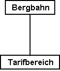 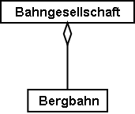 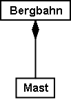

Die Schreibweise in INTERLIS ist der graphischen Darstellung nachempfunden. Der Rollen­name muss jedoch auch dann geschrieben werden, wenn er sich nicht vom Namen der Klasse unterscheidet.

[source]
----
ASSOCIATION =
  Bergbahn -- Bergbahn;
  Tarifbereich -- Tarifbereich;
END;

ASSOCIATION =
  Betreiberin -<> Bahngesellschaft;
  Bergbahn -- Bergbahn;
END;

ASSOCIATION =
  Bergbahn -<#> Bergbahn;
  Mast -- Mast;
END;
----

[#_6_13_3]
==== Beziehungen mit Attributen

Diverse Billettarten berechtigen zur Fahrt auf Bergbahnen, die von verschiedenen Bahngesellschaften betrieben werden. Damit stellt sich die Frage, wie der mit dem Billettverkauf erzielte Erlös auf die einzelnen Gesellschaften verteilt wird. Zum Beispiel berechtigt das nationale Generalabonnement auch zur Fahrt mit der Ilishornbahn. Gemäss Abmachung erhalten die Ilishornbahnen dafür 0.13% des Umsatzes an Generalabonnements vergütet.

Beziehungen können auch Attribute aufweisen und haben so den Charakter von speziellen Klassen.

[source]
----
ASSOCIATION Anteil =
  Beteiligter -- {*} Bahngesellschaft;
  Billettart -- {*} Billettart;

  ATTRIBUTE
    Anteil: 0.00 .. 100.00 [Units.Percent];

END Anteil;
----

Abbildung 51: Eine Bahngesellschaft ist zu einem festgelegten Prozentsatz am Erlös aus dem Verkauf einer bestimmten Art von Billetten beteiligt. Der vereinbarte Anteil ist weder eine Eigenschaft der Bahngesellschaft noch der Billettart. Stattdessen handelt es sich um eine Eigenschaft ihrer Beziehung. Solche Situationen werden mit Beziehungsklassen modelliert.

[#_6_13_4]
==== Mehrgliedrige Beziehungen

Um einen besseren Überblick über die Billettverkäufe zu erhalten, möchte der nationale Verband in Zukunft noch festhalten, welche Verkaufsstelle von welcher Billettart in welcher Saison wie viele Exemplare verkauft hat.

[source]
----
ASSOCIATION Verkauf =
  Verkaufsstelle -- {*} Verkaufsstelle;
  Saison -- {*} Saison;
  Billettart -- {*} Billettart;

  ATTRIBUTE
    Anzahl: 1 .. 999999 [Units.CountedObjects];
    Betrag: 0.00 .. 9999999.99 [Ahland.Taler];

END Verkauf;
----

Abbildung 52: Der Verkauf wird pro Verkaufsstelle, Billettart und Saison erfasst. Es handelt sich um eine mehrgliedrige Beziehung zwischen drei gleichberechtigten Partnern (den Klassen Verkaufsstelle, Billettart und Saison). Dagegen ist «Verkauf» eine Beziehungsklasse, welche Eigenschaften der Beziehung (zum Beispiel die Anzahl verkaufter Billette sowie den umgesetzten Betrag) festhält.

Verkaufsstelle, Billettart und Saison stehen damit in einer gleichberechtigten Beziehung, auf der zudem noch die Anzahl der verkauften Billette und der umgesetzte Betrag als Attribut festgehalten sind. Diese Beziehung verbindet also nicht mehr zwei, sondern drei Klassen.

Was aber bedeuten bei mehrgliedrigen Beziehungen die Kardinalitätsangaben genau? Die Kardinalitätsangabe z.B. bei der Saison (++*++) sagt aus, dass es für eine bestimmte Kombina­tion von Billettart und Verkaufsstelle beliebig viele Zuordnungen zu Saison-Objekten geben darf. Würde dort die Kardinalität 1 angegeben, würde das bedeuten, dass eine bestimmte Billettart durch eine bestimmte Verkaufsstelle nur während einer Saison verkauft werden kann.

Etwas kompliziert. Braucht es wirklich mehrgliedrige Beziehungen, oder könnte man sie auf die üblichen Zweierbeziehungen reduzieren?

.Beziehungen zwischen mehr als zwei Beteiligten lassen sich auf gewöhnliche Zweier­beziehungen reduzieren. Die frühere Beziehungsklasse (hier: Verkauf) wird zum gleich­berechtigten Partner, und die Beteiligten stehen neu nur noch mit der früheren Bezie­hungsklasse in Beziehung.
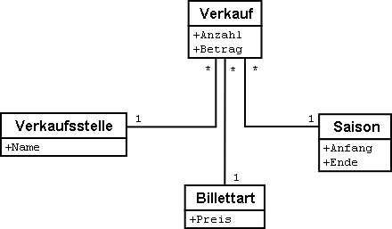

Dieses Modell drückt aber weniger klar aus, dass die drei Klassen Verkaufsstelle, Billettart und Saison als Dreiergruppe miteinander in Beziehung stehen.

[#_6_13_5]
==== Geordnete Beziehungen

Betrachtet man alle Bergbahnen, die der Bahngesellschaft Ilishorn-Bahnen zugeordnet sind, ist damit keine bestimmte Ordnung verbunden. Die Frage, ob in der Zuordnung die Luftseilbahn vor oder nach der Gondelbahn erscheint, macht eigentlich gar keinen Sinn.

Natürlich kann man die Bahnen einer Gesellschaft in alphabetischer Reihenfolge auflisten. Diese Sortierung ist aber nicht eine Eigenschaft der Beziehung zwischen Bahngesellschaft und Bergbahn, sondern eine reine Frage der Darstellung. Für einen anderen Zweck könnte auch eine Sortierung nach Investitionskosten, Fahrzeit usw. interessant sein.

Aber wäre es nicht sinnvoll, mit der Ordnung festzuhalten, in welcher Reihenfolge die Beziehung etabliert wurde? Zuerst wurde die Luftseilbahn eröffnet, dann der Skilift, dann die Gondelbahn, usw. In diesem Fall wäre es allerdings besser, die Beziehung mit den Attributen Betriebsanfang und Betriebsende zu versehen. Dann könnte sogar festgehalten werden, welche Betreiberin es über die Zeit hinweg gegeben hat. Es macht in diesem Fall auch keinen Sinn mehr, die Beziehung als Aggregation aufzufassen.

.Um festzuhalten, in welcher Reihenfolge die Bergbahnen einer Gesellschaft ihren Betrieb aufgenommen haben, könnte man an sich eine geordnete Beziehung ver­wenden. Das Modell der nächsten Abbildung ist jedoch besser.
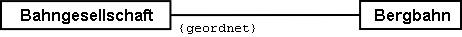

.Das Modell ist mit einer Beziehungsklasse sauberer, weil damit weitere Auswertungen möglich sind. So können hier die Bahnen einer Gesellschaft auch anhand der Betriebs­einstellung sortiert werden, und ein Computerprogramm kann anzeigen, von wem eine Bergbahn in der Vergangenheit betrieben wurde.
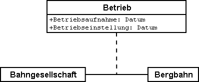

Ähnliche Überlegungen gelten für die Beziehung zwischen Bergbahn und Masten: Mit der Ordnung der Beziehung könnte man die Reihenfolge von Tal- zu Bergstation ausdrücken. Konzeptuell ist es aber besser, beim Mast ein Lageattribut zu führen und die Reihenfolge dann aus dieser Lage und dem Trasseeverlauf abzuleiten.

[WARNING]
Bevor eine Beziehung als geordnet deklariert wird, sollte genau überlegt werden, ob die Ordnung nicht aus Attributen der beteiligten Klassen oder der Beziehung abgeleitet werden kann.

Wo machen geordnete Beziehungen überhaupt einen Sinn? Die Gondelbahn von Ilisbad aufs Ilishorn hat Gondeln, die nicht fix auf dem Transportseil montiert sind. Sie können vielmehr in der Tal- und Bergstation abgestellt und je nach Bedarf ins Seil eingeklinkt werden. Welche Gondeln sind aktuell in welcher Reihenfolge auf das Seil eingeklinkt?

.Zwar besitzt eine Gondel eine Nummer, aber diese sagt nichts über die Reihenfolge auf dem Seil aus. In diesem Fall ist eine geordnete Beziehung sinnvoll.
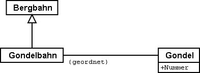

Hier ist die Ordnung gefragt. Die Nummer der Gondel kann nicht für die Ordnung heran­gezogen werden. Diese identifiziert einfach die konkrete Gondel. Über die Reihenfolge, wie sie aktuell auf dem Seil angeordnet sind, sagt sie überhaupt nichts aus.

[#_6_13_6]
==== Beziehungen erweitern

Eine Bahngesellschaft steht zu einer Reihe von Personen in Beziehung. Die einen sind bei ihr angestellt, die anderen an ihr beteiligt. Ähnlich wie zuvor bei den verschiedenen Arten von Bergbahnen gibt es auch hier verschiedene Möglichkeiten der Modellierung.

Eine Möglichkeit besteht darin, zwei unterschiedliche Beziehungen zwischen Bahngesell­schaft und Person zu definieren: eine für die Anstellung, eine für die Beteiligung. Falls diese Unterscheidung einmal nicht wesentlich sein sollte (vielleicht für den weihnachtlichen Versand eines Schoggi-Bähnlis), muss sich eine Anwendung aber um beide Beziehungen kümmern.

.Eine Person kann gegenüber einer Bahngesellschaft Angestellter und/oder Beteiligter sein. Hier wird dies mit zwei verschiedenen Beziehungen modelliert. Will nun die Bahn­gesellschaft sowohl ihre Angestellten als auch ihre Teilhaber mit einem weihnachtlichen Schoggiversand beglücken, sind beide Beziehungen auszuwerten.
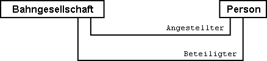

Eine andere Möglichkeit der Modellierung besteht darin, primär eine Beziehung zu definieren (Kontakt) und diese dann zu Anstellung bzw. Beteiligung zu erweitern. Solange es für eine Anwendung nicht relevant ist, in welcher Art des Kontaktes die Person zur Bahngesellschaft steht, nutzt sie die Kontakt-Beziehung und erhält so alle Personen, die in irgendeiner Art und Weise zur Bahngesellschaft in Kontakt stehen. Eine Anwendung, für die nur die Angestellten relevant sind, nutzt die erweiterte Beziehung Anstellung und erhält so nur die angestellten Personen.

.In dieser Variante ist die Beziehung zwischen Bahngesellschaft und Person allgemein mit der Beziehungsklasse «Kontakt» modelliert. Als Spezialfall eines Kontaktes gibt es auch die Anstellung und die Beteiligung. Wer nach den Kontakten der Gesellschaft fragt, wird automatisch auch die Angestellten und die Beteiligten erhalten. Beziehungsklassen sind also ähnlich wie Objektklassen erweiterbar, was im Diagramm wiederum mit einem weissen Pfeil gezeichnet wird.
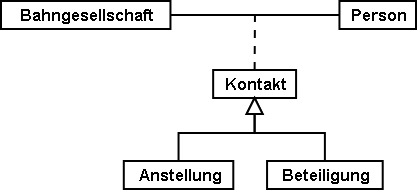

Man könnte die Anstellungsbeziehung nochmals erweitern und z.B. eine Beziehung «Direk­tion» einführen.

.Die Beziehung zwischen einer Bahngesellschaft und ihrem Direktor («Direktion») ist ein Spezialfall der Beziehung «Anstellung».
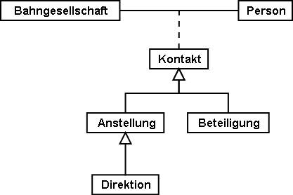

Erweiterungen von Beziehungen gehen häufig Hand in Hand mit der Erweiterung von Objektklassen. Statt dass man z.B. von Anfang an sagt, eine Bergbahn weise Masten auf, spricht man zunächst nur von Betriebsmitteln. Diese sind der Bahn locker, also mittels Asso­ziation, zugeordnet. Da Masten eine wichtige Eigenschaft verschiedener Arten von Berg­bahnen sind, wird die Klasse «BahnMitMasten» eingeführt. Diese hat eine Beziehung zu den Masten. Diese wird aber als Erweiterung der Beziehung zwischen Bergbahnen und Be­triebsmitteln geführt. Da die Masten – etwa im Gegensatz zu einem Pistenfahrzeug – un­mittelbar zu Bergbahn gehören, wird diese Beziehung zur Komposition. Die Stärke einer Beziehung darf in einer Erweiterung aber nur verstärkt, nicht aber gelockert werden, da sie sonst im Widerspruch zur Definition in der Basisdefinition stünde.

.Bergbahn und Betriebsmittel führen eine allgemeine Beziehung, die von spezialisierten Klassen zur Komposition verstärkt wird.
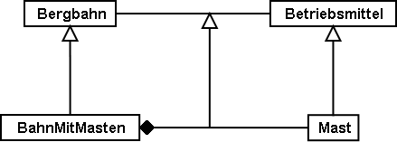

[#_6_13_7]
==== Ableitbare Beziehungen

Wenn der Magen knurrt, wählt man lieber eine Skipiste, an der ein Gasthaus liegt. Deswegen müssen aber Pisten und Gasthäuser nicht miteinander in einer ständigen, ausdrücklichen Beziehung stehen. Es genügt zu wissen, dass das Gasthaus in der Nähe der Piste steht. Eine Aussage, die auf Grund von Lage des Gasthauses und Verlauf der Piste (je in Landeskoordinaten) herleitbar ist.

[WARNING]
Nicht alles, was im Rahmen von Auswertungen zusammengehört, muss über Bezie­hungen verbunden sein. Gerade bei räumlichen Daten bilden die Koordinaten ein ideales Mittel, um Zusammenhänge bei Bedarf herzustellen.

Es macht auch keinen Sinn, sämtliche ableitbaren Beziehungen ins konzeptuelle Modell auf­zunehmen. Darum fehlt die ableitbare Beziehung zwischen Gasthäusern und Pisten im konzeptuellen Modell.

[WARNING]
Im konzeptuellen Modell sollen nur diejenigen impliziten Beziehungen beschrieben werden, die von konzeptueller Bedeutung sind. Darüber hinaus können die Programme natürlich weitere Beziehungen herstellen, indem sie die Attribute der Objekte geschickt (nicht zuletzt gemäss ihrer Lage) miteinander vergleichen.

Von konzeptueller Bedeutung sind nicht zuletzt Beziehungen, die in einigen Fällen explizit definiert werden müssen und in anderen Fällen ableitbar sind. Die Ableitung kann sich auf die Geographie oder auf andere Eigenschaften abstützen. Beispielsweise führten die Ilistaler einen speziellen Tarifbereich ein, der als Fläche umschrieben ist und alle Bergbahnen umfasst, deren Tal- und Bergstation innerhalb der Fläche liegt.

[source]
----
CLASS TarifbereichInGegend EXTENDS NatTour.Billette.Tarifbereich =
  Gegend: AhlandFlaeche;
END TarifbereichInGegend;
----

Die Beziehung zwischen diesem speziellen Tarifbereich und den Bergbahnen in der zuge­hörigen Gegend kann mit Sichten (vgl. Abschnitt <<_6_17>>) automatisch etabliert werden.

[#_6_14]
