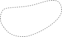

[#_6_17]
=== Tarifbereiche interessieren nicht – Sichten

[#_6_17_1]
==== Allgemeines

Wenn im Rahmen der Modellierung von Sichten gesprochen wird, ist natürlich nicht die Aussicht vom Ilishorn mit dem schönen Blick auf das Krummhorn gemeint. Und doch gibt es eine Ähnlichkeit zwischen den beiden Arten von Sichten. Auf der topographischen Karte sind das Ilishorn, das Krummhorn und all die weiteren Berge, Täler und Dörfer eingezeichnet und dabei die Höhe mit Zahlen und Höhenschichtlinien verdeutlicht. Die Karte zeigt die Aussicht vom Ilishorn nicht direkt. Sie enthält aber die nötigen Angaben, aus denen geübte Kartenleser die Aussicht vom Ilishorn ableiten. Auf Grund der Karte ist klar, dass der Spitz, der links hinter dem Krummhorn hervor schaut, der «Schwarze Zahn» ist.

In der Analogie entsprechen die Objektklassen, Strukturen und Beziehungen eines Modells der Karte. Sie sind ein sachgerechtes Abbild der Realität, ohne dass ein bestimmter Verwen­dungszweck vorgegeben ist. Die Sichten eines Modells entsprechen der Aussicht vom Ilis­horn. Sie unterstützen einen bestimmten Verwendungszweck. Sie nehmen dazu auf die Grundlagen oder andere Sichten Bezug und formen sie so um, dass der Verwendungszweck möglichst gut unterstützt werden kann.

Aber warum sollen dann solche Sichten Bestandteil des Modells sein? Im Modell soll doch nicht vorweggenommen werden, ob die Aussicht quasi vom Ilishorn, dem Krummhorn, vom Schwarzen Zahn oder vom Sprudelbecken im Garten des Kurhauses Ilisbad aus genossen wird.

Vor allem für spezielle Konsistenzbedingungen (vgl. Abschnitt <<_6_14_3>>) und für ableitbare Be­ziehungen (vgl. Abschnitt <<_6_13_7>>) machen Sichten auch im Bereich des Modells Sinn. Sichten sind aber auch nützlich, wenn die Daten für einen bestimmten Zweck in einer aufbereiteten Form geliefert werden müssen, wie das bei der Datenabgabe zuhanden des Ilistaler Web­dienstes der Fall ist. INTERLIS 2 bietet zudem noch die Möglichkeit, Grafiken zu definieren. Die Grundlage für die Grafikdefinition bilden in vielen Fällen nicht die Originaldaten, sondern Sichten.

[NOTE]
*Sichten* bauen auf Objektklassen oder anderen Sichten auf und kombinieren die Ausgangsobjekte auf verschiedene Arten zu neuen Sichtobjekten.

Die Sichten von INTERLIS sind mit den Sichten von Datenbank-Systemen vergleichbar.

[#_6_17_2]
==== Das Bildungsgesetz von Sichten

Der detaillierte Trasseeverlauf interessiert vielleicht nicht, wohl aber die Länge. Bei Personen ist man manchmal eher am Alter als am Geburtsjahr interessiert. Diese Eigenschaften können aus anderen abgeleitet werden. Würden derartige «redundante» Eigenschaften als normale Daten erfasst, wäre die Gefahr sehr gross, dass sie nicht immer auf dem aktuellen Stand wären. Das Alter einer Person ändert sich schliesslich jedes Jahr!

[NOTE]
Die wesentlichste Eigenschaft einer Sicht ist ihr *Bildungsgesetz.* Es legt fest, wie aus den Ausgangsobjekten abgeleitete Sichtobjekte entstehen.

Beispielsweise ist die Sicht «PersonMitAltersangabe» von der Objektklasse «Person» abgeleitet, der so genannten Basis. Eine einzelne PersonMitAltersangabe trägt dieselben Eigenschaften (ALL OF) mit genau denselben Werten wie die ursprüngliche Person. Zusätzlich fügt die Sicht aber noch eine weitere Eigenschaft «Alter» hinzu. Das Alter be­stimmt sich (:=) aus der Differenz von Jahrgang und laufendem Jahr.

[#listing-06_17-01]
.link:#listing-06_17-01[Listing 06.17-01]
[source]
----
VIEW PersonMitAltersangabe
  PROJECTION OF Person;
=
  ALL OF Person;
  Alter: 0 .. 150 [y] := Difference (Person -> Jahrgang,
    PARAMETER laufendesJahr);
END PersonMitAltersangabe;
----

In diesem Beispiel gibt es für jedes Objekt der Basisklasse genau ein virtuelles Sicht-Objekt, also zu jeder Person eine entsprechende PersonMitAltersangabe.

[NOTE]
Das einfachste Bildungsgesetz einer Sicht ist die *Projektion (PROJECTION)*. Sie baut auf der Basis auf, übernimmt einzelne (oder auch alle) Attribute in einer beliebigen Reihenfolge und kann weitere, abgeleitete Attribute beifügen. Sie dient damit vor allem dazu, Attribute der bisherigen Objekte in eine nutzungsfreundliche Form zu bringen.

Der nationale Tourismusverband hat eine abstrakte Klasse «Tarifbereich» definiert. Im Ilistal will man jedoch nicht einzeln aufzählen, welche Bahnen an welchem Tarifbereich teilnehmen. Stattdessen gibt es dort räumlich umgrenzte Tarifbereiche, die im Modell mit der Klasse «TarifbereichInGegend» beschrieben sind. Diese Klasse besitzt eine Eigenschaft «Gegend» für das geographisch umgrenzte Gültigkeitsgebiet.

Eine Bahn, deren Tal- und Bergstation innerhalb der Gegend eines solchen räumlichen Tarif­bereichs liegt, akzeptiert automatisch dessen Billette.

.Welche Bergbahn liegt in der Gegend von welchem Tarifbereich? Die Ilistaler interessieren sich für alle Paare aus Bergbahn Bb und TarifbereichInGegend T, bei denen zwei Bedingungen gelten: Die Talstation von Bb muss in der Gegend von T liegen, und ebenso muss auch die Bergstation von Bb in der Gegend von T liegen.
image::img/image69.png[]

Aber welche Bergbahn liegt nun konkret in der Gegend von welchem Tarifbereich? Auch diese Verbindung von Bergbahn und Tarifbereich kann mit einer Sicht abgeleitet werden.

[NOTE]
Das wohl wichtigste Bildungsgesetz einer Sicht ist die *Verbindung (JOIN)*. Sie verbindet mehrere Basisobjekte zu einem Sichtobjekt. Die Verbindung ist insbesondere als Basis für abgeleitete Beziehungen von Bedeutung.

[#listing-06_17-02]
.link:#listing-06_17-02[Listing 06.17-02]
[source]
----
VIEW BergbahnenInGegend
  JOIN OF Bb ~ Bergbahn,
    T ~ TarifbereichInGegend;
  WHERE InSurface(Bb -> LageTalstation, T -> Gegend) AND
    InSurface(Bb -> LageBergstation, T -> Gegend);
=
END BergbahnenInGegend;
----

Mit der Verbindung werden zunächst sämtliche Paare gebildet: Jedes Objekt der Klasse Bergbahn wird mit jedem Objekt der Klasse TarifbereichInGegend zu einem virtuellen Sicht­objekt verbunden.

Mit dem WHERE-Teil wird die Menge aller Sichtobjekte auf jene eingeschränkt, bei denen die Bedingungen erfüllt sind. Damit bleiben nur jene Paare aus Bergbahn _Bb_ und Tarifbereich _T_ übrig, wo Tal- und Bergstation von _Bb_ im Gebiet von _T_ liegt. In der obigen Abbildung erfüllen von den sechs möglichen Paaren (drei Bahnen x zwei Tarifbereiche) vier die Bedingung.

[width="65%",cols="^32%,^21%,^47%",]
|===
|Bergbahn _Bb_ |Tarifbereich _T_ a|
Tal- und Bergstation von _Bb_
in der Gegend von _T_?

|image:img/image70.png[] | |ja
|image:img/image72.png[] | |ja
| | |nein
|image:img/image70.png[] |image:img/image74.png[] |nein
|image:img/image72.png[] |image:img/image74.png[] |ja
| |image:img/image74.png[] |ja
|===

Abbildung 63: Betrachtet man in der letzten Abbildung sämtliche Kombinationen aus Bergbahn _Bb_ +
und Tarifbereich _T,_ so liegt nur bei vier der sechs Paare die Berg- und Talstation +
von _Bb_ in der Gegend von _T._

In einem letzten Schritt wird wie bei einer Projektion bestimmt, welche Eigenschaften die Sichtobjekte tragen sollen, und wie sich ihre Werte bestimmen. In der obigen INTERLIS-Defi­nition dient hierzu der Teil nach dem Gleichheitszeichen.

Gibt es zu einer Bergbahn keinen Tarifbereich, kommt sie in der Sicht nicht vor. Mit einer be­sonderen Verbindung (so genannte «*Outer Join*») wird verlangt, dass auch dann ein Sicht­objekt entstehen soll, wenn zu einer Bergbahn kein Tarifbereich besteht. Für die konkrete Anwendung der Bergbahnen und Tarifbereiche macht dies allerdings kaum einen Sinn.

Möchte man ein Verzeichnis aller Koordinaten von Tal- und Bergstationen, steht dem die Tatsache entgegen, dass diese Koordinaten als einzelne Attribute der Bergbahnen aufbewahrt sind. Mit der *Vereinigung (UNION)* können sie aber zu einer Menge von gleichberechtigten Sichtobjekten zusammengefasst werden.

[#listing-06_17-03]
.link:#listing-06_17-03[Listing 06.17-03]
[source]
----
VIEW StationsKoordinaten
  UNION OF Talstation ~ Bergbahn, Bergstation ~ Bergbahn;
=
  Koordinaten: Ahland.LandesKoord := Talstation -> LageTalstation,
    Bergstation -> LageBergstation;
END StationsKoordinaten;
----

Die Menge der Sichtobjekte ist hier gleich der doppelten Menge der Bergbahnen. Einmal werden sie unter dem Aspekt Talstation, einmal unter dem Aspekt Bergstation ausgewertet. Das Attribut wird je nachdem gemäss dem Lageattribut von Tal- bzw. Bergstation gesetzt.

*Zusammenfassung (AGGREGATION)* und *Aufschlüsselung (INSPECTION)* haben mit Strukturattributen zu tun. Eine Zusammenfassung fasst Objekte, die bestimmte gleiche Eigenschaften aufweisen, zu einem einzigen Objekt zusammen. Im Rahmen des Sichtobjekts stehen die bisherigen Objekte als Elemente eines Strukturattributes zur Verfügung (vgl. Abschnitt <<_6_17_3>>). Eine Aufschlüsselung sorgt umgekehrt dafür, dass aus Strukturelementen eigenständige Sichtobjekte werden (vgl. Abschnitt <<_6_14_3>>).

[#_6_17_3]
==== Schrittweiser Aufbau von Sichten

Für die Billettkontrolle muss man bei jeder Bergbahn wissen, welche Billettarten gültig sind. Man möchte doch ein Verzeichnis aller Bergbahnen, in dem bei jeder Bergbahn die gültigen Billettarten aufgeführt sind. Losgelöst von den Basisdaten möchte man etwa folgendes Modell definieren:

[#listing-06_17-04]
.link:#listing-06_17-04[Listing 06.17-04]
[source]
----
CLASS Billettart =
  Namen: BAG {1..*} OF Bezeichnung;
  Preis: 0.00 .. 5000.00 [Ahland.Taler];
  Gueltigkeitsdauer: Zeitdauer;
END Billettart;

CLASS Bergbahn =
  Namen: BAG {1..*} OF Bezeichnung;
  GueltigeBillettarten: BAG OF Billettart;
END Bergbahn;
----

Aber wie kann das nun aus den Originaldaten abgeleitet werden? Das ist gar nicht so ein­fach. Einer Bergbahn können mehrere Tarifbereiche zugeordnet sein, welchen ihrerseits wieder mehrere Billettarten zugeordnet sind. Zudem gibt es Tarifbereiche, die alle Berg­bahnen einer Gegend umfassen.

Der letzte Aspekt ist zum Glück schon erledigt, weil es eine abstrakte Beziehung zwischen Bergbahn und Tarifbereich gibt, die «Gültigkeit». Sie wird einerseits durch eine explizite Be­ziehung zwischen den beiden Klassen realisiert («GültigkeitExplizit»). Andererseits kann von der Sicht «BergbahnenInGegend» abgeleitet werden, welche Bahnen aufgrund ihrer Lage die Billette eines Tarifbereichs anerkennen.

Auf dieser Basis kann eine Sicht definiert werden, welche die Bergbahnen mit den Billett­arten verbindet:

[#listing-06_17-05]
.link:#listing-06_17-05[Listing 06.17-05]
[source]
----
VIEW BergbahnUndGueltigeBillettart
  JOIN OF Bb ~ Bergbahn,
    T ~ Tarifbereich,
    Ba ~ Billettart,
    G ~ Gueltigkeit;
  WHERE (G -> Bergbahn == Bb) AND (G -> Tarifbereich == T) AND
    (Ba -> Tarifbereich == T);
=
  BahnNamen: BAG {1..*} OF Bezeichnung := Bb -> Namen;
  BillettNamen: BAG {1..*} OF Bezeichnung := Ba -> Namen;
  Preis: 0.00 .. 5000.00 [Ahland.Taler] := Ba -> Preis;
  Gueltigkeitsdauer: Zeitdauer := Ba -> Gueltigkeitsdauer;
END BergbahnUndGueltigeBillettart;
----

Diese Verbindung kombiniert Bergbahn und Billettart. Sie berücksichtigt dabei die Gültigkeits­beziehung und dass einer Billettart ein Tarifbereich zugeordnet ist, der mit jenem der Gültigkeits-Beziehung übereinstimmen muss. Damit ist das Ziel schon fast erreicht. Die zulässigen Kombinationen von Bergbahn und Billettart sind als Sichtobjekte verfügbar. Nur möchte man sie noch pro Bergbahn zusammenfassen:

[#listing-06_17-06]
.link:#listing-06_17-06[Listing 06.17-06]
[source]
----
VIEW AufBergbahnGueltigeBillettart
  AGGREGATION OF BuGB ~ BergbahnUndGueltigeBillettart
    EQUAL (BuGB -> Bb);
=
  BahnNamen: BAG {1..*} OF Bezeichnung := BuGB -> Bb -> Namen;
  Billettarten: BAG OF BergbahnUndGueltigeBillettart := AGGREGATES;
END AufBergbahnGueltigeBillettart;
----

Eine solche Zusammenfassung erfolgt mit einer Aggregation. Damit werden alle Objekte der Basissicht, die eine bestimmte Bedingung erfüllen (nämlich dass sie zur gleichen Bergbahn gehören), zu einem Sichtobjekt zusammengefasst. Die Menge aller ursprünglichen Sicht­objekte, die zu einem Ganzen zusammengefasst wurde, steht dabei für Strukturattribute zur Verfügung (AGGREGATES).

[#_6_17_4]
==== Sichten erben

Bereits der nationale Verband hat die Sicht definiert, die alle gültigen Billettarten für jede Bergbahn aufführt (Sicht «AufBergbahnGueltigeBillettart», siehe oben). Die Ilistaler wollen diese Sicht auch benutzen. Sie möchten aber auch in dieser Sicht das Attribut Trasseeverlauf einbeziehen, das sie in der eigenen Erweiterung der Klasse Bergbahn definiert haben.

[#listing-06_17-07]
.link:#listing-06_17-07[Listing 06.17-07]
[source]
----
VIEW IhBBergbahnUndGueltigeBillettart
  EXTENDS BergbahnUndGueltigeBillettart
  BASE Bb EXTENDED BY IhBBb ~ IhBBergbahn
=
  Trasseeverlauf := IhBBb -> Trasseeverlauf;
END IhBBergbahnUndGueltigeBillettart;
----

Mit der Definition einer zusätzlichen Basis (muss eine Erweiterung einer bisherigen Basis sein) stehen deren Attribute zur Verfügung. Beruht ein Sichtobjekt nicht auf dieser Erwei­terung (ist es also keine IhBBergbahn), ist das Attribut undefiniert.

[NOTE]
Eine Erweiterung einer Sicht ermöglicht es, Erweiterung der Klassen der Basis­sicht zur Kenntnis zu nehmen und damit deren Attribute auszunützen. Das Bil­dungsgesetz der Sicht kann damit aber nicht grundlegend verändert werden. Es ist nur möglich, zusätzliche Selektionen zu definieren.

[#_6_18]
