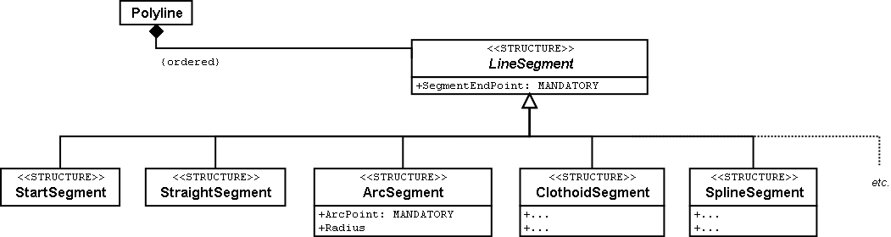
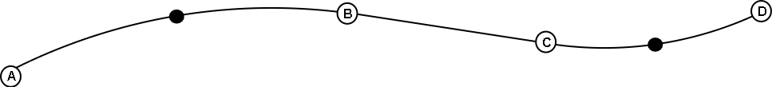
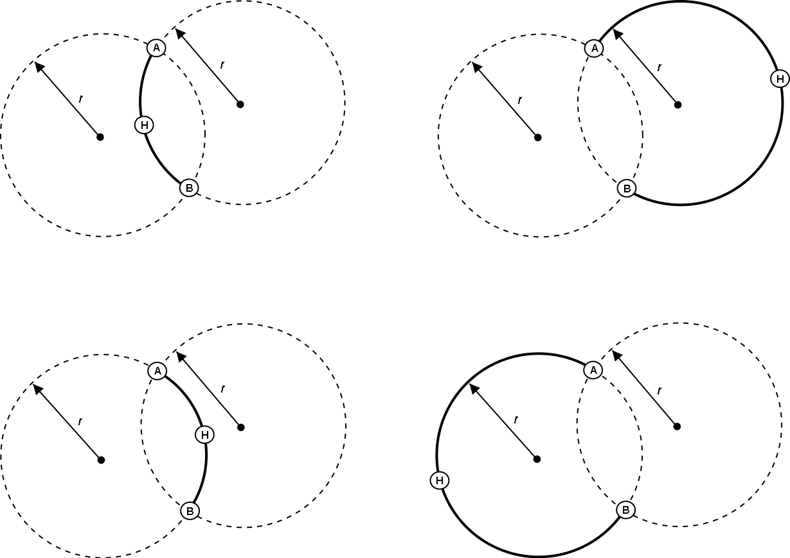

[#_7]
== Die Ilistaler Systeme im Blickfeld

[#_7_1]
=== Was sind normgerechte Systeme? – Systemneutralität

Verschiedene Programmpakete, so das NatTourSys des nationalen Verbandes, aber auch das von den Ilishorn-Bahnen verwendete LiftSys, haben die mittels INTERLIS 2 definierten Modelle implementiert. Sie sind in der Lage, entsprechende Dateien zu erstellen und zu lesen. Sind das nun INTERLIS-Systeme? Allgemein gefragt: Wann erfüllt ein System eine bestimmte Norm?

Eine Beschreibung auf konzeptuellem Niveau hat nicht das Ziel, vorzuschreiben, wie ein Computersystem die beschriebene Vorstellung implementiert. In der Regel werden die Systeme ihre eigenen Möglichkeiten besitzen, um konkrete Anwendungen zu realisieren. Im Idealfall kann das interne Datenmodell direkt aus den Beschreibungen abgeleitet werden. Dies ist jedoch keine Voraussetzung. Es ist durchaus zulässig, dass ein System die Beschreibungen nicht direkt verarbeiten kann. Um kompatibel zu sein, genügt es, wenn ein System direkt oder indirekt (z.B. durch zusätzliche Konversionsprogramme) in der Lage ist, die Daten gemäss der Norm zu behandeln. Eine Norm zur Datenmodellierung sollte darauf verzichten, vorzuschreiben, wie die Systeme eine Anwendung konkret umsetzen. Hier ist Kreativität gefragt, hier soll der Markt spielen. Die Systemunabhängigkeit der Norm ist die Voraussetzung dafür, dass gewünschte Systemwechsel nicht an der Unverträglichkeit der Daten scheitern.

Ein System muss auch nicht die ganze Palette von Fähigkeiten haben, die man sich im Zusammenhang mit einer Beschreibung vorstellen kann. So ist das WebSys z.B. nur in der Lage, INTERLIS 2-Daten einzulesen. Noch extremer ist es mit den Systemen, welche die Zustandsmeldungen von den einzelnen Bergbahnen zur Zentrale schicken. Auf einfachste Art werden Meldungsdaten in vorbereitete Dateien eingefügt, welche gemäss den Regeln der Norm aufgebaut sind.

Stellt eine Anwendung sehr spezielle Anforderungen, kann nicht erwartet werden, dass sie von einer allgemein anwendbaren Norm abgedeckt werden. Die Unterstützung für solche Fälle muss vertraglich mit den Systemherstellern geregelt werden. Allerdings ist dabei Zurückhaltung angebracht, verliert man doch damit einen Teil der Systemunabhängigkeit und schränkt den Kreis der möglichen Systemanbieter ein.

Nachfolgend wird anhand von zwei Beispielen aufgezeigt, wie systemabhängige Aspekte normiert werden können, ohne dass dafür die Interna der Systeme zu stark beeinflusst werden.

[#_7_2]
=== Der Eurokurs schwankt von Tag zu Tag – Parameter und Funktionen

Für jede Billettart ist der Preis in der Landeswährung bekannt. Im Interesse der ausländischen Touristen soll er auch in Euro und US-Dollar bekannt gegeben werden. Man möchte aber nicht bei jeder Änderung der entsprechenden Währungskurse die Preise für alle Billettarten wieder neu eingeben. Sie sollen vielmehr aus der Landeswährung berechnet werden.

[source]
----
CLASS Billettart =
  Name: TEXT*100;
  Preis_TALER: 0.00 .. 5000.00 [Ahland.Taler];
  Preis_EUR: 0 .. 4000 [EUR] := TALERtoEUR (Preis_TALER);
  Preis_USD: 0 .. 4000 [USD] := TALERtoUSD (Preis_TALER);
END Billettart;
----

Immer wenn die Daten im System präsentiert oder als Daten für das WebSys bereitgestellt werden, werden die Euro- und Dollarpreise neu aus den Preisen in der Landeswährung be­rechnet. Die Berechnung erfolgt durch die beiden Funktionen TALERtoEUR bzw. TALER­toUSD. Aber woher soll das LiftSys im Speziellen, aber auch irgendein anderes System wissen, was diese Funktion leisten soll?

Die wichtigste Information besteht aus konzeptueller Sicht in der Tatsache, dass die beiden Fremdwährungspreise nicht als eigenständige Daten behandelt, sondern aus dem Talerpreis abgeleitet werden. Dafür reicht es aus, für eine bestimmte Funktion den Namen und ihre Parameter festzulegen.

[source]
----
FUNCTION TALERtoEUR (Taler: NUMERIC [Ahland.Taler]): NUMERIC [EUR]
  // Umrechnung in Euro //;
----

Die eigentliche Leistung der Funktion wird nur als Erläuterung zwischen // angegeben. Die Implementation bleibt Sache der Systeme. Solche Definitionen sollen auf wenige Basismodelle beschränkt sein, denn sie müssen mit den Herstellern der Systeme vereinbart werden. In INTERLIS 2 wird das Bestehen einer solchen Vereinbarung mit einem Kontrakt angemerkt. Funktionen können nur in solchen Modellen definiert werden, für die ein Kontrakt besteht.

[source]
----
CONTRACTED MODEL IlisTour AT http://www.interlis.ch/models/ahland
  VERSION "2008-01" =
  ...
END IlisTour;
----

Will man die Anzahl der Funktionen möglichst gering halten, müssen sie möglichst allgemein formuliert werden. Zum Beispiel könnte statt TALERToEUR eine allgemein verwendbare Funktion für die Division definiert werden.

[source]
----
FUNCTION Division (Dividend: NUMERIC, Divisor: NUMERIC): NUMERIC;
----

Allerdings vergibt man sich dabei auch wieder Kontrollmöglichkeiten, denn es besteht keine Gewissheit, dass die erste Angabe ein Betrag in der Landeswährung ist. Mit der nachfolgenden Form ist dies hingegen gewährleistet.

[source]
----
FUNCTION ToCurrency (Taler: NUMERIC [Ahland.Taler],
  Wechselkurs: NUMERIC [Ahland.Taler]):
  NUMERIC [MONEY];
----

Aber woher kommt der Wechselkurs? Man könnte für solche Fälle vorsehen, dass in den Systemen gewisse Werte wie der Euro- oder Dollarkurs als Parameter zur Verfügung stehen. Da auch damit wieder in die Systeme eingegriffen wird, ist auch die Definition von System-Parametern nur innerhalb von Kontrakten erlaubt.

[source]
----
PARAMETER
  EURKurs: 0.000 .. 5.000 [Ahland.Taler]; !! Preis eines Euro in Talern
  USDKurs: 0.000 .. 5.000 [Ahland.Taler];

CLASS Billettart =
  Name: Text * 100;
  Preis_TALER: 0.00 .. 5000.00 [Ahland.Taler];
  Preis_EUR: 0 .. 4000 [EUR] := ToCurrency (Preis_TALER, PARAMETER EURKurs);
  Preis_USD: 0 .. 4000 [USD] := ToCurrency (Preis_TALER, PARAMETER USDKurs);
END Billettart;
----

[#_7_3]
=== Auf krummen Wegen – Linienformen

Vielleicht kommt man auf die Idee, den Pistenverlauf nicht mittels Geraden und Kreisbogen zu beschreiben. Man möchte stattdessen beispielsweise Klothoide, Splines oder Bézier-Kurven verwenden. INTERLIS 2 bietet solche Kurvenformen nicht direkt an, lässt aber zu, dass neue Formen für die Linienstücke definiert werden.

Eine Linie besteht aus einer geordneten Menge von Linienstücken. Bei diesen handelt es sich um konkrete Erweiterungen der abstrakten Struktur _LineSegment_. Wer neben den vordefinierten Arten von Liniensegmenten (Geradenstücke und Kreisbögen) zusätzliche benutzen möchte, kann _LineSegment_ mit einer passenden Struktur erweitern.

Wiederum muss eine solche Definition mit den Herstellern vereinbart werden. Schliesslich müssen die Systeme ja mit diesen Linienformen fertig werden. Insbesondere möchte man, dass die Linien auf dem Bildschirm und auf Papier korrekt dargestellt werden.

.INTERLIS-Linien sind aus einzelnen Segmenten zusammengesetzt. Bereits vordefiniert sind Geraden- und Kreisbogenstücke. Die abstrakte Struktur für Liniensegmente kann aber um zusätzliche Formen erweitert werden.

Der Endpunkt eines jeden Segments ist gleichzeitig auch der Anfangspunkt des nächsten. Der Anfangspunkt gehört daher nicht zum Liniensegment. Ein spezielles Startsegment legt fest, wo das erste Linienstück beginnt.

Ein Kreisbogen wäre mit dem Endpunkt noch nicht genügend bestimmt. Daher besitzen Kreisbögen neben ihrem End- auch einen Hilfspunkt, der ebenfalls auf der Linie liegt. Er sollte sich ungefähr in der Mitte zwischen Anfang und Ende des Segments befinden, weil dann die Berechnung genauer wird.

.Diese Linie besteht aus vier Segmenten: Dem Startsegment mit Endpunkt A, einem Kreisbogen-Segment mit Endpunkt B, einem geraden Segment mit Endpunkt C, und einem weiteren Kreisbogen-Segment mit Endpunkt D. Die Hilfspunkte der beiden Kreisbögen liegen auf der Kurve und sind schwarz gezeichnet.

Der Radius eines Kreisbogens kann selbstverständlich immer aus den Koordinaten der Stützpunkte berechnet werden. Allerdings können rechnerische Ungenauigkeiten dazu führen, dass der errechnete Wert vom beabsichtigten abweicht. Wenn der Radius für die Anwendung eine konzeptuelle Bedeutung besitzt, ist dies nicht akzeptabel. Daher können Kreisbogen-Segmente optional mit einem Wert für den Radius versehen wer­den.

Wenn der Radius angegeben ist, wird die exakte Lage der Linie mit diesem Wert bestimmt. Der Hilfspunkt dient in diesem Fall nur noch dazu, eine der vier möglichen Verbindungslinien auszuwählen.

.Wenn der Radius _r_ angegeben ist, dient der Hilfspunkt H nur noch dazu, einen unter den vier möglichen Kreisbögen auszuwählen, welche die Punkte A und B verbinden.

