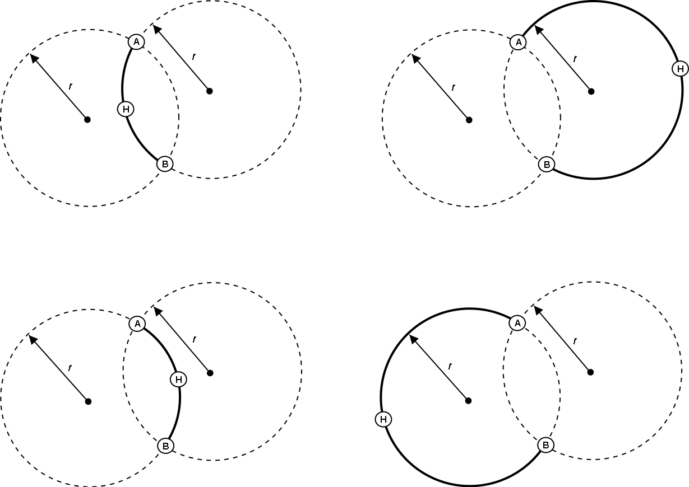

[#_7_3]
=== Auf krummen Wegen – Linienformen

Vielleicht kommt man auf die Idee, den Pistenverlauf nicht mittels Geraden und Kreisbogen zu beschreiben. Man möchte stattdessen beispielsweise Klothoide, Splines oder Bézier-Kurven verwenden. INTERLIS 2 bietet solche Kurvenformen nicht direkt an, lässt aber zu, dass neue Formen für die Linienstücke definiert werden.

Eine Linie besteht aus einer geordneten Menge von Linienstücken. Bei diesen handelt es sich um konkrete Erweiterungen der abstrakten Struktur _LineSegment_. Wer neben den vordefinierten Arten von Liniensegmenten (Geradenstücke und Kreisbögen) zusätzliche benutzen möchte, kann _LineSegment_ mit einer passenden Struktur erweitern.

Wiederum muss eine solche Definition mit den Herstellern vereinbart werden. Schliesslich müssen die Systeme ja mit diesen Linienformen fertig werden. Insbesondere möchte man, dass die Linien auf dem Bildschirm und auf Papier korrekt dargestellt werden.

.INTERLIS-Linien sind aus einzelnen Segmenten zusammengesetzt. Bereits vordefiniert sind Geraden- und Kreisbogenstücke. Die abstrakte Struktur für Liniensegmente kann aber um zusätzliche Formen erweitert werden.
image::img/image75.png[]

Der Endpunkt eines jeden Segments ist gleichzeitig auch der Anfangspunkt des nächsten. Der Anfangspunkt gehört daher nicht zum Liniensegment. Ein spezielles Startsegment legt fest, wo das erste Linienstück beginnt.

Ein Kreisbogen wäre mit dem Endpunkt noch nicht genügend bestimmt. Daher besitzen Kreisbögen neben ihrem End- auch einen Hilfspunkt, der ebenfalls auf der Linie liegt. Er sollte sich ungefähr in der Mitte zwischen Anfang und Ende des Segments befinden, weil dann die Berechnung genauer wird.

.Diese Linie besteht aus vier Segmenten: Dem Startsegment mit Endpunkt A, einem Kreisbogen-Segment mit Endpunkt B, einem geraden Segment mit Endpunkt C, und einem weiteren Kreisbogen-Segment mit Endpunkt D. Die Hilfspunkte der beiden Kreisbögen liegen auf der Kurve und sind schwarz gezeichnet.
image::img/image76.png[]

Der Radius eines Kreisbogens kann selbstverständlich immer aus den Koordinaten der Stützpunkte berechnet werden. Allerdings können rechnerische Ungenauigkeiten dazu führen, dass der errechnete Wert vom beabsichtigten abweicht. Wenn der Radius für die Anwendung eine konzeptuelle Bedeutung besitzt, ist dies nicht akzeptabel. Daher können Kreisbogen-Segmente optional mit einem Wert für den Radius versehen wer­den.

Wenn der Radius angegeben ist, wird die exakte Lage der Linie mit diesem Wert bestimmt. Der Hilfspunkt dient in diesem Fall nur noch dazu, eine der vier möglichen Verbindungslinien auszuwählen.

.Wenn der Radius _r_ angegeben ist, dient der Hilfspunkt H nur noch dazu, einen unter den vier möglichen Kreisbögen auszuwählen, welche die Punkte A und B verbinden.

