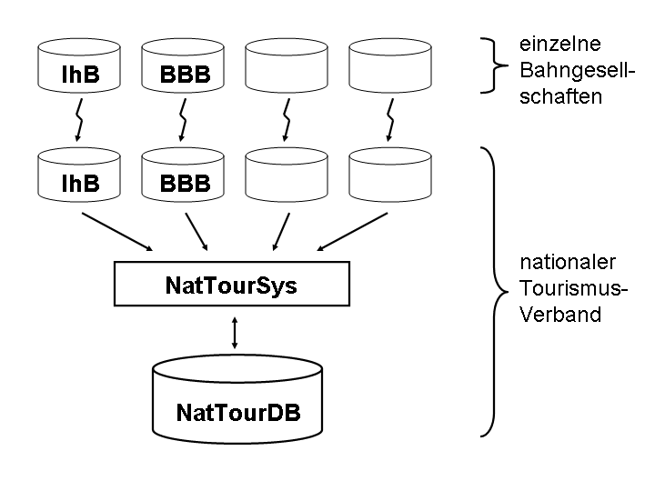

[#_8]
== Die Ilistaler Daten unterwegs

[#_8_1]
=== Aus den Augen, aus dem Sinn – Volltransfer

Erinnern wir uns: Die Ilistaler hatten sorgfältig überlegt, welche Daten sie für ihre geplante Anwendung benötigen und ihre Vorstellungen mit einem Datenmodell dokumentiert. In den Gesprächen hatte es sich als nützlich erwiesen, sowohl mit einer graphischen Übersicht als auch mit einer detaillierten Beschreibung in Textform zu arbeiten.

Nach all den langen Diskussionen waren die Ilistaler nun so weit: Das Standard-Programm­paket «LiftSys» wurde beschafft und anhand des Ilistaler Datenmodells eingerichtet. Zwar klappte es doch nicht ganz so auf Anhieb, wie der LiftSys-Verkäufer behauptet hatte, aber die Schwierigkeiten liessen sich rasch beseitigen. Schliesslich konnten die Bahnen, Bahn­gesellschaften, Skipisten usw. des Ilistals erfasst werden.

Stolz führte der Informatiker vor, wie sämtliche Ilistaler Daten mit einem einzigen Mausklick in eine INTERLIS 2-Datei exportiert werden konnten. Manche im Publikum konnten sich jedoch nicht so schnell begeistern. Es wurden kritische Fragen gestellt: Für diese eine Datei hatte man nun so viele Sitzungen ausgestanden? War das wirklich nötig gewesen?

Der Einwand war allerdings schnell entkräftet, als der Buchhalter vorrechnete, mit wie vielen Talern der Aufwand für den Datenaustausch bisher jährlich zu Buche geschlagen hatte. Je­des Mal, wenn man dem nationalen Tourismusverband Daten geschickt hatte, hatte es Ärger gegeben. Wie viele Arbeitsstunden waren da verloren gegangen!

Neu war es also möglich, dem nationalen Verband eine Datei mit sämtlichen Daten aus dem Ilistal schicken, und dieser konnte sie problemlos weiterverarbeiten.

[NOTE]
Die einfachste Transferart ist der *Volltransfer*, bei dem alle Daten vollständig übermittelt werden.

Dass der Transfer auch dann reibungslos abläuft, wenn die Beteiligten nicht genau dasselbe Daten­modell benutzen, hängt mit der Vererbung zusammen, die in Abschnitt <<_5_5>> erläutert wird.

[#_8_2]
=== Klammern so spitz wie das Ilishorn – Transferregeln auf Basis XML

Was war denn überhaupt in dieser Datei enthalten? Man öffnete sie mit einem normalen Text-Editor.

++<++?xml version="1.0" encoding="utf-8"?++>++ +
... +
++<++BASKET BID="xAHTOUIHB01234567" TOPICS="IlisTour.Bergbahnen"++>++ +
++<++IlisTour.IhBBergbahnen.IhBBergbahn TID="xAHTOUIHB04231336"++>++ +
++<++Namen++>++ +
++<++NatTour.Bezeichnung++>++ +
++<++Name++>++**Ponylift Ilisdorf**++<++/Name++>++ +
++<++Sprache++>++de++<++/Sprache++>++ +
++<++/NatTour.Bezeichnung++>++ +
++<++/Namen++>++ +
... +
++<++LageBergstation++>++ +
++<++P++>++ +
++<++C1++>++8020.60++<++/C1++>++ +
++<++C2++>++13188.62++<++/C2++>++ +
++<++C3++>++1789.04++<++/C3++>++ +
++<++/P++>++ +
++<++/LageBergstation++>++ +
++<++Fahrzeit++>++ +
++<++Ahland.ZeitdauerInMinuten++>++ +
++<++Dauer++>++3++<++/Dauer++>++ +
++<++/Ahland.ZeitdauerInMinuten++>++ +
++<++/Fahrzeit++>++ +
++<++Art++>++Skilift++<++/Art++>++ +
... +
++<++BildBergstation++>++ +
http://www.ilishornbahnen.com/webcam?bahn=pony4 +
++<++/BildBergstation++>++ +
... +
++<++/IlisTour.IhBBergbahnen.IhBBergbahn++>++ +
++<++/BASKET++>++ +
...

Abbildung 67: Der Ilistaler Ponylift als Teil des Volltransfers für die Ilistaler Daten. Der INTERLIS-Standard legt fest, wie genau eine solche Transferdatei für ein bestimmtes Datenmodell aufgebaut sein muss.

Ziemlich viele spitze Klammern, ganz am Anfang etwas von XML (davon hatte man doch schon mal gehört!), wenn auch in Fragezeichen... Aha, hier war einmal etwas Einfacheres: Der Ponylift Ilisdorf (eher zu Beginn; hier fett gedruckt).

Je nach Datenmodell ist die Transferdatei anders aufgebaut. Die Struktur ist aber natürlich nicht beliebig: Der INTERLIS-Standard schreibt mit präzisen Regeln vor, wie aus einem bestimmten Datenmodell das zugehörige XML-Format abzuleiten ist.

Etwas kompliziert, das Ganze – aber man konnte ja das LiftSys verwenden und musste daher all die Klammern gar nie von Hand eingeben. Immerhin war aber zum Beispiel auch ohne Spezialprogramm ersichtlich, dass die Fahrzeit mit dem Ponylift 3 Minuten dauert.

Der Informatiker erklärte, dass man mit diesen Daten auch noch in vierzig Jahren etwas anfangen können sollte. Auch dann noch, falls die Hersteller der ursprünglichen Programme bis dahin längstens Konkurs gegangen sein sollten, fünfzehn Mal eine neue Programmversion hätte installiert werden müssen, und auch wenn die Geräte bis dahin ganz anders aufgebaut wären. Die Behauptung erschien deswegen glaubhaft, weil es sogar ohne Dokumentation und rein auf dem Papier möglich (wenn auch mühselig) war, die Daten zu verstehen.

Aber was ist dieser komische Text «TID="xAHTOUIHB04231336"»? Er bezeichnet den Ponylift innerhalb der Transferdatei. Der Wert spielt nur für den Transfer eine Rolle: Diese Objekt-Identifikation steht überall dort, wo in der Transferdatei Bezug auf den Ponylift genommen wird. Beim Einrichten von LiftSys konnte angegeben werden, dass alle Identifikationen mit xAHTOUIHB beginnen sollen, ganz wie es der nationale Tourismusverband in seinem Schreiben gewünscht hatte.

Objektidentifikationen beginnen mit einem Ländercode gemäss ISO 3166 (ch für die Schweiz, fr für Frankreich, etc.) und sechs weiteren Zeichen, die von einer zuständigen, zentralen Stelle eindeutig vergeben werden. Die restlichen acht Zeichen vergibt das Computersystem automatisch.

Anhang D des INTERLIS-Referenzhandbuchs erklärt die Vergabe von Objektidentifkationen.

[#_8_3]
=== Einmal und immer wieder – Inkrementelle Nachlieferung

Ganze siebzehn Minuten auf dem Ponylift? Die armen Kinder sind da doch schon halb erfroren, bevor sie nur schon ihren ersten Stemmbogen gemacht haben! Eine derartige Bahn wird kaum eine Saison überleben; in vierzig Jahren interessiert sich für diese Daten bestimmt niemand mehr.

Schliesslich stellte sich heraus, dass der Ponylift doch nicht gigantisch überdimensioniert worden ist. Es hatte sich einfach jemand beim Erfassen vertippt: Nicht siebzehn, sondern nur eine einzige Minute dauert die Fahrt.

Natürlich war die Zahl schnell im LiftSys geändert. Musste man nun dem nationalen Verband die gesamten Daten gleich nochmals schicken?

[NOTE]
Dank der *inkrementellen Nachlieferung* müssen nach einer Änderung nicht alle Daten, sondern nur die Änderungen übermittelt werden. So müssen weniger Daten verschickt werden. Der Hauptnutzen liegt aber in der Dokumentation, was genau verändert wurde.

Mit dem LiftSys-Programm wurde eine Nachlieferung für den nationalen Verband erzeugt. Im Gegensatz zum Volltransfer enthielt die inkrementelle Nachlieferung nicht die Daten des ge­samten Ilistals, sondern nur die Daten von veränderten Objekten. Damit war sie viel kleiner und entsprechend leichter zu handhaben.

Nun macht es nicht immer Sinn, Daten inkrementell nachzuliefern. Der nationale Tourismus­verband bietet z.B. den Internet-Dienst, mit dem sich Touristen über die Abonnementspreise bei den verschiedenen Bergbahnen informieren können, nicht selbst an, sondern hat diese Aufgabe an eine Partnerfirma delegiert. Diese erhält dafür periodisch eine vollständige Kopie der Daten im INTERLIS 2-Format. Diese Daten werden durch ein Serverprogramm geladen, das die konkreten Anfragen beantwortet. Eine inkrementelle Nachlieferung würde nur die Anforderungen an dieses Serverprogramm steigern, ohne dass der Nutzen ersichtlich wäre.

[#_8_4]
=== Auch die Blauberge sind touristisch – Behälter, Replikate, polymorphes Lesen

Der nationale Tourismusverband erhält Daten nicht nur aus dem Ilistal, sondern von insgesamt 163 Regionen. Er möchte sich nicht darum kümmern müssen, wie jede einzelne Region ihre Daten pflegen will. Es reicht ihm, hin und wieder aus den Regionen eine Nach­lieferung mit den jeweils aktuellen Daten zu erhalten.

In den Regionen werden die Daten in den Datenbanken der verwendeten Systeme gehalten. Im Rahmen von INTERLIS geht man dabei von der Vorstellung aus, dass die Daten jedes Themas des Datenmodells in einem (oder auch mehreren) Datenbehältern gespeichert sind. So liegen die Bergbahndaten der Ilishornbahnen in einem Behälter, diejenigen der Blauberg­bahnen in einem anderen Behälter. Werden die Daten nun von den Ilishornbahnen oder den Blaubergbahnen an den Nationalen Tourismusverband geschickt, ist der jeweilige Behälter auch in der Transferdatei ersichtlich. Das Computersystem des Nationalen Verbandes (Nat­TourSys) liest die Daten ein und bringt die Datenbank NatTourDB auf den aktuellen Stand. Dabei kann festgehalten werden, woher die Objekte kommen.

.Der nationale Tourismusverband erhält von den Ilishorn-, den Blauberg- und vielen anderen Bahnen hin und wieder eine Nachlieferung der jeweiligen Tourismusdaten.

Damit sind nun die Daten zum Ilistaler Ponylift gleich doppelt vorhanden: Einmal bei den Ilishornbahnen, ein zweites Mal beim nationalen Tourismusverband. Das heisst jetzt natürlich nicht, dass die Kinder im Ilistal auf einer neuen Piste snöben könnten. Es wurden ja nur Daten kopiert, keine neuen Lifte gebaut!

Auch elektronisch sind die Verhältnisse klar; die beiden Datenobjekte tragen nämlich die gleiche Objektidentifikation. Hieraus ist ersichtlich, dass es sich um Replikate handelt, die für ein und denselben real existierenden Ponylift stehen.

Mit Replikat verwandte Begriffe sind: Stellvertreter, Duplikate, Proxyobjekte.

Es ist wichtig, dass die Objekt-Identifikation (wie «xAHTOUIHB04231336» im Beispiel oben) wirklich eindeutig ist. Sonst könnten ja zufälligerweise die Ilishorn- und die Blaubergbahnen für zwei verschiedene Objekte dieselbe Identifikation verwenden. Für den nationalen Tourismusverband wäre dann bei einer inkrementellen Nachlieferung nicht klar, ob sich ein Objekt aus dem Ilistal oder eines aus den Blaubergen verändert hat.

Eine Verwaltungsstelle von Ahland («AH») hatte dem nationalen Tourismusverband die Kennzeichnung «AHTOU» zugewiesen. Darum legte der nationale Tourismusverband für jede Bergbahngesellschaft den ersten Teil fest, den sie bei ihren Identifikationen anwenden muss (z.B. «AHTOUIHB» für die Ilishornbahnen und «AHTOUBBB» für die Blauberg­bahnen). Für den restlichen Teil der Identifikation ist dann die Bergbahngesellschaft bzw. das von ihr eingesetzte Programm verantwortlich.

Bei einem Volltransfer haben die Objektidentifikationen nicht die gleiche Bedeutung wie bei einer inkrementellen Nachlieferung: Sie müssen nicht erhalten werden, sondern dienen nur dazu, Beziehungen zwischen den verschiedenen Objekten (z.B. zwischen Tarifbereichen und Billettarten) wiederherzustellen. 

[#_8_5]
=== Der Ponylift im «Val de la marmotte jaune» – Fremdsprachen beim Datentransfer

Gleich hinter dem Schwarzen Zahn liegt das «Val de la marmotte jaune». Sieht man einmal davon ab, dass hier französisch gesprochen wird, und dass die lokalen Murmeltiere ein ganz besonders intensiv gefärbtes Fell besitzen, lässt es sich kaum vom Ilistal unterscheiden.

Insbesondere erfreut auch hier ein Ponylift die Kinderherzen. Wie erfährt nun aber der nationale Tourismusverband, wie lange die Fahrt damit dauert? Schliesslich schlagen sich die im Datenmodell benutzten Bezeichnungen auch im Aufbau der Transferdateien nieder. Auf diese Weise kommt es in den Ilistaler Daten zu Zeilen wie ++<++Dauer++>++3++<++/Dauer++>++. Über­setzt man das Datenmodell in eine andere Sprache, ändert sich damit auch das entspre­chende Transferformat.

Wie geht also der nationale Tourismusverband zum Beispiel damit um, dass die Transfer­datei aus dem einen Tal die Zeile ++<++Dauer++>++3++<++/Dauer++>++ enthält, jene aus dem Nachbartal aber ++<++LapsTemps++>++3++<++/LapsTemps++>++?

Der Verband muss nun nicht für jede Landessprache eine separate Software einkaufen. IN­TERLIS sorgt dafür, dass trotz der Mehrsprachigkeit ein reibungsloser Transfer gewährleistet ist. Die einzige Bedingung ist, dass sich das Datenmodell beim Übersetzen nicht in seiner Struktur verändert hat. Wie in Abschnitt <<_6_18>> angesprochen wurde, steht ein Werkzeug (der so genannte INTERLIS-Compiler) zur Verfügung, mit dem ein übersetztes Datenmodell daraufhin überprüft werden kann, ob es strukturell gleich wie das Original ist.

