[#_2]
== An overview with Ilis Valley taken as an example

[#_2_1]
=== Awakening in Ilis Valley

[#_2_1_1]
==== The starting shot

The tourist region of Ilis Valley has decided to update their WebPages. The various possibilities of public transportation should be interactively read back by means of a graphic dialog. Its presentation in the town hall was impressive: Beautiful pictures, trendy abbreviations such as HTML, XML, GIS, SVG! Of course other requests arose almost immediately. Not very long ago it had been decided in the department of construction to list addresses according to a new norm. This ought to be put to advantage! The managing director of the Mount Ilis Alpine Transports remembered that the national association of alpine transports intended to establish a service, which would render available the alpine transport on offer in the entire country. It should also state fares and above all the different season tickets available for the area. His colleague, responsible for technical matters draws their attention to the fact that he supervises the entire infrastructure on his computer. No trouble to procure information concerning railway tracks and ski runs. Although there are some minor problems. Recently he had asked for data regarding the new development «Upper Crescent». In the end they had succeeded somehow, even though some pieces of information had been lost. However they were not that important.

That made the president of the township prick up her ears. A colleague working in a town, closer to the capital has told her that in one department they have already changed software for the third time. Additional demands that she would have deemed normal had caused a complete overhaul at every time. Then they had been supported by an information technologist who had not so much talked about different techniques but together they had thought about what data actually caused these problems. Since this new procedure was in use they gradually achieved better results.

Thus the president of the township, a friendly yet resolute woman, charges the building secretary to attend to this matter together with the technical manager of the Mount Ilis Alpine Transport. As her counselor she calls in the information technologist of her colleague.

[#_2_1_2]
==== First appraisal

During the first meeting of the work group different arguments and key words tumbled to and for. What software package was used by the national association? Do we only speak of the railway company or each individual railway, each ski lift? The individual railways as well as their buildings already appear in national surveying. How can these data be put to use? What happens if data change or if new data are added? But my software package only understands DXF! And me nothing at all!

At this point it was agreed to call a halt. Remembering the old Roman saying «Divide et impera» they tried to master the situation by first establishing some order. To start with, the following questions were in the foreground:

* Who needs what data?
* Who is in charge of their recording and update?

.Parties concerned and flow of information.
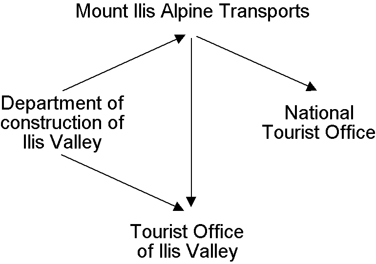

But how are these data transferred from processor to user? E-mail, FTP, DXF, ASCII – and discussion started again. The information technologist recommended to put this question aside for the time being and to consider the modeling of these data instead. Modeling? What on earth had modeling to do with an IT-solution for Ilis Valley? The question what a data model actually is definitely was beyond the scope of their first meeting. Only that much be said: A data model describes the structure of data. What are the properties of the individual objects? Are there any relationships between objects? And this not as a literary work but in a clear, precise figurative or formal language!

[#_2_2]
=== First steps

[#_2_2_1]
==== The National Tourist Office has paved the way

The National Tourist Office has a software package NatTourSys that provides a survey of the available tickets of the different alpine transports. Tickets are issued by the individual railway companies. The tourist however is mainly concerned with their validity on different routes before starting their own project; the Ilis Valley crew wants to gain a general view.

One thing seems clear: In connection with this software package, alpine transports, railway companies as well as tickets have to be taken into consideration.

What is really meant by the term ‚ticket'? Is it the actual ticket that is sold? Surely not, it is the different types of tickets that ought to be described. Hence we had better speak of ticket types. It is obvious that the individual items have further properties: e.g. with the ticket types we can speak of price and validity.

* *Alpine transport* – An alpine transport conveys passengers between its bottom station and top station. One example of a means of alpine transport is the funicular Ilis Ville - Mount Ilis. But there are also cog rails, aerial cable cars and gondolas, as well as ski and chair lifts. Even the new snow bus could be considered as an alpine transport. Each means of alpine transport has its own name.
* *Ticket type* – A ticket type is a certain sort of ticket. Examples of ticket types are the sport pass at 195 sovereigns, with a validity of seven days on all means of transport in the entire area of Ilis Valley, or the «Dino-Pass» at 10 sovereigns valid on the day of issue and for the pony lift only.
* *Railway company* – A railway company operates means of alpine transport. It has a name and sometimes also an abbreviation, such as the Mount Ilis Alpine Transports short MIT. Each company receives a certain percentage of the sale of those tickets that are valid on its lines. One railway company may be subsidiary or parent company of another.

[NOTE]
The *object catalog* of an application lists all items that are of interest and describes them as accurately as possible in words.

If all characteristics of all items are to be described in words it will soon be very difficult to not to lose control. «A picture may mean more than a thousand words» will cross ones mind. An object diagram – that would be it! But all things considered it is not the individual object we wish to describe. Above all we want to show the similarity of items and their characteristics.

Such a diagram will depict quite well the essential:

.A first attempt of a data model.
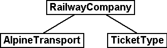

[NOTE]
====
AlpineTransport, TicketType and RailwayCompany are *object classes* (small boxes). *Relationships* exist between them (connecting lines). Together all definitions for the classes and their relationships form a *data* *model*. Its graphic representation ensues with *class diagrams*.

_Terms related to object classes are: entity, table, type, ..._

_Terms related to relationships are: Association, reference, aggregation, (mutual) pointer, ..._

_Terms related to data model are: (conceptual) schema, data description, ..._
====

Object classes are designated with nouns. We use the singular form to express that each individual object (e.g. each means of alpine transport) possesses the characteristics described with the class.

[NOTE]
====
Each individual alpine transport, each railway company, each ticket type is described by a concrete *object*. These objects are the *data* whose structure and connections are described by the model.

_Terms related to object are: example, instance, property, data set, line, tuple, entry, ..._
====

Each means of alpine transport is run by a company. This company issues certain types of tickets. Without further specific information they must be valid on all railway companies. This however cannot always be satisfactory, because it is quite conceivable that bigger companies will issue types of tickets that are only valid on some of their lines. Thus it suggests itself that also a relationship between means of transport and ticket type be introduced. Hence we list for each ticket type the means of alpine transport it is valid for.

.The data model has been expanded by the relationship means of alpine transport – TicketType.
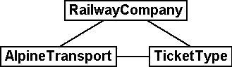

However often several ticket types (e.g. day ticket, weekly season ticket, etc.) will be valid in the same area. With the model defined so far all assignations for each ticket type would have to be established individually. This is rather awkward and prone to errors. Most likely this is why the National Tourist Office has chosen a subtler model:

.Revised data model. The bend in the connecting line between RailwayCompany and TicketType has no signification.
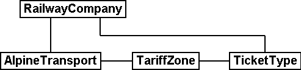

[WARNING]
It will be worthwhile to consider first what object classes are necessary for your problem and what their mutual relationships may be. At this stage the characteristics of these objects are still relatively irrelevant. It is of more importance to find the accurate terms.

[#_2_2_2]
==== How many lines are run by one company?

Several means of alpine transport may be attributed to one company and vice versa one company may be assigned several lines. Several? How many exactly?

[NOTE]
*Cardinality* records how many objects of one type can be assigned to the object of another type.

In the graphic both the minimum and maximum number of admissible other objects at the end of the connecting line is noted with the class of the other objects. If its number is unlimited we either add a (++*++) or omit an indication.

.One AlpineTransport is rune by exactly one (1) company. On the other hand a company may run any number of (++*++) alpine transports.

[#_2_2_3]
==== Means of alpine transport, companies and subscription tickets have characteristics

Of course it is necessary for the application as it is planned to describe more in detail a means of alpine transport, company etc. A company will have a name and (typical with railway companies) an abbreviation (e.g. MountIlisAlpineTransport, MIT).

.The object class Company with name and abbreviation.
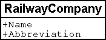

[NOTE]
====
Name and abbreviation designate *attributes* of the object class company.

_Terms related with attribute are: column, field, property, ..._
====

With these two attributes it is quite obvious what type they are: texts. With the price of a ticket type further indications will be of importance: franc, Euro, dollar, Ahland sovereign? Terming the period of validity will be even more demanding if it cannot simply be described with a number of days. If we indicate the length of a railway company it is naturally enough also of importance whether it is described in meters or kilometers. For the programs employed it is important to know how long the projected text attributes may be or within what range the projected numbers may lie.

[NOTE]
The *type* of attribute describes what values an attribute may take on and what is their significance.

A term related with type is value domain.

.The object class «RailwayCompany» possesses both a name and an abbreviation.
[%autowidth]
|===
2+|Object class RailwayCompany

|Name:
|Text +
 _Length: Maximum 100 symbols_
|Abbreviation:
|Text +
 _Length: Maximum 10 symbols_
|===

The type of the property «Name» is a text with a maximum of one hundred symbols. For the property «Abbreviation» however only a maximum of ten symbols is admissible.

Nevertheless also other attribute types are easily conceivable:

.The object class TicketType with its properties and their types.
[%autowidth]
|===
2+|Object class TicketType

|Name:
|Text +
 _Length: Maximum 100 symbols_
|Price:
|Number +
 _Precision: Two decimals_ +
 _Admissible range: Between 0 and 5000_ +
 _Unity: Ahland Sovereigns_
|===

Unlike a ticket type or a railway company the bottom station of any line is an object that really exists at a certain place. It makes sense to describe localities by means of coordinates within a certain coordinate system such as e.g. the national system.

.The object class AlpineTransport with its properties and their types.
[%autowidth]
|===
2+|Object class AlpineTransport

|Name:
|Text +
 _Length: Maximum 100 symbols_
|Position of bottom station:
|Point +
 _Coordinate system: Ahland Projection Coordinates_
|Position of top station:
|Point +
 _Coordinate system: Ahland Projection Coordinates_
|===

Thus for each property we determine a suitable attribute type. In the case of a ski run its degree of difficulty is an enumeration, whereas the course of the run is a directed line in Ahland national coordinates. Details concerning the various types will be dealt with in <<_6>>.

.The object class Ski Run with its properties and their types.
[%autowidth]
|===
2+|Object class SkiRun

|Course:
|Directed line +
 _Coordinate system: Ahland projection coordinates_
|Degree of difficulty:
|Enumeration +
 _Possible values: blue, red, black_
|===

[#_2_2_4]
==== Models? It is data Ilis Valley is asking for!

After all these rather theoretical matters the people in charge in Ilis Valley insist upon deeds. An inquiry at the National Tourist Office resulted in the information that they would provide a simple program for the recording of data in accordance with their requirements. This would allow the export of data in INTERLIS-Format, which then could be sent to the National Tourist Office. The information technologist however argued that in this way at the most a first test would be possible and that the data should be stored either in the program package of the Mount Ilis Alpine Transports or in that of the department of construction. Nevertheless it was agreed to execute this test. After all it should not incur all that much work since neither are the Mount Ilis Alpine Transports that big nor is the number of ticket types that extensive.

[WARNING]
Rushed actions only make sense if they really do not involve a lot of work.

The following means of alpine transports form the Mount Ilis Alpine Transports:

* Funicular Ilis Ville – Mount Ilis;
* Gondola Ilis Bath – Ilis Rock;
* Ski lift Ilis Rock – Mount Ilis;
* Chair lift Ilis Dale – Ilis Rock;
* Pony lifts in Ilis Ville and Ilis Bath.

.The Mount Ilis Alpine Transports operate several lines.
image::img/image10.png[./media/image10,width=448,height=186]

The Mount Ilis Alpine Transports issue the following ticket types:

* Individual tickets for the funicular (one way: 10 sovereigns; return-fare: 18 sovereigns);
* Individual tickets for the gondola (one way: 8 sovereigns; return-fare: 14 sovereigns);
* Hiker's Pass for the funicular and the gondola (price for one day 15 sovereigns; for seven days 55 sovereigns);
* The Sport Pass for all lines (price for one day: 40 sovereigns, for two days: 70 sovereigns, for seven days: 195 sovereigns; for the entire year: 635 sovereigns);
* The «Dino-Day Ticket» (10 sovereigns) and the «Weekly Ticket Ilosaurus Maximus» (45 sovereigns) for the pony lifts.

[#_2_2_5]
==== Ilis Valley transmits

Using the program for their test a file was generated containing all data.

[NOTE]
The simplest type of transfer is the *full transfer* completely transferring all data.

A quick look at the file revealed a lot that hardly seemed comprehensible but at least the texts «Mount Ilis Alpine Transports» could be read, followed by «MIT» and fares could also be easily found.

Just another test: The price for the area season ticket is lowered from 635 to 600 sovereigns and by means of the function update a new file is generated. The beginning may still look the same but the texts «Mount Ilis Alpine Transports» and «MIT» both are missing. However almost at the very end – this might be the new price!

[NOTE]
Thanks to *incremental update* it is not necessary to transfer all data after a modification but only the objects actually modified.

As agreed, both files were sent to the Tourist Office of llis Valley. And apparently could be read without any problems. Objection of the information technologist: This is not really astonishing. As long as we record the data exactly as required and furthermore with a program provided by the Tourist Office of Ilis Valley this was to be hoped for. But we people from Ilis Valley want more than that! Whenever possible we want to use our present program packages.

[#_2_3]
=== Ilis Valley wants more

[#_2_3_1]
==== Target

Thus Ilis Valley does not want to offer the same service as the National Tourist Office. Uppermost are the following additional performances:

* Indication of current operating and waiting times at the different railway companies and whether they can be used by hikers and with toboggans;
* Indication of all runs including degree of difficulty and condition;
* Graphic representation (including indication of forests and roads);
* Indication of all inns in the area;
* Indication where, depending on their postal address, buildings can be found.

[#_2_3_2]
==== Ilis Valley puts to use what is already existing

The data necessary for graphic representation of forests and roads should not have to be captured all over again, since the  department of construction is in possession of all data of cadastral surveying, which also includes forests and roads. Moreover the department of construction has started to record addresses of buildings in accordance with the new norm. Hence it would make little sense to repeat all these definitions in the data model of Ilis Valley. It would be more convenient to simply use the existing models of cadastral surveying and of the addresses of buildings.

[NOTE]
====
A data model is not an isolated description; on the contrary it may be built upon already existing data models.

_Terms related to data model in the sense of building-up are : Modules, packages, ..._
====

.The tourism data model of Ilis Valley (IlisTour) need not make its own definitions. Instead it builds upon other models: It uses parts of the national tourism-model (NatTour), of the national basis of Ahland, of the cadastral surveying, of the addresses of buildings as well as common fundamentals. The dotted line with filled-in arrow means dependency. As in our example very often the common base is placed at the top, the special case at the bottom. However the opposite is also found.
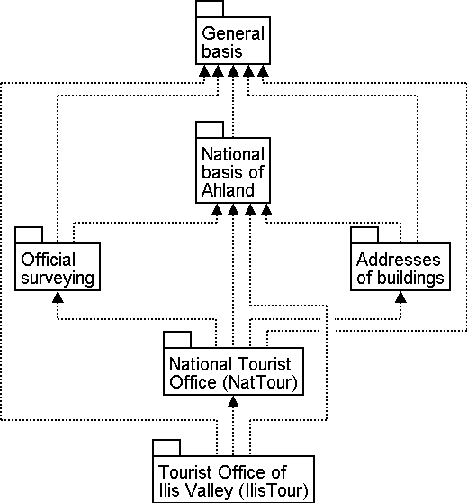

[#_2_3_3]
==== Ilis Valley exceeds the National Tourist Office

Somehow the authorities of Ilis Valley did not want to use the model of the National Tourist Office in the given manner. In order to permit a graphic representation the track course also has to be described for every means of alpine transport. Furthermore they would like to display whether the conveyance can be used by hikers or with toboggans, its operating hours and the current waiting time. It seems obvious to define an individual class for the means of alpine transport of Ilis Valley. Should the attributes of the class AlpineTransport of the National Tourist Office be repeated therein? And there is also the relationship between AlpineTransport and TarifZone. What does a proper class mean for this relationship?

Luckily there is a thing called inheritance for such cases.

.A MITAlpineTransport is a special means of AlpineTransport with additional attributes: TrackCourse as well as usability for HikersToboggans. The traced line with a white arrow means specialization.
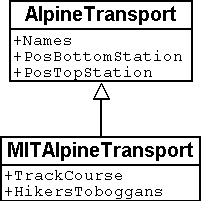

[NOTE]
====
The class of the Ilis Valley MITAlpineTransport is an extension of the class of Al-pineTransport. Thus it inherits all properties of alpine transports and adds others. [Details of inheritance will be described in <<_5>>].

_Terms related to extension are: Specialization, sub class, ..._
====

Now would it be correct to also add the attributes OperatingHours and current WaitingTime to the class MITAlpineTransport? If the OperatingHours were a direct attribute of MITAlpineTransport, then for each line one, typically the current operating hour, could be noted. However the managing director fixes the operating hours at the beginning of the season: In early season some lifts do not run yet, others take a lunch break; around the Christmas-holidays they run non-stop from 9a.m. until 3.30p.m.; starting in mid February – when days begin to lengthen – then operating hours gradually are extended until 4.30 p.m. Then again depending on snow and weather conditions some lines will shut down temporarily.

.OperatingHours are not defined as independent objects.
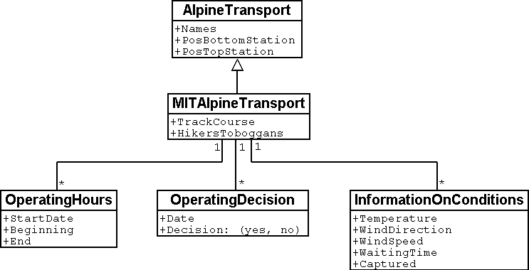

If we define moreover that certain operating hours apply to several railway companies, then the costs of data collection can be reduced even further. Of course this does not make sense with waiting times. A waiting time noticed at a certain moment must be assigned to the line where passengers have to wait accordingly. Then why not recording the waiting time directly on the MITAlpineTransport? The following arguments explain why:

* When recording the waiting times as independent objects they can be evaluated at a later time (e.g. for statistics).
* The rhythm of modification and the responsibility for these values are quite different from the attributes of the MITAlpineTransport-class.

[WARNING]
With properties that at first sight can be assigned to one class it always has to be considered whether this is really correct or whether they had not better be transferred to independent classes assigned via relationships.

With these considerations there are the real facts and not the usage e.g. for representations that is of relevance. However organizational conditions are of importance. Who is responsible for the update of data? How regularly will they be updated?

In the model of the National Tourist Office there are the individual railway companies that are responsible for the update of their data. The Ilis Valley model would like – as far as alpine transports are concerned – to use the model of the National Tourist Office but to extend it for the Mount Ilis Alpine Transports__.__

[NOTE]
Data models are divided into *Topics* to satisfy organizational conditions (e.g. different responsibilities and intervals of update).

That is why the Ilis Valley model extends the topic predefined by the National Tourist Office from Alpine Transports to MITAlpine Transport__.__ In this local extension we define that the class MITAlpineTransport specializes the class AlpineTransport, which thus is extended by additional attributes.

Since operating hours, operating decisions and information on conditions are not only registered by different agencies but also at completely different intervals, they each are defined in individual topics (MITPlanning, MITOperation, MITCurrentEvents).

.The Ilis Valley model (IlisTour) extends the model of the National Tourist Office (NatTour). IlisTour inherits the topic AlpineTransports from NatTour, extends the class AlpineTransport to MITAlpineTransport and adds further topics for planning, operation and current events.
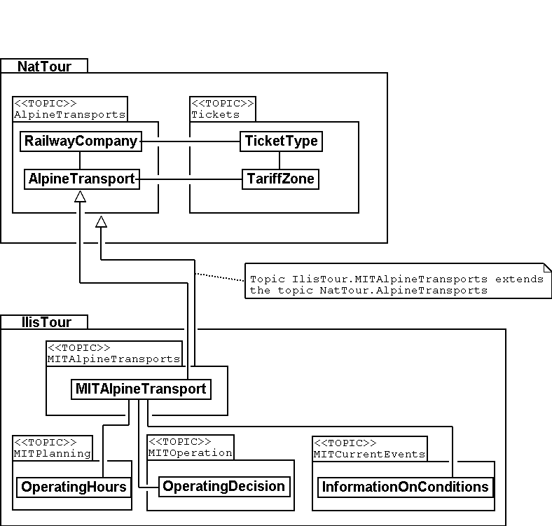

[NOTE]
Inheritance does not only exist on a smaller scale (object classes), but also on a larger scale (entire topics).

[#_2_3_4]
==== Ilis Valley specialties

The authorities of Ilis Valley would also like to describe ski runs and restaurants. Hence they add further topics to the Ilis Valley model.

.Further topics extend the Ilis Valley model of tourism.
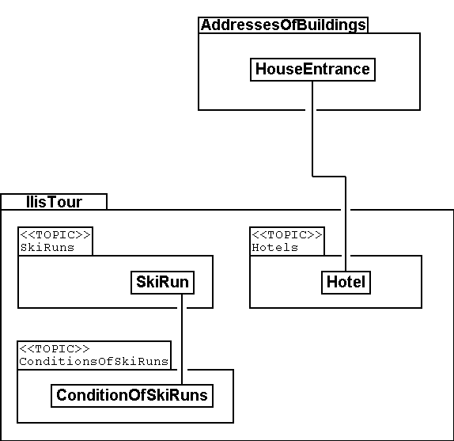

Mainly with regard to the restaurants further questions arise. For example how is the fast-food INTERLUNCH to be represented graphically when it is well known that it is situated on 27, Village Road? But this does not permit the placing of a symbol on the map! The solution lies in the utilization of the building addresses. There the class HouseEntrance can be found that also features a position attribute (in national coordinates). That is why in the class Hotel no address is introduced; instead a relationship with the HouseEntrance is defined. To be concrete, the object that corresponds to the hotel Sun is linked to the house entrance object which describes 27, Village Road.

[#_2_3_5]
==== How can Ilis Valley implement their specialties?

A concept settles requirements but not their implementation. Where implementation is concerned we are basically free. The Mount Ilis Alpine Transports have decided on a standardized program package (LiftSys), this however can only process data in accordance with the extended model. Then again it is quite admissible to do without the class AlpineTransport and to insert its attributes directly in the class MITAlpineTransport.

.The program package for Ilis Valley tourism only has to roughly observe the conceptual model. For example it can combine two object classes into one, as long as the package is capable of supplying data in the format that corresponds to the conceptual model.
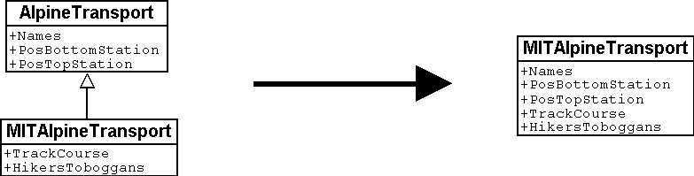

Analogous to the processing of classes according to the concept other questions arise as to how a certain computer system realizes ideas connected with the conceptual model.

[#_2_3_6]
==== How will Ilis Valley send their data to the National Tourist Office?

Once the LiftSys program package has been installed and all data has been captured, the question again arises as to how these data can be transmitted to the National Tourist Office. Because naturally enough it is not interested in all but only in certain data. The National Tourist Office for instance is neither interested in ski runs nor in their suitability for hikers and toboggans.

[NOTE]
An INTERLIS-data transfer always comprises data of one or several topics.

Hence in Ilis Valley they want to pass on to the National Tourist Office the data of the topics Alpine Transports and Tickets. But how can a program package generate a correct transfer file – when the manufacturing firm has had no knowledge whatsoever of the specifications of the National Tourist Office? The solution lies within the _model based transfer_.

[NOTE]
With a *model based transfer* there is no specific *transfer format*. On the contrary the format is governed by the data model.

Each modeling method (e.g. INTERLIS or the definitions which make up a certain program package) puts certain means of expression (object classes, attributes, types, relationships, tables, columns, etc.) at your disposal. For each of these means of expression its effect on the transfer is defined independently of the concrete data model. We only speak of a concrete transfer format (i.e. the exact order of the symbols which represent the respective data) when the corresponding data model is known. What is more, the transfer format is a direct result of the data model.

If LiftSys were capable of establishing the internal data model directly and in accordance with the conceptual data model, and if furthermore it supported the conversion of data within transfer files according to the specifications of INTERLIS, then there would be no problem at all. The transfer files could be generated in much the same simple way as with the test program of the union.

The program package of the department of construction (ConstSys) for example supports the generating of INTERLIS 2-conforming files. However it only knows some few tables which each consists of maybe several tables. Since the formatting rules of INTERLIS are organized in such a way that inheritance structure is not directly reflected in the transfer file so, it would be possible to directly generate correct files by using ConstSys. The conversion of internal to external data may be imagined in the following way:

.The internal data of program package A will be converted into a transfer file whose structure depends on the data model according to the INTERLIS format rules.
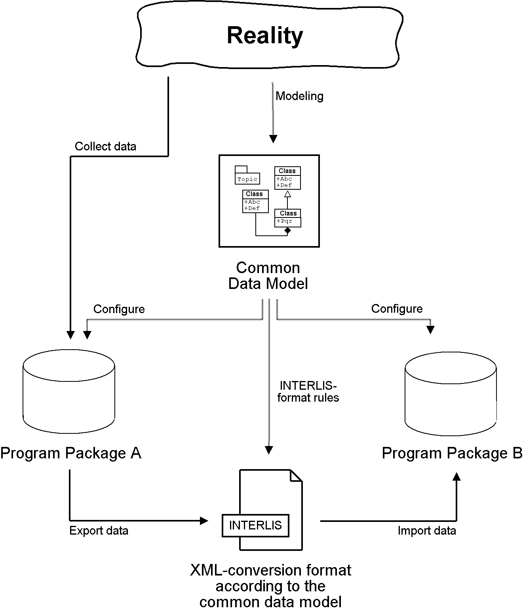

These data then will be imported into program package B, provided the program packages concerned have been configured in accordance with the data model.

However LiftSys does not support INTERLIS. What is to be done? Must MITAlpine Transport contemplate buying a new program package? There is an obvious alternative: LiftSys exports the data in another format, and then they will be with a conversion program according to INTERLIS. This conversion program can either be realized specifically for this concrete data model or more neutrally as a model-based tool.

.A converter generates INTERLIS-files from a format, which is specific for a certain computer system.
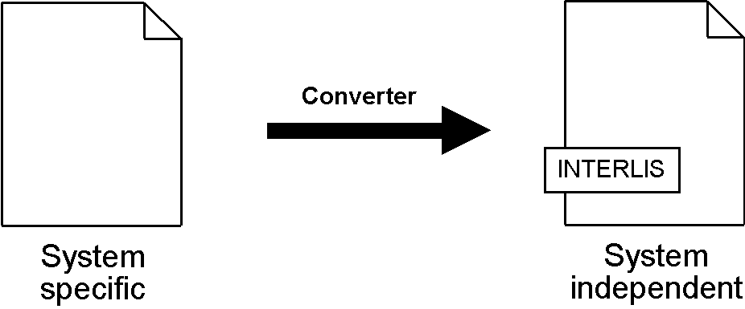

Once all seemed to go smoothly the file was sent to the National Tourist Office. The response: «Almost perfect – however there is a problem with the ski lift up to Ilis Rock!» Uff – somehow this is familiar and occurs repeatedly in e-mails: «Ilistäli» (Ilis Dale in German); these umlauts again.

Two things should be distinguished clearly:

[NOTE]
The *character codes utilized* determine which symbols can be used in text attributes.

[NOTE]
The *character coding* determines the bit pattern that represents the symbol within the computer.

Umlauts are part of the permitted character codes of INTERLIS. But with the conversion it was omitted to correctly indicate the character coding of the data provided by LiftSys. This correction having been made Ilis Valley receives a positive response from the National Tourist Office.

[#_2_3_7]
==== What does the national association of tourism do with the Ilis Valley data?

There is one small matter that slightly surprises the people in Ilis Valley: What might the computer system of the National Tourist Office (NatTourSys) have done with the supplementary attributes – such as the suitability for hikers and toboggans or the track course of the railway? The solution may sound simple: NatTourSys hat simply ignored them.

[NOTE]
Thanks to *polymorph reading* data can be read according to a «reduced» model, i.e. a model that does not yet recognize additional extensions.

Ilis Valley has transmitted all data in such a way that they contain all extensions according to the Ilis Valley model. The transfer rules of INTERLIS make sure that all the same these data can be read according to the model of the National Tourist Office without upsetting the reading program because of the additional data. Sole condition: the model according to which these data have been generated must be an extension of the model used at the receiving end. Thus the Ilis Valley model must extend the model of the National Tourist Office.

<<_5>> further explains the usefulness of such extensions. <<_8>> deals with the details of data transfers.

In the reading side it is possible to either read data directly with the program package of the receiver or to introduce a conversion program. And we also have to keep in mind that the concrete symbols of the text attributes must be converted correctly. The «ä» of Ilistäli may possibly be coded differently in LiftSys, on the transfer file and in NatTourSys. For each of the programs it is always obvious that it is an «ä».

[#_2_4]
=== Ilis Valley has made it

[#_2_4_1]
==== System overview

As far as the internet is concerned a relatively simple solution was opted for: The program package LiftSys generates the site plan as a static picture which then is put at the disposal of a web-presentation system (WebSys). In order to be able to require after the current condition of the railways, specific sections in the picture are accentuated. A mouse click on one of these spots will make the current data of the corresponding railway. Furthermore hotels with free rooms should be marked accordingly.

[#_2_4_2]
==== For the web site only the present condition is of interest

Ilis Valley has made an effort and their model now is clearly structured above all also for operational data of railways and ski runs. Unfortunately the program, which ought to continually update the internet site, is unable to derive the current condition from the multitude of operating hours, operating decisions and information on conditions. On one hand the management would like to receive data according to the topic MITTickets whenever a change has occurred. On the other hand information regarding operating conditions should be transmitted in 20-minute-intervals.

[NOTE]
====
A *view* defines data that corresponds to the concept of a specific user and thus ought to be derivable from original data.

_Related terms: View, derived data, ..._
====

The view demanded links operating hours, operating decisions and waiting times with the one railway they are assigned to according to relationship and filter them in such a way that only the current conditions are described.

[NOTE]
From the standpoint of the application view objects can be considered in much the same way as data-objects. That is why views can also be described by means of view classes.

.The condition of railways is not an independent object class, but is derived via a view from MITAlpineTransport. The view comprises such data as is necessary for the representation on an internet site.
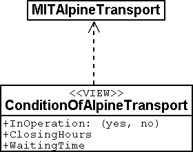

[#_2_4_3]
==== How to represent hotels with available accommodation on the web site

For WebSys to be able to display as well which hotels have available rooms, of course the necessary information is required. Similarly to the conditions of railways, a view for hotels has to be defined. On one hand it contains the necessary data of hotels, on the other hand the horizontal coordinates according to the assigned house entrance.

[NOTE]
Thanks to INTERLIS the necessary *symbols* can also be *defined system-neutrally* and the conversion of original- or view data can be described *graphically*.

Unfortunately WebSys is unable to process such conversion descriptions. However it is capable to read the symbol definitions. Furthermore it can receive data that state which symbol is represented at which spot and then execute this representation. Thus it is possible to put to advantage another facility, which is available on LiftSys.

[NOTE]
By means of INTERLIS it is also possible to transfer already converted graphic data.

That is why LiftSys does not provide WebSys with the view-data of the hotels, but undertakes their conversion into graphic data. Again the exact structure of the graphic data can be defined with classes. Typical attributes of such graphic data are position, symbol name and color.

