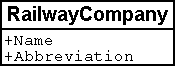

[#_2_2]
=== First steps

[#_2_2_1]
==== The National Tourist Office has paved the way

The National Tourist Office has a software package NatTourSys that provides a survey of the available tickets of the different alpine transports. Tickets are issued by the individual railway companies. The tourist however is mainly concerned with their validity on different routes before starting their own project; the Ilis Valley crew wants to gain a general view.

One thing seems clear: In connection with this software package, alpine transports, railway companies as well as tickets have to be taken into consideration.

What is really meant by the term ‚ticket'? Is it the actual ticket that is sold? Surely not, it is the different types of tickets that ought to be described. Hence we had better speak of ticket types. It is obvious that the individual items have further properties: e.g. with the ticket types we can speak of price and validity.

* *Alpine transport* – An alpine transport conveys passengers between its bottom station and top station. One example of a means of alpine transport is the funicular Ilis Ville - Mount Ilis. But there are also cog rails, aerial cable cars and gondolas, as well as ski and chair lifts. Even the new snow bus could be considered as an alpine transport. Each means of alpine transport has its own name.
* *Ticket type* – A ticket type is a certain sort of ticket. Examples of ticket types are the sport pass at 195 sovereigns, with a validity of seven days on all means of transport in the entire area of Ilis Valley, or the «Dino-Pass» at 10 sovereigns valid on the day of issue and for the pony lift only.
* *Railway company* – A railway company operates means of alpine transport. It has a name and sometimes also an abbreviation, such as the Mount Ilis Alpine Transports short MIT. Each company receives a certain percentage of the sale of those tickets that are valid on its lines. One railway company may be subsidiary or parent company of another.

[NOTE]
The *object catalog* of an application lists all items that are of interest and describes them as accurately as possible in words.

If all characteristics of all items are to be described in words it will soon be very difficult to not to lose control. «A picture may mean more than a thousand words» will cross ones mind. An object diagram – that would be it! But all things considered it is not the individual object we wish to describe. Above all we want to show the similarity of items and their characteristics.

Such a diagram will depict quite well the essential:

.A first attempt of a data model.
image::img/image3.png[]

[NOTE]
====
AlpineTransport, TicketType and RailwayCompany are *object classes* (small boxes). *Relationships* exist between them (connecting lines). Together all definitions for the classes and their relationships form a *data* *model*. Its graphic representation ensues with *class diagrams*.

_Terms related to object classes are: entity, table, type, ..._

_Terms related to relationships are: Association, reference, aggregation, (mutual) pointer, ..._

_Terms related to data model are: (conceptual) schema, data description, ..._
====

Object classes are designated with nouns. We use the singular form to express that each individual object (e.g. each means of alpine transport) possesses the characteristics described with the class.

[NOTE]
====
Each individual alpine transport, each railway company, each ticket type is described by a concrete *object*. These objects are the *data* whose structure and connections are described by the model.

_Terms related to object are: example, instance, property, data set, line, tuple, entry, ..._
====

Each means of alpine transport is run by a company. This company issues certain types of tickets. Without further specific information they must be valid on all railway companies. This however cannot always be satisfactory, because it is quite conceivable that bigger companies will issue types of tickets that are only valid on some of their lines. Thus it suggests itself that also a relationship between means of transport and ticket type be introduced. Hence we list for each ticket type the means of alpine transport it is valid for.

.The data model has been expanded by the relationship means of alpine transport – TicketType.
image::img/image4.png[]

However often several ticket types (e.g. day ticket, weekly season ticket, etc.) will be valid in the same area. With the model defined so far all assignations for each ticket type would have to be established individually. This is rather awkward and prone to errors. Most likely this is why the National Tourist Office has chosen a subtler model:

.Revised data model. The bend in the connecting line between RailwayCompany and TicketType has no signification.
image::img/image5.png[]

[WARNING]
It will be worthwhile to consider first what object classes are necessary for your problem and what their mutual relationships may be. At this stage the characteristics of these objects are still relatively irrelevant. It is of more importance to find the accurate terms.

[#_2_2_2]
==== How many lines are run by one company?

Several means of alpine transport may be attributed to one company and vice versa one company may be assigned several lines. Several? How many exactly?

[NOTE]
*Cardinality* records how many objects of one type can be assigned to the object of another type.

In the graphic both the minimum and maximum number of admissible other objects at the end of the connecting line is noted with the class of the other objects. If its number is unlimited we either add a (++*++) or omit an indication.

.One AlpineTransport is rune by exactly one (1) company. On the other hand a company may run any number of (++*++) alpine transports.
image::img/image7.png[]

[#_2_2_3]
==== Means of alpine transport, companies and subscription tickets have characteristics

Of course it is necessary for the application as it is planned to describe more in detail a means of alpine transport, company etc. A company will have a name and (typical with railway companies) an abbreviation (e.g. MountIlisAlpineTransport, MIT).

.The object class Company with name and abbreviation.

[NOTE]
====
Name and abbreviation designate *attributes* of the object class company.

_Terms related with attribute are: column, field, property, ..._
====

With these two attributes it is quite obvious what type they are: texts. With the price of a ticket type further indications will be of importance: franc, Euro, dollar, Ahland sovereign? Terming the period of validity will be even more demanding if it cannot simply be described with a number of days. If we indicate the length of a railway company it is naturally enough also of importance whether it is described in meters or kilometers. For the programs employed it is important to know how long the projected text attributes may be or within what range the projected numbers may lie.

[NOTE]
====
The *type* of attribute describes what values an attribute may take on and what is their significance.

_A term related with type is value domain._
====

.The object class «RailwayCompany» possesses both a name and an abbreviation.
[%autowidth]
|===
2+|Object class RailwayCompany

|Name:
|Text +
 _Length: Maximum 100 symbols_
|Abbreviation:
|Text +
 _Length: Maximum 10 symbols_
|===

The type of the property «Name» is a text with a maximum of one hundred symbols. For the property «Abbreviation» however only a maximum of ten symbols is admissible.

Nevertheless also other attribute types are easily conceivable:

.The object class TicketType with its properties and their types.
[%autowidth]
|===
2+|Object class TicketType

|Name:
|Text +
 _Length: Maximum 100 symbols_
|Price:
|Number +
 _Precision: Two decimals_ +
 _Admissible range: Between 0 and 5000_ +
 _Unity: Ahland Sovereigns_
|===

Unlike a ticket type or a railway company the bottom station of any line is an object that really exists at a certain place. It makes sense to describe localities by means of coordinates within a certain coordinate system such as e.g. the national system.

.The object class AlpineTransport with its properties and their types.
[%autowidth]
|===
2+|Object class AlpineTransport

|Name:
|Text +
 _Length: Maximum 100 symbols_
|Position of bottom station:
|Point +
 _Coordinate system: Ahland Projection Coordinates_
|Position of top station:
|Point +
 _Coordinate system: Ahland Projection Coordinates_
|===

Thus for each property we determine a suitable attribute type. In the case of a ski run its degree of difficulty is an enumeration, whereas the course of the run is a directed line in Ahland national coordinates. Details concerning the various types will be dealt with in <<_6>>.

.The object class Ski Run with its properties and their types.
[%autowidth]
|===
2+|Object class SkiRun

|Course:
|Directed line +
 _Coordinate system: Ahland projection coordinates_
|Degree of difficulty:
|Enumeration +
 _Possible values: blue, red, black_
|===

[#_2_2_4]
==== Models? It is data Ilis Valley is asking for!

After all these rather theoretical matters the people in charge in Ilis Valley insist upon deeds. An inquiry at the National Tourist Office resulted in the information that they would provide a simple program for the recording of data in accordance with their requirements. This would allow the export of data in INTERLIS-Format, which then could be sent to the National Tourist Office. The information technologist however argued that in this way at the most a first test would be possible and that the data should be stored either in the program package of the Mount Ilis Alpine Transports or in that of the department of construction. Nevertheless it was agreed to execute this test. After all it should not incur all that much work since neither are the Mount Ilis Alpine Transports that big nor is the number of ticket types that extensive.

[WARNING]
Rushed actions only make sense if they really do not involve a lot of work.

The following means of alpine transports form the Mount Ilis Alpine Transports:

* Funicular Ilis Ville – Mount Ilis;
* Gondola Ilis Bath – Ilis Rock;
* Ski lift Ilis Rock – Mount Ilis;
* Chair lift Ilis Dale – Ilis Rock;
* Pony lifts in Ilis Ville and Ilis Bath.

.The Mount Ilis Alpine Transports operate several lines.
image::img/image10.png[]

The Mount Ilis Alpine Transports issue the following ticket types:

* Individual tickets for the funicular (one way: 10 sovereigns; return-fare: 18 sovereigns);
* Individual tickets for the gondola (one way: 8 sovereigns; return-fare: 14 sovereigns);
* Hiker's Pass for the funicular and the gondola (price for one day 15 sovereigns; for seven days 55 sovereigns);
* The Sport Pass for all lines (price for one day: 40 sovereigns, for two days: 70 sovereigns, for seven days: 195 sovereigns; for the entire year: 635 sovereigns);
* The «Dino-Day Ticket» (10 sovereigns) and the «Weekly Ticket Ilosaurus Maximus» (45 sovereigns) for the pony lifts.

[#_2_2_5]
==== Ilis Valley transmits

Using the program for their test a file was generated containing all data.

[NOTE]
The simplest type of transfer is the *full transfer* completely transferring all data.

A quick look at the file revealed a lot that hardly seemed comprehensible but at least the texts «Mount Ilis Alpine Transports» could be read, followed by «MIT» and fares could also be easily found.

Just another test: The price for the area season ticket is lowered from 635 to 600 sovereigns and by means of the function update a new file is generated. The beginning may still look the same but the texts «Mount Ilis Alpine Transports» and «MIT» both are missing. However almost at the very end – this might be the new price!

[NOTE]
Thanks to *incremental update* it is not necessary to transfer all data after a modification but only the objects actually modified.

As agreed, both files were sent to the Tourist Office of llis Valley. And apparently could be read without any problems. Objection of the information technologist: This is not really astonishing. As long as we record the data exactly as required and furthermore with a program provided by the Tourist Office of Ilis Valley this was to be hoped for. But we people from Ilis Valley want more than that! Whenever possible we want to use our present program packages.

[#_2_3]
