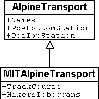
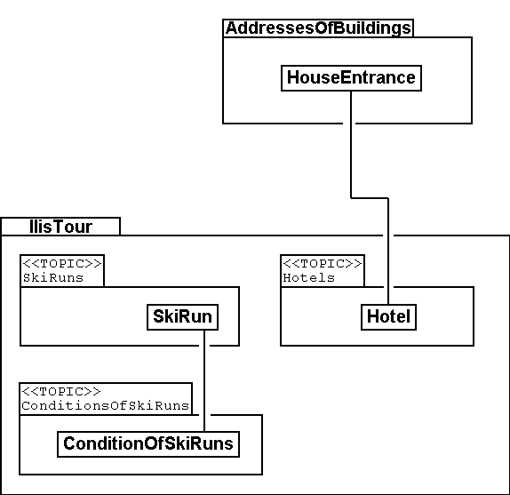
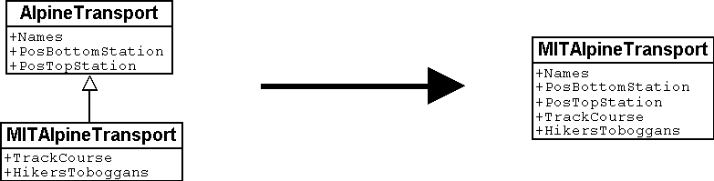

[#_2_3]
=== Ilis Valley wants more

[#_2_3_1]
==== Target

Thus Ilis Valley does not want to offer the same service as the National Tourist Office. Uppermost are the following additional performances:

* Indication of current operating and waiting times at the different railway companies and whether they can be used by hikers and with toboggans;
* Indication of all runs including degree of difficulty and condition;
* Graphic representation (including indication of forests and roads);
* Indication of all inns in the area;
* Indication where, depending on their postal address, buildings can be found.

[#_2_3_2]
==== Ilis Valley puts to use what is already existing

The data necessary for graphic representation of forests and roads should not have to be captured all over again, since the  department of construction is in possession of all data of cadastral surveying, which also includes forests and roads. Moreover the department of construction has started to record addresses of buildings in accordance with the new norm. Hence it would make little sense to repeat all these definitions in the data model of Ilis Valley. It would be more convenient to simply use the existing models of cadastral surveying and of the addresses of buildings.

[NOTE]
====
A data model is not an isolated description; on the contrary it may be built upon already existing data models.

_Terms related to data model in the sense of building-up are : Modules, packages, ..._
====

.The tourism data model of Ilis Valley (IlisTour) need not make its own definitions. Instead it builds upon other models: It uses parts of the national tourism-model (NatTour), of the national basis of Ahland, of the cadastral surveying, of the addresses of buildings as well as common fundamentals. The dotted line with filled-in arrow means dependency. As in our example very often the common base is placed at the top, the special case at the bottom. However the opposite is also found.
image::img/image11.png[]

[#_2_3_3]
==== Ilis Valley exceeds the National Tourist Office

Somehow the authorities of Ilis Valley did not want to use the model of the National Tourist Office in the given manner. In order to permit a graphic representation the track course also has to be described for every means of alpine transport. Furthermore they would like to display whether the conveyance can be used by hikers or with toboggans, its operating hours and the current waiting time. It seems obvious to define an individual class for the means of alpine transport of Ilis Valley. Should the attributes of the class AlpineTransport of the National Tourist Office be repeated therein? And there is also the relationship between AlpineTransport and TarifZone. What does a proper class mean for this relationship?

Luckily there is a thing called inheritance for such cases.

.A MITAlpineTransport is a special means of AlpineTransport with additional attributes: TrackCourse as well as usability for HikersToboggans. The traced line with a white arrow means specialization.

[NOTE]
====
The class of the Ilis Valley MITAlpineTransport is an extension of the class of Al-pineTransport. Thus it inherits all properties of alpine transports and adds others. [Details of inheritance will be described in <<_5>>].

_Terms related to extension are: Specialization, sub class, ..._
====

Now would it be correct to also add the attributes OperatingHours and current WaitingTime to the class MITAlpineTransport? If the OperatingHours were a direct attribute of MITAlpineTransport, then for each line one, typically the current operating hour, could be noted. However the managing director fixes the operating hours at the beginning of the season: In early season some lifts do not run yet, others take a lunch break; around the Christmas-holidays they run non-stop from 9a.m. until 3.30p.m.; starting in mid February – when days begin to lengthen – then operating hours gradually are extended until 4.30 p.m. Then again depending on snow and weather conditions some lines will shut down temporarily.

.OperatingHours are not defined as independent objects.
image::img/image13.png[]

If we define moreover that certain operating hours apply to several railway companies, then the costs of data collection can be reduced even further. Of course this does not make sense with waiting times. A waiting time noticed at a certain moment must be assigned to the line where passengers have to wait accordingly. Then why not recording the waiting time directly on the MITAlpineTransport? The following arguments explain why:

* When recording the waiting times as independent objects they can be evaluated at a later time (e.g. for statistics).
* The rhythm of modification and the responsibility for these values are quite different from the attributes of the MITAlpineTransport-class.

[WARNING]
With properties that at first sight can be assigned to one class it always has to be considered whether this is really correct or whether they had not better be transferred to independent classes assigned via relationships.

With these considerations there are the real facts and not the usage e.g. for representations that is of relevance. However organizational conditions are of importance. Who is responsible for the update of data? How regularly will they be updated?

In the model of the National Tourist Office there are the individual railway companies that are responsible for the update of their data. The Ilis Valley model would like – as far as alpine transports are concerned – to use the model of the National Tourist Office but to extend it for the Mount Ilis Alpine Transports__.__

[NOTE]
Data models are divided into *Topics* to satisfy organizational conditions (e.g. different responsibilities and intervals of update).

That is why the Ilis Valley model extends the topic predefined by the National Tourist Office from Alpine Transports to MITAlpine Transport__.__ In this local extension we define that the class MITAlpineTransport specializes the class AlpineTransport, which thus is extended by additional attributes.

Since operating hours, operating decisions and information on conditions are not only registered by different agencies but also at completely different intervals, they each are defined in individual topics (MITPlanning, MITOperation, MITCurrentEvents).

.The Ilis Valley model (IlisTour) extends the model of the National Tourist Office (NatTour). IlisTour inherits the topic AlpineTransports from NatTour, extends the class AlpineTransport to MITAlpineTransport and adds further topics for planning, operation and current events.
image::img/image14.png[]

[NOTE]
Inheritance does not only exist on a smaller scale (object classes), but also on a larger scale (entire topics).

[#_2_3_4]
==== Ilis Valley specialties

The authorities of Ilis Valley would also like to describe ski runs and restaurants. Hence they add further topics to the Ilis Valley model.

.Further topics extend the Ilis Valley model of tourism.

Mainly with regard to the restaurants further questions arise. For example how is the fast-food INTERLUNCH to be represented graphically when it is well known that it is situated on 27, Village Road? But this does not permit the placing of a symbol on the map! The solution lies in the utilization of the building addresses. There the class HouseEntrance can be found that also features a position attribute (in national coordinates). That is why in the class Hotel no address is introduced; instead a relationship with the HouseEntrance is defined. To be concrete, the object that corresponds to the hotel Sun is linked to the house entrance object which describes 27, Village Road.

[#_2_3_5]
==== How can Ilis Valley implement their specialties?

A concept settles requirements but not their implementation. Where implementation is concerned we are basically free. The Mount Ilis Alpine Transports have decided on a standardized program package (LiftSys), this however can only process data in accordance with the extended model. Then again it is quite admissible to do without the class AlpineTransport and to insert its attributes directly in the class MITAlpineTransport.

.The program package for Ilis Valley tourism only has to roughly observe the conceptual model. For example it can combine two object classes into one, as long as the package is capable of supplying data in the format that corresponds to the conceptual model.

Analogous to the processing of classes according to the concept other questions arise as to how a certain computer system realizes ideas connected with the conceptual model.

[#_2_3_6]
==== How will Ilis Valley send their data to the National Tourist Office?

Once the LiftSys program package has been installed and all data has been captured, the question again arises as to how these data can be transmitted to the National Tourist Office. Because naturally enough it is not interested in all but only in certain data. The National Tourist Office for instance is neither interested in ski runs nor in their suitability for hikers and toboggans.

[NOTE]
An INTERLIS-data transfer always comprises data of one or several topics.

Hence in Ilis Valley they want to pass on to the National Tourist Office the data of the topics Alpine Transports and Tickets. But how can a program package generate a correct transfer file – when the manufacturing firm has had no knowledge whatsoever of the specifications of the National Tourist Office? The solution lies within the _model based transfer_.

[NOTE]
With a *model based transfer* there is no specific *transfer format*. On the contrary the format is governed by the data model.

Each modeling method (e.g. INTERLIS or the definitions which make up a certain program package) puts certain means of expression (object classes, attributes, types, relationships, tables, columns, etc.) at your disposal. For each of these means of expression its effect on the transfer is defined independently of the concrete data model. We only speak of a concrete transfer format (i.e. the exact order of the symbols which represent the respective data) when the corresponding data model is known. What is more, the transfer format is a direct result of the data model.

If LiftSys were capable of establishing the internal data model directly and in accordance with the conceptual data model, and if furthermore it supported the conversion of data within transfer files according to the specifications of INTERLIS, then there would be no problem at all. The transfer files could be generated in much the same simple way as with the test program of the union.

The program package of the department of construction (ConstSys) for example supports the generating of INTERLIS 2-conforming files. However it only knows some few tables which each consists of maybe several tables. Since the formatting rules of INTERLIS are organized in such a way that inheritance structure is not directly reflected in the transfer file so, it would be possible to directly generate correct files by using ConstSys. The conversion of internal to external data may be imagined in the following way:

.The internal data of program package A will be converted into a transfer file whose structure depends on the data model according to the INTERLIS format rules.
image::img/image17.png[]

These data then will be imported into program package B, provided the program packages concerned have been configured in accordance with the data model.

However LiftSys does not support INTERLIS. What is to be done? Must MITAlpine Transport contemplate buying a new program package? There is an obvious alternative: LiftSys exports the data in another format, and then they will be with a conversion program according to INTERLIS. This conversion program can either be realized specifically for this concrete data model or more neutrally as a model-based tool.

.A converter generates INTERLIS-files from a format, which is specific for a certain computer system.
image::img/image18.png[]

Once all seemed to go smoothly the file was sent to the National Tourist Office. The response: «Almost perfect – however there is a problem with the ski lift up to Ilis Rock!» Uff – somehow this is familiar and occurs repeatedly in e-mails: «Ilistäli» (Ilis Dale in German); these umlauts again.

Two things should be distinguished clearly:

[NOTE]
The *character codes utilized* determine which symbols can be used in text attributes.

[NOTE]
The *character coding* determines the bit pattern that represents the symbol within the computer.

Umlauts are part of the permitted character codes of INTERLIS. But with the conversion it was omitted to correctly indicate the character coding of the data provided by LiftSys. This correction having been made Ilis Valley receives a positive response from the National Tourist Office.

[#_2_3_7]
==== What does the national association of tourism do with the Ilis Valley data?

There is one small matter that slightly surprises the people in Ilis Valley: What might the computer system of the National Tourist Office (NatTourSys) have done with the supplementary attributes – such as the suitability for hikers and toboggans or the track course of the railway? The solution may sound simple: NatTourSys hat simply ignored them.

[NOTE]
Thanks to *polymorph reading* data can be read according to a «reduced» model, i.e. a model that does not yet recognize additional extensions.

Ilis Valley has transmitted all data in such a way that they contain all extensions according to the Ilis Valley model. The transfer rules of INTERLIS make sure that all the same these data can be read according to the model of the National Tourist Office without upsetting the reading program because of the additional data. Sole condition: the model according to which these data have been generated must be an extension of the model used at the receiving end. Thus the Ilis Valley model must extend the model of the National Tourist Office.

<<_5>> further explains the usefulness of such extensions. <<_8>> deals with the details of data transfers.

In the reading side it is possible to either read data directly with the program package of the receiver or to introduce a conversion program. And we also have to keep in mind that the concrete symbols of the text attributes must be converted correctly. The «ä» of Ilistäli may possibly be coded differently in LiftSys, on the transfer file and in NatTourSys. For each of the programs it is always obvious that it is an «ä».

[#_2_4]
