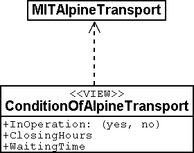

[#_2_4]
=== Ilis Valley has made it

[#_2_4_1]
==== System overview

As far as the internet is concerned a relatively simple solution was opted for: The program package LiftSys generates the site plan as a static picture which then is put at the disposal of a web-presentation system (WebSys). In order to be able to require after the current condition of the railways, specific sections in the picture are accentuated. A mouse click on one of these spots will make the current data of the corresponding railway. Furthermore hotels with free rooms should be marked accordingly.

[#_2_4_2]
==== For the web site only the present condition is of interest

Ilis Valley has made an effort and their model now is clearly structured above all also for operational data of railways and ski runs. Unfortunately the program, which ought to continually update the internet site, is unable to derive the current condition from the multitude of operating hours, operating decisions and information on conditions. On one hand the management would like to receive data according to the topic MITTickets whenever a change has occurred. On the other hand information regarding operating conditions should be transmitted in 20-minute-intervals.

[NOTE]
====
A *view* defines data that corresponds to the concept of a specific user and thus ought to be derivable from original data.

_Related terms: View, derived data, ..._
====

The view demanded links operating hours, operating decisions and waiting times with the one railway they are assigned to according to relationship and filter them in such a way that only the current conditions are described.

[NOTE]
From the standpoint of the application view objects can be considered in much the same way as data-objects. That is why views can also be described by means of view classes.

.The condition of railways is not an independent object class, but is derived via a view from MITAlpineTransport. The view comprises such data as is necessary for the representation on an internet site.

[#_2_4_3]
==== How to represent hotels with available accommodation on the web site

For WebSys to be able to display as well which hotels have available rooms, of course the necessary information is required. Similarly to the conditions of railways, a view for hotels has to be defined. On one hand it contains the necessary data of hotels, on the other hand the horizontal coordinates according to the assigned house entrance.

[NOTE]
Thanks to INTERLIS the necessary *symbols* can also be *defined system-neutrally* and the conversion of original- or view data can be described *graphically*.

Unfortunately WebSys is unable to process such conversion descriptions. However it is capable to read the symbol definitions. Furthermore it can receive data that state which symbol is represented at which spot and then execute this representation. Thus it is possible to put to advantage another facility, which is available on LiftSys.

[NOTE]
By means of INTERLIS it is also possible to transfer already converted graphic data.

That is why LiftSys does not provide WebSys with the view-data of the hotels, but undertakes their conversion into graphic data. Again the exact structure of the graphic data can be defined with classes. Typical attributes of such graphic data are position, symbol name and color.

