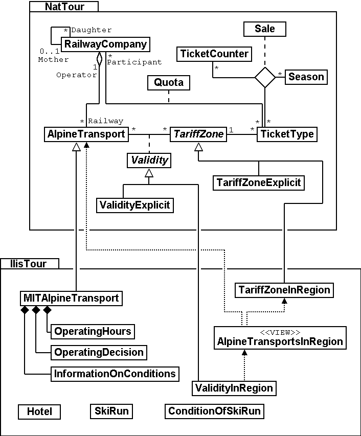
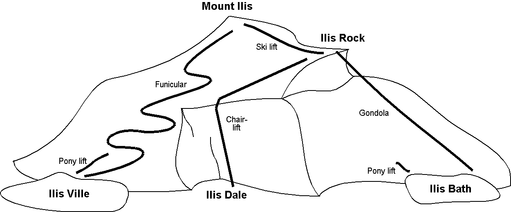

[#_4]
== For example Ilis Valley in particular

[#_4_1]
=== Overview of the data model

.UML-representation of the data model. For the sake of clarity topics, structures, value domains and attributes do not appear. We refer to <<_6>>, which deals more extensively with details.

[#_4_2]
=== The data model in INTERLIS

Subsequently you will find a complete rendering of the national basic model, the model of the National Tourist Office as well as the lllis Valley tourism model. There are extensive comments on each of these models. Furthermore boxes refer to paragraphs within the text that deal with a certain topic.

We recommend to only have a rough look at this example of a data model first, then to read chapters 5-8 where aspects of this data model will be treated in detail.

[#_4_2_1]
==== Ahland.ili – The national basic model

[source]
----
!! The following model is described in version 2.3 of INTERLIS.
INTERLIS 2.3;

!! The national basic model does not comprise any data but only defines
!! some types and units, in order that other models may refer to them.
TYPE MODEL Ahland AT "http://www.interlis.ch/models/ahland"
  VERSION "2008-01" =

  IMPORTS UNQUALIFIED INTERLIS;
  !! The national basic model is built upon the following basic models of INTERLIS.
  !! Units: units such as degrees Celsius
  !! CoordSys: basics for coordinate systems
  IMPORTS Units;
  IMPORTS CoordSys;

  !! Ilis Valley is situated in Ahland where the currency is sovereigns.
  !! The sovereign is a unit (UNIT) for money (MONEY). Even though the
  !! units-model (Units) already defines some currencies - such as the Swiss franc,
  !! the Euro and the US-dollar -, it does not name the Ahland sovereign.
  UNIT
    Sovereign EXTENDS MONEY;

  !! Time in Ahland is recorded in accordance with the local time zone AhlandTime.
  REFSYSTEM BASKET TimeSystems ~ INTERLIS.TIMESYSTEMS
    OBJECTS OF TIMEOFDAYSYS: AhT; !! AhlandTime

  !! The projection coordinate system of Ahland.
  REFSYSTEM BASKET CoordSystems ~ CoordSys.CoordsysTopic
    OBJECTS OF GeoCartesian2D: AhlandSys
    OBJECTS OF GeoHeight: AhlandHeightSys;

  DOMAIN
    NationalCoord = COORD 500.00 .. 91000.00 [m]
                            {CoordSystems.AhlandSys[1]},
                          700.00 .. 23000.00 [m]
                            {CoordSystems.AhlandSys[2]},
                          ROTATION 2 -> 1;
    NationalCoord3 = COORD 500.00 .. 91000.00 [m]
                             {CoordSystems.AhlandSys[1]},
                           700.00 .. 23000.00 [m]
                             {CoordSystems.AhlandSys[2]},
                          -200.00 .. 14000.00 [m]
                             {CoordSystems.AhlandHeightSys[1]},
                           ROTATION 2 -> 1;

  STRUCTURE LengthOfTime (ABSTRACT) =
  END LengthOfTime;

  STRUCTURE LengthOfTimeImplicit EXTENDS LengthOfTime =
    Duration: MANDATORY (Day, Week, Month, Year);
  END LengthOfTimeImplicit;

  STRUCTURE LengthOfTimeExplicit (ABSTRACT) EXTENDS LengthOfTime =
    Duration (ABSTRACT): MANDATORY NUMERIC [TIME];
  END LengthOfTimeExplicit;

  STRUCTURE LengthOfTimeInMinutes EXTENDS LengthOfTimeExplicit =
    Duration (EXTENDED): MANDATORY 0 .. 200 [Units.min];
  END LengthOfTimeInMinutes;

  STRUCTURE LengthOfTimeInDays EXTENDS LengthOfTimeExplicit =
    Duration (EXTENDED): MANDATORY 0 .. 1000 [Units.d];
  END LengthOfTimeInDays;

  STRUCTURE MomentInTime (ABSTRACT) =
  END MomentInTime;

  STRUCTURE AhlandTimeOfDay EXTENDS INTERLIS.TimeOfDay =
    Hours (EXTENDED): 0..23 CIRCULAR [INTERLIS.h];
  END AhlandTimeOfDay;

  DOMAIN
    AhlandXMLTimeOfDay = FORMAT BASED ON AhlandTimeOfDay
      ( Hours/2 ":" Minutes ":" Seconds );

END Ahland.
----

[#_4_2_2]
==== Addresses.ili – The model for building addresses

We have not printed the model for building addresses as it would cover several pages and is not really of interest in connection with Ilis Valley. However the Ilis Valley tourism model establishes a relationship between hotels and the house entrances defined in the address model.

[source]
----
INTERLIS 2.3;

MODEL Addresses AT "http://www.interlis.ch/models/ahland"
  VERSION "2008-01" =

  TOPIC Buildings =

    CLASS HouseEntrance =
      !! ...
    END HouseEntrance;

  END Buildings;

END Addresses.
----

[#_4_2_3]
==== NatTour.ili – The model of the National Tourist Office

[source]
----
INTERLIS 2.3;

CONTRACTED MODEL NatTour AT "http://www.interlis.ch/models/ahland"
  VERSION "2008-01" =

  !! On its part the model of the National Tourist Office
  !! is built upon the national basic model of Ahland.
  IMPORTS Units, CoordSys, Ahland;

  FUNCTION Multiply(factor1 : NUMERIC; factor2 : NUMERIC) : NUMERIC;

  !! A designation comprises a name plus the language
  !! in which this name
  !! has been written.
  STRUCTURE Designation =
    !! The name may be composed of any number of symbols.
    Name: TEXT;
    !! Two letter-language code according to ISO 639.
    !! Examples: de = German, fr = French,
    !! it = Italian, rm = Romantsch, en = English.
    Language: TEXT*2;
  END Designation;

  TOPIC AlpineTransports =

    !! A railway designation is a common designation
    !! (but may not exceed 100 symbols), and comprises
    !! an abbreviation of the name such as "MIT"
    !! standing for MountIlisAlpineTransports.
    STRUCTURE RailwayDesignation EXTENDS Designation =
      Name (EXTENDED): TEXT*100;
      Abbreviation: TEXT*10;
    END RailwayDesignation;

    !! A railway company operates transport systems.
    CLASS RailwayCompany =
      !! The names of this company, if necessary in different
      !! languages. A minimum of one (1) name must be known,
      !! however no upper limit (*) restricts the number of names.
      Names: BAG {1..*} OF RailwayDesignation;
      !! Per language no more than one single railway
      !! designation: Thus the MountIlisAlpineTransports may
      !! only have one single Italian designation.
      !! However this restriction only applies locally, in other words
      !! per railway company. After all the BlueMountainAlpineTransports
      !! should also be permitted to carry an Italian name.
    UNIQUE
      (LOCAL) Names : Language;
    END RailwayCompany;

    CLASS AlpineTransport =
      !! The names of this form of alpine transport, if necessary in different
      !! languages. A minimum of one (1) name must be known,
      !! however no upper limit (*) restricts the number of names.
      Names: BAG {1..*} OF Designation;
      PosBottomStation: Ahland.NationalCoord;
      PosTopStation: Ahland.NationalCoord;
      DurationOfTrip: Ahland.LengthOfTimeInMinutes;
      !! Exact kind of alpine transport.
      Kind: (CogRail,
             Funicular,
             AerialCableCar,
             SkiLift,
             ChairLift,
             Gondola);
    END AlpineTransport;

    ASSOCIATION =
      !! Indicates which means of transport are operated by one specific
      !! company. Example: The "MountIlisAlpineTransports" operate the
      !! funicular "Ilis Ville-Mount Ilis", the gondola
      !! "Ilis Bath-Ilis Rock" and the ski lift "Ilis Rock-Mount Ilis".
      !! A railway company may run an unlimited number {*} of alpine transports
      !! and there is always exactly one {1} operator per means of transport.
      !! The symbol –- stands for an ordinary
      !! relationship, -<> means that the strength of
      !! relationship is above the ordinary, a so-called
      !! aggregation.
      Operator -<> {1} RailwayCompany;
      Railway -- {*} AlpineTransport;
    END;

    ASSOCIATION =
      Daughter -- {*} RailwayCompany;
      Mother -- {0..1} RailwayCompany;
    END;

  END AlpineTransports;

  TOPIC Tickets =
    DEPENDS ON AlpineTransports;
    !! The nationally defined implicit durations of time are
    !! Day, Week, Month and Year. With tickets there is one
    !! more implicit duration, the season
    !! (for season tickets).

    STRUCTURE LengthOfTimeImplicit EXTENDS Ahland.LengthOfTimeImplicit =
      Duration (EXTENDED): (Season);
    END LengthOfTimeImplicit;

    !! An area within which a certain type of ticket is
    !! valid.
    CLASS TariffZone (ABSTRACT) =
    END TariffZone;

    CLASS TariffZoneExplicit EXTENDS TariffZone =
    END TariffZoneExplicit;

    !! One type of tickets, e.g. the "Ilosaurus-weekly ticket".
    CLASS TicketType =
      !! The names of this TicketType, if necessary in different languages.
      !! A minimum of one (1) names must be known, however there is no upper
      !! limit (*) of the number of names.
      Names: BAG {1..*} OF Designation;
      !! The price of a ticket in sovereigns. The currency
      !! is defined in the national basic model of Ahland.
      Price: MANDATORY 0.00 .. 9999.99 [Ahland.Sovereign];
      !! Validity of a ticket. Can be explicit,
      !! e.g. for tickets that are valid for 120 minutes, or
      !! implicit, e.g. for eweekly or season tickets.
      Validity: MANDATORY Ahland.LengthOfTime;
    END TicketType;

    ASSOCIATION =
      TariffZone -- {1} TariffZone;
      TicketType -- {*} TicketType;
    END;

    ASSOCIATION Validity (ABSTRACT) =
      AlpineTransport (EXTERNAL) -- {*} NatTour.AlpineTransports.AlpineTransport;
      TariffZone -- {*} TariffZone;
    END Validity;

    !! A relationship between alpine transport and tariff zone
    !! that has not been derived but entered manually.
    ASSOCIATION ValidityExplicit EXTENDS Validity =
      TariffZone (EXTENDED) -- TariffZoneExplicit;
    END ValidityExplicit;

    ASSOCIATION Quota =
      Participant (EXTERNAL) -- {*} NatTour.AlpineTransports.RailwayCompany;
      TicketType -- {*} TicketType;
    ATTRIBUTE
      Quota: 0.0 .. 100.0 [Units.Percent];
    END Quota;

    CLASS TicketCounter =
      Names: BAG {1..*} OF Designation;
    END TicketCounter;

    CLASS Season =
      Start: FORMAT INTERLIS.XMLDate "1900-1-1" .. "2299-12-31";
      End: FORMAT INTERLIS.XMLDate "1900-1-1" .. "2299-12-31";
    END Season;

    ASSOCIATION Sale =
      TicketCounter -- {*} TicketCounter;
      Season -- {*} Season;
      TicketType -- {*} TicketType;
    ATTRIBUTE
      Number: 1 .. 999999 [Units.CountedObjects];
      Amount: 0.00 .. 9999999.99 [Ahland.Sovereign]
        := Multiply(Number, TicketType -> Price);
    END Sale;

  END Tickets;

END NatTour.
----

[#_4_2_4]
==== IlisTour.ili – The Ilis Valley tourism model

[source]
----
INTERLIS 2.3;

CONTRACTED MODEL IlisTour AT "http://www.interlis.ch/models/beotie"
  VERSION "2008-01" =

!! In order to implement this model, a program package
!! must support the function AhlandToWGS84. This cannot be
!! taken for granted but is subject to a contract with
!! the manufacturer. The necessity of such a contract
!! is stated by CONTRACTED.

  IMPORTS UNQUALIFIED INTERLIS;
  IMPORTS Units, CoordSys, Ahland, Addresses, NatTour;

  !! Tourists with a simple GPS-receiver should benefit
  !! from a special service. Their receivers display coordinates in
  !! the coordinate system WGS84. It uses angles in degrees, minutes
  !! and seconds; the corresponding angle unit is predefined in the
  !! INTERLIS-units model.
  REFSYSTEM BASKET CoordSystems ~ CoordSys.CoordsysTopic
    OBJECTS OF GeoEllipsoidal: WGS84
    OBJECTS OF GeoHeight: WGS84H;

  DOMAIN
    WGS84Coord = COORD -90.00000 ..  90.00000 [Units.Angle_Degree] {WGS84[1]},
                         0.00000 .. 359.99999 CIRCULAR [Units.Angle_Degree]
                                                       {WGS84[2]},
                        -2000.00 ..   9000.00 [m] {WGS84H[1]};

    AhlandLine (ABSTRACT) = POLYLINE VERTEX Ahland.NationalCoord;
    AhlandLineNormal EXTENDS AhlandLine = POLYLINE WITH (STRAIGHTS, ARCS);
    AhlandLineDirected EXTENDS AhlandLineNormal = DIRECTED POLYLINE;
    AhlandSurface = SURFACE WITH (STRAIGHTS, ARCS) VERTEX Ahland.NationalCoord
                    WITHOUT OVERLAPS > 0.02;
    AhlandTessellation EXTENDS AhlandSurface = AREA;

  !! Conversion of Ahland national coordinates to WGS84.
  FUNCTION AhlandToWGS84 (Ah: Ahland.NationalCoord): WGS84Coord;
  FUNCTION InSurface (Position: Ahland.NationalCoord;
                      Region: AhlandSurface): BOOLEAN;

  TOPIC MITAlpineTransports EXTENDS NatTour.AlpineTransports =

    CLASS MITAlpineTransport EXTENDS NatTour.AlpineTransports.AlpineTransport =
      !! In Ilis Valley there are not only the common national
      !! types of alpine transport but also a snow bus.
      Kind (EXTENDED): (SnowBus);
      !! The National Tourist Office is not interested in
      !! altitudes. However in a winter sport resort such as Ilis Valley
      !! they are of major importance. Hence positions in Ilis Valley
      !! are collected as three-dimensional coordinates (incl. altitudes),
      !! i.e. in comparison with the national model they are extended.
      PosBottomStation (EXTENDED): Ahland.NationalCoord3;
      PosTopStation (EXTENDED): Ahland.NationalCoord3;
      PosBottomStationWGS: WGS84Coord := AhlandToWGS84(PosBottomStation);
      PosTopStationWGS: WGS84Coord := AhlandToWGS84(PosTopStation);
      !! Some lines have installed a web-camera that continually displays
      !! the surroundings of the top station, thus tourists may judge whether
      !! a trip is worthwhile. The entry next to the line indicates
      !! via a Uniform Resource Identifier (URI, an address
      !! on the internet), where the most recent picture is
      !! available.
      PictureTopStation: URI;
      TrackCourse: AhlandLineNormal;
      HikersToboggans: (unsuitable, suitable);
    END MITAlpineTransport;

    VIEW CheckTrackStartAndEndPoint
      INSPECTION OF Tracks ~ MITAlpineTransport -> TrackCourse;
    =
    MANDATORY CONSTRAINT
      !! The first point of the tracks must be the bottom,
      !! the last point the top station.
      Tracks -> Segments[FIRST] -> SegmentEndPoint == PARENT -> PosBottomStation
        AND
      Tracks -> Segments[LAST] -> SegmentEndPoint == PARENT -> PosTopStation;
    END CheckTrackStartAndEndPoint;

    !! A tariff zone where the set of all railways participate in a
    !! clearly defined region.
    CLASS TariffZoneInRegion EXTENDS NatTour.Tickets.TariffZone =
      Region: AhlandSurface;
    END TariffZoneInRegion;

    !! A view that comprises the set of all railways whose bottom and top station
    !! are situated within the region of a tariff zone. Obviously
    !! only those tariff zones can be included that have been described as
    !! region (TariffZoneInRegion); an explicit tariff zone would not
    !! make sense here.
    VIEW AlpineTransportsInRegion
    JOIN OF At ~ NatTour.AlpineTransports.AlpineTransport,
            Z ~ TariffZoneInRegion;
    WHERE InSurface(At -> PosBottomStation, Z -> Region) AND
          InSurface(At -> PosTopStation, Z -> Region);
    =
    END AlpineTransportsInRegion;

    !! A relationship between ticket type and tariff zone,
    !! that was not entered manually but derived
    !! automatically based upon the position of
    !! bottom and top station.
    ASSOCIATION ValidityInRegion EXTENDS NatTour.Tickets.Validity
    DERIVED FROM AiR ~ AlpineTransportsInRegion
    =
      AlpineTransport (EXTENDED) -- AlpineTransport := AiR -> At;
      TariffZone (EXTENDED) -- TariffZoneInRegion := AiR -> Z;
    END ValidityInRegion;

  END MITAlpineTransports;

  TOPIC Hotels =
    DEPENDS ON Addresses.Buildings;

    CLASS Hotel =
      !! The names of this hotel, if necessary in different
      !! languages. A minimum of one (1) name must be known, however there
      !! is no upper limit (*) for the number of names.
      Names: BAG {1..*} OF NatTour.Designation;
      !! The internet-address (Uniform Resource Identifier,
      !! URI for short) of a picture of a hotel.
      Picture: URI;
    END Hotel;

    !! Authorities in Ilis Valley do not define themselves what an address is.
    !! Instead they establish a relationship between a hotel and its
    !! house entrance. Hence they can accept the coordinates of the hotels
    !! from the data of cadastral surveying and do not be concerned with their
    !! collection.
    ASSOCIATION =
      Hotel -- Hotel;
      Entrance (EXTERNAL) -- Addresses.Buildings.HouseEntrance;
    END;

  END Hotels;

  TOPIC MITPlanning =
    DEPENDS ON IlisTour.MITAlpineTransports;

    CLASS OperatingHours =
      StartDate: INTERLIS.XMLDate;
      Beginning: Ahland.AhlandXMLTimeOfDay;
      End: Ahland.AhlandXMLTimeOfDay;
    END OperatingHours;

    ASSOCIATION =
      Line (EXTERNAL) -<#> {1} IlisTour.MITAlpineTransports.MITAlpineTransport;
      OperatingHours -- {*} OperatingHours;
    END;

  END MITPlanning;

  TOPIC MITOperation =
    DEPENDS ON IlisTour.MITAlpineTransports;

    CLASS OperatingDecision =
      MomentInTime: INTERLIS.XMLDateTime;
      Decision: (yes, no);
    END OperatingDecision;

    ASSOCIATION =
      Line (EXTERNAL) -<#> {1} IlisTour.MITAlpineTransports.MITAlpineTransport;
      OperatingDecision -- {*} OperatingDecision;
    END;

  END MITOperation;

  TOPIC MITCurrentEvents =
    DEPENDS ON IlisTour.MITAlpineTransports;

    STRUCTURE IndicationOfWind =
      WindDirection: MANDATORY (N, NE, E, SE, S, SW, W, NW) CIRCULAR;
      WindSpeed: MANDATORY 0 .. 200 [Units.kmh];
    END IndicationOfWind;

    CLASS InformationOnConditions =
      !! Temperatures are indicated in degrees Celsius. This
      !! unit is defined by the INTERLIS-units model (Units).
      !! MANDATORY means that the temperature
      !! must be known.
      Temperature: MANDATORY -50 .. 50 [Units.oC];
      !! The attribute refers to the above-mentioned structure
      !! IndicationOfWind.
      Wind: IndicationOfWind;
      WaitingTime: Ahland.LengthOfTimeInMinutes;
      Captured: MANDATORY INTERLIS.XMLDateTime;
    END InformationOnConditions;

    ASSOCIATION =
      Transport (EXTERNAL) -<#> {1}IlisTour.MITAlpineTransports.MITAlpineTransport;
      InformationOnConditions -- {*} InformationOnConditions;
    END;

  END MITCurrentEvents;

  TOPIC SkiRuns =

    CLASS SkiRun =
      Difficulty: (blue, red, black: FINAL) ORDERED;
      Course: AhlandLineDirected;
    END SkiRun;

  END SkiRuns;

  TOPIC ConditionsOfSkiRuns =

    CLASS ConditionOfSkiRuns =
      PreparedSurface: AhlandTessellation;
    END ConditionOfSkiRuns;

  END ConditionsOfSkiRuns;

END IlisTour.
----

[#_4_3]
=== Transfer data

If Ilis Valley wants to send their entire data to the National Tourist Office, they generate a transfer file (with their software package). Usually in this form it will be read by another computer system and not by human beings. Nevertheless below a small part of this transfer file appears in print in order to provide you with an idea of its structure.

Three dots (...) mark omissions; the boxes on the right are merely notes that do not belong to the transfer file.

.All means of alpine transport up to Mount Ilis are part of the data contained in a transfer file (repetition of figure 11). The following file contains some data concerning the pony lift Ilis Ville.

[source,xml]
----
<?xml version="1.0" encoding="utf-8"?>
<TRANSFER xmlns="http://www.interlis.ch/INTERLIS2.3">

<HEADERSECTION VERSION="2.3" SENDER="AHTOUMIT0">
  <ALIAS>...</ALIAS>
</HEADERSECTION>

<DATASECTION>
<BASKET BID="xAHTOUMIT01234567" TOPICS="IlisTour.MITAlpineTransports">
  <IlisTour.MITAlpineTransports.MITAlpineTransport
   TID="xAHTOUMIT04231336">
    <Names>
      <NatTour.Designation>
        <Name>Pony lift Ilis Ville</Name>
        <Language>en</Language>
      </NatTour.Designation>
    </Names>
    <PosBottomStation>
      

        <C1>7931.11</C1>
        <C2>13171.23</C2>
        <C3>1771.34</C3>
      

    </PosBottomStation>
    <PosTopStation>
      

        <C1>8020.60</C1>
        <C2>13188.62</C2>
        <C3>1789.04</C3>
      

    </PosTopStation>
    <TravelTime>
      <Ahland.LengthOfTimeInMinutes>
        <Duration>3</Duration>
      </Ahland.LengthOfTimeInMinutes>
    </TravelTime>
    <Type>SkiLift</Type>
    <PosBottomStationWGS>
      

        <C1>23.68611</C1>
        <C2>44.20278</C2>
        <C3>1771.34</C3>
      

    </PosBottomStationWGS>
    <PosTopStationWGS>
      
...

    </PosTopStationWGS>
    <PictureTopStation>
      http://www.ilishornbahnen.com/webcam?bahn=pony4
    </PictureTopStation>
    <CourseOfTracks>...</CourseOfTracks>
    <HikersToboggans>unsuitable</HikersToboggans>
    <OperatingHours>...</OperatingHours>
    <OperatingDecision>...</OperatingDecision>
    <InformationOnConditions>
      <Ilistour.MITCurrentEvents.InformationOnConditions>
        <Temperature>13</Temperature>
        <Wind>
          <Ilistour.MITCurrentEvents.IndicationOfWind>
            <WindDirection>NE</WindDirection>
            <WindSpeed>13</WindSpeed>
          </Ilistour.MITCurrentEvents.IndicationOfWind>
        </Wind>
        <WaitingTime>
          <Ahland.LengthOfTimeInMinutes>
            <Duration>8</Duration>
          </Ahland.LengthOfTimeInMinutes>
        </WaitingTime>
        <Captured>2002-11-25T15:11:00</Captured>
      </Ilistour.MITCurrentEvents.InformationOnConditions>
    </InformationOnConditions>
  </IlisTour.MITAlpineTransports.MITAlpineTransport>
</BASKET>
</DATASECTION>
</TRANSFER>
----
