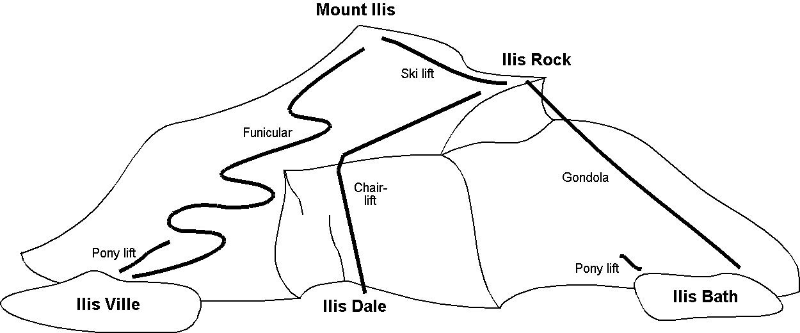

[#_4_3]
=== Transfer data

If Ilis Valley wants to send their entire data to the National Tourist Office, they generate a transfer file (with their software package). Usually in this form it will be read by another computer system and not by human beings. Nevertheless below a small part of this transfer file appears in print in order to provide you with an idea of its structure.

Three dots (...) mark omissions; the boxes on the right are merely notes that do not belong to the transfer file.

.All means of alpine transport up to Mount Ilis are part of the data contained in a transfer file (repetition of figure 11). The following file contains some data concerning the pony lift Ilis Ville.

[source,xml]
----
<?xml version="1.0" encoding="utf-8"?>
<TRANSFER xmlns="http://www.interlis.ch/INTERLIS2.3">

<HEADERSECTION VERSION="2.3" SENDER="AHTOUMIT0">
  <ALIAS>...</ALIAS>
</HEADERSECTION>

<DATASECTION>
<BASKET BID="xAHTOUMIT01234567" TOPICS="IlisTour.MITAlpineTransports">
  <IlisTour.MITAlpineTransports.MITAlpineTransport
   TID="xAHTOUMIT04231336">
    <Names>
      <NatTour.Designation>
        <Name>Pony lift Ilis Ville</Name>
        <Language>en</Language>
      </NatTour.Designation>
    </Names>
    <PosBottomStation>
      

        <C1>7931.11</C1>
        <C2>13171.23</C2>
        <C3>1771.34</C3>
      

    </PosBottomStation>
    <PosTopStation>
      

        <C1>8020.60</C1>
        <C2>13188.62</C2>
        <C3>1789.04</C3>
      

    </PosTopStation>
    <TravelTime>
      <Ahland.LengthOfTimeInMinutes>
        <Duration>3</Duration>
      </Ahland.LengthOfTimeInMinutes>
    </TravelTime>
    <Type>SkiLift</Type>
    <PosBottomStationWGS>
      

        <C1>23.68611</C1>
        <C2>44.20278</C2>
        <C3>1771.34</C3>
      

    </PosBottomStationWGS>
    <PosTopStationWGS>
      
...

    </PosTopStationWGS>
    <PictureTopStation>
      http://www.ilishornbahnen.com/webcam?bahn=pony4
    </PictureTopStation>
    <CourseOfTracks>...</CourseOfTracks>
    <HikersToboggans>unsuitable</HikersToboggans>
    <OperatingHours>...</OperatingHours>
    <OperatingDecision>...</OperatingDecision>
    <InformationOnConditions>
      <Ilistour.MITCurrentEvents.InformationOnConditions>
        <Temperature>13</Temperature>
        <Wind>
          <Ilistour.MITCurrentEvents.IndicationOfWind>
            <WindDirection>NE</WindDirection>
            <WindSpeed>13</WindSpeed>
          </Ilistour.MITCurrentEvents.IndicationOfWind>
        </Wind>
        <WaitingTime>
          <Ahland.LengthOfTimeInMinutes>
            <Duration>8</Duration>
          </Ahland.LengthOfTimeInMinutes>
        </WaitingTime>
        <Captured>2002-11-25T15:11:00</Captured>
      </Ilistour.MITCurrentEvents.InformationOnConditions>
    </InformationOnConditions>
  </IlisTour.MITAlpineTransports.MITAlpineTransport>
</BASKET>
</DATASECTION>
</TRANSFER>
----
