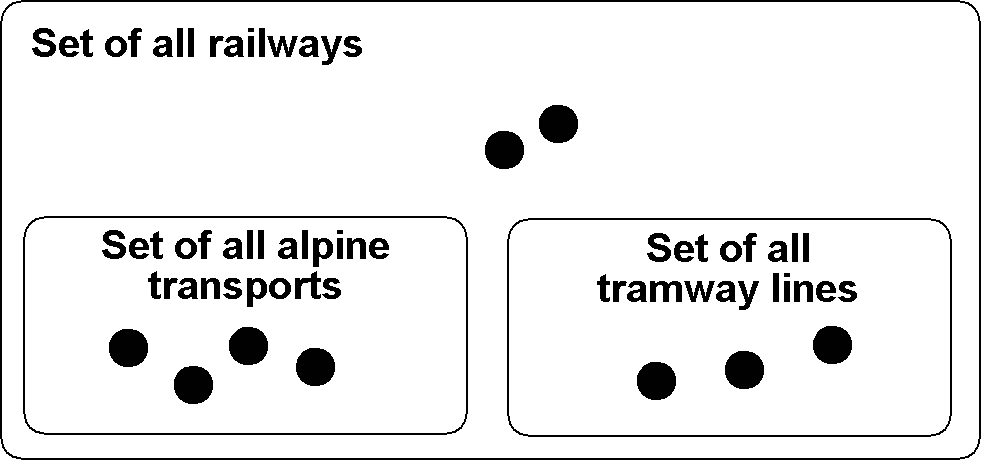

[#_5]
== Inheriting becomes the fashion

[#_5_1]
=== Heirlooms and succession – Principles of inheritance

Actually a set of alpine transport is nothing extraordinary, because it has many characteristics in common with all railways. For instance like all other railways it has a name. Even the fact that a means of alpine transport is run by a company is not that special – after all it is the same for a tramway.

On the other hand it is obvious that alpine transports and tramways have some things in common but nevertheless are not quite the same. 

.Similar in many aspects but not quite the same: AlpineTransport and TramwayLine both are special railways – they are sub classes of the more general super class railway.
 image:img/image22.png[./media/image22,width=98,height=162]

[NOTE]
By means of *inheritance* similarities and differences of object classes can be formulated. *Sub classes specialize* the more general *super classes*.

In diagrams it is customary to place the more general super class above the more special sub class. However more complicated diagrams tend to turn out badly arranged if one were to abide strictly by this principle. In any case it is the direction of the arrow and not the order on paper that is decisive.

Each alpine transport is a railway, but not every railway rides up a mountain: The set of alpine transport is a sub set of the set of all railways. We also speak of the fact that the sub class AlpineTransport is a *restriction* of the super class Railway.

.The specialization of classes corresponds to a sub-set relationship of object sets: The set of alpine transport (in the picture on the right with four elements) must be contained entirely in the set of all railways (nine elements), because in the model (picture on the left) the class AlpineTransport specializes the more general class Railway.
 

Occasionally we use the term *extension* – with the same meaning as «restriction» – for specialization.

It is confusing that with modeling the terms «restriction» and «extension» are often used with the same meaning. Here is the reason why: A class may also be understood as a number of conditions upon which it can be decided whether an object belongs to a class (e.g. criteria what exactly is a railway). A sub class heightens all these requirements: In order for something to qualify as an alpine transport it not only has to meet all the requirements of a railway but it must moreover comply with further demands. Thus by extending requirements, a sub class restricts at the same time the set of the specimens belonging to it.

Inheritance is a fabulous means of creating order in a complex world. On the other hand we may be tempted to formulate a more detailed model – i.e. to distinguish between classes without the least necessity. 

.The powerful tool of inheritance may lead us into distinguishing between special cases even if an application would not render this necessary. It is true that a horse-drawn tramway is not the same as an electrical one but: Does it make any sense to state these differences in a data model or does it only unnecessarily blow up the model?
image::img/image24.png[./media/image24,width=496,height=208]

[source]
----
CLASS Railway =
  Name: TEXT*100;
END Railway;

CLASS AlpineTransport EXTENDS Railway =
  PosBottomStation: NationalCoord;
  PosTopStation: NationalCoord;
END AlpineTransport;

CLASS TramwayLine EXTENDS Railway =
END TramwayLine;
----

.AlpineTransport and TramwayLine accept («inherit») the property name of their super class Railway, without this having to be stated once more. In addition to inherited properties an alpine transport possesses further characteristics, i.e. the position of bottom and top station (in national coordinates). On the right hand side the same is stated in the notation of INTERLIS.
image::img/image25.png[./media/image25,width=252,height=90]

[NOTE]
Sub classes accept or *inherit* always all the properties of their more general super classes. However they can define additional characteristics.

[#_5_2]
=== Refine what has been inherited

In general one hundred signs may be appropriate for the name of one particular alpine transport. After all at a time it had been considered to run a «Children and Family tow-rope Mount Ilis area». However at the very last minute it was decided to use «pony lift» instead, to the great relief of the local tourist organization.

But a tramway line with one hundred signs? Five signs should definitely be enough.

[source]
----
CLASS Railway =
  Name: TEXT*100;
END Railway;

CLASS AlpineTransport EXTENDS Railway =
  PosBottomStation: NationalCoord;
  PosTopStation: NationalCoord;
END AlpineTransport;

CLASS TramwayLine EXTENDS Railway =
  Name (EXTENDED): TEXT*5;
END TramwayLine;
----

Figure 27: Five signs are sufficient for the name of a Tramway Line: The type of the property «Name» is refined by the sub class (specified). On the right hand side the same is stated in the notation of INTERLIS.

The specified, refined information must be compatible with the one inherited. For instance the maximum length for a tramway line may not exceed the length of the common railway.

[NOTE]
====
Sub classes can *refine* inherited properties. However the specified information may not contradict the one inherited: they must be *compatible* with the definition of the super class.

_Otherwise a sub class might feature objects that are not part of the set of all objects of the super class._
====

[#_5_3]
=== Is there really such a thing? – Abstract classes

Some classes are purely mental tools: They do not represent actually existing items. For instance there is not one single living being in this world that would only be living being without being something more specific at the same time. Similarly a data model might determine that there is no railway as such but that every railway would have to be either a tramway line, an alpine transport etc.

[NOTE]
If a class should not feature any concrete objects, it is declared *abstract*.

Very often in a data model all its super classes will be abstract and only its very last, most specific classes will be concrete.

[source]
----
CLASS Railway (ABSTRACT) =
  Name: TEXT*100;
END Railway;

CLASS AlpineTransport EXTENDS Railway =
  PosBottomStation: NationalCoord;
  PosTopStation: NationalCoord;
END AlpineTransport;

CLASS TramwayLine EXTENDS Railway =
END TramwayLine;
----

Figure 28: Railway as an abstract class: If it is required that there be no objects that are only railway without also being alpine transport or tramway line this is shown in the diagram in italics. On the right hand side the same is stated in the notation of INTERLIS.

[#_5_4]
=== We do not want to give such precise orders – Abstract properties

Let's assume an international association wishes to ensure that tickets are captured with their prices. Then again it does not want to dictate a certain currency and consequently it is not clear where a sensible upper limit for the price could be set. Nevertheless it is not contested that «price» should be a number and that we deal with money. After all prices are not measured in kilometers per hour!

[source]
----
CLASS TicketTypeWorldwide (ABSTRACT) =
  Price (ABSTRACT): NUMERIC [MONEY];
END TicketTypeWorldwide;

CLASS TicketTypeAhland EXTENDS TicketTypeWorldwide =
  Price (EXTENDED): 0.00 .. 9999.99 [Ahland.Sovereign];
END TicketTypeAhland;
----

[NOTE]
Not all properties have to be defined down to the last detail: with abstract classes *abstract properties* are admissible. It is then up to the concrete sub classes, to specify these properties. For instance this is handy when regulating something on national or international level without prescribing every single detail right from the beginning.

[#_5_5]
=== Details are of no interest – A closer look at the specific

In general whoever demands information on the transport system of a country does not want to know whether one particular means of transport is a cable car, a tramway or some other sub type of railway. Nor would he want to find out what system of cogs is used by a line, if it were to be a cog rail. Nothing but its name (that according to the data model is captured for each means of transport) is sufficient as an answer.

[NOTE]
====
Entities of a sub class can always be considered to be generalizing in terms of a super class.

_The Greek expression for this principle is polymorphism._
====

However this applies on one condition:

[NOTE]
Each extension must be *compatible* with its basic definition. Compatible means that each value possible with the extended definition can be mapped onto the basic definition in accordance with the rules of the basic type (text, enumeration, number coordinate etc.).

[#_5_6]
=== Inheritance on a larger scale

Not always the distinction between sub- and super class is justified on a mere factual basis. Organizational considerations may be decisive.

For instance in Ilis Valley they basically agree with the idea of an alpine transport as conceived by the National Tourist Office. Nevertheless they are not quite satisfied:

* For those lines that run up to Mount Ilis it would be interesting to know the course of the tracks. If it were to be captured, then the course could be added to the maps that are available free for tourists at the information centre.
* Furthermore Ilis Valley would like to record, which lines are suitable for hikers and toboggans.

Both are properties that basically apply to every alpine transport could feature – they simply do not feature in the national model. Of course Ilis Valley has asked the National Tourist Office to adjust their model accordingly. But the only reply they got as that they neither had the time nor the money to alter all their computer systems in the country just to gratify the wishes of some mountain valley. So what now?

Some reckoned that the National Tourist Office had best be ignored since it consisted mainly of bureaucrats without the least understanding for practical matters! (Other words were mentioned that had nothing whatsoever to do with the matter.)

Others could relate to the opinion of the National Tourist Office – just imagine if every valley were to have their own way. And besides they still profited from the National Tourist Office: with the data they are sent material for and about the Ilis Valley is produced.

So should the people in charge renounce their extra wishes? Or double gather all their data – once for themselves, once for the National Tourist Office?

.The National Tourist Office is not willing to adjust their model to the extra wishes of Ilis Valley. Thanks to inheritance Ilis Valley can still collect their data: Their topic AlpineTransports inherits everything from the national topic AlpineTransports, but adds as an extension the object class MITAlpineTransport with additional properties.

Thanks to inheritance this conflict could be solved. In Ilis Valley all railways are captured as MITAlpineTransport with all extensions. Since MITAlpineTransport is a sub class of AlpineTransport (in accordance with the National Tourist Office), each MITAlpineTransport can be read as an ordinary AlpineTransport. Hence Ilis Valley can send their data just as they are to the National Tourist Office.

[NOTE]
====
Inheritance can also be used to support federal characteristics.

_To be exact it is due to polymorphism that is rendered possible by inheritance: Each entity of a sub class can be regarded as part of the super class (cf. paragraph <<_5_5>>). Thus the National Tourist Office can process data from each alpine transport in the country even if it is an example of a local sub class of «alpine transport» unknown to the National Tourist Office._
====

Inheritance does not go very far with INTERLIS: Not only classes and topics, but also domains (types), views, graphic definitions, in a certain sense even units can be inherited and specified.

[#_5_7]
=== Simple and multiple inheritance

Some modeling languages permit the simultaneous inheritance of several basic elements. Thus a class may refine several super classes at the same time.

In information technology it is debated as to how useful this really is. Models using multiple inheritance often become more confusing. Hence INTERLIS only applies simple inheritance.

