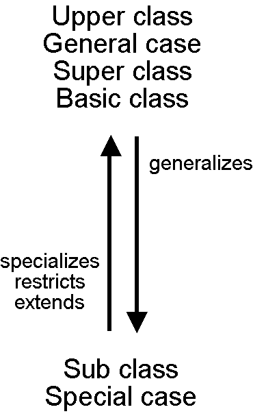
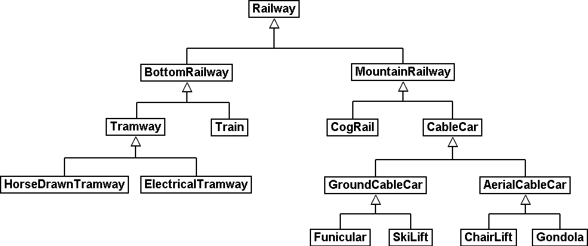
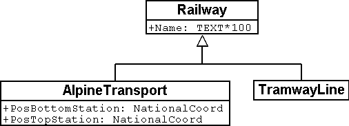

[#_5_1]
=== Heirlooms and succession – Principles of inheritance

Actually a set of alpine transport is nothing extraordinary, because it has many characteristics in common with all railways. For instance like all other railways it has a name. Even the fact that a means of alpine transport is run by a company is not that special – after all it is the same for a tramway.

On the other hand it is obvious that alpine transports and tramways have some things in common but nevertheless are not quite the same. 

.Similar in many aspects but not quite the same: AlpineTransport and TramwayLine both are special railways – they are sub classes of the more general super class railway.
image::img/image21.png[] 

[NOTE]
By means of *inheritance* similarities and differences of object classes can be formulated. *Sub classes specialize* the more general *super classes*.

In diagrams it is customary to place the more general super class above the more special sub class. However more complicated diagrams tend to turn out badly arranged if one were to abide strictly by this principle. In any case it is the direction of the arrow and not the order on paper that is decisive.

Each alpine transport is a railway, but not every railway rides up a mountain: The set of alpine transport is a sub set of the set of all railways. We also speak of the fact that the sub class AlpineTransport is a *restriction* of the super class Railway.

.The specialization of classes corresponds to a sub-set relationship of object sets: The set of alpine transport (in the picture on the right with four elements) must be contained entirely in the set of all railways (nine elements), because in the model (picture on the left) the class AlpineTransport specializes the more general class Railway.
image::img/image21.png[] image:img/image23.png[]

Occasionally we use the term *extension* – with the same meaning as «restriction» – for specialization.

It is confusing that with modeling the terms «restriction» and «extension» are often used with the same meaning. Here is the reason why: A class may also be understood as a number of conditions upon which it can be decided whether an object belongs to a class (e.g. criteria what exactly is a railway). A sub class heightens all these requirements: In order for something to qualify as an alpine transport it not only has to meet all the requirements of a railway but it must moreover comply with further demands. Thus by extending requirements, a sub class restricts at the same time the set of the specimens belonging to it.

Inheritance is a fabulous means of creating order in a complex world. On the other hand we may be tempted to formulate a more detailed model – i.e. to distinguish between classes without the least necessity. 

.The powerful tool of inheritance may lead us into distinguishing between special cases even if an application would not render this necessary. It is true that a horse-drawn tramway is not the same as an electrical one but: Does it make any sense to state these differences in a data model or does it only unnecessarily blow up the model?

[source]
----
CLASS Railway =
  Name: TEXT*100;
END Railway;

CLASS AlpineTransport EXTENDS Railway =
  PosBottomStation: NationalCoord;
  PosTopStation: NationalCoord;
END AlpineTransport;

CLASS TramwayLine EXTENDS Railway =
END TramwayLine;
----

.AlpineTransport and TramwayLine accept («inherit») the property name of their super class Railway, without this having to be stated once more. In addition to inherited properties an alpine transport possesses further characteristics, i.e. the position of bottom and top station (in national coordinates). On the right hand side the same is stated in the notation of INTERLIS.

[NOTE]
Sub classes accept or *inherit* always all the properties of their more general super classes. However they can define additional characteristics.

[#_5_2]
