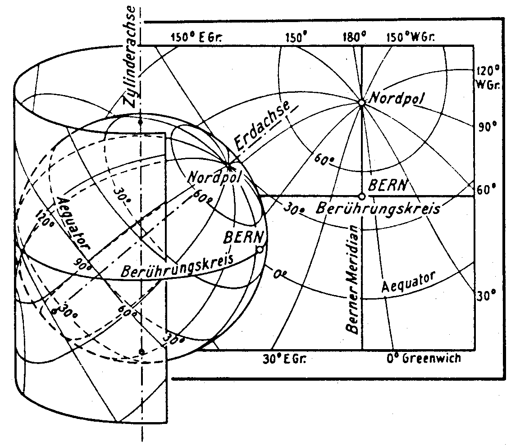

[#_6]
== The data model under closer scrutiny

[#_6_1]
=== Sovereigns and pennies – Numeric data types

[#_6_1_1]
==== Value domain

A simple ticket for a single ride with the funicular up to Mount Ilis costs 10 Ahland sovereigns, a yearly sport pass is worth 635 sovereigns. So how should the price of a ticket be modeled?

Whoever is used to dealing with programming language would think immediately of whole number («Integer») or floating point number («Real»). With many programming languages and data base it is possible to determine the memory space a number will take up, hence ensue size and precision of the numbers that can be stored («short integer», «long integer», «double precision», etc.). Thus one would consider the domain within which the value would approximately be situated and choose storage accordingly.

When modeling at conceptual level most likely one would not want to be bothered with storage. However it is possible to indicate the highest and lowest value admissible and to determine at the same time the number of digits and exponents.

Since prices lie between 10 and 635 sovereigns we could then write:

Price: 10 .. 635;

However this would also decide that the price can never be less than 10 sovereigns or more than 635 sovereigns, which of course is very undesirable. As a lower limit 0 seems plausible. But the upper limit? It is unlikely to be more than 10'000 sovereigns. So 10'000? Wherever because of a particular application a precise limit cannot be determined, in any case it would not make sense to select the value just so that shorter storage (e.g__. short integer__ with value between –32768 and 32767) would not be sufficient.

Of course it is also important to consider the number of decimals necessary. If prices may feature pennies then the limit would have to be set with to decimals. With an attribute which for instance represents an investment budget you are likely to deal in millions, when dealing with dimensions two digits will be sufficient. However these may refer to a thousand, a million or even a billion.

Price: 0.00 .. 9999.99; +
Budget: 0.00E6 .. 999.99E6; +
GrossNationalProduct: 0.0E0 .. 9.9E20;

The number of decimals describes the precision: «4.3 Million» (4.3E6 = 4.3 · 106) is not as precise an indication as «4300000».

[#_6_1_2]
==== Units

Now do we deal with sovereigns, francs, Euro or dollars? Units are – not only where money is concerned – of paramount importance. That is why we recommend indicating the unit not only as a comment or part of the attribute name but actually as constituent of the type:

UNIT +
Sovereign EXTENDS MONEY; +
 +
CLASS TicketType = +
Price: 0 .. 9999 ++[++Sovereign++]++; +
END TicketType;

Sovereigns (or Swiss francs, Euro, dollars, etc.) are defined as units and can then be used when defining a numeric type. However most common units (amongst others also CHF, EUR, USD) actually need not be defined but are available via the specific units model (units.ili, cf. paragraph 3.3).

[WARNING]
In the interest of clarity we recommend indicating units at any time. The INTERLIS-units-model comprises, besides numerous physical units, such units for common currencies and for number, percent and per mille.

[#_6_1_3]
==== Inheriting numeric types

Since the Mount Ilis Alpine Transports will never issue tickets that cost over a thousand sovereigns, one might come up with the idea of defining this in its own class:

CLASS TicketType (EXTENDED) = +
Price (EXTENDED): 0 .. 1000 ++[++sovereigns++]++; +
END TicketType;

In this application this concrete example does not make much sense really. But in real life there certainly are cases where limiting the inherited value domain is a sensible thing to do.

Nevertheless those in charge in Ilis Valley cannot suit themselves where the value domains of the national models are concerned. The principle applies that each Illis Valley value also has to be admissible in the basic model of the National Tourist Office. Otherwise we could not ensure a smooth transfer of data from Ilis Valley to the National Tourist Office.

Thus an indication of price 0 .. 1000 is an admissible restriction of the value domain provided nationally of 0 .. 9999. If the value domain in Ilis Valley were to be extended – for instance with an indication of 0 .. 15000 – then all ticket types ranging between 10000 and 15000 were incorrect from the National Tourist Office's point of view. Hence such a definition is inadmissible.

The people in charge in Ilis Valley also insist on the possibility of issuing tickets with prices that not necessarily have to be an entire sovereign. One would like to write the following definition:

CLASS TicketType (EXTENDED) = +
Price (EXTENDED): 0.00 .. 1000.00 ++[++Sovereign++]++; +
END TicketType;

Then again, would this be compatible with the basic model? Yes, because according to the Illis Valley model (e.g. 7.35) with a mathematical rounding each value can be mapped onto a correct value of the national model (e.g. 7).

The definition would be inadmissible if it were to comprise values that once rounded violate the basic model. For instance the maximum value of 9999.99 once rounded would become 10000 – which would be more than the 9999 predefined by the National Tourist Office. However Ilis Valley could define a value ranging from 0.00 .. 9999.49 without contradicting the basic model, because after rounding 9999.49 would become again 9999.

It is also inadmissible to renounce precision in the specified model. For instance if the national tourism model were to provide a domain of 0.00 .. 1000.00 Illis Valley could not indicate 0 .. 1000 in their specification.

And furthermore: Units of the extension must always be in accordance with those of the basic model!

[#_6_1_4]
==== Limits as yet unknown

Can the National Tourist Office determine what price is admissible for a ticket? If the limits are still entirely unknown, then – within the scope of abstract attributes – their notation can be omitted. Nevertheless it is possible to already determine a unit.

Price (ABSTRACT): NUMERIC ++[++Ahland.Sovereign++]++;

Maybe even the unit is still uncertain. It would only be known that e deal with e.g. a currency.

Price (ABSTRACT): NUMERIC ++[++MONEY++]++;

Thus at least the character of the unit would be settled. Therefore in an extension only such units could be defined as would figure as concretes of the abstract unit MONEY (for further information concerning abstract properties also see paragraph 5.4).

Price (EXTENDED): 0 .. 10000 ++[++CHF++]++; !! admissible +
Price (EXTENDED): 0 .. 2000 ++[++USD++]++; !! admissible +
Price (EXTENDED): 0 .. 1000 ++[++m++]++; !! inadmissible, because meter +
!! specifies LENGTH and not MONEY.

[#_6_2]
=== Types of alpine transport – Modeling of types of objects

For a brief overview it is sufficient to roughly divide alpine transports: Cog rail, funiculars, aerial cable cars, ski lift, chair lifts, gondolas. In the simplest of cases the type would be noted as a text attribute.

CLASS AlpineTransport = +
Name: TEXT++*++100; +
Kind: TEXT++*++50; +
END AlpineTransport;

Consequently people in charge of data input would be very free in their description. Aerial cable car, gondola, ski lift, ski-lift – it is to be feared that a virtual jungle of terms would result. This could be avoided by using an enumeration.

CLASS AlpineTransport = +
Name: TEXT++*++100; +
Kind: (CogRail, +
Funicular, +
AerialCableCar +
SkiLift, +
ChairLift, +
Gondola); +
END AlpineTransport;

Since all admissible possibilities have been enumerated, order would have been established. Often it will appear desirable to add further attributes such as the number of available seats on some means of transport. With funicular and aerial cable car this would be the capacity of the entire cabin, with ski and chair lifts it would be the number of persons per single ride. However with a cog rail where several wagons can be hooked up this information would not make sense. Maybe the cog system would be of greater interest. Now should the class AlpineTransport simply feature all attributes needed for the describing of the different kinds?

If the different kinds feature their respective properties (attributes or relationships) it makes sense to define individual classes that inherit from the basic class (cf. <<_5>>).

.CogRail, Funicular etc. are specific types of AlpineTransport. However there is no alpine transport as such: All «concrete» types of alpine transport always belong to one of the sub classes. Hence __AlpineTranspor__t is an abstract class, which in the diagram would be shown by means of italics.
image::img/image30.png[./media/image30,width=390,height=62]

But there are no means of alpine transport that are exclusively alpine transport without at the same time being part of a sub class. Therefore the class AlpineTransport will be declared «abstract». Consequently a concrete means of alpine transport will always have to be a cog rail, an aerial cable car etc.

In the textual notation of INTERLIS 2 abstract classes are pointed out with the indication (ABSTRACT) in brackets. As a side remark: The INTERLIS-units model «Units» features a unit «CountedObjects» for counted objects such as the number of people in a aerial cable car cabin.

CLASS AlpineTransport (ABSTRACT) = +
Name: Text ++*++ 100; +
END AlpineTransport; +
 +
CLASS CogRail EXTENDS AlpineTransport = +
CogSystem: (Riggenbach, Abt, vonRoll); +
END CogRail; +
 +
CLASS Funicular EXTENDS AlpineTransport = +
Capacity: 0 .. 999 ++[++Units.CountedObjects++]++; +
END Funicular; +
 +
CLASS AerialCableCar EXTENDS AlpineTransport = +
Capacity: 0 .. 999 ++[++Units.CountedObjects++]++; +
END AerialCableCar; +
 +
CLASS SkiLift EXTENDS AlpineTransport = +
PersonsPerRide: 0 .. 10 ++[++Units.CountedObjects++]++; +
END SkiLift; +
 +
CLASS ChairLift EXTENDS AlpineTransport = +
PersonsPerRide: 0 .. 24 ++[++Units.CountedObjects++]++; +
END ChairLift; +
 +
CLASS Gondola EXTENDS AlpineTransport = +
Capacity: 0 .. 99 ++[++Units.CountedObjects++]++; +
END Gondola;

For the meeting a railway person had been invited especially who then did a lengthy speech on cog rails. All present learnt a lot about what cog systems are in use world-­wide and about their respective advantages and disadvantages. However at the end of the day the people in Ilis Valley asked themselves what, after all, did these cog systems have to do with their project. Nobody could imagine of what possible interest these or other pieces of information would be in a future extension. Thus this model was rejected because it went too much into detail and finally would incur unnecessary costs for the input and maintenance of data.

See also paragraph 5.1 which deals with the temptation to enter into too many details when modeling.

[#_6_3]
=== Is there such a thing as light blue ski runs? – Structured enumeration

[#_6_3_1]
==== Ordinary enumeration and its laws of inheritance

In order to achieve a rough distinction between the difficulty degrees of ski runs, three colors had been chosen: blue, red, black. These and only these difficulty degrees should prevail. Furthermore they all relate to an order. Blue depicts a simple ski run, a red run is more difficult than a blue one, and a black one is the most demanding. The following definition would describe this circumstance:

CLASS SkiRun = +
DifficultyDegree: (blue, red, black: FINAL) ORDERED; +
END SkiRun;

If the FINAL-indication were to be missing, then this enumeration could still be added onto in an extension. For instance in the case of different kinds of alpine transport this might make sense:

!! Model of the National Tourist Office +
CLASS AlpineTransport = +
Kind: (CogRail, Funicular, AerialCableCar, +
SkiLift, ChairLift, Gondola); +
END AlpineTransport; +
 +
!! Model Ilis Valley +
CLASS MITAlpineTransport EXTENDS AlpineTransport = +
Kind (EXTENDED): (SnowBus); +
END MITAlpineTransport;

In the extended class the element snow bus is added to the enumeration – the latest of all novelties – at the end of the existing enumeration. But what will the National Tourist Office make of that? For them «Snow bus» is still unheard of.

[NOTE]
Each (horizontal) extension can be complemented with further value as long as it is not expressively excluded by *FINAL*. If somebody is only interested in these values in general according to the basic class, then all these values will be translated into the value *OTHER*.

For the basic class the value snow bus - and other possible values - are only recognizable as OTHER. However if FINAL is indicated, then the value OTHER no longer can occur. If an enumeration is defined as circular (*CIRCULAR*) then such extensions are impossible because circular means that the highest value is followed by the lowest and hence it would be impossible to know which of them is the highest.

WindDirection: (N, NE, E, SE, S, SW, W, NW) CIRCULAR;

[#_6_3_2]
==== Sub-enumeration

Thu s it had been decided not to model the different kinds of alpine transport with an entire landscape of classes. But all the railway enthusiasts were not quite satisfied: who knows if at some stage the cog system of the cog rail would not be of interest after all...

For each value of an enumeration a sub-enumeration can be defined. This may happen directly within the basic definition or only in an extension.

CLASS MITAlpineTransport EXTENDS AlpineTransport +
Kind (EXTENDED): (CogRail (Riggenbach, Abt, vonRoll)); +
END MITAlpineTransport;

WeekDay: (WorkingDay (Monday, Tuesday, Wednesday, +
Thursday, Friday, Saturday), +
Sunday);

If such an enumeration is defined within an extension, then it is simply of no importance from the base's point of view. So as far as the National Tourist Office is concerned a Riggenbach-cog rail would still be a cog rail.

Even sub-enumeration can be complemented with further values, as long as value has not been declared FINAL. The individual values of a sub-enumeration again can be specified by sub enumeration, which would result in entire enumeration trees.

[#_6_4]
=== Ilis Valley is concise – Strings and their rules of inheritance

As a general rule designations may consist of names of any chosen length. Nevertheless the national association has determined that the name of any alpine transport may not exceed a total of 100 signs. In general of course the names tend to be much shorter, but one would like to be on the safe side.

STRUCTURE RailwayDesignation EXTENDS Designation = +
Name (EXTENDED): TEXT++*++100; +
END RailwayDesignation;

Whenever the length of a text attribute is discretionary or as yet completely unknown, the indication of its length can be omitted. If obviously this length will be determined within the scope of an extension of class, the attribute will be qualified as abstract:

Description (ABSTRACT): TEXT;

Some means of transport in Ilis Valley have installed a web camera, which continually registers the environment of the top station. Tourists may judge themselves whether the trip is worthwhile. The Internet address of the current picture also represents a (somewhat particular) form of text.

CLASS MITAlpineTransport = +
... +
PictureTopStation: URI; +
... +
END MITAlpineTransport;

Internet addresses have got nothing in common with the Swiss canton of Uri – if anything then with Geneva where the first Web-Browser was developed at CERN. URI simply is the abbreviation of _Uniform Resource Identifier._ _Uniform Resource Locators (URLs)_, mainly used for web sites, are special URIs.

[#_6_5]
=== Calm – Optional and mandatory attributes

Current operational data also include weather data such as temperature, direction and force of wind. When it is calm it makes no sense to indicate the direction of the wind. All other information should always be displayed.

[NOTE]
The fact that an attribute can be *undefined*, respectively that it always has to be defined, forms part of the model.

[WARNING]
Undefined is not simply 0 or some other slightly exceptional value. It is an independent value, which clearly reflects the fact of being undefined.

For instance in INTERLIS 2 we would write:

CLASS Weather = +
Temperature: MANDATORY –50 .. 50 ++[++oC++]++; +
WindDirection: (N, NE, E, SE, S, SW, W, NW) CIRCULAR; +
WindSpeed: MANDATORY 0 .. 200 ++[++kmh++]++; +
END Weather

Hence both temperature and wind speed are compulsory (MANDATORY). Since the wind direction is not compulsory, it is optional. Thus the concrete value may be undefined. In extensions it is admissible to turn optional attributes into mandatory attributes. However mandatory attributes may never be turned into optional attributes, because in accordance with the basic class the value «undefined» is not permitted.

[#_6_6]
=== Waiting times and duration of ride – Value domains

Both waiting times at stations and duration of rides are noted in minutes.

CLASS AlpineTransport = +
Duration: 0 .. 200 ++[++min++]++; +
END AlpineTransport;

CLASS StatusAlpineTransport = +
WaitingTime: 0 .. 200 ++[++min++]++; +
END StatusAlpineTransport;

Both properties can adopt values of the same range. With a specifically defined value range (DOMAIN) this common factor can be highlighted further:

DOMAIN +
DurationInMinutes = 0 .. 200 ++[++min++]++;

CLASS AlpineTransport = +
DurationOfRide: DurationInMinutes; +
END AlpineTransport;

CLASS StatusAlpineTransport = +
WaitingTime: DurationInMinutes; +
END StatusAlpineTransport;

[#_6_7]
=== Where is Ilis Valley? – Coordinate types

[#_6_7_1]
==== General remarks concerning coordinate types

We would link the idea of a place in real world, shaped like a point, with the question «Where?». Such a place can be described by means of a coordinate. Typically such a coordinate is a pair of numbers that describe the position of a place, or a triple that describes position and altitude of a place.

For each dimension of a coordinate type we have to determine, in the same way as with numeric types, in which admissible values may range and what unit they refer to.

Position: COORD 500.00 .. 91000.00 ++[++m++]++, +
700.00 .. 23000.00 ++[++m++]++;

XPosition: 500.00 .. 91000.00 ++[++m++]++; +
YPosition: 700.00 .. 23000.00 ++[++m++]++;

At first sight the difference between a position attribute with a coordinate type and one numeric attribute for both X- and Y-direction is minor. Thanks to its definition as a coordinate type it is obvious that these pieces of information belong together. A program package may also exploit this property. For instance many programs are capable of graphic representation of Cartesian coordinate values.

Cartesian coordinate values? Cartesian values are coordinates whose dimensions are perpendicular. Hence the definition of the position coordi­nates above depicts a rectangular window of approx. 90 times 22 kilometers. Does that mean we return to medieval times? Has the earth in Ilis Valley once more become a disc?

[#_6_7_2]
==== The wrapped up plum – What is a coordinate system?

Already Ptolemaeus considered the earth to be a sphere. Surveyors have had to take leave of this view a long time ago, because it simplifies to too great an extent.

A useful approximation of the earth surface is the Ellipsoid, in other words the surface that results when an ellipse revolves around its central axis.

.When an ellipse revolves around its own axis, a flattened sphere results in space. Thanks to such an ellipsoid an approximation of the shape of the earth surface can be attempted. +
 

(All figures in this paragraph and in paragraph 6.7.5 from: K. Christoph Graf, Verwendung geodätischer Abbildungen bei der Geocodierung von Satelliten-Bildern. Zürich, 1988. Illustrations have been partially simplified. Original sources as stated above).

Depending on the part of the world, different ellipsoids are used, otherwise the approximation would become too imprecise. For instance Switzerland uses the same ellipsoid as Germany, but one slightly different from Sweden or France.

As a spatial formation ellipsoids are somewhat awkward to handle. For this reason surveyors will map the ellipsoid onto a surface. To this intent they will drape a cylinder or cone over the ellipsoid and light it from the interior, thus projecting the picture of the landscape onto the cylinder or cone.

.The ellipsoid is wrapped in a cylinder (left) or cone (right). Then it is lit from the interior.
image::img/image33.png[./media/image33,width=120,height=94] image:img/image34.png[./media/image34,width=77,height=84]

In the next step the cylinder or cone is cut open with a pair of scissors, rolled out flat on a table – and there goes your map!

.Once the projection has been completed, the cylinder (or cone) is cut open and rolled out. A convex body such as an ellipsoid or a sphere could be cut open but not rolled out flat.

At the end the map is superposed with fine perpendicular lines: the *coordinate* *system* of the map. That is why with each coordinate type it has to be determined what coordinate system it is based upon.

Position: COORD 480000 .. 850000.00 ++[++m++]++ ++{++AhlandSys++[++1++]++}, +
60000 .. 320000.00 ++[++m++]++ ++{++AhlandSys++[++2++]++};

The first dimension of the coordinate corresponds to the first axis of the coordinate system by the name of «AhlandSys», the second dimension to the second axis of the same system.

[#_6_7_3]
==== Information concerning the coordinate system – Meta data

Is «AhlandSys» a Cartesian, an ellipsoid system? What are the names of the axes? Are there any common features (e.g. map projections) with other coordinate systems? All this information can be described by means of data. In order to make it clear ho such data is structured, a corresponding data model is formulated for it. Such a model is called meta model, the appertaining data meta data because they serve to describe the actual data.

Data belonging to a meta model are «meta» in another more formal sense an information concerning origin or price (cf. paragraph 3.3). Unfortunately the same term is commonly used for both of them.

In simple cases here the application range of a data model will make it quite clear what coordinate system the coordinates actually belong to, you may omit the explicit indication of the coordinate system. Nevertheless it does make sense to make at least some sort of mention of the coordinate system in the name of the coordinate type.

NationalCoord = COORD 500.00 .. 91000.00 ++[++m++]++, +
700.00 .. 23000.00 ++[++m++]++;

Position: NationalCoord;

To avoid confusions, the responsible persons of Ilis Valley have given preference to a precise definition:

REFSYSTEM BASKET CoordSystems ~ CoordSys.CoordsysTopic +
OBJECTS OF GeoCartesian2D: AhlandSys;

Based upon the general model for coordinate systems (CoordSys), they have presented a precise definition of their national system. For its position they have registered an object of the class GeoCartesian2D with the name of AhlandSys. Within the model the existence of this data entry is referred to by means of OBJECTS OF. Thus the coordinate system AhlandSys becomes available in the model. When applying the system, there is no need to actually mention the name of our stock of meta data (CoordSystems), unless several such stocks of meta data were defined within the current modeling part.

LandesKoord = COORD 500.00 .. 91000.00 ++[++m++]++ ++{++CoordSystems.AhlandSys++[++1++]++}, +
700.00 .. 23000.00 ++[++m++]++ ++{++CoordSystems.AhlandSys++[++2++]++};

[#_6_7_4]
==== Different coordinate systems

In order to offer a special service to those tourists that have a simple GPS-receiver at their disposal, Ilis Valley would like to make their coordinates also available as geographical coordinates in the global WGS84-System.

WGS84Coord = COORD -90.00000 .. 90.00000 ++[++Units.Angle++_++Degree++]++ ++{++WGS84++[++1++]++}, +
0.00000 .. 359.99999 CIRCULAR ++[++Units.Angle++_++Degree++]++ +
++{++WGS84++[++2++]++},

CLASS AlpineTransport = +
PosBottomstation: NationalCoord; +
PosBottomstationWGS: WGS84Coord; +
.... +
END AlpineTransport;

It seems obvious that both attributes are directly related. Projection coordinates can be converted into WGS84-coordinates. However it is not up to the conceptual description of data to render a detailed definition of such a conversion. Nevertheless it would be desirable to indicate that it is possible to calculate one set of coordinates from the others.

!! Conversion of coordinates from the Ahland projection system to WGS84. +
!! Functions will be discussed in paragraph 7.2 +
FUNCTION AhlandToWGS84 (Ah: Ahland.NationalCoord): WGS84Coord;

CLASS AlpineTransport = +
PosBottomStation: Ahland.NationalCoord; +
PosBottomStationWGS: WGS84Coord := AhlandToWGS84 (PosBottomStation); +
.... +
END AlpineTransport;

[#_6_7_5]
==== Three dimensional coordinates

Of course projection coordinates are not enough for the skiers and hikers around the  Ilis. Big differences in altitude delight the skiers, while hikers will either fear perspiration or shaking knees. Altitudes definitely are sought after! That is why coordinate types may also display three dimensions.

NationalCoord3 = COORD 500.00 .. 91000.00 ++[++m++]++ ++{++AhlandSys++[++1++]++}, +
700.00 .. 23000.00 ++[++m++]++ ++{++AhlandSys++[++2++]++} +
0.00 .. 9000.00 ++[++m++]++ ++{++AhlandHeightSys++[++1++]++};

WGS84Coord = COORD -90.00000 .. 90.00000 ++[++Angle++_++Degree++]++ ++{++WGS84++[++1++]++}, +
0.00000 .. 359.99999 CIRCULAR ++[++Angle++_++Degree++]++ +
++{++WGS84++[++2++]++}, +
-2000.00 .. 9000.00 ++[++m++]++ ++{++WGS84H++[++1++]++};

With altitudes an exceptional problem occurs. Where in fact would altitude 0 be situated? How can the altitude of any point be determined in relation to this altitude 0? Surveyors differentiate mainly between the altitudes according to the gravity field of the earth (gravity or geoid height; 0 being the altitude of the imaginary continuation of the sea below the continents) and altitudes according to the geometrical approximation of the earth (ellipsoid height; 0 being the surface of the ellipsoid).

.The gravity field of the earth: With the geoid the surface of the oceans is mentally continued under the continents. Mountain ranges, trenches etc influence the gravity field and thus alter the imaginary surface of the water. This drawing is quite exaggerated.
image::img/image36.png[./media/image36,width=160,height=153]

.Depending on the reference system selected point Q will have a different altitude.
image::img/image37.png[./media/image37,width=310,height=118]

Typically projection coordinate systems will use geoid heights. That is why the third dimension of projection coordinates does not simply refer to the third axis of the projection system but to the first axis of a special height system.

In contrast coordinates in GPS-measurements are determined purely geometrically from satellite positions without taking into account the gravity field of the earth. Hence WGS84-altitudes are ellipsoid heights.

image::img/image38.png[./media/image38,width=245,height=154] +
.There may be a difference of several meters between the gravity height and the geoid height. Above you see the difference between the commonly used ellipsoid of Switzerland and the one of France and former West Germany.
image::img/image39.png[./media/image39,width=252,height=266] image:img/image40.png[./media/image40,width=193,height=270]

The conversion between gravity heights and ellipsoid heights may pose a problem wherever the range of admissible coordinates extends over an area whose gravity field no longer is homogenous. Luckily these questions are of minor importance when modeling. Nevertheless they are worth a quick reflection.

[#_6_8]
=== Is zero up north? – Definitions for angles and directions

How big is a right angle? 90 Degrees or Pi / 2? This is a question of the unit in use. But when is the angle considered positive, when negative? Consequently the sense of rotation belongs to every type of angle: clockwise or counter clockwise.

DOMAIN +
AngleClockwise = -179 .. 180 CIRCULAR CLOCKWISE; +
AngleCounterClockwise = -179 .. 180 CIRCULAR COUNTERCLOCKWISE;

Standing on Mount Ilis we might want to know in which direction we have to look in order to see Twisted Peak. 50 degrees? 40 degrees? 310 degrees?

.Whoever climbs Mount Ilis will be rewarded with a spectacular view of the surrounding mountains. +
image::img/image41.png[./media/image41,width=406,height=156]

But in what angle will the Twisted Peak come into view? Unless we know what coordinate system the question refers to, it is impossible to offer an answer.

It all depends on the zero direction and how directions rotate. Whenever we speak of directions we also have to mention a reference system. That is why directions are closely linked with coordinate types. After all it also makes sense to determine the distance and direction of two points defined by coordinates.

.The indication of axes and rotation is part of the definition of a coordinate system.
image::img/image42.png[./media/image42,width=406,height=156]

NationalCoord = COORD 500.00 .. 91000.00 ++[++m++]++ ++{++AhlandSys++[++1++]++}, +
700.00 .. 23000.00 ++[++m++]++ ++{++AhlandSys++[++2++]++}, +
-200.00 .. 14000.00 ++[++m++]++ ++{++AhlandHeightSys++[++1++]++}, +
ROTATION 2 -++>++ 1;

Direction = 0.0 .. 359.9 CIRCULAR ++[++Angle++_++Degree++]++ ++{++AhlandSys};

[#_6_9]
=== Is a ski run a line or a surface? – Geometry types

[#_6_9_1]
==== Simple conceptual view of a line

From the skiers' view point everything is clear: They want to know where a run starts, where it ends and roughly where it goes through. Is there a pub somewhere along the way? Does the run go over open hills or through a forest? For such information it is enough to describe the ski run as a line.

To begin with you may imagine a line type to be exactly what the word says: A more or less complicated connection between two points.

In this sense a line type is nothing but a numeric type or even better a coordinate type. Since all points concerned with this line have to be described by means of coordinates a line type will of necessity always have to be linked to a coordinate type.

In INTERLIS we could write:

AhlandLine = POLYLINE VERTEX Ahland.NationalCoord;

CLASS SkiRun = +
Course: AhlandLine; +
END SkiRun;

The ski run is described by means of lines that are based upon the Ahland projection coordinate system. Thus the vertices of the lines in the Ahland reference system rely on the coordinate type of the reference system.

[#_6_9_2]
==== Segments

It is obvious: The ski run from Mount Ilis to Ilis Rock is a complicated line. In comparison the ski runs by the pony lifts are relatively simple. Could they all be described with the same type? The solution lies in breaking up the line as a whole into individual segments. Each segment itself is a simple geometry (e.g. a straight, part of an arc) and connects to its predecessor.

This state of matters could also be represented in the conceptual model. Then again this would be an unnecessary burden. Once it has been stated that lines are always structured in this way, this need no longer be displayed.

.The course of a ski run is a line. It consists of individual segments that can be of various types: straight segments, arc segments, etc.
image::img/image43.png[./media/image43,width=342,height=69]

It definitely makes sense to indicate which types of segments may occur with one specific line type.

AhlandLine = POLYLINE WITH (STRAIGHTS, ARCS) VERTEX Ahland.NationalCoord;

This INTERLIS 2-definition indicates that lines of this type may feature straights and arcs.

In many cases – and it is the same with ski runs – it does not make sense if a line intersects itself. Such restrictions also belong to the conceptual model. However because of minor imprecision in the course of surveying (and partially also when computing) it is possible that a form that is actually without overlaps does end up with slight overlaps. Hence a maximum of an admissible overlap is part of the model.

Since the Ahland projection coordinate system uses meters, this defini­tion permits overlaps up to 2 cm:

AhlandLine = POLYLINE WITH (STRAIGHTS, ARCS) +
VERTEX Ahland.NationalCoord +
WITHOUT OVERLAPS ++>++ 0.02;

.Sometimes small overlaps cannot be omitted. It is part of the model +
image::img/image44.png[./media/image44,width=233,height=105]

to define the maximum overlap (in this figure the height of arrow).

[#_6_9_3]
==== Directed lines

Of course any skier would expect the segments of the ski run from Mount Ilis to Ilis Rock to start at Mount Ilis and to end at Ilis Rock. After all the idea is to go downhill and not to climb up a slope! Then again for the description of other objects (e.g. hiking paths) direction is of no importance. Whenever the direction of lines is important this should be shown in the conceptual model.

AhlandLineDirected = DIRECTED POLYLINE VERTEX Ahland.NationalCoord;

CLASS SkiRun = +
Course: AhlandLineDirected; +
END SkiRun;

[#_6_9_4]
==== Surfaces

For the maintenance service of the Mount Ilis Alpine Transports the question arises whether the description of the ski runs fulfils their demands. In order to clarify which of the areas have to be prepared a presentation in the form of a surface seems preferable.

DOMAIN +
AhlandLineDirected = DIRECTED POLYLINE WITH (STRAIGHTS, ARCS) +
VERTEX Ahland.NationalCoord; +
 +
AhlandSurface = SURFACE WITH (STRAIGHTS, ARCS) +
VERTEX Ahland.NationalCoord;

CLASS SkiRun = +
Course: AhlandLineDirected; +
Prepared: AhlandSurface; +
END SkiRun;

Just before Ilis Rock a big tree stands in the middle of the ski run – in other words the ski run passes on either side of the tree.

.There is a big tree in the middle of the ski run. This might prove to be quite tricky for skiers, but we need not worry about the data model: Despite this the ski run will remain one whole surface.
image::img/image45.png[./media/image45,width=277,height=117]

Is the surface that has to be prepared still one whole surface? Surface – at least in the sense of INTERLIS – always means coherent areas. Even if they have interior blank spaces (holes, enclaves), they remain coherent areas and thus can be described as surfaces.

[NOTE]
A surface has exactly one *outer boundary*. It may possess none, one or several *interior boundaries* (enclaves).

At the very top of the Mount Ilis several ski runs are that close that as a result there is one common prepared surface. Now which part of this surface should be assigned to which ski run? In Ilis Dale two ski runs cross. Hence this surface is gathered twice which of course interferes when trying to evaluate the precise amount of work involved in preparing these ski runs.

That is why the maintenance service has decided to use a different form of modeling: instead of assigning the surfaces that are to be prepared directly to the ski runs, they are considered as independent segments of a ski run. Each segment is a surface. However these segments should never overlap, since one particular area will only have to be prepared once.

DOMAIN +
AhlandTessellation = AREA WITH (STRAIGHTS, ARCS) +
VERTEX Ahland.NationalCoord; +
 +
CLASS ConditionOfSkiRun = +
PreparedSurface: AhlandTessellation; +
END ConditionOfSkiRun;

Because such surfaces without overlaps are quite common, INTERLIS has introduced its proper type (AREA). Instead of surfaces we speak of (planar) tessellation.

.With the ordinary type of surface (SURFACE, left) surfaces of different objects may overlap. For instance there is nothing to stop one piece of land to belong to two ski runs. In the case of a tessellation (AREA, right) it is required that each point within the land be assigned unequivocally to one object, unless it were to belong to the remaining surface (shown in black); one example being the segments prepared by the maintenance service.
 image:img/image47.png[./media/image47,width=205,height=137]

[#_6_9_5]
==== Three-dimensional line types

If a coordinate type belonging to a line definition is a three-dimensional type, then the line type also is three-dimensional. INTERLIS 2 does without stating the third dimension as equal besides the other two, because in geographical applications all three dimensions can always be subdivided into the position and information on height.

[NOTE]
INTERLIS 2 supports lines with 2.5 dimensions.

Thereby we proceed on the assumption that each vertex point between two segments is defined by its position and height and that the height on the segment will be subject to a linear interpolation according to the length of the segment.

.INTERLIS supports 2.5-dimensional lines: The Height between two vertexes is always subject to a linear interpolation. If at a given point on the ground a quarter of the distance between C and D has been covered, we assume that at the same time a quarter of the difference in altitude has been conquered.
image::img/image48.png[./media/image48,width=446,height=198]

Now shouldn't we model the course of a ski run with a three-dimensional line type? From a purely technical point of view this would pose no problem, and after all elevation plays an important part in skiing. On the other hand the altitude of the course is no independent figure: Where the position is known, the height is a logical result of the terrain features. Thus we can calculate the elevation of the course of the ski run from its position and a topographical model. Hence from a conceptual point of view we prefer to do without the information on height when dealing with the course of a ski run.

The case may be different for roads and railways because with bridges and tunnels height and terrain height may not be the same. In some cases a degree of precision will be demanded for the height that renders a derivation from a topographical model impossible. In certain cases it may make sense to model artificial constructions (with height) independently of the course of a track. In such a case the actual height of the track within the range of artificial constructions would be computed from the model; at other places we would rely on the topographical model.

With this issue a decisive criteria would be the expenditure for collection and update.

[#_6_10]
=== What way does the wind blow? - Structures

[#_6_10_1]
==== Multiple properties

Just before Ilis Rock travelers on the chair lift from Ilis Dale pull their hats tightly over their ears: At this spot the wind tends to rip and whistle. When it comes to wind, it is not only speed that is decisive, but also direction. If, in a class description, both these properties simply appear along with other attributes, not enough emphasis will be put on this relevant fact.

CLASS Weather = +
Temperature: MANDATORY -50 .. 50 ++[++oC++]++; +
WindDirection: MANDATORY (N, NE, E, SE, S, SW, W, NW) CIRCULAR; +
WindSpeed: MANDATORY 0 .. 200 ++[++kmh++]++; +
END Weather;

In situations where a specific fact cannot be described by only one value, it makes sense to define a structure combining both characteristics (wind direction, wind speed).

STRUCTURE IndicationOfWind = +
WindDirection: MANDATORY (N, NE, E, SE, S, SW, W, NW) CIRCULAR; +
WindSpeed: MANDATORY 0 .. 200 ++[++kmh++]++; +
END IndicationOfWind;

Other concepts related to structure are: data type, structured data type, ....

This particular structure can be used whenever we deal with comments on wind.

CLASS Weather = +
Temperature: MANDATORY -50 .. 50 ++[++oC++]++; +
Wind: IndicationOfWind; +
END Weather;

CLASS WindMeter = +
Position: MANDATORY NationalCoord; +
Wind: IndicationOfWind; +
END WindMeter;

[#_6_10_2]
==== Several elements of structure

The wind-meter stationed at Ilis Rock is more special yet: It does not only display the current value, but also six values recorded previously. While this of course does not warm your ears, it is still quite astonishing to note how swiftly conditions can change.

CLASS WindMeter = +
Position: MANDATORY NationalCoord; +
Wind: LIST ++{++6} OF IndicationOfWind; +
END WindMeter;

Therefore the attribute wind comprises six elements (six values each with speed and direction). LIST Of states that their order is relevant (e.g. the most recent value comes first). If the order were not relevant, this would be indicated by BAG OF. As with relationships there is a possibility to indicate the minimum and maximum number of elements.

[#_6_10_3]
==== Structures and classes

From a formal point of view structures and (object) classes are quite similar, however with regard to their content there are considerable differences. A class (railway company, wind-meter) describes how objects are formed, organized. A structure describes more complex characteristics such as indication of wind. Hence a structure serves the same goal as a domain, it describes the organization of an attribute. Sometimes a structure only becomes necessary, if a characteristic must be described more in detail; for simple descriptions indicating a domain is sufficient (cf. paragraph 6.12).

Instances of classes are objects in their own right (Mount Ilis Alpine Transports, wind-meter at Ilis Rock). The instances of structures are structure elements (wind with a speed of 180km/h, blowing from a north-easterly direction). The value of a structure attribute can comprise exactly one structure element or a set of structure elements (BAG OF, LIST OF).

[NOTE]
While formally a *structure* closely resembles an object class, with regard to its contents it resembles a domain. However its corresponding items, its *structure elements,* do not have an identity of their own, they merely are values of attributes of an object. 

Whereas relationships may exist between objects (cf. paragraph 6.13), the same is not possible between values (of domains or structures). However it is possible to compare similar values of distinct objects (and distinct classes) and thus establish a kind of relationship (cf. paragraph 6.17). For instance one might compare the price of a hiker's pass with the price of a steak one intends to order at the restaurant on top of Mount Ilis. Nevertheless there is no relationship between the hiker's pass and the steak.

In some cases it is necessary to refer to another object in order to describe a particular characteristic (cf. paragraph 6.11.3). Yet it will never be possible to refer to a value or a structure element, as they have no identity.

[#_6_10_4]
==== Lines are special structures

The attribute course of a ski run (cf. paragraph 6.9.1) is defined as AhlandLine, which in turn is defined as POLYLINE. A POLYLINE may be understood as a set of segments of a line (cf. paragraph 6.9.2). Thus the definition as POLYLINE is nothing but a shortened notation for an ordered set of structures, the structures elements corresponding to a certain structure definition:

STRUCTURE AhlandSegment (ABSTRACT) = +
SegmentEndPoint: MANDATORY Ahland.NationalCoord; +
END AhlandSegment;

STRUCTURE AhlandStartSegment EXTENDS AhlandSegment (FINAL) = +
END AhlandStartSegment;

STRUCTURE AhlandStraightSegment EXTENDS AhlandSegment (FINAL) = +
END AhlandStraightSegment;

STRUCTURE AhlandArcSegment EXTENDS AhlandSegment (FINAL) = +
ArcPoint: MANDATORY Ahland.NationalCoord; +
Radius: Length; +
END AhlandArcSegment;

CLASS SkiRun = +
Course: LIST ++{++2..++*++} OF AhlandSegment; +
END SkiRun;

[#_6_11]
=== What languages are spoken in Ilis Valley? – Multilingualism

[#_6_11_1]
==== One attribute per language

In the existing model a railway company has got one name and an abbreviation. How can we then collect the information that the Mount Ilis Alpine Transports (MIT) in German are called _Ilishornbahnen (IhB)_?

It seems natural to supplement the object class RailwayCompany with the German name and its abbreviation:

.The object class RailwayCompany with names and abbreviations, +
image::img/image49.png[./media/image49,width=88,height=49]

in German and French respectively.

So much for that. But what, if at a later time somebody came up with the idea to gather the name in a third, fourth or even fifth language? Basically no problem – it would only mean a minor alteration in the data model!

[WARNING]
As a matter of fact it is no big deal to enlarge a little box on a piece of paper and to add a few lines. However once the computer system has been realized, even such a small alteration may turn out to be quite costly: application forms have to be changed, programs need to be adjusted, data have to be gathered again, etc.

[#_6_11_2]
==== Language dependent terms as structure elements

Hence it would be preferable not to state a concrete language in the data model. In the following new version one railway company displays a set of designations. As it is a common requirement to deal with several languages, the structure RailwayDesignation will inherit the basic structure designation, itself comprising the language and a text.

STRUCTURE Designation = +
Name: TEXT; +
Language: TEXT++*++2; +
END Designation; +
 +
STRUCTURE RailwayDesignation EXTENDS Designation = +
Name (EXTENDED): TEXT++*++100; +
Abbreviation: TEXT++*++10; +
END RailwayDesignation; +
 +
CLASS RailwayCompany = +
Names: BAG ++{++1..++*++} OF RailwayDesignation; +
END RailwayCompany;

Or in a graphic representation:

.Railway designations are assigned to one railway company. Since one company may possess several names it is possible without further expenditure to add new names in different languages. Details of this assignation (indications such as 1..++*++ or a filled-in square) will be explained below in connection with relationships.
image::img/image50.png[./media/image50,width=290,height=113]

[WARNING]
Remember that every text attribute is not necessarily multilingual. For instance family names of persons are not translated.

When adding designations in another language, it is sufficient to gather new data. There is no need to adjust the data model.

[#_6_11_3]
==== Structure elements may refer to objects

Who would know the official language abbreviation for Romantsch? rr? rm! Within the scope of the National Tourist Office it is obvious which languages are in consideration for the designations of railway companies. In most cases when collecting data of one line, only one abbreviation has to be taken into account. This is not difficult to retain and hence the National Tourist Office has built its model as described above.

If this were not the case, a model would have been chosen where languages would feature as actual objects. Then the language object would contain both abbreviation and e.g. name as a text in their own language and in English.

.In this variant the language designation (a structure) refers to the language (a normal object class).
image::img/image51.png[./media/image51,width=414,height=113]

Thus the designation refers to the language. However this reference is not a full relationship (cf. paragraph 6.13), since these designations have no identity. Consequently from the point of view of a language object there is no direct access to the designation elements. This would first have to be established by means of a view (cf. paragraph ####6.17).

[#_6_12]
=== How do clocks tick in Ilis Valley? – Modeling time

[#_6_12_1]
==== Sufficient for modest pretensions

The National Tourist Office provides a simple solution in the form of an attribute for the validity of ticket types, which shows the number of days (with one decimal).

Validity: 0.0 .. 1000.0 ++[++d++]++;

If – like people in Ilis Valley – one is more concerned with details, several questions arise:

* A ticket valid on the day of issue has not the same validity as one that is valid for 24 hours.
* A month may have 28, 30, or 31 days.
* A year may either have 365 or 366 days.

Upon their inquiry, the National Tourist Office offered the answer that the following rules applied to questions of validity:

* 0.9: on the day of issue;
* 30.0: one month;
* 365.0: one year.

[WARNING]
Such makeshift solution may at times seem appealing, because they appear to be simple. But what if 30.0 days really means that exact number of days and not one month? It pays to proceed with precaution!

But what then would be a better solution?

[#_6_12_2]
==== Length of time as structure

It is not always possible to describe with sufficient precision object characteristics such as validity by one single value. Sometimes a whole group of attributes is necessary, sometimes it makes sense to plan several extensions. That is where structures provide a convenient solution.

STRUCTURE LengthOfTime (ABSTRACT) = +
END LengthOfTime; +
 +
STRUCTURE LengthOfTimeToday EXTENDS LengthOfTime = +
END LengthOfTimeToday; +
 +
STRUCTURE LengthOfTimeInDays EXTENDS LengthOfTime = +
Duration: MANDATORY Days ++[++d++]++; +
END LengthOfTimeInDays; +
 +
.... +
 +
CLASS TicketType = +
Validity: LengthOfTime; +
END TicketType;

The validity of one particular ticket type is described by means of an instance (a structure element) of the structure LengthOfTimeToday, LengthOfTimeInDays, LengthOfTimeInMonths etc. We could even go further in our modeling and make sure that the units of an explicit duration (day, month etc.) always have to be a length of time and define an enumeration for implicit duration (week, season etc.):

STRUCTURE LengthOfTime (ABSTRACT) = +
END LengthOfTime; +
 +
STRUCTURE LengthOfTimeImplicit EXTENDS LengthOfTime = +
Duration: MANDATORY (Day, Week, Month, Year); +
END LengthOfTimeImplicit; +
 +
STRUCTURE LengthOfTimeExplicit (ABSTRACT) EXTENDS LengthOfTime = +
Duration (ABSTRACT): MANDATORY NUMERIC ++[++TIME++]++; +
END LengthOfTimeExplicit; +
 +
STRUCTURE LengthOfTimeInMinutes EXTENDS LengthOfTimeExplicit = +
Duration (EXTENDED): MANDATORY 0 .. 200 ++[++Units.min++]++; +
END LengthOfTimeInMinutes; +
 +
STRUCTURE LengthOfTimeInDays EXTENDS LengthOfTimeExplicit = +
Duration (EXTENDED): MANDATORY 0 .. 1000 ++[++d++]++; +
END inDays;

.Length of time in detailed modeling with structures. Thus it is possible that if required the validity of a ticket can be either one month (LengthOfTimeImplicit; left) or exactly thirty days (LengthOfTimeInDays; right).
image::img/image52.png[./media/image52,width=481,height=188]

[WARNING]
Basically we aim at a precise, detailed and appropriate modeling. However one should always keep in mind that this only makes sense if it can also be translated into action. What does this mean for program packages? And moreover: What does it mean for the people that gather and deal with data? And vice versa: What does it mean if we differ from the most correct of all possible models? All things considered it may pay to be satisfied with a more simple solution.

[#_6_12_3]
==== Exact length of time

Length of time does not only exist for tickets. Every Friday Ilis Valley organizes a ski race for their guests. Racing times are measured in minutes, seconds and their fractions. For this we could define a structure, which features the attributes hours, minutes and seconds: It seems natural to define a structure featuring the attributes minutes and seconds:

STRUCTURE LengthOfTimeInMinutes EXTENDS LengthOfTime = +
Minutes: 0 .. 9999.99 ++[++min++]++; +
Seconds: 0.00 .. 59.99 ++[++s++]++; +
END LengthOfTimeInMinutes;

To express the relationship between minutes and seconds, the following additional solution presents itself:

STRUCTURE LengthOfTimeInMinutes EXTENDS LengthOfTime = +
Minutes: 0 .. 9999.99 ++[++min++]++; +
CONTINOUS SUBDIVISION Seconds: 0.00 .. 59.99 ++[++s++]++; +
END LengthOfTimeInMinutes;

This does not determine in what form such a length of time would be memorized in a computer. It simply is a means of describing as precisely as possible what we really want.

[#_6_12_4]
==== Formatted representation of structures

The traditional ski race for guests is always designed in a way that even skiing instructors will take more than 30 seconds to do the course. Participants that take more than 3 minutes and 30 seconds are offered a cup of tea at the finish, but their result will not be registered.

How do we record the admissible domain (from 30 seconds to 3 minutes and 30 seconds)? The solution is provided by formatted domains:

DOMAIN LengthOfTimeinMinSec = FORMAT BASED ON LengthOfTimeInMinutes +
( Minutes ":" Seconds ); +
 +
CLASS RaceTime = +
FirstName: TEXT++*++50; +
Surname: TEXT++*++50; +
Runtime: FORMAT LengthOfTimeinMinSec "0:30" .. "3:30"; +
END RaceTime;

A formatted domain refers to a structure and determines the design of a string of symbols composed of the individual attributes of the structure and text constants representing the value. In this form it is possible to define restrictions for the domain. This formatted representation will also be used for data transfer. Thus it may be possible to directly support certain representation forms demanded by external authorities. This is of special interest fort the XML-conform representation of duration and points in time.

[#_6_12_5]
==== Moments in time

Reports regarding weather conditions, waiting times, conditions of the ski runs in Ilis Valley shall always state the time at which these conditions were observed. First thought: Time in hours and minutes. Yes, and in order to establish statistics, the respective date. That should be enough!

Really? On good nights with a full moon the Mount Ilis Alpine Transports do extra runs up to Mount Ilis, where then the popular Dracula-Party takes place. So even in the middle of the night reports on conditions are issued. Even at 2.30 am. Also on that early Sunday morning when the hands of the clock were switched over to daylight saving. However that was quite chaotic. Suddenly the latest report dated further back than the last! Naturally enough: That night any time between 2 am and 3 am appeared twice.

[NOTE]
With moments in time it is always important to know the respective reference system.

Are we speaking of summertime, wintertime, UTC? The more international we get, the more important it is to know. It is a short step to the idea to report everything in UTC and to leave it up to the computer to present the data to the user according to his current time zone.

INTERLIS 2 not only offers the possibility to describe domains and units, but also reference systems. For UTC-times already formatted domains in accordance with XML-rules have been predefined (XMLTime, XMLDate, XMLDateTime).

Then again opening and operating hours preferably are described in local time. After all midnight is at 24.00, whether it is summertime or wintertime. These are not moments in time in the true sense of the word; they actually describe differences to the midnight hour according to the currently valid time.

[WARNING]
Wherever time, and above all precise moments in time are of importance, we have to proceed with outmost care.

[#_6_13]
=== Tariff zones, reports on conditions – Relationships

[#_6_13_1]
==== Roles

What exactly is a railway company for one particular alpine transport? Proprietor? Operator!

In the relationship between RailwayCompany and AlpineTransport the railway company fulfils the role of operator.

In the graphic representation the role name appears at the end of relationship line on the side of the holder of the role. However if it is no different from the class name, then in most cases the role name is omitted.

ASSOCIATION = +
Operator -- ++{++1} RailwayCompany; +
Railway -- ++{*++} AlpineTransport; +
END;

Figure 48: According to this model it is possible to inquire after the operator of an AlpineTransport. «Operator» is a _Role_ that the class «RailwayCompany» holds in view of the class «AlpineTransport». Below this relationship between RailwayCompany and AlpineTransport is rendered in INTERLIS notation.

It is quite common to select role names that do not differ from the class name. For instance in the relationship AlpineTransport – TariffZone there is little sense in introducing further names. Nevertheless the need for additional names is quite obvious if a relationship exists between objects of the same class. We might like to display the fact that one company owns other railway companies as subsidiary companies.

ASSOCIATION = +
Daughter -- ++{*++} RailwayCompany; +
Mother -- ++{++0..1} RailwayCompany; +
END;

Figure 49: A railway company may be parent company but also subsidiary of another railway company. In such cases the class name is not suitable as role name. This example is displayed on the left the graphic notation of UML, on the right in the textual notation of INTERLIS.

[#_6_13_2]
==== Force of a relationship

Association, Aggregation and composition express the difference in force of relationships.

* *Association* – The relationship between tariff zone and alpine transport is rather loose. Two objects are linked without being sub-ordinate to the other. An association is a relationship between equals. Very often in a data model the greater number of relationships are common associations.
* *Aggregation* – An alpine transport is a rather independent object. Yet there always has to be a railway company to run it. The railway company is always superior to the alpine transport.
* *Composition* – A very close relationship exists between an alpine transport and its pylons. In actual fact a pylon only makes sense in connection with a certain alpine transport. A composition is relationship between a whole and its (mainly physical) parts.

It is not always easy to classify according to these forces. From the view point of IT there are other rules, which sometimes will simplify this decision:

* *Delete* – If a railway company is deleted this will means that the assigned alpine transports are now without a manager. However if an alpine transport is deleted, all pylons will also be deleted. Deleting a whole also means removing all its parts that are connected via a composition.
* *Copy* – If we copy a railway company (in real life of course not as simple as on the computer), we will at the same time establish copies of all assigned alpine transports which then will be assigned to the new railway company. Accordingly copies of all the pylons are established for each of these alpine transports. Copying an object also means duplicating all those objects assigned by a common association.

.Association (left), aggregation (middle) and composition (right) are different types of relationships. They differ in their binding force: A Pylon is so closely tied to its AlpineTransport that it can be considered a part of it. In comparison with a composition, both association and aggregation are weaker.
image::img/image55.png[./media/image55,width=82,height=72] image:img/image56.png[./media/image56,width=82,height=72] 

The INTERLIS notation is copied from the graphic representation. However the role name has to be written even if does not differ from the class name.

ASSOCIATION = +
AlpineTransport -- AlpineTransport; +
TariffZone -- TariffZone; +
END;

ASSOCIATION = +
Operator -++<>++ RailwayCompany; +
AlpineTransport -- AlpineTransport; +
END;

ASSOCIATION = +
AlpineTransport -++<++#++>++ AlpineTransport; +
Pylon -- Pylon; +
END;

[#_6_13_3]
==== Relationships with attributes

Various ticket types entitle to a ride on alpine transports run by different railway companies. This brings us to the question how the proceeds of the ticket sale should be divided amongst these companies. For instance the national general yearly season ticket also entitles its owner to rides on the Mount Ilis Alpine Transports. Based on an agreement the Mount Ilis Alpine Transports receive 0.13% of the turnover a general yearly season tickets in return.

Relationships can also feature attributes and hence have the nature of special classes.

ASSOCIATION Quota = +
Participant -- ++{*++} RailwayCompany; +
TicketType -- ++{*++} TicketType; +
 +
ATTRIBUTE +
Quota: 0.00 .. 100.00 ++[++Units.Percent++]++; +
 +
END Quota;

Figure 51: A RailwayCompany has a predetermined Quota in the profits from the sale of a particular TicketType. The percentage agreed upon is neither a characteristic of the railway company nor of the TicketType. Instead we deal with a characteristic of their relationship. Such situations are modeled with relationship classes.

[#_6_13_4]
==== Multiple relationships

In order to gain a better overview of all the ticket sales, the National Tourist Office would like to record in the future which ticket counter has sold how many of one ticket type in which season.

ASSOCIATION Sale = +
TicketCounter -- ++{*++} TicketCounter; +
Season -- ++{*++} Season; +
TicketType -- ++{*++} TicketType;

ATTRIBUTE +
Number: 1 .. 999999 ++[++Units.CountedObjects++]++; +
Amount: 0.00 .. 9999999.99 ++[++Ahland.Sovereign++]++;

END Sale;

Figure 52: The Sale is captured per TicketCounter, TicketType and Season. We deal with a multiple relationship between three equal partners (the classes TicketCounter, TicketType and Season). In contrast «Sale» is a relationship class, which captures characteristics of the relationship (e.g. the number of tickets sold as well as the amount).

Thus there is an equal relationship between ticket counter, ticket type and season, which also captures in the form of attributes the number of tickets sold plus the turnover. So this relationship does no longer link two but three classes.

So then what do the indications of cardinality exactly mean in multiple relationships? Cardinality e.g. with the season (++*++) means that for a particular combination of ticket type and ticket counter there may be any number of assignations to season objects. Were we to indicate cardinality 1, then a certain ticket type could only be sold for one season by one specific ticket counter.

Slightly complicated. Do we really need multiple relationships or could we reduce them to the common one-to-one relationships?

.Relationships between more than two parties can be reduced to common one-to-one relationship. The former relationship class (in this instance: Sale) becomes an equal partner and now all the parties concerned are only related to the former relationship class.
image::img/image60.png[./media/image60,width=217,height=128]

However this model will express less clearly the fact that the three classes TicketCounter, TicketType and Season are related as a group of three.

[#_6_13_5]
==== Directed relationships

Looking at all the alpine transports assigned to the company Mount Ilis Alpine Transports, we observe that there is no certain order. The question whether in an assignation an aerial cable car should appear before or after the gondola does not really make sense.

Of course we could list all means of transport of one company in alphabetical order.

But this sorting would not be a characteristic of the relationship between company and alpine transport but merely a question of representation. Under different circumstances a sorting according to investment costs, travel time etc. could be interesting.

But wouldn't it make sense if this list captured the order in which the relationships were established? To start with the aerial cable car was inaugurated, then the ski lift, followed by the gondola etc. Then again in this case it would be better to supply the relationship with the attributes establishment and closure. Then it would even be possible to record the different managers in the course of time. So in this case it would no longer make sense to consider the relationship as an aggregation.

.To record the order in which alpine transports of one company have started operating, we could use a directed relationship. However the model in the figure below is better.
image::img/image61.png[./media/image61,width=232,height=18]

.The model with a relationship class is clearer because it will permit further evaluations. For instance it allows the sorting of one company's means of transport according to their shutdown and a computer program may display past managers of one alpine transport.
image::img/image62.png[./media/image62,width=230,height=82]

Similar considerations apply to the relationship between alpine transports and pylons. By putting in order this relationship we could express the succession of bottom to top station. But from the conceptual point of view it is preferable to introduce a position attribute with a pylon and then to derive the succession from this position and the course of the track.

[WARNING]
Before declaring a relationship ordered, consider carefully whether the order could not be derived from attributes of classes concerned or from the relationship itself.

So where do ordered relationships really make sense? The gondola from Ilis Bath to Mount Ilis has individual gondolas that are not mounted fixedly on the cable. They can be taken off at either the bottom or top station and, when needed, be replaced. At present which gondolas are mounted in which order on the cable?

.Gondola cabins may have numbers but these will not determine their order on the cable. In this instance an ordered relationship makes sense.
image::img/image63.png[./media/image63,width=217,height=69]

For once order is of interest. The number of a gondola cannot be used for establishing order. It simply identifies one specific gondola. It has nothing whatsoever to do with their current order on the cable.

[#_6_13_6]
==== Extending relationships

A railway company is related to a number of persons. Some are employed by it, others have quotas in it. Analogous to the different kinds of alpine transports there are various possibilities for modeling.

One possibility consists of defining two different relationships between railway company and persons: one for employment, one for participation. In case occasionally this differentiation should not be of interest (perhaps when sending little chocolate trains before Christmas), an application would have to concern itself with both relationships.

.A Person may be employee and/or shareholder of a RailwayCompany as modeled above with two different relationships. Should the RailwayCompany intend to treat either of them to a Christmas surprise, both relationships would have to be evaluated.

Another possibility of modeling would consist in primarily defining a relationship (contact), which then would be extended into employment or participation. As long as the type of contact person – railway company is irrelevant for an application, it uses the contact-relationship and consequently obtains everybody that in some way has contact with the company. An application where only employees are relevant would use the extended relationship Employment and thus would only obtain employees.

.In this variant the relationship between RailwayCompany and Person is modeled in a general way with the relationship class «Contact», Employment and Shareholding are special cases of a contact. Whoever inquires after the contacts of a company will automatically also obtain employees and shareholders. Hence in a similar way as object classes relationship classes can be extended, which in the diagram is shown by a white arrow.
image::img/image65.png[./media/image65,width=212,height=96]

This employment-relationship could be further extended and for instance a relationship «Management» could be introduced.

.The relationship between a RailwayCompany and its managing director («Management») is a special case of the relationship «Employment».
image::img/image66.png[./media/image66,width=186,height=124]

Extensions of relationships often go hand in hand with the extension of object classes. Instead of stating right from the beginning that an alpine transport possesses pylons, to start with we only speak of rolling stock. These would be loosely assigned, i. e. by association to the means of transport. Since pylons are an important feature of different kinds of alpine transport, the class «AlpineTransportWithPylons» will be introduced. This class will have a relationship with the pylons. However it will be introduced as an extension of the relationship between alpine transports and rolling stock. Since pylons – opposed to a vehicle – directly belong to an alpine transport, this relationship becomes a composition. Note that in an extension the force of a relationship can only be strengthened but not loosened, so as not to contradict the definition in the basic definition.

.AlpineTransport and RollingStock lead a general relationship, strengthened into a composition by specialized classes.
image::img/image67.png[./media/image67,width=254,height=78]

[#_6_13_7]
==== Derivable relationships

If your stomach rumbles, you tend to go for a ski run that passes a hotel. This does not mean that ski runs and hotels necessarily have to be on a constant, explicit relationship. It is enough to know that there is a hotel near the ski run. A statement that can be derived from the position of the hotel and the course of the ski run (both in projection coordinates)

[WARNING]
Not everything belonging together within the scope of evaluations necessarily needs to be linked by relationships. Especially with spatial data coordinates are an ideal tool to establish connections when needed.

There is no point either in adding all derivable relationships to the conceptual model. Consequently you will not find the derivable relationship between hotels and ski runs in the conceptual model.

[WARNING]
In a conceptual model we only want to describe those implicit relationships that are of conceptual importance. In addition programs can establish further relationships by skilfully comparing attributes of the objects (not least of all according to their position).

Not least of conceptual importance are relationships that in some cases have to be defined explicitly and in other cases can be derived. Their derivation may depend on the geography or other characteristics. For instance Ilis Valley has introduced a special tariff zone described as a surface which comprehends all alpine transports whose bottom and top station lie within this surface.

CLASS TariffZoneInRegion EXTENDS NatTour.TicketsZone = +
Area: AhlandSurface; +
END TariffZoneInRegion;

The relationship between this special tariff zone and the alpine transports in the corresponding tariff zone can be automatically established by means of views (cf. paragraph 6.17).

[#_6_14]
=== Unique MountIlisAlpineTransports – Consistency constraints

[#_6_14_1]
==== General remarks

We recall that the Mount Ilis Alpine Transports want to report information on current conditions for each of their alpine transports, amongst others the weather at the top station:

CLASS InformationOnCondition = +
Temperature: MANDATORY –50 .. 50 ++[++oC++]++; +
WindDirection: (N, NE, E, SE, S, SW, W, NW) CIRCULAR; +
WindSpeed: MANDATORY LengthOfTimeInMinutes; +
Captured MANDATORY MomentInTimeCET; +
END InformationOnCondition;

With this definition even a report stating an undefined wind direction and a wind speed of 60 km/h would be acceptable. This is not our goal. An undefined wind direction should mean calm. But then of course wind speed would be 0. And vice versa with a wind speed greater than zero the wind direction should always be defined.

[NOTE]
Situations where a certain connection has to exist between different attributes of an object or even between different objects are described by means of *consistency constraints*.

As a rule consistency constraints are described by a formula whose interpretation will tell whether the condition is fulfilled or not. Thanks to such a logical expression we will come to terms with a lull:

CLASS InformationOnCondition = +
Temperature: MANDATORY –50 .. 50 ++[++oC++]++; +
WindDirection: (N, NE, E, SE, S, SW, W, NW) CIRCULAR; +
WindSpeed: MANDATORY 0 .. 200 ++[++kmh++]++; +
WaitingTime: LengthOfTimeInMinutes; +
Captured: MANDATORY MomentInTimeCET; +
MANDATORY CONSTRAINT +
DEFINED (WindDirection) == (WindSpeed ++>++ 0); +
END InformationOnCondition;

Precisely when the wind direction is defined, then the wind speed must be greater than zero. If no wind direction is defined, then speed has to be zero. Hence «Definiteness» of the wind direction must equal (==) «Positiveness» of the wind speed.

Very often consistency constraints could be omitted if only the model were structured differently. If we wrap up all indications regarding wind in a structure, and then state that this structure, there is no need for a consistency constraint. With no wind the structure element is missing. If it is blowing then forcibly there must be both wind direction and wind speed.

STRUCTURE IndicationOfWind = +
WindDirection: MANDATORY (N, NE, E, SE, S, SW, W, NW) CIRCULAR; +
WindSpeed: MANDATORY 0 .. 200 ++[++kmh++]++; +
END IndicationOfWind;

CLASS InformationOnConditions = +
Temperature: MANDATORY –50 .. 50 ++[++oC++]++; +
Wind: IndicationOfWind; +
WaitingTime: LengthOfTimeInMinutes; +
Captured: MANDATORY MomentInTimeCET; +
END InformationOnConditions;

[WARNING]
With consistency constraints – especially if they are complicated – we always suspect that the optimal model has not yet been found. On the other hand there is no sense in making an extra effort to render a basically simple model complicated only to avoid a consistency constraint.

[#_6_14_2]
==== Plausibility constraints

Any employee of the Mount Ilis Alpine Transports makes good money, but still the managing director's salary is something different.

In general consistency constraints apply to all objects of the corresponding class. In INTERLIS 2 they are called MANDATORY CONSTRAINT. Occasionally we speak of «hard» conditions, because they always have to be fulfilled. But there are also conditions that on principle, but not always are complied with.

With attributes such as monthly salaries and body-height the generally admissible scope must be relatively. However the values of most objects will lie below a considerably lower limit, but exceptions may occur, for instance the salary of the managing director.

ASSOCIATION Employment = +
... +
MonthlySalary: MANDATORY 0 .. 20000 ++[++Sovereigns++]++; +
... +
CONSTRAINT ++>++= 95% +
MonthlySalary ++<++ 10000; +
END Employment;

We estimate that in a minimum of (++>++=) 95% of all cases the monthly salary is below 10000 sovereigns. If a model comprises such «soft » condition, there is the possibility to check data with regard to plausibility and to examine it statistically during input.

[#_6_14_3]
==== Uniqueness constraints

How can we identify persons that either work for the company or are participants? It might seem obvious to use names and first names but this would be quite unsuitable:

CLASS Person = +
Name: TEXT++*++50; +
FirstName: TEXT++*++20; +
UNIQUE Name, FirstName; +
END Person;

Consequently it would become inadmissible to list to persons with the same combination of name and first name. Hence the new engine driver John Smith could only start his job after his namesake the accountant has been sacked.

What would be a better uniqueness constraint? Why even bother with uniqueness constraints?

[NOTE]
A *uniqueness constraint* does not serve the identification of an object within the program package. It describes instead what combination of attributes must be technically unique.

[NOTE]
Program-internally and during data exchange an object is marked by a technical *object identifier*. It is of no importance whatsoever for the application.

Hence we do not need a uniqueness constraint for every object class just to be able to identify the object. It is sufficient if the data object that corresponds to the actual person can be found during data input. For this purpose we can use attributes, relationships etc. without a combination having to be unequivocal.

However if it is a system external identification we are aiming at, which e.g. would be comprehensible to human beings, we need an attribute or a combination of attributes whose values are unequivocal with regard to all objects. Very often artificial attributes are created (insurance number, client numbers, article number, etc.)

[WARNING]
Wherever possible avoid artificial identifiers. If nevertheless they are necessary, make sure they do not contain items of other attributes in redundant form.

For the Mount Ilis Alpine Transports a simple solution has been found for this problem: A number for every employee has been introduced. Anybody new at the Mount Ilis Alpine Transports will be assigned a number that has not been bestowed on before.

CLASS Person = +
Name: TEXT++*++50; +
FirstName: TEXT++*++20; +
Employee'sNumber: 1 .. 9999; +
UNIQUE Employee'sNumber; +
END Person;

The whole thing would become more tricky if the class that describes these persons were not defined by the Mount Ilis Alpine Transports but by the national association instead. The number of any person within the scope of the association would have to be unequivocal – even if they were gathered decentrally. If there happened to be two numbers (e.g. one at the Mount Ilis Alpine Transports, another at the Blue Mountains Alpine Transports__),__ then the constraint would be violated.

[NOTE]
Uniqueness constraints always apply to all objects that correspond to the class for which this constraint has been drafted – even if they only correspond indirectly (in the form of an extension of the class.

One railway company may possess several names. However per language there should only be one single designation, hence the Mount Ilis Alpine Transports may not have a second German name. Then again this constraint only apllies locally, in other words per company. After all the Blue Mountains Alpine Transports also have a German name. With regard to all companies there definitely is more than one name in the same language. The language of these designations must be unequivocal for one specific railway company.

[NOTE]
If an object features sub structures, uniqueness – as opposed to the actual objects – as a rule should not apply «globally» to the elements of all sub-structures. In most cases it only refers «locally» to the sub-structure elements of one single object.

STRUCTURE Designation = +
Name: TEXT++*++100; +
Language: TEXT++*++2; +
END Designation; +
 +
STRUCTURE DesignationOfRailway EXTENDS Designation = +
Abbreviation: TEXT++*++10; +
END DesignationOfRailway; +
 +
CLASS RailwayCompany = +
Names: BAG ++{++1..++*++} OF DesignationOfRailway; +
UNIQUE +
(LOCAL) Names : Language; +
END RailwayCompany;

But how can we avoid collisions between the abbreviations of various railway companies? Both the Blue Mountain Alpine Transport as well as the Black Mountain Alpine Transports would in the first place like to be known as BMT. In INTERLIS 2 consistency constraints cannot only be formulated for object classes respectively local structure elements but also for views (cf. paragraph 6.17). By means of a certain view we can make structure elements into basically independent objects. Then in turn we can formulate uniqueness constraints for them.

[#_6_14_4]
==== Existence constraints

As opposed to cog rails and funiculars, the course of the tracks of aerial cable cars, gondolas, ski lifts etc. is not arbitrary but linked to their bottom and top station as well as their pylons.

We wish to express this context. However the lines of INTERLIS 2 connect vertices, which primarily are coordinates, and are devoid of any reference to model objects such as pylons for instance. The connection between the course of the track and other objects may be formulated as a consistency constraint.

Using the following definition every point within the course of the track has to rely either on the position of a pylon (Pylon:Position), the position of the bottom station of an alpine transport (AlpineTransport:PosBottomStation) or (OR) the position of the top station of an alpine transport (AlpineTransport:PosTopStation).

CLASS GroundIndependentTransport EXTENDS AlpineTransport = +
EXISTENCE CONSTRAINT +
TrackCourse REQUIRED IN +
Pylon:Position +
OR +
AlpineTransport:PosBottomStation +
OR +
AlpineTransport:PosTopStation; +
END GroundIndependentTransport;

Such existence constraints cannot only be formulated in connection with lines but also with ordinary attributes. In conceptual terms they can always be considered a weak form of a relationship.

[#_6_14_5]
==== Inheritance of consistency constraints

Already with the alpine transport itself a consistency constraint had been formulated: The course of the track has to start at the bottom station and end at the top station. In other words, the first point of the course of a track (Tracks -++>++ Segments++[++FIRST++]++ -++>++ SegmentEndPoint) must coincide with the position of the bottom station and (AND) the last point of the course of a track (Tracks -++>++ Segments++[++LAST++]++ -++>++ SegmentEndPoint) must coincide with the position of the top station.

Paragraph 7.3 explains the structure of polylines. It also deals with the attribute SegmentEndPoint, which stands for the end point of a line segment.

CLASS AlpineTransport = +
PosBottomStation: Ahland.NationalCoord3; +
PosTopStation: Ahland.NationalCoord3; +
TrackCourse: Ahland.LineNormal; +
MANDATORY CONSTRAINT +
Tracks -++>++ Segments++[++FIRST++]++ -++>++ SegmentEndPoint == PARENT == PosBottomStation +
AND +
Tracks -++>++ Segments++[++LAST++]++ -++>++ SegmentEndPoint == PARENT == PosTopStation; +
END AlpineTransport;

What does such a definition mean when it comes to possible extensions of this class?

[NOTE]
Class extensions cannot rule out consistency constraints. Extensions can only define additional constraints.

[#_6_15]
=== How close are operating decisions and means of transport? – Independent topics

[#_6_15_1]
==== General remarks

Operating decisions always refer to a certain alpine transport. Consequently these two classes are linked by an association.

.The classes MITAlpineTransports and OperatingDecision are linked by an association.
image::img/image68.png[./media/image68,width=293,height=33]

Nevertheless the objects of these two classes are quite different. It takes quite a lot to build an alpine transport and to alter any of its characteristics. Such modifications (and also those of the tickets) are always decided by the management. Operating decisions are a daily occurrence and are up to the works manager.

Condition reports are even more extreme: In the case of the more important alpine transports they are generated automatically every twenty minutes. For the input and processing of data sometimes different program packages are in use. This matter ought to be stated in some way in the concept.

[NOTE]
*Topics* put the model definition into order with regard to *responsibilities and occurrences in time*.

This offers the possibility that not all data have to be on hand on a certain computer system, or that certain topics are only read, but never altered.

[NOTE]
Several *baskets* may exist in connection with one topic; these contain data related to this topic.

The computer system of the Mount Ilis Alpine Transports for instance comprises one basket each for the alpine transports, the tickets and other different operational aspects. The National Tourist Office also keeps one basket each for alpine transports and tickets. The Mount Ilis Alpine Transports always transmit modifications within the baskets of alpine transport and tickets to the National Tourist Office. The Blue Mountain Alpine Transports and all other railway companies transmit their modifications or periodically a copy of their data baskets. Upon receipt the National Tourist Office integrates the data contained in these baskets in their own.

Thanks to the organization of these models in different topics data can be transmitted specifically. Only the baskets containing topics of relevance to the receiver need to be transmitted.

[#_6_15_2]
==== Independence of topics

If an alpine transport is pulled down, then consequently the data object is deleted. This modification will be made known to the Tourist Office. However if only the basket of alpine transport is transmitted, a contradiction will result within the data of the National Tourist Office. There will be tariff zones that still are connected to the alpine transport, even though it has been deleted. Obviously enough relationships that span topic limits are particularly tricky.

[NOTE]
Topics should not, or as little as possible, depend on one another Relationships that are topic spanning should be avoided whenever possible. If they occur they have to be marked especially within the model.

In graphic representations of models such relationships are relatively easy to spot, provided the representation clearly depicts topics and relationships. In the textual representation of INTERLIS 2 must be marked with the keyword EXTERNAL. Furthermore they are only admissible if the topics have been declared dependent (DEPENDS ON). Mutual dependencies (even if indirect) are inadmissible.

But how can we avoid relationships beyond the bounds of topics without consequently having to limit ourselves to one single topic?

[#_6_15_3]
==== The responsibility of sender and receiver

Of course the relationship between an operating decision and the alpine transport it refers to simply cannot be avoided. Nevertheless it still makes sense to keep alpine transports and operating decisions in different topics. And with this relationship there really should be no problem about things not matching. Both topics and their corresponding baskets are updated by the Mount Ilis Alpine Transports. But mainly with fast moving objects that are referred to via relationships in different topics conflicts cannot always be precluded.

INTERLIS 2 lays down the following regulation:

[NOTE]
Correctness of the relationships within one basket is the responsibility of the sender. The receiver has to deal with the fact that objects belonging to a topic-spanning relationship may not be known at a given moment. Then again the receiver may proceed on the assumption that even topic spanning relationships are correct if there are matching versions of the corresponding baskets.

The first rule whereby a basket internally has to be correct must be obeyed even if for some reason a basket is divided.

[#_6_16]
=== All that is good comes from above – Using existing models

The people from Ilis Valley are smart: Instead of reinventing everything, they are using existing models (Units, Ahland, Addresses, NatTour). All the same they have committed some sacrileges. For instance an AhlandLine surely is not typical for Ilis Valley and its alpine transports, but should rather belong to the customary data model of Ahland. The same goes for WGS84Coord and the TimeOfDay, which cannot count as Ilis Valley specialties.

By normal standards those in charge in Ilis Valley have proceeded sensibly in as far as they added things they couldn't find anywhere else to their own model. Understandable, but not optimal.

[WARNING]
Missing or incorrect definitions at a more general (higher) level should not simply be accepted; it would be better to get together with the responsible authorities and to improve these models.

This is why it is also sensible to predefine fundamental types at various levels. INTERLIS itself puts some basic models at your disposal. Other models will be provided by user communities (e.g. associations). There are others that are very specific such as the model of the Mount Ilis Alpine Transports.

Paragraph 3.3 names some sources for standardized data models.

[#_6_17]
=== Tariff zones are of no interest – Views

[#_6_17_1]
==== General remarks

If within the scope of modeling we speak of views of course we do not think of the view from Mount Ilis with its spectacular sight of Twisted Peak. But nevertheless here are some similarities between the two types of views. On the topographical map we find Mount Ilis, Twisted Peak and all the other mountains, valleys and villages, their altitude being illustrated by means of numbers and contour lines. The map does not show the view from Mount Ilis as such. But it does contain all necessary information that will allow a practiced map-reader to derive the view from Mount Ilis. Studying the map, it becomes clear that the peak that can be seen to the left of Twisted Peak, must be the «Black Tooth».

In analogy object classes, structures and relationships of a model correspond to a map. They are appropriate replicas of reality without predefining a specific purpose. The views of a model correspond to the view from Mount Ilis. They serve a certain purpose. To that end they refer to fundamentals or other views and convert them in such a way that the purpose may be served as well as possible.

But then why should such views be part of the model? We do not want to anticipate in the model whether the view should be enjoyed so to speak from Mount Ills, Twisted Peak, the Black Tooth or from the spa in the garden of the kurhaus.

Above all for special consistency constraints (cf. paragraph 6.14.3) and or derivable relationships (cf. paragraph 6.13.7) views will make sense even within the scope of the model. But views are also helpful when processed data for a specific purpose have to be supplied, for instance in the case of the data transfer to the Ilis Valley web service. Moreover INTERLIS 2 offers you the possibility to define graphics. In many cases such graphic definitions will not be based upon original data but upon views.

[NOTE]
*Views* are built upon object classes or other views and combine in different ways primary objects into new view objects.

The views of INTERLIS can be compared with the views of data base systems.

[#_6_17_2]
==== The formation law of views

Every detail of the course of a track may not be interesting, but its entire length definitely is. With persons we may sometimes be more interested in their age than in their year of birth. These characteristics can be derived from others. If such «redundant» characteristics were collected as normal data they would be more than liable to be out-dated. After all a person's age changes every year!

[NOTE]
The most essential characteristic of a view is its *formation law*. It determines how derived view objects will be created from primary objects.

For instance the view «PersonWithIndicationOfAge» is derived from the object class «Person» the so called basis. One individual PersonWithIndicationOfAge will possess the same characteristics (ALL OF) with exactly the same values as the original person. In addition the view supplements one more characteristic «Age». The age results from (:=) the difference between year of birth and current year.

VIEW PersonWithIndicationOfAge +
PROJECTION OF Person; +
= +
ALL OF Person; +
Age: 0 .. 150 ++[++y++]++ := Difference (Person -++>++ YearOfBirth, +
PARAMETER CurrentYear); +
END PersonWithIndicationOfAge;

In this example there is exactly one virtual view object for each object, in other words a corresponding PersonWithIndicationOfAge for every person.

[NOTE]
The most simple formation law of a view is the *projection (PROJECTION)*. It is built upon the basis, accepts individual (or even all) attributes in any order and can add other, derived attributes. Hence its main purpose is to put attributes of already existing objects into a user-friendly form.

The National Tourist Office has defined an abstract class «TariffZone». In Ilis Valley however they do not want to list individually which alpine transport belongs to which tariff zone. Instead they have limited tariff zones that are described with the class «TariffZoneInRegion». This class is a characteristic «Zone» for the geographically limited tariff zone of validity.

A means of transport whose bottom and top station lies within the area of such a spatial zone automatically accepts its tickets.

.Which alpine transport is situated in the area of which tariff zone? People in Ilis Valley are interested in any pair of alpine transport At and ZoneInRegion Z which comply with two conditions: The bottom station of At must lie within the area Z, and the top station of AT must also lie within the area of Z.
image::img/image69.png[./media/image69,width=305,height=173]

But now which alpine transport actually does lie within the area of which tariff zone? By taking recourse in a view this connection between alpine transport and tariff zone can also be derived.

[NOTE]
Possibly the most important formation law of a view is the *join (JOIN)*. It combines several basic objects into a view object. Especially as a basis for derived relationships the join is of major importance.

VIEW AlpineTransportsInRegion +
JOIN OF At ~ AlpineTransport, +
Z ~ TariffZoneInRegion; +
WHERE InSurface(At -++>++ PosBottomStation, Z -++>++ Region) AND +
InSurface(At -++>++ PosTopStation, Z -++>++ Region); +
= +
END AlpineTransportsInRegion;

To start with by introducing a join all possible pairs are formed. Each object of the class AlpineTransport is joined to every object of the class TariffZoneInRegion to form a virtual view object.

By introducing the WHERE-part the set of all view objects is reduced to those that comply with both conditions. Hence we are left with those pairs of alpine transport At and tariff zone Z where bottom and top station of At lie within the area of Z. In the figure above with six possible pairs (three alpine transports x two tariff zones) four pairs comply with this condition.

[width="65%",cols="^32%,^21%,^47%",]
|===
|Alpine transport _At_ |Tariff zone _Z_ |Bottom and top station of _At_ +
in the area of Z?
|image:img/image70.png[./media/image70,width=56,height=24] |image:img/image71.png[./media/image71,width=53,height=30] |yes
|image:img/image72.png[./media/image72,width=17,height=40] |image:img/image71.png[./media/image71,width=53,height=30] |yes
|image:img/image73.png[./media/image73,width=18,height=34] |image:img/image71.png[./media/image71,width=53,height=30] |no
|image:img/image70.png[./media/image70,width=56,height=24] |image:img/image74.png[./media/image74,width=46,height=38] |no
|image:img/image72.png[./media/image72,width=17,height=40] |image:img/image74.png[./media/image74,width=46,height=38] |yes
|image:img/image73.png[./media/image73,width=18,height=34] |image:img/image74.png[./media/image74,width=46,height=38] |yes
|===

Figure 63: Looking at all combinations of alpine transport _At_ and tariff zone _Z_ +
in the last figure, we realize that with only four pairs out of six +
bottom and top station of _At_ lie in the area of _Z._

In a last step we decide in a projection which characteristics the view objects should possess and how their values are determined. In the INTERLIS-definition above the part after the equation mark is used to that purpose.

If there is no tariff zone that corresponds to one particular alpine transport, then it will not appear in that view. By introducing a special join (a so-called «*Outer Join*») we require that a view object should exist even if there is no corresponding tariff zone for one alpine transport. Then again with regard to the concrete application of alpine transports and tariff zones this will hardly make sense.

If we should wish to have a register of all coordinates of bottom and top station we are confronted with the fact that these coordinates are captured as individual attributes of the alpine transports. By using a *union (UNION)* they can be gathered into a set of equal view objects.

VIEW StationCoordinates +
UNION OF BottomStation ~ AlpineTransport, TopStation ~ AlpineTransport; = +
Coordinates: Ahland.NationalCoord := BottomStation -++>++ PosBottomStation, +
TopStation -++>++ PosTopStation; +
END StationCoordinates;

Here the set of all view objects equals the double set of all alpine transports. Once they are evaluated under the aspect of bottom station, and once under the aspect of top station. The attribute is selected according to the position attribute of either bottom or top station.

*Aggregation (AGGREGATION)* and *inspection (INSPECTION)* deal with structure attributes. An aggregation unites objects that have the same characteristics into one single object. Within the scope of the view object already existing objects are available as elements of a structure attribute (cf. paragraph 6.17.3). On the other hand an inspection makes sure that structure elements become independent view objects (cf. paragraph 6.14.3).

[#_6_17_3]
==== Building views step by step

In order to check tickets, every alpine transport has to know what ticket type is valid. So they would still like a list of all alpine transports that indicates for every line which ticket types are valid. Independently of all basic data they would like to define something like the following model:

CLASS TicketType = +
Names: BAG ++{++1..++*++} OF Designation; +
Price: 0.00 .. 5000.00 ++[++Ahland.Sovereign++]++; +
Validity: LengthOfTime; +
END TicketType;

CLASS AlpineTransport = +
Names: BAG ++{++1..++*++} OF Designation; +
ValidTicketTypes: BAG OF TicketType; +
END AlpineTransport;

But how can this be derived from the original data? This is not quite as simple. Several tariff zones can be assigned to one alpine transport; then again several ticket types are assigned to one tariff zone. Furthermore there are tariff zones, which comprise all alpine transports within one area.

Luckily this last aspect has already been dealt with because there is an abstract relationship between alpine transport and tariff zone, «Validity». On the one hand it is realized by means of an explicit relationship between the two classes («ValidityExplicit»). On the other hand we can derive from the view «AlpineTransportsInRegion» which lines on grounds of their position accept the tickets of one tariff zone.

On this basis we can define a view which links alpine transports and ticket types:

VIEW AlpineTransportAndValidTicketType +
JOIN OF At ~ AlpineTransport, +
Z ~ TariffZone, +
Tt ~ TicketType, +
V ~ Validity; +
WHERE (V -++>++ AlpineTransport == At) AND (V -++>++ TariffZone == Z) AND +
(Tt -++>++ TariffZone == Z); +
= +
TransportNames: BAG ++{++1..++*++} OF Designation := At -++>++ Names; +
TicketNames: BAG ++{++1..++*++} OF Designation := Tt -++>++ Names; +
Price: 0.00 .. 5000.00 ++[++Ahland.Sovereign++]++ := Tt -++>++ Price; +
DurationOfValidity: LengthOfTime := Tt -++>++ DurationOfValidity; +
END AlpineTransportAndValidTicketType;

This combines alpine transport and ticket type. It takes into consideration the validity relationship and the fact that a tariff zone is assigned to every ticket type, which has to be in keeping with the validity relationship. So we have almost achieved our goal. The admissible combination of alpine transport and ticket type are available as view objects. Now we would like to unit them per alpine transport:

VIEW OnAlpineTransportValidTicketType +
AGGREGATION OF AtVT ~ AlpineTransportAndValidTicketType +
EQUAL (AaVT -++>++ At); +
= +
TransportNames: BAG ++{++1..++*++} OF Designation := AtVT -++>++ At -++>++ Names; +
TicketTypes: BAG OF AlpineTransportAndValidTicketType := AGGREGATES; +
END OnAlpineTransportValidTicketType;

This result is achieved by means of an aggregation. Thereby all objects of the basic view which comply with a certain condition (i.e. that they belong to the same alpine transport) are combined into one view object. The set of all primary view objects that has been combined to form a whole is available for structure attributes (AGGREGATES).

[#_6_17_4]
==== Inheriting views

The national association has already defined the view that lists all valid ticket types for every alpine transport (view «OnAlpineTransportValidTicketType», see above). In Ilis Valley they also want to use this view. But they also want to include the attribute TrackCourse in this view, which they have defined in their own extension of the class AlpineTransport.

VIEW MITAlpineTransportAndValidTicketType +
EXTENDS AlpineTransportAndValidTicketType +
BASE At EXTENDED BY MITAt ~ MITAlpineTransport +
= +
TrackCourse := MITAt -++>++ TrackCourse; +
END MITAlpineTransportAndValidTicketType;

With the definition of an additional basis (must be an extension of an already existing basis) its attributes are available. If a view object is not based on this extension (i.e. it is not a MITAlpineTransport), the attribute is undefined.

[NOTE]
An extension of a view allows the user to acknowledge extensions of the classes of the basic view and to make use of their attributes. However we cannot alter the formation law of the view in any major way. It is merely possible to define additional selections.

[#_6_18]
=== What's in a name? – Schemata in a foreign language

An alpine transport is no different in French than it is in German. It still has the same characteristics; it entertains relationships with the same classes etc. We might argue whether terms in different languages express the same meaning, but where data models are concerned it holds: The actual concepts are the same in whatever language. The only thing that changes from one language to the next is names.

Whoever wants to translate a model into a foreign language only needs to exchange designations and remarks. The structure itself – in UML-diagram the little boxes and lines –remains the same. For INTERLIS-descriptions there is a tool (the so-called INTERLIS-compiler), that checks whether a translation in actual fact only uses different names or if during the translation accidentally the structure of the model also has been changed.

