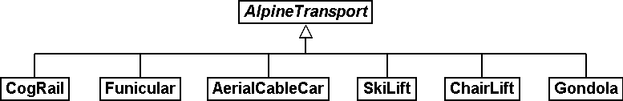

[#_6_2]
=== Types of alpine transport – Modeling of types of objects

For a brief overview it is sufficient to roughly divide alpine transports: Cog rail, funiculars, aerial cable cars, ski lift, chair lifts, gondolas. In the simplest of cases the type would be noted as a text attribute.

[#listing-06_02-01]
.link:#listing-06_02-01[Listing 06.02-01]
[source]
----
CLASS AlpineTransport =
  Name: TEXT*100;
  Kind: TEXT*50;
END AlpineTransport;
----

Consequently people in charge of data input would be very free in their description. Aerial cable car, gondola, ski lift, ski-lift – it is to be feared that a virtual jungle of terms would result. This could be avoided by using an enumeration.

[#listing-06_02-02]
.link:#listing-06_02-02[Listing 06.02-02]
[source]
----
CLASS AlpineTransport =
  Name: TEXT*100;
  Kind: (CogRail,
         Funicular,
         AerialCableCar
         SkiLift,
         ChairLift,
         Gondola);
END AlpineTransport;
----

Since all admissible possibilities have been enumerated, order would have been established. Often it will appear desirable to add further attributes such as the number of available seats on some means of transport. With funicular and aerial cable car this would be the capacity of the entire cabin, with ski and chair lifts it would be the number of persons per single ride. However with a cog rail where several wagons can be hooked up this information would not make sense. Maybe the cog system would be of greater interest. Now should the class AlpineTransport simply feature all attributes needed for the describing of the different kinds?

If the different kinds feature their respective properties (attributes or relationships) it makes sense to define individual classes that inherit from the basic class (cf. <<_5>>).

.CogRail, Funicular etc. are specific types of AlpineTransport. However there is no alpine transport as such: All «concrete» types of alpine transport always belong to one of the sub classes. Hence __AlpineTranspor__t is an abstract class, which in the diagram would be shown by means of italics.

But there are no means of alpine transport that are exclusively alpine transport without at the same time being part of a sub class. Therefore the class AlpineTransport will be declared «abstract». Consequently a concrete means of alpine transport will always have to be a cog rail, an aerial cable car etc.

In the textual notation of INTERLIS 2 abstract classes are pointed out with the indication (ABSTRACT) in brackets. As a side remark: The INTERLIS-units model «Units» features a unit «CountedObjects» for counted objects such as the number of people in a aerial cable car cabin.

[#listing-06_02-03]
.link:#listing-06_02-03[Listing 06.02-03]
[source]
----
CLASS AlpineTransport (ABSTRACT) =
  Name: Text*100;
END AlpineTransport;

CLASS CogRail EXTENDS AlpineTransport =
  CogSystem: (Riggenbach, Abt, vonRoll);
END CogRail;

CLASS Funicular EXTENDS AlpineTransport =
  Capacity: 0 .. 999 [Units.CountedObjects];
END Funicular;

CLASS AerialCableCar EXTENDS AlpineTransport =
  Capacity: 0 .. 999 [Units.CountedObjects];
END AerialCableCar;

CLASS SkiLift EXTENDS AlpineTransport =
  PersonsPerRide: 0 .. 10 [Units.CountedObjects];
END SkiLift;

CLASS ChairLift EXTENDS AlpineTransport =
  PersonsPerRide: 0 .. 24 [Units.CountedObjects];
END ChairLift;

CLASS Gondola EXTENDS AlpineTransport =
  Capacity: 0 .. 99 [Units.CountedObjects];
END Gondola;
----

For the meeting a railway person had been invited especially who then did a lengthy speech on cog rails. All present learnt a lot about what cog systems are in use world-­wide and about their respective advantages and disadvantages. However at the end of the day the people in Ilis Valley asked themselves what, after all, did these cog systems have to do with their project. Nobody could imagine of what possible interest these or other pieces of information would be in a future extension. Thus this model was rejected because it went too much into detail and finally would incur unnecessary costs for the input and maintenance of data.

See also paragraph <<_5_1>> which deals with the temptation to enter into too many details when modeling.

[#_6_3]
