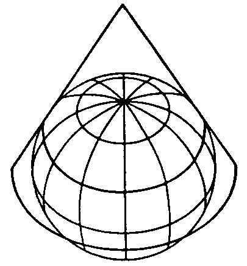
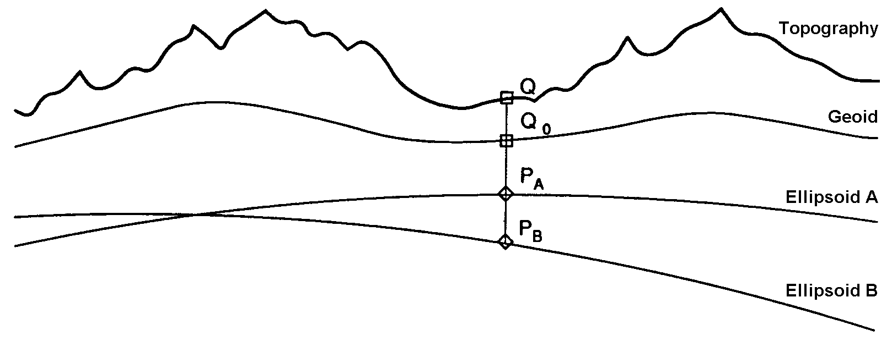
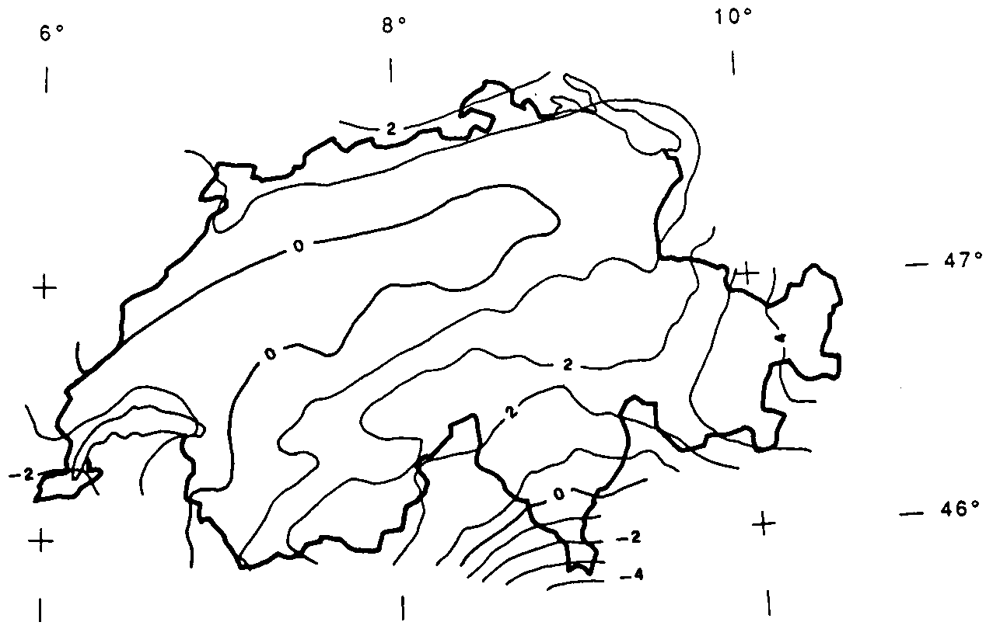

[#_6_7]
=== Where is Ilis Valley? – Coordinate types

[#_6_7_1]
==== General remarks concerning coordinate types

We would link the idea of a place in real world, shaped like a point, with the question «Where?». Such a place can be described by means of a coordinate. Typically such a coordinate is a pair of numbers that describe the position of a place, or a triple that describes position and altitude of a place.

For each dimension of a coordinate type we have to determine, in the same way as with numeric types, in which admissible values may range and what unit they refer to.

[#listing-06_07-01]
.link:#listing-06_07-01[Listing 06.07-01]
[source]
----
Position: COORD 500.00 .. 91000.00 [m],
                 700.00 .. 23000.00 [m];

XPosition: 500.00 .. 91000.00 [m];
YPosition: 700.00 .. 23000.00 [m];
----

At first sight the difference between a position attribute with a coordinate type and one numeric attribute for both X- and Y-direction is minor. Thanks to its definition as a coordinate type it is obvious that these pieces of information belong together. A program package may also exploit this property. For instance many programs are capable of graphic representation of Cartesian coordinate values.

Cartesian coordinate values? Cartesian values are coordinates whose dimensions are perpendicular. Hence the definition of the position coordi­nates above depicts a rectangular window of approx. 90 times 22 kilometers. Does that mean we return to medieval times? Has the earth in Ilis Valley once more become a disc?

[#_6_7_2]
==== The wrapped up plum – What is a coordinate system?

Already Ptolemaeus considered the earth to be a sphere. Surveyors have had to take leave of this view a long time ago, because it simplifies to too great an extent.

A useful approximation of the earth surface is the Ellipsoid, in other words the surface that results when an ellipse revolves around its central axis.

.When an ellipse revolves around its own axis, a flattened sphere results in space. Thanks to such an ellipsoid an approximation of the shape of the earth surface can be attempted. +
image::img/image31.png[] image:img/image32.png[]

(All figures in this paragraph and in paragraph <<_6_7_5>> from: K. Christoph Graf, Verwendung geodätischer Abbildungen bei der Geocodierung von Satelliten-Bildern. Zürich, 1988. Illustrations have been partially simplified. Original sources as stated above).

Depending on the part of the world, different ellipsoids are used, otherwise the approximation would become too imprecise. For instance Switzerland uses the same ellipsoid as Germany, but one slightly different from Sweden or France.

As a spatial formation ellipsoids are somewhat awkward to handle. For this reason surveyors will map the ellipsoid onto a surface. To this intent they will drape a cylinder or cone over the ellipsoid and light it from the interior, thus projecting the picture of the landscape onto the cylinder or cone.

.The ellipsoid is wrapped in a cylinder (left) or cone (right). Then it is lit from the interior.
image::img/image33.png[] 

In the next step the cylinder or cone is cut open with a pair of scissors, rolled out flat on a table – and there goes your map!

.Once the projection has been completed, the cylinder (or cone) is cut open and rolled out. A convex body such as an ellipsoid or a sphere could be cut open but not rolled out flat.
image::img/image35.png[]

At the end the map is superposed with fine perpendicular lines: the *coordinate* *system* of the map. That is why with each coordinate type it has to be determined what coordinate system it is based upon.

[#listing-06_07-02]
.link:#listing-06_07-02[Listing 06.07-02]
[source]
----
Position: COORD 480000 .. 850000.00 [m] {AhlandSys[1]},
                 60000 .. 320000.00 [m] {AhlandSys[2]};
----

The first dimension of the coordinate corresponds to the first axis of the coordinate system by the name of «AhlandSys», the second dimension to the second axis of the same system.

[#_6_7_3]
==== Information concerning the coordinate system – Meta data

Is «AhlandSys» a Cartesian, an ellipsoid system? What are the names of the axes? Are there any common features (e.g. map projections) with other coordinate systems? All this information can be described by means of data. In order to make it clear ho such data is structured, a corresponding data model is formulated for it. Such a model is called meta model, the appertaining data meta data because they serve to describe the actual data.

Data belonging to a meta model are «meta» in another more formal sense an information concerning origin or price (cf. paragraph <<_3_3>>). Unfortunately the same term is commonly used for both of them.

In simple cases here the application range of a data model will make it quite clear what coordinate system the coordinates actually belong to, you may omit the explicit indication of the coordinate system. Nevertheless it does make sense to make at least some sort of mention of the coordinate system in the name of the coordinate type.

[#listing-06_07-03]
.link:#listing-06_07-03[Listing 06.07-03]
[source]
----
NationalCoord = COORD 500.00 .. 91000.00 [m],
                      700.00 .. 23000.00 [m];

Position: NationalCoord;
----

To avoid confusions, the responsible persons of Ilis Valley have given preference to a precise definition:

[#listing-06_07-04]
.link:#listing-06_07-04[Listing 06.07-04]
[source]
----
REFSYSTEM BASKET CoordSystems ~ CoordSys.CoordsysTopic
  OBJECTS OF GeoCartesian2D: AhlandSys;
----

Based upon the general model for coordinate systems (CoordSys), they have presented a precise definition of their national system. For its position they have registered an object of the class GeoCartesian2D with the name of AhlandSys. Within the model the existence of this data entry is referred to by means of OBJECTS OF. Thus the coordinate system AhlandSys becomes available in the model. When applying the system, there is no need to actually mention the name of our stock of meta data (CoordSystems), unless several such stocks of meta data were defined within the current modeling part.

[#listing-06_07-05]
.link:#listing-06_07-05[Listing 06.07-05]
[source]
----
LandesKoord = COORD 500.00 .. 91000.00 [m] {CoordSystems.AhlandSys[1]},
                    700.00 .. 23000.00 [m] {CoordSystems.AhlandSys[2]};
----

[#_6_7_4]
==== Different coordinate systems

In order to offer a special service to those tourists that have a simple GPS-receiver at their disposal, Ilis Valley would like to make their coordinates also available as geographical coordinates in the global WGS84-System.

[#listing-06_07-06]
.link:#listing-06_07-06[Listing 06.07-06]
[source]
----
WGS84Coord = COORD -90.00000 .. 90.00000 [Units.Angle_Degree] {WGS84[1]},
                   0.00000 .. 359.99999 CIRCULAR [Units.Angle_Degree]
                   {WGS84[2]},

CLASS AlpineTransport =
  PosBottomstation: NationalCoord;
  PosBottomstationWGS: WGS84Coord;
  ....
END AlpineTransport;
----

It seems obvious that both attributes are directly related. Projection coordinates can be converted into WGS84-coordinates. However it is not up to the conceptual description of data to render a detailed definition of such a conversion. Nevertheless it would be desirable to indicate that it is possible to calculate one set of coordinates from the others.

[#listing-06_07-07]
.link:#listing-06_07-07[Listing 06.07-07]
[source]
----
!! Conversion of coordinates from the Ahland projection system to WGS84.
!! Functions will be discussed in paragraph 7.2
FUNCTION AhlandToWGS84 (Ah: Ahland.NationalCoord): WGS84Coord;

CLASS AlpineTransport =
  PosBottomStation: Ahland.NationalCoord;
  PosBottomStationWGS: WGS84Coord := AhlandToWGS84 (PosBottomStation);
  ....
END AlpineTransport;
----

[#_6_7_5]
==== Three dimensional coordinates

Of course projection coordinates are not enough for the skiers and hikers around the  Ilis. Big differences in altitude delight the skiers, while hikers will either fear perspiration or shaking knees. Altitudes definitely are sought after! That is why coordinate types may also display three dimensions.

[#listing-06_07-08]
.link:#listing-06_07-08[Listing 06.07-08]
[source]
----
NationalCoord3 = COORD 500.00 .. 91000.00 [m] {AhlandSys[1]},
                       700.00 .. 23000.00 [m] {AhlandSys[2]}
                       0.00 .. 9000.00 [m] {AhlandHeightSys[1]};

WGS84Coord = COORD -90.00000 .. 90.00000 [Angle_Degree] {WGS84[1]},
                   0.00000 .. 359.99999 CIRCULAR [Angle_Degree]
                   {WGS84[2]},
                   -2000.00 .. 9000.00 [m] {WGS84H[1]};
----

With altitudes an exceptional problem occurs. Where in fact would altitude 0 be situated? How can the altitude of any point be determined in relation to this altitude 0? Surveyors differentiate mainly between the altitudes according to the gravity field of the earth (gravity or geoid height; 0 being the altitude of the imaginary continuation of the sea below the continents) and altitudes according to the geometrical approximation of the earth (ellipsoid height; 0 being the surface of the ellipsoid).

.The gravity field of the earth: With the geoid the surface of the oceans is mentally continued under the continents. Mountain ranges, trenches etc influence the gravity field and thus alter the imaginary surface of the water. This drawing is quite exaggerated.
image::img/image36.png[]

.Depending on the reference system selected point Q will have a different altitude.

Typically projection coordinate systems will use geoid heights. That is why the third dimension of projection coordinates does not simply refer to the third axis of the projection system but to the first axis of a special height system.

In contrast coordinates in GPS-measurements are determined purely geometrically from satellite positions without taking into account the gravity field of the earth. Hence WGS84-altitudes are ellipsoid heights.

 +
.There may be a difference of several meters between the gravity height and the geoid height. Above you see the difference between the commonly used ellipsoid of Switzerland and the one of France and former West Germany.
image::img/image39.png[] image:img/image40.png[]

The conversion between gravity heights and ellipsoid heights may pose a problem wherever the range of admissible coordinates extends over an area whose gravity field no longer is homogenous. Luckily these questions are of minor importance when modeling. Nevertheless they are worth a quick reflection.

[#_6_8]
