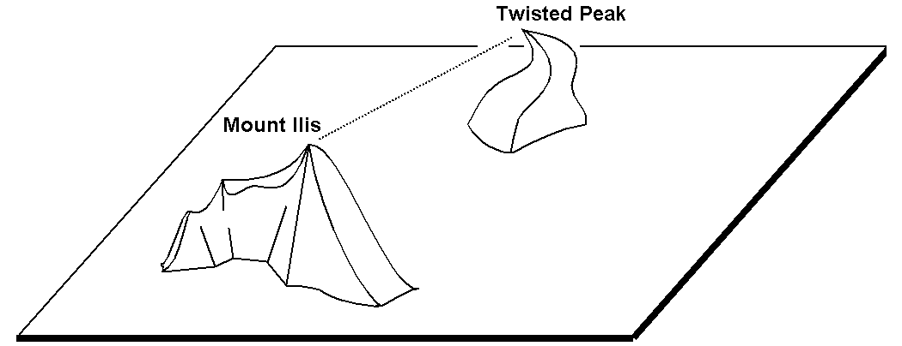
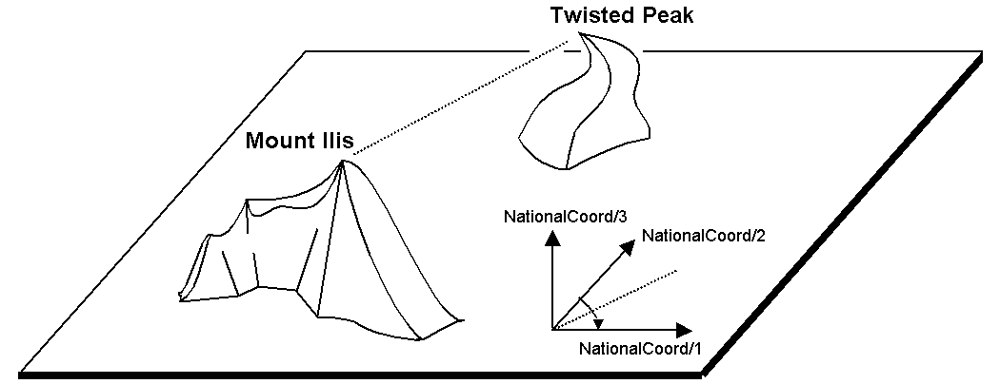

[#_6_8]
=== Is zero up north? – Definitions for angles and directions

How big is a right angle? 90 Degrees or Pi / 2? This is a question of the unit in use. But when is the angle considered positive, when negative? Consequently the sense of rotation belongs to every type of angle: clockwise or counter clockwise.

[#listing-06_08-01]
.link:#listing-06_08-01[Listing 06.08-01]
[source]
----
DOMAIN
  AngleClockwise = -179 .. 180 CIRCULAR CLOCKWISE;
  AngleCounterClockwise = -179 .. 180 CIRCULAR COUNTERCLOCKWISE;
----

Standing on Mount Ilis we might want to know in which direction we have to look in order to see Twisted Peak. 50 degrees? 40 degrees? 310 degrees?

.Whoever climbs Mount Ilis will be rewarded with a spectacular view of the surrounding mountains. +

But in what angle will the Twisted Peak come into view? Unless we know what coordinate system the question refers to, it is impossible to offer an answer.

It all depends on the zero direction and how directions rotate. Whenever we speak of directions we also have to mention a reference system. That is why directions are closely linked with coordinate types. After all it also makes sense to determine the distance and direction of two points defined by coordinates.

.The indication of axes and rotation is part of the definition of a coordinate system.

[#listing-06_08-02]
.link:#listing-06_08-02[Listing 06.08-02]
[source]
----
NationalCoord = COORD 500.00 .. 91000.00 [m] {AhlandSys[1]},
                      700.00 .. 23000.00 [m] {AhlandSys[2]},
                      -200.00 .. 14000.00 [m] {AhlandHeightSys[1]},
                      ROTATION 2 -> 1;

Direction = 0.0 .. 359.9 CIRCULAR [Angle_Degree] {AhlandSys};
----

[#_6_9]
