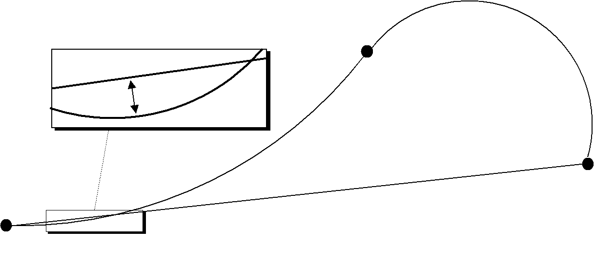
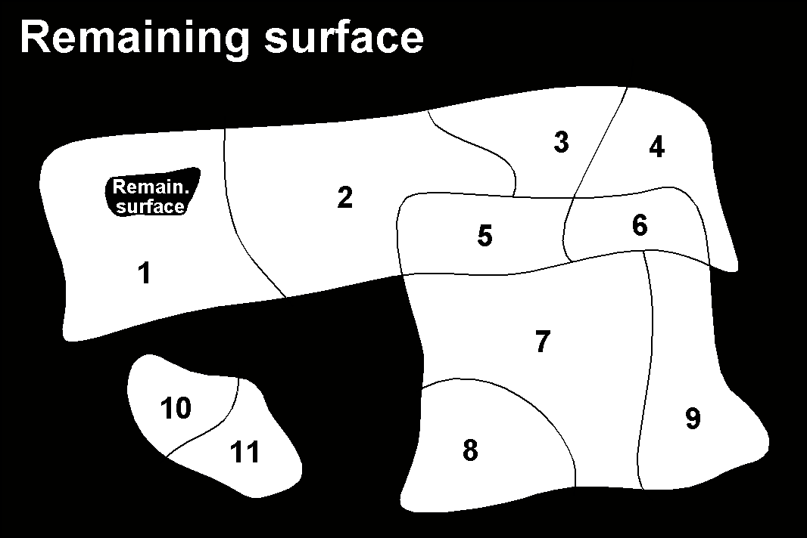

[#_6_9]
=== Is a ski run a line or a surface? – Geometry types

[#_6_9_1]
==== Simple conceptual view of a line

From the skiers' view point everything is clear: They want to know where a run starts, where it ends and roughly where it goes through. Is there a pub somewhere along the way? Does the run go over open hills or through a forest? For such information it is enough to describe the ski run as a line.

To begin with you may imagine a line type to be exactly what the word says: A more or less complicated connection between two points.

In this sense a line type is nothing but a numeric type or even better a coordinate type. Since all points concerned with this line have to be described by means of coordinates a line type will of necessity always have to be linked to a coordinate type.

In INTERLIS we could write:

[#listing-06_09-01]
.link:#listing-06_09-01[Listing 06.09-01]
[source]
----
AhlandLine = POLYLINE VERTEX Ahland.NationalCoord;

CLASS SkiRun =
  Course: AhlandLine;
END SkiRun;
----

The ski run is described by means of lines that are based upon the Ahland projection coordinate system. Thus the vertices of the lines in the Ahland reference system rely on the coordinate type of the reference system.

[#_6_9_2]
==== Segments

It is obvious: The ski run from Mount Ilis to Ilis Rock is a complicated line. In comparison the ski runs by the pony lifts are relatively simple. Could they all be described with the same type? The solution lies in breaking up the line as a whole into individual segments. Each segment itself is a simple geometry (e.g. a straight, part of an arc) and connects to its predecessor.

This state of matters could also be represented in the conceptual model. Then again this would be an unnecessary burden. Once it has been stated that lines are always structured in this way, this need no longer be displayed.

.The course of a ski run is a line. It consists of individual segments that can be of various types: straight segments, arc segments, etc.
image::img/image43.png[]

It definitely makes sense to indicate which types of segments may occur with one specific line type.

[#listing-06_09-02]
.link:#listing-06_09-02[Listing 06.09-02]
[source]
----
AhlandLine = POLYLINE WITH (STRAIGHTS, ARCS) VERTEX Ahland.NationalCoord;
----

This INTERLIS 2-definition indicates that lines of this type may feature straights and arcs.

In many cases – and it is the same with ski runs – it does not make sense if a line intersects itself. Such restrictions also belong to the conceptual model. However because of minor imprecision in the course of surveying (and partially also when computing) it is possible that a form that is actually without overlaps does end up with slight overlaps. Hence a maximum of an admissible overlap is part of the model.

Since the Ahland projection coordinate system uses meters, this defini­tion permits overlaps up to 2 cm:

[#listing-06_09-03]
.link:#listing-06_09-03[Listing 06.09-03]
[source]
----
AhlandLine = POLYLINE WITH (STRAIGHTS, ARCS)
             VERTEX Ahland.NationalCoord
             WITHOUT OVERLAPS > 0.02;
----

.Sometimes small overlaps cannot be omitted. It is part of the model

to define the maximum overlap (in this figure the height of arrow).

[#_6_9_3]
==== Directed lines

Of course any skier would expect the segments of the ski run from Mount Ilis to Ilis Rock to start at Mount Ilis and to end at Ilis Rock. After all the idea is to go downhill and not to climb up a slope! Then again for the description of other objects (e.g. hiking paths) direction is of no importance. Whenever the direction of lines is important this should be shown in the conceptual model.

[#listing-06_09-04]
.link:#listing-06_09-04[Listing 06.09-04]
[source]
----
AhlandLineDirected = DIRECTED POLYLINE VERTEX Ahland.NationalCoord;

CLASS SkiRun =
  Course: AhlandLineDirected;
END SkiRun;
----

[#_6_9_4]
==== Surfaces

For the maintenance service of the Mount Ilis Alpine Transports the question arises whether the description of the ski runs fulfils their demands. In order to clarify which of the areas have to be prepared a presentation in the form of a surface seems preferable.

[#listing-06_09-05]
.link:#listing-06_09-05[Listing 06.09-05]
[source]
----
DOMAIN
  AhlandLineDirected = DIRECTED POLYLINE WITH (STRAIGHTS, ARCS)
                       VERTEX Ahland.NationalCoord;

  AhlandSurface = SURFACE WITH (STRAIGHTS, ARCS)
                  VERTEX Ahland.NationalCoord;

CLASS SkiRun =
  Course: AhlandLineDirected;
  Prepared: AhlandSurface;
END SkiRun;
----

Just before Ilis Rock a big tree stands in the middle of the ski run – in other words the ski run passes on either side of the tree.

.There is a big tree in the middle of the ski run. This might prove to be quite tricky for skiers, but we need not worry about the data model: Despite this the ski run will remain one whole surface.
image::img/image45.png[]

Is the surface that has to be prepared still one whole surface? Surface – at least in the sense of INTERLIS – always means coherent areas. Even if they have interior blank spaces (holes, enclaves), they remain coherent areas and thus can be described as surfaces.

[NOTE]
A surface has exactly one *outer boundary*. It may possess none, one or several *interior boundaries* (enclaves).

At the very top of the Mount Ilis several ski runs are that close that as a result there is one common prepared surface. Now which part of this surface should be assigned to which ski run? In Ilis Dale two ski runs cross. Hence this surface is gathered twice which of course interferes when trying to evaluate the precise amount of work involved in preparing these ski runs.

That is why the maintenance service has decided to use a different form of modeling: instead of assigning the surfaces that are to be prepared directly to the ski runs, they are considered as independent segments of a ski run. Each segment is a surface. However these segments should never overlap, since one particular area will only have to be prepared once.

[#listing-06_09-06]
.link:#listing-06_09-06[Listing 06.09-06]
[source]
----
DOMAIN
  AhlandTessellation = AREA WITH (STRAIGHTS, ARCS)
                       VERTEX Ahland.NationalCoord;

CLASS ConditionOfSkiRun =
  PreparedSurface: AhlandTessellation;
END ConditionOfSkiRun;
----

Because such surfaces without overlaps are quite common, INTERLIS has introduced its proper type (AREA). Instead of surfaces we speak of (planar) tessellation.

.With the ordinary type of surface (SURFACE, left) surfaces of different objects may overlap. For instance there is nothing to stop one piece of land to belong to two ski runs. In the case of a tessellation (AREA, right) it is required that each point within the land be assigned unequivocally to one object, unless it were to belong to the remaining surface (shown in black); one example being the segments prepared by the maintenance service.
image::img/image46.png[] 

[#_6_9_5]
==== Three-dimensional line types

If a coordinate type belonging to a line definition is a three-dimensional type, then the line type also is three-dimensional. INTERLIS 2 does without stating the third dimension as equal besides the other two, because in geographical applications all three dimensions can always be subdivided into the position and information on height.

[NOTE]
INTERLIS 2 supports lines with 2.5 dimensions.

Thereby we proceed on the assumption that each vertex point between two segments is defined by its position and height and that the height on the segment will be subject to a linear interpolation according to the length of the segment.

.INTERLIS supports 2.5-dimensional lines: The Height between two vertexes is always subject to a linear interpolation. If at a given point on the ground a quarter of the distance between C and D has been covered, we assume that at the same time a quarter of the difference in altitude has been conquered.
image::img/image48.png[]

Now shouldn't we model the course of a ski run with a three-dimensional line type? From a purely technical point of view this would pose no problem, and after all elevation plays an important part in skiing. On the other hand the altitude of the course is no independent figure: Where the position is known, the height is a logical result of the terrain features. Thus we can calculate the elevation of the course of the ski run from its position and a topographical model. Hence from a conceptual point of view we prefer to do without the information on height when dealing with the course of a ski run.

The case may be different for roads and railways because with bridges and tunnels height and terrain height may not be the same. In some cases a degree of precision will be demanded for the height that renders a derivation from a topographical model impossible. In certain cases it may make sense to model artificial constructions (with height) independently of the course of a track. In such a case the actual height of the track within the range of artificial constructions would be computed from the model; at other places we would rely on the topographical model.

With this issue a decisive criteria would be the expenditure for collection and update.

[#_6_10]
