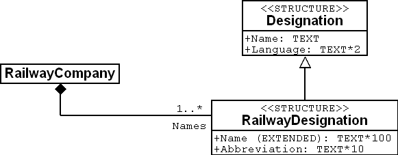
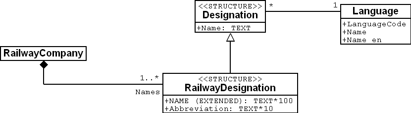

[#_6_11]
=== What languages are spoken in Ilis Valley? – Multilingualism

[#_6_11_1]
==== One attribute per language

In the existing model a railway company has got one name and an abbreviation. How can we then collect the information that the Mount Ilis Alpine Transports (MIT) in German are called _Ilishornbahnen (IhB)_?

It seems natural to supplement the object class RailwayCompany with the German name and its abbreviation:

.The object class RailwayCompany with names and abbreviations, +
image::img/image49.png[]

in German and French respectively.

So much for that. But what, if at a later time somebody came up with the idea to gather the name in a third, fourth or even fifth language? Basically no problem – it would only mean a minor alteration in the data model!

[WARNING]
As a matter of fact it is no big deal to enlarge a little box on a piece of paper and to add a few lines. However once the computer system has been realized, even such a small alteration may turn out to be quite costly: application forms have to be changed, programs need to be adjusted, data have to be gathered again, etc.

[#_6_11_2]
==== Language dependent terms as structure elements

Hence it would be preferable not to state a concrete language in the data model. In the following new version one railway company displays a set of designations. As it is a common requirement to deal with several languages, the structure RailwayDesignation will inherit the basic structure designation, itself comprising the language and a text.

[source]
----
STRUCTURE Designation =
  Name: TEXT;
  Language: TEXT*2;
END Designation;

STRUCTURE RailwayDesignation EXTENDS Designation =
  Name (EXTENDED): TEXT*100;
  Abbreviation: TEXT*10;
END RailwayDesignation;

CLASS RailwayCompany =
  Names: BAG {1..*} OF RailwayDesignation;
END RailwayCompany;
----

Or in a graphic representation:

.Railway designations are assigned to one railway company. Since one company may possess several names it is possible without further expenditure to add new names in different languages. Details of this assignation (indications such as 1..*or a filled-in square) will be explained below in connection with relationships.

[WARNING]
Remember that every text attribute is not necessarily multilingual. For instance family names of persons are not translated.

When adding designations in another language, it is sufficient to gather new data. There is no need to adjust the data model.

[#_6_11_3]
==== Structure elements may refer to objects

Who would know the official language abbreviation for Romantsch? rr? rm! Within the scope of the National Tourist Office it is obvious which languages are in consideration for the designations of railway companies. In most cases when collecting data of one line, only one abbreviation has to be taken into account. This is not difficult to retain and hence the National Tourist Office has built its model as described above.

If this were not the case, a model would have been chosen where languages would feature as actual objects. Then the language object would contain both abbreviation and e.g. name as a text in their own language and in English.

.In this variant the language designation (a structure) refers to the language (a normal object class).

Thus the designation refers to the language. However this reference is not a full relationship (cf. paragraph <<_6_13>>), since these designations have no identity. Consequently from the point of view of a language object there is no direct access to the designation elements. This would first have to be established by means of a view (cf. paragraph <<_6_17>>).

[#_6_12]
