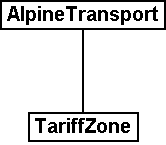
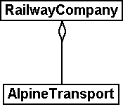

[#_6_13]
=== Tariff zones, reports on conditions – Relationships

[#_6_13_1]
==== Roles

What exactly is a railway company for one particular alpine transport? Proprietor? Operator!

In the relationship between RailwayCompany and AlpineTransport the railway company fulfils the role of operator.

In the graphic representation the role name appears at the end of relationship line on the side of the holder of the role. However if it is no different from the class name, then in most cases the role name is omitted.

[source]
----
ASSOCIATION =
  Operator -- {1} RailwayCompany;
  Railway -- {*} AlpineTransport;
END;
----

Figure 48: According to this model it is possible to inquire after the operator of an AlpineTransport. «Operator» is a _Role_ that the class «RailwayCompany» holds in view of the class «AlpineTransport». Below this relationship between RailwayCompany and AlpineTransport is rendered in INTERLIS notation.

It is quite common to select role names that do not differ from the class name. For instance in the relationship AlpineTransport – TariffZone there is little sense in introducing further names. Nevertheless the need for additional names is quite obvious if a relationship exists between objects of the same class. We might like to display the fact that one company owns other railway companies as subsidiary companies.

[source]
----
ASSOCIATION =
  Daughter -- {*} RailwayCompany;
  Mother -- {0..1} RailwayCompany;
END;
----

Figure 49: A railway company may be parent company but also subsidiary of another railway company. In such cases the class name is not suitable as role name. This example is displayed on the left the graphic notation of UML, on the right in the textual notation of INTERLIS.

[#_6_13_2]
==== Force of a relationship

Association, Aggregation and composition express the difference in force of relationships.

* *Association* – The relationship between tariff zone and alpine transport is rather loose. Two objects are linked without being sub-ordinate to the other. An association is a relationship between equals. Very often in a data model the greater number of relationships are common associations.
* *Aggregation* – An alpine transport is a rather independent object. Yet there always has to be a railway company to run it. The railway company is always superior to the alpine transport.
* *Composition* – A very close relationship exists between an alpine transport and its pylons. In actual fact a pylon only makes sense in connection with a certain alpine transport. A composition is relationship between a whole and its (mainly physical) parts.

It is not always easy to classify according to these forces. From the view point of IT there are other rules, which sometimes will simplify this decision:

* *Delete* – If a railway company is deleted this will means that the assigned alpine transports are now without a manager. However if an alpine transport is deleted, all pylons will also be deleted. Deleting a whole also means removing all its parts that are connected via a composition.
* *Copy* – If we copy a railway company (in real life of course not as simple as on the computer), we will at the same time establish copies of all assigned alpine transports which then will be assigned to the new railway company. Accordingly copies of all the pylons are established for each of these alpine transports. Copying an object also means duplicating all those objects assigned by a common association.

.Association (left), aggregation (middle) and composition (right) are different types of relationships. They differ in their binding force: A Pylon is so closely tied to its AlpineTransport that it can be considered a part of it. In comparison with a composition, both association and aggregation are weaker.
  image:img/image57.png[]

The INTERLIS notation is copied from the graphic representation. However the role name has to be written even if does not differ from the class name.

[source]
----
ASSOCIATION =
  AlpineTransport -- AlpineTransport;
  TariffZone -- TariffZone;
END;

ASSOCIATION =
  Operator -<> RailwayCompany;
  AlpineTransport -- AlpineTransport;
END;

ASSOCIATION =
  AlpineTransport -<#> AlpineTransport;
  Pylon -- Pylon;
END;
----

[#_6_13_3]
==== Relationships with attributes

Various ticket types entitle to a ride on alpine transports run by different railway companies. This brings us to the question how the proceeds of the ticket sale should be divided amongst these companies. For instance the national general yearly season ticket also entitles its owner to rides on the Mount Ilis Alpine Transports. Based on an agreement the Mount Ilis Alpine Transports receive 0.13% of the turnover a general yearly season tickets in return.

Relationships can also feature attributes and hence have the nature of special classes.

[source]
----
ASSOCIATION Quota =
  Participant -- {*} RailwayCompany;
  TicketType -- {*} TicketType;

  ATTRIBUTE
    Quota: 0.00 .. 100.00 [Units.Percent];

END Quota;
----

Figure 51: A RailwayCompany has a predetermined Quota in the profits from the sale of a particular TicketType. The percentage agreed upon is neither a characteristic of the railway company nor of the TicketType. Instead we deal with a characteristic of their relationship. Such situations are modeled with relationship classes.

[#_6_13_4]
==== Multiple relationships

In order to gain a better overview of all the ticket sales, the National Tourist Office would like to record in the future which ticket counter has sold how many of one ticket type in which season.

[source]
----
ASSOCIATION Sale =
  TicketCounter -- {*} TicketCounter;
  Season -- {*} Season;
  TicketType -- {*} TicketType;

  ATTRIBUTE
    Number: 1 .. 999999 [Units.CountedObjects];
    Amount: 0.00 .. 9999999.99 [Ahland.Sovereign];

END Sale;
----

Figure 52: The Sale is captured per TicketCounter, TicketType and Season. We deal with a multiple relationship between three equal partners (the classes TicketCounter, TicketType and Season). In contrast «Sale» is a relationship class, which captures characteristics of the relationship (e.g. the number of tickets sold as well as the amount).

Thus there is an equal relationship between ticket counter, ticket type and season, which also captures in the form of attributes the number of tickets sold plus the turnover. So this relationship does no longer link two but three classes.

So then what do the indications of cardinality exactly mean in multiple relationships? Cardinality e.g. with the season (*) means that for a particular combination of ticket type and ticket counter there may be any number of assignations to season objects. Were we to indicate cardinality 1, then a certain ticket type could only be sold for one season by one specific ticket counter.

Slightly complicated. Do we really need multiple relationships or could we reduce them to the common one-to-one relationships?

.Relationships between more than two parties can be reduced to common one-to-one relationship. The former relationship class (in this instance: Sale) becomes an equal partner and now all the parties concerned are only related to the former relationship class.
image::img/image60.png[]

However this model will express less clearly the fact that the three classes TicketCounter, TicketType and Season are related as a group of three.

[#_6_13_5]
==== Directed relationships

Looking at all the alpine transports assigned to the company Mount Ilis Alpine Transports, we observe that there is no certain order. The question whether in an assignation an aerial cable car should appear before or after the gondola does not really make sense.

Of course we could list all means of transport of one company in alphabetical order.

But this sorting would not be a characteristic of the relationship between company and alpine transport but merely a question of representation. Under different circumstances a sorting according to investment costs, travel time etc. could be interesting.

But wouldn't it make sense if this list captured the order in which the relationships were established? To start with the aerial cable car was inaugurated, then the ski lift, followed by the gondola etc. Then again in this case it would be better to supply the relationship with the attributes establishment and closure. Then it would even be possible to record the different managers in the course of time. So in this case it would no longer make sense to consider the relationship as an aggregation.

.To record the order in which alpine transports of one company have started operating, we could use a directed relationship. However the model in the figure below is better.

.The model with a relationship class is clearer because it will permit further evaluations. For instance it allows the sorting of one company's means of transport according to their shutdown and a computer program may display past managers of one alpine transport.
image::img/image62.png[]

Similar considerations apply to the relationship between alpine transports and pylons. By putting in order this relationship we could express the succession of bottom to top station. But from the conceptual point of view it is preferable to introduce a position attribute with a pylon and then to derive the succession from this position and the course of the track.

[WARNING]
Before declaring a relationship ordered, consider carefully whether the order could not be derived from attributes of classes concerned or from the relationship itself.

So where do ordered relationships really make sense? The gondola from Ilis Bath to Mount Ilis has individual gondolas that are not mounted fixedly on the cable. They can be taken off at either the bottom or top station and, when needed, be replaced. At present which gondolas are mounted in which order on the cable?

.Gondola cabins may have numbers but these will not determine their order on the cable. In this instance an ordered relationship makes sense.
image::img/image63.png[]

For once order is of interest. The number of a gondola cannot be used for establishing order. It simply identifies one specific gondola. It has nothing whatsoever to do with their current order on the cable.

[#_6_13_6]
==== Extending relationships

A railway company is related to a number of persons. Some are employed by it, others have quotas in it. Analogous to the different kinds of alpine transports there are various possibilities for modeling.

One possibility consists of defining two different relationships between railway company and persons: one for employment, one for participation. In case occasionally this differentiation should not be of interest (perhaps when sending little chocolate trains before Christmas), an application would have to concern itself with both relationships.

.A Person may be employee and/or shareholder of a RailwayCompany as modeled above with two different relationships. Should the RailwayCompany intend to treat either of them to a Christmas surprise, both relationships would have to be evaluated.
image::img/image64.png[]

Another possibility of modeling would consist in primarily defining a relationship (contact), which then would be extended into employment or participation. As long as the type of contact person – railway company is irrelevant for an application, it uses the contact-relationship and consequently obtains everybody that in some way has contact with the company. An application where only employees are relevant would use the extended relationship Employment and thus would only obtain employees.

.In this variant the relationship between RailwayCompany and Person is modeled in a general way with the relationship class «Contact», Employment and Shareholding are special cases of a contact. Whoever inquires after the contacts of a company will automatically also obtain employees and shareholders. Hence in a similar way as object classes relationship classes can be extended, which in the diagram is shown by a white arrow.
image::img/image65.png[]

This employment-relationship could be further extended and for instance a relationship «Management» could be introduced.

.The relationship between a RailwayCompany and its managing director («Management») is a special case of the relationship «Employment».
image::img/image66.png[]

Extensions of relationships often go hand in hand with the extension of object classes. Instead of stating right from the beginning that an alpine transport possesses pylons, to start with we only speak of rolling stock. These would be loosely assigned, i. e. by association to the means of transport. Since pylons are an important feature of different kinds of alpine transport, the class «AlpineTransportWithPylons» will be introduced. This class will have a relationship with the pylons. However it will be introduced as an extension of the relationship between alpine transports and rolling stock. Since pylons – opposed to a vehicle – directly belong to an alpine transport, this relationship becomes a composition. Note that in an extension the force of a relationship can only be strengthened but not loosened, so as not to contradict the definition in the basic definition.

.AlpineTransport and RollingStock lead a general relationship, strengthened into a composition by specialized classes.
image::img/image67.png[]

[#_6_13_7]
==== Derivable relationships

If your stomach rumbles, you tend to go for a ski run that passes a hotel. This does not mean that ski runs and hotels necessarily have to be on a constant, explicit relationship. It is enough to know that there is a hotel near the ski run. A statement that can be derived from the position of the hotel and the course of the ski run (both in projection coordinates)

[WARNING]
Not everything belonging together within the scope of evaluations necessarily needs to be linked by relationships. Especially with spatial data coordinates are an ideal tool to establish connections when needed.

There is no point either in adding all derivable relationships to the conceptual model. Consequently you will not find the derivable relationship between hotels and ski runs in the conceptual model.

[WARNING]
In a conceptual model we only want to describe those implicit relationships that are of conceptual importance. In addition programs can establish further relationships by skilfully comparing attributes of the objects (not least of all according to their position).

Not least of conceptual importance are relationships that in some cases have to be defined explicitly and in other cases can be derived. Their derivation may depend on the geography or other characteristics. For instance Ilis Valley has introduced a special tariff zone described as a surface which comprehends all alpine transports whose bottom and top station lie within this surface.

[source]
----
CLASS TariffZoneInRegion EXTENDS NatTour.TicketsZone =
  Area: AhlandSurface;
END TariffZoneInRegion;
----

The relationship between this special tariff zone and the alpine transports in the corresponding tariff zone can be automatically established by means of views (cf. paragraph <<_6_17>>).

[#_6_14]
