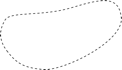
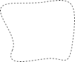

[#_6_17]
=== Tariff zones are of no interest – Views

[#_6_17_1]
==== General remarks

If within the scope of modeling we speak of views of course we do not think of the view from Mount Ilis with its spectacular sight of Twisted Peak. But nevertheless here are some similarities between the two types of views. On the topographical map we find Mount Ilis, Twisted Peak and all the other mountains, valleys and villages, their altitude being illustrated by means of numbers and contour lines. The map does not show the view from Mount Ilis as such. But it does contain all necessary information that will allow a practiced map-reader to derive the view from Mount Ilis. Studying the map, it becomes clear that the peak that can be seen to the left of Twisted Peak, must be the «Black Tooth».

In analogy object classes, structures and relationships of a model correspond to a map. They are appropriate replicas of reality without predefining a specific purpose. The views of a model correspond to the view from Mount Ilis. They serve a certain purpose. To that end they refer to fundamentals or other views and convert them in such a way that the purpose may be served as well as possible.

But then why should such views be part of the model? We do not want to anticipate in the model whether the view should be enjoyed so to speak from Mount Ills, Twisted Peak, the Black Tooth or from the spa in the garden of the kurhaus.

Above all for special consistency constraints (cf. paragraph <<_6_14_3>>) and or derivable relationships (cf. paragraph <<_6_13_7>>) views will make sense even within the scope of the model. But views are also helpful when processed data for a specific purpose have to be supplied, for instance in the case of the data transfer to the Ilis Valley web service. Moreover INTERLIS 2 offers you the possibility to define graphics. In many cases such graphic definitions will not be based upon original data but upon views.

[NOTE]
*Views* are built upon object classes or other views and combine in different ways primary objects into new view objects.

The views of INTERLIS can be compared with the views of data base systems.

[#_6_17_2]
==== The formation law of views

Every detail of the course of a track may not be interesting, but its entire length definitely is. With persons we may sometimes be more interested in their age than in their year of birth. These characteristics can be derived from others. If such «redundant» characteristics were collected as normal data they would be more than liable to be out-dated. After all a person's age changes every year!

[NOTE]
The most essential characteristic of a view is its *formation law*. It determines how derived view objects will be created from primary objects.

For instance the view «PersonWithIndicationOfAge» is derived from the object class «Person» the so called basis. One individual PersonWithIndicationOfAge will possess the same characteristics (ALL OF) with exactly the same values as the original person. In addition the view supplements one more characteristic «Age». The age results from (:=) the difference between year of birth and current year.

[#listing-06_17-01]
.link:#listing-06_17-01[Listing 06.17-01]
[source]
----
VIEW PersonWithIndicationOfAge
  PROJECTION OF Person;
=
  ALL OF Person;
  Age: 0 .. 150 [y] := Difference (Person -> YearOfBirth,
                                    PARAMETER CurrentYear);
END PersonWithIndicationOfAge;
----

In this example there is exactly one virtual view object for each object, in other words a corresponding PersonWithIndicationOfAge for every person.

[NOTE]
The most simple formation law of a view is the *projection (PROJECTION)*. It is built upon the basis, accepts individual (or even all) attributes in any order and can add other, derived attributes. Hence its main purpose is to put attributes of already existing objects into a user-friendly form.

The National Tourist Office has defined an abstract class «TariffZone». In Ilis Valley however they do not want to list individually which alpine transport belongs to which tariff zone. Instead they have limited tariff zones that are described with the class «TariffZoneInRegion». This class is a characteristic «Zone» for the geographically limited tariff zone of validity.

A means of transport whose bottom and top station lies within the area of such a spatial zone automatically accepts its tickets.

.Which alpine transport is situated in the area of which tariff zone? People in Ilis Valley are interested in any pair of alpine transport At and ZoneInRegion Z which comply with two conditions: The bottom station of At must lie within the area Z, and the top station of AT must also lie within the area of Z.
image::img/image69.png[]

But now which alpine transport actually does lie within the area of which tariff zone? By taking recourse in a view this connection between alpine transport and tariff zone can also be derived.

[NOTE]
Possibly the most important formation law of a view is the *join (JOIN)*. It combines several basic objects into a view object. Especially as a basis for derived relationships the join is of major importance.

[#listing-06_17-02]
.link:#listing-06_17-02[Listing 06.17-02]
[source]
----
VIEW AlpineTransportsInRegion
  JOIN OF At ~ AlpineTransport,
          Z ~ TariffZoneInRegion;
  WHERE InSurface(At -> PosBottomStation, Z -> Region) AND
        InSurface(At -> PosTopStation, Z -> Region);
  =
END AlpineTransportsInRegion;
----

To start with by introducing a join all possible pairs are formed. Each object of the class AlpineTransport is joined to every object of the class TariffZoneInRegion to form a virtual view object.

By introducing the WHERE-part the set of all view objects is reduced to those that comply with both conditions. Hence we are left with those pairs of alpine transport At and tariff zone Z where bottom and top station of At lie within the area of Z. In the figure above with six possible pairs (three alpine transports x two tariff zones) four pairs comply with this condition.

[width="65%",cols="^32%,^21%,^47%",]
|===
|Alpine transport _At_ |Tariff zone _Z_ |Bottom and top station of _At_ +
in the area of Z?
|image:img/image70.png[] | |yes
|image:img/image72.png[] | |yes
|image:img/image73.png[] | |no
|image:img/image70.png[] | |no
|image:img/image72.png[] | |yes
|image:img/image73.png[] | |yes
|===

Figure 63: Looking at all combinations of alpine transport _At_ and tariff zone _Z_ +
in the last figure, we realize that with only four pairs out of six +
bottom and top station of _At_ lie in the area of _Z._

In a last step we decide in a projection which characteristics the view objects should possess and how their values are determined. In the INTERLIS-definition above the part after the equation mark is used to that purpose.

If there is no tariff zone that corresponds to one particular alpine transport, then it will not appear in that view. By introducing a special join (a so-called «*Outer Join*») we require that a view object should exist even if there is no corresponding tariff zone for one alpine transport. Then again with regard to the concrete application of alpine transports and tariff zones this will hardly make sense.

If we should wish to have a register of all coordinates of bottom and top station we are confronted with the fact that these coordinates are captured as individual attributes of the alpine transports. By using a *union (UNION)* they can be gathered into a set of equal view objects.

[#listing-06_17-03]
.link:#listing-06_17-03[Listing 06.17-03]
[source]
----
VIEW StationCoordinates
  UNION OF BottomStation ~ AlpineTransport, TopStation ~ AlpineTransport;
  =
    Coordinates: Ahland.NationalCoord := BottomStation -> PosBottomStation,
                                          TopStation -> PosTopStation;
END StationCoordinates;
----

Here the set of all view objects equals the double set of all alpine transports. Once they are evaluated under the aspect of bottom station, and once under the aspect of top station. The attribute is selected according to the position attribute of either bottom or top station.

*Aggregation (AGGREGATION)* and *inspection (INSPECTION)* deal with structure attributes. An aggregation unites objects that have the same characteristics into one single object. Within the scope of the view object already existing objects are available as elements of a structure attribute (cf. paragraph <<_6_17_3>>). On the other hand an inspection makes sure that structure elements become independent view objects (cf. paragraph <<_6_14_3>>).

[#_6_17_3]
==== Building views step by step

In order to check tickets, every alpine transport has to know what ticket type is valid. So they would still like a list of all alpine transports that indicates for every line which ticket types are valid. Independently of all basic data they would like to define something like the following model:

[#listing-06_17-04]
.link:#listing-06_17-04[Listing 06.17-04]
[source]
----
CLASS TicketType =
  Names: BAG {1..*} OF Designation;
  Price: 0.00 .. 5000.00 [Ahland.Sovereign];
  Validity: LengthOfTime;
END TicketType;

CLASS AlpineTransport =
  Names: BAG {1..*} OF Designation;
  ValidTicketTypes: BAG OF TicketType;
END AlpineTransport;
----

But how can this be derived from the original data? This is not quite as simple. Several tariff zones can be assigned to one alpine transport; then again several ticket types are assigned to one tariff zone. Furthermore there are tariff zones, which comprise all alpine transports within one area.

Luckily this last aspect has already been dealt with because there is an abstract relationship between alpine transport and tariff zone, «Validity». On the one hand it is realized by means of an explicit relationship between the two classes («ValidityExplicit»). On the other hand we can derive from the view «AlpineTransportsInRegion» which lines on grounds of their position accept the tickets of one tariff zone.

On this basis we can define a view which links alpine transports and ticket types:

[#listing-06_17-05]
.link:#listing-06_17-05[Listing 06.17-05]
[source]
----
VIEW AlpineTransportAndValidTicketType
  JOIN OF At ~ AlpineTransport,
          Z ~ TariffZone,
          Tt ~ TicketType,
          V ~ Validity;
  WHERE (V -> AlpineTransport == At) AND (V -> TariffZone == Z) AND
        (Tt -> TariffZone == Z);
  =
    TransportNames: BAG {1..*} OF Designation := At -> Names;
    TicketNames: BAG {1..*} OF Designation := Tt -> Names;
    Price: 0.00 .. 5000.00 [Ahland.Sovereign] := Tt -> Price;
    DurationOfValidity: LengthOfTime := Tt -> DurationOfValidity;
END AlpineTransportAndValidTicketType;
----

This combines alpine transport and ticket type. It takes into consideration the validity relationship and the fact that a tariff zone is assigned to every ticket type, which has to be in keeping with the validity relationship. So we have almost achieved our goal. The admissible combination of alpine transport and ticket type are available as view objects. Now we would like to unit them per alpine transport:

[#listing-06_17-06]
.link:#listing-06_17-06[Listing 06.17-06]
[source]
----
VIEW OnAlpineTransportValidTicketType
  AGGREGATION OF AtVT ~ AlpineTransportAndValidTicketType
  EQUAL (AaVT -> At);
  =
    TransportNames: BAG {1..*} OF Designation := AtVT -> At -> Names;
    TicketTypes: BAG OF AlpineTransportAndValidTicketType := AGGREGATES;
END OnAlpineTransportValidTicketType;
----

This result is achieved by means of an aggregation. Thereby all objects of the basic view which comply with a certain condition (i.e. that they belong to the same alpine transport) are combined into one view object. The set of all primary view objects that has been combined to form a whole is available for structure attributes (AGGREGATES).

[#_6_17_4]
==== Inheriting views

The national association has already defined the view that lists all valid ticket types for every alpine transport (view «OnAlpineTransportValidTicketType», see above). In Ilis Valley they also want to use this view. But they also want to include the attribute TrackCourse in this view, which they have defined in their own extension of the class AlpineTransport.

[#listing-06_17-07]
.link:#listing-06_17-07[Listing 06.17-07]
[source]
----
VIEW MITAlpineTransportAndValidTicketType
  EXTENDS AlpineTransportAndValidTicketType
  BASE At EXTENDED BY MITAt ~ MITAlpineTransport
  =
    TrackCourse := MITAt -> TrackCourse;
END MITAlpineTransportAndValidTicketType;
----

With the definition of an additional basis (must be an extension of an already existing basis) its attributes are available. If a view object is not based on this extension (i.e. it is not a MITAlpineTransport), the attribute is undefined.

[NOTE]
An extension of a view allows the user to acknowledge extensions of the classes of the basic view and to make use of their attributes. However we cannot alter the formation law of the view in any major way. It is merely possible to define additional selections.

[#_6_18]
