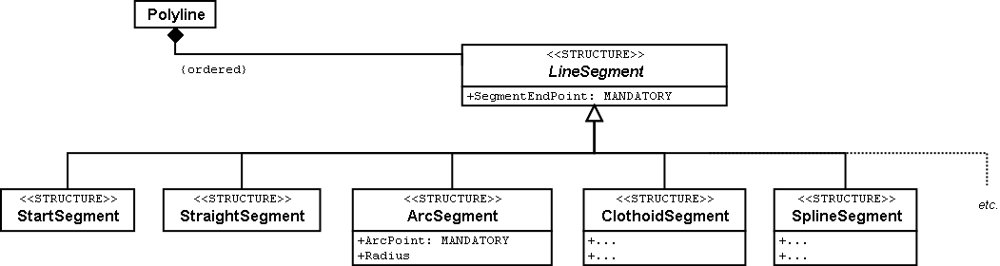
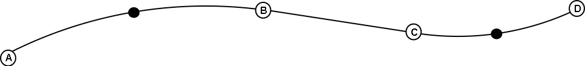
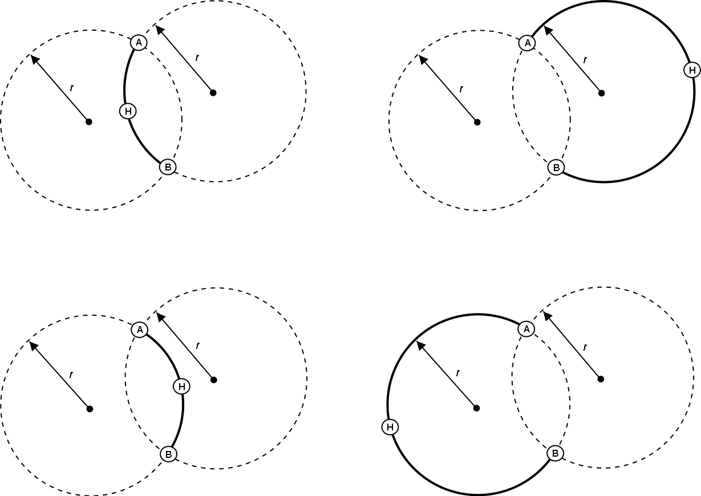

[#_7]
== Ilis Valley systems in focus

[#_7_1]
=== What are standard conform systems? – System neutrality

Various program packages, e.g. NatTourSys used by the national association, but also LiftSys employed by the Mount Ilis Alpine Transports, have implemented the models defined by INTERLIS 2. They are capable of establishing and reading corresponding files. Consequently are they INTERLIS-systems? To put the question more generally: When does a system comply with a certain standard?

A description at conceptual level does not aim at dictating the way a computer system implements the idea portrayed. As a rule systems have their own possibilities to realize concrete applications. Ideally the internal data model can be derived directly from the descriptions but this is no prerequisite. It is quite conceivable that a system cannot directly process data. In order to be compatible it is good enough for a system to be able to process data directly or indirectly according to a (e.g. by means of supplementary conversion programs. Whenever possible a norm for data modeling should not dictate the concrete manner in which the systems convert the application. Creativity is what we are after, there should be room for free enterprise. There must be system independence of the standard; otherwise desirable system changes may fail because of the incompatibility of data.

Then again a system need not possess the entire range of capacities that are conceivable in connection with a description. For instance WebSys can do nothing but collect INTERLIS 2-data. More extreme still are those systems that send condition reports from the individual alpine transports to the central office. In a very rudimentary way report data are inserted into prepared files that are structured according to the rules of the standard.

If an application makes very special requirements, we cannot expect them to be covered by a generally applicable norm. In such cases support is a matter of contract with the system manufacturers. However exercising restraint is recommended, because at the same time you will lose part of your system-independence and limit the circle of possible system providers.

Named below two examples depict how system dependent aspects can be standardized without in a major way influencing the systems internally.

[#_7_2]
=== The exchange rate of the Euro varies daily – Parameters and functions

For each ticket type its price is known in the national currency. In the interest of foreign tourists it should also be published in Euro and US-dollars. Then again it is unpractical to alter the prices for all ticket types following every fluctuation in the corresponding exchange rates. They should rather be computed from the national currency.

CLASS TicketType= +
Name: Text ++*++ 100; +
Price++_++SOVEREIGN: 0.00 .. 5000.00 ++[++Ahland.Sovereign++]++; +
Price++_++EUR: 0 .. 4000 ++[++EUR++]++ := SOVEREIGNtoEUR (Price++_++SOVEREIGN); +
Price++_++USD: 0 .. 4000 ++[++USD++]++ := SOVEREIGNtoUSD (Price++_++SOVEREIGN); +
END TicketType;

Whenever data are presented in the system or are prepared as data for the WebSys, the prices in Euro and dollar are newly calculated from the prices in the national currency. The conversion results from the two functions SOVEREIGNtoEUR respectively SOVEREIGNtoUSD. But how should LiftSys in particular, or any other system know what the essence of this function should be?

From the conceptual point of view the most important information consists of the fact that the two prices in foreign currency are treated as independent data but will be derived from the price in sovereigns. It is enough to determine names and their parameters for a certain function.

FUNCTION SOVEREIGNtoEUR (Sovereign: NUMERIC ++[++Ahland.Sovereign++]++): NUMERIC ++[++EUR++]++ +
// Conversion in Euro //;

The actual performance of the function is only indicated as an explanation between //. Its implementation is still up to the systems. Such definitions should be limited to some few basic models because they have to be prearranged with the systems manufacturers. In INTERLIS 2 the existence of such an agreement is remarked with a contract. Functions can only be defined in models with such a contract.

CONTRACTED MODEL IlisTour AT http://www.interlis.ch/models/ahland +
VERSION "2008-01" = +
... +
END IlisTour;

If we aim at keeping the number of functions as small as possible, they have to be formulated in as general a manner as possible. For instance instead of using SOVEREIGNToEUR, a universally applicable function for the division could be defined.

FUNCTION Division (Dividend: NUMERIC, Divisor: NUMERIC): NUMERIC;

It must be admitted that thus we renounce certain possibilities of control because there is no certainty that the first indication is a sum in the national currency. Using the form stated below this could be guaranteed.

FUNCTION ToCurrency (Sovereign: NUMERIC ++[++Ahland.Sovereign++]++, +
ExchangeRate: NUMERIC ++[++Ahland.Sovereign++]++): +
NUMERIC ++[++MONEY++]++;

But where does the exchange rate come from? For such cases we might intend certain values, e.g. the exchange rate for Euro or US–dollars, to be available as parameters within the systems. As this again has some impact on the systems, the definition of system parameters is only permitted within the scope of contracts.

PARAMETER +
EURExchangeRate: 0.000 .. 5.000 ++[++Ahland.Sovereign++]++; !! Price of one euro +
!! in sovereigns +
USDExchangeRate: 0.000 .. 5.000 ++[++Ahland.Sovereign++]++;

CLASS TicketType = +
Name: Text ++*++ 100; +
Price++_++SOVEREIGN: 0.00 .. 5000.00 ++[++Ahland.Sovereign++]++; +
Price++_++EUR: 0 .. 4000 ++[++EUR++]++ := ToCurrency +
(Price++_++SOVEREIGN, PARAMETER EURExchangeRate); +
Price++_++USD: 0 .. 4000 ++[++USD++]++ := ToCurrency +
(Price++_++SOVEREIGN, PARAMETER USDExchangeRate); +
END TicketType;

[#_7_3]
=== On crooked ways – Line forms

Maybe somebody would come up with the idea to describe the course of the ski run other than by means of straights and arcs. Maybe he would rather use clothoides, splines or Bézier-curves instead. INTERLIS 2 does not supply these forms directly but it permits the definition of new forms for line segments.

A line consists of an ordered set of line segments. They are considered a concrete extension of the abstract structure _LineSegment_. If you choose to use additional forms besides the pre-defined types of line segments (straights and arcs), then you can extend _LineSegment_ with a suitable structure.

Again such a definition is subject to an agreement with the manufacturers. After all the systems will have to come to terms with these line forms. Above all it is desirable that these forms will be represented correctly on the screen and on paper.

.INTERLIS-lines are composed of individual segments. Straights and arcs are predefined. The abstract structure for line segments can be extended by additional forms.

The end point of each segment is at the same time the start point for the next. That is why the start point is not part of the line segment. A special start segment defines where the first segment begins.

An end point does not sufficiently define an arc. That is why arcs not only have an end point but also an auxiliary point that is also on the line. It should be approximately in the middle between start and end point, because this will render calculations more precise.

.This line consists of four segments: A start segment with end point A, an arc segment with end point B, a straight segment with end point C, and a second arc segment with end point D. the auxiliary points of the arcs are on the line and displayed in black.

Of course the radius of an arc can always be computed from the coordinates of the vertices. However mathematical inaccuracies may lead to calculated values that diverge from the one intended. If the radius is of conceptual importance for the application, this is unacceptable. Hence arc segments optionally can feature a value for the radius.

If the radius is indicated, the exact position of the line is defined with this value. In this case the auxiliary point would only serve to select one of the four possible connecting lines.

.If the radius _r_ is indicated, the auxiliary point H only serves to select one of the four possible arcs, which link points A and B.

