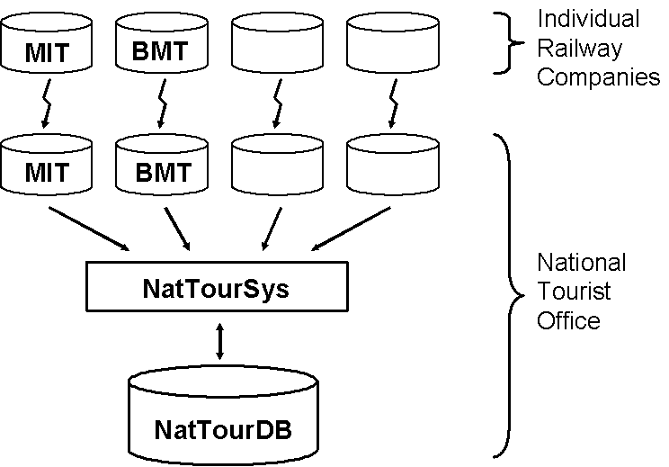

[#_8]
== Ilis Valley data on their way

[#_8_1]
=== Out of mind, out of sight – Full transfer

Let's recall: In Ilis Valley they had carefully considered which data was needed for their projected application and had documented their ideas with a data model. In the course of their discussions it had become apparent that working with both graphic representation and detailed textual description was helpful.

After many a lengthy discussion those in charge in Ilis Valley had gotten there: The standard program package «LiftSys» was acquired and arranged according to the Ilis Valley data model. Even though things did not go quite as smooothly as promised by the LiftSys-sales representative, these initial difficulties were not hard to overcome. And finally the data of all transport lines, railway companies, ski runs etc. in Ilis Valley had been collected.

Proudly the IT-expert demonstrated how with one single mouse click the entire Ilis Valley data could be exported into an INTERLIS 2-file. Some spectators were not easily enthused and critical questions were asked: All these meetings for one miserable file? Had that really been necessary?

All objection was quickly squashed once the accountant explained just how many sovereigns the data exchange had cost them per year up until now. Every time data had had to be transferred to the national association there had been trouble. How many hours of work had been time wasted!

From now on it would be possible to send one file with all the Ilis Valley data to the national association and they would be able to process them without any problems.

[NOTE]
The simplest type of transfer is the *full transfer*, whereby all data are transferred as a whole.

The fact that a transfer goes smoothly even if not all the parties concerned use the same data model is due to inheritance as explained in paragraph <<_5_5>>.

[#_8_2]
=== Brackets as pointed as Mount Ilis – Transfer rules based on XML

What was actually in this file? It was opened with a normal text editor.

____
++<++?xml version="1.0" encoding="utf-8"?++>++ +
... +
++<++BASKET BID="xAHTOUMIT01234567" TOPICS="IlisTour.AlpineTransports"++>++ +
++<++IlisTour.MITAlpineTransports.MITAlpineTransport +
TID="xAHTOUMIT04231336"++>++ +
++<++Names++>++ +
++<++NatTour.Designation++>++ +
++<++Name++>++**Pony lift Ilis Ville**++<++/Name++>++ +
++<++Language++>++en++<++/Language++>++ +
++<++/NatTour.Designation++>++ +
++<++/Names++>++ +
... +
++<++PosTopStation++>++ +
++<++P++>++ +
++<++C1++>++8020.60++<++/C1++>++ +
++<++C2++>++13188.62++<++/C2++>++ +
++<++C3++>++1789.04++<++/C3++>++ +
++<++/P++>++ +
++<++/PosTopStation++>++ +
++<++TravelTime++>++ +
++<++Ahland.LengthOfTimeInMinutes++>++ +
++<++Duration++>++3++<++/Duration++>++ +
++<++/Ahland.LengthOfTimeInMinutes++>++ +
++<++/TravelTime++>++ +
++<++Kind++>++SkiLift++<++/Kind++>++ +
... +
++<++PictureTopStation++>++ +
http://www.ilishornbahnen.com/webcam?bahn=pony4 +
++<++/PictureTopStation++>++ +
... +
++<++/IlisTour.MITAlpineTransports.MITAlpineTransport++>++ +
++<++/BASKET++>++ +
...
____

Figure 67: The Ilis Valley pony lift as part of the full transfer for Ilis Valley data. The INTERLIS-standard defines the precision with which such a transfer file has to be structured for a certain data model.

Quite a few pointed brackets, at the very beginning something about XML (that had been mentioned somewhere earlier along the way!), even though with question marks... Aha, something simple for a change: The pony lift Ilis Ville (more towards the beginning, printed in bold).

Depending on the data model a transfer file has a different structure. But of course it is not completely arbitrary: The INTERLIS-standard states precise rules as to how the corresponding XML format is to be derived from a specific data model.

Slightly complicated, this whole thing – but luckily LiftSys could be used and all these brackets never had to be entered by hand. At least even without a special program it was evident that the travel time on the pony lift is 3 minutes.

The IT-expert explained that even in forty years' time they would still be able to work with these data. Even supposing that by then the manufacturers of the original programs had gone bankrupt, fifteen new program versions had had to be installed and all the hardware had been exchanged. This statement appeared to be quite plausible because even without any documentation and on paper it was possible (though rather awkward) to understand these data.

But what about this funny text «TID="xAHTOUMIT04231336"»? It designates the pony lift within the transfer file. The value is only of importance for the transfer: This object identifier appears wherever in the transfer file there is a reference to the pony lift. During installation of LiftSys it had been possible to indicate that all identifiers should begin with xAHTOUMIT, exactly as had been demanded by the National Tourist Office in their letter.

Object identifiers begin with a country code in accordance with ISO 3166 (ch for Switzerland, fr for France, etc.) and six other symbols uniquely assigned by the appropriate, central authority. The eight remaining symbols are automatically assigned by the computer system.

For explanations about object identifiers see appendix E of the INTERLIS-reference manual.

[#_8_3]
=== Once and over and over again – Incremental update

As much as seventeen minutes on the pony lift? Those poor kids will be frozen stiff before they will even have attempted their first stem turn! This line will hardly survive its first season, how could anybody still be interested in its data forty years from now?

Finally it turned out that the pony lift was not tremendously oversized – somebody had simply made a typing-mistake while entering data: Instead of seventeen minutes the ride would only take all of one minute.

Of course it did not take long to change that figure in LiftSys. But did this mean all the data had to be sent once more to the national association?

[NOTE]
Thanks to *incremental update* it is no longer necessary to send all data after a modification, it is enough to transfer the modifications themselves. This saves transferring data but the real advantage lies in the fact that it provides at the same time a documentation of the exact nature of modifications.

By means of the LiftSys-program an update for the national association had been generated. In contrast with the full transfer this update did not comprise all data of the entire Ilis Valley but only data of modified objects. Consequently it turned out to be much smaller and easier to handle.

Yet it does not always make sense to do an incremental update. For instance the National Tourist Office does not offer itself the internet-service where tourists can find information about the prices of tickets at the various lines, instead they have delegated this task to one of their sister companies. Periodically they are sent a complete copy of all data in INTERLIS 2-format. These data are loaded by a server-program, which answers any concrete question. An incremental update would increase requirements on the server-program without any visible profit.

[#_8_4]
=== The Blue Mountains also are touristy – Baskets, replicas and polymorph reading

Ilis Valley is not the only resort that sends data to the National Tourist Office; there are 162 other areas that do the same. They do not want to be bothered with looking after every areas data. They are happy to simply receive regional updates with current data from time to time.

In the individual regions data are kept in the databases of the systems employed. Within the scope of INTERLIS we proceed on the assumption that the data of every topic of the data model are stored in one (or maybe several). Hence the alpine transport data of the Mount Ilis Alpine Transports are in one basket, those of the Blue Mountains Alpine Transports in another. Now if these data are sent from the Mount Ilis Alpine Transports or the Blue Mountains Alpine Transports to the National Tourist Office, then the corresponding basket becomes visible in the transfer file. The computer system of the national association (NatTourSys) reads these data and updates the data-base NatTourDB. Simultaneously they record where the objects come from.

.Occasionally the National Tourist Office receives an update of their tourism data from the Mount Ilis, the «Blue Mountain Alpine Transports» and many other railway companies.

Hence the data concerning the Ilis Valley pony lift exist twice: Once with the Mount Ilis Alpine Transports, once with the National Tourist Office. Of course this does not mean that from now on the children in Ilis Valley have got an extra ski run. We have only copied data and not built a new ski lift!

Even from the electronical point of view everything is clear; these two data objects possess the same object identifier. This makes it obvious that we are dealing with replicas that stand for one single really existing pony lift.

Other terms meaning replica are: substitute, duplicates, proxy-objects.

It is important that an object identifier (such as «xAHTOUMIT04231336» in the example above) definitely is unequivocal. Otherwise it might accidentally happen that the Mount Ilis and the Blue Mountains Alpine Transports use the same identifier for two different objects. Consequently it no longer would be clear for the National Tourist Office whether when receiving an incremental update they are dealing with a modified object from Ilis Valley or from the Blue Mountains.

An administrative authority of Ahland («AH») has assigned the index code «AHTOU» to the National Tourist Office. Subsequently the National Tourist Office determined the first part to be used in an identifier for every railway company (e.g. «AHTOUMIT» for the Mount Ilis Alpine Transports and «AHTOUBBB» for the Blue Mountain Alpine Transports). For the remaining part of the identifier the company itself respectively the program employed is responsible.

With a full transfer object identifier do not have the same significance as with an incremental update. They need not be maintained; they merely serve the re-establishing of relationships between different objects (e.g. tariff zones and ticket types).

[#_8_5]
=== The pony lift in the «Tal der gelben Murmeltiere» – Foreign languages in data transfer

Just behind the Black Tooth lies the «Tal der gelben Murmeltiere». Disregarding the fact that German is spoken over there and that the indigenous marmot have an intensively colored coat, it is hardly any different from Ilis Valley.

Above all their local pony lift is also an all-time favorite with the kids. But how will the national tourism association find out about its travel time? After all the designations used in the data model will reappear in the structure of the transfer files. That is how come the Ilis Valley data feature lines such as ++<++Duration++>++3++<++/Duration++>++. If the data model is translated into another language, then of course the corresponding transfer format changes as well.

So how does the National Tourist Office handles the fact that for instance the transfer file from one valley contains the line ++<++Duration++>++3++<++/Duration++>++, but the one from the neighboring valley says ++<++Dauer++>++3++<++/Dauer++>++?

The National Tourist Office does not have to buy separate software for everyone of the native languages. INTERLIS makes sure that in spite of multilingual applications a smooth transfer is guaranteed, on the sole condition that due to translation the data model has not undergone any changes in its structure. As already mentioned in paragraph <<_6_18>> a tool (the so-called INTERLIS-Compiler) is available that checks the translation of a data model with regard to its structural conformity with the original.

