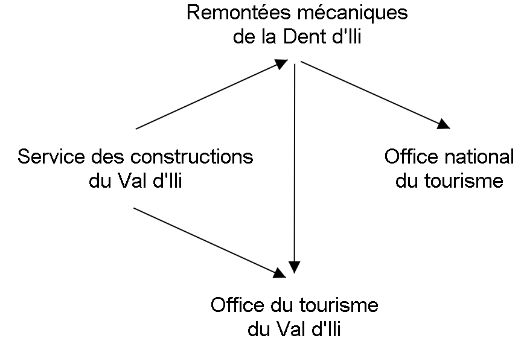
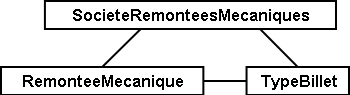
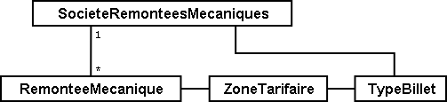
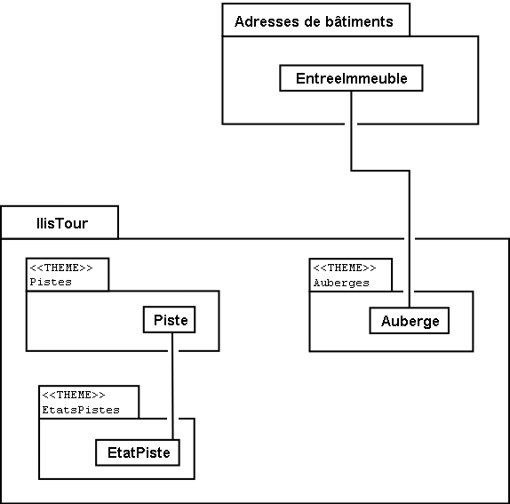
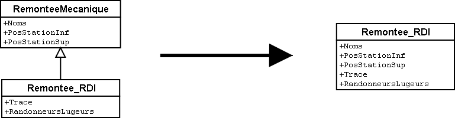

[#_2]
== Vue d'ensemble avec le Val d'Ili pour toile de fond

[#_2_1]
=== Un vent de renouveau souffle sur le Val d'Ili

[#_2_1_1]
==== Le signal du départ

Le Val d'Ili, zone de villégiature prisée, possède un site Internet qu'il a été décidé de revoir de fond en comble, l'un des objectifs étant que l'abondante offre en moyens de transport soit à l'avenir consultable via un dialogue graphique. Dans cette optique, les locaux de la maison de la commune ont prêté leur cadre à une présentation qui a d'autant plus vivement impressionné l'auditoire qu'elle était émaillée de belles photos et d'abréviations très en vogue comme HTML, XML, SIG ou SVG ! Mais très vite, de nouvelles demandes ont été formulées. Le service des constructions s'est récemment résolu à saisir les adresses dans le respect de la norme parue dernièrement à ce sujet. Il faudrait en tenir compte ! Le directeur des Remontées mécaniques de la Dent d'Ili s'est quant à lui souvenu d'un service que l'Association nationale des exploitants de remontées mécaniques désirait mettre en place, permettant à l'usager d'accéder au réseau complet des remontées mécaniques du pays. Et il va de soi que la consultation des tarifs et bien sûr des modalités d'utilisation des différents abonnements devrait être possible. Puis son collègue en charge des questions techniques a attiré l'attention de tous sur le fait qu'il gérait l'ensemble de l'infrastructure sur son ordinateur et qu'il était donc en mesure de livrer des informations sur le tracé des lignes et des pistes. Mais tout n'était pas encore clair à ce niveau, la preuve : il avait récemment demandé au service des constructions s'il ne lui était pas possible d'obtenir les données relatives à l'édification du nouveau complexe immobilier « Au plafond ». Il les a bien obtenues au bout de quelque temps, mais certaines infos s'étaient perdues en chemin. Elles n'étaient pas très importantes, mais tout de même.

C'est alors que la syndic de la commune se souvint de ce qu'une collègue en poste dans une commune proche du chef-lieu lui avait rapporté peu de temps auparavant : ils en étaient déjà au troisième logiciel, rien que pour l'un des services communaux concernés ! Exprimer des demandes supplémentaires semblait parfaitement légitime, mais elles conduisaient immanquablement à un remaniement complet. Un informaticien avait finalement été appelé à la rescousse pour sortir de cette impasse et curieusement, il s'était peu étendu sur les différentes techniques envisageables mais avait mis l'accent sur les données liées aux problèmes posés, invitant tous les intervenants à y réfléchir avec lui. Depuis qu'ils procédaient ainsi, la progression s'effectuait lentement, certes, mais sûrement et les succès d'étape s'enchaînaient.

La syndic, personne aimable mais très décidée, en a tiré les conséquences qui s'imposaient pour sa propre commune et a donné pour mission au secrétaire des constructions de s'occuper de cette affaire en compagnie du responsable technique des Remontées mécaniques de la Dent d'Ili, non sans leur adjoindre l'informaticien de sa collègue en guise de conseiller technique.

[#_2_1_2]
==== Première ébauche de structure

Lors de la première réunion du groupe de travail, mots-clés et arguments s'entrechoquaient encore dans un joyeux désordre : avec quel logiciel l'Association nationale travaille-t-elle ? Considère-t-on la société de remontées mécaniques comme un tout ou chaque remontée, chaque télésiège séparément ? Les différentes lignes mais également les bâtiments sont déjà intégrés au sein de la mensuration officielle. Comment utiliser ces données ? Que se passe-t-il en cas de modification de données, d'ajout de nouvelles données ? Mais mon logiciel ne reconnaît que le format DXF! Et moi, je ne m'intéresse qu'aux gares !

Les hostilités cessèrent alors et l'on se souvint de la devise de la Rome antique « Divide et impera », diviser pour mieux régner. On se mit à remettre de l'ordre pour reprendre les choses en main, sachant que les questions suivantes étaient au centre des préoccupations :

* Qui a besoin de quelles données ?
* Qui les saisit et les met à jour ?

.Les différents intervenants et les flux de données.

Mais comment les données sont-elles transmises par ceux qui les traitent à ceux qui les utilisent ? Courrier électronique, FTP, DXF, ASCII – et nous voilà repartis pour un tour. L'informaticien recommanda de faire glisser cette question vers l'arrière-plan pour s'intéresser à la manière dont les données étaient modélisées. Modélisées ? Nous cherchons à bâtir une solution informatique pour notre beau Val d'Ili, pas une maquette… La question de savoir ce qu'était un modèle de données dépassait de loin le cadre de notre première réunion mais nous apprîmes cependant ceci : il doit décrire la manière dont les données sont organisées. Quelles sont les propriétés des différents objets ? Quels objets sont en relation avec quels autres objets ? Et ce modèle ne doit pas se présenter sous une forme rédigée en langage courant mais dans un langage formel ou figuratif, clair et précis !

[#_2_2]
=== Premiers pas

[#_2_2_1]
==== L'Association nationale des offices de tourisme a défriché le terrain

Avec son logiciel NatTourSys, l'Association nationale des offices de tourisme propose une large vue d'ensemble des différents billets vendus pour les remontées mécaniques. Les billets sont délivrés par les différentes sociétés exploitantes. Ce qui intéresse prioritairement les touristes, c'est toutefois de savoir quels billets sont valables sur quelles remontées mécaniques. Ainsi, les Ilinois souhaitent-ils d'abord se faire une idée de ce qui existe avant de se lancer dans leur propre projet.

Une chose est claire : il faut définir avec précision ce que recouvrent les notions de remontée mécanique (ou de ligne de montagne), de société de remontées mécaniques et de billets dans le contexte du logiciel.

A quoi fait-on réellement référence lorsque l'on parle de billet ? Au ticket vendu à l‘unité à l'usager ? Dans cette application-là, certainement pas. On souhaiterait plutôt décrire les différents types de billets, raison pour laquelle nous introduisons dès maintenant la notion de « type de billet ». Les différents objets possèdent des propriétés dont la portée dépasse manifestement leur cadre. Ainsi en va-t-il du prix ou de la durée de validité dans le cas des types de billets.

* *Remontée mécanique (ou ligne de montagne)* – Une remontée mécanique (ou ligne de montagne, on utilisera indifféremment l'une ou l'autre expression dans la suite) transporte des passagers entre une station inférieure et une station supérieure. Le funiculaire Ili-village – Dent d'Ili en constitue un exemple, mais il existe aussi des chemins de fer à crémaillère, des téléphériques, des télécabines, des remonte-pentes et des télésièges. Et le tout nouveau « bus des neiges » peut également être considéré comme faisant partie de cette catégorie. Chaque type de remontée possède un nom bien spécifique.
* *Type de billet* – Il désigne un type de billet bien défini. Exemples : le forfait pour les sportifs à 195 couronnes, valable sept jours durant sur l'ensemble des remontées du Val d'Ili ou encore le forfait « Dino » à 10 couronnes, valable le jour de son émission sur le tire-fesses.
* *Société de remontées mécaniques* – Une telle société exploite des remontées mécaniques. Un nom et parfois un nom abrégé lui sont associés. Les Remontées mécaniques de la Dent d'Ili (RDI en abrégé) en sont un exemple. Toute société de remontées mécaniques perçoit une partie du produit de la vente des billets valables sur son réseau. Une société de remontées mécaniques peut être la filiale ou la société mère d'une autre entreprise de transport en montagne.

[NOTE]
Le *catalogue des objets* d'une application répertorie l'ensemble des éléments d'importance pour elle et les décrit avec des mots aussi précis que possible.

Si l'on décrit cependant toutes les propriétés des éléments par du texte, il devient rapidement difficile d'en conserver une vue d'ensemble. Et comme une image est toujours plus évocatrice qu'un long discours, la solution consiste à représenter les objets sous forme d'un diagramme ! Mais la description détaillée de tous les objets nous intéresse-t-elle vraiment ? Certes, mais ce qui nous intéresse surtout, c'est de répertorier les éléments identiques et les propriétés qu'ils possèdent.

Un tel diagramme permet de saisir l'essentiel d'un coup d'oeil :

.La première ébauche d'un modèle de données
image::img/image3.png[./media/image3,width=176,height=48]

[NOTE]
====
La remontée mécanique, le type de billet et la société de remontées mécaniques sont des *classes d'objets* (cases). Entre elles existent des *relations* (traits de liaison). L'ensemble des définitions concernant les classes et les relations qui les unissent constitue le *modèle de données*. La représentation figurative s'opère à l'aide de *diagrammes de classes*.

_Notions apparentées aux classes d'objets : ensemble d'entités, table, type, ..._

_Notions apparentées aux relations : association, renvoi, connexion, indicateur (réciproque), ..._

_Notions apparentées au modèle de données : schéma (conceptuel), description de données, ..._
====

Les classes d'objets sont désignées au moyen de substantifs (isolés ou composés). On utilise le singulier pour exprimer le fait que chaque objet (chaque remontée mécanique par exemple) possède les propriétés décrites par cette classe.

[NOTE]
====
Toute remontée mécanique, toute société exploitante et tout type de billet est décrit par l'intermédiaire d'un *objet* concret. Les objets sont les *données* dont la structure et les interactions sont décrites par le modèle.

_Notions apparentées aux objets : exemplaire, instance, empreinte, jeu de données, ligne, uplet, entrée, ..._
====

Toute remontée mécanique est exploitée par une société, laquelle propose un certain nombre de types de billets. On suppose que ces derniers sont valables sur l'ensemble des lignes de l'entreprise, en l'absence de toute information supplémentaire. Mais on ne peut pas se satisfaire de cette hypothèse dans la mesure où les sociétés d'une certaine taille émettent des types de billets uniquement valables sur une partie de leur réseau. La première idée venant à l'esprit consiste à introduire une relation supplémentaire entre la remontée mécanique et le type de billet. On doit donc indiquer, pour chacun des types de billets, les lignes sur lesquelles il est valable :

.Le modèle de données a été étendu par une relation entre la remontée mécanique et le type de billet.

Il est cependant fréquent que plusieurs types de billets (exemple : forfait à la journée, hebdomadaire, etc.) soient valables dans une même zone. Le modèle tel qu'il est formulé pour l'instant imposerait de générer les affectations séparément pour chaque type de billet ce qui serait non seulement fastidieux mais également porteur de risques d'erreurs importants. C'est pourquoi l'Association nationale des offices de tourisme a choisi de recourir à un modèle un peu plus élaboré :

.Modèle de données révisé. Aucune signification particulière n'est attachée au coude dans le trait de liaison entre la société de remontées mécaniques et le type de billet.
image::img/image7.png[./media/image7,width=310,height=71]

[WARNING]
Une réflexion préalable sur les classes d'objets requises par le problème posé et sur les relations qu'elles entretiennent les unes avec les autres se révèle particulièrement judicieuse. Les propriétés des objets nous préoccupent encore peu à ce stade où il est plus important de rechercher des notions ou des désignations adaptées.

[#_2_2_2]
==== Combien de lignes une société de remontés mécaniques exploite-t-elle ?

Plusieurs remontées mécaniques peuvent être affectées à une même société. Inversement, une société donnée peut se voir affecter plusieurs remontées mécaniques. Plusieurs ? Mais combien exactement ?

[NOTE]
La *cardinalité* fixe le nombre d'objets d'un autre type pouvant être affectés à un objet d'un type donné.

Sur la représentation graphique, les valeurs admissibles (minimum et maximum) du nombre d'autres objets sont indiquées aux extrémités des traits de relation, à proximité des cases de classes. Si aucune limite supérieure n'est fixée à cette valeur, l'indication d'un astérisque (++*++) ou l'absence de toute valeur le signale.

.Une remontée mécanique est exploitée par une (1) société. Inversement, une société peut exploiter un nombre quelconque (++*++) de remontées mécaniques.

[#_2_2_3]
==== Les remontées mécaniques, les sociétés exploitantes et les abonnements possèdent des propriétés

Il est bien évident que l'application prévue requiert de décrire plus en détail ce qu'est une remontée mécanique, une société de remontées mécaniques, etc. Un nom et généralement un nom abrégé (exemple : les Remontées mécaniques de la Dent d'Ili ou RDI) sont associés à une société de remontées mécaniques.

.La classe d'objets de la société de remontées mécaniques avec le nom et le nom abrégé qui lui sont associés.
image::img/image10.png[./media/image10,width=147,height=31]

[NOTE]
====
Le nom et le nom abrégé désignent des *attributs* de la classe d'objets de société de remontées mécaniques. 

_Notions apparentées aux attributs : colonne, champ, propriété, ..._
====

La désignation de nos deux attributs laisse assez clairement apparaître le type dont il s'agit : du texte. Dans le cas du prix d'un type de billet, l'indication d'informations supplémentaires est déjà un peu plus importante : franc, euro, dollar, couronne béotienne ? Le cas de la durée de validité devient plus épineux encore, surtout s'il n'est pas possible de la décrire par un nombre de jours. Et si l'on souhaite indiquer la longueur d'une ligne, il va de soi qu'il faut préciser l'unité dans laquelle cette valeur est exprimée, en mètres ou en kilomètres. Il est important que les programmes de traitement aient connaissance de la longueur prévue pour les attributs textuels ou des limites dans lesquelles les valeurs permises peuvent évoluer.

[NOTE]
Le *type* d'un attribut décrit les valeurs que ce dernier peut prendre et la signification qui leur est attachée.

Le domaine de valeurs est une notion apparentée au type.

.La classe d'objets de « société de remontées mécaniques » possède un nom et un nom abrégé.
[%autowidth]
|===
2+|Classe d'objets SocieteRemonteesMecaniques

|Nom :
|Texte +
 _Longueur : Cent caractères au plus_
|NomAbrege :
|Texte +
 _Longueur : Dix caractères au plus_
|===

Le type de la propriété du « nom » est un texte comportant au plus cent caractères. Dix caractères au plus sont en revanche admis pour la propriété du « nom abrégé ».

Bien d'autres types d'attributs sont également envisageables :

.La classe d'objets du type de billet avec ses propriétés et leurs types.
[%autowidth]
|===
2+|Classe d'objets TypeBillet

|Nom :
|Texte +
 _Longueur : Cent caractères au plus_
|Prix :
|Valeur numérique +
 _Précision : Deux chiffres après la virgule_ +
 _Plage admissible : Entre 0 et 5000_ +
 _Unité : Couronne béotienne_
|===

Contrairement à un type de billet ou à une société de remontées mécaniques, la station inférieure d'une remontée mécanique est un objet doté d'une existence réelle en un lieu bien précis. Il est judicieux de décrire une position au moyen de coordonnées exprimées dans un système de coordonnées clairement défini tel que le système national.

.La classe d'objets de remontée mécanique avec ses propriétés et leurs types.
[%autowidth]
|===
2+|Classe d'objets RemonteeMecanique

|Nom :
|Texte +
 _Longueur : Cent caractères au plus_
|Position de la station inférieure :
|Point +
 _Système de coordonnées : Coordonnées nationales béotiennes_
|Position de la station supérieure :
|Point +
 _Système de coordonnées : Coordonnées nationales béotiennes_
|===

Un type d'attribut adéquat est ainsi défini pour chacune des propriétés. Dans le cas d'une piste de ski, le niveau de difficulté constitue une énumération. Le tracé de la piste est en revanche une ligne orientée dont les sommets sont exprimés en coordonnées nationales béotiennes. Les différents types seront abordés plus avant au <<_6>>.

.La classe d'objets de piste de ski avec ses propriétés et leurs types.
[%autowidth]
|===
2+|Classe d'objets PisteSki

|Tracé :
|Ligne orientée +
 _Système de coordonnées : Coordonnées nationales béotiennes_
|Niveau de difficulté :
|Enumération +
 _Valeurs possibles : bleu, rouge, noir_
|===

[#_2_2_4]
==== Des modèles ? Le Val d'Ili veut des données !

Après tous ces développements plutôt théoriques, les Ilinois réclament des faits. La demande déposée auprès de l'Association nationale des offices de tourisme a abouti à la mise à disposition par cette dernière d'un logiciel de saisie de données simple et conforme à ses exigences. Ce logiciel permet d'exporter les données au format INTERLIS après quoi elles sont transmises à l'Association nationale des offices de tourisme. L'informaticien a beau objecter que cela permettra tout au plus d'effectuer un premier test et que la gestion effective des données devra ensuite s'effectuer à l'aide du logiciel des Remontées mécaniques de la Dent d'Ili ou de celui du service des constructions, mais rien n'y fait. Les Ilinois tiennent à l'effectuer, ce test. Il ne devrait d'ailleurs pas nécessiter une débauche d'énergie exagérée. Après tout, les Remontées mécaniques de la Dent d'Ili ne sont pas si étendues et le nombre de types de billets différents est relativement réduit.

[WARNING]
Agir ainsi dans l'urgence ne peut se justifier que si le volume de travail concerné reste limité.

Les Remontées mécaniques de la Dent d'Ili regroupent les lignes suivantes :

* Funiculaire Ili-village – Dent d'Ili ;
* Télécabine Ili-les-Bains – Crête d'Ili ;
* Remonte-pente Crête d'Ili – Dent d'Ili ;
* Télésiège Vallon d'Ili – Crête d'Ili ;
* Tire-fesses à Ili-village et Ili-les-Bains.

.Le réseau de lignes exploité par les Remontées mécaniques de la Dent d'Ili.
image::img/image11.png[./media/image11,width=450,height=185]

Les Remontées mécaniques de la Dent d'Ili émettent les billets des types suivants :

* Billets à l'unité pour le funiculaire (prix d'un aller simple : 10 couronnes ; d'un aller-retour : 18 couronnes) ;
* Billets à l'unité pour la télécabine (prix d'un aller simple : 8 couronnes ; d'un aller-retour : 14 couronnes) ;
* Forfait du randonneur pour le funiculaire et la télécabine (prix pour une journée : 15 couronnes ; pour sept jours : 55 couronnes) ;
* Forfait du sportif sur toutes les remontées (prix pour une journée : 40 couronnes, pour deux journées : 70 couronnes, pour sept jours : 195 couronnes, pour toute une année : 635 couronnes) ;
* Le forfait à la journée « Dino » (10 couronnes) et le forfait hebdomadaire « Ilosaurus Maximus » (45 couronnes) pour les tire-fesses.

[#_2_2_5]
==== Le Val d'Ili transmet

Un fichier contenant toutes les données requises a pu être créé pour les besoins du test.

____
[NOTE]
Le genre de transfert le plus simple est le *transfert intégral*, lors duquel toutes les données sont transmises.
____

Un bref coup d'oeil au fichier a permis de constater qu'au milieu d'un océan de signes cabalistiques plus ou moins étranges surnageaient quelques expressions connues comme les « Remontées mécaniques de la Dent d'Ili » ou le nom abrégé « RDI », voire quelques valeurs familières comme le prix de l'abonnement.

Nouveau test : le prix du forfait sportif annuel est ramené de 635 à 600 couronnes et un nouveau fichier est généré à l'aide de la fonction de livraison complémentaire. Si le début reste identique, on cherche en vain les « Remontées mécaniques de la Dent d'Ili » ou le nom abrégé « RDI » mais là, tout près de la fin, on découvre enfin le nouveau tarif !

____
[NOTE]
Grâce à la *livraison incrémentielle*, seuls les objets modifiés sont à transmettre à la suite d'un changement dans les données. 
____

Les deux fichiers ont alors été transmis à l'Association des offices de tourisme, comme convenu, laquelle a apparemment pu les lire sans la moindre difficulté. Objection de l'informaticien : cela n'a rien de bien surprenant aussi longtemps que nous saisissons les données attendues par l'Association et qui plus est avec un logiciel mis à notre disposition par ses soins. Mais nous, les Ilinois, nous en voulons plus ! Et nous voudrions si possible continuer à utiliser nos propres logiciels.

[#_2_3]
=== Le Val d'Ili en veut davantage

[#_2_3_1]
==== L'objectif

Le Val d'Ili ne souhaite en fait pas offrir le même service que celui proposé par l'Association nationale des offices de tourisme. Les prestations suivantes doivent venir le compléter :

* Indication des horaires de service et des délais d'attente sur les différentes lignes du réseau avec mention de la possibilité offerte ou non aux randonneurs et aux lugeurs de les emprunter ;
* Affichage des pistes avec leur niveau de difficulté et leur praticabilité actuelle ;
* Représentation figurative (avec indication des forêts et du réseau routier) ;
* Indication des auberges de la région ;
* Indication de la localisation des bâtiments et de leurs adresses postales.

[#_2_3_2]
==== Le Val d'Ili sait faire bon usage des informations existantes

Bien évidemment, on ne souhaiterait pas avoir à saisir les données concernant les forêts et le réseau routier, requises par la représentation figurative, puisque le service des constructions dispose des données de la mensuration officielle qui les intègrent déjà. Et le service des constructions a commencé à saisir les adresses de bâtiments dans le respect de la nouvelle norme. Il ne serait donc pas très judicieux de répéter toutes ces définitions dans le modèle de données du Val d'Ili. C'est pourquoi les Ilinois souhaiteraient réutiliser les modèles existants de la mensuration officielle et des adresses de bâtiments.

[NOTE]
====
Un modèle de données n'est pas une description isolée, il peut s'appuyer sur d'autres modèles de données préexistants.

_Notions apparentées au modèle de données, du point de vue de son organisation : module, paquet voire package, ..._
====

.Le modèle de données de l'office du tourisme du Val d'Ili (IlisTour) n'a nul besoin de tout redéfinir. Il peut prendre appui sur des modèles préexistants et utiliser certaines parties du modèle de l'Association nationale des offices de tourisme (NatTour), des bases nationales béotiennes, de la mensuration officielle, des adresses de bâtiments ou d'autres bases à caractère général. Les lignes pointillées se terminant par des flèches pleines désignent des relations de dépendance. Il est fréquent que la base à caractère général soit représentée dans la partie supérieure du graphique et le cas particulier dans la partie inférieure, quoique l'inverse soit également très répandu.
image::img/image12.png[./media/image12,width=268,height=267]

[#_2_3_3]
==== Le Val d'Ili va plus loin que l'Association nationale

Les Ilinois ne veulent toutefois pas utiliser le modèle de l'Association nationale des offices de tourisme tel quel. Le tracé de chacune des lignes du réseau doit ainsi être décrit pour qu'une représentation figurative soit possible. On souhaite par ailleurs indiquer si la ligne est ouverte aux randonneurs et aux lugeurs, fournir ses horaires et signaler les délais d'attente actuels. Définir une classe spécifique pour les remontées mécaniques du Val d'Ili semble alors assez logique. Mais comment procéder : les attributs de la classe de société de remontées mécaniques de l'Association nationale doivent-ils être repris ? Et quid du problème de la relation entre les remontées mécaniques et les zones tarifaires ? Que signifierait une classe spécifique pour cette relation ?

Par chance, l'héritage existe et permet de dénouer de telles situations.

.La Remontee++_++RDI est une remontée mécanique d'un genre particulier, intégrant des attributs supplémentaires : tracé de la ligne et ouverture aux randonneurs et aux lugeurs. La ligne en trait plein à flèche évidée signale une spécialisation.
image::img/image13.png[./media/image13,width=106,height=99]

[NOTE]
====
La classe Remontee_RDI du Val d'Ili constitue une extension de la classe des remontées mécaniques. Elle hérite ainsi de toutes les propriétés des remontées mécaniques et en rajoute d'autres [l'héritage est décrit plus en détail au <<_5>>].

_Notions apparentées à l'extension : spécialisation, sous-classe, ..._
====

Serait-il judicieux d'intégrer à présent les attributs que sont les horaires de service et les délais d'attente actuels dans la classe Remontee++_++RDI du Val d'Ili ? Si l'horaire était un attribut direct de la classe Remontee++_++RDI, on pourrait imaginer la définition d'un horaire unique pour chacune des lignes, à savoir celui actuellement en service. Le responsable de l'exploitation fixe cependant les horaires au début de chaque nouvelle saison : certaines remontées ne sont pas en service en début de saison, d'autres sont arrêtées durant la pause déjeuner ; à Noël, les remontées tournent en continu de 9h00 à 15h30 ; à partir de la mi-février, lorsque les journées commencent à rallonger, l'exploitation est progressivement prolongée jusqu'à 16h30. Enfin, les conditions météorologiques et le niveau d'enneigement peuvent contraindre l'exploitant à fermer temporairement certaines lignes.

.Les horaires sont désormais définis comme des objets indépendants.
image::img/image14.png[./media/image14,width=298,height=186]

Si l'on impose en outre qu'un horaire spécifique peut s'appliquer à plusieurs lignes, le volume de travail requis par la saisie s'en trouve encore un peu plus réduit. Une telle démarche est en revanche dénuée de sens pour les délais d'attente. En effet, un délai d'attente observé à un moment donné doit être affecté à la ligne à laquelle il s'applique. Et pourquoi alors ne pas fixer le délai d'attente directement dans la classe Remontee++_++RDI ? Les raisons suivantes militent en défaveur de cette option :

* La mémorisation des délais d'attente en tant qu'objets indépendants permet de les réexploiter ultérieurement (à des fins statistiques par exemple).
* Le rythme des modifications ainsi que la responsabilité des valeurs enregistrées sont très différents de ce qu'ils sont pour les attributs de la classe Remontee++_++RDI.

[WARNING]
Il convient toujours, s'agissant de propriétés semblant pouvoir être affectées sans la moindre hésitation à une classe donnée, de se demander si cette démarche est la bonne ou s'il ne serait pas plus judicieux de les déplacer vers des classes indépendantes pour les affecter par l'intermédiaire de relations.

Une telle réflexion privilégie la situation effective par rapport à l'utilisation prévue, par exemple des représentations. Mais il ne faut pas pour autant négliger les questions relatives à l'organisation. Qui est responsable de la mise à jour des données ? A quel rythme sont-elles actualisées ?

Dans le modèle de l'Association nationale, les sociétés de remontées mécaniques sont responsables de la mise à jour des données de leur propre réseau. Les Ilinois souhaiteraient faire usage du modèle de l'Association nationale, pour ce qui concerne les remontées mécaniques, mais seraient toutefois désireux de l'étendre pour les Remontées mécaniques de la Dent d'Ili.

[NOTE]
Les modèles de données sont subdivisés en *thèmes* afin de tenir compte au mieux des questions de nature organisationnelle (telles que des compétences ou des rythmes de mise à jour différents).

Le modèle du Val d'Ili étend par conséquent le thème des remontées mécaniques prédéfini par l'Association nationale en Remontees++_++RDI. Cette extension locale prévoit que la classe Remontee++_++RDI spécialise la classe des remontées mécaniques et l'étend par des attributs supplémentaires.

La saisie des horaires, des décisions relatives à l'exploitation et des messages d'état ne relevant pas de la compétence d'un seul service et s'effectuant surtout à des rythmes très différents, un thème spécifique a été défini pour chacune de ces informations (Planification++_++RDI, Exploitation++_++RDI, Actualite++_++RDI).

.Le modèle du Val d'Ili (IlisTour) étend le modèle de l'Association nationale des offices de tourisme (NatTour). IlisTour hérite du thème des remontées mécaniques de NatTour, étend la classe RemonteeMecanique en Remontee++_++RDI et y adjoint plusieurs thèmes dévolus à la planification, à l'exploitation et à l'actualité.
image::img/image15.png[./media/image15,width=354,height=359]

[NOTE]
L'héritage peut s'effectuer à petite échelle (classes d'objets) comme à plus grande échelle (thèmes entiers).

[#_2_3_4]
==== Les spécialités du Val d'Ili

Les Ilinois souhaiteraient de plus décrire les pistes et les auberges. C'est pourquoi ils complètent leur modèle par des thèmes supplémentaires.

.Le modèle de l'office du tourisme du Val d'Ili est complété par des thèmes supplémentaires.

De nouvelles questions apparaissent lorsque vient le tour des auberges. Comment par exemple faire figurer le snack INTERLUNCH ? On connaît son adresse, au 27 de la rue principale. Mais cela ne nous indique pas le symbole par lequel le représenter ! La solution réside dans l'utilisation des adresses de bâtiments qui comportent une classe d'entrée d'immeuble intégrant également un attribut de position (exprimée en coordonnées nationales). Ainsi, on ne fera figurer aucune adresse dans la classe des auberges mais on définira une relation avec l'entrée de l'immeuble. Concrètement, l'objet correspondant à l'hôtel des Cimes sera mis en relation avec l'objet d'entrée d'immeuble décrivant le 27 de la rue principale.

[#_2_3_5]
==== Comment les Ilinois donnent-ils une traduction concrète à leurs spécialités ?

Une modélisation tient compte des exigences posées, mais ne gère pas leur traduction concrète, laquelle offre en principe une totale liberté. Les Remontées mécaniques de la Dent d'Ili se sont décidées pour un logiciel standardisé (LiftSys) qui ne peut toutefois traiter des données qu'en conformité avec le modèle étendu. Il est bien entendu possible de renoncer à la classe des remontées mécaniques et d'intégrer ses attributs à la classe Remontee++_++RDI.

.Le logiciel envisagé par l'office du tourisme du Val d'Ili peut se contenter de respecter le modèle conceptuel dans ses grandes lignes. Il peut par exemple fusionner en interne deux classes d'objets au sein d'une classe unique. La seule chose importante est que le logiciel soit en mesure de livrer les données dans le format correspondant aux exigences posées par le modèle conceptuel.

Diverses autres questions se posent, analogues au problème soulevé par le traitement concret des classes conformément au concept défini, concernant la manière dont un système informatique traduit concrètement les représentations liées au modèle conceptuel.

[#_2_3_6]
==== Comment les Ilinois transmettent-ils leurs données à l'Association nationale des offices de tourisme ?

Une fois le logiciel LiftSys installé et les données saisies, la question de leur transmission à l'Association nationale se pose à nouveau. L'Association ne souhaite pas recevoir la totalité des données mais uniquement celles présentant de l'intérêt pour elle. Elle n'a par exemple que faire des pistes ou de l'ouverture de certaines lignes aux randonneurs et aux lugeurs.

[NOTE]
Un transfert de données INTERLIS intègre toujours les données d'un ou de plusieurs thèmes.

Les Ilinois souhaitent par conséquent transmettre les données des thèmes Remontées mécaniques et Billets à l'Association nationale. Mais comment un logiciel peut-il générer un fichier de transfert correct puisque son concepteur n'avait même pas idée des spécifications propres à l'Association des offices de tourisme ? La solution réside dans le _transfert à base de modèle_.

[NOTE]
Dans le cas d'un *transfert à base de modèle*, il n'existe pas de *format de transfert* figé à respecter. C'est au contraire le format qui s'adapte aux contraintes propres au modèle de données.

Toute méthode de modélisation (telle qu'INTERLIS ou les définitions à l'aide desquelles un logiciel donné est installé) met un certain nombre de moyens d'expression (classes d'objets, attributs, types, relations, tables, colonnes, etc.) à disposition. Et pour chacun de ceux-ci, ses répercussions sur le transfert sont régies indépendamment du modèle de données concret. On ne peut donc commencer à parler d'un format de transfert concret, donc de la succession des caractères représentant les différentes données, qu'une fois que le modèle de données associé est parfaitement connu. Autrement dit, le format de transfert résulte directement du modèle de données.

Si LiftSys était en mesure d'organiser directement le modèle de données interne dans le respect du modèle de données conceptuel et s'il permettait par ailleurs de convertir les données dans des fichiers de transfert conformément aux spécifications d'INTERLIS, tout serait pour le mieux. Les fichiers de transfert pourraient être créés aussi simplement que dans le cas du logiciel de test de l'Association.

Le logiciel du service des constructions (ConstSys) permet par exemple la génération de fichiers en conformité avec INTERLIS 2. Mais il ne reconnaît que des tables isolées pouvant chacune comporter plusieurs colonnes. Les règles de format d'INTERLIS étant conçues de telle façon que la structure d'héritage ne se reflète pas directement dans le fichier de transfert, ConstSys pourrait permettre de créer directement des fichiers corrects. La conversion des données internes en données externes peut être représentée comme suit :

.Les données internes du logiciel A sont converties dans un fichier de transfert dont l'organisation se déduit du modèle de données, en conformité avec les règles de format d'INTERLIS. Les données peuvent ensuite être importées dans le logiciel B. La condition à cela étant que les logiciels impliqués dans l'opération aient été configurés dans le respect du modèle de données.
image::img/image18.png[./media/image18,width=298,height=381]

LiftSys n'accepte pas INTERLIS. Et maintenant ? Les Remontées mécaniques de la Dent d'Ili doivent-elles se mettre en quête d'un nouveau logiciel ? La solution est beaucoup plus simple : LiftSys exporte les données dans un format différent et celles-ci sont reformatées pour se conformer aux règles d'INTERLIS à l'aide d'un logiciel de conversion. Ce dernier peut soit être développé spécifiquement pour notre modèle de données concret, soit être développé dans une optique plus générale en tant qu'outil fondé sur un modèle.

.Un convertisseur génère des fichiers INTERLIS à partir d'un format spécifique à un système informatique donné.
image::img/image19.png[./media/image19,width=212,height=84]

Après que tout ait parfaitement fonctionné, le fichier est transmis à l'Association nationale. Leur réponse ne tarde pas : « Bien, à une exception près, il y a un problème au niveau du nom du télésiège de la Crête d'Ili ! » Ouf – et pourtant, nous aurions dû le savoir ! Combien de fois n'avons-nous pas été confrontés au sempiternel problème des accents dans le courrier électronique : « Crête d'Ili ».

Deux choses sont à distinguer clairement :

[NOTE]
Le *jeu de caractères* définit les caractères qu'il est permis d'utiliser dans les attributs de type textuel.

[NOTE]
Le *codage de caractères* définit la configuration binaire représentant le caractère dans le système informatique.

Les accents appartiennent au jeu de caractères permis par INTERLIS. Mais on a omis, lors de la conversion, d'indiquer correctement le codage des caractères provenant de LiftSys. Une fois cette correction effectuée, l'Association a renvoyé un écho positif au Val d'Ili.

[#_2_3_7]
==== Que fait l'Association nationale des offices de tourisme avec les données du Val d'Ili ?

Un point intrigue cependant les Ilinois : qu'est-ce que le système informatique de l'Association nationale des offices de tourisme (NatTourSys) a bien pu faire des attributs supplémentaires (le tracé et l'ouverture éventuelle des lignes aux randonneurs et aux lugeurs) ? Et bien c'est très simple : NatTourSys les a ignorés.

[NOTE]
La *lecture polymorphe* permet de lire des données respectant un modèle « réduit », c'est à dire un modèle n'ayant pas encore connaissance des extensions réalisées ultérieurement.

Les Ilinois ont transmis leurs données de telle façon qu'elles contiennent toutes les extensions que recèle le modèle du Val d'Ili. Les règles de transfert d'INTERLIS veillent à ce que les données puissent cependant être lues dans le respect du modèle de l'Association nationale des offices de tourisme sans que le logiciel de lecture soit troublé par les données supplémentaires. La seule condition est que le modèle conformément auquel les données ont été générées soit une extension du modèle utilisé par le récepteur des données. Le modèle du Val d'Ili doit donc étendre celui de l'Association nationale des offices de tourisme.

Le <<_5>> vous expliquera plus en détail l'utilité des extensions. Le <<_8>> est quant à lui consacré aux détails du transfert de données.

La possibilité est laissée au destinataire de lire directement les données dans son logiciel ou d'intercaler un logiciel de conversion entre la réception et sa lecture. Et l'on retrouve ici le problème de l'interprétation correcte des caractères concrets des attributs de type textuel. Il n'est pas impossible que le « ê » de la Crête d'Ili soit codé de façon différente dans LiftSys, dans le fichier de transfert et dans NatTourSys, l'important étant cependant qu'il soit clair pour tous les logiciels qu'il s'agit bien d'un caractère « ê ».

[#_2_4]
=== Le Val d'Ili y est parvenu

[#_2_4_1]
==== Vue d'ensemble du système

La solution retenue pour le site Internet est relativement simple : le plan de situation est généré par le logiciel LiftSys sous forme d'image statique puis mis à la disposition d'un système de présentation sur le réseau (WebSys). Plusieurs zones de l'image seront repérées pour permettre l'accès aux informations d'état actuelles des lignes. Cliquer au sein de l'une de ces zones avec la souris aura pour effet de faire apparaître les données de situation les plus actuelles concernant cette ligne. Les hôtels disposant encore de chambres libres doivent également être repérés par une signalisation particulière.

[#_2_4_2]
==== Seul l'état actuel présente de l'intérêt pour le site Internet

Les Ilinois ont consenti bien des efforts pour structurer proprement leur modèle, en particulier pour ce qui concerne les données relatives à l'exploitation des lignes et des pistes. Malheureusement, le logiciel assurant la mise à jour en continu du site Internet n'est pas en mesure de sélectionner l'état actuel parmi la multitude d'horaires, de décisions d'exploitation et de messages d'état à sa disposition. L'exploitant souhaiterait d'une part obtenir les données relatives au thème Billets++_++RDI à chaque nouvelle modification et il aimerait d'autre part recevoir un message toutes les 20 minutes concernant l'état de fonctionnement des remontées mécaniques.

[NOTE]
====
Une *vue* définit des données reflétant le point de vue d'un utilisateur et devant à ce titre être déduites des données originales.

_Notions apparentées : données dérivées, view..._
====

La vue requise relie les horaires, les décisions d'exploitation et les délais d'attente à la remontée mécanique à laquelle ils sont affectés, conformément à la relation existante, et les filtre de telle façon à ne décrire que l'état actuel.

[NOTE]
Du point de vue de l'utilisation, les objets-vues peuvent être interprétés comme des objets de données, raison pour laquelle les vues sont également décrites au moyen de classes.

.L'état de la ligne n'est pas une classe d'objets indépendante mais se déduit d'une vue de Remontee++_++RDI. La vue regroupe l'ensemble des données nécessaires pour la représentation sur un site Internet.
image::img/image20.png[./media/image20,width=120,height=111]

[#_2_4_3]
==== Présenter les hôtels disposant de chambres libres sur le site Internet

WebSys a bien évidemment besoin des informations correspondantes pour pouvoir indiquer les hôtels dans lesquels il reste des chambres inoccupées. Une vue est définie à cette fin, comme c'est le cas pour les états des lignes. Elle regroupe d'une part les données requises sur les auberges et d'autre part les coordonnées planimétriques de l'entrée d'immeuble affectée à chaque auberge.

[NOTE]
INTERLIS permet également de *définir les symboles requis indépendamment de tout système* et de décrire la conversion de données originales ou de données de vues en représentation *graphique*.

Malheureusement, WebSys n'est pas en mesure de traiter de telles descriptions de conversions. Le logiciel est toutefois capable de lire les définitions des symboles. Il peut en outre accepter des données indiquant quel symbole est à représenter à quelle position et effectuer ensuite la représentation en conséquence. Une autre possibilité d'INTERLIS peut ainsi être exploitée, elle à disposition dans LiftSys.

[NOTE]
Avec INTERLIS, il est possible de transférer des donnés graphiques déjà converties.

Par conséquent, LiftSys ne livre pas les données des vues des hôtels à WebSys mais procède lui-même à leur conversion en données graphiques. La structure exacte des données graphiques peut à son tour être définie au moyen de classes. Les attributs les plus courants de telles données sont la position, le nom du symbole ou la couleur.

