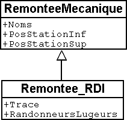
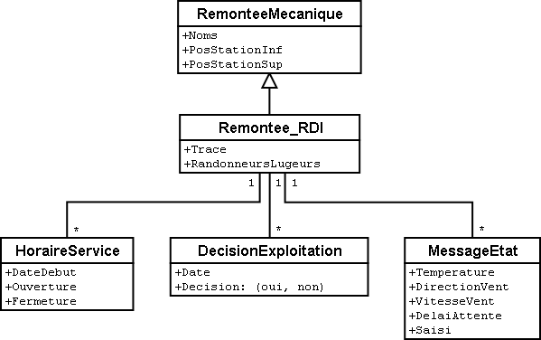
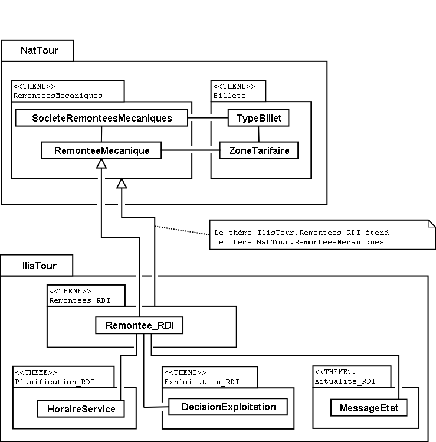
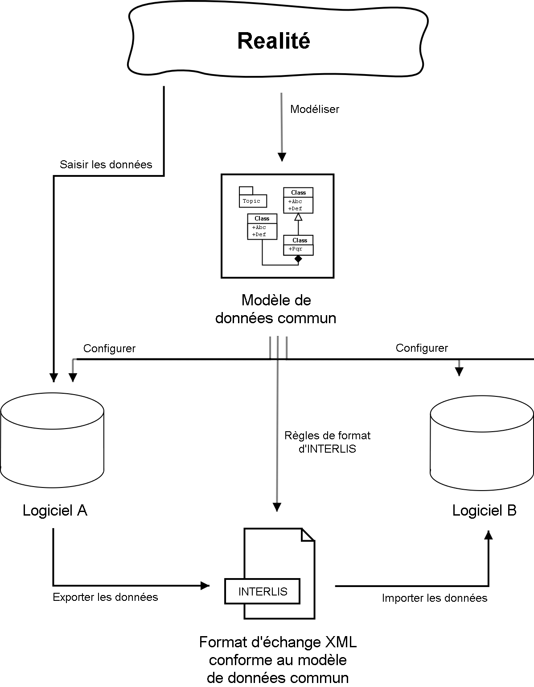

[#_2_3]
=== Le Val d'Ili en veut davantage

[#_2_3_1]
==== L'objectif

Le Val d'Ili ne souhaite en fait pas offrir le même service que celui proposé par l'Association nationale des offices de tourisme. Les prestations suivantes doivent venir le compléter :

* Indication des horaires de service et des délais d'attente sur les différentes lignes du réseau avec mention de la possibilité offerte ou non aux randonneurs et aux lugeurs de les emprunter ;
* Affichage des pistes avec leur niveau de difficulté et leur praticabilité actuelle ;
* Représentation figurative (avec indication des forêts et du réseau routier) ;
* Indication des auberges de la région ;
* Indication de la localisation des bâtiments et de leurs adresses postales.

[#_2_3_2]
==== Le Val d'Ili sait faire bon usage des informations existantes

Bien évidemment, on ne souhaiterait pas avoir à saisir les données concernant les forêts et le réseau routier, requises par la représentation figurative, puisque le service des constructions dispose des données de la mensuration officielle qui les intègrent déjà. Et le service des constructions a commencé à saisir les adresses de bâtiments dans le respect de la nouvelle norme. Il ne serait donc pas très judicieux de répéter toutes ces définitions dans le modèle de données du Val d'Ili. C'est pourquoi les Ilinois souhaiteraient réutiliser les modèles existants de la mensuration officielle et des adresses de bâtiments.

[NOTE]
====
Un modèle de données n'est pas une description isolée, il peut s'appuyer sur d'autres modèles de données préexistants.

_Notions apparentées au modèle de données, du point de vue de son organisation : module, paquet voire package, ..._
====

.Le modèle de données de l'office du tourisme du Val d'Ili (IlisTour) n'a nul besoin de tout redéfinir. Il peut prendre appui sur des modèles préexistants et utiliser certaines parties du modèle de l'Association nationale des offices de tourisme (NatTour), des bases nationales béotiennes, de la mensuration officielle, des adresses de bâtiments ou d'autres bases à caractère général. Les lignes pointillées se terminant par des flèches pleines désignent des relations de dépendance. Il est fréquent que la base à caractère général soit représentée dans la partie supérieure du graphique et le cas particulier dans la partie inférieure, quoique l'inverse soit également très répandu.
image::img/image12.png[]

[#_2_3_3]
==== Le Val d'Ili va plus loin que l'Association nationale

Les Ilinois ne veulent toutefois pas utiliser le modèle de l'Association nationale des offices de tourisme tel quel. Le tracé de chacune des lignes du réseau doit ainsi être décrit pour qu'une représentation figurative soit possible. On souhaite par ailleurs indiquer si la ligne est ouverte aux randonneurs et aux lugeurs, fournir ses horaires et signaler les délais d'attente actuels. Définir une classe spécifique pour les remontées mécaniques du Val d'Ili semble alors assez logique. Mais comment procéder : les attributs de la classe de société de remontées mécaniques de l'Association nationale doivent-ils être repris ? Et quid du problème de la relation entre les remontées mécaniques et les zones tarifaires ? Que signifierait une classe spécifique pour cette relation ?

Par chance, l'héritage existe et permet de dénouer de telles situations.

.La Remontee++_++RDI est une remontée mécanique d'un genre particulier, intégrant des attributs supplémentaires : tracé de la ligne et ouverture aux randonneurs et aux lugeurs. La ligne en trait plein à flèche évidée signale une spécialisation.

[NOTE]
====
La classe Remontee_RDI du Val d'Ili constitue une extension de la classe des remontées mécaniques. Elle hérite ainsi de toutes les propriétés des remontées mécaniques et en rajoute d'autres [l'héritage est décrit plus en détail au <<_5>>].

_Notions apparentées à l'extension : spécialisation, sous-classe, ..._
====

Serait-il judicieux d'intégrer à présent les attributs que sont les horaires de service et les délais d'attente actuels dans la classe Remontee++_++RDI du Val d'Ili ? Si l'horaire était un attribut direct de la classe Remontee++_++RDI, on pourrait imaginer la définition d'un horaire unique pour chacune des lignes, à savoir celui actuellement en service. Le responsable de l'exploitation fixe cependant les horaires au début de chaque nouvelle saison : certaines remontées ne sont pas en service en début de saison, d'autres sont arrêtées durant la pause déjeuner ; à Noël, les remontées tournent en continu de 9h00 à 15h30 ; à partir de la mi-février, lorsque les journées commencent à rallonger, l'exploitation est progressivement prolongée jusqu'à 16h30. Enfin, les conditions météorologiques et le niveau d'enneigement peuvent contraindre l'exploitant à fermer temporairement certaines lignes.

.Les horaires sont désormais définis comme des objets indépendants.

Si l'on impose en outre qu'un horaire spécifique peut s'appliquer à plusieurs lignes, le volume de travail requis par la saisie s'en trouve encore un peu plus réduit. Une telle démarche est en revanche dénuée de sens pour les délais d'attente. En effet, un délai d'attente observé à un moment donné doit être affecté à la ligne à laquelle il s'applique. Et pourquoi alors ne pas fixer le délai d'attente directement dans la classe Remontee++_++RDI ? Les raisons suivantes militent en défaveur de cette option :

* La mémorisation des délais d'attente en tant qu'objets indépendants permet de les réexploiter ultérieurement (à des fins statistiques par exemple).
* Le rythme des modifications ainsi que la responsabilité des valeurs enregistrées sont très différents de ce qu'ils sont pour les attributs de la classe Remontee++_++RDI.

[WARNING]
Il convient toujours, s'agissant de propriétés semblant pouvoir être affectées sans la moindre hésitation à une classe donnée, de se demander si cette démarche est la bonne ou s'il ne serait pas plus judicieux de les déplacer vers des classes indépendantes pour les affecter par l'intermédiaire de relations.

Une telle réflexion privilégie la situation effective par rapport à l'utilisation prévue, par exemple des représentations. Mais il ne faut pas pour autant négliger les questions relatives à l'organisation. Qui est responsable de la mise à jour des données ? A quel rythme sont-elles actualisées ?

Dans le modèle de l'Association nationale, les sociétés de remontées mécaniques sont responsables de la mise à jour des données de leur propre réseau. Les Ilinois souhaiteraient faire usage du modèle de l'Association nationale, pour ce qui concerne les remontées mécaniques, mais seraient toutefois désireux de l'étendre pour les Remontées mécaniques de la Dent d'Ili.

[NOTE]
Les modèles de données sont subdivisés en *thèmes* afin de tenir compte au mieux des questions de nature organisationnelle (telles que des compétences ou des rythmes de mise à jour différents).

Le modèle du Val d'Ili étend par conséquent le thème des remontées mécaniques prédéfini par l'Association nationale en Remontees++_++RDI. Cette extension locale prévoit que la classe Remontee++_++RDI spécialise la classe des remontées mécaniques et l'étend par des attributs supplémentaires.

La saisie des horaires, des décisions relatives à l'exploitation et des messages d'état ne relevant pas de la compétence d'un seul service et s'effectuant surtout à des rythmes très différents, un thème spécifique a été défini pour chacune de ces informations (Planification++_++RDI, Exploitation++_++RDI, Actualite++_++RDI).

.Le modèle du Val d'Ili (IlisTour) étend le modèle de l'Association nationale des offices de tourisme (NatTour). IlisTour hérite du thème des remontées mécaniques de NatTour, étend la classe RemonteeMecanique en Remontee++_++RDI et y adjoint plusieurs thèmes dévolus à la planification, à l'exploitation et à l'actualité.

[NOTE]
L'héritage peut s'effectuer à petite échelle (classes d'objets) comme à plus grande échelle (thèmes entiers).

[#_2_3_4]
==== Les spécialités du Val d'Ili

Les Ilinois souhaiteraient de plus décrire les pistes et les auberges. C'est pourquoi ils complètent leur modèle par des thèmes supplémentaires.

.Le modèle de l'office du tourisme du Val d'Ili est complété par des thèmes supplémentaires.
image::img/image16.png[]

De nouvelles questions apparaissent lorsque vient le tour des auberges. Comment par exemple faire figurer le snack INTERLUNCH ? On connaît son adresse, au 27 de la rue principale. Mais cela ne nous indique pas le symbole par lequel le représenter ! La solution réside dans l'utilisation des adresses de bâtiments qui comportent une classe d'entrée d'immeuble intégrant également un attribut de position (exprimée en coordonnées nationales). Ainsi, on ne fera figurer aucune adresse dans la classe des auberges mais on définira une relation avec l'entrée de l'immeuble. Concrètement, l'objet correspondant à l'hôtel des Cimes sera mis en relation avec l'objet d'entrée d'immeuble décrivant le 27 de la rue principale.

[#_2_3_5]
==== Comment les Ilinois donnent-ils une traduction concrète à leurs spécialités ?

Une modélisation tient compte des exigences posées, mais ne gère pas leur traduction concrète, laquelle offre en principe une totale liberté. Les Remontées mécaniques de la Dent d'Ili se sont décidées pour un logiciel standardisé (LiftSys) qui ne peut toutefois traiter des données qu'en conformité avec le modèle étendu. Il est bien entendu possible de renoncer à la classe des remontées mécaniques et d'intégrer ses attributs à la classe Remontee++_++RDI.

.Le logiciel envisagé par l'office du tourisme du Val d'Ili peut se contenter de respecter le modèle conceptuel dans ses grandes lignes. Il peut par exemple fusionner en interne deux classes d'objets au sein d'une classe unique. La seule chose importante est que le logiciel soit en mesure de livrer les données dans le format correspondant aux exigences posées par le modèle conceptuel.
image::img/image17.png[]

Diverses autres questions se posent, analogues au problème soulevé par le traitement concret des classes conformément au concept défini, concernant la manière dont un système informatique traduit concrètement les représentations liées au modèle conceptuel.

[#_2_3_6]
==== Comment les Ilinois transmettent-ils leurs données à l'Association nationale des offices de tourisme ?

Une fois le logiciel LiftSys installé et les données saisies, la question de leur transmission à l'Association nationale se pose à nouveau. L'Association ne souhaite pas recevoir la totalité des données mais uniquement celles présentant de l'intérêt pour elle. Elle n'a par exemple que faire des pistes ou de l'ouverture de certaines lignes aux randonneurs et aux lugeurs.

[NOTE]
Un transfert de données INTERLIS intègre toujours les données d'un ou de plusieurs thèmes.

Les Ilinois souhaitent par conséquent transmettre les données des thèmes Remontées mécaniques et Billets à l'Association nationale. Mais comment un logiciel peut-il générer un fichier de transfert correct puisque son concepteur n'avait même pas idée des spécifications propres à l'Association des offices de tourisme ? La solution réside dans le _transfert à base de modèle_.

[NOTE]
Dans le cas d'un *transfert à base de modèle*, il n'existe pas de *format de transfert* figé à respecter. C'est au contraire le format qui s'adapte aux contraintes propres au modèle de données.

Toute méthode de modélisation (telle qu'INTERLIS ou les définitions à l'aide desquelles un logiciel donné est installé) met un certain nombre de moyens d'expression (classes d'objets, attributs, types, relations, tables, colonnes, etc.) à disposition. Et pour chacun de ceux-ci, ses répercussions sur le transfert sont régies indépendamment du modèle de données concret. On ne peut donc commencer à parler d'un format de transfert concret, donc de la succession des caractères représentant les différentes données, qu'une fois que le modèle de données associé est parfaitement connu. Autrement dit, le format de transfert résulte directement du modèle de données.

Si LiftSys était en mesure d'organiser directement le modèle de données interne dans le respect du modèle de données conceptuel et s'il permettait par ailleurs de convertir les données dans des fichiers de transfert conformément aux spécifications d'INTERLIS, tout serait pour le mieux. Les fichiers de transfert pourraient être créés aussi simplement que dans le cas du logiciel de test de l'Association.

Le logiciel du service des constructions (ConstSys) permet par exemple la génération de fichiers en conformité avec INTERLIS 2. Mais il ne reconnaît que des tables isolées pouvant chacune comporter plusieurs colonnes. Les règles de format d'INTERLIS étant conçues de telle façon que la structure d'héritage ne se reflète pas directement dans le fichier de transfert, ConstSys pourrait permettre de créer directement des fichiers corrects. La conversion des données internes en données externes peut être représentée comme suit :

.Les données internes du logiciel A sont converties dans un fichier de transfert dont l'organisation se déduit du modèle de données, en conformité avec les règles de format d'INTERLIS. Les données peuvent ensuite être importées dans le logiciel B. La condition à cela étant que les logiciels impliqués dans l'opération aient été configurés dans le respect du modèle de données.

LiftSys n'accepte pas INTERLIS. Et maintenant ? Les Remontées mécaniques de la Dent d'Ili doivent-elles se mettre en quête d'un nouveau logiciel ? La solution est beaucoup plus simple : LiftSys exporte les données dans un format différent et celles-ci sont reformatées pour se conformer aux règles d'INTERLIS à l'aide d'un logiciel de conversion. Ce dernier peut soit être développé spécifiquement pour notre modèle de données concret, soit être développé dans une optique plus générale en tant qu'outil fondé sur un modèle.

.Un convertisseur génère des fichiers INTERLIS à partir d'un format spécifique à un système informatique donné.
image::img/image19.png[]

Après que tout ait parfaitement fonctionné, le fichier est transmis à l'Association nationale. Leur réponse ne tarde pas : « Bien, à une exception près, il y a un problème au niveau du nom du télésiège de la Crête d'Ili ! » Ouf – et pourtant, nous aurions dû le savoir ! Combien de fois n'avons-nous pas été confrontés au sempiternel problème des accents dans le courrier électronique : « Crête d'Ili ».

Deux choses sont à distinguer clairement :

[NOTE]
Le *jeu de caractères* définit les caractères qu'il est permis d'utiliser dans les attributs de type textuel.

[NOTE]
Le *codage de caractères* définit la configuration binaire représentant le caractère dans le système informatique.

Les accents appartiennent au jeu de caractères permis par INTERLIS. Mais on a omis, lors de la conversion, d'indiquer correctement le codage des caractères provenant de LiftSys. Une fois cette correction effectuée, l'Association a renvoyé un écho positif au Val d'Ili.

[#_2_3_7]
==== Que fait l'Association nationale des offices de tourisme avec les données du Val d'Ili ?

Un point intrigue cependant les Ilinois : qu'est-ce que le système informatique de l'Association nationale des offices de tourisme (NatTourSys) a bien pu faire des attributs supplémentaires (le tracé et l'ouverture éventuelle des lignes aux randonneurs et aux lugeurs) ? Et bien c'est très simple : NatTourSys les a ignorés.

[NOTE]
La *lecture polymorphe* permet de lire des données respectant un modèle « réduit », c'est à dire un modèle n'ayant pas encore connaissance des extensions réalisées ultérieurement.

Les Ilinois ont transmis leurs données de telle façon qu'elles contiennent toutes les extensions que recèle le modèle du Val d'Ili. Les règles de transfert d'INTERLIS veillent à ce que les données puissent cependant être lues dans le respect du modèle de l'Association nationale des offices de tourisme sans que le logiciel de lecture soit troublé par les données supplémentaires. La seule condition est que le modèle conformément auquel les données ont été générées soit une extension du modèle utilisé par le récepteur des données. Le modèle du Val d'Ili doit donc étendre celui de l'Association nationale des offices de tourisme.

Le <<_5>> vous expliquera plus en détail l'utilité des extensions. Le <<_8>> est quant à lui consacré aux détails du transfert de données.

La possibilité est laissée au destinataire de lire directement les données dans son logiciel ou d'intercaler un logiciel de conversion entre la réception et sa lecture. Et l'on retrouve ici le problème de l'interprétation correcte des caractères concrets des attributs de type textuel. Il n'est pas impossible que le « ê » de la Crête d'Ili soit codé de façon différente dans LiftSys, dans le fichier de transfert et dans NatTourSys, l'important étant cependant qu'il soit clair pour tous les logiciels qu'il s'agit bien d'un caractère « ê ».

[#_2_4]
