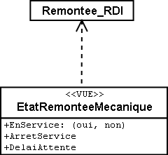

[#_2_4]
=== Le Val d'Ili y est parvenu

[#_2_4_1]
==== Vue d'ensemble du système

La solution retenue pour le site Internet est relativement simple : le plan de situation est généré par le logiciel LiftSys sous forme d'image statique puis mis à la disposition d'un système de présentation sur le réseau (WebSys). Plusieurs zones de l'image seront repérées pour permettre l'accès aux informations d'état actuelles des lignes. Cliquer au sein de l'une de ces zones avec la souris aura pour effet de faire apparaître les données de situation les plus actuelles concernant cette ligne. Les hôtels disposant encore de chambres libres doivent également être repérés par une signalisation particulière.

[#_2_4_2]
==== Seul l'état actuel présente de l'intérêt pour le site Internet

Les Ilinois ont consenti bien des efforts pour structurer proprement leur modèle, en particulier pour ce qui concerne les données relatives à l'exploitation des lignes et des pistes. Malheureusement, le logiciel assurant la mise à jour en continu du site Internet n'est pas en mesure de sélectionner l'état actuel parmi la multitude d'horaires, de décisions d'exploitation et de messages d'état à sa disposition. L'exploitant souhaiterait d'une part obtenir les données relatives au thème Billets++_++RDI à chaque nouvelle modification et il aimerait d'autre part recevoir un message toutes les 20 minutes concernant l'état de fonctionnement des remontées mécaniques.

[NOTE]
====
Une *vue* définit des données reflétant le point de vue d'un utilisateur et devant à ce titre être déduites des données originales.

_Notions apparentées : données dérivées, view..._
====

La vue requise relie les horaires, les décisions d'exploitation et les délais d'attente à la remontée mécanique à laquelle ils sont affectés, conformément à la relation existante, et les filtre de telle façon à ne décrire que l'état actuel.

[NOTE]
Du point de vue de l'utilisation, les objets-vues peuvent être interprétés comme des objets de données, raison pour laquelle les vues sont également décrites au moyen de classes.

.L'état de la ligne n'est pas une classe d'objets indépendante mais se déduit d'une vue de Remontee++_++RDI. La vue regroupe l'ensemble des données nécessaires pour la représentation sur un site Internet.

[#_2_4_3]
==== Présenter les hôtels disposant de chambres libres sur le site Internet

WebSys a bien évidemment besoin des informations correspondantes pour pouvoir indiquer les hôtels dans lesquels il reste des chambres inoccupées. Une vue est définie à cette fin, comme c'est le cas pour les états des lignes. Elle regroupe d'une part les données requises sur les auberges et d'autre part les coordonnées planimétriques de l'entrée d'immeuble affectée à chaque auberge.

[NOTE]
INTERLIS permet également de *définir les symboles requis indépendamment de tout système* et de décrire la conversion de données originales ou de données de vues en représentation *graphique*.

Malheureusement, WebSys n'est pas en mesure de traiter de telles descriptions de conversions. Le logiciel est toutefois capable de lire les définitions des symboles. Il peut en outre accepter des données indiquant quel symbole est à représenter à quelle position et effectuer ensuite la représentation en conséquence. Une autre possibilité d'INTERLIS peut ainsi être exploitée, elle à disposition dans LiftSys.

[NOTE]
Avec INTERLIS, il est possible de transférer des donnés graphiques déjà converties.

Par conséquent, LiftSys ne livre pas les données des vues des hôtels à WebSys mais procède lui-même à leur conversion en données graphiques. La structure exacte des données graphiques peut à son tour être définie au moyen de classes. Les attributs les plus courants de telles données sont la position, le nom du symbole ou la couleur.

