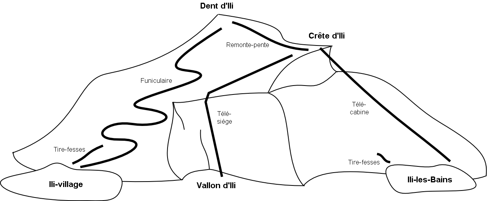

[#_4]
== Application à l'exemple du Val d'Ili

[#_4_1]
=== Aperçu général du modèle de données

.Le modèle de données en représentation UML. Les thèmes, les structures, les domaines de valeurs et les attributs n'ont pas été représentés pour des raisons évidentes de lisibilité. Nous renvoyons à ce sujet le lecteur au <<_6>> abordant ces questions plus en détail.
image::img/image21.png[width=357,height=448]

[#_4_2]
=== Le modèle de données en notation INTERLIS

Le modèle de base national, le modèle de l'Association nationale des offices de tourisme ainsi que le modèle de l'office de tourisme du Val d'Ili sont reproduits en totalité dans les pages suivantes. Les modèles sont abondamment commentés. Des cases renvoient par ailleurs aux paragraphes du texte abordant le thème concerné en détail.

Nous recommandons un bref survol du modèle de données de notre exemple avant la lecture des chapitres 5 à 8 revenant plus longuement sur certains de ses aspects.

[#_4_2_1]
==== Beotie.ili – Modèle de base national

[source]
----
!! Le present modele a ete redige dans la version 2.3 d’INTERLIS.
INTERLIS 2.3;

!! Le modele de base national ne comprend pas de donnees mais definit
!! quelques types et unites afin que d’autres modeles puissent y faire reference.
TYPE MODEL Beotie AT "http://www.interlis.ch/models/beotie"
  VERSION "2008-01" =

  IMPORTS UNQUALIFIED INTERLIS;
  !! Le modele de base national s’appuie sur
  !! les modeles de base suivants d’INTERLIS.
  !! Units : unites telles que les degres Celsius par exemple
  !! CoordSys : fondements des systemes de coordonnees
  IMPORTS Units;
  IMPORTS CoordSys;

  !! Le Val d’Ili se trouve en Beotie, pays dont la monnaie est la couronne.
  !! La couronne est une unite (UNIT) monetaire (MONEY). Le modele des unites
  !! (Units) definit differentes monnaies, telles que le franc suisse, l’euro ou
  !! le dollar US, mais la couronne beotienne n’en fait pas partie.
  UNIT
    Couronne EXTENDS MONEY;

  !! En Beotie, l’heure est indiquee dans le fuseau horaire local,
  !! en heure beotienne.
  REFSYSTEM BASKET TimeSystems ~ INTERLIS.TIMESYSTEMS
    OBJECTS OF TIMEOFDAYSYS: HB; !! HeureBeotie

  !! Le systeme de cordonnees de la Beotie.
  REFSYSTEM BASKET CoordSystems ~ CoordSys.CoordsysTopic
    OBJECTS OF GeoCartesian2D: SysBeotie
    OBJECTS OF GeoHeight: SysBeotieAlt;

  DOMAIN
    CoordNational = COORD 500.00 .. 91000.00 [m]
                            {CoordSystems.SysBeotie[1]},
                          700.00 .. 23000.00 [m]
                            {CoordSystems.SysBeotie[2]},
                          ROTATION 2 -> 1;
    CoordNational3 = COORD 500.00 .. 91000.00 [m]
                             {CoordSystems.SysBeotie[1]},
                           700.00 .. 23000.00 [m]
                             {CoordSystems.SysBeotie[2]},
                          -200.00 .. 14000.00 [m]
                             {CoordSystems.SysBeotieAlt[1]},
                           ROTATION 2 -> 1;

  STRUCTURE Duree (ABSTRACT) =
  END Duree;

  STRUCTURE DureeImplicite EXTENDS Duree =
    LapsTemps: MANDATORY (Jour, Semaine, Mois, Annee);
  END DureeImplicite;

  STRUCTURE DureeExplicite (ABSTRACT) EXTENDS Duree =
    LapsTemps (ABSTRACT): MANDATORY NUMERIC [TIME];
  END DureeExplicite;

  STRUCTURE DureeEnMinutes EXTENDS DureeExplicite =
    LapsTemps (EXTENDED): MANDATORY 0 .. 200 [Units.min];
  END DureeEnMinutes;

  STRUCTURE DureeEnJours EXTENDS DureeExplicite =
    LapsTemps (EXTENDED): MANDATORY 0 .. 1000 [Units.d];
  END DureeEnJours;

  STRUCTURE Instant (ABSTRACT) =
  END Instant;

  STRUCTURE HeureJourBeotie EXTENDS INTERLIS.TimeOfDay =
    Hours (EXTENDED): 0..23 CIRCULAR [INTERLIS.h];
  END HeureJourBeotie;

  DOMAIN
    HeureJourXMLBeotie = FORMAT BASED ON HeureJourBeotie
      ( Hours/2 ":" Minutes ":" Seconds );

END Beotie.
----

[#_4_2_2]
==== Adresses.ili – Modèle des adresses de bâtiments

Le modèle des adresses de bâtiments n'est pas reproduit car il couvrirait plusieurs pages dont seule une petite partie serait d'intérêt dans le contexte du Val d'Ili. Le modèle de l'office de tourisme du Val d'Ili établit cependant une relation entre les auberges et l'entrée d'immeuble définie dans le modèle des adresses.

[source]
----
INTERLIS 2.3;

MODEL Adresses AT "http://www.interlis.ch/models/beotie"
  VERSION "2008-01" =

  TOPIC Batiments =

    CLASS EntreeImmeuble =
      !! ...
    END EntreeImmeuble;

  END Batiments;

END Adresses.
----

[#_4_2_3]
==== NatTour.ili – Modèle de l'Association nationale des offices de tourisme

[source]
----
INTERLIS 2.3;

CONTRACTED MODEL NatTour AT "http://www.interlis.ch/models/beotie"
  VERSION "2008-01" =

  !! Le modele de l’Association nationale des offices de tourisme s’appuie a son
  !! tour sur le modele de base national beotien.
  IMPORTS Units, CoordSys, Beotie;

  FUNCTION Multiply(factor1 : NUMERIC; factor2 : NUMERIC) : NUMERIC;

  !! Une designation englobe un nom de meme que la langue dans
  !! laquelle ce nom est exprime.
  STRUCTURE Designation =
    !! La longueur du nom n’est pas limitee.
    Nom: TEXT;
    !! Code de langue a deux caracteres selon ISO 639.
    !! Exemples : de = allemand, fr = francais,
    !! it = italien, rm = romanche, en = anglais.
    Langue: TEXT*2;
  END Designation;

  TOPIC RemonteesMecaniques =

    !! La designation d’une remontee mecanique est identique
    !! a une designation courante (sauf qu’elle comprend au
    !! plus 100 caracteres), mais comporte en plus une forme
    !! abregee du nom, par exemple "RDI" pour les Remontees
    !! mecaniques de la Dent d’Ili.
    STRUCTURE DesignationEntreprise EXTENDS Designation =
      Nom (EXTENDED): TEXT*100;
      NomAbrege: TEXT*10;
    END DesignationEntreprise;

    !! Une societe de remontees mecaniques exploite un reseau de lignes.
    CLASS SocieteRemonteesMecaniques =
      !! Les noms de cette societe de remontees mecaniques, en differentes langues
      !! le cas echeant. Un (1) nom au moins doit etre connu, il n’existe par
      !! ailleurs aucune limite superieure (*) au nombre de noms.
      Noms: BAG {1..*} OF DesignationEntreprise;
      !! Il ne doit exister qu’une seule designation de la
      !! remontee par langue : les Remontees mecaniques de
      !! la Dent d’Ili ne peuvent ainsi posseder qu’un seul
      !! nom en italien. Toutefois, cette restriction ne s’applique que localement,
      !! donc a une societe de remontees mecaniques donnee. Ainsi, les Remontees
      !! mecaniques des montagnes bleues peuvent elles aussi disposer d’un nom en
      !! italien.
    UNIQUE
      (LOCAL) Noms : Langue;
    END SocieteRemonteesMecaniques;

    CLASS RemonteeMecanique =
      !! Les noms de cette remontee mecanique, eventuellement en differentes
      !! langues. Un (1) nom au moins doit etre connu, il n’existe par ailleurs
      !! aucune limite superieure (*) au nombre de noms.
      Noms: BAG {1..*} OF Designation;
      PosStationInf: Beotie.CoordNational;
      PosStationSup: Beotie.CoordNational;
      DureeTrajet: Beotie.DureeEnMinutes;
      !! Le genre exact de ligne dont il s’agit.
      Genre: (CheminFerCremaillere,
              Funiculaire,
              Telepherique,
              Remonte_pente,
              Telesiege,
              Telecabine);
    END RemonteeMecanique;

    ASSOCIATION =
      !! Indication des lignes exploitees par une societe donnee.
      !! Exemple: les "Remontees mecaniques de la Dent d’Ili" exploitent le
      !! funiculaire "Ili-village - Dent d’Ili", le telecabine
      !! "Ili-les-Bains-Crete d’Ili" et le remonte-pente "Crete d’Ili-Dent d’Ili".
      !! Une societe de remontees mecaniques peut exploiter un nombre quelconque
      !! {*} de remontees mecaniques et il en existe un seul {1} exploitant par
      !! ligne.
      !! Les caracteres -- representent une relation ordinaire, -<>signifie que la
      !! relation est un peu plus intense qu’a l’ordinaire, il s’agit de ce que
      !! l’on appelle une agregation.
      Exploitant -<> {1} SocieteRemonteesMecaniques;
      Ligne_Remontee -- {*} RemonteeMecanique;
    END;

    ASSOCIATION =
      Filiale -- {*} SocieteRemonteesMecaniques;
      Mere -- {0..1} SocieteRemonteesMecaniques;
    END;

  END RemonteesMecaniques;

  TOPIC Billets =
    DEPENDS ON RemonteesMecaniques;
    !! Les durees implicitement definies au niveau national
    !! sont le jour, la semaine, le mois et l’annee. Il existe
    !! une duree implicite supplementaire dans le cas des billets, a savoir
    !! la saison (pour les forfaits a la saison).

    STRUCTURE DureeImplicite EXTENDS Beotie.DureeImplicite =
      LapsTemps (EXTENDED): (Saison);
    END DureeImplicite;

    !! Une zone dans laquelle un type de billet donne est
    !! valable.
    CLASS ZoneTarifaire (ABSTRACT) =
    END ZoneTarifaire;

    CLASS ZoneTarifaireExplicite EXTENDS ZoneTarifaire =
    END ZoneTarifaireExplicite;

    !! Un type de billets, par exemple le forfait hebdomadaire "Ilosaurus".
    CLASS TypeBillet =
      !! Les noms de ce type de billets, en differentes langues le cas echeant.
      !! Un (1) nom au moins doit etre connu, il n’existe par ailleurs
      !! aucune limite superieure (*) au nombre de noms.
      Noms: BAG {1..*} OF Designation;
      !! Le prix d’un billet exprime en couronnes, monnaie
      !! definie dans le modele de base national beotien.
      Prix: MANDATORY 0.00 .. 9999.99 [Beotie.Couronne];
      !! La duree de validite d’un billet. Elle peut etre explicite,
      !! par exemple pour des billets valables durant 120 minutes, ou
      !! implicite, par exemple pour des forfaits hebdomadaires ou a la saison.
      DureeValidite: MANDATORY Beotie.Duree;
    END TypeBillet;

    ASSOCIATION =
      ZoneTarifaire -- {1} ZoneTarifaire;
      TypeBillet -- {*} TypeBillet;
    END;

    ASSOCIATION Validite (ABSTRACT) =
      RemonteeMecanique (EXTERNAL) -- {*} NatTour.RemonteesMecaniques
                                          .RemonteeMecanique;
      ZoneTarifaire -- {*} ZoneTarifaire;
    END Validite;

    !! Une relation entre la remontee mecanique et la zone tarifaire,
    !! non derivee mais entree manuellement.
    ASSOCIATION ValiditeExplicite EXTENDS Validite =
      ZoneTarifaire (EXTENDED) -- ZoneTarifaireExplicite;
    END ValiditeExplicite;

    ASSOCIATION Pourcentage =
      Participant (EXTERNAL) -- {*} NatTour.RemonteesMecaniques
                                    .SocieteRemonteesMecaniques;
      TypeBillet -- {*} TypeBillet;
    ATTRIBUTE
      Pourcentage: 0.0 .. 100.0 [Units.Percent];
    END Pourcentage;

    CLASS PointVente =
      Noms: BAG {1..*} OF Designation;
    END PointVente;

    CLASS Saison =
      Debut: FORMAT INTERLIS.XMLDate "1900-1-1" .. "2299-12-31";
      Fin: FORMAT INTERLIS.XMLDate "1900-1-1" .. "2299-12-31";
    END Saison;

    ASSOCIATION Vente =
      PointVente -- {*} PointVente;
      Saison -- {*} Saison;
      TypeBillet -- {*} TypeBillet;
    ATTRIBUTE
      Nombre: 1 .. 999999 [Units.CountedObjects];
      Montant: 0.00 .. 9999999.99 [Beotie.Couronne]
        := Multiply(Nombre, TypeBillet -> Prix);
    END Vente;

  END Billets;

END NatTour.
----

[#_4_2_4]
==== IlisTour.ili – Modèle de l'office de tourisme du Val d'Ili

[source]
----
INTERLIS 2.3;

CONTRACTED MODEL IlisTour AT "http://www.interlis.ch/models/beotie"
  VERSION "2008-01" =

!! Pour que ce modele puisse etre mis en oeuvre, un logiciel
!! doit prendre en charge la fonction BeotieVersWGS84.
!! Cette condition ne peut pas etre simplement supposee mais doit faire l’objet
!! d’un contrat etabli avec le developpeur. La necessite d’un tel contrat est
!! signalee via CONTRACTED.

  IMPORTS UNQUALIFIED INTERLIS;
  IMPORTS Units, CoordSys, Beotie, Adresses, NatTour;

  !! Un service specifique doit etre propose aux touristes en possession de
  !! recepteurs GPS basiques. Ceux-ci leur presentent des coordonnees dans le
  !! systeme WGS84, exprimees en unites angulaires : degres, minutes et secondes;
  !! l’unite correspondante est deja definie dans le modele des unites d’INTERLIS.
  REFSYSTEM BASKET CoordSystems ~ CoordSys.CoordsysTopic
    OBJECTS OF GeoEllipsoidal: WGS84
    OBJECTS OF GeoHeight: WGS84A;

  DOMAIN
    WGS84Coord = COORD -90.00000 ..  90.00000 [Units.Angle_Degree] {WGS84[1]},
                         0.00000 .. 359.99999 CIRCULAR [Units.Angle_Degree]
                                                       {WGS84[2]},
                        -2000.00 ..   9000.00 [m] {WGS84A[1]};

    LigneBeotie (ABSTRACT) = POLYLINE VERTEX Beotie.CoordNational;
    LigneBeotieNormale EXTENDS LigneBeotie = POLYLINE WITH (STRAIGHTS, ARCS);
    LigneBeotieOrientee EXTENDS LigneBeotieNormale = DIRECTED POLYLINE;
    SurfaceBeotie = SURFACE WITH (STRAIGHTS, ARCS) VERTEX Beotie.CoordNational
                    WITHOUT OVERLAPS > 0.02;
    PartitionTerritoireBeotie EXTENDS SurfaceBeotie = AREA;

  !! Conversion de coordonnees nationales beotiennes en WGS84.
  FUNCTION BeotieVersWGS84 (Bo: Beotie.CoordNational): WGS84Coord;
  FUNCTION InSurface (Position: Beotie.CoordNational;
                      Secteur: SurfaceBeotie): BOOLEAN;

  TOPIC Remontees_RDI EXTENDS NatTour.RemonteesMecaniques =

    CLASS Remontee_RDI EXTENDS NatTour.RemonteesMecaniques.RemonteeMecanique =
      !! Dans le Val d’Ili, il existe une remontee mecanique
      !! d’un type un peu particulier : le bus des neiges.
      Genre (EXTENDED): (BusDesNeiges);
      !! L’Association nationale des offices de tourisme ne s’interesse pas aux
      !! altitudes. Celles-ci revetent cependant une grande importance dans une
      !! station de sports d’hiver telle que le Val d’Ili. C’est pourquoi les
      !! positions sont saisies sous forme de coordonnees tridimensionnelles dans
      !! le Val d’Ili (altitudes comprises), ce qui constitue ainsi une extension
      !! par rapport au modele national.
      PosStationInf (EXTENDED): Beotie.CoordNational3;
      PosStationSup (EXTENDED): Beotie.CoordNational3;
      PosStationInfWGS: WGS84Coord := BeotieVersWGS84(PosStationInf);
      PosStationSupWGS: WGS84Coord := BeotieVersWGS84(PosStationSup);
      !! Une web-cam est installee sur certaines lignes, filmant en continu les
      !! alentours de la station superieure afin que les touristes tentes de s’y
      !! rendre puissent voir si le jeu en vaut la chandelle. L’acces a la
      !! remontee concernee informe l’usager de l’emplacement auquel l’image
      !! actuelle peut etre consultee, via un identifiant URI (Uniform
      !! Resource Identifier, adresse sur Internet).
      ImageStationSuperieure: URI;
      Trace: LigneBeotieNormale;
      RandonneursLugeurs: (inadapte, adapte);
    END Remontee_RDI;

    VIEW CheckTraceeStartAndEndPoint
      INSPECTION OF Tracee ~ Remontee_RDI -> Trace;
    =
    MANDATORY CONSTRAINT
      !! La station inferieure doit etre le premier point du
      !! trace et la station superieure son dernier point.
      Tracee -> Segments[FIRST] -> SegmentEndPoint == PARENT -> PosStationInf
        AND
      Tracee -> Segments[LAST] -> SegmentEndPoint == PARENT -> PosStationSup;
    END CheckTraceeStartAndEndPoint;

    !! Une zone tarifaire particuliere concernant l’ensemble des lignes traversant
    !! un secteur bien delimite au plan geographique.
    CLASS ZoneTarifaireDansSecteur EXTENDS NatTour.Billets.ZoneTarifaire =
      Secteur: SurfaceBeotie;
    END ZoneTarifaireDansSecteur;

    !! Une vue englobant toutes les remontees mecaniques dont les stations
    !! inferieures et superieures se trouvent dans le secteur d’une zone tarifaire
    !! donnee. Bien sur, seules peuvent etre prises en compte les zones tarifaires
    !! decrites sous forme de secteur geographique (ZoneTarifaireDansSecteur);
    !! une zone tarifaire explicite serait denuee de signification ici.
    VIEW RemonteesMecaniquesDansSecteur
      JOIN OF RM ~ NatTour.RemonteesMecaniques.RemonteeMecanique,
              ZT ~ ZoneTarifaireDansSecteur;
    WHERE InSurface(RM -> PosStationInf, ZT -> Secteur) AND
          InSurface(RM -> PosStationSup, ZT -> Secteur);
    =
    END RemonteesMecaniquesDansSecteur;

    !! Une relation entre le type de billet et la zone
    !! tarifaire qui n’est pas entree manuellement mais se
    !! deduit automatiquement de la position des stations
    !! inferieure et superieure.
    ASSOCIATION ValiditeDansSecteur EXTENDS NatTour.Billets.Validite
    DERIVED FROM RDS ~ RemonteesMecaniquesDansSecteur
    =
      RemonteeMecanique (EXTENDED) -- RemonteeMecanique := RDS -> RM;
      ZoneTarifaire (EXTENDED) -- ZoneTarifaireDansSecteur := RDS -> ZT;
    END ValiditeDansSecteur;

  END Remontees_RDI;

  TOPIC Auberges =
    DEPENDS ON Adresses.Batiments;

    CLASS Auberge =
      !! Les noms de cette auberge, en plusieurs langues le cas echeant.
      !! Un (1) nom au moins doit etre connu, il n’existe par ailleurs
      !! aucune limite superieure (*) au nombre de noms.
      Noms: BAG {1..*} OF NatTour.Designation;
      !! L’adresse Internet (Uniform Resource Identifier,
      !! URI en abrege) d’une photo de l’auberge.
      Photo: URI;
    END Auberge;

    !! Les Ilinois ne definissent pas eux-memes ce qu’ils entendent par une
    !! adresse. Ils etablissent a la place une relation entre une auberge et
    !! l’entree d’immeuble correspondante. Ils peuvent ainsi acceder aux
    !! coordonnees des auberges via les donnees de la mensuration officielle et
    !! se dispenser de les saisir eux-memes.
    ASSOCIATION =
      Auberge -- Auberge;
      Entree (EXTERNAL) -- Adresses.Batiments.EntreeImmeuble;
    END;

  END Auberges;

  TOPIC Planification_RDI =
    DEPENDS ON IlisTour. Remontees_RDI;

    CLASS HoraireService =
      DateDebut: INTERLIS.XMLDate;
      Ouverture: Beotie.HeureJourXMLBeotie;
      Fermeture: Beotie.HeureJourXMLBeotie;
    END HoraireService;

    ASSOCIATION =
      Ligne_Remontee (EXTERNAL) -<#> {1} IlisTour.Remontees_RDI.Remontee_RDI;
      HoraireService -- {*} HoraireService;
    END;

  END Planification_RDI;

  TOPIC Exploitation_RDI =
    DEPENDS ON IlisTour.Remontees_RDI;

    CLASS DecisionExploitation =
      Instant: INTERLIS.XMLDateTime;
      Decision: (oui, non);
    END DecisionExploitation;

    ASSOCIATION =
      Ligne_Remontee (EXTERNAL) -<#> {1} IlisTour.Remontees_RDI.Remontee_RDI;
      DecisionExploitation -- {*} DecisionExploitation;
    END;

  END Exploitation_RDI;

  TOPIC Actualite_RDI =
    DEPENDS ON IlisTour.Remontees_RDI;

    STRUCTURE InfoVent =
      DirectionVent: MANDATORY (N, NE, E, SE, S, SW, W, NW) CIRCULAR;
      VitesseVent: MANDATORY 0 .. 200 [Units.kmh];
    END InfoVent;

    CLASS MessageEtat =
      !! La temperature est indiquee en degres Celsius. Cette
      !! unite est definie dans le modeles des unites INTERLIS
      !! (Units). MANDATORY signifie que la temperature doit
      !! etre connue.
      Temperature: MANDATORY -50 .. 50 [Units.oC];
      !! L’attribut Vent se rapporte à la structure introduite ci-dessus
      !! InfoVent.
      Vent: InfoVent;
      DelaiAttente: Beotie.DureeEnMinutes;
      Saisi: MANDATORY INTERLIS.XMLDateTime;
    END MessageEtat;

    ASSOCIATION =
      Ligne_Remontee (EXTERNAL) -<#> {1} IlisTour.Remontees_RDI.Remontee_RDI;
      MessageEtat -- {*} MessageEtat;
    END;

  END Actualite_RDI;

  TOPIC Pistes =

    CLASS Piste =
      NiveauDifficulte: (bleu, rouge, noir: FINAL) ORDERED;
      TracePiste: LigneBeotieOrientee;
    END Piste;

  END Pistes;

  TOPIC EtatsPistes =

    CLASS EtatPiste =
      SurfacePreparee: PartitionTerritoireBeotie;
    END EtatPiste;

  END EtatsPistes;

END IlisTour.
----

[#_4_3]
=== Données du transfert

Les Ilinois doivent créer un fichier de transfert (à l'aide de leur logiciel) s'ils veulent transmettre la totalité de leurs données à l'Association nationale des offices de tourisme. Celui-ci sera en principe lu par un autre système informatique et n'aura donc pas à être consulté sous cette forme par une personne. Une petite partie du fichier de transfert est cependant reproduite dans la suite pour donner un aperçu de son organisation.

Les points de suspension (...) indiquent des parties non reproduites et les cases figurant sur la droite sont des commentaires ne faisant pas partie du fichier de transfert.

.Les remontées mécaniques installées sur les flancs de la Dent d'Ili constituent une partie des données contenues dans un fichier de transfert (reproduction de la figure 11). Le fichier suivant contient certaines des données relatives au tire-fesses d'Ili-village.

[source,xml]
----
<?xml version="1.0" encoding="utf-8"?>
<TRANSFER xmlns="http://www.interlis.ch/INTERLIS2.3">

<HEADERSECTION VERSION="2.3" SENDER="BOTOURDI0">
  <ALIAS>...</ALIAS>
</HEADERSECTION>

<DATASECTION>
<BASKET BID="xBOTOURDI01234567" TOPICS="IlisTour.Remontees_RDI">
  <IlisTour.Remontees_RDI.Remontee_RDI TID="xBOTOURDI04231336">
    <Noms>
      <NatTour.Designation>
        <Nom>Tire-fesses Ili-village</Nom>
        <Langue>fr</Langue>
      </NatTour.Designation>
    </Noms>
    <PosStationInf>
      

        <C1>7931.11</C1>
        <C2>13171.23</C2>
        <C3>1771.34</C3>
      

    </PosStationInf>
    <PosStationSup>
      

        <C1>8020.60</C1>
        <C2>13188.62</C2>
        <C3>1789.04</C3>
      

    </PosStationSup>
    <DureeTrajet >
      <Beotie.DureeEnMinutes>
        <LapsTemps>3</LapsTemps>
      </Beotie.DureeEnMinutes>
    </DureeTrajet>
    <Genre>Remonte_pente</Genre>
    <PosStationInfWGS>
      

        <C1>23.68611</C1>
        <C2>44.20278</C2>
        <C3>1771.34</C3>
      

    </PosStationInfWGS>
    <PosStationSupWGS>
      
...

    </PosStationSupWGS>
    <ImageStationSuperieure>
      http://www.ilishornbahnen.com/webcam?bahn=pony4
    </ImageStationSuperieure>
    <Trace>...</Trace>
    <RandonneursLugeurs>inadapte</RandonneursLugeurs>
    <HoraireService>...</HoraireService>
    <DecisionExploitation >...</DecisionExploitation>
    <MessageEtat>
      <IlisTour.Actualite_RDI.MessageEtat>
        <Temperature>13</Temperature>
        <Vent>
          <IlisTour.Actualite_RDI.InfoVent>
            <DirectionVent>NE</DirectionVent>
            <VitesseVent>13</VitesseVent>
          </IlisTour.Actualite_RDI.InfoVent>
        </Vent>
        <DelaiAttente>
          <Beotie.DureeEnMinutes>
            <LapsTemps>8</LapsTemps>
          </Beotie.DureeEnMinutes>
        </DelaiAttente>
        <Saisi>2002-11-25T15:11:00</Saisi>
      </IlisTour.Actualite_RDI.MessageEtat>
    </MessageEtat>
  </IlisTour.Remontees_RDI.Remontee_RDI>
</BASKET>
</DATASECTION>
</TRANSFER>
----
