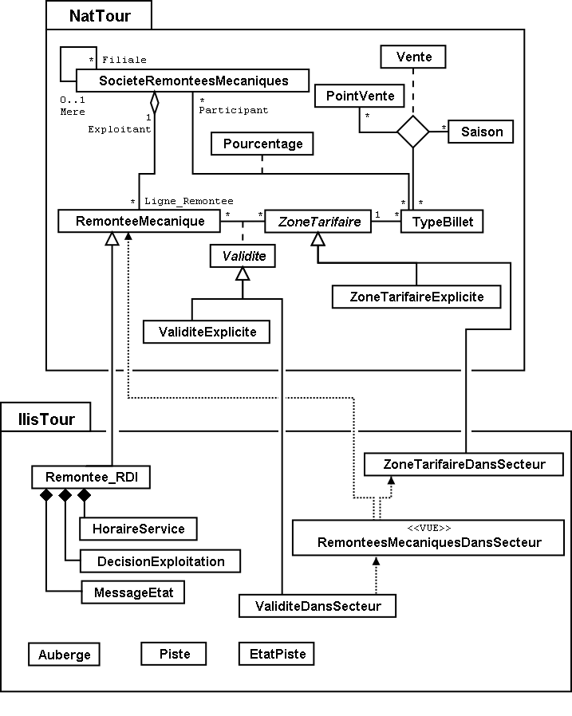

[#_4_1]
=== Aperçu général du modèle de données

.Le modèle de données en représentation UML. Les thèmes, les structures, les domaines de valeurs et les attributs n'ont pas été représentés pour des raisons évidentes de lisibilité. Nous renvoyons à ce sujet le lecteur au <<_6>> abordant ces questions plus en détail.

[#_4_2]
