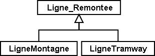
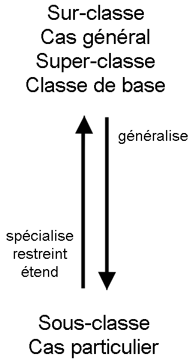
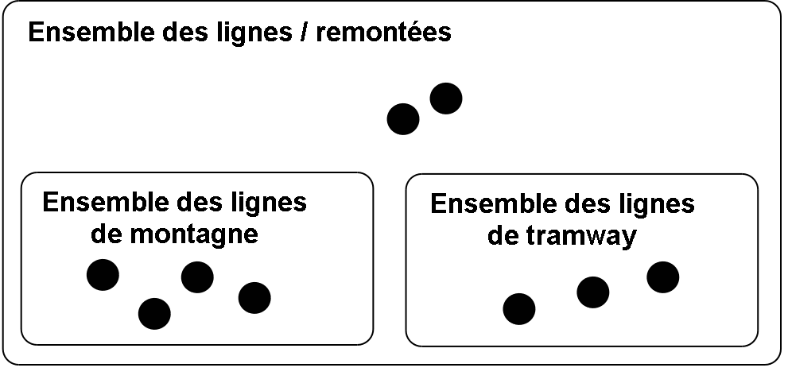
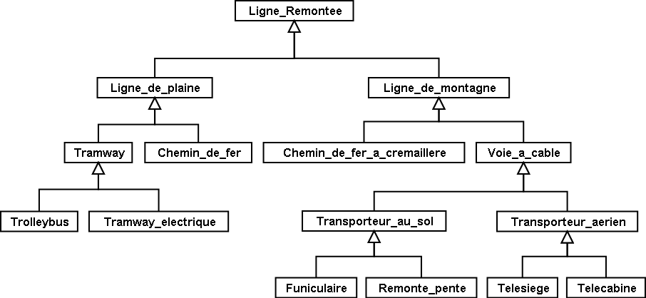
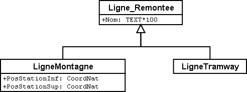
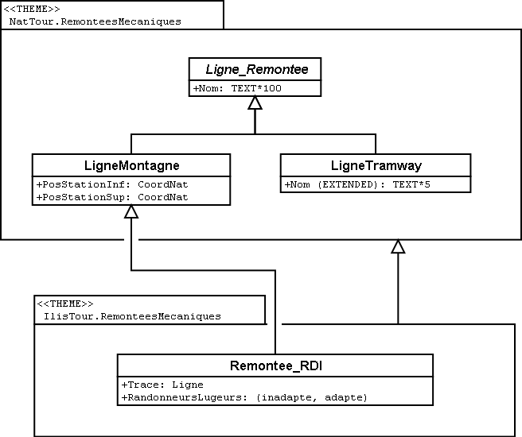

[#_5]
== La mode est à l'héritage

[#_5_1]
=== Droits et contenu – Principes de l'héritage

Une ligne de montagne (ou remontée mécanique) n'a, en définitive, rien de fondamentalement particulier puisqu'elle possède bon nombre de propriétés communes à tous les types de lignes / remontées. Un nom lui est par exemple associé et le fait d'être exploitée par une entreprise ne lui est guère spécifique – c'est le cas aussi des lignes de tramway.

S'il est évident qu'une ligne de montagne et une ligne de tramway présentent des points communs, bien des choses les séparent aussi. 

.Semblables en bien des points, mais pas totalement identiques : une ligne de montagne (ou remontée mécanique) et une ligne de tramway sont deux cas particuliers de lignes / remontées – ce sont des sous-classes de la sur-classe générale des lignes / remontées.
 

[NOTE]
L'*héritage* permet de formuler les points de convergence et de divergence entre des classes d'objets. Des *sous-classes spécialisent* les *sur-classes* générales.

Il est d'usage de représenter la sur-classe générale au-dessus des sous-classes spécifiques sur le diagramme. Des diagrammes complexes peuvent toutefois perdre toute lisibilité si l'on s'en tient strictement à ce principe. Quoi qu'il en soit, c'est la direction de la flèche qui est déterminante et non l'agencement du diagramme sur une feuille de papier.

Toute ligne de montagne peut être considérée comme une ligne / remontée, mais toute ligne / remontée ne mène pas nécessairement au sommet d'une montagne : l'ensemble des lignes de montagne est un sous-ensemble de l'ensemble des lignes / remontées. On dit aussi que la sous-classe des lignes de montagne est une *restriction* de la sur-classe des lignes / remontées.

.Une relation entre sous-ensembles d'objets correspond à la spécialisation de classes : l'ensemble de toutes les lignes de montagne (comprenant quatre éléments sur l'image de droite) doit être compris en totalité dans l'ensemble des lignes / remontées (neuf éléments) puisque la classe des lignes de montagne spécialise la classe plus générale des lignes / remontées.
 

A l'occasion, le terme d'*extension* est également utilisé à la place de spécialisation, de signification identique à « restriction ».

Il peut sembler déconcertant de prime abord que les notions de « restriction » et d'« extension » soient employées avec la même signification dans le contexte de la modélisation. La raison en est la suivante : une classe peut également être interprétée comme un regroupement de conditions à l'aide desquelles on décide de l'appartenance ou non d'un objet à la classe concernée (par exemple des critères permettant de décider si l'objet en question peut être considéré ou non comme une ligne / remontée). Une sous-classe ne fait qu'augmenter le niveau des exigences : pour qu'un objet donné puisse être considéré comme une ligne de montagne, il doit non seulement remplir les critères précédents, mais également satisfaire à d'autres conditions supplémentaires. Par conséquent, en étendant les exigences, une sous-classe restreint l'ensemble des objets qui peuvent en faire partie.

L'héritage constitue un moyen remarquable permettant d'établir une hiérarchie au sein d'un ensemble complexe d'éléments. Veillez toutefois à ne pas formuler le modèle de manière trop détaillée, vous risqueriez de distinguer des classes là où une telle différenciation n'est pas nécessaire.

.L'outil puissant que constitue l'héritage peut potentiellement conduire à distinguer des cas particuliers alors que l'application ne le justifie pas. Soit, un trolleybus et un tramway électrique, ce n'est pas tout à fait la même chose. Mais l'introduction de telles différences dans le modèle se justifie-t-elle ou ne contribue-t-elle qu'à le faire enfler ?

CLASS Ligne++_++Remontee = +
Nom: TEXT++*++100; +
END Ligne++_++Remontee; +
 +
CLASS RemonteeMecanique EXTENDS Ligne++_++Remontee = +
PosStationInf: CoordNational; +
PosStationSup: CoordNational; +
END RemonteeMecanique; +
 +
CLASS LigneTramway EXTENDS Ligne++_++Remontee = +
END LigneTramway;

.La ligne de montagne (ou remontée mécanique) et la ligne de tramway reprennent (« héritent de ») la propriété de nom de leur sur-classe de lignes / remontées sans que celle-ci ait à être répétée. Une remontée mécanique possède des propriétés supplémentaires en plus de celles qu'elle hérite, à savoir la position des stations inférieure et supérieure (en coordonnées nationales). A droite, la même situation est décrite en notation INTERLIS.

[NOTE]
Les sous-classes reprennent ou *héritent* toujours de toutes les propriétés de leurs sur-classes générales, mais des propriétés supplémentaires peuvent être définies.

[#_5_2]
=== Affiner l'héritage

Dans le cas général, disposer de cent caractères pour le nom d'une ligne / remontée peut sembler raisonnable. Il a bien été question, à une certaine époque, d'exploiter un «Remonte-pente destiné aux lugeurs de sept à septante-sept ans du secteur de la Dent d'Ili » avant que l'on finisse par se décider au dernier moment pour le nom de « tire-fesses », au grand soulagement du syndicat d'initiative.

CLASS Ligne++_++Remontee = +
Nom: TEXT++*++100; +
END Ligne++_++Remontee; +
 +
CLASS RemonteeMecanique EXTENDS Ligne++_++Remontee = +
PosStationInf: CoordNational; +
PosStationSup: CoordNational; +
END RemonteeMecanique; +
 +
CLASS LigneTramway EXTENDS Ligne++_++Remontee = +
**Nom (EXTENDED): TEXT++*++5; +
**END LigneTramway;

.Cinq caractères suffisent amplement pour le nom d'une ligne de tramway : le type de la propriété de nom est donc affiné (ou précisé) par la sous-classe. A droite, à nouveau la même situation décrite en notation INTERLIS.
image::img/image27.png[./media/image27,width=266,height=91]

L'indication précisée et affinée doit être compatible avec celle issue de l'héritage. La longueur maximale autorisée pour le nom d'une ligne de tramway ne pourrait par exemple pas être supérieure à ce qui a été défini pour une ligne / remontée ordinaire.

[NOTE]
====
Les sous-classes peuvent *affiner* les propriétés héritées. Les indications ainsi précisées ne doivent cependant pas être en contradiction avec celles issues de l'héritage : elles doivent être *compatibles* avec la définition de la sur-classe.

Dans le cas contraire, une sous-classe pourrait contenir des objets n'appartenant plus à l'ensemble de tous les objets de la sur-classe.
====

[#_5_3]
=== Et ça existe vraiment ? – Classes abstraites

Certaines classes ne sont rien d'autre que des auxiliaires théoriques, en ce sens qu'il n'en existe aucun exemplaire réel. Prenons un exemple : aucun être vivant sur cette planète ne fait simplement partie de la catégorie des êtres vivants, tous entrent simultanément dans l'une ou l'autre de ses sous-catégories. De la même manière, un modèle de données pourrait définir qu'il n'existe pas de ligne / remontée à proprement parler mais que toute ligne / remontée doit faire partie d'une sous-classe, qu'il s'agisse d'une remontée mécanique, d'une ligne de tramway ou de tout autre type.

[NOTE]
Une classe est déclarée comme étant *abstraite* si aucun objet concret ne peut lui être affecté.

Il est fréquent que toutes les sur-classes d'un modèle de données soient de type abstrait et que seules les sous-classes spécialisées des niveaux inférieurs soient concrètes.

CLASS Ligne++_++Remontee *(ABSTRACT)* = +
Nom: TEXT++*++100; +
END Ligne++_++Remontee; +
 +
CLASS RemonteeMecanique EXTENDS Ligne++_++Remontee = +
PosStationInf: CoordNational; +
PosStationSup: CoordNational; +
END RemonteeMecanique; +
 +
CLASS LigneTramway EXTENDS Ligne++_++Remontee = +
END LigneTramway;

Figure 28 : La classe des lignes / remontées comme classe abstraite : s'il ne peut y avoir d'objet se contentant d'être une ligne / remontée sans être simultanément une remontée mécanique ou une ligne de tramway, par exemple, alors le nom de la classe correspondante figure en italique sur le diagramme. A droite, le même modèle est décrit en notation INTERLIS.

[#_5_4]
=== Mais nous ne voulons pas tant de détails – Propriétés abstraites

Admettons qu'une association internationale souhaite garantir que la saisie des billets s'accompagne de celle de leur prix. Elle ne désire toutefois pas imposer d'unité monétaire pour l'indication du prix et la limite supérieure pour le prix n'est par ailleurs pas clairement définie. Ce qui est sûr, en revanche, c'est que « le prix » doit être une valeur numérique et qu'il est ici question d'argent : le prix n'est certainement pas indiqué en kilomètres / heure !

[source]
----
CLASS TypeBilletInternational (ABSTRACT) =
  Prix (ABSTRACT): NUMERIC [MONEY];
END TypeBilletInternational;

CLASS TypeBilletBeotie EXTENDS TypeBilletInternational =
  Prix (EXTENDED): 0.00 .. 9999.99 [Beotie.Couronne];
END TypeBilletBeotie;
----

[NOTE]
Il n'est pas nécessaire de définir toutes les propriétés dans les moindres détails : des *propriétés abstraites* sont admises pour les classes abstraites. Il incombe alors aux sous-classes concrètes de les préciser. Ce type de propriétés se révèle particulièrement intéressant lorsqu'une chose est à réglementer au plan national ou international, sans pour autant que tous les détails en soient prescrits.

[#_5_5]
=== Les détails ne nous intéressent pas – Considérer les particularités de façon plus globale

Lorsque quelqu'un se renseigne de manière générale sur le réseau ferré du pays, peu lui importe de savoir si une ligne donnée est un tramway, une remontée mécanique ou quoi que ce soit d'autre. Et il ne se préoccupe pas non plus de connaître les détails techniques du système au cas où la ligne serait à crémaillère. Non, le nom (saisi pour chacune des lignes, conformément au modèle de données) lui suffit amplement.

[NOTE]
====
Des exemplaires d'une sous-classe peuvent toujours être considérés sur un plan plus général, au sens d'une sur-classe.

_Le terme utilisé pour désigner ce principe est le polymorphisme._
====

Cela ne fonctionne toutefois qu'à une condition :

[NOTE]
Toute extension doit être *compatible* avec sa définition de base. Compatible, cela signifie que toute valeur acceptable par la définition étendue respecte également les règles du type de base (texte, énumération, valeur numérique, coordonnées, etc.).

[#_5_6]
=== L'héritage à grande échelle

La distinction entre sur-classe et sous-classe ne trouve pas toujours sa justification dans des raisons objectives ou concrètes, des facteurs touchant à l'organisation peuvent parfois s'avérer décisifs.

Prenons un exemple : les Ilinois sont en principe d'accord avec l'idée que l'Association nationale des offices de tourisme se fait d'une remontée mécanique. A quelques réserves près toutefois :

* Il serait intéressant d'avoir connaissance du tracé des remontées vers la Dent d'Ili. S'il était saisi, on pourrait l'intégrer sur les petits dépliants que le syndicat d'initiative diffuse aux touristes.
* Les Ilinois souhaiteraient par ailleurs saisir les lignes ouvertes aux randonneurs et aux lugeurs.

Il s'agit dans les deux cas de propriétés pouvant être associées à n'importe quelle remontée mécanique, mais le fait est qu'elles sont absentes du modèle national. Les Ilinois ont bien sûr demandé à l'Association nationale s'il ne lui était pas possible d'adapter son modèle. La réponse fut cinglante : on n'avait ni temps ni argent à consacrer à une modification impliquant l'adaptation de systèmes informatiques à travers tout le pays à cause des lubies de quelques illuminés au fond de leur vallée. Soit. Et maintenant ?

Les uns pensaient qu'il n'y avait qu'à ignorer l'Association nationale, qu'il ne s'agissait de toute façon que d'un tas de bureaucrates dépourvus de la moindre once de compréhension pour les gens de terrain ! (Ils ont en fait exprimé leur pensée dans un langage nettement plus cru.)

D'autres faisaient preuve de plus de retenue et avouaient comprendre le point de vue de l'Association nationale : si chacun y va de sa demande particulière, on ne s'en sort plus… Et puis, on voudrait quand même tirer profit de l'Association nationale qui va utiliser les données transmises à des fins publicitaires dont le Val d'Ili bénéficiera au final.

Les Ilinois devraient-ils alors renoncer à leurs demandes supplémentaires ? Ou saisir toutes les données en double exemplaire : une fois pour l'Association nationale, une fois pour eux ?

.L'Association nationale des offices de tourisme n'est pas disposée à adapter son modèle pour répondre aux demandes spécifiques des Ilinois. Grâce à l'héritage, les Ilinois peuvent cependant saisir leurs données : leur propre thème des remontées mécaniques reprend la totalité des informations du thème des remontées mécaniques de l'Association nationale mais l'étend par une classe d'objets Remontee++_++RDI présentant des propriétés supplémentaires.

L'héritage a permis de résoudre ce conflit. Dans le Val d'Ili, les lignes / remontées sont simplement saisies dans la classe Remontee++_++RDI, informations supplémentaires comprises. Puisque Remontee++_++RDI est une sous-classe de la classe des remontées mécaniques (selon l'Association nationale), toute Remontee++_++RDI peut également être lue comme une remontée mécanique normale. Et ainsi, les Ilinois peuvent transmettre leurs données à l'Association nationale sans rien avoir à modifier.

[NOTE]
====
L'héritage peut également se révéler précieux dans le cadre d'une structure fédérale où abondent les particularismes locaux.

_Pour être tout à fait précis, cette caractéristique découle du polymorphisme rendu possible par l'héritage : tout exemplaire d'une sous-classe peut être considéré comme faisant partie de la sur-classe (cf. § <<_5_5>>) associée. Ainsi, l'Association nationale peut-elle traiter les données de chaque remontée mécanique du pays, même s'il s'agit en fait d'un exemplaire d'une sous-classe locale de « remontée mécanique » dont l'Association nationale n'a même pas connaissance._
====

L'héritage va très loin dans le cas d'INTERLIS : il ne concerne pas uniquement des classes et des thèmes mais également des domaines de valeurs (types), des vues, des définitions graphiques et, dans une certaine mesure, des unités qu'il est possible de reprendre et de préciser.

[#_5_7]
=== Héritage simple et multiple

Certains langages de modélisation permettent l'héritage simultané à partir de plusieurs éléments de base. Une classe peut ainsi affiner plusieurs sur-classes en même temps.

Les informaticiens sont très partagés sur la question de savoir si cela est judicieux ou non. Les modèles à héritage multiple sont fréquemment plus difficiles à décrypter, raison pour laquelle INTERLIS ne reconnaît que l'héritage simple.

