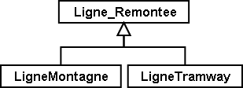
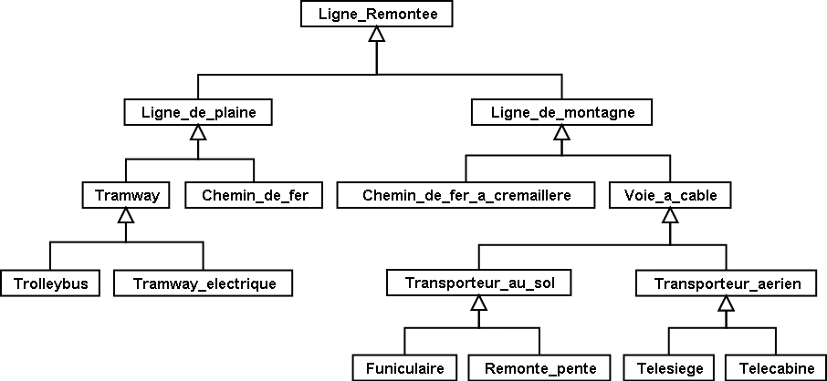

[#_5_1]
=== Droits et contenu – Principes de l'héritage

Une ligne de montagne (ou remontée mécanique) n'a, en définitive, rien de fondamentalement particulier puisqu'elle possède bon nombre de propriétés communes à tous les types de lignes / remontées. Un nom lui est par exemple associé et le fait d'être exploitée par une entreprise ne lui est guère spécifique – c'est le cas aussi des lignes de tramway.

S'il est évident qu'une ligne de montagne et une ligne de tramway présentent des points communs, bien des choses les séparent aussi. 

.Semblables en bien des points, mais pas totalement identiques : une ligne de montagne (ou remontée mécanique) et une ligne de tramway sont deux cas particuliers de lignes / remontées – ce sont des sous-classes de la sur-classe générale des lignes / remontées.
 image:img/image23.png[]

[NOTE]
L'*héritage* permet de formuler les points de convergence et de divergence entre des classes d'objets. Des *sous-classes spécialisent* les *sur-classes* générales.

Il est d'usage de représenter la sur-classe générale au-dessus des sous-classes spécifiques sur le diagramme. Des diagrammes complexes peuvent toutefois perdre toute lisibilité si l'on s'en tient strictement à ce principe. Quoi qu'il en soit, c'est la direction de la flèche qui est déterminante et non l'agencement du diagramme sur une feuille de papier.

Toute ligne de montagne peut être considérée comme une ligne / remontée, mais toute ligne / remontée ne mène pas nécessairement au sommet d'une montagne : l'ensemble des lignes de montagne est un sous-ensemble de l'ensemble des lignes / remontées. On dit aussi que la sous-classe des lignes de montagne est une *restriction* de la sur-classe des lignes / remontées.

.Une relation entre sous-ensembles d'objets correspond à la spécialisation de classes : l'ensemble de toutes les lignes de montagne (comprenant quatre éléments sur l'image de droite) doit être compris en totalité dans l'ensemble des lignes / remontées (neuf éléments) puisque la classe des lignes de montagne spécialise la classe plus générale des lignes / remontées.
 image:img/image24.png[]

A l'occasion, le terme d'*extension* est également utilisé à la place de spécialisation, de signification identique à « restriction ».

Il peut sembler déconcertant de prime abord que les notions de « restriction » et d'« extension » soient employées avec la même signification dans le contexte de la modélisation. La raison en est la suivante : une classe peut également être interprétée comme un regroupement de conditions à l'aide desquelles on décide de l'appartenance ou non d'un objet à la classe concernée (par exemple des critères permettant de décider si l'objet en question peut être considéré ou non comme une ligne / remontée). Une sous-classe ne fait qu'augmenter le niveau des exigences : pour qu'un objet donné puisse être considéré comme une ligne de montagne, il doit non seulement remplir les critères précédents, mais également satisfaire à d'autres conditions supplémentaires. Par conséquent, en étendant les exigences, une sous-classe restreint l'ensemble des objets qui peuvent en faire partie.

L'héritage constitue un moyen remarquable permettant d'établir une hiérarchie au sein d'un ensemble complexe d'éléments. Veillez toutefois à ne pas formuler le modèle de manière trop détaillée, vous risqueriez de distinguer des classes là où une telle différenciation n'est pas nécessaire.

.L'outil puissant que constitue l'héritage peut potentiellement conduire à distinguer des cas particuliers alors que l'application ne le justifie pas. Soit, un trolleybus et un tramway électrique, ce n'est pas tout à fait la même chose. Mais l'introduction de telles différences dans le modèle se justifie-t-elle ou ne contribue-t-elle qu'à le faire enfler ?

[source]
----
CLASS Ligne_Remontee =
  Nom: TEXT*100;
END Ligne_Remontee;

CLASS RemonteeMecanique EXTENDS Ligne_Remontee =
  PosStationInf: CoordNational;
  PosStationSup: CoordNational;
END RemonteeMecanique;

CLASS LigneTramway EXTENDS Ligne_Remontee =
END LigneTramway;
----

.La ligne de montagne (ou remontée mécanique) et la ligne de tramway reprennent (« héritent de ») la propriété de nom de leur sur-classe de lignes / remontées sans que celle-ci ait à être répétée. Une remontée mécanique possède des propriétés supplémentaires en plus de celles qu'elle hérite, à savoir la position des stations inférieure et supérieure (en coordonnées nationales). A droite, la même situation est décrite en notation INTERLIS.
image::img/image26.png[]

[NOTE]
Les sous-classes reprennent ou *héritent* toujours de toutes les propriétés de leurs sur-classes générales, mais des propriétés supplémentaires peuvent être définies.

[#_5_2]
