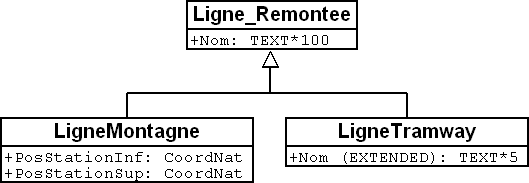

[#_5_2]
=== Affiner l'héritage

Dans le cas général, disposer de cent caractères pour le nom d'une ligne / remontée peut sembler raisonnable. Il a bien été question, à une certaine époque, d'exploiter un «Remonte-pente destiné aux lugeurs de sept à septante-sept ans du secteur de la Dent d'Ili » avant que l'on finisse par se décider au dernier moment pour le nom de « tire-fesses », au grand soulagement du syndicat d'initiative.

[source]
----
CLASS Ligne_Remontee =
  Nom: TEXT*100;
END Ligne_Remontee;

CLASS RemonteeMecanique EXTENDS Ligne_Remontee =
  PosStationInf: CoordNational;
  PosStationSup: CoordNational;
END RemonteeMecanique;

CLASS LigneTramway EXTENDS Ligne_Remontee =
  Nom (EXTENDED): TEXT*5;
END LigneTramway;
----

.Cinq caractères suffisent amplement pour le nom d'une ligne de tramway : le type de la propriété de nom est donc affiné (ou précisé) par la sous-classe. A droite, à nouveau la même situation décrite en notation INTERLIS.

L'indication précisée et affinée doit être compatible avec celle issue de l'héritage. La longueur maximale autorisée pour le nom d'une ligne de tramway ne pourrait par exemple pas être supérieure à ce qui a été défini pour une ligne / remontée ordinaire.

[NOTE]
====
Les sous-classes peuvent *affiner* les propriétés héritées. Les indications ainsi précisées ne doivent cependant pas être en contradiction avec celles issues de l'héritage : elles doivent être *compatibles* avec la définition de la sur-classe.

Dans le cas contraire, une sous-classe pourrait contenir des objets n'appartenant plus à l'ensemble de tous les objets de la sur-classe.
====

[#_5_3]
