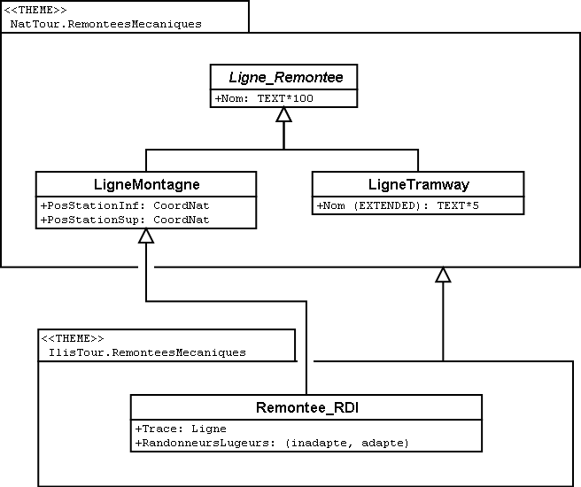

[#_5_6]
=== L'héritage à grande échelle

La distinction entre sur-classe et sous-classe ne trouve pas toujours sa justification dans des raisons objectives ou concrètes, des facteurs touchant à l'organisation peuvent parfois s'avérer décisifs.

Prenons un exemple : les Ilinois sont en principe d'accord avec l'idée que l'Association nationale des offices de tourisme se fait d'une remontée mécanique. A quelques réserves près toutefois :

* Il serait intéressant d'avoir connaissance du tracé des remontées vers la Dent d'Ili. S'il était saisi, on pourrait l'intégrer sur les petits dépliants que le syndicat d'initiative diffuse aux touristes.
* Les Ilinois souhaiteraient par ailleurs saisir les lignes ouvertes aux randonneurs et aux lugeurs.

Il s'agit dans les deux cas de propriétés pouvant être associées à n'importe quelle remontée mécanique, mais le fait est qu'elles sont absentes du modèle national. Les Ilinois ont bien sûr demandé à l'Association nationale s'il ne lui était pas possible d'adapter son modèle. La réponse fut cinglante : on n'avait ni temps ni argent à consacrer à une modification impliquant l'adaptation de systèmes informatiques à travers tout le pays à cause des lubies de quelques illuminés au fond de leur vallée. Soit. Et maintenant ?

Les uns pensaient qu'il n'y avait qu'à ignorer l'Association nationale, qu'il ne s'agissait de toute façon que d'un tas de bureaucrates dépourvus de la moindre once de compréhension pour les gens de terrain ! (Ils ont en fait exprimé leur pensée dans un langage nettement plus cru.)

D'autres faisaient preuve de plus de retenue et avouaient comprendre le point de vue de l'Association nationale : si chacun y va de sa demande particulière, on ne s'en sort plus… Et puis, on voudrait quand même tirer profit de l'Association nationale qui va utiliser les données transmises à des fins publicitaires dont le Val d'Ili bénéficiera au final.

Les Ilinois devraient-ils alors renoncer à leurs demandes supplémentaires ? Ou saisir toutes les données en double exemplaire : une fois pour l'Association nationale, une fois pour eux ?

.L'Association nationale des offices de tourisme n'est pas disposée à adapter son modèle pour répondre aux demandes spécifiques des Ilinois. Grâce à l'héritage, les Ilinois peuvent cependant saisir leurs données : leur propre thème des remontées mécaniques reprend la totalité des informations du thème des remontées mécaniques de l'Association nationale mais l'étend par une classe d'objets Remontee++_++RDI présentant des propriétés supplémentaires.

L'héritage a permis de résoudre ce conflit. Dans le Val d'Ili, les lignes / remontées sont simplement saisies dans la classe Remontee++_++RDI, informations supplémentaires comprises. Puisque Remontee++_++RDI est une sous-classe de la classe des remontées mécaniques (selon l'Association nationale), toute Remontee++_++RDI peut également être lue comme une remontée mécanique normale. Et ainsi, les Ilinois peuvent transmettre leurs données à l'Association nationale sans rien avoir à modifier.

[NOTE]
====
L'héritage peut également se révéler précieux dans le cadre d'une structure fédérale où abondent les particularismes locaux.

_Pour être tout à fait précis, cette caractéristique découle du polymorphisme rendu possible par l'héritage : tout exemplaire d'une sous-classe peut être considéré comme faisant partie de la sur-classe (cf. § <<_5_5>>) associée. Ainsi, l'Association nationale peut-elle traiter les données de chaque remontée mécanique du pays, même s'il s'agit en fait d'un exemplaire d'une sous-classe locale de « remontée mécanique » dont l'Association nationale n'a même pas connaissance._
====

L'héritage va très loin dans le cas d'INTERLIS : il ne concerne pas uniquement des classes et des thèmes mais également des domaines de valeurs (types), des vues, des définitions graphiques et, dans une certaine mesure, des unités qu'il est possible de reprendre et de préciser.

[#_5_7]
