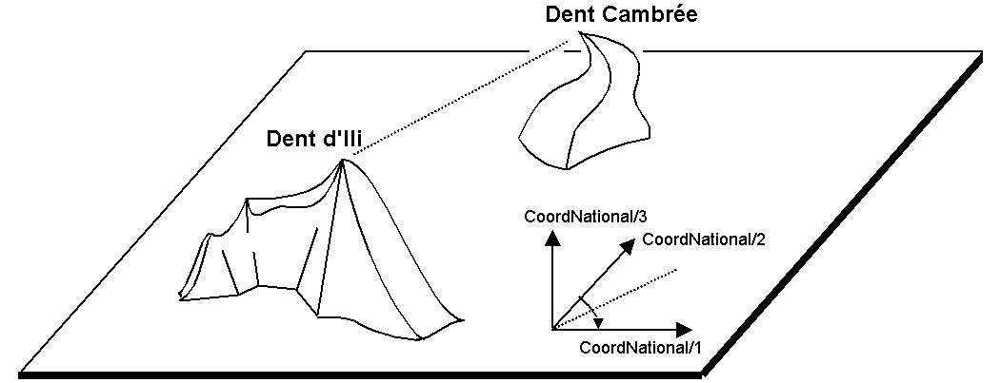
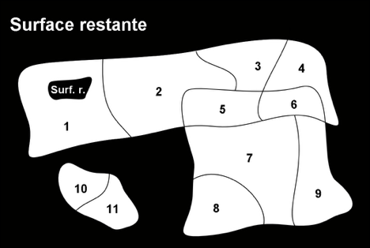

[#_6]
== Le modèle de données scruté à la loupe

[#_6_1]
=== Couronnes et centimes – Types de données numériques

[#_6_1_1]
==== Domaine de valeurs

Un aller simple sur le funiculaire de la Dent d'Ili coûte 10 couronnes béotiennes et un forfait sportif annuel 635 couronnes. Comment modéliser alors le prix d'un billet ?

Tout lecteur familier des langages de programmation pensera d'emblée à des valeurs entières (« Integer ») ou à des valeurs en virgule flottante (« Real »). Bon nombre de langages de programmation et de banques de données permettent de définir l'espace mémoire requis par une de ces valeurs ; la taille et la précision des valeurs mémorisables s'ensuivent alors (« short integer », «long integer», «double precision», etc.). On réfléchit ensuite à la plage dans laquelle ces valeurs peuvent évoluer et on opte pour la forme de mémorisation convenant le mieux.

On ne souhaiterait toutefois pas avoir à se préoccuper du format de mémorisation au niveau conceptuel de la modélisation. Il est cependant possible d'indiquer les valeurs limites admissibles (minimum et maximum) dès ce stade et de définir le nombre de chiffres et l'exposant par la même occasion.

Les tarifs s'échelonnant entre 10 et 635 couronnes, on pourrait écrire :

____
Prix: 10 .. 635;
____

Ce faisant, on définirait aussi que le prix ne peut être ni inférieur à 10 couronnes ni supérieur à 635 couronnes, ce que l'on ne souhaiterait évidemment pas. 0 semble représenter une limite inférieure vraisemblable. Mais qu'en est-il de la limite supérieure ? Il est peu probable que le prix excède un jour 10'000 couronnes. Alors va pour 10'000 ? Lorsque les contraintes propres à une application ne permettent pas de définir une limite avec clarté, il n'y a aucun intérêt à choisir la valeur de telle manière qu'un format de mémorisation plus court (tel que _short integer_ acceptant des valeurs comprises entre –32768 et 32767) en devienne tout juste insuffisant.

Dans le même ordre d'idées, il est également important de réfléchir au nombre de chiffres après la virgule nécessaires. Si les prix sont susceptibles d'intégrer des centimes, alors les limites sont à fixer avec deux décimales. Si l'on considère par exemple un attribut représentant un budget d'investissement, les sommes seront évidemment exprimées en millions de couronnes ; lorsqu'il ne s'agit que d'ordres de grandeur, deux chiffres sont suffisants. Mais ceux-ci peuvent se rapporter aux milliers, aux millions ou aux milliards.

____
Prix: 0.00 .. 9999.99; +
Budget: 0.00E6 .. 999.99E6; +
ProduitNationalBrut : 0.0E0 .. 9.9E20;
____

Le nombre de chiffres définit la précision : « 4.3 millions » (4.3E6 = 4.3 · 106) constitue une information moins précise que « 4300000 ».

[#_6_1_2]
==== Unités

S'agit-il maintenant de couronnes, de francs, d'euros ou de dollars ? L'unité est d'une importance capitale et pas seulement dans le cas de l'argent. C'est pourquoi il est recommandé de l'intégrer directement au type et non d'en faire un simple commentaire ou une partie du nom de l'attribut :

____
UNIT +
Couronne EXTENDS MONEY; +
 +
CLASS TypeBillet = +
Prix: 0 .. 9999 ++[++Couronnes++]++; +
END TypeBillet;
____

Les couronnes (ou francs suisses, euros, dollars, etc.) sont définies comme unité et peuvent être utilisées lors de la définition d'un type numérique. La plupart des unités courantes (parmi lesquelles CHF, EUR, USD) n'ont cependant pas à être définies directement puisqu'elles existent déjà dans le modèle spécifique des unités (units.ili, cf. § 3.3).

[WARNING]
Par souci de clarté, nous recommandons de toujours indiquer des unités. Outre de très nombreuses unités physiques, le modèle des unités d'INTERLIS comprend également des unités monétaires de même que des unités de dénombrement ou des pourcentages.

[#_6_1_3]
==== Hériter des types numériques

Comme il est acquis que les Remontées mécaniques de la Dent d'Ili n'émettront jamais de billets coûtant plus de mille couronnes, l'idée de le définir dans une classe particulière pourrait aisément germer :

____
CLASS TypeBillet (EXTENDED) = +
Prix (EXTENDED): 0 .. 1000 ++[++Couronnes++]++; +
END TypeBillet;
____

Cet exemple concret ne se justifie pas pleinement ici, mais dans certains cas en pratique, il est tout à fait judicieux de restreindre le domaine de valeurs hérité.

Les Ilinois n'ont toutefois pas le droit de modifier les domaines de valeurs du modèle national comme bon leur semble : le principe selon lequel chaque valeur ilinoise doit également être admissible dans le modèle de base de l'Association nationale doit pouvoir s'appliquer. Dans le cas contraire, il ne serait plus garanti que l'Association nationale puisse prendre en charge des données du Val d'Ili sans rencontrer de problème.

Une plage tarifaire allant de 0 .. 1000 constitue par conséquent une restriction admissible du domaine prévu au plan national, lequel s'échelonne entre 0 .. 9999. Si l'on souhaitait cependant étendre le domaine de valeurs dans le Val d'Ili – pour par exemple passer à une plage de 0 .. 15000 – alors des types de billets coûtant entre 10000 et 15000 couronnes ne seraient plus corrects du point de vue de l'Association nationale. Une telle définition n'est par conséquent pas admise.

Les Ilinois veulent également avoir la possibilité d'émettre des billets dont le prix ne soit pas un nombre entier de couronnes mais réponde à la définition suivante :

____
CLASS TypeBillet (EXTENDED) = +
Prix (EXTENDED): 0.00 .. 1000.00 ++[++Couronnes++]++; +
END TypeBillet;
____

Est-elle compatible avec le modèle de base ? Oui, car chaque valeur respectant le modèle ilinois (7.35 par exemple) peut être arrondie à une valeur correcte (7 dans ce cas) du point de vue du modèle national.

La définition ne serait plus admissible si elle englobait des valeurs violant les règles du modèle de base une fois arrondies. Pour prendre un exemple, une valeur maximale de 9999.99 arrondie à 10000 excèderait la limite supérieure de 9999 prescrite par l'Association nationale. Les Ilinois pourraient en revanche définir un domaine s'étendant entre 0.00 .. 9999.49, sans provoquer la moindre contradiction avec le modèle de base car la valeur de 9999.49 fournit à nouveau 9999, une fois arrondie.

Il n'est pas non plus permis de renoncer à la précision dans le modèle spécialisé. Si le modèle national des offices de tourisme prévoyait par exemple un domaine compris entre 0.00 .. 1000.00, les Ilinois ne pourraient pas définir la plage de 0 .. 1000 dans leur spécialisa­tion.

Encore un dernier point : les unités de l'extension doivent toujours coïncider avec celles du modèle de base !

[#_6_1_4]
==== Des limites encore inconnues

L'Association nationale peut-elle définir le prix admissible pour un billet ? Si les limites restent parfaitement inconnues, l'emploi d'attributs abstraits peut permettre de renoncer à leur indication. Il reste toutefois possible de définir une unité.

____
Prix (ABSTRACT): NUMERIC ++[++Beotie.Couronne++]++;
____

Et peut-être que l'unité elle-même reste floue. On sait seulement qu'il s'agit d'une unité monétaire (dans notre exemple).

____
Prix (ABSTRACT): NUMERIC ++[++MONEY++]++;
____

L'unité est caractérisée si l'on procède de la sorte. Seules des unités concrétisant l'unité abstraite MONEY peuvent encore être définies dans le cadre d'une extension (cf. également § 5.4 pour ce qui concerne les propriétés abstraites).

____
Prix (EXTENDED): 0 .. 10000 ++[++CHF++]++; !! permis +
Prix (EXTENDED): 0 .. 2000 ++[++USD++]++; !! permis +
Prix (EXTENDED): 0 .. 1000 ++[++m++]++; !! interdit, le metre concretisant +
!! la longueur (LENGTH) et non la +
!! monnaie (MONEY).
____

[#_6_2]
=== Types de remontées mécaniques – Modélisation de types et d'objets

Il suffit, pour un bref aperçu, de subdiviser sommairement les remontées mécaniques (ou lignes de montagne) : chemin de fer à crémaillère, funiculaire, téléphérique, remonte-pente, télésiège, télécabine. Dans le cas le plus simple, le genre est défini comme un attribut textuel.

____
CLASS RemonteeMecanique = +
Nom: TEXT++*++100; +
Genre: TEXT++*++50; +
END RemonteeMecanique;
____

Il en résulte que la personne amenée à saisir les données bénéficiera d'une grande liberté au niveau de la description. Télébenne, téléski, skilift, ski-lift – il est à craindre que les désignations les plus diverses se mettent à fleurir. Une énumération permettra de l'éviter :

____
CLASS RemonteeMecanique = +
Nom: TEXT++*++100; +
Genre: (CheminFerCremaillere, +
Funiculaire, +
Telepherique, +
Remonte++_++pente, +
Telesiege, +
Telecabine); +
END RemonteeMecanique;
____

Toutes les possibilités offertes étant ainsi énumérées, l'ordre règne à nouveau. Mais parfois, il est nécessaire d'ajouter de nouveaux attributs tels que le nombre de places disponibles. Pour un funiculaire et un téléphérique, il s'agit de la capacité de la cabine entière, alors que le nombre de personnes par trajet est comptabilisé pour un remonte-pente ou un télésiège. Dans le cas du chemin de fer à crémaillère, plusieurs voitures peuvent être accouplées et cette indication a donc peu de signification. Mais c'est peut-être le système de la crémaillère qui présente de l'intérêt ici. La classe des remontées mécaniques doit-elle alors intégrer tous les attributs nécessaires à la description des différents genres ?

Lorsque les différents genres présentent des propriétés particulières (attributs ou relations), il est judicieux de définir des classes qui leur sont spécifiques, héritant de la classe de base (cf. <<_5>>).

.Les chemins de fer à crémaillère, les funiculaires, etc. sont des cas particuliers de remontées mécaniques. Il n'existe cependant pas de remontées mécaniques à proprement parler : toutes les remontées « concrètes » appartiennent toujours à l'une des sous-classes. _Remontée mécanique_ est donc une classe abstraite, ce qui est signalé sur le diagramme par l'écriture du nom en italique.

Il n'existe cependant pas de remontée mécanique qui soit simplement une remontée mécanique sans appartenir à l'une ou l'autre des sous-classes. La classe des remontées mécaniques est donc déclarée comme étant « abstraite ». Concrètement, une remontée mécanique doit donc toujours être un chemin de fer à crémaillère, un funiculaire, etc.

Dans la notation textuelle d'INTERLIS 2, les classes abstraites sont signalées par la mention (ABSTRACT). En passant : «Units», le modèle INTERLIS des unités comporte une unité «CountedObjects» pour le décompte d'objets tels que le nombre de personnes à bord de la cabine d'un téléphérique.

____
CLASS RemonteeMecanique (ABSTRACT) = +
Nom: Text ++*++ 100; +
END RemonteeMecanique; +
 +
CLASS CheminFerCremaillere EXTENDS RemonteeMecanique = +
SystemeCremaillere : (Riggenbach, Abt, vonRoll); +
END CheminFerCremaillere; +
 +
CLASS Funiculaire EXTENDS RemonteeMecanique = +
Capacite: 0 .. 999 ++[++Units.CountedObjects++]++; +
END Funiculaire; +
 +
CLASS Telepherique EXTENDS RemonteeMecanique = +
Capacite: 0 .. 999 ++[++Units.CountedObjects++]++; +
END Telepherique; +
 +
CLASS Remonte++_++pente EXTENDS RemonteeMecanique = +
PersonnesParTrajet: 0 .. 10 ++[++Units.CountedObjects++]++; +
END Remonte++_++pente; +
 +
CLASS Telesiege EXTENDS RemonteeMecanique = +
PersonnesParTrajet: 0 .. 24 ++[++Units.CountedObjects++]++; +
END Telesiege; +
 +
CLASS Telecabine EXTENDS RemonteeMecanique = +
Capacite: 0 .. 99 ++[++Units.CountedObjects++]++; +
END Telecabine;
____

Un cheminot, tout spécialement convié à la réunion, a présenté un long exposé sur les chemins de fer à crémaillère. L'assistance a été abreuvée d'informations sur les différents systèmes de crémaillères en usage de par le monde, agrémentées d'un comparatif détaillé de leurs avantages et inconvénients respectifs. Les Ilinois en vinrent finalement à se demander quel rapport existait entre les systèmes de crémaillères et leur projet. Personne ne parvenait à s'imaginer l'importance que pourraient prendre ces informations un jour, même à l'occasion d'une éventuelle extension. En conséquence, le modèle proposé a été rejeté parce que jugé trop détaillé et générateur de coûts superflus, causés par la saisie et la gestion de données en fin de compte inutiles.

Cf. également § 5.1 pour la tentation d'aller trop loin dans les détails au niveau de la modélisation.

[#_6_3]
=== Existe-t-il également des pistes de ski bleu clair ? – Enumérations structurées

[#_6_3_1]
==== Enumérations ordinaires et droit d'héritage associé

Trois couleurs ont été sélectionnées pour décrire sommairement le niveau de difficulté des pistes de ski : bleu, rouge et noir. Ces niveaux de difficultés, par ailleurs ordonnés, sont les seuls admis. Le bleu désigne une piste facile, le rouge une piste d'un niveau plus difficile et le noir est réservé aux pistes les plus exigeantes. Cette situation est décrite par la définition suivante :

____
CLASS Piste = +
NiveauDifficulte : (bleu, rouge, noir : FINAL) ORDERED; +
END Piste;
____

Si la mention FINAL était omise, l'énumération pourrait être complétée dans le cadre d'une extension, ce qui pourrait présenter un intérêt pour le genre de remontée mécanique :

____
!! Modele de l'Association nationale des offices de tourisme +
CLASS RemonteeMecanique = +
Genre: (CheminFerCremaillere, Funiculaire, Telepherique, +
Remonte++_++pente, Telesiege, Telecabine); +
END RemonteeMecanique; +
 +
!! Modele du Val d'Ili +
CLASS Remontee++_++RDI EXTENDS RemonteeMecanique = +
Genre (EXTENDED): (BusDesNeiges); +
END Remontee++_++RDI;
____

Dans la classe étendue, l'élément bus des neiges – une exclusivité du Val d'Ili – est rajouté à la fin de l'énumération existante. Mais que peut bien en faire l'Association nationale des offices de tourisme ? Pour elle, exclusivité ou pas, le «bus des neiges» est parfaitement inconnu.

[NOTE]
Chaque extension (horizontale) peut être complétée par des valeurs supplémentaires, tant que cette possibilité n'est pas explicitement exclue par la mention *FINAL*. Si l'intérêt d'un utilisateur se limite aux valeurs définies dans la classe de base, toutes les valeurs supplémentaires sont regroupées sous l'appellation générique *OTHER*.

Pour la classe de base, la valeur bus des neiges (comme toute autre valeur supplémentaire) se fond dans une masse indistincte : OTHER. Cependant, si la mention FINAL a été indiquée, OTHER n'est plus possible. Si une énumération est définie comme étant cyclique (*CIRCULAR*), de tels compléments ne sont jamais possibles puisque par cyclique, on entend que la première valeur de la liste fait à nouveau suite à la dernière, que l'on ne saurait d'ailleurs pas distinguer sans cela.

____
DirectionVent: (N, NE, E, SE, S, SW, W, NW) CIRCULAR;
____

[#_6_3_2]
==== Sous-énumérations

Il a donc été décidé de ne pas modéliser les différents genres de remontées mécaniques par un nombre trop élevé de classes. Au grand dam des amis du rail : qui sait, la connaissance des systèmes de crémaillères pourrait bien nous servir à quelque chose, un jour ou l'autre...

Il est possible de définir une sous-énumération pour chaque valeur d'une énumération. Cela peut s'effectuer directement au sein de la définition de base ou ultérieurement, dans le cadre d'une extension.

____
CLASS Remontee++_++RDI EXTENDS RemonteeMecanique = +
Genre (EXTENDED): (CheminFerCremaillere (Riggenbach, Abt, vonRoll)); +
END Remontee++_++RDI;

JourDeLaSemaine : (JourOuvrable (lundi, mardi, mercredi, +
jeudi, vendredi, samedi), +
dimanche);
____

Si une telle sous-énumération est définie dans une extension, elle est sans objet du point de vue de la base, de sorte que pour l'Association nationale des offices de tourisme, une voie à crémaillère Riggenbach est un chemin de fer à crémaillère comme un autre.

Les sous-énumérations peuvent à leur tour être étendues par des valeurs supplémentaires, pour autant que la dernière valeur de la liste ne soit pas suivie de la mention FINAL. Par ailleurs, les différentes valeurs d'une sous-énumération peuvent elles aussi être précisées par des sous-énumérations, si bien que de véritables arborescences d'énumérations peuvent en résulter.

[#_6_4]
=== Les Ilinois se restreignent – Chaînes de caractères et règles d'héritage associées

Les désignations peuvent fondamentalement comprendre des noms de longueur quelconque. L'Association nationale a cependant décidé que le nom d'une remontée mécanique devait comporter au plus 100 caractères. Les noms sont bien plus courts que cela en règle générale, on souhaitait simplement se donner une marge de sécurité suffisante.

____
STRUCTURE DesignationEntreprise EXTENDS Designation = +
Nom (EXTENDED): TEXT++*++100; +
END DesignationEntreprise;
____

Si la longueur d'un attribut textuel est quelconque ou reste totalement inconnue, on peut renoncer à indiquer cette information. En revanche, s'il est clair que la longueur sera fixée dans le cadre d'une extension de classe, l'attribut est à définir comme étant abstrait :

____
Description (ABSTRACT): TEXT;
____

Une web-cam est installée sur certaines lignes du Val d'Ili, filmant en continu les alentours de la station supérieure afin que les touristes tentés de s'y rendre puissent voir si le jeu en vaut la chandelle. L'adresse Internet de l'image actuelle constitue également un type de texte (d'un genre un peu particulier toutefois).

____
CLASS Remontee++_++RDI = +
... +
ImageStationSuperieure: URI; +
... +
END Remontee++_++RDI;
____

Contrairement aux apparences, les adresses Internet sont sans lien avec le canton suisse du même nom, tout au plus existe-t-il un lien avec le canton de Genève puisque c'est au CERN qu'a été développé le premier navigateur Internet. URI est ici l'abréviation d'_Uniform Resource Identifier._ Les URL (_Uniform Resource Locators)_ généralement utilisés pour les pages Internet sont une forme particulière d'URI.

[#_6_5]
=== Calme plat – Attributs facultatifs et obligatoires

Les données actuelles relatives à l'exploitation intègrent également des informations météorologiques telles que la température ou la vitesse du vent. L'indication de la direction du vent ne présente aucun intérêt en cas de calme plat. Les autres informations sont à fournir en toutes circonstances.

[NOTE]
Le fait qu'un attribut puisse être *indéfini* ou qu'il doive être défini en toutes circonstances est une composante du modèle.

[WARNING]
Indéfini ne signifie pas simplement égal à 0 ou à toute autre valeur particulière. Une valeur spécifique sert à décrire cette situation.

Dans INTERLIS 2, on écrira par exemple :

____
CLASS Meteo = +
Temperature: MANDATORY –50 .. 50 ++[++oC++]++; +
DirectionVent: (N, NE, E, SE, S, SW, W, NW) CIRCULAR; +
VitesseVent: MANDATORY 0 .. 200 ++[++kmh++]++; +
END Meteo;
____

La température et la vitesse du vent sont donc obligatoires (MANDATORY). La direction du vent n'étant pas obligatoirement requise, elle est donc facultative. La valeur concrète de ce paramètre peut donc être indéfinie. Il est permis, dans des extensions, de rendre obligatoires des attributs facultatifs. En revanche, des attributs obligatoires ne peuvent pas devenir facultatifs puisque la valeur « indéfinie » n'est pas permise dans la classe de base.

[#_6_6]
=== Délais d'attente et durées des trajets – Domaines de valeurs

Les délais d'attente sur les remontées mécaniques et les durées des trajets correspondants sont indiqués en minutes.

____
CLASS RemonteeMecanique = +
DureeTrajet: 0 .. 200 ++[++min++]++; +
END RemonteeMecanique;

CLASS EtatRemonteeMecanique = +
DelaiAttente: 0 .. 200 ++[++min++]++; +
END EtatRemonteeMecanique;
____

Ces deux propriétés peuvent accepter des valeurs issues du même domaine. Cette communauté peut être soulignée par un domaine de valeurs défini explicitement (DOMAIN) :

____
DOMAIN +
DureeEnMinutes = 0 .. 200 ++[++min++]++;

CLASS RemonteeMecanique = +
DureeTrajet: DureeEnMinutes; +
END RemonteeMecanique;

CLASS EtatRemonteeMecanique = +
DelaiAttente: DureeEnMinutes; +
END EtatRemonteeMecanique;
____

[#_6_7]
=== Mais où se trouve le Val d'Ili ? – Types de coordonnées

[#_6_7_1]
==== Quelques informations de base sur les types de coordonnées

La question « où ? » appelle une réponse liée à un lieu ponctuel du monde réel qu'il est possible de décrire au moyen de coordonnées. Par coordonnées, on entend généralement un couple de valeurs numériques, s'il s'agit de positions planimétriques ou un triplet s'il s'agit de positions dans l'espace, planimétrie et altimétrie.

Ainsi, il convient de définir, pour chacune des dimensions d'un type de coordonnées comme pour tout type numérique, le domaine dans lequel les valeurs admissibles peuvent évoluer de même que l'unité qui leur est associée.

____
Position: COORD 500.00 .. 91000.00 ++[++m++]++, +
700.00 .. 23000.00 ++[++m++]++;

XPos: 500.00 .. 91000.00 ++[++m++]++; +
YPos: 700.00 .. 23000.00 ++[++m++]++;
____

La différence existant entre un attribut de position auquel un type de coordonnées est associé et des attributs numériques séparés pour les directions X et Y semble réduite à première vue. La définition en tant que type de coordonnées met cependant clairement en lumière le fait que les deux informations sont liées. Cette propriété est mise à profit par des logiciels bien souvent conçus pour représenter graphiquement des cordonnées cartésiennes.

Des valeurs de coordonnées cartésiennes ? Par coordonnées cartésiennes, on désigne des coordonnées dont les dimensions sont perpendiculaires deux à deux. Ainsi, les coordonnées planimétriques précédemment définies décrivent-elle une fenêtre rectangulaire dont l'extension est d'environ 90 kilomètres selon X et 22 kilomètres selon Y. Cela signifie-t-il un retour au Moyen-Âge ? La Terre serait-elle redevenue un disque ?

[#_6_7_2]
==== L'enveloppe de la quetsche – Qu'est-ce qu'un système de coordonnées ?

Pour Ptolémée, la Terre était une sphère. Les topographes (ou plus exactement les géodésiens, dès lors qu'il s'agit des aspects les plus nobles de cette discipline) ont renoncé à cette idée voilà bien longtemps déjà, parce qu'elle est bien trop simpliste.

Une approximation bien plus probante de la forme de la Terre est livrée par une figure mathématique plus complexe, un ellipsoïde, générée par la rotation d'une ellipse autour de son axe principal.

.Une ellipse en rotation autour de son axe principal donne naissance à une figure géométrique en trois dimensions que l'on appelle un ellipsoïde et qui ressemble à une sphère aplatie. Cette figure fournit une bonne approximation de la forme de la Terre. +
image::img/image31.png[./media/image31,width=127,height=101] 

(Toutes les figures de ce paragraphe et du paragraphe 6.7.5 sont tirées de : K. Christoph Graf, Verwendung geodätischer Abbildungen bei der Geocodierung von Satelliten-Bil­dern. Zurich, 1988. Certaines des illustrations ont été simplifiées. Veuillez donc vous reporter à cet ouvrage pour les sources originales).

Selon les régions du monde considérées, les ellipsoïdes utilisés sont positionnés de manière différente, l'approximation devenant sinon trop imprécise. La Suisse recourt par exemple au même ellipsoïde que l'Allemagne, légèrement différent de celui utilisé en Suède ou en France.

S'agissant de figures spatiales, les ellipsoïdes sont toutefois difficiles à manipuler, raison pour laquelle les géodésiens les projettent sur une surface développable telle qu'un cylindre ou un cône qu'ils amènent en tangence avec l'ellipsoïde, un peu comme s'ils éclairaient l'ellipsoïde de l'intérieur et projetaient sa surface sur le cône ou le cylindre.

.L'ellipsoïde est ceint par un cylindre (à gauche) ou un cône (à droite). Il est ensuite comme « éclairé de l'intérieur ».
image::img/image33.png[./media/image33,width=120,height=93] image:img/image34.png[./media/image34,width=77,height=83]

Le cylindre ou le cône est ensuite développé, comme si on le découpait avec une paire de ciseaux et qu'on le déroulait à plat sur une table – et voilà, la carte est prête !

.Une fois la projection effectuée, le cylindre (ou le cône) est développé, autrement dit découpé puis déroulé. Une surface gauche comme celle d'un ellipsoïde ou d'une sphère peut être découpée mais pas déroulée à plat, elle n'est pas développable.
image::img/image35.png[./media/image35,width=218,height=189]

La carte est enfin recouverte d'un réseau de fines lignes perpendiculaires les unes aux autres : le *système de coordonnées* de la carte. En conséquence, le système de coordonnées sur lequel se fonde le type de coordonnées retenu est également à indiquer.

____
Pos: COORD 480000 .. 850000.00 ++[++m++]++ ++{++SysBeotie++[++1++]++}, +
60000 .. 320000.00 ++[++m++]++ ++{++SysBeotie++[++2++]++};
____

La première coordonnée correspond au premier axe du système de coordonnées intitulé « SysBeotie », tandis que la seconde coordonnée correspond au second axe du même système.

[#_6_7_3]
==== Informations relatives au système de coordonnées – Métadonnées

« SysBeotie » est-il un système cartésien ? Ellipsoïdique ? Comment s'appellent ses axes ? Existe-t-il des liens (tels que des projections cartographiques) vers d'autres systèmes de coordonnées ? Toutes ces informations peuvent à leur tour être décrites au moyen de données. Un modèle de données est également formulé les concernant, afin que la manière dont elles sont structurées soit claire. Un tel modèle de données est appelé un métamodèle et les données associées des métadonnés parce qu'elles ont pour fonction de décrire les données effectives.

Les données relatives à un métamodèle sont dites « méta- » englobantes en quelque sorte, mais le sens donné ici à cette désignation est différent et plus formel que lorsqu'il s'agit du prix ou de la provenance (cf. § 3.3). Malheureusement, la même désignation est indistinctement utilisée dans les deux cas.

Dans les cas les plus simples, où le système de coordonnées auquel se réfèrent les coordonnées est sans ambiguïté, en raison du champ d'application et du domaine d'utilisation du modèle de données, il peut être renoncé à l'indication explicite de cette information. Il est toutefois judicieux de laisser transparaître le système de coordonnées, ne serait-ce que dans le nom du type des coordonnées.

____
CoordNational = COORD 500.00 .. 91000.00 ++[++m++]++, +
700.00 .. 23000.00 ++[++m++]++;

Pos: CoordNational;
____

Les Ilinois ont préféré recourir à une définition précise pour exclure tout risque de confusion :

____
REFSYSTEM BASKET CoordSystems ~ CoordSys.CoordsysTopic +
OBJECTS OF GeoCartesian2D: SysBeotie;
____

Ils ont défini leur système sur la base du modèle général de systèmes de coordonnées (CoordSys). C'est pourquoi un objet de la classe GeoCartesian2D, du nom de SysBeotie, a été introduit pour la planimétrie au sein des données correspondantes. L'existence de cette entrée de données est signalée dans le modèle par OBJECTS OF, de sorte que le système de coordonnées "SysBeotie" y est ainsi disponible. Lors de l'utilisation du système, le nom de l'ensemble de métadonnées (CoordSystems) ne doit être mentionné que si plusieurs ensembles de ce type sont définis dans la partie concernée de la modélisation.

____
CoordNational = COORD 500.00 .. 91000.00 ++[++m++]++ ++{++CoordSystems.SysBeotie++[++1++]++}, +
700.00 .. 23000.00 ++[++m++]++ ++{++CoordSystems.SysBeotie++[++2++]++};
____

[#_6_7_4]
==== Différents systèmes de coordonnées

Les Ilinois souhaiteraient également proposer leurs coordonnées sous forme de coordonnées géographiques exprimées dans le système mondial WGS84 afin qu'un service spécifique puisse être offert aux touristes disposant d'un capteur GPS basique.

____
WGS84Coord = COORD -90.00000 .. 90.00000 ++[++Angle++_++Degree++]++ ++{++WGS84++[++1++]++}, +
0.00000 .. 359.99999 CIRCULAR ++[++Angle++_++Degree++]++ +
++{++WGS84++[++2++]++};

CLASS RemonteeMecanique = +
PosStationInf: CoordNational; +
PosStationInfWGS: WGS84Coord; +
.... +
END RemonteeMecanique;
____

Il est cependant manifeste qu'un lien direct unit les deux attributs. Les coordonnées nationales peuvent être converties en coordonnées WGS84. La définition détaillée d'une telle conversion n'est toutefois pas du ressort de la description conceptuelle des données. Mais il est souhaitable d'indiquer que ces coordonnées peuvent être déduites les unes des autres par voie de calcul.

____
!! Conversion de coordonnees du systeme national beotien en WGS84. +
!! Les fonctions sont abordees au paragraphe 7.2. +
FUNCTION BeotieVersWGS84 (Bo: Beotie.CoordNational): WGS84Coord;

CLASS RemonteeMecanique = +
PosStationInf: Beotie.CoordNational; +
WGSStationInferieure: WGS84Coord := BeotieVersWGS84 (PosStationInf); +
.... +
END RemonteeMecanique;
____

[#_6_7_5]
==== Coordonnées tridimensionnelles

Il va de soi que les skieurs et les randonneurs évoluant autour de la Dent d'Ili ne peuvent se satisfaire de coordonnées planimétriques. Si le coeur des skieurs se met à battre la chamade dès lors qu'on leur annonce de fortes dénivelées, une sourde angoisse étreint celui des randonneurs, la sueur leur perle sur le front et leurs genoux se dérobent soudain sous eux. Qu'elles soient synonymes de bonnes ou de mauvaises nouvelles, tout le monde veut connaître les altitudes ! En conséquence, les types de cordonnées peuvent également présenter trois dimensions.

____
CoordNational3 = COORD 500.00 .. 91000.00 ++[++m++]++ ++{++SysBeotie++[++1++]++}, +
700.00 .. 23000.00 ++[++m++]++ ++{++SysBeotie++[++2++]++}, +
0.00 .. 9000.00 ++[++m++]++ ++{++SysBeotieAlt++[++1++]++};

WGS84Coord = COORD -90.00000 .. 90.00000 ++[++Angle++_++Degree++]++ ++{++WGS84++[++1++]++}, +
0.00000 .. 359.99999 CIRCULAR ++[++Angle++_++Degree++]++ +
++{++WGS84++[++2++]++}, +
-2000.00 .. 9000.00 ++[++m++]++ ++{++WGS84A++[++1++]++};
____

Les altitudes posent en outre un problème particulier : où se trouve l'altitude 0 ? Et comment déterminer l'altitude d'un point par rapport à cette cote 0 ? Les géodésiens établissent une distinction fondamentale entre les altitudes rapportées au champ de pesanteur terrestre (altitudes dites orthométriques ; l'altitude 0 peut être assimilée au niveau moyen des mers prolongé sous les continents) et celles rapportées à la figure géométrique modélisant la forme de la Terre, l'ellipsoïde (altitude ellipsoïdique ; l'altitude 0 correspond à la surface de l'ellipsoïde).

.Le champ de pesanteur terrestre : le niveau moyen des mers est prolongé sous les continents dans le cas du géoïde. Les massifs montagneux, les fosses marines, etc. in­fluencent le champ de pesanteur et déforment ainsi la surface de référence imaginée. L'échelle altimétrique est fortement amplifiée sur la représentation.
image::img/image36.png[./media/image36,width=161,height=153]

.L'altitude associée au point Q varie en fonction du système de référence considéré.

D'ordinaire, les systèmes de coordonnées nationaux utilisent des altitudes orthométriques. Ainsi, la troisième dimension des coordonnées nationales ne se rapporte-t-elle pas simplement au troisième axe du système national, mais au premier axe d'un système altimétrique particulier.

En revanche, la détermination des coordonnées repose uniquement sur la géométrie de la position des satellites dans le cas d'observations GPS, sans que le champ de pesanteur terrestre vienne jouer le moindre rôle. Les altitudes WGS84 sont donc des altitudes ellipsoïdiques.

image::img/image38.png[./media/image38,width=246,height=155] +
.L'écart entre altitude orthométrique et altitude ellipsoïdique peut atteindre plusieurs mètres. Les représentations graphiques ci-dessus indiquent les différences enregistrées par rapport à l'ellipsoïde usuel en Suisse, en France et dans l'ouest de l'Allemagne.
 image:img/image40.png[./media/image40,width=193,height=270]

La conversion entre altitudes orthométriques et altitudes ellipsoïdiques peut poser problème dans des zones où le champ de pesanteur terrestre perd son homogénéité. Mais ces questions sont de peu d'importance au stade de la modélisation, ce qui ne signifie pas pour autant qu'il faille les en exclure totalement.

[#_6_8]
=== Le 0 est-il plein nord ? – Définitions relatives aux angles et aux directions

Comment exprimer un angle droit ? Par 90 degrés ou par pi / 2 ? Il ne s'agit que d'une question d'unité. Mais quand un angle est-il considéré comme étant positif et quand comme étant négatif ? Le sens de rotation (horaire ou anti-horaire) fait par conséquent partie de la définition d'un type d'angle.

____
DOMAIN +
AngleDansLeSensHoraire = -179 .. 180 CIRCULAR CLOCKWISE; +
AngleDansLeSensAnti-horaire = -179 .. 180 CIRCULAR COUNTERCLOCKWISE;
____

Lorsque nous nous trouvons au sommet de la Dent d'Ili, nous aimerions bien savoir dans quelle direction chercher la Dent Cambrée. A 50 degrés ? A 40 degrés ? Ou plutôt à 310 ?

.Quiconque se donne la peine de monter au sommet de la Dent d'Ili est récompensé de ses efforts par la vue exceptionnelle qui s'offre alors à lui. Mais dans quelle direction peut-on contempler la Dent Cambrée ? Si le système de coordonnés de référence n'est pas clairement indiqué dans la question, aucune réponse ne peut lui être apportée.
image::img/image41.png[./media/image41,width=408,height=156]

En effet, tout dépend de la direction origine et du sens de rotation des directions. Autrement dit, lorsqu'il est question de directions, il doit toujours être question également de systèmes de référence. Les directions sont par conséquent étroitement liées aux types de coordonnées. Il est par ailleurs parfaitement logique de déterminer à la fois la distance et la direction séparant deux points définis par leurs coordonnées.

.L'indication des axes et du sens de rotation fait partie intégrante de la définition d'un système de coordonnées.

____
CoordNational3 = COORD 500.00 .. 91000.00 ++[++m++]++ ++{++SysBeotie++[++1++]++}, +
700.00 .. 23000.00 ++[++m++]++ ++{++SysBeotie++[++2++]++}, +
-200.00 .. 14000.00 ++[++m++]++ ++{++SysBeotieAlt++[++1++]++}, +
ROTATION 2 -++>++ 1;

Direction = 0.0 .. 359.9 CIRCULAR ++[++Angle++_++Degre++]++ ++{++SysBeotie};
____

[#_6_9]
=== Une piste est-elle une ligne ou une surface ? – Types géométriques

[#_6_9_1]
==== Vue conceptuelle simple d'une ligne

Du point de vue du skieur, les besoins sont clairs : il veut savoir où commence la piste, où elle s'arrête et avoir une idée sommaire de son tracé. Et puis aussi s'il y a une auberge en bord de piste et si celle-ci sillonne à travers bois ou descend sur des versants découverts. Il suffit, pour toutes ces informations, de décrire le tracé de la piste sous forme de ligne.

Par type de ligne, on entend d'abord ce que l'expression laisse explicitement supposer : une liaison plus ou moins compliquée entre deux points.

Pris dans ce sens, le type de ligne n'est rien d'autre qu'un type numérique ou mieux encore, un type de coordonnées. Les points composant la ligne devant être décrits par des coordonnées, il est indispensable qu'un type de ligne soit toujours lié à un type de coordonnées.

Avec INTERLIS, ou pourrait écrire :

____
LigneBeotie = POLYLINE VERTEX Beotie.CoordNational;

CLASS Piste = +
Trace: LigneBeotie; +
END Piste;
____

Le tracé de la piste est décrit au moyen de lignes basées sur des coordonnées exprimées dans le système national béotien. En conséquence, les points d'appui des lignes dans le système national béotien prennent appui sur le type de coordonnées du système national.

[#_6_9_2]
==== Tronçons de lignes

Il est évident que la piste reliant la Dent d'Ili à Ia Crête d'Ili est une ligne complexe. En revanche, le tracé des pistes à proximité des tire-fesses est relativement simple. Sont-elles toutes descriptibles par le même type ? La solution réside dans la subdivision de la ligne considérée comme un tout en plusieurs tronçons de ligne. Chacun de ceux-ci présente lui-même une géométrie simple (telle qu'un segment de droite ou un arc de cercle) et est consécutif au tronçon qui le précède.

Cette situation pourrait également être décrite dans le modèle conceptuel, mais cela constituerait une contrainte superflue. Une fois que l'on sait que les lignes sont toujours structurées de la sorte, il n'est plus nécessaire d'y revenir.

.Le tracé d'une piste est représenté par une ligne, elle-même constituée de tronçons de diverses sortes : des segments de droite, des arcs de cercle, etc.

Il est toutefois judicieux d'indiquer les types de tronçons de lignes autorisés pour un type de ligne particulier :

____
LigneBeotie = POLYLINE WITH (STRAIGHTS, ARCS) VERTEX Beotie.CoordNational;
____

Cette définition INTERLIS 2 précise que les lignes du type indiqué peuvent comprendre des segments de droite et des arcs de cercles.

Dans de nombreux cas – dont les pistes font partie – il ne présente aucun intérêt de permettre aux lignes d'être en intersection avec elles-mêmes. Les restrictions de cette nature font aussi partie du modèle conceptuel. En raison d'imprécisions inhérentes aux travaux de mensuration (ou parfois aux calculs qui s'ensuivent), il est cependant possible qu'une forme en principe exempte de tout recouvrement présente subitement l'un ou l'autre léger chevauchement. C'est pourquoi le recouvrement maximal encore admissible fait partie intégrante du modèle. Il est indiqué dans les unités des coordonnées associées.

Le système de coordonnées national béotien utilisant le mètre comme unité, la définition ci-dessous permet des recouvrements n'excédant pas 2 centimètres :

____
LigneBeotie = POLYLINE WITH (STRAIGHTS, ARCS) +
VERTEX Beotie.CoordNational +
WITHOUT OVERLAPS ++>++ 0.02;
____

.De petits recoupements sont parfois inévitables. La définition de la taille maximale d'un tel recouvrement (la flèche sur le graphique) fait partie intégrante du modèle.
image::img/image44.png[./media/image44,width=234,height=105]

[#_6_9_3]
==== Lignes orientées

Un skieur s'attend naturellement à ce que les tronçons de ligne de la piste reliant la Dent d'Ili à la Crête d'Ili commencent aux abords de la Dent d'Ili pour finir sur la Crête d'Ili. Ils souhaitent descendre la piste et non chausser les peaux de phoque pour la remonter ! La direction présente cependant peu d'intérêt pour la description d'autres objets (tels que des sentiers de randonnée). Lorsque la direction des lignes est d'importance, elle doit donc figurer dans le modèle conceptuel.

____
LigneBeotieOrientee = DIRECTED POLYLINE VERTEX Beotie.CoordNational;

CLASS Piste = +
Trace: LigneBeotieOrientee; +
END Piste;
____

[#_6_9_4]
==== Surfaces

Le service des pistes des Remontées mécaniques de la Dent d'Ili s'est demandé si la description des pistes répondait à ses besoins. Après réflexion, il a conclu qu'une représentation sous forme de surface était préférable afin que la définition des secteurs à préparer soit toujours parfaitement claire.

____
DOMAIN +
LigneBeotieOrientee = DIRECTED POLYLINE WITH (STRAIGHTS, ARCS) +
VERTEX Beotie.CoordNational; +
 +
SurfaceBeotie = SURFACE WITH (STRAIGHTS, ARCS) +
VERTEX Beotie.CoordNational;

CLASS Piste = +
Trace: LigneBeotieOrientee; +
Preparee: SurfaceBeotie; +
END Piste;
____

Un peu avant l'arrivée sur la Crête d'Ili, un grand arbre occupe le milieu de la piste – ou, formulé différemment, la piste contourne l'arbre par la gauche et la droite.

.Un grand arbre occupe le milieu de la piste. La situation peut être source d'angoisse pour les skieurs, mais ne trouble absolument pas le modèle de données : la piste est une seule et même surface, malgré l'enclave.
image::img/image45.png[./media/image45,width=277,height=117]

La surface à préparer est-elle encore une surface unique ? Par surfaces, on entend toujours – au moins au sens d'INTERLIS – des zones d'un seul tenant. Et même si elles comportent des vides ou des enclaves, elles restent des zones d'un seul tenant et peuvent par conséquent être décrites comme des surfaces.

[NOTE]
Une surface présente un *contour extérieur* et un seul. Elle peut en revanche ne présenter aucun *contour intérieur* (enclave) comme elle peut en présenter un ou même plusieurs.

Au sommet, sous la Dent d'Ili, différentes pistes débutent si près les unes des autres qu'il en résulte une seule et même surface préparée. Quelle portion de surface faut-il alors attribuer à quelle piste ? Deux pistes se croisent dans le Vallon d'Ili. La surface correspondante est donc saisie deux fois. Et cela gêne bien évidemment l'estimation du temps nécessaire à la préparation des pistes.

En conséquence, le service des pistes a opté pour une autre modélisation : les surfaces à préparer ne sont pas directement affectées aux pistes mais sont gérées comme des tronçons de pistes indépendants. Chacun de ces tronçons de pistes est une surface mais aucun recouvrement ne doit être permis entre tronçons, puisqu'une portion de terrain ne doit être préparée qu'une seule fois.

____
DOMAIN +
PartitionTerritoireBeotie = AREA WITH (STRAIGHTS, ARCS) +
VERTEX Beotie.CoordNational; +
 +
CLASS EtatPiste = +
SurfacePreparee: PartitionTerritoireBeotie; +
END EtatPiste;
____

De telles surfaces exemptes de tout recouvrement étant relativement fréquentes, un type spécifique (intitulé AREA, soit aire) a été introduit dans INTERLIS. On ne parle alors plus de surfaces mais de partitions de territoires.

.Dans le cas du type de surface ordinaire (SURFACE, à gauche), les surfaces de différents objets peuvent se chevaucher. Rien ne s'oppose par exemple, à ce que la même portion de terrain appartienne simultanément à deux pistes de ski. Il est en revanche exigé, dans le cas d'une partition du territoire (AREA, à droite), que chacun des points du terrain soit affecté sans la moindre équivoque à un objet s'il n'appartient pas à la surface résiduelle (représentée en noir). Les portions de terrain préparées par le service des pistes en constituent un exemple.
image::img/image46.png[./media/image46,width=194,height=146] 

[#_6_9_5]
==== Types de lignes tridimensionnels

Si le type de coordonnées associé à la définition d'une ligne est de nature tridimensionnelle, le type de ligne sera lui aussi tridimensionnel. INTERLIS 2 renonce dans ce contexte à gérer la troisième dimension avec les mêmes droits que les deux premières, car les trois dimensions peuvent toujours être subdivisées en deux composantes, la planimétrie et l'altimétrie, dans les applications géographiques.

[NOTE]
INTERLIS 2 accepte des lignes à 2.5 dimensions.

On suppose en fait que chaque point d'appui (point séparant deux tronçons de lignes) est défini en planimétrie et en altimétrie et que l'altitude d'un point du tronçon de ligne est interpolée à partir de ses points d'appui, en fonction de la distance le séparant du point de départ du tronçon.

.INTERLIS accepte des lignes à 2.5 dimensions : l'altitude entre deux points d'appui fait toujours l'objet d'une interpolation linéaire. A l'endroit où un quart du tronçon C – D (en projection sur le plan) est parcouru, un quart de la dénivelée entre ces deux points a également été vaincu.
image::img/image48.png[./media/image48,width=443,height=196]

Ne faudrait-il pas alors modéliser le tracé de la piste au moyen d'un type de ligne à trois dimensions ? D'un point de vue purement technique, cela ne poserait manifestement aucun problème et il faut bien reconnaître que l'altitude joue un rôle prépondérant dans le domaine du ski. L'inconvénient, en revanche, est que l'altitude du tracé de la piste n'est pas une grandeur indépendante : si l'on connaît sa position en planimétrie, l'altitude se déduit de la forme du terrain. L'altitude du tracé peut par conséquent se calculer à partir des positions en planimétrie et d'un modèle du terrain. D'un point de vue conceptuel, il est donc préférable de renoncer à la composante altimétrique pour le tracé de la piste.

Il peut toutefois en aller autrement de routes ou de voies ferrées, puisque l'altitude du tracé ne correspond pas à celle du terrain dans le cas de ponts ou de tunnels. De plus, une telle précision est exigée pour les altitudes qu'une déduction à partir du modèle de terrain ne peut même pas être envisagée dans ce contexte. Dans certains cas, il peut se révéler judicieux de modéliser les ouvrages d'art (avec leurs altitudes) indépendamment du tracé. Le tracé altimétrique effectif est alors calculé à partir du modèle aux abords des ouvrages d'art et il est fait appel au modèle de terrain ailleurs.

Le volume de travail requis par la saisie et la mise à jour devrait constituer un critère de poids pour la prise de cette décision.

[#_6_10]
=== Comment le vent souffle-t-il ? – Structures

[#_6_10_1]
==== Propriétés multiples

Peu avant la Crête d'Ili, les personnes assises sur le télésiège se mettent soudain à se couvrir les oreilles et à remonter leur col : le vent est vraiment cinglant ici. Dans le cas du vent, il importe non seulement de connaître sa vitesse mais également la direction dans laquelle il souffle. Si l'on se contente de réunir ces deux propriétés avec d'autres attributs dans le cadre d'une description de classe, elles perdent de leur vigueur.

____
CLASS Temps = +
Temperature: MANDATORY -50 .. 50 ++[++oC++]++; +
DirectionVent: MANDATORY (N, NE, E, SE, S, SW, W, NW) CIRCULAR; +
VitesseVent: MANDATORY 0 .. 200 ++[++kmh++]++; +
END Temps;
____

En conséquence, lorsqu'une situation n'est pas décrite par une seule valeur mais par plusieurs, il est judicieux de définir une structure (InfoVent) englobant ces propriétés (direction du vent, vitesse du vent).

____
STRUCTURE InfoVent = +
DirectionVent: MANDATORY (N, NE, E, SE, S, SW, W, NW) CIRCULAR; +
VitesseVent: MANDATORY 0 .. 200 ++[++kmh++]++; +
END InfoVent;
____

Notions apparentées aux structures : types de données, types de données structurés, ...

Cette structure peut être utilisée partout où un avis concernant le vent est émis.

____
CLASS Temps = +
Temperature: MANDATORY -50 .. 50 ++[++oC++]++; +
Vent: InfoVent; +
END Temps;

CLASS Anemometre = +
Lieu: MANDATORY CoordNational; +
Vent: InfoVent; +
END Anemometre;
____

[#_6_10_2]
==== Plusieurs éléments structurés

L'anémomètre de la Crête d'ili est un peu particulier : il n'indique pas uniquement la valeur actuelle mais présente aussi les six dernières valeurs mesurées. Les gens n'en sont pas réchauffés pour autant mais sont généralement surpris de constater la vitesse à laquelle les changements peuvent se produire.

____
CLASS Anemometre = +
Lieu: MANDATORY CoordNational; +
Vent: LIST ++{++6} OF InfoVent; +
END Anemometre;
____

L'attribut Vent englobe donc six éléments (valeurs de mesure incluant à chaque fois la direction et la vitesse du vent). Il est indiqué par LIST OF que l'ordre de succession a son importance (par exemple la valeur la plus récente en tête). Si l'ordre de succession était sans importance, on écrirait BAG OF. Le nombre d'éléments mimal et maximal qu'il est possible d'énumérer peut être précisé, comme dans le cas des relations.

[#_6_10_3]
==== Structures et classes

Du point de vue formel, les structures et les classes (d'objets) sont très similaires. Des différences considérables existent cependant en pratique. Une classe (société de remontées mécaniques, anémomètre) décrit la manière dont les objets sont constitués tandis qu'une structure décrit la manière dont des propriétés plus complexes d'objets (InfoVent) sont constituées. Une structure sert donc au même but qu'un domaine de valeurs : décrire la manière dont un attribut est constitué. Parfois, une structure n'est requise que lorsque la propriété considérée doit être décrite de façon plus détaillée alors que la seule indication d'un domaine de valeurs suffit dans le cas d'une description plus simple (cf. § 6.12).

Les instances de classes sont des objets autonomes (Remontées mécaniques de la Dent d'Ili, anémomètre de la Crête d'Ili). Les instances de structures sont des éléments structurés (vent de 180 km/h soufflant du NE). La valeur d'un attribut de structure peut se limiter à un seul élément structuré ou en englober tout un ensemble (BAG OF, LIST OF).

[NOTE]
Une *structure* est très proche d'une classe d'objets sur le plan formel et d'un domaine de valeurs sur le plan pratique. Les exemplaires correspondants, les *éléments structurés*, ne possèdent cependant pas d'identité propre, ce sont des valeurs d'attributs d'un objet.

Les objets peuvent être en relation les uns avec les autres (cf. § 6.13). Les valeurs (de domaines de valeurs ou de structures) ne le peuvent pas. Il est toutefois possible de comparer entre elles des valeurs semblables d'objets différents (et de classes différentes) et les mettre ainsi en relation (cf. § 6.17). On pourrait donc comparer le prix du forfait du randonneur avec celui du steak du bûcheron que l'on mangerait de bon coeur au restaurant de la Crête d'Ili le jour de cette randonnée pédestre. Il n'en existe pas pour autant de relation entre le forfait du randonneur et le steak du bûcheron.

Il est nécessaire, dans certains cas, de renvoyer vers un autre objet pour la description d'une propriété (cf. § 6.11.3). Un renvoi vers une valeur ou un élément structuré est impossible puisqu'ils sont dépourvus d'identité.

[#_6_10_4]
==== Les lignes sont des structures spécifiques

L'attribut du tracé de la piste (cf. § 6.9.1) est défini comme LigneBeotie, laquelle est à son tour définie comme une polyligne (POLYLINE). Une polyligne peut être comprise comme un ensemble de tronçons de lignes (cf. § 6.9.2). La définition en tant que polyligne n'est en fait qu'une notation abrégée pour un ensemble ordonné de structures, les éléments structurés correspondant à une définition spécifique :

____
STRUCTURE SegmentBeotie (ABSTRACT) = +
SegmentEndPoint: MANDATORY Beotie.CoordNational; +
END SegmentBeotie;

STRUCTURE StartSegmentBeotie EXTENDS SegmentBeotie (FINAL) = +
END SegmentBeotie;

STRUCTURE StraightSegmentBeotie EXTENDS SegmentBeotie (FINAL) = +
END StraightSegmentBeotie;

STRUCTURE ArcSegmentBeotie EXTENDS SegmentBeotie (FINAL) = +
ArcPoint: MANDATORY Beotie.CoordNational; +
Rayon: Length; +
END ArcSegmentBeotie;

CLASS Piste = +
Trace: LIST ++{++2..++*++} OF SegmentBeotie; +
END Piste;
____

[#_6_11]
=== Comment s'exprime-t-on dans le Val d'Ili ? – Multilinguisme

[#_6_11_1]
==== Un attribut par langue

Dans le modèle actuel, un nom et un nom abrégé sont associés à une société de remontées mécaniques. Comment intégrer alors le fait qu'en allemand, les Remontées mécaniques de la Dent d'Ili (RDI) se transforment en _Ilishornbahnen (IhB)_ ?

Il est tentant de vouloir étendre la classe d'objets des sociétés de remontées mécaniques pour y ajouter le nom allemand et le nom abrégé qui lui est associé :

.La classe d'objets des sociétés de remontées mécaniques avec le nom et le nom abrégé qui lui sont associés, en français et en allemand.
image::img/image49.png[./media/image49,width=152,height=49]

Le problème serait alors réglé. Mais que se passerait-il alors si un beau jour, on désirait saisir le nom et le nom abrégé associé dans une troisième, une quatrième voire une cinquième langue ? Pas grand chose, en fait – il ne s'agit jamais que d'une petite modification du modèle de données !

[WARNING]
Il est effectivement très facile d'agrandir une case sur le papier et d'y rajouter quelques lignes supplémentaires. Cependant, une fois le système informatique mis en place, une petite modification de cette nature peut très bien causer plus de travail qu'il n'y paraît : les formulaires de saisie sont à revoir, les logiciels à adapter, les données à saisir une nouvelle fois, etc.

[#_6_11_2]
==== Désignations liées à une langue en tant qu'éléments structurés

Il vaut donc mieux que la langue effective n'apparaisse pas dans le modèle de données. Dans la nouvelle version suivante, un ensemble de désignations est affecté à une société de remontées mécaniques. La capacité à gérer plusieurs langues étant une demande fréquemment exprimée, la structure DesignationEntreprise hérite de la structure de base Designation qui englobe la langue et un texte.

____
STRUCTURE Designation = +
Nom: TEXT; +
Langue: TEXT++*++2; +
END Designation; +
 +
STRUCTURE DesignationEntreprise EXTENDS Designation = +
Nom(EXTENDED): TEXT++*++100; +
NomAbrege: TEXT++*++10; +
END DesignationEntreprise; +
 +
CLASS SocieteRemonteesMecaniques = +
Noms: BAG ++{++1..++*++} OF DesignationEntreprise; +
END SocieteRemonteesMecaniques;
____

Ou sous la forme d'un diagramme :

.Plusieurs désignations sont affectées à une société de remontées mécaniques. Une entreprise pouvant posséder plusieurs noms, il est aisément possible d'enregistrer de nouveaux noms dans d'autres langues. Les détails de l'affectation (les informations telles que 1..++*++ ou le rectangle plein) seront abordés ultérieurement dans le contexte des relations.
image::img/image50.png[./media/image50,width=292,height=114]

[WARNING]
Notez toutefois que tout attribut textuel n'a pas nécessairement vocation à être multilingue. Les noms de famille des personnes ne sont par exemple pas traduits.

Seules de nouvelles données sont à saisir pour ajouter des désignations dans une autre langue. Aucune adaptation du modèle de données n'est requise dans ce cadre.

[#_6_11_3]
==== Les éléments structurés peuvent renvoyer à des objets

Qui sait que l'abréviation officielle du romanche est rm ? Du point de vue de l'Association nationale, les langues entrant en ligne de compte pour la désignation des sociétés de remontées mécaniques sont clairement identifiées. Seul un nom abrégé est d'ordinaire à prendre en compte lors de la saisie d'une entreprise. On peut s'en souvenir aisément, raison pour laquelle l'Association nationale des offices de tourisme a bâti son modèle dans le respect de la description précédente.

Si tel n'avait pas été le cas, on aurait sans doute opté pour un modèle dans lequel les langues sont des objets de plein droit. L'objet linguistique aurait ainsi contenu l'abréviation et par exemple le nom sous forme textuelle, dans la langue elle-même et en anglais.

.Dans cette variante, la désignation de la langue (une structure) renvoie à la langue (une classe d'objets normale).
image::img/image51.png[./media/image51,width=408,height=115]

La désignation renvoie ainsi à la langue. Ce renvoi n'en constitue pas pour autant une relation de plein droit (cf. § 6.13), les désignations ne possédant pas d'identité propre. Du point de vue de l'objet linguistique, il n'existe donc pas non plus d'accès direct aux éléments de désignation, lequel devrait être établi par l'intermédiaire d'une vue (cf. § 6.17).

[#_6_12]
=== A l'heure ilinoise – Modélisation du temps

[#_6_12_1]
==== Une solution simple, convenant aux exigences modestes

L'Association nationale a prévu une solution simple, fondée sur un attribut pour la durée de validité des types de billets, basé sur le nombre de jours (avec un chiffre après la virgule).

____
DureeValidite : 0.0 .. 1000.0 ++[++d++]++;
____

Différentes questions se posent toutefois si l'on regarde les choses d'un peu plus près, comme les Ilinois comptent bien le faire :

* Un billet valable le jour de son émission n'a pas la même durée de validité qu'un billet valable durant 24 heures.
* Les mois ne sont pas tous de durée égale (28, 29, 30 ou 31 jours, suivant les cas).
* Les années peuvent compter 365 ou 366 jours.

A ces questions posées par les Ilinois, l'Association nationale a apporté les réponses suivantes :

* Durée de validité d'un billet émis le jour de son utilisation : 0.9 jour ;
* Durée d'un mois : 30.0 jours ;
* Durée d'une année : 365.0 jours.

[WARNING]
Il peut être tentant de recourir à ce genre d'expédients qui semblent simples au premier abord. Mais qu'en est-il si par 30.0 jours, on entend vraiment ce nombre de jours et ne sous-entend pas qu'il s'agit d'un mois ? La prudence est donc de mise !

A quoi pourrait alors ressembler une meilleure solution ?

[#_6_12_2]
==== La durée en tant que structure

Des propriétés d'objets telles que la durée de validité ne peuvent pas toujours être décrites avec une précision suffisante par une valeur unique. Un groupe d'attributs est parfois requis et il peut même être judicieux de prévoir des extensions. La structure sert à cela.

____
STRUCTURE Duree (ABSTRACT) = +
END Duree; +
 +
STRUCTURE DureeAujourdHui EXTENDS Duree = +
END DureeAujourdHui; +
 +
STRUCTURE DureeEnJours EXTENDS Duree = +
Duree: MANDATORY Jours ++[++d++]++; +
END DureeEnJours; +
 +
.... +
 +
CLASS TypeBillet = +
DureeValidite: Duree; +
END TypeBillet;
____

La durée de validité d'un type de billet donné est décrite par une instance (un élément structuré) de la structure DureeAujourdHui, DureeEnJours, DureeEnMois, etc. On pourrait même préciser la modélisation un peu plus en veillant à ce que l'unité d'un laps de temps explicite (jour, mois, etc.) soit toujours une durée et en définissant une énumération pour les durées implicites (semaine, saison, etc.) :

____
STRUCTURE Duree (ABSTRACT) = +
END Duree; +
 +
STRUCTURE DureeImplicite EXTENDS Duree = +
LapsTemps: MANDATORY (Jour, Semaine, Mois, Annee); +
END DureeImplicite; +
 +
STRUCTURE DureeExplicite (ABSTRACT) EXTENDS Duree = +
LapsTemps (ABSTRACT): MANDATORY NUMERIC ++[++TIME++]++; +
END DureeExplicite; +
 +
STRUCTURE DureeEnMinutes EXTENDS DureeExplicite = +
LapsTemps (EXTENDED): MANDATORY 0 .. 200 ++[++Units.min++]++; +
END DureeEnMinutes; +
 +
STRUCTURE DureeEnJours EXTENDS DureeExplicite = +
LapsTemps (EXTENDED): MANDATORY 0 .. 1000 ++[++d++]++; +
END DureeEnJours;
____

.Modélisation détaillée des durées à l'aide de structures. Il est ainsi possible que la durée de validité d'un billet soit d'un mois (DureeImplicite; à gauche) ou de trente jours exactement (DureeEnJours; à droite), selon les besoins.
image::img/image52.png[./media/image52,width=489,height=187]

[WARNING]
Une modélisation précise, détaillée et appropriée est fondamentalement à privilégier. Il faut cependant avoir conscience du fait qu'elle n'est judicieuse que si elle peut être mise en pratique. Que cela signifie-t-il pour les logiciels ? Et plus encore : que cela signifie-t-il pour les personnes amenées à saisir et à traiter les données ? Et inversement : quelles sont les implications d'un écart par rapport au modèle correct ? Dans certaines circonstances, il peut donc être plus sage de se satisfaire de la solution simple préconisée précédemment.

[#_6_12_3]
==== Durée précise

Les durées ne concernent pas uniquement les billets. Tous les vendredis, les Ilinois organisent une compétition de ski ouverte aux hôtes de la station. Les temps de parcours sont mesurés en minutes, secondes et centièmes de secondes. Il est tout naturel de définir une structure à cette fin, présentant les attributs Minutes et Secondes :

____
STRUCTURE DureeEnMinutes EXTENDS Duree = +
Minutes: 0 .. 9999.99 ++[++min++]++; +
Secondes: 0.00 .. 59.99 ++[++s++]++; +
END DureeEnMinutes;
____

Afin que le lien entre les minutes et les secondes puisse être exprimé, une possibilité supplémentaire est proposée :

____
STRUCTURE DureeEnMinutes EXTENDS Duree = +
Minutes: 0 .. 9999.99 ++[++min++]++; +
CONTINOUS SUBDIVISION Secondes: 0.00 .. 59.99 ++[++s++]++; +
END DureeEnMinutes;
____

Aucune indication n'est fournie sur la manière dont de telles durées peuvent être mémorisées par un ordinateur. Il ne s'agit que d'un moyen destiné à décrire ce que l'on souhaite, au plus près possible du concept.

[#_6_12_4]
==== Représentation formatée de structures

La compétition de ski ouverte aux hôtes de la station est toujours organisée de telle façon que même les moniteurs de ski aient besoin de plus de trente secondes pour la descente. Quant aux concurrents qui rejoignent la ligne d'arrivée en plus de trois minutes et trente secondes, un thé leur est offert pour les réchauffer mais leur temps n'est pas pris en compte.

Comment le domaine des valeurs admissibles (de 30 secondes à 3 minutes et 30 secondes) peut-il à présent être défini ? La solution réside dans des domaines de valeurs formatés :

____
DOMAIN DureeenMinSec = FORMAT BASED ON DureeenMinutes +
( Minutes ":" Secondes ); +
 +
CLASS TempsDescente = +
Prenom: TEXT++*++50; +
Nom: TEXT++*++50; +
TempsParcours: FORMAT DureeenMinSec "0:30" .. "3:30"; +
END TempsDescente;
____

Un domaine de valeurs formaté prend appui sur une structure et indique comment une chaîne de caractères reproduisant la valeur résulte des différents attributs de la structure et de constantes textuelles. Des restrictions de domaines de valeurs peuvent être définies sous cette forme. La représentation formatée est également utilisée pour le transfert de données. Il est ainsi possible, au moins partiellement, d'accepter directement certaines formes de représentation requises en externe. Ce recours peut notamment être utilisé pour la représentation conforme à XML de durées et d'instants.

[#_6_12_5]
==== Instants

Les messages d'état relatifs à la météo, aux délais d'attente ou à l'état des pistes diffusés dans le Val d'Ili doivent toujours faire mention de l'instant auquel l'état correspondant a été enregistré. D'emblée, on songe à fournir cette indication en heures et en minutes. Puis, après réflexion, on se rend compte qu'il faut y adjoindre la date, afin que des exploitations statistiques soient possibles. Cela devrait faire l'affaire !

Vraiment ? Les nuits de pleine lune, lorsque le temps est clair, les Remontées mécaniques de la Dent d'Ili proposent un service exceptionnel jusqu'au sommet de la station afin que la nuit Dracula, très prisée des noctambules, puisse s'y dérouler. Mais les messages d'état n'en ont cure : nuit Dracula ou pas, ils sont transmis à toute heure. Même à 2h30. Et un certain dimanche matin, celui où l'on passe de l'heure d'été à l'heure d'hiver, le message de 2h30 a semé un joyeux désordre : il était antérieur au précédent ! C'est normal, toutes les heures comprises entre 2h00 et 3h00 sont indiquées deux fois cette nuit-là, une fois en heure d'été et une fois en heure d'hiver.

[NOTE]
Il est primordial, pour toute indication horaire, de connaître le système de référence auquel elle se rapporte.

Dans quel système nous exprimons-nous : en heure d'été, en heure d'hiver, en UTC ? A tout prendre, mieux vaut alors qu'il soit largement reconnu au plan international ! On en vient donc rapidement à penser que tout pourrait être exprimé en UTC et que l'on pourrait laisser le soin à l'ordinateur de présenter ses données à l'utilisateur dans le fuseau (la zone) qui est le sien.

INTERLIS 2 offre la possibilité de décrire non seulement le domaine de valeurs et l'unité mais également le système de référence. Pour les heures UTC, des domaines de valeurs déjà formatés sont prédéfinis dans le respect des règles XML (XMLTime, XMLDate, XMLDateTime).

Il est pourtant préférable d'exprimer les heures d'ouverture ou l'horaire de service en heure locale. Minuit sera toujours à 0h00, en heure d'hiver comme en heure d'été. Mais il ne s'agit pas là de véritables instants, plutôt de la description d'écarts par rapport à minuit, en fonction de l'heure légale actuelle.

[WARNING]
La prudence la plus extrême doit être de mise lorsque l'heure et en particulier des instants bien définis jouent un rôle crucial.

[#_6_13]
=== Zones tarifaires, messages d'état – Relations

[#_6_13_1]
==== Rôles

Qu'est donc une société de remontées mécaniques pour une ligne particulière ? Son propriétaire ? Non, son exploitant !

Dans la relation liant la société de remontées mécaniques à une ligne particulière, l'entreprise endosse le rôle d'exploitant.

Sur le graphique, le nom du rôle figure à l'extrémité du trait de relation, du côté de son détenteur, mais il est généralement omis lorsqu'il est identique au nom de la classe.

____
ASSOCIATION = +
Exploitant -- ++{++1} SocieteRemonteesMecaniques; +
Ligne++_++Remontee -- ++{*++} RemonteeMecanique; +
END;
____

Figure 48 : Il est possible, selon ce modèle, de s'enquérir de l'exploitant d'une remontée mécanique. « Exploitant » est un _rôle_ que la classe des « sociétés de remontées » mécaniques endosse vis-à-vis de la classe des « remontées mécaniques ». La relation liant la société de remontées mécaniques et la ligne (remontée mécanique) est indiquée en dessous en notation INTERLIS.

Il est parfaitement normal que le choix des noms de rôles se porte sur des noms identiques à ceux des classes. Dans la relation liant par exemple une remontée mécanique à une zone tarifaire, introduire des noms supplémentaires présente peu d'intérêt. Il en va toutefois différemment lorsqu'une relation lie des objets de la même classe et les noms supplémentaires sont alors bien utiles. On souhaiterait par ailleurs représenter le fait qu'une société de remontées mécaniques possède d'autres entreprises qui sont alors ses filiales.

ASSOCIATION = +
Filiale -- ++{*++} SocieteRemonteesMecaniques; +
Mere -- ++{++0..1} SocieteRemonteesMecaniques; +
END;

Figure 49 : Une société de remontées mécaniques peut aussi bien être la société mère d'une autre entreprise de transport que l'une de ses filiales. Dans de tels cas, le nom de classe n'est plus approprié en tant que nom de rôle. L'exemple ci-dessus est présenté à gauche dans le formalisme graphique UML et à droite en notation textuelle INTERLIS.

[#_6_13_2]
==== Intensité d'une relation

L'association, l'agrégation et la composition expriment des niveaux d'intensité différents de relations.

* *Association* – La relation entre la zone tarifaire et la remontée mécanique est relativement lâche. Deux objets sont affectés l'un à l'autre sans lien de subordination. L'association est une relation d'égal à égal. En général, la plupart des relations que compte un modèle de données sont des associations ordinaires.
* *Agrégation* – Une remontée mécanique constitue un objet largement autonome. Pourtant, il lui faut toujours être coiffée par une société qui en assure l'exploitation. La ligne est subordonnée à la société de remontées mécaniques.
* *Composition* – Il existe une relation très étroite entre une remontée mécanique et les pylônes qui la soutiennent. Un pylône n'a de sens qu'en conjonction avec une remontée mécanique donnée. La composition est la relation existant entre un tout et ses parties (généralement physiques).

La subdivision en fonction de ces intensités n'est pas toujours simple. Il existe des règles informatiques supplémentaires pouvant parfois simplifier la classification :

* *Supprimer* – La suppression d'une société de remontées mécaniques entraîne la disparition de l'exploitant pour les remontées mécaniques qui lui sont affectées. Si une remontée mécanique est supprimée, tous ses pylônes le sont aussi. La suppression d'un tout efface également toutes les parties en liaison avec lui via une composition.
* *Copier* – En cas de copie d'une société de remontées mécaniques (ce qui, dans la réalité, est loin d'être aussi simple que sur un ordinateur), des copies de toutes les remontés mécaniques qui lui sont affectées sont également générées et subordonnées à la nouvelle entreprise de transport. Pour chaque remontée, des copies de ses pylônes sont également effectuées. La copie d'un objet génère également la duplication des objets qui lui sont associés par le biais d'agrégations et de compositions. Aucune copie n'est en revanche créée pour les objets qui lui sont associés par l'intermédiaire d'associations ordinaires.

.L'association (à gauche), l'agrégation (au centre) et la composition (à droite) sont différents types de relations se différenciant les unes des autres par leurs niveaux d'intensité : un pylône est en relation si étroite avec sa remontée mécanique qu'il peut être interprété comme faisant partie intégrante de la ligne. Comparées à la composition, l'agrégation et l'association sont moins intenses.
 image:img/image56.png[./media/image56,width=146,height=72] image:img/image57.png[./media/image57,width=101,height=72]

La notation INTERLIS est très proche de la représentation graphique. Le nom du rôle doit cependant être figuré lorsqu'il se distingue du nom de la classe.

____
ASSOCIATION = +
RemonteeMecanique -- RemonteeMecanique; +
ZoneTarifaire -- ZoneTarifaire; +
END;

ASSOCIATION = +
Exploitant -++<>++ SocieteRemonteesMecaniques; +
RemonteeMecanique -- RemonteeMecanique; +
END;

ASSOCIATION = +
RemonteeMecanique –++<++#++>++ RemonteeMecanique; +
Pylone -- Pylone; +
END;
____

[#_6_13_3]
==== Relations avec attributs

Des billets de divers types donnent le droit d'emprunter des remontées mécaniques exploitées par des entreprises de transport en montagne différentes. D'où la question qui se pose alors : comment le gain résultant de la vente d'un billet est-il ventilé entre les différentes entreprises ? Prenons un exemple : l'abonnement général national permet d'emprunter la ligne de la Dent d'Ili. En contrepartie, l'accord conclu au plan national permet aux Remontées mécaniques de la Dent d'Ili de percevoir 0.13% du chiffre d'affaires global réalisé sur la vente des abonnements généraux.

Les relations peuvent également se voir affecter des attributs de sorte qu'elles peuvent être conçues comme des classes d'un genre un peu spécifique.

ASSOCIATION Pourcentage = +
Participant -- ++{*++} SocieteRemonteesMecaniques; +
TypeBillet -- ++{*++} TypeBillet; +
 +
ATTRIBUTE +
Pourcentage: 0.00 .. 100.00 ++[++Units.Percent++]++; +
 +
END Pourcentage;

Figure 51 : Une société de remontées mécaniques se voit rétrocéder un pourcentage prédéfini du produit de la vente d'un type de billet donné qui n'est une propriété ni de l'entreprise de transport, ni du type de billet mais bien de la relation qui les unit. De telles situations sont modélisées par l'intermédiaire de classes relationnelles.

[#_6_13_4]
==== Relations multiples

Désireuse d'avoir une vue d'ensemble plus fine de la vente des billets, l'Association nationale souhaiterait pouvoir connaître la ventilation des ventes des différents types de billets, point de vente par point de vente et saison par saison.

ASSOCIATION Vente = +
PointVente –- ++{*++} PointVente; +
Saison –- ++{*++} Saison; +
TypeBillet –- ++{*++} TypeBillet;

ATTRIBUTE +
Nombre: 1 .. 999999 ++[++Units.CountedObjects++]++; +
Montant: 0.00 .. 9999999.99 ++[++Beotie.Couronne++]++;

END Vente;

Figure 52 : La vente est ventilée par points de vente, types de billets et saisons. Il s'agit d'une relation multiple entre trois partenaires égaux (les classes des points de vente, des types de billets et des saisons). La vente est en revanche une classe relationnelle définissant les propriétés de la relation (par exemple le nombre de billets vendus de même que le montant encaissé).

Il existe donc une relation d'égal à égal liant les points de vente, les types de billets et les saisons à laquelle sont en plus affectés deux attributs, à savoir le nombre de billets vendus et le montant encaissé. Cette relation ne lie donc plus deux mais trois classes.

Mais que signifient alors les informations de cardinalité pour de telles relations ? S'agissant par exemple de la saison, la cardinalité (++*++) nous apprend qu'il peut exister un nombre quelconque d'affectations aux saisons pour une combinaison donnée de type de billet et de point de vente. Si une cardinalité de valeur 1 avait été indiquée à la place, cela aurait signifié qu'un seul type de billet aurait pu être vendu par un seul point de vente durant une seule saison.

C'est un peu compliqué, je vous l'accorde. Mais avons-nous réellement besoin de relations multiples ? Ne pourrait-on pas les réduire à des relations duales ordinaires ?

.Des relations multiples, impliquant donc plusieurs intervenants, peuvent être réduites à des relations duales ordinaires. La classe relationnelle précédente (celle de la vente dans ce cas) devient un partenaire de rang équivalent aux trois autres qui ne sont plus alors qu'en relation directe avec elle.
image::img/image60.png[./media/image60,width=201,height=128]

Toutefois, ce modèle laisse moins clairement transparaître le fait que les trois classes (point de vente, type de billet et saison) sont en relation les unes avec les autres.

[#_6_13_5]
==== Relations ordonnées

 Aucun ordre ne peut être dégagé pour les remontées mécaniques affectées à la société des Remontées mécaniques de la Dent d'Ili. La question de savoir si l'affectation du téléphérique doit précéder ou suivre celle de la télécabine est sans véritable objet.

Il est bien sûr possible de répertorier les lignes d'une entreprise par ordre alphabétique, mais ce tri n'est en rien une propriété de la relation entre la société de remontées mécaniques et les lignes qu'elle exploite, il s'agit d'une simple commodité de présentation. D'autres raisons pourraient en revanche justifier un tri : les coûts d'investissements, les durées des trajets, etc.

Ne serait-il toutefois pas judicieux d'enregistrer l'ordre de succession de l'établissement des relations ? Le téléphérique a ouvert le premier, suivi du remonte-pente, de la télécabine, etc. Il serait sans doute plus indiqué dans ce cas de pourvoir la relation de deux attributs supplémentaires, à savoir le début et la fin de l'exploitation. On pourrait même enregistrer les différents exploitants qui se sont succédé au cours des années. Il n'est en revanche pas opportun d'envisager cette relation comme une agrégation.

.On pourrait imaginer recourir à une relation ordonnée afin d'enregistrer l'ordre de mise en service des différentes remontées mécaniques d'une entreprise. Le modèle de la figure suivante semble toutefois plus indiqué.

.Le modèle gagne en clarté si l'on recourt à une classe relationnelle, parce qu'il permet facilement de procéder à des exploitations complémentaires. Ainsi, les lignes d'une entreprise peuvent-elles être triées en fonction de la date de la fin de leur exploitation et un programme informatique serait en mesure de préciser l'identité du ou des exploitants successifs de la remontée mécanique.

Des considérations du même ordre peuvent s'appliquer à la relation entre la ligne et ses pylônes : l'introduction d'un ordre dans la relation pourrait permettre leur classement de la station inférieure jusqu'à la station supérieure. D'un point de vue conceptuel, il est cependant plus judicieux de gérer un attribut de position pour les pylônes puis de déduire l'ordre de succession de ces positions et du tracé de la ligne.

[WARNING]
Réfléchissez bien avant de déclarer une relation comme étant ordonnée : cet ordre ne peut-il pas se déduire d'attributs de la relation ou des classes concernées ?

Dans quels cas les relations ordonnées se justifient-elles réellement ? La télécabine d'Ili-les-Bains à la Dent d'Ili comporte des cabines qui ne sont pas assujetties à demeure au câble de transport. Elles peuvent être décrochées à la station inférieure ou à la station supérieure puis à nouveau accrochées si le besoin s'en fait sentir. Quelles cabines sont actuellement accrochées au câble et dans quel ordre ?

.Une cabine possède bien un numéro, mais celui-ci ne donne aucune indication sur la position de cette cabine sur le câble. Une relation ordonnée est donc opportune ici.

L'ordre est ici requis. Il ne peut pas être fait appel au numéro de la cabine pour l'obtenir, puisque celui-ci identifie simplement une cabine donnée et ne fournit aucune indication sur sa position actuelle sur le câble.

[#_6_13_6]
==== Etendre des relations

Une société de remontées mécaniques est en relation avec un grand nombre de personnes. Les unes sont salariées par elle, les autres détiennent des parts de son capital. Comme précédemment, dans le cas des différents types de remontées mécaniques, diverses possibilités existent pour la modélisation.

L'une de celles-ci consiste à définir deux relations différentes entre la société de remontés mécaniques et les personnes : l'une pour le salariat, l'autre pour l'actionnariat. Si cette distinction peut occasionnellement perdre de son importance (peut-être pour l'envoi, à l'occasion des fêtes de fin d'année, d'un petit train en chocolat), il n'en demeure pas moins qu'une application doit se préoccuper de chacune de ces deux relations.

.Une personne peut être salariée et/ou actionnaire d'une société de remontées mécaniques. Cette situation est ici modélisée par le biais de deux relations différentes. Si l'entreprise souhaite faire un petit cadeau à ses salariés comme à ses actionnaires à l'occasion des fêtes de fin d'année (en leur envoyant des chocolats par exemple), les deux relations devront être exploitées.
image::img/image64.png[./media/image64,width=271,height=60]

Une autre possibilité de modélisation consiste à définir une relation primaire (contact) puis à l'étendre au salariat et à l'actionnariat. Tant qu'une application n'a pas besoin de connaître la nature exacte du lien qu'entretient une personne avec l'entreprise, elle recourt à la relation primaire (contact) et obtient ainsi connaissance de l'ensemble des personnes en contact de quelque nature que ce soit avec l'entreprise. Une application ne concernant que les salariés utilise la relation étendue du salariat et n'obtient connaissance que des personnes salariées par l'entreprise.

.Dans cette variante, la relation entre la société de remontées mécaniques et une personne, quelle qu'elle soit, est modélisée par la classe relationnelle du contact. Le salariat et l'actionnariat constituent alors des formes particulières de contact avec l'entreprise. Quiconque voudra s'enquérir des contacts de l'entreprise obtiendra automatiquement connaissance des salariés et des actionnaires. Les classes relationnelles sont donc extensibles sur le même modèle que les classes d'objets, ce qui se traduit sur le diagramme par la représentation d'une flèche évidée.
image::img/image65.png[./media/image65,width=283,height=96]

On pourrait affiner encore la relation du salariat en introduisant par exemple une extension « direction ».

.La relation entre une entreprise de transport et son directeur (« Direction ») constitue un cas particulier de la relation du « salariat ».

Bien souvent, les extensions de relations sont étroitement associées aux extensions de classes d'objets. Au lieu d'affirmer d'emblée qu'une remontée mécanique comprend des pylônes, on parle dans un premier temps de moyens d'exploitation. Ceux-ci sont liés à la ligne par l'intermédiaire d'associations, liens assez lâches. Les pylônes constituant toutefois une propriété constitutive importante de différents types de remontées mécaniques, on introduit la classe RemonteeAvecPylones qui est alors en relation avec les pylônes eux-mêmes. Cette classe est cependant gérée comme une extension de la relation entre les remontées mécaniques et les moyens d'exploitation. Les pylônes étant liés à une remontée mécanique donnée – au contraire par exemple de dameuses –, cette relation se transforme en composition. L'intensité d'une relation ne peut que se renforcer dans le cadre d'une extension et non s'affaiblir, car la relation risquerait alors de se trouver en contradiction avec sa définition de base.

.Il existe une relation ordinaire entre les remontées mécaniques et les moyens d'exploitation qui est renforcée en composition par des classes spécialisées.
image::img/image67.png[./media/image67,width=256,height=77]

[#_6_13_7]
==== Relations dérivables

Lorsque l'estomac crie famine, on est plutôt enclin à choisir une piste de ski en bordure de laquelle on sait pouvoir trouver une auberge. Les pistes et les auberges n'en ont pas pour autant besoin d'être liées par une relation explicite permanente. Il suffit de savoir que l'auberge se trouve à proximité de la piste. Il s'agit donc d'une information pouvant se déduire de la position de l'auberge et du tracé de la piste (tous deux exprimés en coordonnées nationales).

[WARNING]
L'exploitation des informations du modèle ne passe pas nécessairement par l'établissement de relations. Les coordonnées constituent un excellent moyen d'établir les connexions requises, en particulier dans le cas de données à référence spatiale.

Il n'est pas non plus opportun d'intégrer la totalité des relations dérivables dans le modèle conceptuel, raison pour laquelle la relation dérivable entre les auberges et les pistes n'y figure pas.

[WARNING]
Le modèle conceptuel ne doit décrire que les relations implicites d'importance au niveau conceptuel. Les logiciels peuvent ensuite établir des relations supplémentaires, en comparant et en combinant habilement les attributs des objets (et tout particulièrement leur position).

Les relations à définir explicitement dans certains cas et dérivables dans d'autres revêtent une grande importance au plan conceptuel. La dérivation peut se fonder sur la position géographique comme sur d'autres propriétés. Les Ilinois ont par exemple introduit une zone tarifaire spéciale, décrite par une surface et englobant toutes les remontées mécaniques dont les stations inférieure et supérieure se situent dans ses limites.

____
CLASS ZoneTarifaireDansSecteur EXTENDS NatTour.Billets.ZoneTarifaire = +
Secteur: SurfaceBeotie; +
END ZoneTarifaireDansSecteur;
____

La relation entre cette zone tarifaire spéciale et les remontées mécaniques du secteur considéré peut être automatiquement établie au moyen de vues (cf. § 6.17).

[#_6_14]
=== Exceptionnelles Remontées mécaniques de la Dent d'Ili – Règles d'intégrité

[#_6_14_1]
==== Informations de base

Vous vous souvenez que les Remontées mécaniques de la Dent d'Ili souhaitent pouvoir saisir l'état actuel de chacune de leurs lignes et entre autres les conditions météo prévalant à la station supérieure :

____
CLASS MessageEtat = +
Temperature: MANDATORY –50 .. 50 ++[++oC++]++; +
DirectionVent: (N, NE, E, SE, S, SW, W, NW) CIRCULAR; +
VitesseVent: MANDATORY 0 .. 200 ++[++kmh++]++; +
DelaiAttente: DureeEnMinutes; +
Saisi: MANDATORY InstantHEC; +
END MessageEtat;
____

Avec cette définition, un message indiquant qu'un vent souffle d'une direction indéfinie à une vitesse de 60 km/h serait possible. Mais ce n'est pas vraiment le but recherché. Une direction du vent indéfinie doit impliquer le calme plat, c'est à dire un vent de vitesse nulle. Et inversement, dès lors que la vitesse du vent n'est pas nulle, une direction doit lui être attribuée.

[NOTE]
Des situations dans lesquelles un lien préétabli doit exister entre différents attributs d'un objet ou même entre différents objets sont décrites au moyen de *règles d'intégrité*.

Une règle d'intégrité est d'ordinaire décrite au moyen d'une formule dont l'exploitation révèle si la règle est respectée ou non. Le calme plat peut donc être régi par une expression logique du type suivant :

____
CLASS MessageEtat = +
Temperature: MANDATORY –50 .. 50 ++[++oC++]++; +
DirectionVent: (N, NE, E, SE, S, SW, W, NW) CIRCULAR; +
VitesseVent: MANDATORY 0 .. 200 ++[++kmh++]++; +
DelaiAttente: DureeEnMinutes; +
Saisi: MANDATORY InstantHEC; +
MANDATORY CONSTRAINT +
DEFINED (DirectionVent) == (VitesseVent ++>++ 0); +
END MessageEtat;
____

Si la direction du vent est définie, alors sa vitesse doit être supérieure à zéro. Si la direction du vent est indéfinie, sa vitesse doit être nulle. Il est par conséquent exigé que l'on mette sur un pied d'égalité (==) le fait que la direction du vent est définie et le fait que la vitesse du vent est supérieure à zéro.

Cependant, les règles d'intégrité peuvent fréquemment être évitées en structurant le modèle différemment. Si l'on intègre les informations relatives au vent au sein d'une structure que l'on définit comme un tout facultatif, plus aucune règle d'intégrité n'est nécessaire. L'élément structuré fait défaut en cas de calme plat et s'il vente, la direction et la vitesse du vent sont nécessaires disponibles.

____
STRUCTURE InfoVent = +
DirectionVent: MANDATORY (N, NE, E, SE, S, SW, W, NW) CIRCULAR; +
VitesseVent: MANDATORY 0 .. 200 ++[++kmh++]++; +
END Vent;

CLASS MessageEtat = +
Temperature: MANDATORY –50 .. 50 ++[++oC++]++; +
Vent: InfoVent; +
DelaiAttente: DureeEnMinutes; +
Saisi: MANDATORY InstantHEC; +
END MessageEtat;
____

[WARNING]
La présence de règles d'intégrité – tout particulièrement si elles sont complexes – fait toujours peser un soupçon sur le niveau d'optimisation du modèle. D'un autre côté, il n'y a vraiment aucun intérêt à compliquer artificiellement un modèle simple dans l'unique but d'éviter une règle d'intégrité.

[#_6_14_2]
==== Conditions de plausibilité

Dans l'ensemble, les employés des Remontées mécaniques de la Dent d'Ili gagnent plutôt bien leur vie, sans parler du directeur dont le salaire atteint des sommets.

Les règles d'intégrité s'appliquent généralement à tous les objets de la classe concernée. Dans INTERLIS 2, elles sont désignées par MANDATORY CONSTRAINT. On utilise parfois le terme de règles « dures », parce qu'elles sont toujours à respecter. Mais il existe d'autres règles, à satisfaire dans le cas général mais tolérant des exceptions.

S'agissant d'attributs tels que le salaire mensuel ou la taille d'une personne, le domaine d'admissibilité retenu doit être relativement étendu. Les valeurs de la plupart des objets se concentrent cependant dans un domaine bien plus restreint. Des exceptions sont toutefois possibles, cas par exemple du salaire du directeur.

____
ASSOCIATION Salariat = +
... +
SalaireMensuel: MANDATORY 0 .. 20000 ++[++Couronnes++]++; +
... +
CONSTRAINT ++>++= 95% +
SalaireMensuel ++<++ 10000; +
END Salariat;
____

On estime que le salaire mensuel est inférieur à 10'000 couronnes dans au moins (++>++=) 95% des cas. Si un modèle intègre de telles conditions « souples », la plausibilité des données entrées peut être vérifiée et un contrôle statistique effectué.

[#_6_14_3]
==== Conditions d'unicité

Comment les salariés ou les actionnaires des entreprises de transport en montagne sont-ils identifiés ? Il serait très tentant mais inapproprié d'utiliser le nom et le prénom à cet effet :

____
CLASS Personne = +
Nom: TEXT++*++50; +
Prenom: TEXT++*++20; +
UNIQUE Nom, Prenom; +
END Personne;
____

Il ne serait donc pas permis d'enregistrer deux personnes différentes possédant le même nom et le même prénom. Ainsi, le nouveau conducteur de locomotive Jean Martin ne pourrait être embauché qu'une fois son homonyme de la comptabilité limogé.

Quelle condition d'unicité pourrait être plus appropriée ? Et d'abord, pourquoi utiliser des conditions d'unicité ?

[NOTE]
Une *condition d'unicité* ne sert pas à l'identification d'un objet au sein d'un logiciel donné mais décrit les combinaisons d'attributs devant concrètement être uniques.

[NOTE]
Au sein d'un logiciel comme durant un transfert de données, un objet est repéré par une *identification d'objet* technique, dénuée de toute signification pour l'application.

Une condition d'unicité n'est par conséquent pas requise pour chaque classe d'objet dans le seul but de pouvoir identifier un objet. Il suffit que l'objet de données correspondant à la personne effective puisse être trouvé lors de son enregistrement. Il peut également être fait appel à des attributs, des relations, etc. dans ce cadre sans qu'une combinaison ait à être unique.

Si l'on souhaite toutefois introduire une identification externe au système, compréhensible par tout un chacun par exemple, il est alors nécessaire de disposer d'un attribut ou d'une combinaison d'attributs dont les valeurs sont uniques sur l'ensemble des objets considérés. Des attributs artificiels sont souvent créés à cette fin (numéro d'assurance, de client, d'article, etc.)

[WARNING]
Les identificateurs artificiels sont autant que possible à éviter. Lorsqu'ils sont inévitables, il convient de veiller à ce que les informations qu'ils contiennent ne fassent pas double emploi avec celles d'autres attributs.

Ce problème a été résolu d'une manière très simple pour les Remontées mécaniques de la Dent d'Ili, en introduisant tout bêtement un numéro personnel. Dès qu'une personne rejoint les Remontées mécaniques de la Dent d'Ili, un numéro non encore attribué lui est affecté.

____
CLASS Personne = +
Nom: TEXT++*++50; +
Prenom: TEXT++*++20; +
NumeroPersonnel: 1 .. 9999; +
UNIQUE NumeroPersonnel; +
END Personne;
____

Les choses deviendraient plus délicates si la classe par laquelle les personnes sont décrites était définie non pas par les Remontées mécaniques de la Dent d'Ili mais par l'Association nationale. Les numéros affectés à toutes les personnes dans le cadre de l'Association devraient alors être uniques – même en cas de saisie décentralisée. L'existence de deux numéros identiques (par exemple un pour les Remontées mécaniques de la Dent d'Ili et l'autre pour les Remontées mécaniques des montagnes bleues) signifierait la violation de la condition.

[NOTE]
Les conditions d'unicité valent toujours pour tous les objets de la classe à laquelle la condition s'applique – même en cas de correspondance indirecte (sous la forme d'une extension de la classe).

Une société de remontées mécaniques peut porter plusieurs noms, mais il ne doit exister qu'une seule désignation dans chaque langue : les Remontées mécaniques de la Dent d'Ili ne peuvent donc porter aucun autre nom en français. Cette restriction ne s'applique toutefois que localement, donc à une entreprise donnée. Les Remontées mécaniques des montagnes bleues possèdent elles aussi un nom en français. Autrement dit, il existe plus d'un nom dans une langue donnée si l'on considère l'ensemble des entreprises de transport. Et par conséquent, l'unicité de la désignation dans une langue donnée ne s'applique qu'à l'entreprise considérée.

[NOTE]
Si un objet comporte des sous-structures, l'unicité ne doit généralement pas s'appliquer « globalement » aux éléments de l'ensemble des sous-structures, au contraire du cas des objets effectifs. Elle ne se rapporte d'ordinaire que « localement » aux éléments de sous-structure d'un seul objet.

____
STRUCTURE Designation = +
Nom: TEXT++*++100; +
Langue: TEXT++*++2; +
END Designation; +
 +
STRUCTURE DesignationEntreprise EXTENDS Designation = +
NomAbrege: TEXT++*++10; +
END DesignationEntreprise; +
 +
CLASS SocieteRemonteesMecaniques = +
Noms: BAG ++{++1..++*++} OF DesignationEntreprise; +
UNIQUE +
(LOCAL) Noms : Langue; +
END SocieteRemonteesMecaniques;
____

Comment alors parvenir à éviter tout conflit entre les noms abrégés des différentes entreprises ? Les Remontées mécaniques des montagnes bleues tout comme les Remontées mécaniques des montagnes blanches revendiquent le nom abrégé RMB. Dans INTERLIS 2, il est possible de formuler des règles d'intégrité valant non seulement pour les classes d'objets ou des éléments structurés locaux, mais également pour des vues (cf. § 6.17). Une vue donnée permet de faire d'éléments structurés des objets quasi indépendants, pour lesquels une nouvelle condition d'unicité peut à son tour être formulée.

[#_6_14_4]
==== Condition d'existence

Au contraire d'un chemin de fer à crémaillère ou d'un funiculaire, le tracé d'un téléphérique, d'une télécabine, d'un remonte-pente, etc. est lié à des éléments fixes : les stations inférieure et supérieure de même que les pylônes intermédiaires.

Ce lien doit pouvoir être exprimé. Les lignes d'INTERLIS 2 relient toutefois des points d'appui qui sont avant tout des coordonnées et n'entretiennent aucun rapport avec des objets du modèle tels que les pylônes. Le lien entre le tracé et d'autres objets peut cependant être formulé sous la forme de règles d'intégrité.

Avec la définition suivante, chaque point du tracé doit s'appuyer sur la position d'un pylône (Pylone:Position), de la station inférieure d'une remontée mécanique (RemonteeMecanique:PosStationInf) ou (OR) de la station supérieure d'une remontée mécanique (RemonteeMecanique:PosStationSup).

____
CLASS RemonteeDependanteTerrain EXTENDS RemonteeMecanique = +
EXISTENCE CONSTRAINT +
Trace REQUIRED IN +
Pylone:Position +
OR +
RemonteeMecanique:PosStationInf +
OR +
RemonteeMecanique:PosStationSup; +
END RemonteeDependanteTerrain;
____

De telles conditions d'existence ne peuvent pas uniquement être formulées en lien avec des remontées mais peuvent également l'être avec des attributs ordinaires. Sur le plan conceptuel, elles peuvent toujours être considérées comme une forme de relation faible.

[#_6_14_5]
==== Héritage de règles d'intégrité

Une règle d'intégrité a déjà été formulée pour la remontée mécanique elle-même : le tracé doit débuter à la station inférieure pour s'achever à la station supérieure. Autrement dit, le premier point du tracé (Tracee -++>++ Segments++[++FIRST++]++ -++>++ SegmentEndPoint) doit correspondre à la position de la station inférieure et (AND) le dernier point du tracé (Tracee -++>++ Segments++[++LAST++]++ -++>++ SegmentEndPoint) doit coïncider avec la position de la station supérieure.

Le paragraphe 7.3 expose la manière dont les lignes sont construites et présente l'attribut SegmentEndPoint, symbolisant le point final d'un segment de ligne.

____
CLASS RemonteeMecanique = +
PosStationInf: Beotie.CoordNational3; +
PosStationSup: Beotie.CoordNational3; +
Trace: LigneBeotieNormale; +
MANDATORY CONSTRAINT +
Tracee -++>++ Segments++[++FIRST++]++ -++>++ SegmentEndPoint == PARENT == PosStationInf +
AND +
Tracee -++>++ Segments++[++LAST++]++ -++>++ SegmentEndPoint == PARENT == PosStationSup; +
END RemonteeMecanique;
____

Que signifie une telle définition pour d'éventuelles extensions de cette classe ?

[NOTE]
Des extensions de classes ne peuvent pas faire perdre leur validité à des règles d'intégrité. Elles ne peuvent que définir des règles supplémentaires.

[#_6_15]
=== Quel lien unit les décisions d'exploitation aux remontées ? – Thèmes indépendants

[#_6_15_1]
==== Généralités

Une décision d'exploitation se rapporte toujours à une remontée mécanique donnée. Les deux classes concernées sont ainsi liées par une association.

.Les classes Remontee++_++RDI et DecisionExploitation sont liées par une association.
image::img/image68.png[./media/image68,width=260,height=32]

Les objets de ces deux classes sont cependant très différents. La mise en service d'une remontée mécanique requiert une somme de travail et d'efforts considérable si ben que ses propriétés sont généralement stables dans le temps. Tout changement de celles-ci (ou des billets) fait l'objet d'une décision de la direction. En revanche, les décisions d'exploitation sont prises quotidiennement et sont du ressort du responsable de l'exploitation.

Le fossé se creuse encore dans le cas des messages d'état générés automatiquement toutes les 20 minutes pour les remontées mécaniques les plus importantes. La saisie et le traitement des données s'opèrent par ailleurs avec des logiciels parfois différents. Il est donc logique que cette situation puisse se traduire dans le concept.

[NOTE]
Les *thèmes* (topics) ordonnent la définition du modèle en fonction des *compétences et du comportement au cours du temps*.

Ainsi s'ouvre une nouvelle possibilité : toutes les données n'ont pas nécessairement à être disponibles sur un système informatique donné, certains thèmes étant simplement lus et jamais modifiés.

[NOTE]
Plusieurs *conteneurs* peuvent exister pour un thème, regroupant les données correspondant à ce thème.

Le système informatique des Remontées mécaniques de la Dent d'Ili comprend par exemple un conteneur pour les remontées mécaniques, un autre pour les billets et un conteneur pour chacun des différents aspects de l'exploitation. L'Association nationale gère également un conteneur pour les remontées mécaniques et un pour les billets. Les Remontées mécaniques de la Dent d'Ili lui transmettent toujours les modifications qui se sont produites dans leurs conteneurs des remontées mécaniques et des billets. Les Remontées mécaniques de la Dent Bleue et toutes les autres entreprises de transport en montagne envoient également leurs modifications à l'Association nationale ou lui transmettent périodiquement une copie de leurs conteneurs de données. L'Association intègre alors les données de ces conteneurs dans les siens.

La subdivision des modèles en différents thèmes permet de bien cibler la livraison des données. Seuls les conteneurs des thèmes présentant un intérêt pour le récepteur lui sont transmis.

[#_6_15_2]
==== Indépendance des thèmes

Si une remontée mécanique est démolie, l'objet de données correspondant est supprimé. La modification est également communiquée à l'Association nationale. Si seul le conteneur des remontés mécaniques est transmis à cette occasion, une contradiction apparaîtra cependant dans les données de l'Association nationale puisque des zones tarifaires liées à cette remontée mécanique subsisteront malgré sa suppression. Manifestement, les relations dépassant les limites d'un thème sont un sujet particulièrement sensible.

[NOTE]
Les thèmes doivent être aussi indépendants les uns des autres que possible. Les relations dépassant les limites des thèmes sont à éviter. Lorsqu'elles existent, elles doivent être identifiées de manière spécifique au sein du modèle.

De telles relations sont assez facilement reconnaissables sur une représentation graphique d'un modèle pour peu que cette dernière désigne clairement les thèmes et les relations. Toute situation de ce type est à identifier par le mot-clé EXTERNAL dans le cas d'une représentation textuelle en notation INTERLIS 2. Elles n'est par ailleurs admise que si les thèmes ont explicitement été déclarés comme étant dépendants (DEPENDS ON). Les dépendances réciproques (même indirectes) ne sont pas permises.

Mais comment éviter des relations 'inter-thèmes' sans pour autant conserver toutes les informations au sein d'un seul et même thème ?

[#_6_15_3]
==== La responsabilité de l'émetteur et du récepteur

La relation entre la décision d'exploitation et la remontée mécanique à laquelle elle se rapporte est cependant inévitable. Il est néanmoins judicieux de gérer les remontées mécaniques et les décisions d'exploitation dans des thèmes distincts. Et dans le cas de cette relation, tout problème d'adéquation entre éléments est exclu par hypothèse, pour la simple raison que la mise à jour des deux thèmes et des conteneurs qui y sont associés est assurée par les Remontées mécaniques de la Dent d'Ili. La possibilité de conflit ne peut toutefois pas toujours être exclue, en particulier lorsque des objets à durée de vie brève sont sollicités via des relations dans différents thèmes.

INTERLIS 2 s'en tient alors à la règle suivante :

[NOTE]
La correction des relations au sein d'un conteneur est de la responsabilité de l'émetteur. Le récepteur doit s'accommoder du fait que des objets intervenant dans une relation dépassant le cadre d'un thème peuvent ne pas être connus à un instant donné. Le récepteur doit néanmoins pouvoir supposer que les relations « inter-thèmes » sont correctes lorsque les versions des conteneurs impliqués sont compatibles.

La première règle, la correction interne d'un conteneur, est également à observer en cas de partition de ce conteneur, pour quelque raison que ce soit.

[#_6_16]
=== Les bonnes choses viennent d'en haut – Utiliser les modèles existants

Les Ilinois ont plutôt bien fait les choses puisqu'ils n'ont pas tout récréé mais ont su se servir de modèles existants (Units, Beotie, Adresses, NatTour). Ils se sont cependant rendus coupables de quelques petites entorses à cette règle. Ainsi, la ligne béotienne (LigneBeotie) n'est-elle certainement pas propre au Val d'Ili et à ses remontées mécaniques mais devrait faire partie du modèle de données national béotien. De même, WGS84Coord et l'heure (du jour) ne sont pas véritablement des spécialités du val d'Ili.

Les Ilinois se sont en ce sens comportés de manière très normale. Ce qu'ils n'ont pas trouvé ailleurs, ils l'ont ajouté à leur modèle. C'est compréhensible, mais pas vraiment optimal.

[WARNING]
Il ne faudrait pas simplement accepter l'absence de certaines définitions voire des définitions erronées à un niveau plus général (plus élevé), mais chercher à améliorer les modèles correspondants en collaboration avec les services compétents.

C'est pourquoi il est également judicieux que des types de base soient prédéfinis à différents niveaux. INTERLIS met un certain nombre de modèles de base à la disposition des utilisateurs. D'autres modèles sont proposés par des communautés d'utilisateurs (par exemple des associations professionnelles). Certains enfin sont très spécifiques, comme celui des Remontées mécaniques de la Dent d'Ili.

Un certain nombre de sources diffusant des modèles de données standardisés sont mentionnées au paragraphe 3.3.

[#_6_17]
=== Les zones tarifaires ne suscitent guère d'intérêt – Vues

[#_6_17_1]
==== Généralités

Lorsqu'il est question de vues dans le contexte de la modélisation, il ne s'agit évidemment pas du panorama qui s'offre au spectateur depuis le sommet de la Dent d'Ili avec la Dent Cambrée en point de mire. Et pourtant, il existe une analogie entre ces deux types de vues. La Dent d'Ili, la Dent Cambrée et l'ensemble des sommets, des vallées et des villages des alentours sont représentés sur la carte topographique, les altitudes étant figurées par des courbes de niveau et des valeurs cotées. La carte ne présente pas directement le panorama du sommet de la Dent d'Ili mais elle contient toutes les informations nécessaires permettant à un lecteur averti d'en déduire la vue depuis le sommet de la Dent d'Ili. La carte permet d'avoir la certitude que la pointe que l'on voit se dresser au loin, à la gauche de la Dent Cambrée, n'est autre que l' « Aiguille Noire ».

Dans notre analogie, les classes d'objets, les structures et les relations d'un modèle correspondent aux éléments de la carte. Elles reproduisent fidèlement la réalité sans qu'un but précis ait été assigné à leur utilisation. Les vues d'un modèle sont comparables au panorama qui s'offre depuis le sommet de la Dent d'Ili. Leur mise en œuvre poursuit toutefois un but précis. Elles se fondent à cet effet sur des informations de base ou sur d'autres vues et les transforment de façon à apporter un soutien optimal à l'obtention du but assigné.

Mais pourquoi de telles vues doivent-elles alors faire partie intégrante du modèle ? Le modèle ne doit tout de même pas anticiper à ce point sur le lieu depuis lequel on profite du panorama, qu'il s'agisse de la Dent d'Ili, de la Dent Cambrée, de l'Aiguille Noire voire du bord du grand bassin, au cœur du jardin des thermes d'Ili-les-Bains.

Dans le contexte d'un modèle, les vues sont avant tout pertinentes pour des règles d'intégrité particulières (cf. § 6.14.3) et des relations dérivables (cf. § 6.13.7). Les vues sont également utiles lorsque les données sont à livrer sous une forme traitée pour un but bien spécifique, cas par exemple des données à fournir au service Internet du Val d'Ili. INTERLIS 2 offre de surcroît la possibilité de définir des graphiques. Il est fréquent que des vues et non les données originales elles-mêmes constituent la base de la définition graphique.

[NOTE]
Les *vues* s'appuient sur des classes d'objets ou sur d'autres vues et combinent les objets initiaux de différentes manières pour en faire de nouveaux objets-vues.

Les vues d'INTERLIS sont comparables à celles des systèmes de banques de données.

[#_6_17_2]
==== La loi de formation des vues

Le détail du tracé n'intéressera peut-être pas grand monde, la longueur de la piste suscitera en revanche un vif intérêt. De même, on prête généralement plus d'attention à l'âge d'une personne qu'à sa date de naissance. De telles propriétés peuvent se déduire d'autres informations. Si des propriétés « redondantes » de cette nature étaient saisies comme des données normales, le risque qu'elles ne soient pas toujours parfaitement à jour serait très élevé. L'âge d'une personne par exemple croît inéluctablement d'année en année !

[NOTE]
La propriété la plus importante d'une vue est sa *loi de formation.* Elle définit la manière dont les objets-vues sont générés à partir des objets initiaux.

La vue « PersonneAvecIndicationDeSonAge » est par exemple déduite de la classe d'objets « Personne » que l'on appelle la base. Une PersonneAvecIndicationDeSonAge possède les mêmes propriétés (ALL OF) auxquelles les mêmes valeurs sont associées que la personne initiale. La vue ajoute cependant une propriété supplémentaire « Age ». L'âge, se déduit (:=) de la différence entre l'année de naissance et l'année en cours.

____
VIEW PersonneAvecIndicationDeSonAge +
PROJECTION OF Personne +
= +
ALL OF Personne; +
Age: 0 .. 150 ++[++y++]++ := Difference (Personne -++>++ AnneeNaissance, +
PARAMETER AnneeEnCours); +
END PersonneAvecIndicationDeSonAge;
____

Dans cet exemple, il existe exactement un objet-vue virtuel pour chaque objet de la classe de base : une PersonneAvecIndicationDeSonAge est associée à toute personne.

[NOTE]
La *projection (PROJECTION)* constitue la loi de formation la plus simple pour une vue. Elle s'appuie sur la base, reprend une partie (ou même la totalité) de ses attributs dans un ordre quelconque et peut leur adjoindre des attributs supplémentaires dérivés. Ainsi, elle sert avant tout à transcrire les attributs des objets actuels sous une forme plus propice à leur utilisation.

L'Association nationale des offices de tourisme a défini une classe abstraite de « zone tarifaire ». Les Ilinois ne souhaitent cependant pas répertorier les différentes zones tarifaires dont chacune de leurs lignes fait partie. Ils ont en revanche défini des zones tarifaires géographiquement délimitées décrites par la classe « ZoneTarifaireDansSecteur » dans leur modèle. Cette classe possède une propriété « Secteur » caractérisant la limite géographique du domaine de validité.

Une remontée mécanique dont les stations inférieure et supérieure sont situées dans le secteur couvert par une telle zone tarifaire accepte automatiquement les billets correspondants.

.Quelle remontée mécanique se trouve dans le secteur couvert par quelle zone tarifaire ? Les Ilinois s'intéressent à tous les couples de remontées mécaniques (RM) et de ZoneTarifaireDansSecteur (ZT), pour lesquels deux conditions sont remplies : la station inférieure de la RM doit se trouver dans le secteur de la ZT et la station supérieure de la RM doit aussi se trouver dans le secteur de la ZT.
image::img/image69.png[./media/image69,width=305,height=173]

Mais concrètement, quelle remontée mécanique se trouve dans le secteur de quelle zone tarifaire ? Cette jonction entre remontée mécanique et zone tarifaire peut également être déduite par l'intermédiaire d'une vue.

[NOTE]
La loi de formation d'une vue la plus importante est certainement la *jonction (JOIN)*. Elle joint plusieurs objets de base au sein d'un objet-vue. La jonction revêt une importance particulière en tant que base pour des relations dérivées.

____
VIEW RemonteesMecaniquesDansSecteur +
JOIN OF RM ~ RemonteeMecanique, +
ZT ~ ZoneTarifaireDansSecteur; +
WHERE InSurface(RM -++>++ PosStationInf, ZT -++>++ Secteur) AND +
InSurface(RM -++>++ PosStationSup, ZT -++>++ Secteur); +
= +
END RemonteesMecaniquesDansSecteur;
____

La jonction procède d'abord à la formation de l'ensemble des couples : chacun des objets de la classe RemonteeMecanique est mis en relation avec chacun des objets de la classe ZoneTarifaireDansSecteur pour former un objet-vue virtuel.

La partie WHERE permet de restreindre l'ensemble de tous les objets-vues à ceux pour lesquels les conditions sont remplies. Seuls subsistent alors les couples de remontée mécanique _RM_ et de zone tarifaire _ZT_ pour lesquels les stations inférieure et supérieure de la _RM_ se trouvent dans le secteur de la _ZT_. Sur l'illustration précédente, quatre des six couples possibles (trois remontées x deux zones tarifaires) remplissent les conditions.

[width="65%",cols="^32%,^21%,^47%",]
|===
|Remontée mécanique _RM_ |Zone tarifaire _ZT_ a|
____
stations inférieure et supérieure de _RM_ +
dans le secteur de _ZT_ ?
____

|image:img/image70.png[./media/image70,width=55,height=24] |image:img/image71.png[./media/image71,width=54,height=30] |oui
| |image:img/image71.png[./media/image71,width=54,height=30] |oui
| |image:img/image71.png[./media/image71,width=54,height=30] |non
|image:img/image70.png[./media/image70,width=55,height=24] |image:img/image74.png[./media/image74,width=48,height=38] |non
| |image:img/image74.png[./media/image74,width=48,height=38] |oui
| |image:img/image74.png[./media/image74,width=48,height=38] |oui
|===

Figure 63 : Si l'on considère toutes les combinaisons possibles de remontée mécanique _RM_ +
et de zone tarifaire _ZT_ de l'illustration précédente, seules les stations inférieure et supérieure de la _RM_ de quatre d'entre elles (sur un total de six) se trouvent dans le secteur d'une _ZT._

Comme pour une projection, la dernière étape consiste à déterminer les propriétés à posséder par les objets-vues et la manière dont les valeurs associées sont obtenues. Dans la définition INTERLIS précédente, la partie suivant le signe d'égalité sert à cette fin.

Une remontée mécanique n'apparaîtra pas sur la vue si elle ne se trouve dans les limites d'aucune zone tarifaire. Une jonction particulière (dite « *Outer Join* ») permet toutefois d'exiger qu'un objet-vue soit généré même en l'absence de zone tarifaire pour une remontée mécanique donnée. Cette possibilité présente cependant peu d'intérêt dans le contexte des remontées mécaniques et des zones tarifaires de notre application concrète.

Si l'on souhaite répertorier toutes les coordonnées de stations inférieures et supérieures, on se heurte à un obstacle, à savoir au fait que ces coordonnées sont gérées sous forme d'attributs individuels de chacune des remontées mécaniques. L'*union (UNION)* permet cependant de les regrouper au sein d'un ensemble d'objets-vues égaux en droits.

____
VIEW CoordonneesStations +
UNION OF StationInferieure ~ RemonteeMecanique, +
StationSuperieure ~ RemonteeMecanique; +
= +
Coordonnees: Beotie.CoordNational := StationInferieure -++>++ PosStationInf, +
StationSuperieure -++>++ PosStationSup; +
END CoordonneesStations;
____

L'ensemble des objets-vues est ici deux fois plus étendu que celui des remontées mécaniques puisqu'il intègre la totalité des stations inférieures plus la totalité des stations supérieures. Ainsi, l'attribut est défini dans le respect de l'attribut de position de la station inférieure ou de la station supérieure, selon le cas.

L'*agrégation (AGGREGATION)* et l'*inspection (INSPECTION)* sont liées aux attributs de structures. Une agrégation regroupe des objets présentant certaines propriétés identiques au sein d'un objet unique. Les objets considérés jusqu'alors dans l'objet-vue sont disponibles en tant qu'éléments d'un attribut de structure (cf. § 6.17.3). Une inspection veille au contraire à ce que des éléments structurés donnent naissance à des objets-vues indépendants (cf. § 6.14.3).

[#_6_17_3]
==== Constitution de vues pas à pas

Pour le contrôle des billets, il est indispensable de connaître les types de billets valables sur chacune des remontées mécaniques. Il serait donc souhaitable de disposer d'un répertoire de toutes les remontées mécaniques indiquant les types de billets valables sur chacune d'entre elles. Les Ilinois désireraient par conséquent définir un modèle proche de ce qui suit, hors données de base :

____
CLASS TypeBillet = +
Noms: BAG ++{++1..++*++} OF Designation; +
Prix: 0.00 .. 5000.00 ++[++Beotie.Couronne++]++; +
DureeValidite: Duree; +
END TypeBillet;

CLASS RemonteeMecanique = +
Noms: BAG ++{++1..++*++} OF Designation; +
TypesBilletsValables: BAG OF TypeBillet; +
END RemonteeMecanique;
____

Comment dériver ces informations des données originales ? Ce n'est pas si simple. A une remontée mécanique peuvent être affectées plusieurs zones tarifaires, auxquelles sont à leur tour affectés plusieurs types de billets. Il existe en outre des zones tarifaires englobant toutes les remontées mécaniques d'un secteur.

Le dernier aspect de la question est heureusement déjà réglé puisqu'il existe une relation abstraite entre les remontés mécaniques et les zones tarifaires, la validité. Elle est d'une part mise en oeuvre par une relation explicite entre les deux classes (ValiditeExplicite) et la vue RemonteesMecaniquesDansSecteur permet d'autre part de dériver les remontées reconnaissant les billets d'une zone tarifaire donnée sur la base de leur position.

Une vue liant les remontées mécaniques aux types de billets peut alors être définie sur cette base :

____
VIEW RemonteeMecaniqueEtTypeBilletValable +
JOIN OF RM ~ RemonteeMecanique, +
ZT ~ ZoneTarifaire, +
TB ~ TypeBillet +
V ~ Validite; +
WHERE (V -++>++ RemonteeMecanique == RM) AND (V -++>++ ZoneTarifaire == ZT AND +
(TB -++>++ ZoneTarifaire == ZT); +
= +
NomRemontee: BAG ++{++1..++*++} OF Designation := RM -++>++ Nom; +
NomBillet: BAG ++{++1..++*++} OF Designation := TB -++>++ Nom; +
Prix: 0.00 .. 5000.00 ++[++Beotie.Couronne++]++ := TB -++>++ Prix; +
DureeValidite: Duree := TB -++>++ DureeValidite; +
END RemonteeMecaniqueEtTypeBilletValable;
____

Cette jonction combine les remontées mécaniques et les types de billets. Elle tient compte de la relation de validité et du fait qu'un type de billet est affecté à une zone tarifaire devant coïncider avec celle de la relation de validité. Ainsi, le but est déjà quasiment atteint. Les combinaisons admissibles de remontée mécanique et de type de billet sont disponibles sous forme d'objets-vues. On souhaiterait encore pouvoir les regrouper par remontée mécanique :

____
VIEW TypeBilletValableSurRemonteeMecanique +
AGGREGATION OF RMetTBV ~ RemonteeMecaniqueEtTypeBilletValable +
EQUAL (RMetTBV -++>++ RM); +
= +
NomRemontee: BAG ++{++1..++*++} OF Designation := RMetTBV -++>++ RM -++>++ Nom; +
TypesBillets: BAG OF RemonteeMecaniqueEtTypeBilletValable := AGGREGATES; +
END TypeBilletValableSurRemonteeMecanique;
____

Un tel regroupement s'effectue au moyen d'une agrégation. Tous les objets de la vue de base remplissant une condition donnée (à savoir qu'ils appartiennent à la même remontée mécanique) sont regroupés au sein d'un objet-vue. L'ensemble de tous les objets-vues initiaux regroupés au sein d'un tout est à disposition dans ce cadre pour des attributs de structure (AGGREGATES).

[#_6_17_4]
==== Hériter des vues

La définition de la vue présentant l'ensemble des types de billets valables pour chacune des remontées mécaniques (vue TypeBilletValableSurRemonteeMecanique, cf. ci-dessus) a déjà été effectuée par l'Association nationale. Les Ilinois souhaitent pouvoir l'utiliser. Ils désirent cependant pouvoir y intégrer l'attribut de tracé qu'ils ont défini dans leur propre extension de la classe des remontées mécaniques.

____
VIEW Remontee++_++RDIEtTypeBilletValable +
EXTENDS RemonteeMecaniqueEtTypeBilletValable +
BASE RM EXTENDED BY ReDI ~ Remontee++_++RDI +
= +
Trace := ReDI -++>++ Trace; +
END Remontee++_++RDIEtTypeBilletValable;
____

La définition d'une base supplémentaire (laquelle doit être une extension d'une base préexistante) permet de pouvoir accéder aux attributs concernés. Si un objet-vue ne repose pas sur cette extension (s'il ne s'agit donc pas d'une remontée RDI), l'attribut est indéfini.

[NOTE]
Une extension de vue permet de pouvoir consulter les extensions des classes de la vue de base et par suite d'en exploiter les attributs. La loi de formation de la vue ne peut cependant pas être fondamentalement modifiée de la sorte. Il est uniquement possible de définir des sélections supplémentaires.

[#_6_18]
=== Les noms ne sont qu'apparence – Schéma dans une langue étrangère

Désigner une remontée mécanique par une expression dans une autre langue ne change rien à ses propriétés qui restent identiques, ni aux relations qu'elle entretient avec d'autres classes. On peut éventuellement débattre du fait de savoir si toutes les langues permettent de tout exprimer avec la même précision, mais la règle suivante s'applique aux modèles de données : les concepts qui les sous-tendent sont identiques, quelle que soit la langue dans laquelle ils sont formulés. Seuls leurs noms sont différents.

La traduction d'un modèle dans une langue étrangère ne requiert donc qu'une conversion de l'ensemble des désignations et des remarques. La structure sous-jacente – les cases et les lignes du diagramme UML – reste inchangée. Il existe un outil pour les descriptions INTERLIS (le compilateur INTERLIS) contrôlant si une traduction ne fait qu'utiliser des noms différents ou si la structure a subi des modifications involontaires lors de ce processus.

