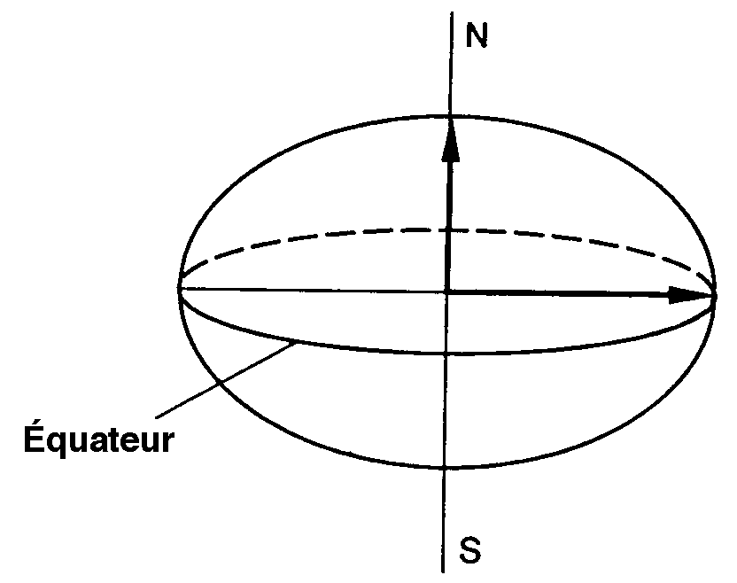

[#_6_7]
=== Mais où se trouve le Val d'Ili ? – Types de coordonnées

[#_6_7_1]
==== Quelques informations de base sur les types de coordonnées

La question « où ? » appelle une réponse liée à un lieu ponctuel du monde réel qu'il est possible de décrire au moyen de coordonnées. Par coordonnées, on entend généralement un couple de valeurs numériques, s'il s'agit de positions planimétriques ou un triplet s'il s'agit de positions dans l'espace, planimétrie et altimétrie.

Ainsi, il convient de définir, pour chacune des dimensions d'un type de coordonnées comme pour tout type numérique, le domaine dans lequel les valeurs admissibles peuvent évoluer de même que l'unité qui leur est associée.

[#listing-06_07-01]
.link:#listing-06_07-01[Listing 06.07-01]
[source]
----
Position: COORD 500.00 .. 91000.00 [m],
                 700.00 .. 23000.00 [m];

XPos: 500.00 .. 91000.00 [m];
YPos: 700.00 .. 23000.00 [m];
----

La différence existant entre un attribut de position auquel un type de coordonnées est associé et des attributs numériques séparés pour les directions X et Y semble réduite à première vue. La définition en tant que type de coordonnées met cependant clairement en lumière le fait que les deux informations sont liées. Cette propriété est mise à profit par des logiciels bien souvent conçus pour représenter graphiquement des cordonnées cartésiennes.

Des valeurs de coordonnées cartésiennes ? Par coordonnées cartésiennes, on désigne des coordonnées dont les dimensions sont perpendiculaires deux à deux. Ainsi, les coordonnées planimétriques précédemment définies décrivent-elle une fenêtre rectangulaire dont l'extension est d'environ 90 kilomètres selon X et 22 kilomètres selon Y. Cela signifie-t-il un retour au Moyen-Âge ? La Terre serait-elle redevenue un disque ?

[#_6_7_2]
==== L'enveloppe de la quetsche – Qu'est-ce qu'un système de coordonnées ?

Pour Ptolémée, la Terre était une sphère. Les topographes (ou plus exactement les géodésiens, dès lors qu'il s'agit des aspects les plus nobles de cette discipline) ont renoncé à cette idée voilà bien longtemps déjà, parce qu'elle est bien trop simpliste.

Une approximation bien plus probante de la forme de la Terre est livrée par une figure mathématique plus complexe, un ellipsoïde, générée par la rotation d'une ellipse autour de son axe principal.

.Une ellipse en rotation autour de son axe principal donne naissance à une figure géométrique en trois dimensions que l'on appelle un ellipsoïde et qui ressemble à une sphère aplatie. Cette figure fournit une bonne approximation de la forme de la Terre. +
 image:img/image32.png[]

(Toutes les figures de ce paragraphe et du paragraphe <<_6_7_5>> sont tirées de : K. Christoph Graf, Verwendung geodätischer Abbildungen bei der Geocodierung von Satelliten-Bil­dern. Zurich, 1988. Certaines des illustrations ont été simplifiées. Veuillez donc vous reporter à cet ouvrage pour les sources originales).

Selon les régions du monde considérées, les ellipsoïdes utilisés sont positionnés de manière différente, l'approximation devenant sinon trop imprécise. La Suisse recourt par exemple au même ellipsoïde que l'Allemagne, légèrement différent de celui utilisé en Suède ou en France.

S'agissant de figures spatiales, les ellipsoïdes sont toutefois difficiles à manipuler, raison pour laquelle les géodésiens les projettent sur une surface développable telle qu'un cylindre ou un cône qu'ils amènent en tangence avec l'ellipsoïde, un peu comme s'ils éclairaient l'ellipsoïde de l'intérieur et projetaient sa surface sur le cône ou le cylindre.

.L'ellipsoïde est ceint par un cylindre (à gauche) ou un cône (à droite). Il est ensuite comme « éclairé de l'intérieur ».
image::img/image33.png[] image:img/image34.png[]

Le cylindre ou le cône est ensuite développé, comme si on le découpait avec une paire de ciseaux et qu'on le déroulait à plat sur une table – et voilà, la carte est prête !

.Une fois la projection effectuée, le cylindre (ou le cône) est développé, autrement dit découpé puis déroulé. Une surface gauche comme celle d'un ellipsoïde ou d'une sphère peut être découpée mais pas déroulée à plat, elle n'est pas développable.
image::img/image35.png[]

La carte est enfin recouverte d'un réseau de fines lignes perpendiculaires les unes aux autres : le *système de coordonnées* de la carte. En conséquence, le système de coordonnées sur lequel se fonde le type de coordonnées retenu est également à indiquer.

[#listing-06_07-02]
.link:#listing-06_07-02[Listing 06.07-02]
[source]
----
Pos: COORD 480000 .. 850000.00 [m] {SysBeotie[1]},
           60000 .. 320000.00 [m] {SysBeotie[2]};
----

La première coordonnée correspond au premier axe du système de coordonnées intitulé « SysBeotie », tandis que la seconde coordonnée correspond au second axe du même système.

[#_6_7_3]
==== Informations relatives au système de coordonnées – Métadonnées

« SysBeotie » est-il un système cartésien ? Ellipsoïdique ? Comment s'appellent ses axes ? Existe-t-il des liens (tels que des projections cartographiques) vers d'autres systèmes de coordonnées ? Toutes ces informations peuvent à leur tour être décrites au moyen de données. Un modèle de données est également formulé les concernant, afin que la manière dont elles sont structurées soit claire. Un tel modèle de données est appelé un métamodèle et les données associées des métadonnés parce qu'elles ont pour fonction de décrire les données effectives.

Les données relatives à un métamodèle sont dites « méta- » englobantes en quelque sorte, mais le sens donné ici à cette désignation est différent et plus formel que lorsqu'il s'agit du prix ou de la provenance (cf. § <<_3_3>>). Malheureusement, la même désignation est indistinctement utilisée dans les deux cas.

Dans les cas les plus simples, où le système de coordonnées auquel se réfèrent les coordonnées est sans ambiguïté, en raison du champ d'application et du domaine d'utilisation du modèle de données, il peut être renoncé à l'indication explicite de cette information. Il est toutefois judicieux de laisser transparaître le système de coordonnées, ne serait-ce que dans le nom du type des coordonnées.

[#listing-06_07-03]
.link:#listing-06_07-03[Listing 06.07-03]
[source]
----
CoordNational = COORD 500.00 .. 91000.00 [m],
                      700.00 .. 23000.00 [m];

Pos: CoordNational;
----

Les Ilinois ont préféré recourir à une définition précise pour exclure tout risque de confusion :

[#listing-06_07-04]
.link:#listing-06_07-04[Listing 06.07-04]
[source]
----
REFSYSTEM BASKET CoordSystems ~ CoordSys.CoordsysTopic
  OBJECTS OF GeoCartesian2D: SysBeotie;
----

Ils ont défini leur système sur la base du modèle général de systèmes de coordonnées (CoordSys). C'est pourquoi un objet de la classe GeoCartesian2D, du nom de SysBeotie, a été introduit pour la planimétrie au sein des données correspondantes. L'existence de cette entrée de données est signalée dans le modèle par OBJECTS OF, de sorte que le système de coordonnées "SysBeotie" y est ainsi disponible. Lors de l'utilisation du système, le nom de l'ensemble de métadonnées (CoordSystems) ne doit être mentionné que si plusieurs ensembles de ce type sont définis dans la partie concernée de la modélisation.

[#listing-06_07-05]
.link:#listing-06_07-05[Listing 06.07-05]
[source]
----
CoordNational = COORD 500.00 .. 91000.00 [m] {CoordSystems.SysBeotie[1]},
                      700.00 .. 23000.00 [m] {CoordSystems.SysBeotie[2]};
----

[#_6_7_4]
==== Différents systèmes de coordonnées

Les Ilinois souhaiteraient également proposer leurs coordonnées sous forme de coordonnées géographiques exprimées dans le système mondial WGS84 afin qu'un service spécifique puisse être offert aux touristes disposant d'un capteur GPS basique.

[#listing-06_07-06]
.link:#listing-06_07-06[Listing 06.07-06]
[source]
----
WGS84Coord = COORD -90.00000 .. 90.00000 [Angle_Degree] {WGS84[1]},
                   0.00000 .. 359.99999 CIRCULAR [Angle_Degree]
                   {WGS84[2]};

CLASS RemonteeMecanique =
  PosStationInf: CoordNational;
  PosStationInfWGS: WGS84Coord;
  ....
END RemonteeMecanique;
----

Il est cependant manifeste qu'un lien direct unit les deux attributs. Les coordonnées nationales peuvent être converties en coordonnées WGS84. La définition détaillée d'une telle conversion n'est toutefois pas du ressort de la description conceptuelle des données. Mais il est souhaitable d'indiquer que ces coordonnées peuvent être déduites les unes des autres par voie de calcul.

[#listing-06_07-07]
.link:#listing-06_07-07[Listing 06.07-07]
[source]
----
!! Conversion de coordonnees du systeme national beotien en WGS84.
!! Les fonctions sont abordees au paragraphe 7.2.
FUNCTION BeotieVersWGS84 (Bo: Beotie.CoordNational): WGS84Coord;

CLASS RemonteeMecanique =
  PosStationInf: Beotie.CoordNational;
  WGSStationInferieure: WGS84Coord := BeotieVersWGS84 (PosStationInf);
  ....
END RemonteeMecanique;
----

[#_6_7_5]
==== Coordonnées tridimensionnelles

Il va de soi que les skieurs et les randonneurs évoluant autour de la Dent d'Ili ne peuvent se satisfaire de coordonnées planimétriques. Si le coeur des skieurs se met à battre la chamade dès lors qu'on leur annonce de fortes dénivelées, une sourde angoisse étreint celui des randonneurs, la sueur leur perle sur le front et leurs genoux se dérobent soudain sous eux. Qu'elles soient synonymes de bonnes ou de mauvaises nouvelles, tout le monde veut connaître les altitudes ! En conséquence, les types de cordonnées peuvent également présenter trois dimensions.

[#listing-06_07-08]
.link:#listing-06_07-08[Listing 06.07-08]
[source]
----
CoordNational3 = COORD 500.00 .. 91000.00 [m] {SysBeotie[1]},
                       700.00 .. 23000.00 [m] {SysBeotie[2]},
                       0.00 .. 9000.00 [m] {SysBeotieAlt[1]};

WGS84Coord = COORD -90.00000 .. 90.00000 [Angle_Degree] {WGS84[1]},
                   0.00000 .. 359.99999 CIRCULAR [Angle_Degree]
                   {WGS84[2]},
                   -2000.00 .. 9000.00 [m] {WGS84A[1]};
----

Les altitudes posent en outre un problème particulier : où se trouve l'altitude 0 ? Et comment déterminer l'altitude d'un point par rapport à cette cote 0 ? Les géodésiens établissent une distinction fondamentale entre les altitudes rapportées au champ de pesanteur terrestre (altitudes dites orthométriques ; l'altitude 0 peut être assimilée au niveau moyen des mers prolongé sous les continents) et celles rapportées à la figure géométrique modélisant la forme de la Terre, l'ellipsoïde (altitude ellipsoïdique ; l'altitude 0 correspond à la surface de l'ellipsoïde).

.Le champ de pesanteur terrestre : le niveau moyen des mers est prolongé sous les continents dans le cas du géoïde. Les massifs montagneux, les fosses marines, etc. in­fluencent le champ de pesanteur et déforment ainsi la surface de référence imaginée. L'échelle altimétrique est fortement amplifiée sur la représentation.
image::img/image36.png[]

.L'altitude associée au point Q varie en fonction du système de référence considéré.
image::img/image37.png[]

D'ordinaire, les systèmes de coordonnées nationaux utilisent des altitudes orthométriques. Ainsi, la troisième dimension des coordonnées nationales ne se rapporte-t-elle pas simplement au troisième axe du système national, mais au premier axe d'un système altimétrique particulier.

En revanche, la détermination des coordonnées repose uniquement sur la géométrie de la position des satellites dans le cas d'observations GPS, sans que le champ de pesanteur terrestre vienne jouer le moindre rôle. Les altitudes WGS84 sont donc des altitudes ellipsoïdiques.

image::img/image38.png[] +
.L'écart entre altitude orthométrique et altitude ellipsoïdique peut atteindre plusieurs mètres. Les représentations graphiques ci-dessus indiquent les différences enregistrées par rapport à l'ellipsoïde usuel en Suisse, en France et dans l'ouest de l'Allemagne.
image::img/image39.png[] image:img/image40.png[]

La conversion entre altitudes orthométriques et altitudes ellipsoïdiques peut poser problème dans des zones où le champ de pesanteur terrestre perd son homogénéité. Mais ces questions sont de peu d'importance au stade de la modélisation, ce qui ne signifie pas pour autant qu'il faille les en exclure totalement.

[#_6_8]
