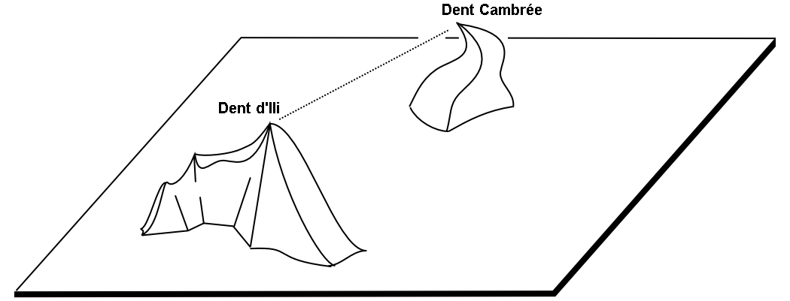
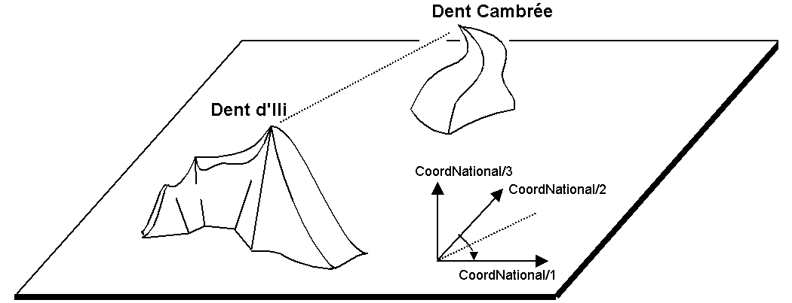

[#_6_8]
=== Le 0 est-il plein nord ? – Définitions relatives aux angles et aux directions

Comment exprimer un angle droit ? Par 90 degrés ou par pi / 2 ? Il ne s'agit que d'une question d'unité. Mais quand un angle est-il considéré comme étant positif et quand comme étant négatif ? Le sens de rotation (horaire ou anti-horaire) fait par conséquent partie de la définition d'un type d'angle.

[#listing-06_08-01]
.link:#listing-06_08-01[Listing 06.08-01]
[source]
----
DOMAIN
  AngleDansLeSensHoraire = -179 .. 180 CIRCULAR CLOCKWISE;
  AngleDansLeSensAnti-horaire = -179 .. 180 CIRCULAR COUNTERCLOCKWISE;
----

Lorsque nous nous trouvons au sommet de la Dent d'Ili, nous aimerions bien savoir dans quelle direction chercher la Dent Cambrée. A 50 degrés ? A 40 degrés ? Ou plutôt à 310 ?

.Quiconque se donne la peine de monter au sommet de la Dent d'Ili est récompensé de ses efforts par la vue exceptionnelle qui s'offre alors à lui. Mais dans quelle direction peut-on contempler la Dent Cambrée ? Si le système de coordonnés de référence n'est pas clairement indiqué dans la question, aucune réponse ne peut lui être apportée.

En effet, tout dépend de la direction origine et du sens de rotation des directions. Autrement dit, lorsqu'il est question de directions, il doit toujours être question également de systèmes de référence. Les directions sont par conséquent étroitement liées aux types de coordonnées. Il est par ailleurs parfaitement logique de déterminer à la fois la distance et la direction séparant deux points définis par leurs coordonnées.

.L'indication des axes et du sens de rotation fait partie intégrante de la définition d'un système de coordonnées.

[#listing-06_08-02]
.link:#listing-06_08-02[Listing 06.08-02]
[source]
----
CoordNational3 = COORD 500.00 .. 91000.00 [m] {SysBeotie[1]},
                       700.00 .. 23000.00 [m] {SysBeotie[2]},
                       -200.00 .. 14000.00 [m] {SysBeotieAlt[1]},
                       ROTATION 2 -> 1;

Direction = 0.0 .. 359.9 CIRCULAR [Angle_Degre] {SysBeotie};
----

[#_6_9]
