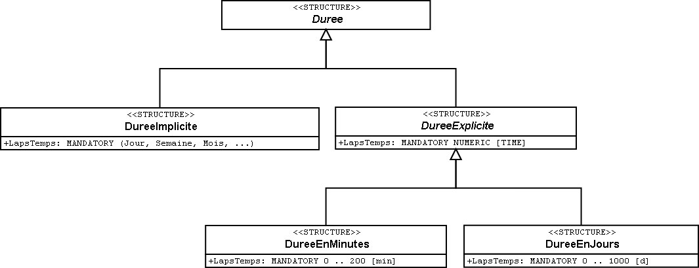

[#_6_12]
=== A l'heure ilinoise – Modélisation du temps

[#_6_12_1]
==== Une solution simple, convenant aux exigences modestes

L'Association nationale a prévu une solution simple, fondée sur un attribut pour la durée de validité des types de billets, basé sur le nombre de jours (avec un chiffre après la virgule).

[#listing-06_12-01]
.link:#listing-06_12-01[Listing 06.12-01]
[source]
----
DureeValidite : 0.0 .. 1000.0 [d];
----

Différentes questions se posent toutefois si l'on regarde les choses d'un peu plus près, comme les Ilinois comptent bien le faire :

* Un billet valable le jour de son émission n'a pas la même durée de validité qu'un billet valable durant 24 heures.
* Les mois ne sont pas tous de durée égale (28, 29, 30 ou 31 jours, suivant les cas).
* Les années peuvent compter 365 ou 366 jours.

A ces questions posées par les Ilinois, l'Association nationale a apporté les réponses suivantes :

* Durée de validité d'un billet émis le jour de son utilisation : 0.9 jour ;
* Durée d'un mois : 30.0 jours ;
* Durée d'une année : 365.0 jours.

[WARNING]
Il peut être tentant de recourir à ce genre d'expédients qui semblent simples au premier abord. Mais qu'en est-il si par 30.0 jours, on entend vraiment ce nombre de jours et ne sous-entend pas qu'il s'agit d'un mois ? La prudence est donc de mise !

A quoi pourrait alors ressembler une meilleure solution ?

[#_6_12_2]
==== La durée en tant que structure

Des propriétés d'objets telles que la durée de validité ne peuvent pas toujours être décrites avec une précision suffisante par une valeur unique. Un groupe d'attributs est parfois requis et il peut même être judicieux de prévoir des extensions. La structure sert à cela.

[#listing-06_12-02]
.link:#listing-06_12-02[Listing 06.12-02]
[source]
----
STRUCTURE Duree (ABSTRACT) =
END Duree;

STRUCTURE DureeAujourdHui EXTENDS Duree =
END DureeAujourdHui;

STRUCTURE DureeEnJours EXTENDS Duree =
  Duree: MANDATORY Jours [d];
END DureeEnJours;

....

CLASS TypeBillet =
  DureeValidite: Duree;
END TypeBillet;
----

La durée de validité d'un type de billet donné est décrite par une instance (un élément structuré) de la structure DureeAujourdHui, DureeEnJours, DureeEnMois, etc. On pourrait même préciser la modélisation un peu plus en veillant à ce que l'unité d'un laps de temps explicite (jour, mois, etc.) soit toujours une durée et en définissant une énumération pour les durées implicites (semaine, saison, etc.) :

[#listing-06_12-03]
.link:#listing-06_12-03[Listing 06.12-03]
[source]
----
STRUCTURE Duree (ABSTRACT) =
END Duree;

STRUCTURE DureeImplicite EXTENDS Duree =
  LapsTemps: MANDATORY (Jour, Semaine, Mois, Annee);
END DureeImplicite;

STRUCTURE DureeExplicite (ABSTRACT) EXTENDS Duree =
  LapsTemps (ABSTRACT): MANDATORY NUMERIC [TIME];
END DureeExplicite;

STRUCTURE DureeEnMinutes EXTENDS DureeExplicite =
  LapsTemps (EXTENDED): MANDATORY 0 .. 200 [Units.min];
END DureeEnMinutes;

STRUCTURE DureeEnJours EXTENDS DureeExplicite =
  LapsTemps (EXTENDED): MANDATORY 0 .. 1000 [d];
END DureeEnJours;
----

.Modélisation détaillée des durées à l'aide de structures. Il est ainsi possible que la durée de validité d'un billet soit d'un mois (DureeImplicite; à gauche) ou de trente jours exactement (DureeEnJours; à droite), selon les besoins.

[WARNING]
Une modélisation précise, détaillée et appropriée est fondamentalement à privilégier. Il faut cependant avoir conscience du fait qu'elle n'est judicieuse que si elle peut être mise en pratique. Que cela signifie-t-il pour les logiciels ? Et plus encore : que cela signifie-t-il pour les personnes amenées à saisir et à traiter les données ? Et inversement : quelles sont les implications d'un écart par rapport au modèle correct ? Dans certaines circonstances, il peut donc être plus sage de se satisfaire de la solution simple préconisée précédemment.

[#_6_12_3]
==== Durée précise

Les durées ne concernent pas uniquement les billets. Tous les vendredis, les Ilinois organisent une compétition de ski ouverte aux hôtes de la station. Les temps de parcours sont mesurés en minutes, secondes et centièmes de secondes. Il est tout naturel de définir une structure à cette fin, présentant les attributs Minutes et Secondes :

[#listing-06_12-04]
.link:#listing-06_12-04[Listing 06.12-04]
[source]
----
STRUCTURE DureeEnMinutes EXTENDS Duree =
  Minutes: 0 .. 9999.99 [min];
  Secondes: 0.00 .. 59.99 [s];
END DureeEnMinutes;
----

Afin que le lien entre les minutes et les secondes puisse être exprimé, une possibilité supplémentaire est proposée :

[#listing-06_12-05]
.link:#listing-06_12-05[Listing 06.12-05]
[source]
----
STRUCTURE DureeEnMinutes EXTENDS Duree =
  Minutes: 0 .. 9999.99 [min];
  CONTINOUS SUBDIVISION Secondes: 0.00 .. 59.99 [s];
END DureeEnMinutes;
----

Aucune indication n'est fournie sur la manière dont de telles durées peuvent être mémorisées par un ordinateur. Il ne s'agit que d'un moyen destiné à décrire ce que l'on souhaite, au plus près possible du concept.

[#_6_12_4]
==== Représentation formatée de structures

La compétition de ski ouverte aux hôtes de la station est toujours organisée de telle façon que même les moniteurs de ski aient besoin de plus de trente secondes pour la descente. Quant aux concurrents qui rejoignent la ligne d'arrivée en plus de trois minutes et trente secondes, un thé leur est offert pour les réchauffer mais leur temps n'est pas pris en compte.

Comment le domaine des valeurs admissibles (de 30 secondes à 3 minutes et 30 secondes) peut-il à présent être défini ? La solution réside dans des domaines de valeurs formatés :

[#listing-06_12-06]
.link:#listing-06_12-06[Listing 06.12-06]
[source]
----
DOMAIN DureeenMinSec = FORMAT BASED ON DureeenMinutes
  ( Minutes ":" Secondes );

CLASS TempsDescente =
  Prenom: TEXT*50;
  Nom: TEXT*50;
  TempsParcours: FORMAT DureeenMinSec "0:30" .. "3:30";
END TempsDescente;
----

Un domaine de valeurs formaté prend appui sur une structure et indique comment une chaîne de caractères reproduisant la valeur résulte des différents attributs de la structure et de constantes textuelles. Des restrictions de domaines de valeurs peuvent être définies sous cette forme. La représentation formatée est également utilisée pour le transfert de données. Il est ainsi possible, au moins partiellement, d'accepter directement certaines formes de représentation requises en externe. Ce recours peut notamment être utilisé pour la représentation conforme à XML de durées et d'instants.

[#_6_12_5]
==== Instants

Les messages d'état relatifs à la météo, aux délais d'attente ou à l'état des pistes diffusés dans le Val d'Ili doivent toujours faire mention de l'instant auquel l'état correspondant a été enregistré. D'emblée, on songe à fournir cette indication en heures et en minutes. Puis, après réflexion, on se rend compte qu'il faut y adjoindre la date, afin que des exploitations statistiques soient possibles. Cela devrait faire l'affaire !

Vraiment ? Les nuits de pleine lune, lorsque le temps est clair, les Remontées mécaniques de la Dent d'Ili proposent un service exceptionnel jusqu'au sommet de la station afin que la nuit Dracula, très prisée des noctambules, puisse s'y dérouler. Mais les messages d'état n'en ont cure : nuit Dracula ou pas, ils sont transmis à toute heure. Même à 2h30. Et un certain dimanche matin, celui où l'on passe de l'heure d'été à l'heure d'hiver, le message de 2h30 a semé un joyeux désordre : il était antérieur au précédent ! C'est normal, toutes les heures comprises entre 2h00 et 3h00 sont indiquées deux fois cette nuit-là, une fois en heure d'été et une fois en heure d'hiver.

[NOTE]
Il est primordial, pour toute indication horaire, de connaître le système de référence auquel elle se rapporte.

Dans quel système nous exprimons-nous : en heure d'été, en heure d'hiver, en UTC ? A tout prendre, mieux vaut alors qu'il soit largement reconnu au plan international ! On en vient donc rapidement à penser que tout pourrait être exprimé en UTC et que l'on pourrait laisser le soin à l'ordinateur de présenter ses données à l'utilisateur dans le fuseau (la zone) qui est le sien.

INTERLIS 2 offre la possibilité de décrire non seulement le domaine de valeurs et l'unité mais également le système de référence. Pour les heures UTC, des domaines de valeurs déjà formatés sont prédéfinis dans le respect des règles XML (XMLTime, XMLDate, XMLDateTime).

Il est pourtant préférable d'exprimer les heures d'ouverture ou l'horaire de service en heure locale. Minuit sera toujours à 0h00, en heure d'hiver comme en heure d'été. Mais il ne s'agit pas là de véritables instants, plutôt de la description d'écarts par rapport à minuit, en fonction de l'heure légale actuelle.

[WARNING]
La prudence la plus extrême doit être de mise lorsque l'heure et en particulier des instants bien définis jouent un rôle crucial.

[#_6_13]
